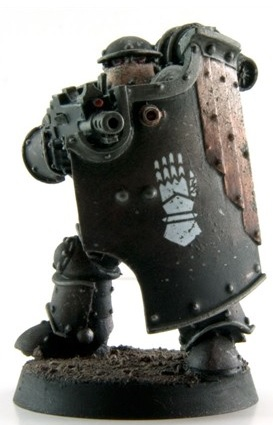
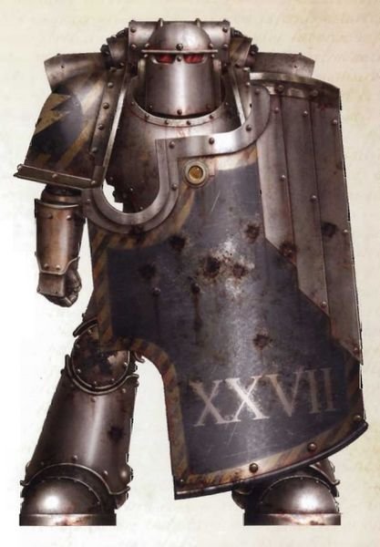
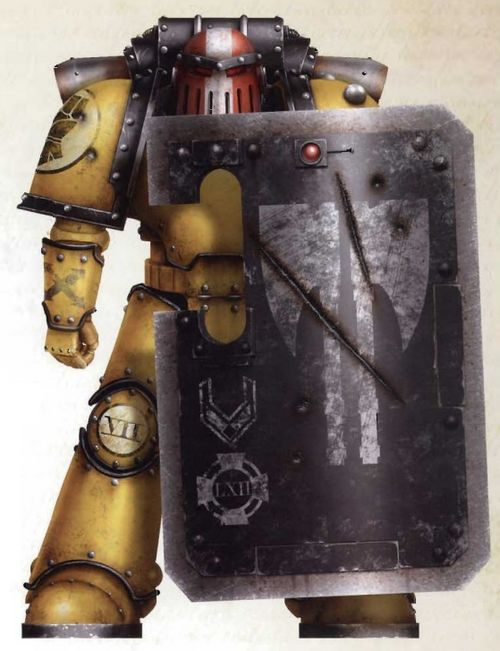

# 0204 攻坚者 Breacher Siege

精校状态：中文行文已逐段精校，部分术语仍为暂定

分类：通用概念 / 帝国 Imperium / 中央政务部 Adeptus Terra / 星际战士军团 Space Marine Legion

原文来源：https://www.bilibili.com/opus/1019190130115608598

原作者：帝国神选罐头

原文时间：编辑于 2025年01月20日 15:07

[返回分类目录](目录.md) · [全书目录](../../目录.md)

原篇名：攻城破坏者 Breacher Siege

<!-- A0204-B0001 -->
**英文原文**

Breacher Siege Space Marines were a type of specialist Space Marine infantry squad used during the Great Crusade and Horus Heresy.

<!-- /A0204-B0001 -->

<!-- A0204-B0002 -->

原译文

星际战士攻城破坏者是在大远征和荷鲁斯叛乱期间使用的一种专业星际战士步兵小队。

**校订译文**

攻坚者是大远征和荷鲁斯之乱时期使用的一类专业星际战士步兵小队。

**校注：** Breacher 为执行跳帮和攻城突破任务的攻坚者，按主审统一；与 Devastator 官方破坏者区分。源篇名 Breacher Siege 英文词序原样保留。

<!-- /A0204-B0002 -->

<!-- A0204-B0003 图片 -->

<!-- A0204-B0004 -->

原译文

Breacher Siege 攻城破坏者

**校订译文**

Breacher Siege 攻坚者

<!-- /A0204-B0004 -->

<!-- A0204-B0005 -->
**英文原文**

These troops were specially trained and equipped for hazardous assault operations such as boarding enemy vessels or launching the first wave of attack on fortifications. They were commonly equipped with heavy Boarding Shields and specialized assault weapons such as Graviton Guns, Lascutters, Volkite Chargers, Flamers, and Melta guns.

<!-- /A0204-B0005 -->

<!-- A0204-B0006 -->

原译文

这些部队经过专门训练和配备，可以进行危险的突击行动，如登上敌方船只或对防御工事发动第一波攻击。他们通常配备重型跳帮盾和专门的突击武器，如重力炮、激光切割枪、爆燃突击铳、火焰枪和热熔枪。

**校订译文**

这些部队经过专门训练和配备，可以进行危险的突击行动，如登上敌方船只或对防御工事发动第一波攻击。他们通常配备重型跳帮盾和专门的突击武器，如重力炮、激光切割枪、爆燃突击铳、火焰喷射器和热熔枪。

<!-- /A0204-B0006 -->

<!-- A0204-B0007 图片 -->

<!-- A0204-B0008 -->

原译文

Iron Warriors Breacher Legionary 钢铁勇士破坏者军团士兵

**校订译文**

Iron Warriors Breacher Legionary 钢铁勇士攻坚者军团士兵

<!-- /A0204-B0008 -->

<!-- A0204-B0009 -->
**英文原文**

They could wear special issue MKIII "void hardened' armour, allowing them to fight in low-oxygen environments such as boarding a damaged spaceship in deep space.

<!-- /A0204-B0009 -->

<!-- A0204-B0010 -->

原译文

他们可以穿上特别供给的MKIII“硬化虚空”盔甲，使他们能够在低氧环境中作战，例如在太空登上受损的太空舰船。

**校订译文**

他们可穿戴经过虚空作战强化的特配 MK III 型盔甲，在低氧环境中战斗，例如于深空登上受损舰船。

<!-- /A0204-B0010 -->

<!-- A0204-B0011 -->
## Variations 变体

<!-- /A0204-B0011 -->

<!-- A0204-B0012 -->
**英文原文**

Phalanx Warder - Imperial Fists

<!-- /A0204-B0012 -->

<!-- A0204-B0013 -->

原译文

山阵卫队 - 帝国之拳

**校订译文**

山阵卫队 - 帝国之拳

<!-- /A0204-B0013 -->

<!-- A0204-B0014 图片 -->

<!-- A0204-B0015 -->

原译文

Imperial Fists Breacher Sergeant 帝国之拳破坏者军士

**校订译文**

Imperial Fists Breacher Sergeant 帝国之拳攻坚者军士

<!-- /A0204-B0015 -->

<!-- A0204-B0016 -->
**英文原文**

Medusan Immortals - Iron Hands

<!-- /A0204-B0016 -->

<!-- A0204-B0017 -->

原译文

美杜莎不朽者 - 钢铁之手

**校订译文**

美杜莎不朽者 - 钢铁之手

<!-- /A0204-B0017 -->

<!-- A0204-B0018 -->
**英文原文**

Praetorian Breacher Squad - Ultramarines

<!-- /A0204-B0018 -->

<!-- A0204-B0019 -->

原译文

禁卫军破坏者小队 - 极限战士

**校订译文**

禁卫军攻坚小队 - 极限战士

<!-- /A0204-B0019 -->

本篇核心术语与暂定项

以下列出本篇出现的英文原形及核心术语表用词。同形词可能指不同对象，具体词义以本篇正文和校注为准；单复数、别名和仅见于图注的名称可能尚未列入。完整候选见[术语表](../../术语表/双语术语候选.csv)。

| 英文 | 采用中文 | 状态 |
| --- | --- | --- |
| Space Marines | 星际战士 | 官方已核对 |
| Ultramarines | 极限战士 | 官方已核对 |
| Horus Heresy | 荷鲁斯之乱 | 官方已核对 |
| Imperial Fists | 帝国之拳 | 暂定 |
| Phalanx | 山阵号 | 暂定 |
| Great Crusade | 大远征 | 暂定·官方待核 |
| Horus | 荷鲁斯 | 暂定·官方待核 |
| Iron Hands | 钢铁之手 | 暂定·官方待核 |
| Praetorian | 禁卫兵 | 暂定·官方待核 |
| Breacher Siege | 攻坚者 | 暂定·官方待核 |
| Phalanx Warder | 山阵卫队 | 暂定·官方待核 |
| Medusan Immortals | 美杜莎不朽者 | 暂定·官方待核 |
| Praetorian Breacher Squad | 禁卫军攻坚小队 | 暂定·官方待核 |
| Space Marine | 星际战士 | 暂定·官方待核 |
| Breacher Squad | 攻坚小队 | 暂定·官方待核 |
| Flamers | 火妖（奸奇单位）／火焰喷射器（武器） | 语境定译·对应官译已核 |
| Immortals | 不朽者 | 官方已核对 |

