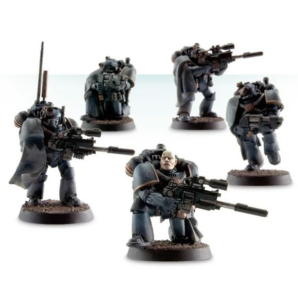

# 0205 侦察小队 Reconnaissance Squad

精校状态：中文行文已逐段精校，部分术语仍为暂定

分类：通用概念 / 帝国 Imperium / 中央政务部 Adeptus Terra / 星际战士军团 Space Marine Legion

原文来源：https://www.bilibili.com/opus/1032514269749444615

原作者：帝国神选罐头

原文时间：2025年02月11日 10:02

[返回分类目录](目录.md) · [全书目录](../../目录.md)

原篇名：侦查小队 Reconnaissance Squad

<!-- A0205-B0001 -->
**英文原文**

Reconnaissance Squads were a type of Space Marine Legion squad used during the Great Crusade and Horus Heresy.

<!-- /A0205-B0001 -->

<!-- A0205-B0002 -->

原译文

侦查小队是大远征和荷鲁斯叛乱期间使用的一种星际战士小队。

**校订译文**

侦察小队是大远征和荷鲁斯之乱时期，星际战士军团的一种小队编制。

<!-- /A0205-B0002 -->

<!-- A0205-B0003 -->
## Overview 概述

<!-- /A0205-B0003 -->

<!-- A0205-B0004 -->
**英文原文**

The eyes and ears of a Legion on the battlefield, these squads consisted of experienced Space Marines expert in operating independently and often behind enemy lines. They were armed and equipped for the task with a variety of specialized weapons such as long-range Sniper Rifles, sensory-auspices, and stealth equipment. The primary mission of Reconnaissance Squads was to perform scouting and intelligence-gathering operations, identify targets and gather information on enemy forces. They also served as the Legion's pickets, saboteurs, raiders, and snipers where needed, and in open battle were expert in sudden flanking manoeuvres and infiltration attacks in support of their main force.

<!-- /A0205-B0004 -->

<!-- A0205-B0005 -->

原译文

这些小队是战场上军团的眼睛和耳朵，由经验丰富的星际战士专家组成，他们独立作战，经常在敌后作战。他们为执行任务配备了各种专用武器，如远程狙击步枪、感知占卜和隐形设备。侦查小队的主要任务是执行侦察和情报收集行动，识别目标并收集敌军信息。他们还担任军团的警戒队、破坏者、袭击者和狙击手，在需要的地方，在旷野战斗中，他们擅长突然的侧翼机动和渗透攻击，以支援他们的主力部队。

**校订译文**

侦察小队是军团在战场上的耳目，由经验丰富、擅长独立行动的星际战士组成，经常深入敌后。他们配备远程狙击步枪、探测仪与隐蔽设备等专用装备，主要负责侦察、收集情报、识别目标和摸清敌军情况。必要时，他们也担任警戒哨、破坏者、袭击者和狙击手；在正面会战中，则擅长突然迂回敌军侧翼或发动渗透攻击，支援主力。

<!-- /A0205-B0005 -->

<!-- A0205-B0006 图片 -->

<!-- A0205-B0007 -->

原译文

Reconnaissance Marine Squad 侦查战士小队

**校订译文**

Reconnaissance Marine Squad 侦察战士小队

<!-- /A0205-B0007 -->

<!-- A0205-B0008 -->
**英文原文**

Reconnaissance Squads differ from Scouts of the 41st Millennium in that their members were drawn from fully sworn and trained Battle-Brothers, not Neophytes.

<!-- /A0205-B0008 -->

<!-- A0205-B0009 -->

原译文

侦查小队与第41个千年侦察兵的不同之处在于，他们的成员来自完全宣誓和训练有素的战斗兄弟，而不是新兵。

**校订译文**

这些侦察小队不同于第 41 千年的侦察兵：成员都是完成训练并正式宣誓的战斗兄弟，而非新进者。

<!-- /A0205-B0009 -->

<!-- A0205-B0010 -->
## Notable Reconnaissance Marines 著名侦察战士

原题：Notable Reconnaissance Marines 著名侦查战士

<!-- /A0205-B0010 -->

<!-- A0205-B0011 -->
**英文原文**

Barthusa Narek - Word Bearers

<!-- /A0205-B0011 -->

<!-- A0205-B0012 -->

原译文

巴图萨·纳瑞克 - 怀言者

**校订译文**

巴图萨·纳瑞克 - 怀言者

<!-- /A0205-B0012 -->

本篇核心术语与暂定项

以下列出本篇出现的英文原形及核心术语表用词。同形词可能指不同对象，具体词义以本篇正文和校注为准；单复数、别名和仅见于图注的名称可能尚未列入。完整候选见[术语表](../../术语表/双语术语候选.csv)。

| 英文 | 采用中文 | 状态 |
| --- | --- | --- |
| Space Marines | 星际战士 | 官方已核对 |
| Horus Heresy | 荷鲁斯之乱 | 官方已核对 |
| Equipment | 装备 | 编辑用语已统一 |
| Word Bearers | 怀言者 | 暂定·官方待核 |
| Great Crusade | 大远征 | 暂定·官方待核 |
| Horus | 荷鲁斯 | 暂定·官方待核 |
| Reconnaissance Squads | 侦察小队 | 暂定·官方待核 |
| Mission | 教团／传教机构 | 暂定 |
| Space Marine Legion | 星际战士军团 | 暂定·官方待核 |
| Barthusa Narek | 巴图萨·纳瑞克 | 暂定·官方待核 |
| Space Marine | 星际战士 | 暂定·官方待核 |

