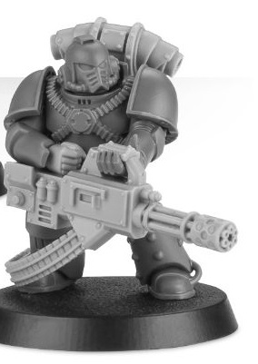

# 0206 战术支援小队 Tactical Support Squad

精校状态：中文行文已逐段精校，部分术语仍为暂定

分类：通用概念 / 帝国 Imperium / 中央政务部 Adeptus Terra / 星际战士军团 Space Marine Legion

原文来源：https://www.bilibili.com/opus/1035086525682941961

原作者：帝国神选罐头

原文时间：2025年02月18日 08:24

[返回分类目录](目录.md) · [全书目录](../../目录.md)

<!-- A0206-B0001 -->
**英文原文**

Tactical Support Squads were a type of Space Marine Legion squad used during the Great Crusade and Horus Heresy era.

<!-- /A0206-B0001 -->

<!-- A0206-B0002 -->

原译文

战术支援小队是大远征和荷鲁斯叛乱时时期使用的一种星际战士小队。

**校订译文**

战术支援小队是大远征和荷鲁斯之乱时期，星际战士军团的一种小队编制。

<!-- /A0206-B0002 -->

<!-- A0206-B0003 -->
**英文原文**

These mobile fire-support units replaced their standard Bolters with more specialized weapons such as Rotor Cannons, Volkite Culverins, Plasma Guns, Flamers, and Melta guns. Tactical Support Squads operate in close order with their respective Legion's other troops, their supporting firepower enabling a Space Marine force to act with even more versatility and engage a wider range of targets on its own terms.

<!-- /A0206-B0003 -->

<!-- A0206-B0004 -->

原译文

这些机动火力支援部队用更专业的武器取代了标准的爆矢枪，如旋转炮、爆燃长炮、等离子枪、火焰枪和热熔枪。战术支援小队与各自军团的其他部队密切合作，他们的支援火力使星际战士能够以更灵活的方式行动，并根据自己的条件打击更广泛的目标。

**校订译文**

这些机动火力支援部队不用制式爆矢枪，而改配转管炮、爆燃长炮、等离子枪、火焰喷射器或热熔枪等专用武器。他们紧密配合军团其他部队，以支援火力扩大星际战士的战术选择，使其能在有利条件下应对更多种类的目标。

<!-- /A0206-B0004 -->

<!-- A0206-B0005 图片 -->

<!-- A0206-B0006 -->

原译文

Tactical Support Marine with Rotor Cannon 装备旋转炮的战术星际战士

**校订译文**

Tactical Support Marine with Rotor Cannon 装备转管炮的战术支援战士

<!-- /A0206-B0006 -->

本篇核心术语与暂定项

以下列出本篇出现的英文原形及核心术语表用词。同形词可能指不同对象，具体词义以本篇正文和校注为准；单复数、别名和仅见于图注的名称可能尚未列入。完整候选见[术语表](../../术语表/双语术语候选.csv)。

| 英文 | 采用中文 | 状态 |
| --- | --- | --- |
| Horus Heresy | 荷鲁斯之乱 | 官方已核对 |
| Great Crusade | 大远征 | 暂定·官方待核 |
| Horus | 荷鲁斯 | 暂定·官方待核 |
| Space Marine Legion | 星际战士军团 | 暂定·官方待核 |
| Space Marine | 星际战士 | 暂定·官方待核 |
| Flamers | 火妖（奸奇单位）／火焰喷射器（武器） | 语境定译·对应官译已核 |

