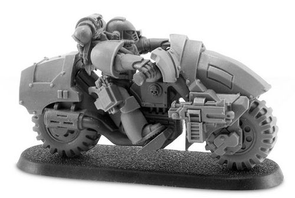

# 0207 先遣者 Outrider

精校状态：中文行文已逐段精校，部分术语仍为暂定

分类：通用概念 / 帝国 Imperium / 中央政务部 Adeptus Terra / 星际战士军团 Space Marine Legion

原文来源：https://www.bilibili.com/opus/1034371147310825473

原作者：帝国神选罐头

原文时间：2025年02月16日 10:08

[返回分类目录](目录.md) · [全书目录](../../目录.md)

<!-- A0207-B0001 -->
**英文原文**

Outriders were a type of specialist Space Marine squad used during the Great Crusade and Horus Heresy.

<!-- /A0207-B0001 -->

<!-- A0207-B0002 -->

原译文

先遣者是一种在大远征和荷鲁斯叛乱期间使用的专业星际战士小队。

**校订译文**

先遣者是大远征和荷鲁斯之乱时期的一类专业星际战士小队。

<!-- /A0207-B0002 -->

<!-- A0207-B0003 -->
## Overview 概述

<!-- /A0207-B0003 -->

<!-- A0207-B0004 -->
**英文原文**

Outriders were specialized and mechanized reconnaissance squads commonly transported in Bikes and scramblers designed for use on rugged terrain. Used primarily for rapid encirclement and hit-and-run attacks, the chief advantage of Outriders is speed and the ability to go where heavier vehicles could not.

<!-- /A0207-B0004 -->

<!-- A0207-B0005 -->

原译文

先遣者是专业的、机械化的侦查小队，通常用摩托和为在崎岖地形上使用而设计的攀爬摩托运输。先遣者主要用于快速包围和跑打攻击，其主要优势是速度和前往重型车辆无法到达的地方的能力。

**校订译文**

先遣者是专门的机械化侦察部队，通常骑乘摩托或适合崎岖地形的越野摩托。他们主要执行快速包抄与袭扰任务，优势在于速度快，能够抵达重型车辆无法通行的地区。

<!-- /A0207-B0005 -->

<!-- A0207-B0006 图片 -->

<!-- A0207-B0007 -->

原译文

Outrider 先遣者

**校订译文**

Outrider 先遣者

<!-- /A0207-B0007 -->

<!-- A0207-B0008 -->
## Spatha Pattern Bike 长剑型摩托

<!-- /A0207-B0008 -->

<!-- A0207-B0009 -->
**英文原文**

Some of these bikes are based on venerable patterns predating the Dark Age of Technology, such as the Iron Shadow, while others, such as the Wyvern, were developed on the far flung worlds of humanity in response to local conditions. The most common pattern in use by the Legiones Astartes is the Spatha, a more heavily armoured version of the Wyvern, intended for light combat and harassment of the foe.

<!-- /A0207-B0009 -->

<!-- A0207-B0010 -->

原译文

其中一些摩托基于黑暗技术时代之前的古老型号，如铁影，而另一些摩托，如飞龙，则是根据当地条件在遥远的人类世界上开发的。阿斯塔特军团使用的最常见的型号是长剑，这是一种装甲更重的飞龙变体，用于轻量战斗和骚扰敌人。

**校订译文**

有些摩托沿用甚至早于黑暗科技时代的古老设计，如铁影型；另一些则由散居各处的人类根据当地环境开发，如飞龙型。阿斯塔特军团最常使用长剑型，它是装甲更厚的飞龙型改进版，主要用于轻型交战与骚扰敌军。

**校注：** 原文明确写 predating the Dark Age of Technology，保留早于黑暗科技时代的说法，未凭背景知识改成年代内。

<!-- /A0207-B0010 -->

本篇核心术语与暂定项

以下列出本篇出现的英文原形及核心术语表用词。同形词可能指不同对象，具体词义以本篇正文和校注为准；单复数、别名和仅见于图注的名称可能尚未列入。完整候选见[术语表](../../术语表/双语术语候选.csv)。

| 英文 | 采用中文 | 状态 |
| --- | --- | --- |
| Horus Heresy | 荷鲁斯之乱 | 官方已核对 |
| Dark Age of Technology | 黑暗科技时代 | 暂定 |
| Great Crusade | 大远征 | 暂定·官方待核 |
| Horus | 荷鲁斯 | 暂定·官方待核 |
| Reconnaissance Squads | 侦察小队 | 暂定·官方待核 |
| Legiones Astartes | 阿斯塔特军团 | 暂定·官方待核 |
| Space Marine | 星际战士 | 暂定·官方待核 |
| Bikes | 摩托 | 暂定·官方待核 |
| The Dark | 《黑暗》 | 暂定·官方待核 |

