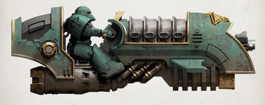
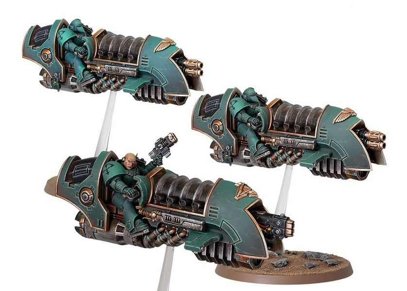

# 0209 天空猎手 Sky-Hunter

精校状态：中文行文已逐段精校，部分术语仍为暂定

分类：通用概念 / 帝国 Imperium / 中央政务部 Adeptus Terra / 星际战士军团 Space Marine Legion

原文来源：https://www.bilibili.com/opus/1034055815085948936

原作者：帝国神选罐头

原文时间：2025年02月15日 13:44

[返回分类目录](目录.md) · [全书目录](../../目录.md)

<!-- A0209-B0001 -->
**英文原文**

Sky-Hunters were specialized Jetbikes formations used during the Great Crusade and Horus Heresy.

<!-- /A0209-B0001 -->

<!-- A0209-B0002 -->

原译文

天空猎手是在大远征和荷鲁斯叛乱期间使用的专业悬浮摩托编队。

**校订译文**

天空猎手是在大远征和荷鲁斯之乱期间使用的专业悬浮摩托编队。

<!-- /A0209-B0002 -->

<!-- A0209-B0003 图片 -->

<!-- A0209-B0004 -->

原译文

Sky Hunter mounted on a Scimitar-pattern Jetbike 配备弯刀型悬浮摩托的天空猎手

**校订译文**

Sky Hunter mounted on a Scimitar-pattern Jetbike 配备弯刀型悬浮摩托的天空猎手

<!-- /A0209-B0004 -->

<!-- A0209-B0005 -->
## Description 描述

<!-- /A0209-B0005 -->

<!-- A0209-B0006 -->
**英文原文**

Sky Hunters were feared strike units boasting considerable firepower on their mounts in addition to their superb speed and maneuvering capabilities.

<!-- /A0209-B0006 -->

<!-- A0209-B0007 -->

原译文

天空猎手是令人恐惧的攻击单位，除了拥有高超的速度和机动能力外，他们的坐骑上还拥有相当强大的火力。

**校订译文**

天空猎手是令人恐惧的攻击单位，除了拥有高超的速度和机动能力外，他们的坐骑上还拥有相当强大的火力。

<!-- /A0209-B0007 -->

<!-- A0209-B0008 图片 -->

<!-- A0209-B0009 -->

原译文

Sky-Hunter Squadron 天空猎手中队

**校订译文**

Sky-Hunter Squadron 天空猎手中队

<!-- /A0209-B0009 -->

<!-- A0209-B0010 -->
**英文原文**

Sky-Hunters themselves typically operated in squadrons of three, each led by a Space Marine Sergeant. Their Jetbikes, often Scimitar and Bullock pattern craft, sported a mixture of Heavy Bolters, Multi-Meltas, Volkite Culvarins, and Plasma Cannons.

<!-- /A0209-B0010 -->

<!-- A0209-B0011 -->

原译文

天空猎手通常以三个中队的形式行动，每个中队由一名星际战士军士领导。他们的悬浮摩托，通常是弯刀型和布洛克型，配备了重型爆矢枪、多管热熔、爆燃长炮和等离子炮。

**校订译文**

天空猎手通常每三人编为一个中队，由一名星际战士军士指挥。其悬浮摩托多为弯刀型或布洛克型，可搭载重型爆矢枪、多管热熔、爆燃长炮与等离子炮等不同武器。

<!-- /A0209-B0011 -->

本篇核心术语与暂定项

以下列出本篇出现的英文原形及核心术语表用词。同形词可能指不同对象，具体词义以本篇正文和校注为准；单复数、别名和仅见于图注的名称可能尚未列入。完整候选见[术语表](../../术语表/双语术语候选.csv)。

| 英文 | 采用中文 | 状态 |
| --- | --- | --- |
| Horus Heresy | 荷鲁斯之乱 | 官方已核对 |
| Great Crusade | 大远征 | 暂定·官方待核 |
| Horus | 荷鲁斯 | 暂定·官方待核 |
| Space Marine | 星际战士 | 暂定·官方待核 |
| Sergeant | 军士 | 暂定·官方待核 |

