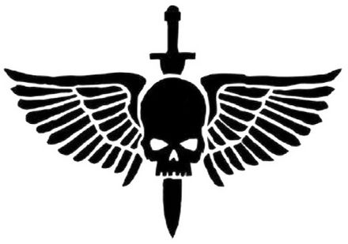
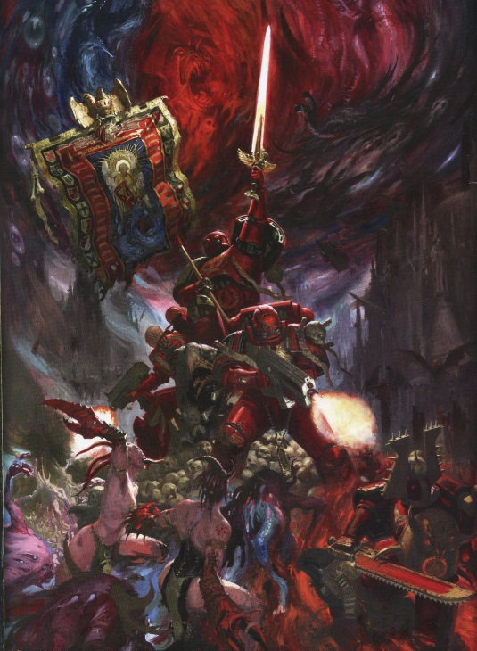
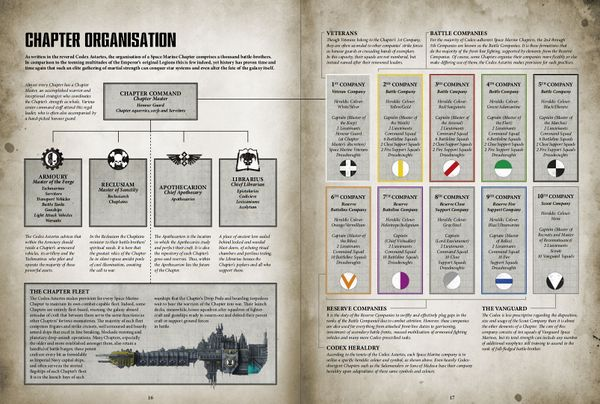
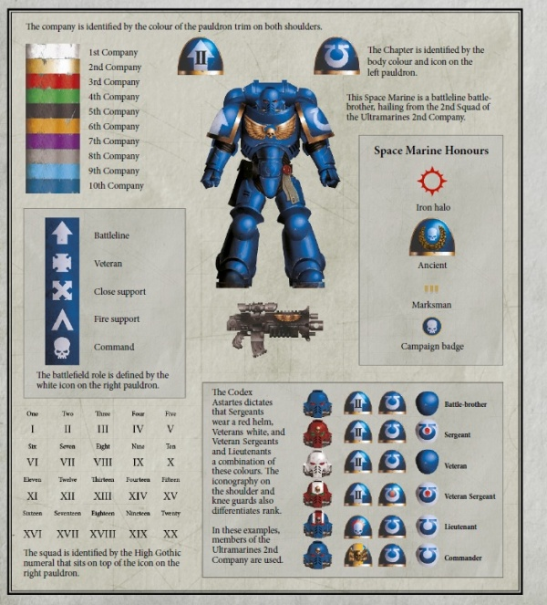
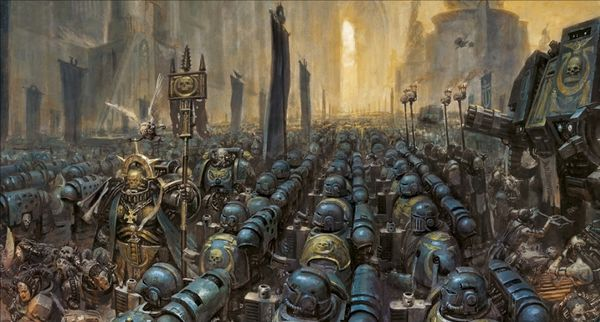
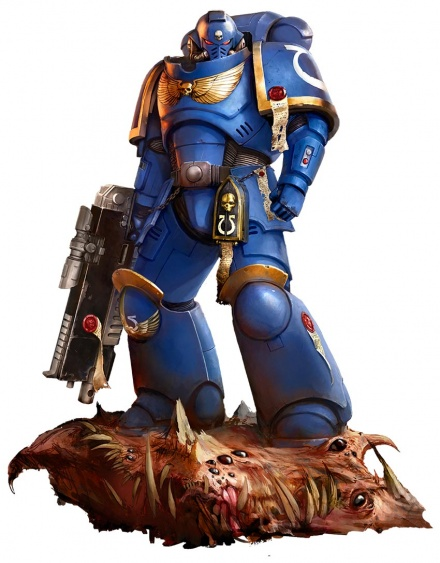
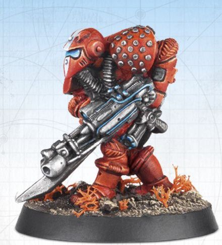

# 0213 阿斯塔特修会 Adeptus Astartes

精校状态：中文行文已逐段精校，部分术语仍为暂定

分类：通用概念 / 帝国 Imperium / 中央政务部 Adeptus Terra / 阿斯塔特修会 Adeptus Astartes

原文来源：https://www.bilibili.com/opus/1060007600939073544

原作者：帝国神选罐头

原文时间：编辑于 2025年09月09日 22:00

[返回分类目录](目录.md) · [全书目录](../../目录.md)

<!-- A0213-B0001 -->
**英文原文**

They shall be my finest warriors, these men who give themselves to me. Like clay I shall mould them and in the furnace of war forge them. They will be of iron will and steely muscle. In great armour shall I clad them and with the mightiest guns will they be armed. They will be untouched by plague or disease, no sickness will blight them. They will have tactics, strategies and machines such that no foe can best them in battle. They are my bulwark against the Terror. They are the Defenders of Humanity. They are my Space Marines and they shall know no fear.

<!-- /A0213-B0001 -->

<!-- A0213-B0002 -->

原译文

他们将成为我最精锐的战士，这些向我奉献自身的人。我会像塑造黏土般雕琢他们，在战争的熔炉中铸造他们。他们将拥有钢铁般的意志与肌肉。我会为他们披上最坚固的甲胄，用最强大的枪炮武装他们。瘟疫与疾病将无法侵袭他们，任何病痛都不能折磨他们。他们将掌握战术、战略与战争机器，任何敌人都无法在战场上击败他们。他们是抵御恐惧的壁垒，是人类的守护者。他们是我的星际战士，他们无所畏惧。

**校订译文**

这些献身于我的人，将成为我最精锐的战士。我将像塑造黏土般雕琢他们，在战争的熔炉中锻造他们。他们将拥有钢铁般的意志与肌肉。我将为他们披上强大的甲胄，以最强大的枪炮武装他们。瘟疫与疾病无法侵袭他们，任何病痛都不能摧残他们。他们将掌握战术、战略与战争机器，使任何敌人都无法在战场上击败他们。他们是我抵御恐惧的壁垒，是人类的守护者。他们是我的星际战士，他们将无所畏惧。

<!-- /A0213-B0002 -->

<!-- A0213-B0003 -->
**英文原文**

--The Emperor of Mankind.

<!-- /A0213-B0003 -->

<!-- A0213-B0004 -->

原译文

--人类帝皇

**校订译文**

--人类帝皇

<!-- /A0213-B0004 -->

<!-- A0213-B0005 -->
**英文原文**

The Adeptus Astartes (commonly known as Space Marines, and colloquially as Angels of Death) are one of the most elite and feared fighting forces in the Imperium of Man. The primary unit of organisation in the 41st millennium is the Chapter, a self-contained army fully equipped with its own transport, non-combatant support staff, etc. There are around a thousand Chapters, each comprising a thousand Space Marines. There are far too few Space Marines to form the Imperium's main military forces; instead they operate as highly mobile strike forces. They are entrusted with the most dangerous missions, such as lightning raids behind enemy lines, infiltration, and tunnel fighting. Through selection, training, and conditioning, Marines are physically, mentally, and spiritually superior to any other Imperial soldier.

<!-- /A0213-B0005 -->

<!-- A0213-B0006 -->

原译文

阿斯塔特修会（通常被称为星际战士，俗称死亡天使）是人类帝国中最精英、最令人恐惧的战斗力量之一。第41个千年的主要组织单位是战团，这是一支自给自足的军队，装备有自己的运输工具、非战斗支援人员等。大约有一千个战团，每个战团由一千名星际战士组成。星际战士人数太少，无法作为帝国的主要军事力量；相反，他们作为高度机动的打击部队作战。他们被赋予最危险的任务，如敌后闪电袭击、渗透和通道战。通过选拔、训练和调节，星际战士在身体、意志和精神上都优于任何其他帝国士兵。

**校订译文**

阿斯塔特修会通常被称为星际战士，也有“死亡天使”之称，是人类帝国最精锐、最令人畏惧的军事力量之一。第 41 千年时，他们以战团为基本组织：每团都是配有自身运输工具和非战斗支援人员的完整军队。全帝国约有一千个战团，每团约一千名星际战士。他们人数太少，无法构成帝国军力的主体，因而通常作为高度机动的突击力量，执行敌后闪电袭击、渗透及坑道作战等最危险的任务。严格的选拔、训练与身心塑造，使他们拥有超越普通帝国士兵的体魄、意志与精神力量。

<!-- /A0213-B0006 -->

<!-- A0213-B0007 图片 -->

<!-- A0213-B0008 -->

原译文

Space Marines symbol 星际战士标志

**校订译文**

Space Marines symbol 星际战士标志

<!-- /A0213-B0008 -->

<!-- A0213-B0009 -->
**英文原文**

Parent Agency:Adeptus Terra

<!-- /A0213-B0009 -->

<!-- A0213-B0010 -->

原译文

所属机构：中央政务部

**校订译文**

所属机构：中央政务部

<!-- /A0213-B0010 -->

<!-- A0213-B0011 -->
**英文原文**

Headquarters:Decentralized, various Fortress-Monasteries

<!-- /A0213-B0011 -->

<!-- A0213-B0012 -->

原译文

总部：分散的各种堡垒修道院

**校订译文**

总部：分散于各战团的要塞修道院，无统一总部。

<!-- /A0213-B0012 -->

<!-- A0213-B0013 -->
**英文原文**

Leader:Decentralized, various Chapter Masters

<!-- /A0213-B0013 -->

<!-- A0213-B0014 -->

原译文

领导者：分散的各位战团长

**校订译文**

领导者：各战团长分别统领所属战团。

<!-- /A0213-B0014 -->

<!-- A0213-B0015 -->
**英文原文**

Armed Forces:~1,000 Space Marine Chapters

<!-- /A0213-B0015 -->

<!-- A0213-B0016 -->

原译文

武装部队：约1000个星际战士战团

**校订译文**

武装部队：约1000个星际战士战团

<!-- /A0213-B0016 -->

<!-- A0213-B0017 -->
**英文原文**

Established:Post-Horus Heresy, M31(preceded by Legiones Astartes)

<!-- /A0213-B0017 -->

<!-- A0213-B0018 -->

原译文

成立时间：荷鲁斯叛乱后，M31（之前是阿斯塔特军团）

**校订译文**

成立：第 31 千年，荷鲁斯之乱之后；前身为阿斯塔特军团。

<!-- /A0213-B0018 -->

<!-- A0213-B0019 -->
## History 历史

<!-- /A0213-B0019 -->

<!-- A0213-B0020 -->
**英文原文**

Originating from the Thunder Warriors, the first Space Marines were created from the genetic material of the Primarchs after they were spirited away from the Emperor by the Gods of Chaos in the aftermath of the Unification Wars. Twenty Legions of Space Marines were created, each from the genetic material of a specific Primarch. The first Astartes were created only by the massive effort of the Emperor and countless Terran scientists of Amar Astarte's Biotechnical Division who worked deep within the Himalazia Mountains. The original Astartes gene-seed was unstable and caused its subjects to degrade rapidly, but once it was stabilized by samples provided by newly rediscovered Primarchs, long-term stability was achieved.

<!-- /A0213-B0020 -->

<!-- A0213-B0021 -->

原译文

起源于雷霆战士，第一批星际战士是在统一战争后原体被混沌诸神从帝皇身边带走后，用原体的遗传物质创造出来的。20个星际战士军团被创建，每个军团都来自一个特定的原体的遗传物质。第一个阿斯塔特是由帝皇和阿玛尔·阿斯塔特的生物技术部门的无数人类科学家在喜马拉雅山脉深处工作的巨大努力中创造的。原初的阿斯塔特基因种子不稳定，导致其受试者迅速降解，但一旦被新回归的原体提供的样本稳定下来，就实现了长期稳定。

**校订译文**

星际战士承继了雷霆战士的道路。按本段记述，统一战争结束后，原体被混沌诸神从帝皇身边掳走，帝皇随后利用留存的遗传物质创造了最早的星际战士。二十个军团分别采用一位原体的遗传材料。帝皇与阿玛尔·阿斯塔特生物技术部门的无数泰拉科学家，在喜马拉雅山脉深处付出巨大努力，才造就首批阿斯塔特。最初的基因种子不稳定，接受改造者会迅速衰败；待原体陆续被寻回，研究者利用他们提供的样本，才使基因种子长期稳定下来。

**校注：** 本段将星际战士创造置于统一战争之后，与第176篇“末期已作战”不一致；保留来源并明确为本段记述。

<!-- /A0213-B0021 -->

<!-- A0213-B0022 图片 -->

<!-- A0213-B0023 -->

原译文

Space Marines battle the forces of Chaos 星际战士与混沌部队战斗

**校订译文**

Space Marines battle the forces of Chaos 星际战士与混沌部队战斗

<!-- /A0213-B0023 -->

<!-- A0213-B0024 -->
**英文原文**

The Legions took part in the Great Crusade, during which the lost Primarchs were rediscovered and given command of their respective Legion. The Crusade, lasting for two centuries, ended with the treachery of one of the Primarchs, Horus, who led at least half of the Legions in a rebellion known as the Horus Heresy against the Emperor. In the final battle for control of the future of mankind, Horus was slain by the Emperor. With the rebellion defeated, those Legions which had sided with Horus were driven into the Eye of Terror.

<!-- /A0213-B0024 -->

<!-- A0213-B0025 -->

原译文

军团参加了大远征，在此期间，失踪的原体被重新发现，并被赋予了各自军团的指挥权。持续了两个世纪的大远征以其中一位原体荷鲁斯的背叛而告终，荷鲁斯领导了至少一半的军团进行了一场被称为荷鲁斯叛乱的反抗帝皇的叛乱。在控制人类未来的最后一场战斗中，荷鲁斯被帝皇杀死。随着叛乱的失败，那些支持荷鲁斯的军团被驱赶到恐惧之眼。

**校订译文**

军团参加了大远征，失散的原体在此期间陆续被寻回，并接掌自己的军团。持续两百年的远征最终因荷鲁斯的背叛而终结：他率至少半数军团反抗帝皇，酿成荷鲁斯之乱。在决定人类命运的最后决战中，帝皇杀死荷鲁斯。叛乱败北后，追随荷鲁斯的军团被逐入恐惧之眼。

<!-- /A0213-B0025 -->

<!-- A0213-B0026 -->
**英文原文**

The Legions which had remained loyal were eventually reorganised according to the dictates of the Codex Astartes, in the event known as the Second Founding. Each Legion was divided into several autonomous Chapters, which remain the primary unit of the Space Marines to the current day.

<!-- /A0213-B0026 -->

<!-- A0213-B0027 -->

原译文

一直忠诚的军团最终根据阿斯塔特圣典的规定进行了重组，这一事件被称为二次建军。每个军团都分为几个自治的战团，这些战团至今仍是星际战士的主要单位。

**校订译文**

一直忠诚的军团最终根据阿斯塔特圣典的规定进行了重组，这一事件被称为二次建军。每个军团都分为几个自治的战团，这些战团至今仍是星际战士的主要单位。

<!-- /A0213-B0027 -->

<!-- A0213-B0028 -->
**英文原文**

Successive foundings over the millennia have created new Chapters. There are now around a thousand Chapters in existence, each Chapter ultimately descending from one of the loyalist Legions. Later in the closing days of the 41st Millennium the resurrected Roboute Guilliman and his Mechanicum researchers oversaw the creation of a new generation of Astartes, known as the Primaris Space Marine.

<!-- /A0213-B0028 -->

<!-- A0213-B0029 -->

原译文

数千年来的连续建军创造了新的战团。现在有大约一千个战团存在，每个战团最终都来自一个忠诚的军团。在第41个千年的最后几天，复活的罗伯特·基里曼和他的机械教研究人员监督了新一代阿斯塔特的创建，称为原铸星际战士。

**校订译文**

此后数千年，历次建军不断创建新战团。本段所述时期约有一千个战团，其血脉最终都可追溯至忠诚派军团。到第四十一千年末，复苏的罗保特·基里曼与机械教研究人员共同督导，创造出新一代阿斯塔特——原铸星际战士。

**校注：** 英文在第四十一千年语境使用 Mechanicum（机械教），未写 Adeptus Mechanicus（机械修会）。此处保留英文机构称谓，同时标记可能的历史称谓混用，待核原始来源。

<!-- /A0213-B0029 -->

<!-- A0213-B0030 -->
**英文原文**

To some extent, the Chapters maintain the traditions and character of the Legion they descend from. Chapters adhere to the Codex Astartes in differing degrees, some regarding any deviation from it as virtual heresy; others, notably the Black Templars, Blood Angels, Space Wolves, and Dark Angels, only following the Codex in the broadest matters.

<!-- /A0213-B0030 -->

<!-- A0213-B0031 -->

原译文

在某种程度上，这些战团保留了他们所继承的军团的传统和特征。各战团在不同程度上遵守阿斯塔特圣典，有些战团认为任何偏离该圣典的行为都是异端；其他人，特别是黑色圣堂、圣血天使、太空野狼和黑暗天使，只在最广泛的事情上遵循圣典。

**校订译文**

各战团在不同程度上继承了母军团的传统与性格，遵循《阿斯塔特圣典》的严格程度也不相同。有些将任何偏离圣典的行为都视同异端；黑色圣堂、圣血天使、太空野狼和黑暗天使等，则只在最基本的大框架上遵循它。

<!-- /A0213-B0031 -->

<!-- A0213-B0032 -->
## Organisation 组织

<!-- /A0213-B0032 -->

<!-- A0213-B0033 -->
**英文原文**

They shall be pure of both heart and strong of body, untainted by doubt and self-aggrandisement. They will be bright stars in the firmament of battle, angels of death whose shining wings bring swift annihilation to the enemies of man. So shall it be for a thousand times a thousand years, unto the very end of eternity and the extinction of mortal flesh.'

<!-- /A0213-B0033 -->

<!-- A0213-B0034 -->

原译文

他们将拥有纯净的心灵与强健的体魄，不为疑虑与自我膨胀所玷污。他们将成为战场上苍穹中的璀璨星辰，化作死亡天使，闪耀的羽翼将为人类之敌带来迅疾的毁灭。此般信念将存续千万年之久，直至永恒的尽头，直至凡躯尽数湮灭。

**校订译文**

他们将心灵纯洁、体魄强健，不受疑虑与自我夸耀玷污。他们将成为战阵苍穹中的明亮群星，成为死亡天使，以闪耀的羽翼迅速毁灭人类之敌。如此将延续百万年，直至永恒尽头，直至凡人的血肉尽数消亡。

**校注：** a thousand times a thousand years 为一千乘一千，即百万年；原译千万年有误。

<!-- /A0213-B0034 -->

<!-- A0213-B0035 -->
**英文原文**

- Roboute Guilliman.

<!-- /A0213-B0035 -->

<!-- A0213-B0036 -->

原译文

-罗伯特·基里曼

**校订译文**

——罗保特·基里曼

<!-- /A0213-B0036 -->

<!-- A0213-B0037 -->
**英文原文**

The Adeptus Astartes is comprised of autonomous Chapters, each of which is a complete army in itself, possessing its own transport, Warp-capable spacecraft, non-combatant personnel, and fortress-monastery based on a planet or fleet. There are roughly a thousand Chapters, each led by a Space Marine with the rank of Chapter Master. A Chapter's fighting force numbers a nominal 1000 Marines, divided into ten companies, each of which is commanded by a Captain. Companies are further divided into squads of ten battle-brothers, each commanded by a Sergeant.

<!-- /A0213-B0037 -->

<!-- A0213-B0038 -->

原译文

阿斯塔特圣典由自治的战团组成，每个战团本身都是一支完整的军队，拥有自己的运输工具、具有亚空间航行能力的战舰、非战斗人员和基于行星或舰队的堡垒修道院。大约有一千个战团，每个战团由一位战团长级别的星际战士领导。一个战团的作战部队名义上有1000名星际战士，分为10个连队，每个连队由一名连长指挥。连队进一步分为十个战斗兄弟小队，每个小队由一名军士指挥。

**校订译文**

阿斯塔特修会由自治战团组成。每个战团本身就是完整军队，拥有运输工具、可进行亚空间航行的舰船、非战斗人员，以及设在行星或舰队上的要塞修道院。全帝国约有一千个战团，各由战团长统领。战团名义战力为一千名星际战士，分成十个连队，连队由连长指挥，再下分为十人小队，由军士带领。

<!-- /A0213-B0038 -->

<!-- A0213-B0039 图片 -->

<!-- A0213-B0040 -->

原译文

Organization of a Space Marine Chapter since the introduction of Primaris Space Marines 自引入原铸星际战士以来星际战士的组织结构

**校订译文**

Organization of a Space Marine Chapter since the introduction of Primaris Space Marines 引入原铸星际战士后的战团编制

<!-- /A0213-B0040 -->

<!-- A0213-B0041 -->
**英文原文**

The Chapter Masters owe their allegiance to the Emperor. Ultimately, the Chapter is subject to the orders of the highest-ranking among the Adeptus Terra, although only in a general sense.

<!-- /A0213-B0041 -->

<!-- A0213-B0042 -->

原译文

战团长效忠于帝皇。最终，战团受制于中央政务部中最高等级的命令，尽管只是在一般意义上。

**校订译文**

战团长直接效忠帝皇。就最宽泛的隶属关系而言，战团最终仍须听从中央政务部最高层的命令。

<!-- /A0213-B0042 -->

<!-- A0213-B0043 -->
**英文原文**

Chapters are monastic communities in nature; for most of the Marines, the Chapter is their world, and the only contact they have with outsiders is in battle.

<!-- /A0213-B0043 -->

<!-- A0213-B0044 -->

原译文

战团本质上是修道院团体；对于大多数星际战士来说，战团就是他们的世界，他们与外界的唯一联系就是在战斗中。

**校订译文**

战团本质上是修道院团体；对于大多数星际战士来说，战团就是他们的世界，他们与外界的唯一联系就是在战斗中。

<!-- /A0213-B0044 -->

<!-- A0213-B0045 -->
### Tactical Organisation 战术组织

<!-- /A0213-B0045 -->

<!-- A0213-B0046 -->
**英文原文**

The traditional Codex Chapter is tactically organised into a number of different types of squad: Battleline Squads consist of either Tactical Squads or Primaris Intercessor Squads. Close Support Squads consist of either Assault Squads, Inceptor Squads, or Reiver Squads. Fire Support Squads consist of Devastator Squads, Desolation Squads, Hellblaster Squads, Eradicator Squads, or Aggressor Squads. The squad types are equipped and trained to fulfil a specific battlefield role, each of the three types designed to complement each other on the battlefield to make a far more effective whole. In addition to these three squad types, veterans can be formed into Veteran or Terminator Squads, while the initiate Marines are formed into Scout squads.

<!-- /A0213-B0046 -->

<!-- A0213-B0047 -->

原译文

传统的圣典战团在战术上被组织成许多不同类型的小队：战线小队由战术小队或原铸仲裁者小队组成。近身支援小队由突击小队、先驱者小队或掠夺者小队组成。火力支援小队由毁灭者小队、寂灭者小队、地狱轰击者小队、根除者小队或侵略者小队组成。小队类型的装备和训练是为了履行特定的战场角色，三种类型的每一种都是为了在战场上相互补充，形成一个更有效的整体。除了这三种小队类型外，老兵还可以组成老兵小队或终结者小队，而信徒战士则组成侦察小队。

**校订译文**

遵循圣典的战团按战术职能划分小队：战线小队包括战术小队与原铸仲裁者小队；近战支援小队包括突击小队、先驱者小队和掠夺者小队；火力支援小队则包括破坏者、寂灭、地狱轰击者、根除者与侵略者小队。每类小队的装备与训练都服务于特定职责，三大类相互配合，形成高效的整体。此外，老兵可编为老兵小队或终结者小队，尚在培养中的战士则编入侦察兵小队。

<!-- /A0213-B0047 -->

<!-- A0213-B0048 -->
**英文原文**

Terminator squads are drawn from the entire chapter's best and most experienced warriors. The veterans wear the uniquely powerful Terminator Armour. These squads are formed when circumstances necessitate the concentration of the Chapter's most capable warriors and potent equipment into one or more heavily-armed and powerful units.

<!-- /A0213-B0048 -->

<!-- A0213-B0049 -->

原译文

终结者小队来自整个战团中最优秀、最有经验的战士。老兵们穿着独特而强大的终结者盔甲。这些小队是在情况需要将战团最有能力的战士和强大的装备集中到一个或多个全副武装和强大的单位时组建的。

**校订译文**

终结者小队来自整个战团中最优秀、最有经验的战士。老兵们穿着独特而强大的终结者盔甲。这些小队是在情况需要将战团最有能力的战士和强大的装备集中到一个或多个全副武装和强大的单位时组建的。

<!-- /A0213-B0049 -->

<!-- A0213-B0050 -->
### Ranks 等级

<!-- /A0213-B0050 -->

<!-- A0213-B0051 -->
**英文原文**

All Space Marine Chapters loosely utilise the same types of ranks. Many non-Codex Astartes chapters, however, will often use different names for these positions.

<!-- /A0213-B0051 -->

<!-- A0213-B0052 -->

原译文

所有星际战士战团都松散地使用相同类型的军衔。然而，许多非阿斯塔特圣典的战团通常会对这些位置使用不同的名称。

**校订译文**

各星际战士战团大致使用相同的职衔体系，但许多不遵循圣典的战团会为同一职位采用不同名称。

<!-- /A0213-B0052 -->

<!-- A0213-B0053 图片 -->

<!-- A0213-B0054 -->

原译文

Space Marine heraldry as per the Codex Astartes 根据阿斯塔特圣典的星际战士纹章

**校订译文**

Space Marine heraldry as per the Codex Astartes 根据阿斯塔特圣典的星际战士纹章

<!-- /A0213-B0054 -->

<!-- A0213-B0055 -->
**英文原文**

Chapter Master — The highest attainable rank of Space Marine, commanding their entire Chapter. Some Chapters, like the Iron Hands, do not maintain a Chapter Master.

<!-- /A0213-B0055 -->

<!-- A0213-B0056 -->

原译文

战团长 — 最高级别的星际战士，指挥他们的整个战团。有些战团，比如钢铁之手，没有维持的战团长。

**校订译文**

战团长——星际战士通常能够担任的最高职位，统领整个战团；钢铁之手等部分战团并不设立这一正式职位。

<!-- /A0213-B0056 -->

<!-- A0213-B0057 -->
**英文原文**

Captain — The second highest rank of a Chapter, they command a Company or its equivalent. Many Captains are given an honorific Master title.

<!-- /A0213-B0057 -->

<!-- A0213-B0058 -->

原译文

连长 — 一个战团的第二高级别，他们指挥一个连队或同等级别的连队。许多连长都被授予荣誉的大师头衔。

**校订译文**

连长 — 一个战团的第二高级别，他们指挥一个连队或同等级别的连队。许多连长都被授予荣誉的大师头衔。

<!-- /A0213-B0058 -->

<!-- A0213-B0059 -->
**英文原文**

Lieutenant — These serve as the right hand to their Company Captain, typically commanding one of the Company's two demi-companies.

<!-- /A0213-B0059 -->

<!-- A0213-B0060 -->

原译文

副官 — 他们是连长的得力助手，通常指挥连长的两个半连队之一。

**校订译文**

副官 — 他们是连长的得力助手，通常指挥连长的两个半连队之一。

<!-- /A0213-B0060 -->

<!-- A0213-B0061 -->
**英文原文**

Sergeant — Command Squads within each Company. Sergeants within the Chapter's 1st Company are known as Veteran Sergeants.

<!-- /A0213-B0061 -->

<!-- A0213-B0062 -->

原译文

军士 — 每个连队内的小队指挥者。第一连队的军士被称为老兵军士。

**校订译文**

军士 — 每个连队内的小队指挥者。第一连队的军士被称为老兵军士。

<!-- /A0213-B0062 -->

<!-- A0213-B0063 -->
**英文原文**

Battle-Brother — Standard Space Marine rank for a fully inducted warrior. May include honorific duties such as Honour Guard, Company Champion, or Standard Bearer. The most experienced Battle-Brothers serve in the Chapter's 1st Company as Veteran Space Marines, who may wear ancient Terminator armor.

<!-- /A0213-B0063 -->

<!-- A0213-B0064 -->

原译文

战斗兄弟 — 完全入伍的战士的标准星际战士军衔。可能包括荣誉职责，如荣誉卫队、连队冠军或旗手。经验最丰富的战斗兄弟在第一连队担任老兵星际战士，他们可能穿着古老的终结者盔甲。

**校订译文**

战斗兄弟 — 完全入伍的战士的标准星际战士军衔。可能包括荣誉职责，如荣誉卫队、连队冠军或旗手。经验最丰富的战斗兄弟在第一连队担任老兵星际战士，他们可能穿着古老的终结者盔甲。

<!-- /A0213-B0064 -->

<!-- A0213-B0065 -->
**英文原文**

Vanguard Space Marine - Covert-operation experts typically drawn from the 10th Scout Company. A Chapter will normally maintain 100 of these specialists.

<!-- /A0213-B0065 -->

<!-- A0213-B0066 -->

原译文

先锋星际战士 — 秘密行动专家，通常来自第10侦察连队。一个战团通常会保留100名这样的专家。

**校订译文**

先锋星际战士 — 秘密行动专家，通常来自第10侦察连队。一个战团通常会保留100名这样的专家。

<!-- /A0213-B0066 -->

<!-- A0213-B0067 -->
**英文原文**

Neophyte — Space Marines in training who have not become fully accepted Battle-Brothers. They are utilised in a Chapter's Scout Squads as a part of their training.

<!-- /A0213-B0067 -->

<!-- A0213-B0068 -->

原译文

新进者 — 正在训练中的星际战士，他们还没有完全被接受为战斗兄弟。他们被用于一个战团的侦察小队，作为训练的一部分。

**校订译文**

新进者 — 正在训练中的星际战士，他们还没有完全被接受为战斗兄弟。他们被用于一个战团的侦察小队，作为训练的一部分。

<!-- /A0213-B0068 -->

<!-- A0213-B0069 -->
**英文原文**

Aspirant — Humans selected to be inducted into a Chapter and undergo genetic modification.

<!-- /A0213-B0069 -->

<!-- A0213-B0070 -->

原译文

有志者 — 人类被选入一个战团并接受基因改造。

**校订译文**

有志者——被选入战团、准备接受基因改造的人类候选者。

<!-- /A0213-B0070 -->

<!-- A0213-B0071 -->
### Specialist Ranks 特殊等级

<!-- /A0213-B0071 -->

<!-- A0213-B0072 -->
**英文原文**

In addition to their standard ranks, Space Marine Chapters also maintain a variety of specialist roles.

<!-- /A0213-B0072 -->

<!-- A0213-B0073 -->

原译文

除了标准等级外，星际战士战团还维持着各种专业角色。

**校订译文**

除了标准等级外，星际战士战团还维持着各种专业角色。

<!-- /A0213-B0073 -->

<!-- A0213-B0074 图片 -->

<!-- A0213-B0075 -->

原译文

Space Marines of the Ultramarines Chapter 极限战士战团的星际战士

**校订译文**

Space Marines of the Ultramarines Chapter 极限战士战团的星际战士

<!-- /A0213-B0075 -->

<!-- A0213-B0076 -->
**英文原文**

Librarian — Psyker warriors of the Chapter. Variations include Rune Priest for the Space Wolves and Stormseer for the White Scars. Some Chapters, such as the Black Templars, do not use Librarians.

<!-- /A0213-B0076 -->

<!-- A0213-B0077 -->

原译文

智库 — 战团的灵能者战士。变体包括太空野狼的符文牧师和白色伤疤的风暴先知。有些战团，如黑色圣堂，不使用智库。

**校订译文**

智库员——战团的灵能战士。太空野狼称其为符文牧师，白疤称其为风暴先知；黑色圣堂等战团不设智库员。

<!-- /A0213-B0077 -->

<!-- A0213-B0078 -->
**英文原文**

Chief Librarian — The senior most Librarian of a Chapter and the commander of its Librarium.

<!-- /A0213-B0078 -->

<!-- A0213-B0079 -->

原译文

首席智库 — 一个战团的最高级别智库和智库馆长。

**校订译文**

首席智库员——战团中级别最高的智库员，统领智库馆。

<!-- /A0213-B0079 -->

<!-- A0213-B0080 -->
**英文原文**

Epistolary — The 3rd highest rank of Librarian

<!-- /A0213-B0080 -->

<!-- A0213-B0081 -->

原译文

星语官 — 智库的第二高级别

**校订译文**

星语官——按此处英文列为智库员第三高等级。

**校注：** 本篇英文将 Epistolary 列第三、Codicier 列第二，原译恰好相反；现忠实标明英文次序，并提示此处层级待核，不凭记忆静默更改。

<!-- /A0213-B0081 -->

<!-- A0213-B0082 -->
**英文原文**

Codicier — The 2nd highest rank of Librarian

<!-- /A0213-B0082 -->

<!-- A0213-B0083 -->

原译文

典记员 — 智库的第三高级别

**校订译文**

典记员——按此处英文列为智库员第二高等级。

<!-- /A0213-B0083 -->

<!-- A0213-B0084 -->
**英文原文**

Lexicanium — The rank of newly-inducted Librarians

<!-- /A0213-B0084 -->

<!-- A0213-B0085 -->

原译文

编修员 — 新入职智库的等级

**校订译文**

编修员——刚正式加入智库的智库员等级。

<!-- /A0213-B0085 -->

<!-- A0213-B0086 -->
**英文原文**

Acolytum — Librarians in training, not yet inducted into the Librarium.

<!-- /A0213-B0086 -->

<!-- A0213-B0087 -->

原译文

侍僧 — 正在接受培训的智库，尚未进入智库馆。

**校订译文**

侍僧——仍在受训、尚未正式加入智库馆的人员。

<!-- /A0213-B0087 -->

<!-- A0213-B0088 -->
**英文原文**

Chaplain — Warrior-Priests of a Chapter who oversee morale, discipline, and spiritual purity. Variations include Wolf Priests of the Space Wolves and Interrogator-Chaplains of the Unforgiven.

<!-- /A0213-B0088 -->

<!-- A0213-B0089 -->

原译文

牧师 — 一个战团的战斗牧师，负责监督士气、纪律和精神纯洁。变体包括太空野狼的狼牧师和不可饶恕者的审讯牧师。

**校订译文**

教士——战团的战斗神职人员，负责士气、纪律与精神纯洁。对应的特殊职衔包括太空野狼的狼牧师，以及戴罪者的审讯教士。

<!-- /A0213-B0089 -->

<!-- A0213-B0090 -->
**英文原文**

Master of Sanctity — The senior most Chaplain of a Chapter and commander of its Reclusium.

<!-- /A0213-B0090 -->

<!-- A0213-B0091 -->

原译文

圣洁导师 — 一个战团的最高级别牧师和战团隐修会的指挥官。

**校订译文**

圣洁导师——战团最高级别的教士，统领隐修室。

<!-- /A0213-B0091 -->

<!-- A0213-B0092 -->
**英文原文**

Reclusiarch — Senior Chaplains

<!-- /A0213-B0092 -->

<!-- A0213-B0093 -->

原译文

隐修士 — 高级牧师

**校订译文**

隐修士——资深教士。

<!-- /A0213-B0093 -->

<!-- A0213-B0094 -->
**英文原文**

Chaplain - Standard rank

<!-- /A0213-B0094 -->

<!-- A0213-B0095 -->

原译文

牧师 - 标准等级

**校订译文**

教士——基本职衔。

<!-- /A0213-B0095 -->

<!-- A0213-B0096 -->
**英文原文**

Judiciar - Chaplains in training

<!-- /A0213-B0096 -->

<!-- A0213-B0097 -->

原译文

裁决士 - 正在训练的牧师

**校订译文**

裁决者——正在接受教士训练的人员。

<!-- /A0213-B0097 -->

<!-- A0213-B0098 -->
**英文原文**

Apothecary — Battlefield medical specialists charged with not only healing their comrades, but also collecting the Gene-Seed of fallen warriors. Variations include the Sanguinary Priests of the Blood Angels and their Successor Chapters.

<!-- /A0213-B0098 -->

<!-- A0213-B0099 -->

原译文

药剂师 — 战场医疗专家，不仅负责治愈战友，还负责收集阵亡战士的基因种子。变体包括圣血天使及其子战团的圣血祭司。

**校订译文**

药剂师 — 战场医疗专家，不仅负责治愈战友，还负责收集阵亡战士的基因种子。变体包括圣血天使及其子战团的圣血祭司。

<!-- /A0213-B0099 -->

<!-- A0213-B0100 -->
**英文原文**

Master of the Apothecarion — Senior most Apothecary and commander of their Chapter's Apothecarion.

<!-- /A0213-B0100 -->

<!-- A0213-B0101 -->

原译文

药剂部之主 — 最高级的药剂师和他们战团药剂师的指挥官。

**校订译文**

药剂部之主——最高级别的药剂师，统领战团药剂部。

<!-- /A0213-B0101 -->

<!-- A0213-B0102 -->
**英文原文**

Apothecary — Standard Rank

<!-- /A0213-B0102 -->

<!-- A0213-B0103 -->

原译文

药剂师 — 标准等级

**校订译文**

药剂师 — 标准等级

<!-- /A0213-B0103 -->

<!-- A0213-B0104 -->
**英文原文**

Helix Adept - Apothecary in training

<!-- /A0213-B0104 -->

<!-- A0213-B0105 -->

原译文

先锋药剂师 - 正在训练的药剂师

**校订译文**

螺旋医疗员——受训中的药剂师。

**校注：** 原文概括为 Apothecary in training，即受训阶段；统一称螺旋医疗员，不误作已完成训练的正式药剂师。

<!-- /A0213-B0105 -->

<!-- A0213-B0106 -->
**英文原文**

Techmarines — Technology officers and engineers of a Chapter who maintain the Armoury. Variations include Iron Father for the Iron Hands and Iron Priests for the Space Wolves.

<!-- /A0213-B0106 -->

<!-- A0213-B0107 -->

原译文

技术军士 — 维护军械库的一个战团的技术军官和工程师。变体包括钢铁之手的铁父和太空野狼的钢铁牧师。

**校订译文**

科技战士——战团的技术军官与工程师，负责维护军械库。相关特殊职衔包括钢铁之手的钢铁圣父与太空野狼的钢铁牧师。

<!-- /A0213-B0107 -->

<!-- A0213-B0108 -->
**英文原文**

Master of the Forge — Most senior rank who commands the Chapter Armoury.

<!-- /A0213-B0108 -->

<!-- A0213-B0109 -->

原译文

铸造大师 — 指挥战团军械库的最高军衔。

**校订译文**

铸造大师——科技战士的最高职位，统领战团军械库。

<!-- /A0213-B0109 -->

<!-- A0213-B0110 -->
**英文原文**

Master of the Signal — Battlefield communications specialists.

<!-- /A0213-B0110 -->

<!-- A0213-B0111 -->

原译文

信号大师 — 战场通信专家。

**校订译文**

信号大师 — 战场通信专家。

<!-- /A0213-B0111 -->

<!-- A0213-B0112 -->
**英文原文**

Chapter Ancient — Revered Standard-bearer

<!-- /A0213-B0112 -->

<!-- A0213-B0113 -->

原译文

战团旗手 — 尊敬的标准旗手

**校订译文**

战团旗手——备受尊崇的战旗持有者。

<!-- /A0213-B0113 -->

<!-- A0213-B0114 -->
**英文原文**

Judiciar - Executioner who works under the Chapter Master

<!-- /A0213-B0114 -->

<!-- A0213-B0115 -->

原译文

执法官 - 在战团长手下工作的刽子手

**校订译文**

裁决者——在战团长麾下执行处决的人员。

<!-- /A0213-B0115 -->

<!-- A0213-B0116 -->
### Chapter cult 战团教派

<!-- /A0213-B0116 -->

<!-- A0213-B0117 -->
**英文原文**

A Chapter cult is an integral aspect of a Space Marine Chapter. Every Space Marine belongs to the Chapter's cult, and accordingly, every Marine of a Chapter is a spiritual brother as well as a brother in arms. These warrior cults emphasise honour, comradeship, and strength. Chapter cults, often thousands of years old, have each developed their own distinct traditions and in many cases these cults pre-date the Imperial Cult, the official religion of the Imperium. Each Space Marine cult is unique and autonomous, ministered by an inner priesthood of warriors known as Chaplains. The practices of Space Marine cults, rumored to be barbaric and bloody, serve to make Space Marines all the more feared by the mass of humanity.

<!-- /A0213-B0117 -->

<!-- A0213-B0118 -->

原译文

战团教派是星际战士战团不可或缺的一部分。每个星际战士都属于战团的教派，因此，战团的每个战士都是精神上的兄弟，也是战友。这些战士教派强调荣誉、同志情谊和力量。战团教派，通常有数千年的历史，每个都有自己独特的传统，在许多情况下，这些教派早于帝国的官方宗教帝国教派。每个星际战士教派都是独特而自主的，由一个被称为牧师的内部战士神职人员管理。星际战士教派的做法，据传是野蛮和血腥的，使星际战士更加受到人类大众的恐惧。

**校订译文**

战团教派是战团生活不可分割的一部分。每位星际战士都属于战团教派，因此既是并肩作战的兄弟，也是精神上的兄弟。此类武士信仰强调荣誉、袍泽情谊与力量，往往已有数千年历史，形成了独特传统；许多甚至早于帝国官方宗教——帝皇信仰。每个战团教派都独立自治，由称为教士的内部战斗神职人员主持。据传，它们的仪式野蛮血腥，使普通人对星际战士更加畏惧。

<!-- /A0213-B0118 -->

<!-- A0213-B0119 -->
## Equipment 装备

<!-- /A0213-B0119 -->

<!-- A0213-B0120 -->
**英文原文**

The primary individual weapons of the Space Marines is the boltgun and its pistol variant, the bolt pistol.

<!-- /A0213-B0120 -->

<!-- A0213-B0121 -->

原译文

星际战士的主要个人武器是爆矢枪及其手枪变体，爆矢手枪。

**校订译文**

星际战士的主要个人武器是爆矢枪及其手枪变体，爆矢手枪。

<!-- /A0213-B0121 -->

<!-- A0213-B0122 图片 -->

<!-- A0213-B0123 -->

原译文

Firstborn Space Marine of the Ultramarines 极限战士长子星际战士

**校订译文**

Firstborn Space Marine of the Ultramarines 极限战士长子星际战士

<!-- /A0213-B0123 -->

<!-- A0213-B0124 -->
**英文原文**

The distinctive Power Armour is worn by all Marines in battle. Some members of the Chapter's first company may instead be armoured in the heavier Terminator Armour. Carapace armour is worn by Scouts instead of power armour. There is also a fourth type of armour called Artificer armour, worn by most Marines who have served three centuries for the Emperor or performed a notably brave action in battle.

<!-- /A0213-B0124 -->

<!-- A0213-B0125 -->

原译文

所有星际战士在战斗中都会穿戴独特的动力盔甲。战团第一连队的一些成员可能会换上更重的终结者盔甲。甲壳盔甲是由侦察兵穿戴而不是动力盔甲。还有第四种类型的盔甲，称为精工盔甲，大多数为帝皇服役三个世纪或在战斗中表现出特别勇气的星际战士都会穿这种盔甲。

**校订译文**

所有星际战士在战斗中都会穿戴独特的动力盔甲。战团第一连队的一些成员可能会换上更重的终结者盔甲。甲壳盔甲是由侦察兵穿戴而不是动力盔甲。还有第四种类型的盔甲，称为精工盔甲，大多数为帝皇服役三个世纪或在战斗中表现出特别勇气的星际战士都会穿这种盔甲。

<!-- /A0213-B0125 -->

<!-- A0213-B0126 -->
**英文原文**

Each Space Marines Chapters has its own distinguished colour scheme. Unlike the Astra Militarum, Space Marines do not typically use camouflage because Adeptus Astartes combat doctrine does not incorporate concealment in battle. Bright and bold colour schemes lower enemy morale, announcing the arriving of the noble Chapter to the battlefield. The exceptions to the main colours may still exist for some of the Chapter's Companies - for example Deathwing company of the Dark Angels Chapter use white colour scheme and the Ravenwing — black.

<!-- /A0213-B0126 -->

<!-- A0213-B0127 -->

原译文

每个星际战士战团都有自己独特的配色方案。与星界军不同，星际战士通常不使用伪装，因为阿斯塔特修会作战理论不包括战斗中的隐蔽。明亮而大胆的配色方案降低了敌人的士气，宣告了高贵战团的到来。对于战团的一些连队来说，主色的例外情况可能仍然存在，例如黑暗天使战团的死翼连队使用白色配色方案，而鸦翼连队使用黑色配色方案。

**校订译文**

每个星际战士战团都有自己独特的配色方案。与星界军不同，星际战士通常不使用伪装，因为阿斯塔特修会作战理论不包括战斗中的隐蔽。明亮而大胆的配色方案降低了敌人的士气，宣告了高贵战团的到来。对于战团的一些连队来说，主色的例外情况可能仍然存在，例如黑暗天使战团的死翼连队使用白色配色方案，而鸦翼连队使用黑色配色方案。

<!-- /A0213-B0127 -->

<!-- A0213-B0128 -->
**英文原文**

In the same time Chapter's vehicles may be painted in different colours until the large bands of areas painted in the Chapter colours.

<!-- /A0213-B0128 -->

<!-- A0213-B0129 -->

原译文

同时，战团的载具可能会被涂上不同的颜色，直到大片区域被涂上战团的颜色。

**校订译文**

战团载具也可以采用其他涂色，只要仍保留大片战团标志色的区域。

**校注：** 英文 until 在此语法不通，结合前后文暂按只要保留大片战团颜色理解。

<!-- /A0213-B0129 -->

<!-- A0213-B0130 -->
## Recruitment and Training 招募和训练

<!-- /A0213-B0130 -->

<!-- A0213-B0131 -->
**英文原文**

Recruits are chosen from the best warriors among humanity. Naturally, this makes Feral Worlds prized recruitment grounds, as such harsh and primal conditions produce the best warriors. However, Hive Worlds are considered the ideal source of potential recruits, the populace of the lower levels composed of some of the most murderous scum in the human Imperium. Whole gangs of hive scum are sometimes hunted down and captured for recruitment. Among the most valued traits in a recruit are aggression and psychotic-level killer instinct. Much more rarely, certain Civilised Worlds are also recruited from.

<!-- /A0213-B0131 -->

<!-- A0213-B0132 -->

原译文

新兵是从人类中最优秀的战士中挑选出来的。自然地，这使得蛮荒世界成为珍贵的招募地，因为如此恶劣和原始的条件造就了最好的战士。然而，巢都世界被认为是潜在新兵的理想来源，下巢民众由人类帝国中一些最凶残的渣滓组成。有时会追捕并抓捕整群巢都渣滓进行招募。新兵最有价值的特质之一是攻击性和灵能等级杀手本能。更罕见的是，也从某些文明世界中招募。

**校订译文**

新兵从人类最优秀的战士中选拔。严酷而原始的蛮荒世界能养育出强大战士，因此是珍贵的兵源地；巢都世界也被视为理想的征兵场，其下层聚集着帝国中极为凶狠的亡命之徒，整帮巢都暴徒有时都会被搜捕并用于征募。星际战士尤其看重候选者的攻击性，以及近乎精神失常的杀戮本能。少数战团也会从某些文明世界征兵。

<!-- /A0213-B0132 -->

<!-- A0213-B0133 -->
**英文原文**

The potential recruit is first subjected to testing, including tissue compatibility tests and psychological screening. Relatively few get past this initial selection process. Those that do pass are termed "neophytes", and the process continues with the surgery, indoctrination, conditioning, and training that will make them Marines.

<!-- /A0213-B0133 -->

<!-- A0213-B0134 -->

原译文

潜在的新兵首先要接受测试，包括组织相容性测试和心理筛查。相对而言，很少有人能通过这个初步的选择过程。那些通过考试的人被称为“新进者”，这个过程将继续进行手术、灌输、调理和训练，使他们成为战士。

**校订译文**

潜在的新兵首先要接受测试，包括组织相容性测试和心理筛查。相对而言，很少有人能通过这个初步的选择过程。那些通过考试的人被称为“新进者”，这个过程将继续进行手术、灌输、调理和训练，使他们成为战士。

<!-- /A0213-B0134 -->

<!-- A0213-B0135 -->
**英文原文**

The surgical process takes a great deal of time. The recruit receives implants, along with chemical- and hypnotherapy, and training necessary for allowing the functioning and development of the implanted organs. The implants transform their bodies and minds and give them inhuman abilities - making them capable of spitting acidic venom, absorbing the memories of the dead by eating their flesh, raising them to heights of up to three metres tall, darkening their skin to protect it from radiation, and operating for long periods without sleep by switching off parts of their brains at a time. After this implantation process and the associated training, the recruit becomes an "initiate".

<!-- /A0213-B0135 -->

<!-- A0213-B0136 -->

原译文

手术过程需要花费大量时间。新兵接受植入物，以及化学和催眠疗法，以及允许植入器官功能和发育所需的培训。植入物改变了他们的身体和思想，赋予了他们非人的能力 — 使他们能够吐出酸性毒液，通过吃肉来吸收死者的记忆，将他们提升到三米高的高度，使他们的皮肤变暗以保护其免受辐射，并通过一次关闭部分大脑来长时间不睡觉地工作。经过植入过程和相关培训后，新兵成为“信徒”。

**校订译文**

改造手术历时漫长。新兵接受器官植入、药物与催眠治疗，以及使器官正常发育和运作的训练。植入物重塑他们的身心，赋予超人能力：吐出酸性毒液、食用死者血肉以读取记忆、长到最高三米左右、加深肤色抵御辐射，以及轮流让部分大脑休息，从而长期无须整段睡眠。完成植入与相应训练后，新兵进入“入门者”（initiate）阶段。

<!-- /A0213-B0136 -->

<!-- A0213-B0137 -->
**英文原文**

Intense indoctrination and conditioning strengthens the recruit's resolve and increases mental capabilities, honing them into dedicated and merciless warriors. After more general training, they join the Chapter as full "brothers".

<!-- /A0213-B0137 -->

<!-- A0213-B0138 -->

原译文

强烈的灌输和训练增强了新兵的决心，提高了他们的心理能力，将他们磨练成忠诚无情的战士。经过更全面的训练，他们以“兄弟”的身份加入了战团。

**校订译文**

强烈的灌输和训练增强了新兵的决心，提高了他们的心理能力，将他们磨练成忠诚无情的战士。经过更全面的训练，他们以“兄弟”的身份加入了战团。

<!-- /A0213-B0138 -->

<!-- A0213-B0139 -->
## Biology 生理

<!-- /A0213-B0139 -->

<!-- A0213-B0140 -->
**英文原文**

Space Marines represent the pinnacle of Imperial bio-engineering. They are larger, stronger, faster, and more durable than average humans. They also display higher cognitive abilities, such as eidetic memory and a capacity to process information within mere nanoseconds. Space Marines have frightening strength, which when augmented by power armour allows them to act as living battering rams capable of smashing through fast-moving light vehicles or crush human heads into pulp. Space Marines also display superior vision, hearing, smell, sun/radiation resistance, and taste than standard humans. They have far greater resistances to heat and cold and can even survive for a time in the vacuum of space.

<!-- /A0213-B0140 -->

<!-- A0213-B0141 -->

原译文

星际战士代表了帝国生物工程的巅峰。他们比普通人更大、更强壮、更快、更持久。它们还显示出更高的认知能力，如思维记忆和在纳秒内处理信息的能力。星际战士有着可怕的力量，当他们被动力盔甲增强时，他们可以充当活生生的攻城槌，能够粉碎快速移动的轻型载具或将人头粉碎。星际战士还表现出比标准人类更优越的视觉、听觉、嗅觉、抗阳光/辐射性和味觉。他们对冷热有更大的抵抗力，甚至可以在太空的真空中存活一段时间。

**校订译文**

星际战士代表帝国生物工程的巅峰，比普通人更高大、更强壮、更迅捷，也更能承受伤害。他们认知能力出众，具有近乎照相式的记忆，能够在纳秒间处理信息。强大肌力经动力甲增强后，使他们如同活体攻城槌，能撞毁疾驶的轻型载具，或把人头捏碎。他们的视、听、嗅、味觉，以及抵抗日晒和辐射的能力，均优于常人；他们更耐冷热，甚至能在真空中短暂存活。

<!-- /A0213-B0141 -->

<!-- A0213-B0142 -->
**英文原文**

Space Marines are extremely durable, capable of eventually regenerating from wounds that would quickly kill a normal human, require little sleep, and are further enhanced with an additional Black Carapace armored skeleton as the final stage of their implantation process. The strength and endurance of Primaris Space Marines is even greater than those of Firstborn.

<!-- /A0213-B0142 -->

<!-- A0213-B0143 -->

原译文

星际战士非常持久，最终能够从会迅速杀死正常人的伤口中再生，几乎不需要睡眠，并且在植入过程的最后阶段，通过额外的黑色甲壳装甲外骨骼进一步增强。原铸星际战士的力量和耐力甚至超过了长子。

**校订译文**

星际战士生命力极强，能够从足以迅速杀死常人的重伤中逐渐恢复，只需很少睡眠。改造的最后阶段，还会植入本段英文称为“装甲骨架”的黑色甲壳，进一步强化他们。原铸星际战士的力量与耐力，甚至超过长子。

**校注：** 英文把 Black Carapace 称作 armored skeleton，按原文保留并加引号；原译外骨骼并不准确。234将其描述为皮下神经接口器官，两处形态描述不完全一致，待核来源。

<!-- /A0213-B0143 -->

<!-- A0213-B0144 -->
**英文原文**

Fully armoured, a Space Marine typically stands 2.1 meters (6'8") to 3.0 meters (9’10") tall and weighs 500-1,000 kilograms (1,100-2,200lbs). Due to the nature of the zygotes that make up Astartes Gene-Seed, all Space Marines are male. Space Marines live far longer than average humans. Dante, one of if not the oldest active currently known non-Dreadnought Space Marines, is currently over 1,100 years old. A member of the Salamanders from the days of the Great Crusade, Gravius, later became stranded in space and was not rediscovered for some 10,000 years. The Marine was still alive in an inactive state, though withered and frail to the point of being given a merciful death upon rediscovery. This all lends to the theory that Space Marines while subject to gradual aging are "functionally immortal", though since they all inevitably die in battle one day there is not enough sufficient data to come to any firm conclusions.

<!-- /A0213-B0144 -->

<!-- A0213-B0145 -->

原译文

全副武装的星际战士通常身高2.1米（6'8英寸）至3.0米（9'10英寸），体重500-1000公斤（1100-2200磅）。由于构成阿斯塔特基因种子的合子的性质，所有星际战士都是男性。星际战士的寿命远远超过普通人。但丁是目前已知最古老的现役非无畏星际战士之一，目前已有1100多年的历史。大远征时期的火蜥蜴成员格拉维乌斯后来被困在太空中，大约一万年后才被重新发现。这位战士仍然活着，处于一种不活跃的状态，尽管他已经枯萎和虚弱，以至于在重新发现时被仁慈地处死。这一切都支持了这样一种理论，即星际战士在逐渐衰老的过程中是“功能不朽的”，尽管由于他们总有一天会不可避免地在战斗中死亡，因此没有足够的数据得出任何确切的结论。

**校订译文**

星际战士全副武装时通常高约 2.1—3.0 米，重约 500—1,000 千克（英文同时列为 6 英尺 8 英寸至 9 英尺 10 英寸、1,100—2,200 磅）。按本段的基因种子设定，所有星际战士均为男性，寿命也远超常人。但丁是原条目记述时已知最年长的现役、未被安置于无畏机甲中的星际战士之一，年龄超过一千一百岁。大远征时期的火蜥蜴格拉维乌斯被困太空约一万年后才被寻获；他仍然活着，但已长期不活动，极度衰弱，最终获赐仁慈的死亡。这些事例使人猜测，星际战士虽会缓慢衰老，却可能在实际意义上拥有近乎不朽的寿命。不过，他们往往战死，缺乏足够资料作出定论。

**校注：** 原文英制下限 6 英尺 8 英寸约合2.03米，与所列2.1米不完全一致；两种数值均保留供核。年龄与寿命判断归于原条目时点。

<!-- /A0213-B0145 -->

<!-- A0213-B0146 -->
**英文原文**

Besides their base augmentations to strength, speed, endurance, etc. Space Marines also display a number of remarkable abilities due to their many implants and genetic engineering. These are outlined in detail in the Creation of a Space Marine article but most infamously include:

<!-- /A0213-B0146 -->

<!-- A0213-B0147 -->

原译文

除了增强基础力量、速度、耐力等。由于他们的许多植入物和基因工程，星际战士也展示了许多非凡的能力。这些在《创造一名星际战士》一文中有详细的概述，但最著名的包括：

**校订译文**

除了增强基础力量、速度、耐力等。由于他们的许多植入物和基因工程，星际战士也展示了许多非凡的能力。这些在《创造一名星际战士》一文中有详细的概述，但最著名的包括：

<!-- /A0213-B0147 -->

<!-- A0213-B0148 -->
**英文原文**

A secondary heart and additional lung

<!-- /A0213-B0148 -->

<!-- A0213-B0149 -->

原译文

第二心脏和附加肺

**校订译文**

第二心脏和附加肺

<!-- /A0213-B0149 -->

<!-- A0213-B0150 -->
**英文原文**

A far more robust digestive system and greater tolerance to poisons

<!-- /A0213-B0150 -->

<!-- A0213-B0151 -->

原译文

更强大的消化系统和对毒素的更大耐受性

**校订译文**

更强大的消化系统和对毒素的更大耐受性

<!-- /A0213-B0151 -->

<!-- A0213-B0152 -->
**英文原文**

An ability to spit acid

<!-- /A0213-B0152 -->

<!-- A0213-B0153 -->

原译文

吐酸的能力

**校订译文**

吐酸的能力

<!-- /A0213-B0153 -->

<!-- A0213-B0154 -->
**英文原文**

An ability to learn the memories of an organic lifeform by consuming their brain matter

<!-- /A0213-B0154 -->

<!-- A0213-B0155 -->

原译文

通过消耗有机生命体的脑物质来学习其记忆的能力

**校订译文**

通过食用其他有机生命的脑组织，获取其记忆。

<!-- /A0213-B0155 -->

<!-- A0213-B0156 -->
**英文原文**

An ability to enter a state of suspended animation as a means of staying alive while grievously wounded or isolated for potentially years after.

<!-- /A0213-B0156 -->

<!-- A0213-B0157 -->

原译文

进入假死状态的能力，作为在严重受伤或可能隔离多年后的情况下存活的一种手段。

**校订译文**

进入假死状态，在重伤或孤立无援时维持生命，时间可能长达数年。

<!-- /A0213-B0157 -->

<!-- A0213-B0158 -->
## Daily Routine 日常生活

<!-- /A0213-B0158 -->

<!-- A0213-B0159 -->
**英文原文**

Space Marines have very organised daily routines including combat training, prayer, and indoctrination sessions with very little free time. This lends itself well to the disciplined and monastic nature of the Space Marines.

<!-- /A0213-B0159 -->

<!-- A0213-B0160 -->

原译文

星际战士有非常有组织的日常活动，包括战斗训练、祈祷和灌输课程，几乎没有空闲时间。这很适合星际战士的纪律性和修道院性质。

**校订译文**

星际战士有非常有组织的日常活动，包括战斗训练、祈祷和灌输课程，几乎没有空闲时间。这很适合星际战士的纪律性和修道院性质。

<!-- /A0213-B0160 -->

<!-- A0213-B0161 -->
## Primaris Space Marine 原铸星际战士

<!-- /A0213-B0161 -->

<!-- A0213-B0162 -->
**英文原文**

In the closing days of the 41st Millennium the Imperium was able to field a new generation of Space Marine thanks to the efforts of Roboute Guilliman and Belisarius Cawl. Known as the Primaris Space Marine, they have been distributed among the many loyalist Chapters. Since the introduction of Primaris Space Marines, the original template Space Marines are referred to as Firstborn.

<!-- /A0213-B0162 -->

<!-- A0213-B0163 -->

原译文

在第41个千年的最后几天，由于罗伯特·基里曼和贝利撒留·考尔的努力，帝国能够部署新一代的星际战士。他们被称为原铸星际战士，已经在许多忠诚的战团中分配。自从推出原铸星际战士以来，最初的模板星际战士被称为长子。

**校订译文**

第 41 千年末，罗保特·基里曼和贝利萨留斯·考尔的努力，让帝国得以投入新一代星际战士——原铸星际战士。他们被分配到许多忠诚战团。自此，沿用原始改造流程的星际战士被称为“长子”。

<!-- /A0213-B0163 -->

<!-- A0213-B0164 图片 -->

<!-- A0213-B0165 -->

原译文

Primaris Space Marine of the Ultramarines Chapter 极限战士战团原铸星际战士

**校订译文**

Primaris Space Marine of the Ultramarines Chapter 极限战士战团原铸星际战士

<!-- /A0213-B0165 -->

<!-- A0213-B0166 -->
## Notable Active Space Marines 著名现役星际战士

原题：Notable Active Space Marines 著名活动星际战士

<!-- /A0213-B0166 -->

<!-- A0213-B0167 -->

原译文

Ultramarines 极限战士

**校订译文**

Ultramarines 极限战士

<!-- /A0213-B0167 -->

<!-- A0213-B0168 -->
**英文原文**

Marneus Calgar — Lord Macragge and Chapter Master

<!-- /A0213-B0168 -->

<!-- A0213-B0169 -->

原译文

马涅乌斯·卡尔加 — 马库拉格领主和战团长

**校订译文**

马涅乌斯·卡尔加 — 马库拉格领主和战团长

<!-- /A0213-B0169 -->

<!-- A0213-B0170 -->
**英文原文**

Cato Sicarius — High Suzerain of Ultramar & Captain of the Victrix Guard

<!-- /A0213-B0170 -->

<!-- A0213-B0171 -->

原译文

卡托·西卡留斯 — 奥特拉玛高领主&常胜卫队连长

**校订译文**

卡托·西卡留斯 — 奥特拉玛高领主&常胜卫队连长

<!-- /A0213-B0171 -->

<!-- A0213-B0172 -->
**英文原文**

Varro Tigurius — Chief Librarian

<!-- /A0213-B0172 -->

<!-- A0213-B0173 -->

原译文

瓦罗·狄格里斯 — 首席智库

**校订译文**

瓦罗·狄格里斯——首席智库员。

<!-- /A0213-B0173 -->

<!-- A0213-B0174 -->
**英文原文**

Ortan Cassius — Master of Sanctity

<!-- /A0213-B0174 -->

<!-- A0213-B0175 -->

原译文

奥坦·卡西乌斯 — 圣洁导师

**校订译文**

奥坦·卡西乌斯 — 圣洁导师

<!-- /A0213-B0175 -->

<!-- A0213-B0176 -->
**英文原文**

Severus Agemman - Captain of the 1st Company

<!-- /A0213-B0176 -->

<!-- A0213-B0177 -->

原译文

西弗勒斯·阿格曼 - 第一连队连长

**校订译文**

西弗勒斯·阿格曼 - 第一连队连长

<!-- /A0213-B0177 -->

<!-- A0213-B0178 -->
**英文原文**

Sevastus Acheran - Captain of the 2nd Company

<!-- /A0213-B0178 -->

<!-- A0213-B0179 -->

原译文

西瓦图斯·阿切兰 - 第二连队连长

**校订译文**

西瓦图斯·阿切兰 - 第二连队连长

<!-- /A0213-B0179 -->

<!-- A0213-B0180 -->
**英文原文**

Uriel Ventris - Captain of the 4th Company

<!-- /A0213-B0180 -->

<!-- A0213-B0181 -->

原译文

乌瑞尔·文崔斯 - 第四连队连长

**校订译文**

乌瑞尔·文崔斯 - 第四连队连长

<!-- /A0213-B0181 -->

<!-- A0213-B0182 -->
**英文原文**

Antaro Chronus — Tank Commander

<!-- /A0213-B0182 -->

<!-- A0213-B0183 -->

原译文

安塔洛·克罗诺斯 — 坦克指挥官

**校订译文**

安塔洛·克罗诺斯 — 坦克指挥官

<!-- /A0213-B0183 -->

<!-- A0213-B0184 -->
**英文原文**

Torias Telion — Scout Sergeant

<!-- /A0213-B0184 -->

<!-- A0213-B0185 -->

原译文

托利亚斯·泰利昂 — 侦察兵军士

**校订译文**

托利亚斯·泰利昂 — 侦察兵军士

<!-- /A0213-B0185 -->

<!-- A0213-B0186 -->

原译文

Dark Angels 黑暗天使

**校订译文**

Dark Angels 黑暗天使

<!-- /A0213-B0186 -->

<!-- A0213-B0187 -->
**英文原文**

Azrael — Supreme Grand Master

<!-- /A0213-B0187 -->

<!-- A0213-B0188 -->

原译文

阿兹瑞尔 — 至高大导师

**校订译文**

阿兹瑞尔 — 至高大导师

<!-- /A0213-B0188 -->

<!-- A0213-B0189 -->
**英文原文**

Sammael — Master of the Ravenwing

<!-- /A0213-B0189 -->

<!-- A0213-B0190 -->

原译文

萨麦尔 — 鸦翼导师

**校订译文**

萨麦尔 — 鸦翼导师

<!-- /A0213-B0190 -->

<!-- A0213-B0191 -->
**英文原文**

Belial — Grand Master of the Deathwing

<!-- /A0213-B0191 -->

<!-- A0213-B0192 -->

原译文

贝利亚 — 死翼大导师

**校订译文**

贝利亚 — 死翼大导师

<!-- /A0213-B0192 -->

<!-- A0213-B0193 -->
**英文原文**

Asmodai — Master of the Interrogator-Chaplains

<!-- /A0213-B0193 -->

<!-- A0213-B0194 -->

原译文

阿斯莫代 — 审讯牧师导师

**校订译文**

阿斯莫德——审讯教士之首。

<!-- /A0213-B0194 -->

<!-- A0213-B0195 -->
**英文原文**

Ezekiel — Chief Librarian

<!-- /A0213-B0195 -->

<!-- A0213-B0196 -->

原译文

以西结 — 首席智库

**校订译文**

以西结——首席智库员。

<!-- /A0213-B0196 -->

<!-- A0213-B0197 -->
**英文原文**

Lazarus - Master of the 5th Company

<!-- /A0213-B0197 -->

<!-- A0213-B0198 -->

原译文

拉萨路 - 第五连队导师

**校订译文**

拉撒路 - 第五连队导师

<!-- /A0213-B0198 -->

<!-- A0213-B0199 -->

原译文

Space Wolves 太空野狼

**校订译文**

Space Wolves 太空野狼

<!-- /A0213-B0199 -->

<!-- A0213-B0200 -->
**英文原文**

Logan Grimnar — Great Wolf

<!-- /A0213-B0200 -->

<!-- A0213-B0201 -->

原译文

罗根·格里姆纳尔 — 头狼

**校订译文**

洛根·格里姆纳尔 — 头狼

<!-- /A0213-B0201 -->

<!-- A0213-B0202 -->
**英文原文**

Njal Stormcaller — Rune Priest

<!-- /A0213-B0202 -->

<!-- A0213-B0203 -->

原译文

尼加尔·风暴呼唤者 — 符文牧师

**校订译文**

风暴召唤者纳吉奥 — 符文牧师

<!-- /A0213-B0203 -->

<!-- A0213-B0204 -->
**英文原文**

Ulrik the Slayer — Wolf High Priest

<!-- /A0213-B0204 -->

<!-- A0213-B0205 -->

原译文

屠杀者乌尔里克 — 至高狼牧师

**校订译文**

杀戮者乌尔里克——至高狼牧师。

<!-- /A0213-B0205 -->

<!-- A0213-B0206 -->
**英文原文**

Ragnar Blackmane — Wolf Lord

<!-- /A0213-B0206 -->

<!-- A0213-B0207 -->

原译文

拉格纳·黑鬃 — 狼主

**校订译文**

拉格纳·黑鬃 — 狼主

<!-- /A0213-B0207 -->

<!-- A0213-B0208 -->
**英文原文**

Krom Dragongaze - Wolf Lord

<!-- /A0213-B0208 -->

<!-- A0213-B0209 -->

原译文

克罗姆·龙瞪 - 狼主

**校订译文**

克罗姆·龙瞪 - 狼主

<!-- /A0213-B0209 -->

<!-- A0213-B0210 -->
**英文原文**

Harald Deathwolf - Wolf Lord

<!-- /A0213-B0210 -->

<!-- A0213-B0211 -->

原译文

哈拉尔德·死狼 - 狼主

**校订译文**

哈拉尔德·死狼 - 狼主

<!-- /A0213-B0211 -->

<!-- A0213-B0212 -->
**英文原文**

Arjac Rockfist - Wolf Guard

<!-- /A0213-B0212 -->

<!-- A0213-B0213 -->

原译文

阿贾克·石拳 - 野狼守卫

**校订译文**

阿贾克·石拳 - 野狼守卫

<!-- /A0213-B0213 -->

<!-- A0213-B0214 -->
**英文原文**

Canis Wolfborn — Wolf Guard

<!-- /A0213-B0214 -->

<!-- A0213-B0215 -->

原译文

卡尼斯·狼裔 — 野狼守卫

**校订译文**

卡尼斯·狼裔 — 野狼守卫

<!-- /A0213-B0215 -->

<!-- A0213-B0216 -->
**英文原文**

Bjorn the Fell-Handed — Dreadnought

<!-- /A0213-B0216 -->

<!-- A0213-B0217 -->

原译文

断手比约恩 — 无畏

**校订译文**

断手比约恩 — 无畏

<!-- /A0213-B0217 -->

<!-- A0213-B0218 -->
**英文原文**

Lukas the Trickster - Blood Claw

<!-- /A0213-B0218 -->

<!-- A0213-B0219 -->

原译文

骗子卢卡斯 - 血爪

**校订译文**

骗子卢卡斯 - 血爪

<!-- /A0213-B0219 -->

<!-- A0213-B0220 -->
**英文原文**

Murderfang - Dreadnought

<!-- /A0213-B0220 -->

<!-- A0213-B0221 -->

原译文

弑牙 - 无畏

**校订译文**

杀戮牙——无畏机甲。

<!-- /A0213-B0221 -->

<!-- A0213-B0222 -->

原译文

Blood Angels 圣血天使

**校订译文**

Blood Angels 圣血天使

<!-- /A0213-B0222 -->

<!-- A0213-B0223 -->
**英文原文**

Dante — Chapter Master of the Blood Angels

<!-- /A0213-B0223 -->

<!-- A0213-B0224 -->

原译文

但丁 — 圣血天使战团长

**校订译文**

但丁 — 圣血天使战团长

<!-- /A0213-B0224 -->

<!-- A0213-B0225 -->
**英文原文**

Mephiston — Chief Librarian

<!-- /A0213-B0225 -->

<!-- A0213-B0226 -->

原译文

墨菲斯顿 — 首席智库

**校订译文**

墨菲斯顿——首席智库员。

<!-- /A0213-B0226 -->

<!-- A0213-B0227 -->
**英文原文**

Corbulo — Sanguinary High Priest

<!-- /A0213-B0227 -->

<!-- A0213-B0228 -->

原译文

科布罗 — 至高圣血祭司

**校订译文**

科布罗 — 至高圣血祭司

<!-- /A0213-B0228 -->

<!-- A0213-B0229 -->
**英文原文**

Astorath — High Chaplain

<!-- /A0213-B0229 -->

<!-- A0213-B0230 -->

原译文

阿斯托拉斯 — 至高牧师

**校订译文**

阿斯托拉斯——至高教士。

<!-- /A0213-B0230 -->

<!-- A0213-B0231 -->
**英文原文**

Karlaen - Captain of the 1st Company

<!-- /A0213-B0231 -->

<!-- A0213-B0232 -->

原译文

卡拉恩 - 第一连队连长

**校订译文**

卡莱恩——第一连队连长。

<!-- /A0213-B0232 -->

<!-- A0213-B0233 -->
**英文原文**

Lemartes — Chaplain

<!-- /A0213-B0233 -->

<!-- A0213-B0234 -->

原译文

雷玛特斯 — 牧师

**校订译文**

雷马特斯——教士。

<!-- /A0213-B0234 -->

<!-- A0213-B0235 -->

原译文

Imperial Fists 帝国之拳

**校订译文**

Imperial Fists 帝国之拳

<!-- /A0213-B0235 -->

<!-- A0213-B0236 -->
**英文原文**

Darnath Lysander — Captain of the 1st Company

<!-- /A0213-B0236 -->

<!-- A0213-B0237 -->

原译文

达纳斯·莱山德 — 第一连队连长

**校订译文**

达纳斯·莱山德 — 第一连队连长

<!-- /A0213-B0237 -->

<!-- A0213-B0238 -->
**英文原文**

Tor Garadon - Captain of the 3rd Company.

<!-- /A0213-B0238 -->

<!-- A0213-B0239 -->

原译文

托尔·加拉顿 - 第三连队连长

**校订译文**

托尔·加拉顿 - 第三连队连长

<!-- /A0213-B0239 -->

<!-- A0213-B0240 -->

原译文

Salamanders 火蜥蜴

**校订译文**

Salamanders 火蜥蜴

<!-- /A0213-B0240 -->

<!-- A0213-B0241 -->
**英文原文**

Vulkan He'stan — Forgefather

<!-- /A0213-B0241 -->

<!-- A0213-B0242 -->

原译文

伏尔甘·赫’斯坦 — 铸造之父

**校订译文**

伏尔甘·赫斯坦 — 铸造之父

<!-- /A0213-B0242 -->

<!-- A0213-B0243 -->
**英文原文**

Adrax Agatone - Captain of the 3rd Company

<!-- /A0213-B0243 -->

<!-- A0213-B0244 -->

原译文

阿德拉克斯·阿加顿 - 第三连队连长

**校订译文**

阿德拉克斯·阿伽顿 - 第三连队连长

<!-- /A0213-B0244 -->

<!-- A0213-B0245 -->

原译文

White Scars 白色疤痕

**校订译文**

White Scars 白疤

<!-- /A0213-B0245 -->

<!-- A0213-B0246 -->
**英文原文**

Kor'sarro Khan — Captain of the 3rd Company

<!-- /A0213-B0246 -->

<!-- A0213-B0247 -->

原译文

阔萨罗可汗 — 第三连队连长

**校订译文**

科萨罗可汗 — 第三连队连长

<!-- /A0213-B0247 -->

<!-- A0213-B0248 -->

原译文

Iron Hands 钢铁之手

**校订译文**

Iron Hands 钢铁之手

<!-- /A0213-B0248 -->

<!-- A0213-B0249 -->
**英文原文**

Kardan Stronos — Iron Father and de facto Chapter Master

<!-- /A0213-B0249 -->

<!-- A0213-B0250 -->

原译文

卡丹·斯特罗诺斯 — 铁父和实际上的战团长

**校订译文**

卡丹·斯特罗诺斯 — 钢铁圣父和实际上的战团长

<!-- /A0213-B0250 -->

<!-- A0213-B0251 -->
**英文原文**

Malkaan Feirros - Master of the Forge

<!-- /A0213-B0251 -->

<!-- A0213-B0252 -->

原译文

马尔坎·费洛斯 - 铸造之主

**校订译文**

马尔坎·费洛斯 - 铸造大师

<!-- /A0213-B0252 -->

<!-- A0213-B0253 -->

原译文

Raven Guard 暗鸦守卫

**校订译文**

Raven Guard 暗鸦守卫

<!-- /A0213-B0253 -->

<!-- A0213-B0254 -->
**英文原文**

Kayvaan Shrike — Chapter Master

<!-- /A0213-B0254 -->

<!-- A0213-B0255 -->

原译文

凯万·史瑞克 — 战团长

**校订译文**

凯万·史瑞克 — 战团长

<!-- /A0213-B0255 -->

<!-- A0213-B0256 -->

原译文

Black Templars 黑色圣堂

**校订译文**

Black Templars 黑色圣堂

<!-- /A0213-B0256 -->

<!-- A0213-B0257 -->
**英文原文**

Helbrecht — High Marshal

<!-- /A0213-B0257 -->

<!-- A0213-B0258 -->

原译文

赫尔布莱切特 — 至高大元帅

**校订译文**

赫尔布雷彻 — 至高大元帅

<!-- /A0213-B0258 -->

<!-- A0213-B0259 -->
**英文原文**

Merek Grimaldus — Reclusiarch

<!-- /A0213-B0259 -->

<!-- A0213-B0260 -->

原译文

梅瑞克·格瑞玛都斯 — 隐修士

**校订译文**

梅瑞克·格里玛度斯——隐修士。

<!-- /A0213-B0260 -->

<!-- A0213-B0261 -->

原译文

Crimson Fists 绯红之拳

**校订译文**

Crimson Fists 绯红之拳

<!-- /A0213-B0261 -->

<!-- A0213-B0262 -->
**英文原文**

Pedro Kantor — Chapter Master

<!-- /A0213-B0262 -->

<!-- A0213-B0263 -->

原译文

佩德罗·坎托 — 战团长

**校订译文**

佩德罗·坎托 — 战团长

<!-- /A0213-B0263 -->

<!-- A0213-B0264 -->

原译文

Flesh Tearers 撕肉者

**校订译文**

Flesh Tearers 撕肉者

<!-- /A0213-B0264 -->

<!-- A0213-B0265 -->
**英文原文**

Gabriel Seth — Chapter Master

<!-- /A0213-B0265 -->

<!-- A0213-B0266 -->

原译文

加百列·赛斯 — 战团长

**校订译文**

加百列·赛斯 — 战团长

<!-- /A0213-B0266 -->

<!-- A0213-B0267 -->

原译文

Grey Knights 灰骑士

**校订译文**

Grey Knights 灰骑士

<!-- /A0213-B0267 -->

<!-- A0213-B0268 -->
**英文原文**

Kaldor Draigo — Grey Knights Supreme Grand Master

<!-- /A0213-B0268 -->

<!-- A0213-B0269 -->

原译文

卡尔多·迪亚哥 — 灰骑士至高大导师

**校订译文**

卡尔多·迪亚哥 — 灰骑士至高大导师

<!-- /A0213-B0269 -->

<!-- A0213-B0270 -->
**英文原文**

Arvann Stern — Brother-Captain

<!-- /A0213-B0270 -->

<!-- A0213-B0271 -->

原译文

艾维安·斯特恩 — 兄弟连长

**校订译文**

艾维安·斯特恩 — 兄弟会连长

<!-- /A0213-B0271 -->

<!-- A0213-B0272 -->
**英文原文**

Garran Crowe — Castellan

<!-- /A0213-B0272 -->

<!-- A0213-B0273 -->

原译文

加兰·克罗维 — 堡主

**校订译文**

加兰·克罗 — 堡主

<!-- /A0213-B0273 -->

<!-- A0213-B0274 -->
**英文原文**

Aldrik Voldus - Grand Master

<!-- /A0213-B0274 -->

<!-- A0213-B0275 -->

原译文

阿尔德里克·沃尔达斯 - 大导师

**校订译文**

阿尔德里克·沃尔达斯 - 大导师

<!-- /A0213-B0275 -->

<!-- A0213-B0276 -->

原译文

Deathwatch 死亡守望

**校订译文**

Deathwatch 死亡守望

<!-- /A0213-B0276 -->

<!-- A0213-B0277 -->
**英文原文**

Artemis — Watch Captain

<!-- /A0213-B0277 -->

<!-- A0213-B0278 -->

原译文

阿尔忒弥斯 — 守望连长

**校订译文**

阿尔忒弥斯 — 守望连长

<!-- /A0213-B0278 -->

<!-- A0213-B0279 -->

原译文

Blood Ravens 血鸦

**校订译文**

Blood Ravens 血鸦

<!-- /A0213-B0279 -->

<!-- A0213-B0280 -->
**英文原文**

Gabriel Angelos - Chapter Master

<!-- /A0213-B0280 -->

<!-- A0213-B0281 -->

原译文

加百列·安杰罗斯 - 战团长

**校订译文**

加百列·安杰罗斯 - 战团长

<!-- /A0213-B0281 -->

<!-- A0213-B0282 -->

原译文

Red Scorpions 红蝎

**校订译文**

Red Scorpions 红蝎

<!-- /A0213-B0282 -->

<!-- A0213-B0283 -->
**英文原文**

Casan Sabius - Captain and de facto co-Chapter Master

<!-- /A0213-B0283 -->

<!-- A0213-B0284 -->

原译文

卡桑·萨比乌斯 - 连长和实际上的联合战团长

**校订译文**

卡桑·萨比乌斯 - 连长和实际上的联合战团长

<!-- /A0213-B0284 -->

<!-- A0213-B0285 -->
**英文原文**

Sirae Karagon - Chapter Ancient and de facto co-Chapter Master

<!-- /A0213-B0285 -->

<!-- A0213-B0286 -->

原译文

西拉·卡拉贡 - 战团旗手和实际上的联合战团长

**校订译文**

西拉·卡拉贡 - 战团旗手和实际上的联合战团长

<!-- /A0213-B0286 -->

<!-- A0213-B0287 -->
**英文原文**

Carab Culln - Dreadnought and de jure Chapter Master

<!-- /A0213-B0287 -->

<!-- A0213-B0288 -->

原译文

卡拉布·库伦 - 无畏和法律上的战团长

**校订译文**

卡拉布·库伦 - 无畏和法律上的战团长

<!-- /A0213-B0288 -->

<!-- A0213-B0289 -->

原译文

Minotaurs 米诺陶

**校订译文**

Minotaurs 米诺陶

<!-- /A0213-B0289 -->

<!-- A0213-B0290 -->
**英文原文**

Asterion Moloc - Chapter Master

<!-- /A0213-B0290 -->

<!-- A0213-B0291 -->

原译文

阿斯忒里昂·摩洛克 - 战团长

**校订译文**

阿斯忒里昂·摩洛克 - 战团长

<!-- /A0213-B0291 -->

<!-- A0213-B0292 -->
**英文原文**

Ivanus Enkomi - Reclusiarch

<!-- /A0213-B0292 -->

<!-- A0213-B0293 -->

原译文

伊万努斯.恩科米 - 隐修士

**校订译文**

伊万努斯·恩科米——隐修士。

<!-- /A0213-B0293 -->

<!-- A0213-B0294 -->
## Development History 发展历史

<!-- /A0213-B0294 -->

<!-- A0213-B0295 -->
**英文原文**

Space Marines have their origins in Games Workshops 1985's LE2 (Limited Edition 2) single character miniature alongside a Space Orc which predated even the release of the 1st Edition by two years.

<!-- /A0213-B0295 -->

<!-- A0213-B0296 -->

原译文

星际战士起源于1985年GW的LE2（限量版2）单角色迷你模型，旁边还有一个太空兽人，甚至比第一版发行早了两年。

**校订译文**

星际战士模型最早可追溯至 Games Workshop 在 1985 年推出的 LE2（限量版第二号）单人模型；同时推出的还有一款太空欧克。这比《战锤40,000》第一版早两年。

<!-- /A0213-B0296 -->

<!-- A0213-B0297 图片 -->

<!-- A0213-B0298 -->

原译文

1985's LE2 Space Marine limited edition model 1985年LE2星际战士限量版型号

**校订译文**

1985's LE2 Space Marine limited edition model 1985 年 LE2 星际战士限量版模型

<!-- /A0213-B0298 -->

<!-- A0213-B0299 -->
**英文原文**

The Space Marines were subsequently one of the original factions for 1987's Warhammer 40,000: Rogue Trader alongside the Imperial Army, Eldar, Orks, and Tyranids. During the 1st Edition, they were described as 100 independent Chapters collectively dubbed the Legiones Astartes. Twelve Chapters were named in the original Rogue Trader rulebook: the Dark Angels, Flesh Tearers, Flesh Eaters, Space Wolves, Ultramarines, White Scars, Blood Angels, Blood Drinkers, Crimson Fists, Iron Hands, Rainbow Warriors, and Silver Skulls.

<!-- /A0213-B0299 -->

<!-- A0213-B0300 -->

原译文

星际战士随后成为1987年的 战锤40000：行商浪人 的原始派系之一：与帝国陆军、灵族、欧克和泰伦一起。在第一版中，它们被描述为100个独立的战团，统称为阿斯塔特军团。在最初的行商浪人规则手册中，有十二个战团被命名为：黑暗天使、撕肉者、食肉者、太空野狼、极限战士、白色伤疤、圣血天使、饮血者、绯红之拳、钢铁之手、彩虹战士和银色颅骨。

**校订译文**

1987 年《战锤40,000：行商浪人》推出时，星际战士与帝国军、灵族、欧克蛮人和泰伦虫族同为最初阵营。第一版将其描写为一百个独立战团，统称阿斯塔特军团。最初规则书列出了十二个战团：黑暗天使、撕肉者、食肉者、太空野狼、极限战士、白疤、圣血天使、饮血者、绯红之拳、钢铁之手、彩虹战士和银色颅骨。

<!-- /A0213-B0300 -->

<!-- A0213-B0301 -->
**英文原文**

During the earliest days of Warhammer 40,000, the Space Marines were depicted as brutal, hyper-violent, and ideologically deluded. Moreover, the concepts of founding Legions and Primarchs did not yet exist, and many Chapters had radically different lore. For instance, the Ultramarines were said to have been established in the Third Founding in M32 in White Dwarf 97.

<!-- /A0213-B0301 -->

<!-- A0213-B0302 -->

原译文

在战锤40000的早期，星际战士被描绘成野蛮、极端暴力和意识形态上受骗的。此外，建军军团和原体的概念尚不存在，许多战团都有截然不同的传说。例如，据说极限战士是在M32的第三次建军建立的，在白矮人第九十七册。

**校订译文**

在《战锤40,000》早期，星际战士被描绘成残酷、极端暴力，并受错误思想蒙蔽的战士。当时尚未确立初创军团与原体的概念，许多战团的背景也与后来迥异。例如，《白矮人》第 97 期曾称，极限战士创建于第 32 千年的第三次建军。

<!-- /A0213-B0302 -->

<!-- A0213-B0303 -->
**英文原文**

1990's Realm of Chaos: The Lost and the Damned established the concept of the twenty Founding Legions, Primarchs, and Chaos Space Marines as well as containing the first concrete description of the Horus Heresy. The 2nd and 3rd Editions and later the Index Astartes articles of the early 2000s firmly established the modern idea of Space Marine lore and army makeup.

<!-- /A0213-B0303 -->

<!-- A0213-B0304 -->

原译文

20世纪90年代的 混沌：迷失者与被诅咒者 确立了20个建军军团、原体和混沌星际战士的概念，并首次具体描述了荷鲁斯叛乱。第二版和第三版以及后来的《阿斯塔特索引》在21世纪初牢固地确立了现代星际战士知识和军队构成的理念。

**校订译文**

1990 年的《混沌领域：迷失者与被诅咒者》确立了二十个初创军团、原体及混沌星际战士等概念，并首次具体描述荷鲁斯之乱。第二版、第三版，以及 21 世纪初的《阿斯塔特索引》系列文章，进一步奠定了现代星际战士背景与军队编制。

<!-- /A0213-B0304 -->

<!-- A0213-B0305 -->
**英文原文**

Space Marine lore largely remained static from the early 2000s until the end of 7th Edition in 2017. During the Gathering Storm series of campaign books, larger and newer Primaris Space Marines were introduced while prior Space Marines were designated Firstborn.

<!-- /A0213-B0305 -->

<!-- A0213-B0306 -->

原译文

从21世纪初到2017年第7版结束，星际战士知识基本上保持不变。在 风云际会 系列战役书中，引入了更大、更新的原铸星际战士，而之前的星际战士则被指定为长子。

**校订译文**

从 21 世纪初到 2017 年第七版结束，星际战士的整体设定基本稳定。此后《风云际会》系列战役书引入更高大的新一代原铸星际战士，原有类型则被称为长子。

<!-- /A0213-B0306 -->

本篇核心术语与暂定项

以下列出本篇出现的英文原形及核心术语表用词。同形词可能指不同对象，具体词义以本篇正文和校注为准；单复数、别名和仅见于图注的名称可能尚未列入。完整候选见[术语表](../../术语表/双语术语候选.csv)。

| 英文 | 采用中文 | 状态 |
| --- | --- | --- |
| Space Marines | 星际战士 | 官方已核对 |
| Adeptus Astartes | 阿斯塔特修会 | 官方已核对 |
| Black Templars | 黑色圣堂 | 官方已核对 |
| Blood Angels | 圣血天使 | 官方已核对 |
| Dark Angels | 黑暗天使 | 官方已核对 |
| Grey Knights | 灰骑士 | 官方已核对 |
| Space Wolves | 太空野狼 | 官方已核对 |
| Astra Militarum | 星界军 | 官方已核对 |
| Imperial Army | 帝国军 | 暂定·官方待核 |
| Chaos Space Marines | 混沌星际战士 | 官方已核对 |
| Eldar | 灵族 | 暂定·语境区分 |
| Tyranids | 泰伦虫族 | 官方已核对 |
| Orks | 欧克蛮人 | 官方已核对 |
| Psyker | 灵能者 | 官方已核对 |
| Librarian | 智库员 | 官方已核对 |
| Terminator | 终结者 | 官方已核对 |
| Boltgun | 爆矢枪 | 官方已核对 |
| Bolt Pistol | 爆矢手枪 | 官方已核对 |
| Roboute Guilliman | 罗保特·基里曼 | 官方已核对 |
| Ultramar | 奥特拉玛 | 官方已核对 |
| Ultramarines | 极限战士 | 官方已核对 |
| Horus Heresy | 荷鲁斯之乱 | 官方已核对 |
| Warp | 亚空间 | 官方已核对 |
| Imperium of Man | 人类帝国 | 官方已核对 |
| Imperium | 帝国 | 暂定·简称 |
| Mechanicum | 机械教 | 暂定·历史称谓 |
| The Lost and the Damned | 迷失者与被诅咒者 | 暂定 |
| Sanguinary | 圣血学派 | 暂定·学派语境 |
| Description | 描述 | 编辑用语已统一 |
| Equipment | 装备 | 编辑用语已统一 |
| Eye of Terror | 恐惧之眼 | 官方已核对 |
| Rogue Trader | 行商浪人 | 暂定 |
| Darnath Lysander | 达纳斯·莱山德 | 官方已核对 |
| Emperor of Mankind | 人类帝皇 | 暂定 |
| Emperor | 帝皇 | 官方已核对 |
| Primarch | 原体 | 官方已核对 |
| Adeptus Terra | 中央政务部 | 暂定 |
| Great Crusade | 大远征 | 暂定·官方待核 |
| Terra | 泰拉 | 暂定·官方待核 |
| Horus | 荷鲁斯 | 暂定·官方待核 |
| Iron Hands | 钢铁之手 | 暂定·官方待核 |
| Imperial Cult | 帝皇信仰 | 暂定·官方待核 |
| Legiones Astartes | 阿斯塔特军团 | 暂定·官方待核 |
| Thunder Warriors | 雷霆战士 | 暂定·官方待核 |
| Unification Wars | 统一战争 | 暂定·官方待核 |
| Amar Astarte | 阿玛尔·阿斯塔特 | 暂定·官方待核 |
| Vulkan | 沃坎 | 暂定·官方待核 |
| Realm of Chaos | 混沌领域 | 暂定·官方待核 |
| Endurance | 坚韧 | 暂定·官方待核 |
| Salamanders | 火蜥蜴 | 暂定·官方待核 |
| Macragge | 马库拉格 | 暂定·官方待核 |
| Civilised Worlds | 文明世界 | 暂定·官方待核 |
| Feral Worlds | 蛮荒世界 | 暂定·官方待核 |
| Epistolary | 星语官 | 暂定·官方待核 |
| Codicier | 典记员 | 暂定·官方待核 |
| Chief Librarian | 首席智库员 | 暂定·官方待核 |
| Master | 导师（审判庭职衔）／舰务官（舰员职务） | 语境定译·官方待核 |
| Neophyte | 新进者 | 暂定 |
| Librarium | 智库馆 | 暂定·官方待核 |
| Lexicanium | 编修员 | 暂定·官方待核 |
| Acolytum | 侍僧（智库学徒）／技术侍僧（机械教派） | 语境定译·官方待核 |
| Master of Sanctity | 圣洁导师 | 暂定·官方待核 |
| High Chaplain | 至高教士 | 暂定·官方待核 |
| Reclusiarch | 隐修长 | 暂定·官方待核 |
| Ivanus Enkomi | 伊万努斯·恩科米 | 暂定·官方待核 |
| Iron Father | 钢铁圣父 | 暂定·官方待核 |
| Master of the Forge | 铸造大师 | 暂定·官方待核 |
| Master of the Apothecarion | 药剂大师 | 暂定·官方待核 |
| Apothecarion | 药剂部 | 暂定·官方待核 |
| Corbulo | 科布罗 | 暂定·官方待核 |
| Helix Adept | 螺旋医疗员 | 暂定·官方待核 |
| Company Champion | 连队冠军 | 暂定·官方待核 |
| Chapter Ancient | 战团旗手 | 暂定·官方待核 |
| Unforgiven | 戴罪者 | 暂定·官方待核 |
| Chaplain | 教士 | 官方已核对 |
| Judiciar | 裁决者 | 官方已核对 |
| Lemartes | 雷马特斯 | 官方已核对 |
| Asmodai | 阿斯莫德 | 官方已核对 |
| Apothecary | 药剂师 | 官方已核对 |
| Ancient | 旗手 | 官方已核对 |
| Scout Sergeant | 侦察兵军士 | 暂定·官方待核 |
| Adept | 帝国任职者（广义）／文吏（行政语境） | 语境定译·官方待核 |
| High Priest | 高阶祭司 | 暂定·官方待核 |
| Biotechnical Division | 生物技术部 | 暂定·官方待核 |
| Belisarius Cawl | 贝利萨留斯·考尔 | 官方已核对 |
| Aspirant | 候补骑士 | 暂定·官方待核 |
| Honour Guard | 荣誉卫队 | 暂定·官方待核 |
| Lieutenant | 副官 | 暂定·官方待核 |
| White Scars | 白疤 | 官方已核 |
| Angels of Death | 死亡天使 | 暂定·官方待核 |
| Second Founding | 二次建军 | 暂定·官方待核 |
| The Primarchs | 原体 | 暂定·官方待核 |
| Scars | 伤疤 | 暂定·官方待核 |
| Founding | 建军 | 暂定·官方待核 |
| Crimson Fists | 绯红之拳 | 暂定·官方待核 |
| Silver Skulls | 银色颅骨 | 暂定·官方待核 |
| Champion | 冠军 | 暂定·官方待核 |
| Stormseer | 风暴先知 | 暂定·官方待核 |
| Power Armour | 动力盔甲 | 暂定·官方待核 |
| Space Marine | 星际战士 | 暂定·官方待核 |
| Chapter | 战团 | 暂定·官方待核 |
| Fortress-monastery | 要塞修道院 | 暂定·官方待核 |
| Chapter Master | 战团长 | 暂定·官方待核 |
| Captain | 连长 | 暂定·官方待核 |
| Veteran | 老兵 | 暂定·官方待核 |
| Sergeant | 军士 | 暂定·官方待核 |
| Brother | 修士 | 暂定·官方待核 |
| Devastator | 破坏者 | 暂定·官方待核 |
| Aggressor | 侵略者 | 暂定·官方待核 |
| Inceptor | 先驱者 | 暂定·官方待核 |
| Hellblaster | 地狱轰击者 | 暂定·官方待核 |
| Eradicator | 根除者 | 暂定·官方待核 |
| Scout | 侦察兵 | 暂定·官方待核 |
| Vanguard | 先锋 | 暂定·官方待核 |
| Reiver | 掠夺者 | 暂定·官方待核 |
| Master of the Signal | 信号大师 | 暂定·官方待核 |
| Battle-Brother | 战斗兄弟 | 暂定·官方待核 |
| Vanguard Space Marine | 先锋星际战士 | 暂定·官方待核 |
| Chapter cult | 战团教派 | 暂定·官方待核 |
| Primaris Space Marine | 原铸星际战士 | 暂定·官方待核 |
| Marneus Calgar | 马涅乌斯·卡尔加 | 暂定·官方待核 |
| Cato Sicarius | 卡托·西卡留斯 | 暂定·官方待核 |
| Varro Tigurius | 瓦罗·狄格里斯 | 暂定·官方待核 |
| Ortan Cassius | 奥坦·卡西乌斯 | 暂定·官方待核 |
| Severus Agemman | 西弗勒斯·阿格曼 | 暂定·官方待核 |
| Sevastus Acheran | 西瓦图斯·阿切兰 | 暂定·官方待核 |
| Uriel Ventris | 乌瑞尔·文崔斯 | 官方已核 |
| Antaro Chronus | 安塔洛·克罗诺斯 | 暂定·官方待核 |
| Torias Telion | 托利亚斯·泰利昂 | 暂定·官方待核 |
| Azrael | 阿兹瑞尔 | 官方已核 |
| Sammael | 萨麦尔 | 官方已核 |
| Belial | 贝利亚 | 官方已核 |
| Ezekiel | 以西结 | 暂定·官方待核 |
| Lazarus | 拉撒路 | 官方已核 |
| Logan Grimnar | 洛根·格里姆纳尔 | 官方已核 |
| Njal Stormcaller | 风暴召唤者纳吉奥 | 官方已核 |
| Ulrik the Slayer | 杀戮者乌尔里克 | 官方已核 |
| Ragnar Blackmane | 拉格纳·黑鬃 | 官方已核 |
| Krom Dragongaze | 克罗姆·龙瞪 | 暂定·官方待核 |
| Harald Deathwolf | 哈拉尔德·死狼 | 暂定·官方待核 |
| Arjac Rockfist | 阿贾克·石拳 | 官方已核 |
| Canis Wolfborn | 卡尼斯·狼裔 | 暂定·官方待核 |
| Bjorn the Fell-Handed | 断手比约恩 | 官方已核 |
| Lukas the Trickster | 骗子卢卡斯 | 暂定·官方待核 |
| Murderfang | 杀戮牙 | 官方已核对 |
| Dante | 但丁 | 暂定·官方待核 |
| Mephiston | 墨菲斯顿 | 暂定·官方待核 |
| Astorath | 阿斯托拉斯 | 暂定·官方待核 |
| Karlaen | 卡莱恩 | 暂定·官方待核 |
| Tor Garadon | 托尔·加拉顿 | 官方已核 |
| Vulkan He'stan | 伏尔甘·赫斯坦 | 暂定·官方待核 |
| Adrax Agatone | 阿德拉克斯·阿伽顿 | 官方已核 |
| Kor'sarro Khan | 科萨罗可汗 | 暂定·官方待核 |
| Kardan Stronos | 卡丹·斯特罗诺斯 | 暂定·官方待核 |
| Malkaan Feirros | 马尔坎·费洛斯 | 暂定·官方待核 |
| Kayvaan Shrike | 凯万·史瑞克 | 官方已核 |
| Helbrecht | 赫尔布雷彻 | 暂定·官方待核 |
| Merek Grimaldus | 梅瑞克·格里玛度斯 | 暂定·官方待核 |
| Pedro Kantor | 佩德罗·坎托 | 官方已核 |
| Flesh Tearers | 撕肉者 | 暂定·官方待核 |
| Gabriel Seth | 加百列·赛斯 | 暂定·官方待核 |
| Kaldor Draigo | 卡尔多·迪亚哥 | 暂定·官方待核 |
| Arvann Stern | 艾维安·斯特恩 | 暂定·官方待核 |
| Garran Crowe | 加兰·克罗 | 官方词根参考·全名待核 |
| Aldrik Voldus | 阿尔德里克·沃尔达斯 | 暂定·官方待核 |
| Artemis | 阿尔忒弥斯 | 暂定·官方待核 |
| Gabriel Angelos | 加百列·安杰罗斯 | 暂定·官方待核 |
| Casan Sabius | 卡桑·萨比乌斯 | 暂定·官方待核 |
| Sirae Karagon | 西拉·卡拉贡 | 暂定·官方待核 |
| Carab Culln | 卡拉布·库伦 | 暂定·官方待核 |
| Asterion Moloc | 阿斯忒里昂·摩洛克 | 暂定·官方待核 |
| Codex Astartes | 阿斯塔特圣典 | 暂定·官方待核 |
| Blood Drinkers | 饮血者 | 暂定·官方待核 |
| Third Founding | 第三次建军 | 暂定·官方待核 |
| The Black Templars | 黑色圣堂 | 暂定·官方待核 |
| Armoury | 军械库 | 暂定·官方待核 |
| Supreme Grand Master | 至高大导师 | 暂定·官方待核 |
| Grand Master of the Deathwing | 死翼大导师 | 暂定·官方待核 |
| Forgefather | 铸造之父 | 暂定·官方待核 |
| High Suzerain of Ultramar | 奥特拉玛高领主 | 暂定·官方待核 |
| Firstborn | 长子 | 暂定·官方待核 |
| Tactical Squads | 战术小队 | 暂定·官方待核 |
| Assault Squads | 突击小队 | 暂定·官方待核 |
| Devastator Squads | 破坏者小队 | 暂定·官方待核 |
| Intercessor | 仲裁者 | 暂定·官方待核 |
| Flesh Eaters | 食肉者 | 暂定·官方待核 |
| Rainbow Warriors | 彩虹勇士 | 暂定·官方待核 |
| Codex Chapter | 圣典战团 | 暂定·官方待核 |
| Gene-seed | 基因种子 | 暂定·官方待核 |
| Scout Company | 侦察连 | 暂定·官方待核 |
| Secondary Heart | 第二心脏 | 暂定·官方待核 |
| Black Carapace | 黑色甲壳 | 暂定·官方待核 |
| Terminator Squads | 终结者小队 | 暂定·官方待核 |
| Aggressor Squads | 侵略者小队 | 暂定·官方待核 |
| Eradicator Squads | 根除者小队 | 暂定·官方待核 |
| Hellblaster Squads | 地狱轰击者小队 | 暂定·官方待核 |
| Artificer | 技工 | 暂定·官方待核 |
| Mortal | 凡人 | 暂定·官方待核 |
| Castellan | 堡主 | 官方已核对 |
| Veteran Sergeants | 老兵军士 | 暂定·官方待核 |
| Brother-Captain | 兄弟会连长（灰骑士）／兄弟连长（通称） | 语境定译·灰骑士职衔官译已核 |
| Standard Bearer | 军旗手 | 暂定·官方待核 |
| Initiate | 正式成员 | 暂定·官方待核 |
| Victrix Guard | 常胜卫队 | 暂定·官方待核 |
| Venom | 毒液飞艇 | 官方已核对 |
| Wolf Guard | 野狼守卫 | 官方词根参考·通称待核 |
| Marshal | 元帅 | 官方已核对 |
| Dreadnought | 无畏机甲 | 暂定·官方待核 |
| Merciless | 无情号 | 暂定·官方待核 |
| Feirros | 费洛斯 | 暂定·官方待核 |
| Chaplains | 教士 | 暂定·官方待核 |
| Severus | 西弗勒斯 | 暂定·官方待核 |
| Combat Doctrine | 作战理论 | 暂定·官方待核 |
| Bulwark | 壁垒号 | 暂定·官方待核 |
| Gravius | 格拉维斯 | 暂定·官方待核 |
| Reclusium | 隐修室 | 暂定·官方待核 |
| Watch Captain | 守望连长 | 暂定·官方待核 |
| Grand Master | 大导师 | 暂定·官方待核 |
| Wolf High Priest | 至高狼牧师 | 暂定·官方待核 |
| The Dark | 《黑暗》 | 暂定·官方待核 |
| The Blood | 鲜血 | 暂定·官方待核 |
| System | 星系（恒星系统） | 暂定·官方待核 |
| claw | 利爪分队 | 暂定·官方待核 |
| Bolt | 爆矢 | 暂定·官方待核 |
| Warhammer 40,000: Rogue Trader | 战锤40000：行商浪人 | 暂定·官方待核 |
| Gathering Storm | 风云际会 | 暂定·官方待核 |
| Carapace Armour | 甲壳盔甲 | 暂定·官方待核 |
| Terminator Armour | 终结者盔甲 | 暂定·官方待核 |
| Artificer Armour | 精工盔甲 | 暂定·官方待核 |

