# 0214 原体 Primarch

精校状态：中文行文已逐段精校，部分术语仍为暂定

分类：通用概念 / 帝国 Imperium / 中央政务部 Adeptus Terra / 阿斯塔特修会 Adeptus Astartes

原文来源：https://www.bilibili.com/opus/993979715786113030

原作者：帝国神选罐头

原文时间：编辑于 2025年08月28日 21:39

[返回分类目录](目录.md) · [全书目录](../../目录.md)

<!-- A0214-B0001 -->
**英文原文**

The Primarchs were the twenty genetically-engineered "sons" of the Emperor of Mankind, and the genetic "fathers" of the Space Marine Legions. The Emperor used his own DNA in their creation, and they were designed to be far superior to the average human: immensely larger, stronger, hardier, faster, and more intelligent. They were also incredibly charismatic, as their main role was to be generals and leaders of the Imperial military. Each had their own purpose and specialty, allowing them to serve in specific functions that the Emperor's forces would need in reconquering the galaxy.

<!-- /A0214-B0001 -->

<!-- A0214-B0002 -->

原译文

原体是人类帝皇的二十个基因工程子嗣，也是星际战士的基因之父。帝皇在创造他们时使用了自己的DNA，他们的设计远远优于普通人：更大、更强壮、更坚韧、更快、更聪明。他们也极具魅力，因为他们的主要定位是帝国军队的将领和领导者。每个人都有自己的目标和专长，使他们能够在帝皇的部队重新征服银河系所需的特定职能中服务。

**校订译文**

原体是帝皇以基因工程创造的二十位“子嗣”，也是各星际战士军团的基因之父。帝皇在创造他们时使用了自身 DNA，使其体型、力量、耐力、速度与智慧都远超普通人。原体还拥有惊人的人格魅力，因为他们的主要使命是统军与领导。每人都具备独特的职责和专长，以满足帝皇重新征服银河所需的不同职能。

<!-- /A0214-B0002 -->

<!-- A0214-B0003 -->
## Overview 概述

<!-- /A0214-B0003 -->

<!-- A0214-B0004 -->
## Thunder Warriors 雷霆战士

<!-- /A0214-B0004 -->

<!-- A0214-B0005 -->
**英文原文**

Originally, Primarch was simply a martial rank of the Thunder Warriors. Each of the twenty legions of Thunder Warriors was led by a "Primarch". However these warriors were no different than those they led. Instead, they were officers of superlative skill promoted to the position by the Emperor. One of the known Thunder Warrior Primarchs was Ushotan.

<!-- /A0214-B0005 -->

<!-- A0214-B0006 -->

原译文

最初，原体只是雷霆战士的一个军衔。雷霆战士的二十个军团中的每一个都由一位“原体”领导。然而，这些战士与他们领导的战士没有什么不同。相反，他们是由帝皇提拔到这个职位的技能最高的军官。著名的雷霆战士原体之一是乌索坦。

**校订译文**

最初，原体只是雷霆战士的一个军衔。雷霆战士的二十个军团中的每一个都由一位“原体”领导。然而，这些战士与他们领导的战士没有什么不同。相反，他们是由帝皇提拔到这个职位的技能最高的军官。著名的雷霆战士原体之一是乌索坦。

<!-- /A0214-B0006 -->

<!-- A0214-B0007 -->
## Creation of the Primarchs 原体的诞生

<!-- /A0214-B0007 -->

<!-- A0214-B0008 -->
**英文原文**

The Primarchs were created in a secret underground laboratory on Terra under the tightest security. According to Ingethel the Ascended, the Primarchs were created by the Emperor with the aid of forbidden sciences and arcane lore derived from the Warp. Eldrad Ulthran also states that the Emperor utilized dark powers to construct the Primarchs. It is speculated the Primarchs were imbued with energies and knowledge that the Emperor gained in a Warp Portal on Molech. The genetic material of the powerful Perpetual Erda were used in the creation of the Primarchs and she viewed them as her "sons". Perturabo would later estimate his own birth to be 792.M30, perhaps giving a date for the Primarch's creation.

<!-- /A0214-B0008 -->

<!-- A0214-B0009 -->

原译文

原体是在泰拉的一个秘密地下实验室里，在最严密的安全措施下诞生的。根据升天者英格瑟尔的说法，原体是由帝皇在来自亚空间的禁忌科学和神秘学识的帮助下创造的。艾尔德拉德·乌索然还指出，帝皇利用黑暗力量创造了原体。据推测，原体们充满了帝皇在摩洛的亚空间门户中获得的能量和知识。强大的永生者尔达的遗传物质被用于创造原体，她将他们视为自己的“儿子”。佩图拉博后来估计他自己的出生日期是792-M30，也许给出了原体创造的日期。

**校订译文**

原体在泰拉一处严密戒备的地下实验室中诞生。据升天者英格泰尔称，帝皇借助了源自亚空间的禁忌科学与秘术；艾尔德拉德·乌瑟兰也说，帝皇曾动用黑暗力量。有人据此推测，原体体内灌注了帝皇进入摩洛亚空间门户后取得的力量与知识。强大的永生者尔达也提供了遗传物质，并将原体视为自己的儿子。佩图拉博后来估计自己生于 792.M30，这或许为原体的创造年代提供了线索。

**校注：**  Eldrad Ulthran 按主审直核 GW09／GW10 同第6页官译统一艾尔德拉德·乌瑟兰；原艾尔德拉德·乌索然。

<!-- /A0214-B0009 -->

<!-- A0214-B0010 图片 -->
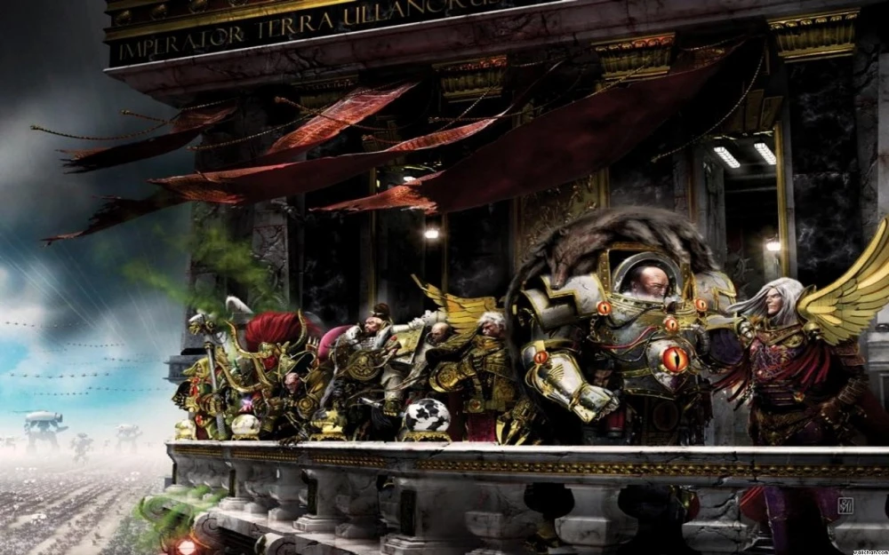

<!-- A0214-B0011 -->

原译文

An assembly of the Primarchs during the great Triumph after the Ullanor Crusade. Left to right: Sanguinius, Mortarion, Magnus the Red, Angron, Jaghatai Khan, Lorgar Aurelian, Rogal Dorn, Horus Lupercal, and Fulgrim. 乌兰诺远征后大庆典期间的一次原体聚会。从左到右：圣吉列斯，莫塔里安，马格努斯，安格隆，察合台可汗，珞珈·奥瑞利安，罗格·多恩，荷鲁斯·卢佩卡尔和福格瑞姆

**校订译文**

An assembly of the Primarchs during the great Triumph after the Ullanor Crusade. Left to right: Sanguinius, Mortarion, Magnus the Red, Angron, Jaghatai Khan, Lorgar Aurelian, Rogal Dorn, Horus Lupercal, and Fulgrim. 乌兰诺远征后大庆典期间的一次原体聚会。从左到右：圣吉列斯，莫塔里安，马格努斯，安格隆，察合台可汗，珞珈·奥瑞利安，罗格·多恩，荷鲁斯·卢佩卡尔和福格瑞姆

<!-- /A0214-B0011 -->

<!-- A0214-B0012 -->
**英文原文**

However, the Gods of Chaos somehow managed to spirit them away just prior to their maturation with a great Warp vortex and it is speculated that they also managed to tamper with the infant Primarchs. The scattering of the Primarchs may have been the result of a Causal Loop created when Argel Tal and his men were sent back in time inside the Eye of Terror to the Emperor's laboratory, as they were convinced by Ingethel the Ascended to destroy the Gellar Fields protecting the infants from the touch of the Chaos Gods. Almost immediately after the Gellar Field generators were disabled, the Primarchs were sucked into a Warp vortex. Other sources state that the Perpetual Erda was involved in the theft of the Primarchs and created the Warp Vortex that scattered them due to her anger over the fate the Emperor planned for her "children". According to Erebus, Erda was unwittingly manipulated by the Chaos Gods into committing this act. Several Primarchs, including Konrad Curze, Roboute Guilliman, and even Sanguinius all came to believe that the scattering of the Primarchs and their upbringing on distant worlds had all been engineered by the Emperor.

<!-- /A0214-B0012 -->

<!-- A0214-B0013 -->

原译文

然而，混沌之神在他们成熟之前设法用一个巨大的亚空间漩涡将他们偷偷带走，据推测，他们还设法篡改了仍是婴儿的原体。原体的分散可能是安格尔·塔尔和他的部下在恐惧之眼被及时送回帝皇的实验室时产生的因果循环的结果，因为他们被升天者英格瑟尔说服摧毁了保护婴儿免受混沌之神触碰的盖勒力场。在盖勒力场发生器被禁用后，原体几乎立即被吸入亚空间漩涡。其他消息来源称，永生者尔达参与了对原体的盗窃，并制造了亚空间漩涡，由于她对帝皇为她的“孩子”计划的命运感到愤怒，亚空间漩涡将他们分散。根据艾瑞巴斯的说法，尔达在不知不觉中被混沌之神操纵，做出了这一行为。包括康拉德·科兹、罗伯特·基里曼甚至圣吉列斯在内的几位原体都开始相信，原体在遥远世界的分散和成长都是由帝皇策划的。

**校订译文**

原体尚未成熟时，混沌诸神以某种方式打开巨大亚空间漩涡，将他们掳走；有人推测，诸神还曾暗中改变这些原体婴儿。有一种说法认为，这是因果循环的结果：阿格尔·塔尔等人在恐惧之眼中被送回过去，来到帝皇的实验室，并受升天者英格泰尔蛊惑，关闭保护婴儿免受混沌触及的盖勒力场。发生器一停，原体便被吸进漩涡。另一些来源则称，尔达不满帝皇为她的孩子安排的命运，亲手制造漩涡，将他们抛散；艾瑞巴斯认为，她在不知情中受了混沌诸神操纵。康拉德·科兹、罗保特·基里曼，甚至圣吉列斯等原体，却又怀疑他们的失散和在遥远世界长大的经历，全都出自帝皇安排。

**校注：** 本段并列多个互不完全相容的起源说法，均归属特定人物或来源，不合并成单一事实。

<!-- /A0214-B0013 -->

<!-- A0214-B0014 -->
**英文原文**

Scattered across the galaxy, beyond the Emperor's reach, and all landed on different worlds vastly separated from their Father. The Emperor could sense that the infant Primarchs were alive, but was unable to reach them. Therefore he used their previously collected DNA samples to create the Space Marines. The genetic material of each one of the Primarchs was used to found a single Space Marine Legion, twenty in total. The new homeworlds of the infant Primarchs and subsequent experiences on those worlds would influence and mold them to a large extent. There they quickly grew to adulthood and often rose to power, ruling, leading, and helping the inhabitants. As the Emperor found them, he was generally pleased by their actions, and quickly gave them the leadership of their respective legion.

<!-- /A0214-B0014 -->

<!-- A0214-B0015 -->

原译文

原体分散在银河系中，超出了帝皇的探查范围，所有人都降落在与父亲相距甚远的不同世界。帝皇能感觉到作为婴儿的原体还活着，但无法接触到他们。因此，他利用他们之前收集的DNA样本创建了星际战士。每一个原体的遗传物质被用来建立一个星际战士军团，总共二十个。婴儿原体的新家园以及随后在这些世界上的经历将在很大程度上影响和塑造他们。在那里，他们迅速成长为成年人，并掌权、统治、领导和帮助居民。当帝皇发现他们时，他对他们的行为普遍感到满意，并迅速将各自军团的领导权交给了他们。

**校订译文**

原体散落银河各处，抵达远离父亲的不同世界，令帝皇鞭长莫及。帝皇能够感知他们尚且活着，却无法找到他们，于是利用事先保存的 DNA 样本创造星际战士，以每位原体的遗传材料建立一个军团，共计二十个。原体的新故乡及其成长经历，深刻塑造了他们的性格。他们迅速长大，往往成为当地的统治者、领袖或保护者。帝皇寻回他们时，通常对其作为感到满意，很快便将相应军团交由他们统领。

<!-- /A0214-B0015 -->

<!-- A0214-B0016 -->
**英文原文**

While Arkhan Land aided the Emperor in investigating the nature of Angron and his Butcher's Nails, the Emperor explained that he had no emotional attachment to the Primarchs because they were tools and weapons. When asked why the Emperor allowed the Primarchs to call him father although he felt no attachment, the Emperor described the Pinnochio story and it is natural for a creation to refer to a creator as father.

<!-- /A0214-B0016 -->

<!-- A0214-B0017 -->

原译文

当阿坎·兰德协助帝皇调查安格隆和他的屠夫之钉的性质时，帝皇解释说，他对原体没有感情上的依恋，因为他们是工具和武器。当被问及为什么帝皇虽然不依恋他们，却允许原体称他为父亲时，帝皇描述了匹诺曹的故事，一个造物将创造者称为父亲是很自然的。

**校订译文**

当阿坎·兰德协助帝皇调查安格隆和他的屠夫之钉的性质时，帝皇解释说，他对原体没有感情上的依恋，因为他们是工具和武器。当被问及为什么帝皇虽然不依恋他们，却允许原体称他为父亲时，帝皇描述了匹诺曹的故事，一个造物将创造者称为父亲是很自然的。

<!-- /A0214-B0017 -->

<!-- A0214-B0018 -->
## Rediscovery 回归

<!-- /A0214-B0018 -->

<!-- A0214-B0019 -->
**英文原文**

Traditional accounts state that the first Primarch to be found was Horus, who became the Emperor's favourite. However a dubious account given by Alpharius states he was the first, and landed on Terra itself following the scattering. Most Primarchs somehow recognized the Emperor on sight, and immediately pledged their allegiance on the spot. A few, (Leman Russ, Ferrus Manus and Vulkan) only followed him after being bested in contests. Angron refused, and was abducted from his homeworld, something he never really accepted. The last to be found was Alpharius.

<!-- /A0214-B0019 -->

<!-- A0214-B0020 -->

原译文

根据传统说法，第一位被发现的原体是荷鲁斯，他成为了帝皇的宠儿。然而，阿尔法瑞斯给出的一个可疑的说法是，他是第一个，在分散之后就降落在了泰拉。大多数原体一看到帝皇就认出了他，并立即当场宣誓效忠。一些人（黎曼·鲁斯、费鲁斯·马努斯和沃坎）在比赛中被击败后才追随他。安格隆拒绝了，并被从他的家园世界绑架，这是他从未真正接受的原因。最后被发现的是阿尔法瑞斯。

**校订译文**

通常的记载称，荷鲁斯最先被寻回，成为帝皇最宠爱的儿子。但阿尔法瑞斯在一份真伪难辨的自述中声称，自己才是第一个，失散后便落在泰拉。多数原体初见帝皇就认出了他，当场效忠；黎曼·鲁斯、费鲁斯·马努斯和沃坎等，则在较量落败后才承认他的领导。安格隆拒绝服从，被强行带离故乡，此事令他始终无法释怀。按公开记载，最后被寻回的是阿尔法瑞斯。

<!-- /A0214-B0020 -->

<!-- A0214-B0021 -->
**英文原文**

According to Malcador the Sigilite, both the Emperor and himself deliberately agitated the Primarchs and sought to turn them against one another, with the resulting war purging certain unmanageable Primarchs and their respective Space Marine Legions just as they had the earlier Thunder Warriors. This would leave humanity, not bio-engineered superhumans, as the rulers of the galaxy. However, the Ruinious Powers intervened before their plan could be fully formulated, leading to disaster in the Horus Heresy. This account may be either a partial or total lie, as Malcador himself seems to keep its validity ambiguous.

<!-- /A0214-B0021 -->

<!-- A0214-B0022 -->

原译文

根据掌印者马卡多的说法，帝皇和他自己都故意激怒了原体，并试图让他们相互对立，由此引发的战争将清除某些无法控制的原体及其各自的星际战士，就像他们清除了早期的雷霆战士一样。这将使人类，而不是生物工程超人，成为银河系的统治者。然而，毁灭力量在他们的计划完全制定之前就进行了干预，导致了荷鲁斯叛乱的灾难。这个说法可能是部分也可能全部是谎言，因为马卡多本人似乎对其有效性持模棱两可的态度。

**校订译文**

马卡多曾声称，他与帝皇刻意挑起原体之间的冲突，想借战争清除难以驾驭的原体及军团，如同此前清除雷霆战士，从而让普通人类最终统治银河。然而，毁灭诸力在计划尚未完全成形时介入，导致荷鲁斯之乱失控。这个说法可能半真半假，也可能完全是谎言；马卡多自己也刻意不说明其真实性。

<!-- /A0214-B0022 -->

<!-- A0214-B0023 -->
**英文原文**

At the end of the Great Crusade Warmaster Horus fell to Chaos, and eight of his fellow Primarchs followed him against the Emperor, resulting in a full-scale civil war known as the Horus Heresy. Each Primarch chose his side, loyalists against traitors, leading their legions against their former comrades.

<!-- /A0214-B0023 -->

<!-- A0214-B0024 -->

原译文

在大远征结束时，战帅荷鲁斯堕入混沌，八名原体跟随他对抗帝皇，导致了一场被称为荷鲁斯叛乱的全面内战。每个原体都选择了自己的一方，忠诚者对抗叛徒，领导他们的军团对抗他们以前的战友。

**校订译文**

大远征末期，荷鲁斯堕入混沌，另外八位原体追随他反抗帝皇，引发荷鲁斯之乱。原体各自选择阵营，率军团向昔日战友开战。

<!-- /A0214-B0024 -->

<!-- A0214-B0025 -->
## List of Primarchs 原体列表

<!-- /A0214-B0025 -->

<!-- A0214-B0026 -->
**英文原文**

I/Dark Angels/Lion El'Jonson/Caliban/Loyal/Alive, active in Imperium Nihilus/846.M30 (11th)

<!-- /A0214-B0026 -->

<!-- A0214-B0027 -->

原译文

第一军团/黑暗天使/莱恩·艾尔庄森/卡利班/忠诚派/存活，在帝国暗面活动/846.M30回归（第十一名）

**校订译文**

第一军团／黑暗天使／莱昂·艾尔’庄森／卡利班／忠诚派／存活，在帝国暗面活动／846.M30 被寻回（第十一位）。

<!-- /A0214-B0027 -->

<!-- A0214-B0028 图片 -->
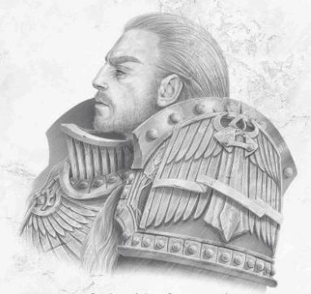

<!-- A0214-B0029 -->

原译文

Lion El'Jonson 莱恩·艾尔庄森

**校订译文**

Lion El'Jonson 莱昂·艾尔’庄森

<!-- /A0214-B0029 -->

<!-- A0214-B0030 图片 -->
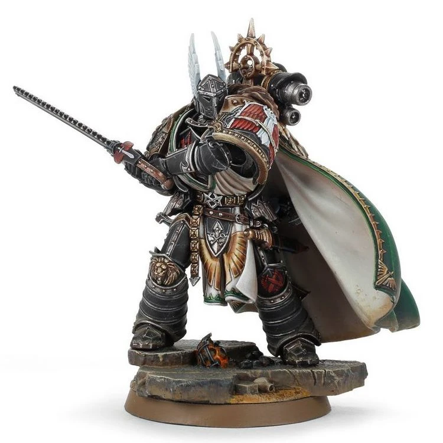

<!-- A0214-B0031 -->

原译文

Lion El'Jonson 莱恩·艾尔庄森

**校订译文**

Lion El'Jonson 莱昂·艾尔’庄森

<!-- /A0214-B0031 -->

<!-- A0214-B0032 -->
**英文原文**

II/Deleted from Imperial records, authorisation unknown./821.M30 (3rd)

<!-- /A0214-B0032 -->

<!-- A0214-B0033 -->

原译文

第二军团/从帝国记录中删除，授权未知/821.M30回归（第三名）

**校订译文**

第二军团/从帝国记录中删除，授权未知/821.M30回归（第三名）

<!-- /A0214-B0033 -->

<!-- A0214-B0034 -->
**英文原文**

III/Emperor's Children/Fulgrim/Chemos/Traitor/Daemon Prince of Slaanesh/830.M30 (5th)

<!-- /A0214-B0034 -->

<!-- A0214-B0035 -->

原译文

第三军团/帝皇之子/福格瑞姆/彻莫斯/叛乱派/色孽恶魔王子/830.M30回归（第五名）

**校订译文**

第三军团/帝皇之子/福格瑞姆/彻莫斯/叛乱派/色孽恶魔王子/830.M30回归（第五名）

<!-- /A0214-B0035 -->

<!-- A0214-B0036 图片 -->
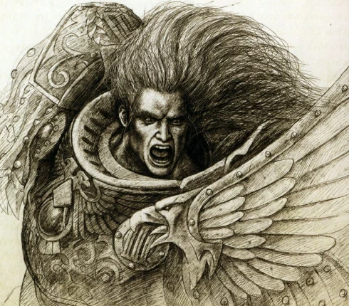

<!-- A0214-B0037 -->

原译文

Fulgrim 福格瑞姆

**校订译文**

Fulgrim 福格瑞姆

<!-- /A0214-B0037 -->

<!-- A0214-B0038 图片 -->
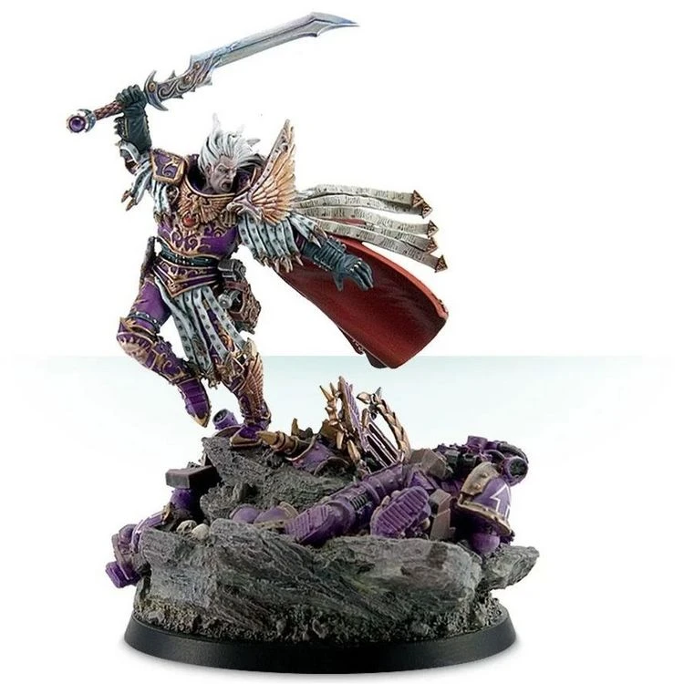

<!-- A0214-B0039 -->

原译文

Fulgrim 福格瑞姆

**校订译文**

Fulgrim 福格瑞姆

<!-- /A0214-B0039 -->

<!-- A0214-B0040 -->
**英文原文**

IV/Iron Warriors/Perturabo/Olympia/Traitor/Daemon Prince of Chaos Undivided/849.M30 (12th)

<!-- /A0214-B0040 -->

<!-- A0214-B0041 -->

原译文

第四军团/钢铁勇士/佩图拉博/奥林匹亚/叛乱派/无分混沌恶魔王子/849.M30回归（第十二名）

**校订译文**

第四军团/钢铁勇士/佩图拉博/奥林匹亚/叛乱派/无分混沌恶魔王子/849.M30回归（第十二名）

<!-- /A0214-B0041 -->

<!-- A0214-B0042 图片 -->
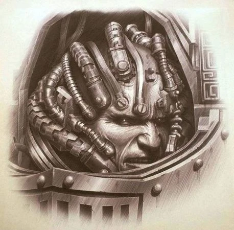

<!-- A0214-B0043 -->

原译文

Perturabo 佩图拉博

**校订译文**

Perturabo 佩图拉博

<!-- /A0214-B0043 -->

<!-- A0214-B0044 图片 -->
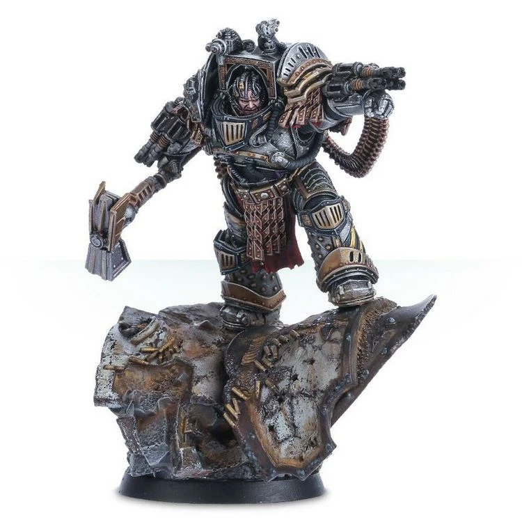

<!-- A0214-B0045 -->

原译文

Perturabo 佩图拉博

**校订译文**

Perturabo 佩图拉博

<!-- /A0214-B0045 -->

<!-- A0214-B0046 -->
**英文原文**

V/White Scars/Jaghatai Khan/Chogoris / Mundus Planus/Loyal/Alive, disappeared in the Webway/865.M30 (15th)

<!-- /A0214-B0046 -->

<!-- A0214-B0047 -->

原译文

第五军团/白色疤痕/察合台可汗/巧高里斯 / 蒙达斯·普莱纳斯/忠诚派/存活，在网道中失踪/865.M30回归（第十五名）

**校订译文**

第五军团／白疤／察合台可汗／乔高里斯，又称蒙达斯·普莱纳斯／忠诚派／存活，在网道中失踪／865.M30 被寻回（第十五位）。

<!-- /A0214-B0047 -->

<!-- A0214-B0048 图片 -->
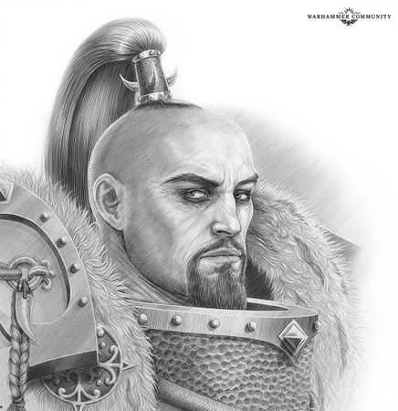

<!-- A0214-B0049 -->

原译文

Jaghatai Khan 察合台可汗

**校订译文**

Jaghatai Khan 察合台可汗

<!-- /A0214-B0049 -->

<!-- A0214-B0050 图片 -->
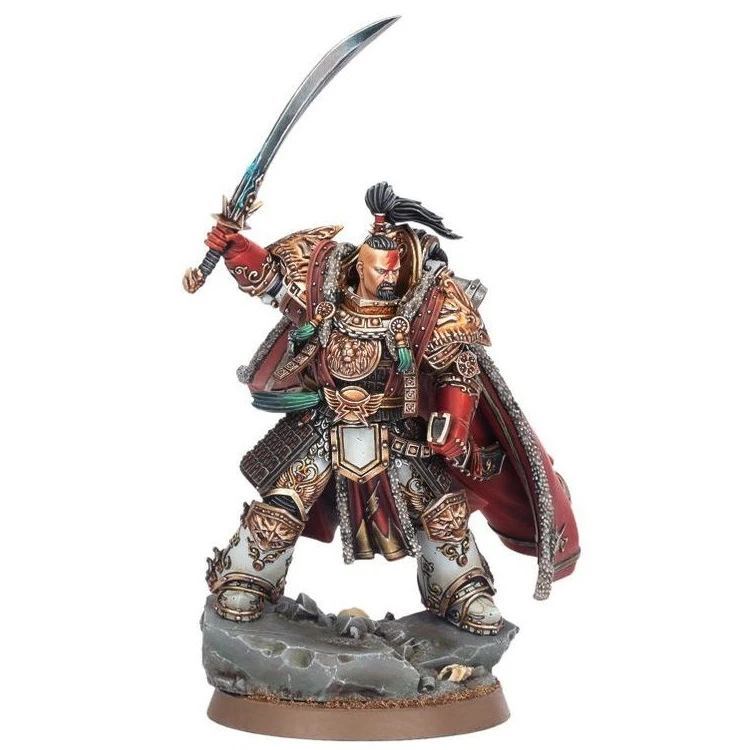

<!-- A0214-B0051 -->

原译文

Jaghatai Khan 察合台可汗

**校订译文**

Jaghatai Khan 察合台可汗

<!-- /A0214-B0051 -->

<!-- A0214-B0052 -->
**英文原文**

VI/Space Wolves/Leman Russ/Fenris/Loyal/Alive, disappeared in the Eye of Terror/819.M30 (2nd)

<!-- /A0214-B0052 -->

<!-- A0214-B0053 -->

原译文

第六军团/太空野狼/黎曼·鲁斯/芬里斯/忠诚派/存活，在恐惧之眼失踪/819.M30回归（第二名）

**校订译文**

第六军团/太空野狼/黎曼·鲁斯/芬里斯/忠诚派/存活，在恐惧之眼失踪/819.M30回归（第二名）

<!-- /A0214-B0053 -->

<!-- A0214-B0054 图片 -->
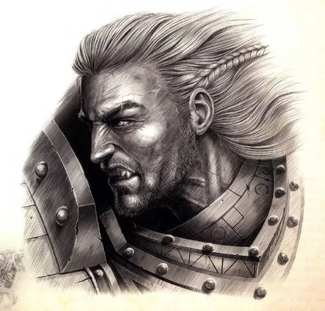

<!-- A0214-B0055 -->

原译文

Leman Russ 黎曼·鲁斯

**校订译文**

Leman Russ 黎曼·鲁斯

<!-- /A0214-B0055 -->

<!-- A0214-B0056 图片 -->
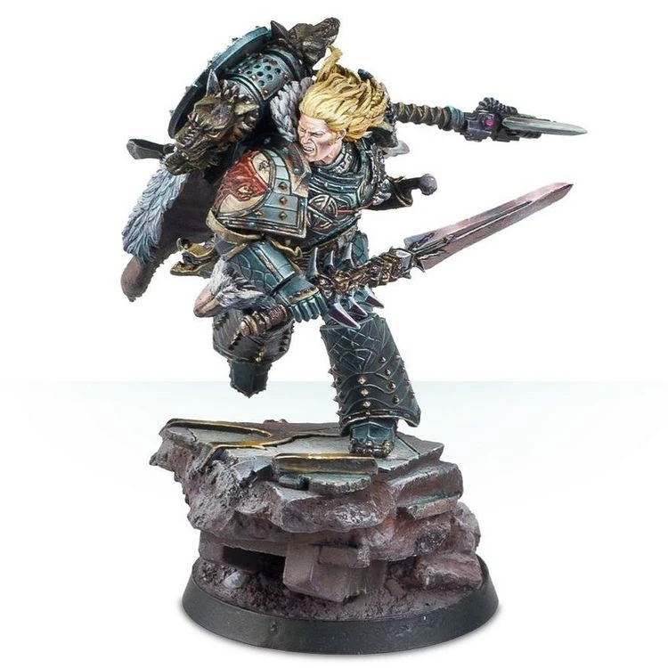

<!-- A0214-B0057 -->

原译文

Leman Russ 黎曼·鲁斯

**校订译文**

Leman Russ 黎曼·鲁斯

<!-- /A0214-B0057 -->

<!-- A0214-B0058 -->
**英文原文**

VII/Imperial Fists/Rogal Dorn/Inwit/Loyal/Dead (Presumed, corpse mostly missing)/835.M30 (7th)

<!-- /A0214-B0058 -->

<!-- A0214-B0059 -->

原译文

第七军团/帝国之拳/罗格·多恩/因维特/忠诚派/死亡（推测，尸体大概率失踪）/835.M30回归（第七名）

**校订译文**

第七军团／帝国之拳／罗格·多恩／因维特／忠诚派／推定死亡，遗体大部分下落不明／835.M30 被寻回（第七位）。

<!-- /A0214-B0059 -->

<!-- A0214-B0060 图片 -->
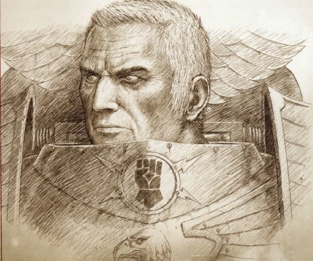

<!-- A0214-B0061 -->

原译文

Rogal Dorn 罗格·多恩

**校订译文**

Rogal Dorn 罗格·多恩

<!-- /A0214-B0061 -->

<!-- A0214-B0062 图片 -->
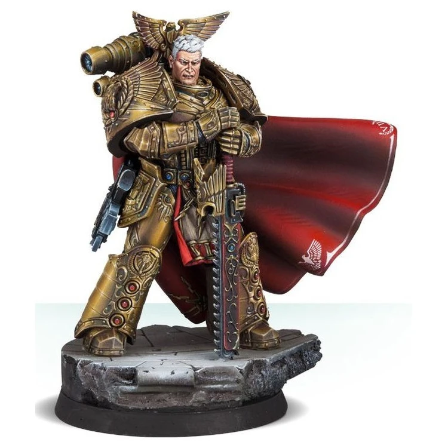

<!-- A0214-B0063 -->

原译文

Rogal Dorn 罗格·多恩

**校订译文**

Rogal Dorn 罗格·多恩

<!-- /A0214-B0063 -->

<!-- A0214-B0064 -->
**英文原文**

VIII/Night Lords/Konrad Curze/Nostramo/Traitor/Dead/896.M30 (16th)

<!-- /A0214-B0064 -->

<!-- A0214-B0065 -->

原译文

第八军团/午夜领主/康拉德·科兹/诺斯特拉莫/叛乱派/死亡/896.M30回归（第十六名）

**校订译文**

第八军团/午夜领主/康拉德·科兹/诺斯特拉莫/叛乱派/死亡/896.M30回归（第十六名）

<!-- /A0214-B0065 -->

<!-- A0214-B0066 图片 -->
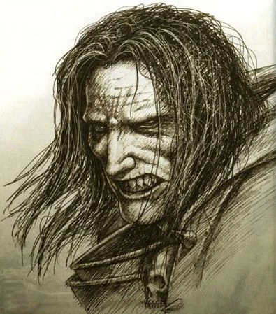

<!-- A0214-B0067 -->

原译文

Konrad Curze 康拉德·科兹

**校订译文**

Konrad Curze 康拉德·科兹

<!-- /A0214-B0067 -->

<!-- A0214-B0068 图片 -->
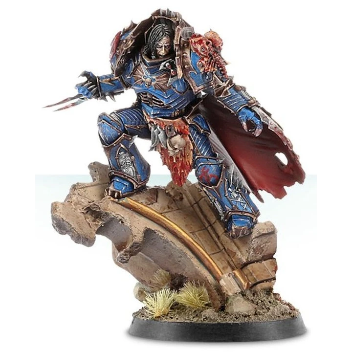

<!-- A0214-B0069 -->

原译文

Konrad Curze 康拉德·科兹

**校订译文**

Konrad Curze 康拉德·科兹

<!-- /A0214-B0069 -->

<!-- A0214-B0070 -->
**英文原文**

IX/Blood Angels/Sanguinius/Baal/Loyal/Dead/843.M30 (10th)

<!-- /A0214-B0070 -->

<!-- A0214-B0071 -->

原译文

第九军团/圣血天使/圣吉列斯/巴尔/忠诚派/死亡/843.M30回归（第十名）

**校订译文**

第九军团/圣血天使/圣吉列斯/巴尔/忠诚派/死亡/843.M30回归（第十名）

<!-- /A0214-B0071 -->

<!-- A0214-B0072 图片 -->
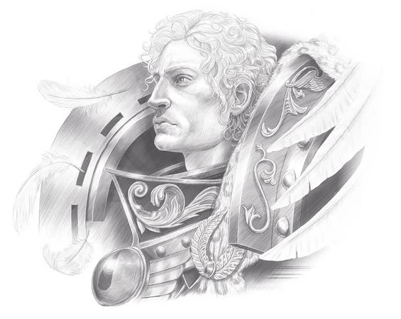

<!-- A0214-B0073 -->

原译文

Sanguinius 圣吉列斯

**校订译文**

Sanguinius 圣吉列斯

<!-- /A0214-B0073 -->

<!-- A0214-B0074 图片 -->
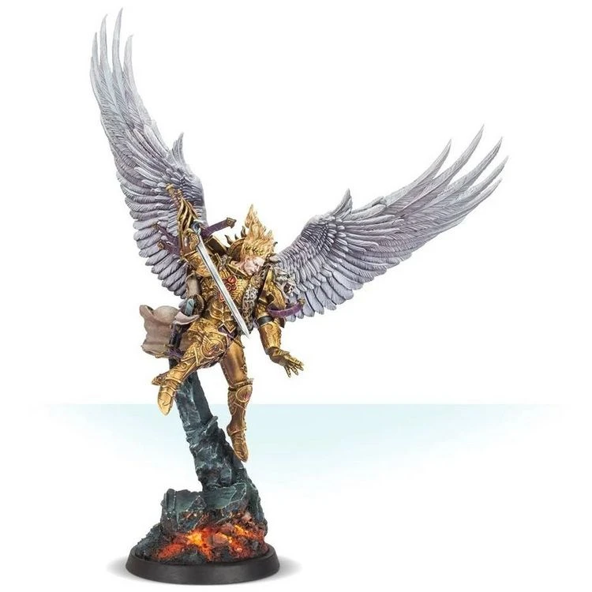

<!-- A0214-B0075 -->

原译文

Sanguinius 圣吉列斯

**校订译文**

Sanguinius 圣吉列斯

<!-- /A0214-B0075 -->

<!-- A0214-B0076 -->
**英文原文**

X/Iron Hands/Ferrus Manus/Medusa/Loyal/Dead/824.M30 (4th)

<!-- /A0214-B0076 -->

<!-- A0214-B0077 -->

原译文

第十军团/钢铁之手/费鲁斯·马努斯/美杜莎/忠诚派/死亡/824.M30回归（第四名）

**校订译文**

第十军团/钢铁之手/费鲁斯·马努斯/美杜莎/忠诚派/死亡/824.M30回归（第四名）

<!-- /A0214-B0077 -->

<!-- A0214-B0078 图片 -->
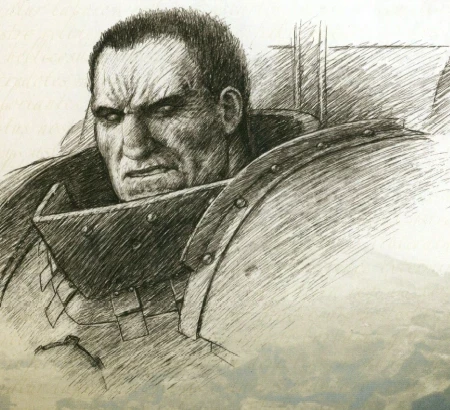

<!-- A0214-B0079 -->

原译文

Ferrus Manus 费鲁斯·马努斯

**校订译文**

Ferrus Manus 费鲁斯·马努斯

<!-- /A0214-B0079 -->

<!-- A0214-B0080 图片 -->
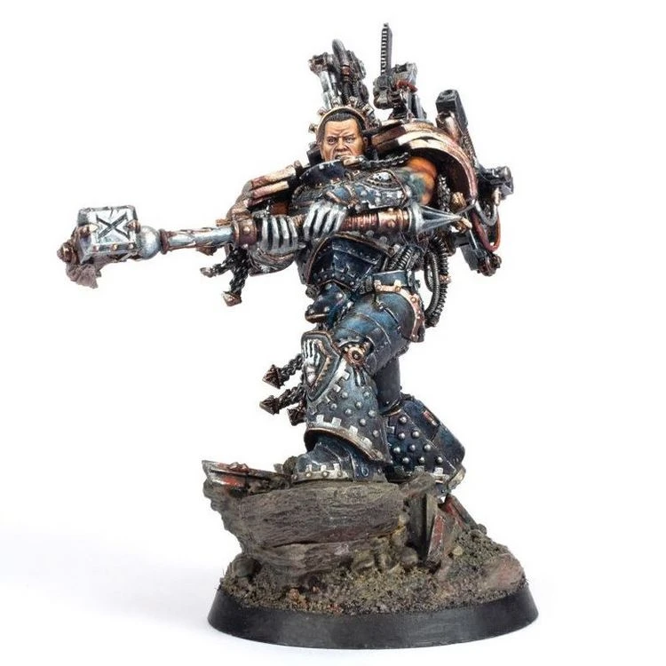

<!-- A0214-B0081 -->

原译文

Ferrus Manus 费鲁斯·马努斯

**校订译文**

Ferrus Manus 费鲁斯·马努斯

<!-- /A0214-B0081 -->

<!-- A0214-B0082 -->
**英文原文**

XI/Deleted from Imperial records, authorisation unknown. / 927.M30 (19th)

<!-- /A0214-B0082 -->

<!-- A0214-B0083 -->

原译文

第十一军团/从帝国记录中删除，授权未知/927.M30回归（第十九名）

**校订译文**

第十一军团/从帝国记录中删除，授权未知/927.M30回归（第十九名）

<!-- /A0214-B0083 -->

<!-- A0214-B0084 -->
**英文原文**

XII/World Eaters/Angron/Nuceria/Traitor/Daemon Prince of Khorne/899.M30 (17th)

<!-- /A0214-B0084 -->

<!-- A0214-B0085 -->

原译文

第十二军团/吞世者/安格隆/努凯里亚/叛乱派/恐虐恶魔王子/899.M30回归（第十七名）

**校订译文**

第十二军团/吞世者/安格隆/努凯里亚/叛乱派/恐虐恶魔王子/899.M30回归（第十七名）

<!-- /A0214-B0085 -->

<!-- A0214-B0086 图片 -->
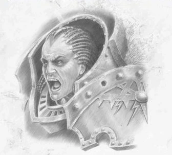

<!-- A0214-B0087 -->

原译文

Angron 安格隆

**校订译文**

Angron 安格隆

<!-- /A0214-B0087 -->

<!-- A0214-B0088 图片 -->
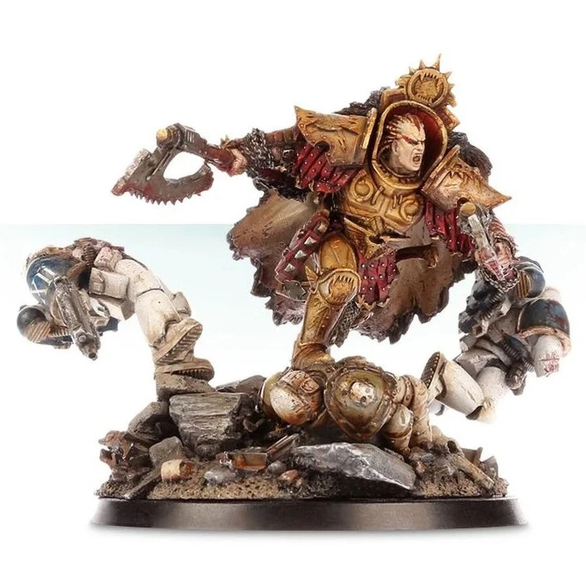

<!-- A0214-B0089 -->

原译文

Angron 安格隆

**校订译文**

Angron 安格隆

<!-- /A0214-B0089 -->

<!-- A0214-B0090 -->
**英文原文**

XIII/Ultramarines/Roboute Guilliman/Macragge/Loyal/Alive, active in Imperium Sanctus/837.M30 (8th)

<!-- /A0214-B0090 -->

<!-- A0214-B0091 -->

原译文

第十三军团/极限战士/罗伯特·基里曼/马库拉格/忠诚派/存活,在帝国暗面活动/837.M30回归（第八名）

**校订译文**

第十三军团／极限战士／罗保特·基里曼／马库拉格／忠诚派／存活，在帝国圣疆活动／837.M30 被寻回（第八位）。

<!-- /A0214-B0091 -->

<!-- A0214-B0092 图片 -->
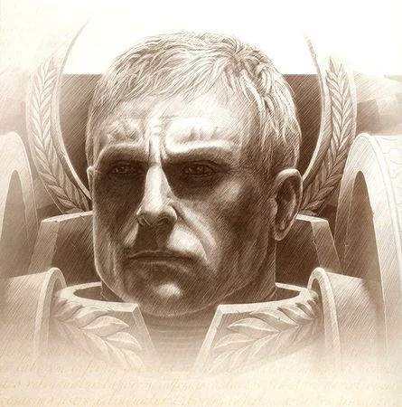

<!-- A0214-B0093 -->

原译文

Roboute Guilliman 罗伯特·基里曼

**校订译文**

Roboute Guilliman 罗保特·基里曼

<!-- /A0214-B0093 -->

<!-- A0214-B0094 图片 -->
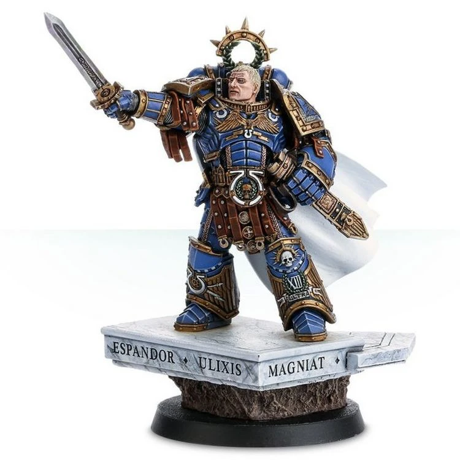

<!-- A0214-B0095 -->

原译文

Roboute Guilliman 罗伯特·基里曼

**校订译文**

Roboute Guilliman 罗保特·基里曼

<!-- /A0214-B0095 -->

<!-- A0214-B0096 -->
**英文原文**

XIV/Death Guard/Mortarion/Barbarus/Traitor/Daemon Prince of Nurgle/854.M30 (13th)

<!-- /A0214-B0096 -->

<!-- A0214-B0097 -->

原译文

第十四军团/死亡守卫/莫塔里安/巴巴鲁斯/叛乱派/纳垢恶魔王子/854.M30回归（第十三名）

**校订译文**

第十四军团/死亡守卫/莫塔里安/巴巴鲁斯/叛乱派/纳垢恶魔王子/854.M30回归（第十三名）

<!-- /A0214-B0097 -->

<!-- A0214-B0098 图片 -->
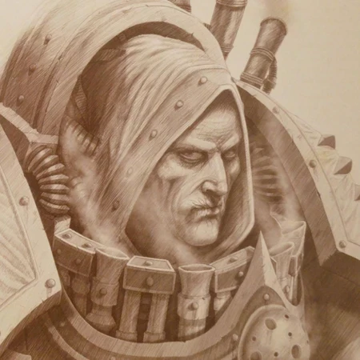

<!-- A0214-B0099 -->

原译文

Mortarion 莫塔里安

**校订译文**

Mortarion 莫塔里安

<!-- /A0214-B0099 -->

<!-- A0214-B0100 图片 -->
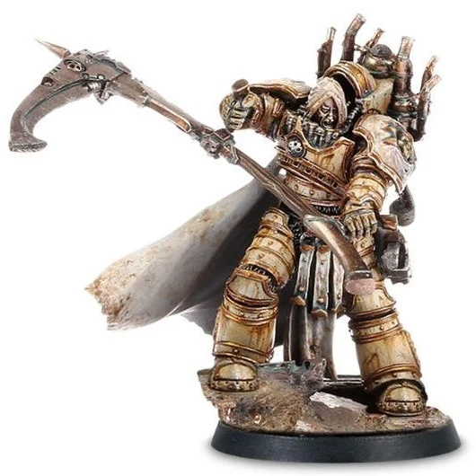

<!-- A0214-B0101 -->

原译文

Mortarion 莫塔里安

**校订译文**

Mortarion 莫塔里安

<!-- /A0214-B0101 -->

<!-- A0214-B0102 -->
**英文原文**

XV/Thousand Sons/Magnus the Red/Prospero/Traitor/Daemon Prince of Tzeentch/840.M30 (9th)

<!-- /A0214-B0102 -->

<!-- A0214-B0103 -->

原译文

第十五军团/千疮之子/赤红之马格努斯/普罗斯佩罗/叛乱派/奸奇恶魔王子/840.M30回归（第九名）

**校订译文**

第十五军团／千子／红魔马格努斯／普罗斯佩罗／叛徒／奸奇恶魔王子／840.M30 被寻回（第九位）。

<!-- /A0214-B0103 -->

<!-- A0214-B0104 图片 -->
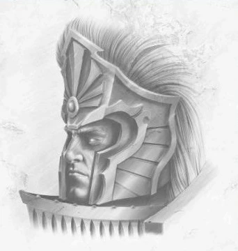

<!-- A0214-B0105 -->

原译文

Magnus the Red 赤红之马格努斯

**校订译文**

Magnus the Red 红魔马格努斯

<!-- /A0214-B0105 -->

<!-- A0214-B0106 图片 -->
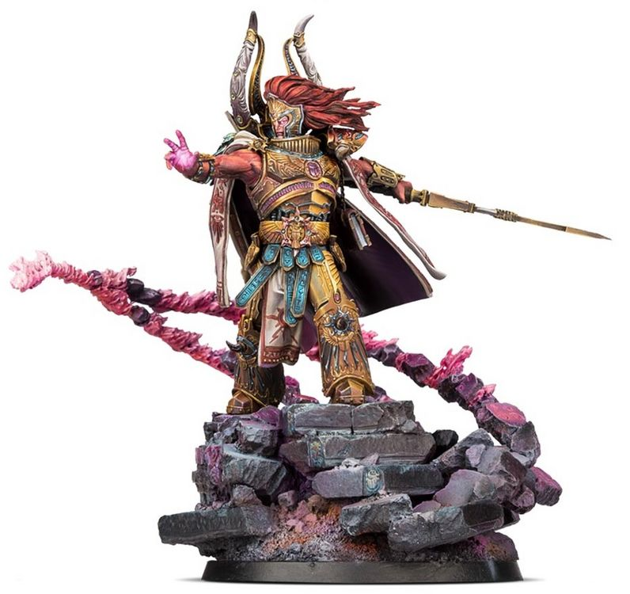

<!-- A0214-B0107 -->

原译文

Magnus the Red 赤红之马格努斯

**校订译文**

Magnus the Red 红魔马格努斯

<!-- /A0214-B0107 -->

<!-- A0214-B0108 -->
**英文原文**

XVI/Luna Wolves / Sons of Horus/Horus Lupercal/Cthonia/Traitor/Dead/801.M30 (1st)

<!-- /A0214-B0108 -->

<!-- A0214-B0109 -->

原译文

第十六军团/影月苍狼 / 荷鲁斯之子/荷鲁斯·卢佩卡尔/克苏尼亚/叛乱派/死亡/801.M30回归（第一名）

**校订译文**

第十六军团／影月苍狼，后称荷鲁斯之子／荷鲁斯·卢佩卡尔／科索尼亚／叛徒／死亡／801.M30 被寻回（第一位）。

<!-- /A0214-B0109 -->

<!-- A0214-B0110 图片 -->
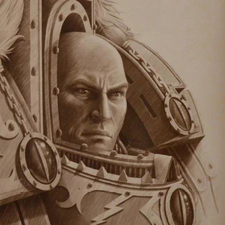

<!-- A0214-B0111 -->

原译文

Horus Lupercal 荷鲁斯·卢佩卡尔

**校订译文**

Horus Lupercal 荷鲁斯·卢佩卡尔

<!-- /A0214-B0111 -->

<!-- A0214-B0112 图片 -->
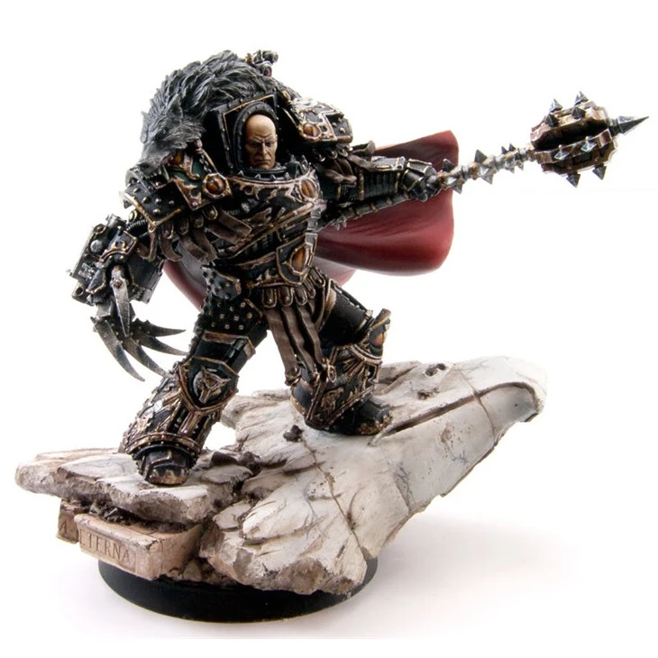

<!-- A0214-B0113 -->

原译文

Horus Lupercal 荷鲁斯·卢佩卡尔

**校订译文**

Horus Lupercal 荷鲁斯·卢佩卡尔

<!-- /A0214-B0113 -->

<!-- A0214-B0114 -->
**英文原文**

XVII/Word Bearers/Lorgar Aurelian/Colchis/Traitor/Daemon Prince of Chaos Undivided/857.M30 (14th)

<!-- /A0214-B0114 -->

<!-- A0214-B0115 -->

原译文

第十七军团/怀言者/珞珈·奥瑞利安/科尔基斯/叛乱派/混沌无分恶魔王子/857.M30回归（第十四名）

**校订译文**

第十七军团/怀言者/珞珈·奥瑞利安/科尔基斯/叛乱派/混沌无分恶魔王子/857.M30回归（第十四名）

<!-- /A0214-B0115 -->

<!-- A0214-B0116 图片 -->
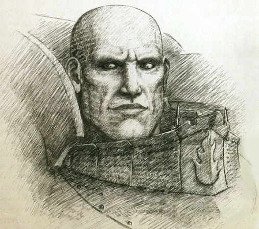

<!-- A0214-B0117 -->

原译文

Lorgar Aurelian 珞珈·奥瑞利安

**校订译文**

Lorgar Aurelian 珞珈·奥瑞利安

<!-- /A0214-B0117 -->

<!-- A0214-B0118 图片 -->
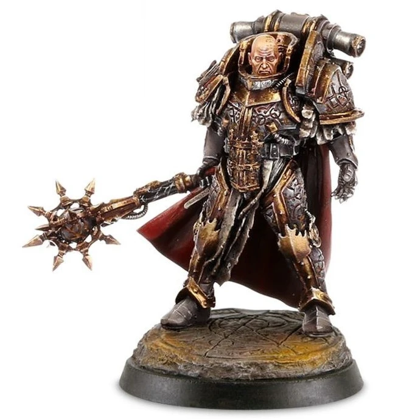

<!-- A0214-B0119 -->

原译文

Lorgar Aurelian 珞珈·奥瑞利安

**校订译文**

Lorgar Aurelian 珞珈·奥瑞利安

<!-- /A0214-B0119 -->

<!-- A0214-B0120 -->
**英文原文**

XVIII/Salamanders/Vulkan/Nocturne/Loyal/Dead but perpetual/832.M30 (6th)

<!-- /A0214-B0120 -->

<!-- A0214-B0121 -->

原译文

第十八军团/火蜥蜴/沃坎/夜曲星/忠诚派/死亡但是永生者/832.M30回归（第六名）

**校订译文**

第十八军团/火蜥蜴/沃坎/夜曲星/忠诚派/死亡但是永生者/832.M30回归（第六名）

**校注：** 沃坎状态原文为 Dead but perpetual；保留“死亡但为永生者”的来源说法，未把它改作本次核实的现况。

<!-- /A0214-B0121 -->

<!-- A0214-B0122 图片 -->
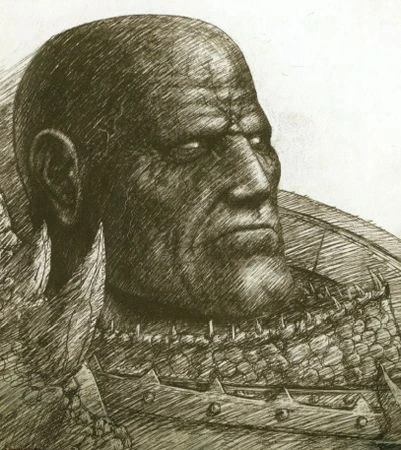

<!-- A0214-B0123 -->

原译文

Vulkan 沃坎

**校订译文**

Vulkan 沃坎

<!-- /A0214-B0123 -->

<!-- A0214-B0124 图片 -->
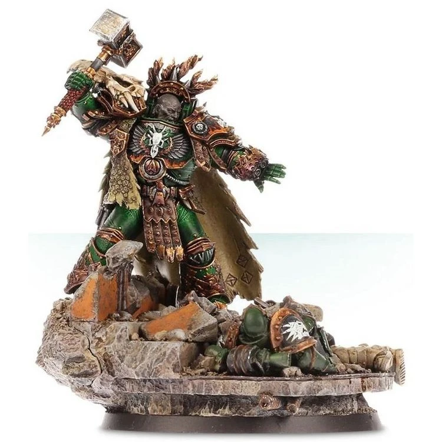

<!-- A0214-B0125 -->

原译文

Vulkan 沃坎

**校订译文**

Vulkan 沃坎

<!-- /A0214-B0125 -->

<!-- A0214-B0126 -->
**英文原文**

XIX/Raven Guard/Corvus Corax/Deliverance/Loyal/Alive, disappeared in the Eye of Terror/922.M30 (18th)

<!-- /A0214-B0126 -->

<!-- A0214-B0127 -->

原译文

第十九军团/暗鸦守卫/科沃斯·科拉克斯/拯救星/忠诚派/存活,在恐惧之眼失踪/922.M30回归（第十八名）

**校订译文**

第十九军团/暗鸦守卫/科沃斯·科拉克斯/拯救星/忠诚派/存活,在恐惧之眼失踪/922.M30回归（第十八名）

<!-- /A0214-B0127 -->

<!-- A0214-B0128 图片 -->
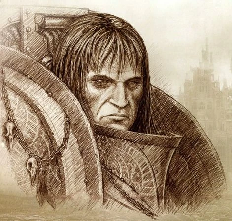

<!-- A0214-B0129 -->

原译文

Corvus Corax 科沃斯·科拉克斯

**校订译文**

Corvus Corax 科沃斯·科拉克斯

<!-- /A0214-B0129 -->

<!-- A0214-B0130 图片 -->
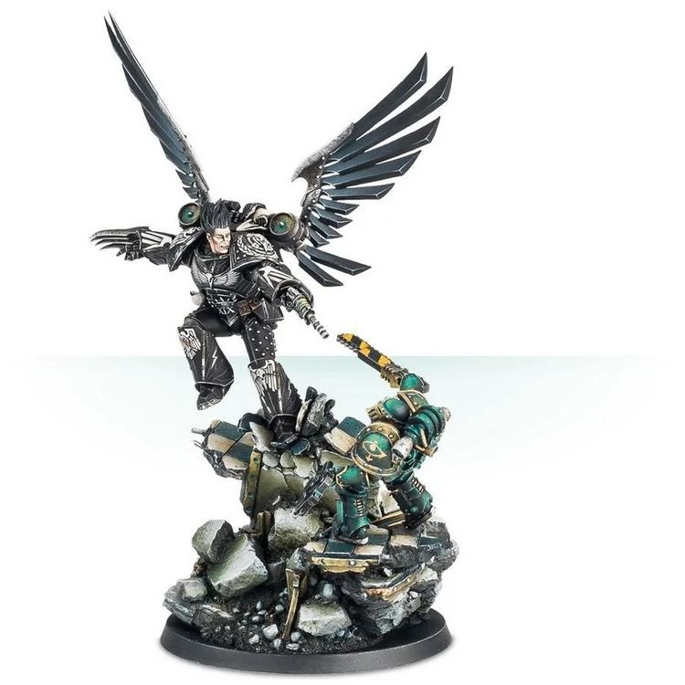

<!-- A0214-B0131 -->

原译文

Corvus Corax 科沃斯·科拉克斯

**校订译文**

Corvus Corax 科沃斯·科拉克斯

<!-- /A0214-B0131 -->

<!-- A0214-B0132 -->
**英文原文**

XX/Alpha Legion/Alpharius Omegon/Terra (Alpharius) Unknown (Omegon)/Traitor/Dead (Alpharius) Unknown (Omegon)/981.M30 (officially 20th)

<!-- /A0214-B0132 -->

<!-- A0214-B0133 -->

原译文

第二十军团/阿尔法军团/阿尔法瑞斯 欧米茄/泰拉 未知/叛乱派/死亡 未知/981.M30回归（官方上第二十名）

**校订译文**

第二十军团／阿尔法军团／阿尔法瑞斯与欧米伽／母星：阿尔法瑞斯为泰拉，欧米伽未知／叛徒／阿尔法瑞斯已死，欧米伽状态未知／981.M30 被寻回（公开记录中的第二十位）。

<!-- /A0214-B0133 -->

<!-- A0214-B0134 图片 -->
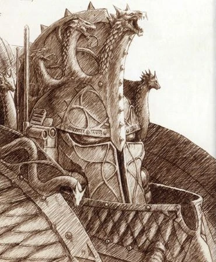

<!-- A0214-B0135 -->

原译文

Alpharius 阿尔法瑞斯

**校订译文**

Alpharius 阿尔法瑞斯

<!-- /A0214-B0135 -->

<!-- A0214-B0136 图片 -->
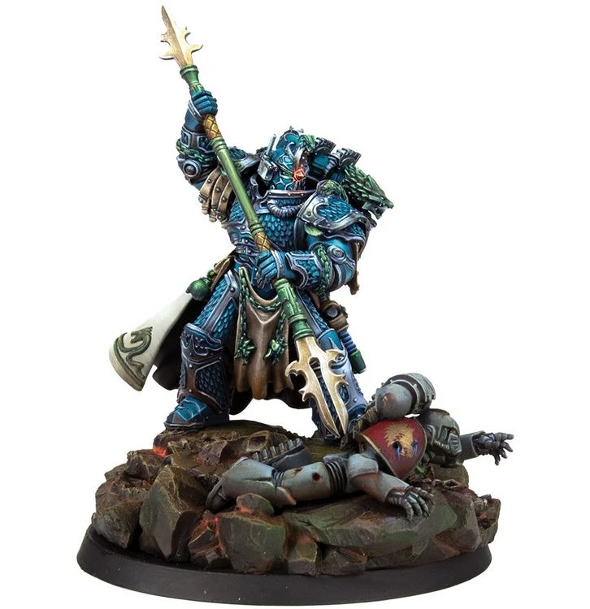

<!-- A0214-B0137 -->

原译文

Alpharius 阿尔法瑞斯

**校订译文**

Alpharius 阿尔法瑞斯

<!-- /A0214-B0137 -->

<!-- A0214-B0138 -->
**英文原文**

Note 1: While the official Primarch rediscovery order does not distinguish between the Second and Eleventh Primarchs, the novel Fulgrim: The Palatine Phoenix confirms that the Second was one of the first eight Primarchs rediscovered.

<!-- /A0214-B0138 -->

<!-- A0214-B0139 -->

原译文

注1：虽然官方的原体回归顺序没有区分第二位和第十一位原体，但小说《福格瑞姆：帕拉丁凤凰》证实，第二位原体是首批回归的八位原体之一。

**校订译文**

注 1：官方寻回年表并未区分第二和第十一原体的日期归属，但《福格瑞姆：帝国凤凰》确认，第二原体属于最早被寻回的八位原体。

<!-- /A0214-B0139 -->

<!-- A0214-B0140 -->
**英文原文**

Note 2: Officially, Horus was the first Primarch rediscovered and Alpharius the last. According to Alpharius's own account, however, he was in fact the first Primarch recovered by the Emperor and Horus the second, with Alpharius's existence being kept secret until his twin Omegon - the last undiscovered Primarch - revealed himself (as 'Alpharius') to Horus and the Imperium.

<!-- /A0214-B0140 -->

<!-- A0214-B0141 -->

原译文

注2：正式来说，荷鲁斯是第一个回归的原体，阿尔法瑞斯是最后一个。然而，根据阿尔法瑞斯自己的说法，他实际上是帝皇找到的第一位原体，荷鲁斯是找到的第二位原体，阿尔法瑞斯的存在一直保密，直到他的双胞胎欧米茄——最后一位未被发现的原体——向荷鲁斯和帝国暴露了自己（作为“阿尔法瑞斯”）。

**校订译文**

注 2：公开记载中，荷鲁斯最先被寻回，阿尔法瑞斯最后。但按阿尔法瑞斯自己的说法，帝皇最先寻回的是他，荷鲁斯只是第二；他的存在一直保密，直到最后一位尚未被寻回的原体——双胞胎兄弟欧米伽——以“阿尔法瑞斯”的身份出现在荷鲁斯与帝国面前。

<!-- /A0214-B0141 -->

<!-- A0214-B0142 -->
**英文原文**

The following are not Primarchs and hence are not in this list, although they are thematically similar and predate any Space Marines coming into existence:

<!-- /A0214-B0142 -->

<!-- A0214-B0143 -->

原译文

以下不是原体，因此不在此列表中，尽管它们在主题上相似，并且早于任何星际战士的出现：

**校订译文**

以下不是原体，因此不在此列表中，尽管它们在主题上相似，并且早于任何星际战士的出现：

<!-- /A0214-B0143 -->

<!-- A0214-B0144 -->
**英文原文**

The Angel, a humanoid bioweapon developed to destroy the Emperor's enemies.

<!-- /A0214-B0144 -->

<!-- A0214-B0145 -->

原译文

天使，一种人形生物武器，旨在摧毁帝皇之敌。

**校订译文**

天使，一种人形生物武器，旨在摧毁帝皇之敌。

<!-- /A0214-B0145 -->

<!-- A0214-B0146 -->
**英文原文**

Arik Taranis, one of the first and last Thunder Warriors.

<!-- /A0214-B0146 -->

<!-- A0214-B0147 -->

原译文

阿里克·塔兰尼斯，第一个也是最后一个雷霆战士之一。

**校订译文**

阿里克·塔兰尼斯——最早诞生、也最晚幸存的雷霆战士之一。

<!-- /A0214-B0147 -->

<!-- A0214-B0148 -->
**英文原文**

Constantin Valdor, the first Custodian.

<!-- /A0214-B0148 -->

<!-- A0214-B0149 -->

原译文

康斯坦丁·瓦尔多，第一位禁军。

**校订译文**

康斯坦丁·瓦尔多，第一位禁军。

<!-- /A0214-B0149 -->

<!-- A0214-B0150 -->
## Two unknown Primarchs 两名未知原体

<!-- /A0214-B0150 -->

<!-- A0214-B0151 -->
**英文原文**

Almost nothing is known about the two unknown primarchs.

<!-- /A0214-B0151 -->

<!-- A0214-B0152 -->

原译文

关于这两位未知的原体，我们几乎一无所知。

**校订译文**

关于这两位未知的原体，我们几乎一无所知。

<!-- /A0214-B0152 -->

<!-- A0214-B0153 -->
**英文原文**

References to the second and eleventh Primarchs are made in the short story The Lightning Tower, in which Rogal Dorn describes the plinths on which their statues stand should be vacant and says that 'no one ever spoke of those two absent brothers. Their separate tragedies had seemed like aberrations. Had they, in fact, been warnings that no one had heeded?' Also in The First Heretic, Lorgar makes several references, saying that the Emperor ordered that they be forgotten. During the time five Word Bearer captains spent being shown secrets of the galaxy by the daemon Ingethel, they are shown the Emperor's gene-labs where he is creating the Primarchs and the moment that they were scattered by Chaos. During their time wandering the labs as insubstantial ghosts, undetectable as long as they didn't touch anything, they speak of the two lost legions, mentioning how they were erased from Imperial records and how Roboute Guilliman's Ultramarines legion mysteriously swelled in numbers each time one of the two legions was "erased." The implication seems clear that at least part of the fighting force of the "lost" legions was entrusted to Roboute Guilliman and incorporated into the Ultramarines.

<!-- /A0214-B0153 -->

<!-- A0214-B0154 -->

原译文

短篇小说《闪电之塔》中提到了第二位和第十一位原体，罗格·多恩在小说中描述了他们雕像的基座应该是空的，并说“从来没有人提到过那两位缺席的兄弟。他们各自的悲剧似乎有些反常。难道他们真的是没有人注意到的警告吗？”同样在《异端初现》中，珞珈也多次提及，称帝皇下令将他们遗忘。在恶魔英格瑟尔向五位怀言者连长展示银河系秘密的过程中，他们看到了帝皇的基因实验室，在那里他创造了原体，以及他们被混沌分散的那一刻。在他们作为虚幻的鬼魂在实验室里游荡的时候，只要他们不碰任何东西，就无法被发现，他们谈到了两个失落的军团，提到他们是如何从帝国记录中抹去的，以及每次两个军团中的一个被“抹去”时，罗伯特·基里曼的极限战士军团的人数是如何神秘地增加的。这似乎表明，“失落”军团的至少一部分战斗力量被委托给罗伯特·基里曼并并入了极限战士。

**校订译文**

《闪电之塔》中，多恩望着第二与第十一原体雕像所在的空基座，想到：“没有人提起那两位缺席的兄弟。他们各自的悲剧，曾被视为偶然的反常。难道那其实是无人理会的警告？”《叛乱之首》中，珞珈也提到，帝皇命令众人遗忘他们。恶魔英格泰尔带五位怀言者连长观看银河秘密时，让他们看到帝皇创造原体的实验室，以及原体遭混沌抛散的时刻。他们化作无形幽魂，只要不触碰物件便不会被发现。在实验室内，他们谈到两失落军团如何被抹除，以及每当一个军团被抹除，极限战士兵力就会神秘增长。原条目由此推测，失落军团的部分战士可能交给罗保特·基里曼，编入了极限战士。

<!-- /A0214-B0154 -->

<!-- A0214-B0155 -->
**英文原文**

Note: if this is true, then perhaps entire chapters descended from the original Ultramarines legion are in fact part of the gene-seed of the two lost legions. At the time of the Heresy remarks made by the five Word Bearers captains Argel Tal, Xaphen, Torgal, Malnor, and Dagotal suggest that the fate of the lost legions is relatively common knowledge though kept hushed up. In the intervening ten millennia between the Heresy and the current age of the 41st millennium it is likely this information was forgotten. It is a coincidental side-note that the lost legions were numbers two and eleven. Two plus eleven equals thirteen - the number of the Ultramarines legion.

<!-- /A0214-B0155 -->

<!-- A0214-B0156 -->

原译文

注意：如果这是真的，那么也许最初的星际战士军团的整个战团实际上都是这两个失落军团的基因种子的一部分。在叛乱时期，五位怀言者连长安格尔·塔尔、夏芬、托加尔、马尔诺和达格特尔发表的言论表明，尽管被隐瞒了，但失落军团的命运是相对普遍的。在叛乱和第41个千年之间的一万年里，这些信息很可能被遗忘了。巧合的是，失落的军团是第二和第十一军团。二加十一等于十三——极限战士军团的编号。

**校订译文**

注：如果这一推测属实，那么某些被认为源自极限战士的后继战团，实际上可能携带失落军团的基因种子。原条目认为，阿格尔·塔尔、夏芬、托加尔、马尔诺和达格特尔的谈话，显示两军团的命运在当时或许并非鲜为人知，只是遭到噤声；此后历经一万年，到第 41 千年才逐渐被遗忘。原条目还附带指出数字巧合：第二与第十一相加，正好是极限战士的编号十三。

**校注：** 失落军团并入极限战士为推测；二加十一等于十三仅是数值巧合，不是证据。

<!-- /A0214-B0156 -->

<!-- A0214-B0157 -->
**英文原文**

The traitor Primarchs in this story are covered with a shroud, so the fate of the second and eleventh is undetermined. They may have been found and befell a tragedy as it implies they were spoken about previously.

<!-- /A0214-B0157 -->

<!-- A0214-B0158 -->

原译文

这个故事中的叛乱原体被裹尸布覆盖着，所以第二位和第十一位的命运尚未确定。他们可能已经被发现，并遭遇了一场悲剧，因为这意味着他们之前曾被提及过。

**校订译文**

《闪电之塔》中被布幔遮盖的是叛徒原体的雕像，因此不能据此确定第二与第十一原体的命运；相关叙述只暗示，他们曾被寻回，并各自遭遇悲剧。

<!-- /A0214-B0158 -->

<!-- A0214-B0159 -->
**英文原文**

In the novel Prospero Burns by Dan Abnett, it is suggested that Leman Russ and his Space Wolves legion had been used by the Emperor in the past to cull/pacify the two legions and that the Emperor had created the Wolves for just such an event, utilizing their barbaric, untamed nature as a sort of insurance policy for use against other Space Marine Legions. This is further demonstrated by the unleashing of the Wolves on the Thousand Sons Legion in the same novel.

<!-- /A0214-B0159 -->

<!-- A0214-B0160 -->

原译文

在丹·阿伯尼特的小说《普罗斯佩罗之焚》中，有人认为黎曼·鲁斯和他的太空野狼军团过去曾被帝皇用来消灭/安抚这两个军团，而帝皇正是为了这样的事件而创造了太空野狼，利用它们残暴、野性的天性作为一种保险，用于对抗其他星际战士。在同一部小说中，在千子军团上被释放的太空野狼，这进一步证明了这一点。

**校订译文**

丹·阿伯尼特的《普罗斯佩罗之焚》暗示，帝皇过去可能曾派黎曼·鲁斯及太空野狼清剿或镇压这两个军团；野狼或许正为此而生，以其狂野凶悍的性格，充当制衡其他星际战士军团的后手。同书中，太空野狼受命进攻千子，也体现了这种惩戒职能。

<!-- /A0214-B0160 -->

<!-- A0214-B0161 -->
## Clones 克隆体

<!-- /A0214-B0161 -->

<!-- A0214-B0162 -->
**英文原文**

There have been several instances of cloned Primarchs, the result being a mentally unstable, confused, and sometimes deformed creature. The first cloned primarch was Ferrus Manus, created by Fabius Bile at the demand of a mad Fulgrim. Fulgrim attempted to again convert Ferrus to his cause before killing him once more, a process that was repeated multiple times with new clones.

<!-- /A0214-B0162 -->

<!-- A0214-B0163 -->

原译文

已经有过几次克隆原体的例子，得到的结果是一种精神不稳定、混乱、有时畸形的生物。第一个克隆的原体是费鲁斯·马努斯，由法比乌斯·拜尔应疯狂的福格瑞姆的要求创造。福格瑞姆试图在再次杀死他之前将费鲁斯转化到他的事业中，这个过程在新的克隆体身上重复了多次。

**校订译文**

原体曾数次被克隆，产物往往精神不稳定、意识混乱，有时还会畸形。第一个克隆原体是费鲁斯·马努斯，由法比乌斯·拜尔应陷入疯狂的福格瑞姆之要求创造。福格瑞姆不断尝试劝其加入自己，又将其杀死；这一过程在新的克隆体身上反复上演。

<!-- /A0214-B0163 -->

<!-- A0214-B0164 -->
**英文原文**

Perhaps the most notable example of a cloned Primarch was after the Horus Heresy, where Fabius Bile again cloned a son of the Emperor, this time Horus from DNA provided by the Warmaster's corpse. Confused and senile, this clone of Horus didn't initially recognize many of his closest comrades such as Ezekyle Abaddon and proved a poor imitation of the real Lupercal. Abaddon killed the clone, and in its dying moments it recognized who the First Captain was. During the same period, Bile attempted to clone all twenty Primarchs from gathered samples, the result being a hall of pods with monstrosities and deformed adolescent creatures. All of these abominations were killed by Abaddon and his forces.

<!-- /A0214-B0164 -->

<!-- A0214-B0165 -->

原译文

也许克隆的原体最著名的例子是在荷鲁斯叛乱之后，法比乌斯·拜尔再次克隆了帝皇的儿子，这次是从战帅尸体提供的DNA中克隆荷鲁斯。这个克隆的荷鲁斯既困惑又衰老，最初并没有认出许多他最亲密的战友，如伊泽凯尔·阿巴顿，事实证明，这是对真正的卢佩卡尔的拙劣模仿。阿巴顿杀死了克隆人，在它临死的时候，它认出了一连长是谁。在同一时期，拜尔试图从收集的样本中克隆所有二十位原体，结果则是一个有着巨大而丑陋之物和畸形未成熟生物的箱型大厅。所有这些可憎之物都被阿巴顿和他的军队杀死了。

**校订译文**

最著名的例子或许是荷鲁斯之乱后，拜尔从战帅遗体取得 DNA，克隆出了荷鲁斯。这个克隆体神志混乱、反应迟钝，起初连以泽凯尔·阿巴顿等最亲近的战友都认不出来，被本段形容为卢佩卡尔的拙劣仿制品。阿巴顿将其杀死，它直到弥留之际才认出第一连长。同期，拜尔还曾试图用收集的样本克隆全部二十位原体，结果是一整厅培养舱，装满怪物和畸形的未成熟生物；这些造物最终都被阿巴顿及其部队消灭。

<!-- /A0214-B0165 -->

<!-- A0214-B0166 -->
**英文原文**

Sometime after The Shattering, Bile discovered one of his clones of Fulgrim managed to survive underneath the rubble of Harmony. Under Bile's care the clone rapidly matured and was "pure", retaining none of Fulgrim's corruption. However when Bile believed that the clone still retained all of Fulgrim's arrogance and was doomed to go down the same path as the original, he traded him to Trazyn the Infinite in exchange for a lost Emperor's Children Gene-Seed stock.

<!-- /A0214-B0166 -->

<!-- A0214-B0167 -->

原译文

在大破碎之后的某个时候，拜尔发现他的一个克隆的福格瑞姆设法在和谐星的废墟下生存了下来。在拜尔的照顾下，克隆人迅速成熟，是“纯净的”，没有保留福格瑞姆的腐败。然而，当拜尔认为克隆人仍然保留了福格瑞姆的所有傲慢，注定要走上与原体相同的道路时，他将他交易给了无尽者塔拉辛，以换取失落的帝皇之子的基因种子储备。

**校订译文**

在大破碎之后的某个时候，拜尔发现他的一个克隆的福格瑞姆设法在和谐星的废墟下生存了下来。在拜尔的照顾下，克隆人迅速成熟，是“纯净的”，没有保留福格瑞姆的腐败。然而，当拜尔认为克隆人仍然保留了福格瑞姆的所有傲慢，注定要走上与原体相同的道路时，他将他交易给了无尽者塔拉辛，以换取失落的帝皇之子的基因种子储备。

<!-- /A0214-B0167 -->

<!-- A0214-B0168 -->
## Canon Conflicts 设定冲突

原题：Canon Conflicts 冲突定义

<!-- /A0214-B0168 -->

<!-- A0214-B0169 -->
**英文原文**

Gregor Eisenhorn refers to the "Primarch" of the White Consuls Space Marine Chapter, when stating that he made it a point to commend a heroic Sergeant who saved his life, at the cost of the Sergeant's own, on Thracian Primaris. Since the White Consuls are a Successor Chapter, and because there are no living or active primarchs within the Imperium, he seems to be using the term "Primarch" interchangeably with that of Chapter Master.

<!-- /A0214-B0169 -->

<!-- A0214-B0170 -->

原译文

格雷戈·艾森霍恩提及了白色执政官星际战士战团的“原体”，他表示，他特意赞扬了一位英勇的军士，在色雷斯主星，这位军士以牺牲自己的生命为代价救了他的命。由于白色执政官是一个子战团，而且帝国内没有存活或活跃的原体，他似乎将“原体”一词与战团长互换使用。

**校订译文**

格雷戈·艾森霍恩讲述色雷斯主星上的经历时说，一位英勇军士牺牲自己救下了他，他因此专门向白色执政官战团的“原体”表彰这名军士。白色执政官是后继战团，而本段所据的叙事时期，帝国内并无公开存活或活动的原体，因此原条目认为，这里可能把“原体”与“战团长”混用了。

**校注：** 该段“没有存活或活跃原体”的旧叙事条件，与本篇已列莱昂、基里曼回归的较新列表不一致，现标明时点。

<!-- /A0214-B0170 -->

本篇核心术语与暂定项

以下列出本篇出现的英文原形及核心术语表用词。同形词可能指不同对象，具体词义以本篇正文和校注为准；单复数、别名和仅见于图注的名称可能尚未列入。完整候选见[术语表](../../术语表/双语术语候选.csv)。

| 英文 | 采用中文 | 状态 |
| --- | --- | --- |
| Space Marines | 星际战士 | 官方已核对 |
| Blood Angels | 圣血天使 | 官方已核对 |
| Dark Angels | 黑暗天使 | 官方已核对 |
| Space Wolves | 太空野狼 | 官方已核对 |
| Death Guard | 死亡守卫 | 官方已核对 |
| Thousand Sons | 千子 | 官方已核对 |
| World Eaters | 吞世者 | 官方已核对 |
| Roboute Guilliman | 罗保特·基里曼 | 官方已核对 |
| Ultramarines | 极限战士 | 官方已核对 |
| Horus Heresy | 荷鲁斯之乱 | 官方已核对 |
| Warp | 亚空间 | 官方已核对 |
| Imperium | 帝国 | 暂定·简称 |
| Webway | 网道 | 暂定 |
| Gellar Field | 盖勒力场 | 暂定 |
| Khorne | 恐虐 | 官方已核对 |
| Tzeentch | 奸奇 | 官方已核对 |
| Nurgle | 纳垢 | 官方已核对 |
| Trazyn the Infinite | 无尽者塔拉辛 | 官方已核对 |
| Eye of Terror | 恐惧之眼 | 官方已核对 |
| Imperial Fists | 帝国之拳 | 暂定 |
| Emperor of Mankind | 人类帝皇 | 暂定 |
| Emperor | 帝皇 | 官方已核对 |
| Primarch | 原体 | 官方已核对 |
| Word Bearers | 怀言者 | 暂定·官方待核 |
| Daemon Prince | 恶魔亲王 | 官方已核对 |
| Emperor's Children | 帝皇之子 | 官方已核对 |
| Slaanesh | 色孽 | 官方已核对 |
| Iron Warriors | 钢铁勇士 | 暂定·官方待核 |
| Night Lords | 午夜领主 | 暂定·官方待核 |
| Great Crusade | 大远征 | 暂定·官方待核 |
| Mortarion | 莫塔里安 | 官方已核对 |
| Barbarus | 巴巴鲁斯 | 暂定·官方待核 |
| Ferrus Manus | 费鲁斯·马努斯 | 暂定·官方待核 |
| Terra | 泰拉 | 暂定·官方待核 |
| Luna Wolves | 影月苍狼 | 暂定·官方待核 |
| Horus | 荷鲁斯 | 暂定·官方待核 |
| Erebus | 艾瑞巴斯 | 暂定·官方待核 |
| Sons of Horus | 荷鲁斯之子 | 暂定·官方待核 |
| Lion El'Jonson | 莱昂·艾尔’庄森 | 官方已核对 |
| Iron Hands | 钢铁之手 | 暂定·官方待核 |
| Fulgrim | 福格瑞姆 | 官方已核对 |
| Magnus the Red | 红魔马格努斯 | 官方已核对 |
| Imperium Nihilus | 帝国暗面 | 暂定·官方待核 |
| Imperium Sanctus | 帝国圣疆 | 暂定·官方待核 |
| Thunder Warriors | 雷霆战士 | 暂定·官方待核 |
| Perpetual | 永生者 | 暂定·官方待核 |
| Erda | 尔达 | 暂定·官方待核 |
| Vulkan | 沃坎 | 暂定·官方待核 |
| Salamanders | 火蜥蜴 | 暂定·官方待核 |
| Konrad Curze | 康拉德·科兹 | 暂定·官方待核 |
| Nostramo | 诺斯特拉莫 | 暂定·官方待核 |
| Caliban | 卡利班 | 暂定·官方待核 |
| Nuceria | 努凯里亚 | 暂定·官方待核 |
| Olympia | 奥林匹亚 | 暂定·官方待核 |
| Fenris | 芬里斯 | 暂定·官方待核 |
| Baal | 巴尔 | 暂定·官方待核 |
| Nocturne | 夜曲星 | 暂定·官方待核 |
| Chogoris | 乔高里斯 | 暂定·官方待核 |
| Luna | 月球 | 暂定·官方待核 |
| Molech | 摩洛 | 暂定·官方待核 |
| Deliverance | 拯救星 | 暂定·官方待核 |
| Cthonia | 科索尼亚 | 暂定·官方待核 |
| Chemos | 彻莫斯 | 暂定·官方待核 |
| Macragge | 马库拉格 | 暂定·官方待核 |
| Medusa | 美杜莎 | 暂定·官方待核 |
| Gregor Eisenhorn | 格雷戈·艾森霍恩 | 暂定·官方待核 |
| Clear | 清明 | 暂定·官方待核 |
| Arkhan Land | 阿坎·兰德 | 暂定·官方待核 |
| Master | 导师（审判庭职衔）／舰务官（舰员职务） | 语境定译·官方待核 |
| Palatine | 宫廷官 | 官方已核对 |
| Argel Tal | 阿格尔·塔尔 | 暂定·官方待核 |
| Fabius Bile | 法比乌斯·拜尔 | 官方已核对 |
| Arik Taranis | 阿里克·塔兰尼斯 | 暂定·官方待核 |
| Ushotan | 乌什坦 | 暂定·官方待核 |
| Horus Lupercal | 荷鲁斯·卢佩卡尔 | 暂定·官方待核 |
| Lupercal | 卢佩卡尔 | 暂定·官方待核 |
| Space Marine Legion | 星际战士军团 | 暂定·官方待核 |
| White Scars | 白疤 | 官方已核 |
| Alpha Legion | 阿尔法军团 | 暂定·官方待核 |
| Raven Guard | 暗鸦守卫 | 官方已核 |
| The First Heretic | 叛乱之首 | 暂定·官方待核 |
| Prospero Burns | 普罗斯佩罗之焚 | 暂定·官方待核 |
| The Primarchs | 原体 | 暂定·官方待核 |
| Scars | 伤疤 | 暂定·官方待核 |
| First Captain | 第一连长 | 暂定·官方待核 |
| Ezekyle Abaddon | 以泽凯尔·阿巴顿 | 暂定·官方待核 |
| Space Marine | 星际战士 | 暂定·官方待核 |
| Chapter | 战团 | 暂定·官方待核 |
| Chapter Master | 战团长 | 暂定·官方待核 |
| Captain | 连长 | 暂定·官方待核 |
| Sergeant | 军士 | 暂定·官方待核 |
| The Angel | 天使 | 暂定·官方待核 |
| Constantin Valdor | 康斯坦丁·瓦尔多 | 暂定·官方待核 |
| White Consuls | 白色执政官 | 暂定·官方待核 |
| Gene-seed | 基因种子 | 暂定·官方待核 |
| Lorgar | 珞珈 | 暂定·官方待核 |
| Lorgar Aurelian | 珞珈·奥瑞利安 | 暂定·官方待核 |
| Chaos Undivided | 混沌无分 | 暂定·官方待核 |
| Colchis | 科尔基斯 | 暂定·官方待核 |
| Ingethel the Ascended | 升天者英格泰尔 | 暂定·官方待核 |
| Ingethel | 英格泰尔 | 暂定·官方待核 |
| Xaphen | 夏芬 | 暂定·官方待核 |
| Powers | 能天使 | 暂定·官方待核 |
| Alpharius | 阿尔法瑞斯 | 暂定·官方待核 |
| Omegon | 欧米伽 | 暂定·官方待核 |
| Alpharius Omegon | 阿尔法瑞斯·欧米伽 | 暂定·官方待核 |
| Daemon Prince of Chaos | 混沌恶魔亲王 | 官方已核对 |
| Eldrad Ulthran | 艾尔德拉德·乌瑟兰 | 官方已核对 |
| Jaghatai Khan | 察合台可汗 | 暂定·官方待核 |
| Harmony | 和谐星 | 暂定·官方待核 |
| Sanctus | 圣裁者 | 官方已核对 |
| Angron | 安格隆 | 官方已核对 |
| Butcher | 屠夫号 | 暂定·官方待核 |
| Corvus Corax | 科沃斯·科拉克斯 | 暂定·官方待核 |
| Thracian Primaris | 色雷斯主星 | 暂定·官方待核 |
| Mundus Planus | 蒙达斯·普莱纳斯 | 暂定·官方待核 |
| Dagotal | 达戈塔尔 | 暂定·官方待核 |
| Shroud | 裹尸布 | 暂定·官方待核 |
| Corruption | 腐败 | 暂定·官方待核 |
| Malnor | 马尔诺 | 暂定·官方待核 |
| Torgal | 托加尔 | 暂定·官方待核 |

