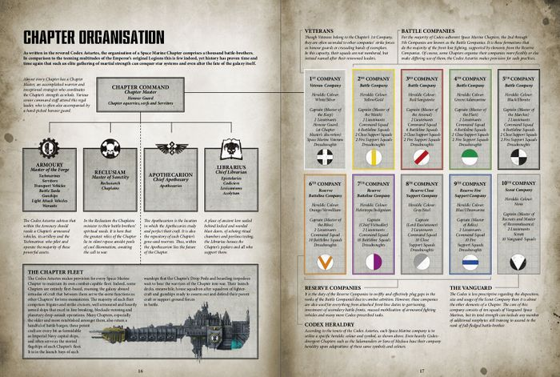

# 0216 战团 Chapter

精校状态：中文行文已逐段精校，部分术语仍为暂定

分类：通用概念 / 帝国 Imperium / 中央政务部 Adeptus Terra / 阿斯塔特修会 Adeptus Astartes

原文来源：https://www.bilibili.com/opus/985487835324743685

原作者：帝国神选罐头

原文时间：编辑于 2026年05月18日 16:25

[返回分类目录](目录.md) · [全书目录](../../目录.md)

<!-- A0216-B0001 -->
**英文原文**

A Chapter is a self-contained Space Marine army usually made up of a thousand or so Space Marines, as well as a large number of administrative and functionary personnel.

<!-- /A0216-B0001 -->

<!-- A0216-B0002 -->

原译文

一个战团是一支自给自足的星际战士，通常由大约一千名星际战士以及大量行政和公务人员组成。

**校订译文**

一个战团是一支自给自足的星际战士军队，通常拥有约一千名星际战士，以及大量行政与勤务人员。

<!-- /A0216-B0002 -->

<!-- A0216-B0003 -->
**英文原文**

The Adeptus Astartes is divided into roughly a thousand Chapters. Each constituent Chapter is autonomous and constitutes a complete army, with its own leadership, support and administrative staff, reliant only on its own Chapter members. Each chapter has its own traditions, specialties, its own cult, beliefs and practices.

<!-- /A0216-B0003 -->

<!-- A0216-B0004 -->

原译文

阿斯塔特修会分为大约一千个战团。每个战团的组成都是自主的并构成了一支完整的军队，有自己的领导、支持和行政人员，只依赖自己的战团成员。每个战团都有自己的传统、特色、崇拜、信仰和习俗。

**校订译文**

阿斯塔特修会约有一千个战团。每个战团都是自治的完整军队，拥有自己的指挥体系、支援力量和行政人员，依靠本战团成员维持运作。各战团也有自己的传统、特色、教派、信仰和习俗。

<!-- /A0216-B0004 -->

<!-- A0216-B0005 图片 -->

<!-- A0216-B0006 -->

原译文

Space Marine chapter assembled for battle 为战斗而集结的星际战士

**校订译文**

Space Marine chapter assembled for battle 为战斗而集结的星际战士战团

<!-- /A0216-B0006 -->

<!-- A0216-B0007 -->
## Early History 早期历史

<!-- /A0216-B0007 -->

<!-- A0216-B0008 -->
**英文原文**

Chapters were originally an organizational unit used by the Thunder Warriors. During the Great Crusade, the Space Marines were organized into Legions, further divided into Companies. Chapters were adopted by some of the Legions as an intermediate level of organization. The Ultramarines Legion, led by Roboute Guilliman, became the largest of all the Legions, thanks to Guilliman's tactical mastery and a steady flow of new recruits from Ultramar. At the time of the Horus Heresy, the Ultramarines Legion was divided into twenty-five Chapters, each composed of ten Companies, each company composed of roughly one thousand Marines.

<!-- /A0216-B0008 -->

<!-- A0216-B0009 -->

原译文

战团最初是雷霆战士使用的一个组织单位。在大远征期间，星际战士被组织成军团，并进一步分为连队。一些军团将战团作为中间级别的组织单位。由罗伯特·基里曼领导的极限战士军团成为所有军团中最大的军团，这要归功于基里曼的战术掌握和奥特拉玛新兵的稳定流动。在荷鲁斯叛乱时期，极限战士军团分为二十五个战团，每个战团由十个连组成，每个连由大约一千名星际战士组成。

**校订译文**

战团最初是雷霆战士采用的一种编制。大远征期间，星际战士以军团为单位，下辖若干连队；部分军团还在两者之间设置战团一级。罗保特·基里曼凭借卓越的战术能力，以及奥特拉玛源源不断的新兵，使极限战士成为规模最大的军团。到荷鲁斯之乱时期，极限战士军团下辖二十五个战团，每个战团辖十个连，每个连约有一千名星际战士。

**校注：** 英文明确写每连约一千人，描述荷鲁斯叛乱时期极限战士的特殊编制；保留该数值，不按后世圣典百人连改写。

<!-- /A0216-B0009 -->

<!-- A0216-B0010 -->
**英文原文**

Following the Heresy, Guilliman, as Lord Commander of the Imperium, ordered the Space Marine Legions divided and re-organized into smaller Chapters, to ensure that no future rebel such as Horus could gain control of such a large military unit as a Legion again. Newly formed Chapters created in this new system which originated from the remaining loyalist Legions became known as Successor Chapters.

<!-- /A0216-B0010 -->

<!-- A0216-B0011 -->

原译文

叛乱之后，基里曼作为帝国的领主指挥官，命令星际战士军团分裂并重新组织成更小的战团，以确保未来没有像荷鲁斯这样的叛军能够再次控制如此庞大的军事单位。在这个新系统中创建的新成立的战团，起源于剩余的忠诚军团，被称为子战团。

**校订译文**

叛乱结束后，担任帝国最高统帅的基里曼下令，将星际战士军团拆分并改组为规模较小的战团，以免日后再有荷鲁斯这样的叛徒掌握如此庞大的军事力量。在这一新制度下，由幸存忠诚军团衍生出的新战团被称为子战团。

<!-- /A0216-B0011 -->

<!-- A0216-B0012 -->
## Chapter creation 战团建立

<!-- /A0216-B0012 -->

<!-- A0216-B0013 -->
**英文原文**

The creation of a new Chapter is known as a Founding, and it does not happen overnight. Each Chapter is created from the gene-seed of an existing donor Chapter. After the Scouring, Roboute Guilliman tasked the Adeptus Terra with setting up and maintaining a genetic bank to procure and store tithes of gene-seed, which would in turn provide the gene-seed for all future Chapters. To prevent cross-contamination, the genetic stock of each legion was isolated while those of Traitor Legions were put into stasis lock. By taking direct control of these genetic tithes, the Adeptus Terra now could ultimately control the Space Marines as they had the power to destroy or create Space Marine armies at will.

<!-- /A0216-B0013 -->

<!-- A0216-B0014 -->

原译文

新战团的建立被称为建军，它不会在一夜之间发生。每个战团都是从现有战团捐赠的基因种子中创建的。在大清洗之后，罗伯特·基里曼委托泰拉中央部建立和维护一个基因库，以获取和储存十分之一的基因种子，这反过来将为未来的所有战团提供基因种子。为了防止交叉污染，每个军团的基因库都被隔离，而叛徒军团的基因则被置于停滞锁中。通过直接控制这些基因种子的什一税，泰拉中央部现在可以最终控制星际战士，因为他们有能力随意摧毁或创建星际战士军队。

**校订译文**

新战团的建立称为“建军”，这一过程绝非一朝一夕之功。各战团均以现存战团缴纳的基因种子为基础建立。大清洗之后，罗保特·基里曼责成中央政务部建立并管理基因库，收取和储存以什一税形式上缴的基因种子，为日后的建军提供种源。为防止交叉污染，各军团的基因种子分库存放；叛徒军团的基因种子则被封存在静滞状态中。中央政务部直接控制这些基因种子税赋，也就拥有了制约星际战士的最终手段：它可以创建新的星际战士军队，也可以将其消灭。

<!-- /A0216-B0014 -->

<!-- A0216-B0015 -->
**英文原文**

When creating a chapter, the zygote is implanted in a human test-slave who spends his entire life in a static experimental capsule, immobile and serving as nothing but a medium which from two progenoids will develop. When the progenoids are developed, they are extracted from original test-slave and then implanted into another two test-slaves, producing four progenoids, and so on. It takes 55 years of reproduction to create a healthy set of 1,000 organs. These must be sanctioned officially by the Master of the Adeptus Mechanicus and then by the High Lords of Terra, speaking for the Emperor, who alone can give permission for the creation of a new Chapter.

<!-- /A0216-B0015 -->

<!-- A0216-B0016 -->

原译文

在创建战团时，基因种子被植入一个终生静卧在实验舱中一动不动的人类测试奴隶体内，作为两个腺体的发育介质。当腺体发育成熟后，它们会从原来的测试奴隶体内被提取出来，然后植入另外两个测试奴隶体内，从而产生四个腺体，以此类推。需要55年的时间才能创造出一套健康的1000个器官。这些器官必须被机械神教铸造将军正式批准，然后泰拉高领主告知帝皇，只有帝皇能给予许可去建立一个新的战团。

**校订译文**

建立新战团时，会先将基因种子植入人类试验奴隶体内。试验奴隶终生静卧于实验舱中，为两枚基因存收腺的发育提供宿主环境。腺体成熟后即被取出，用于培养下一代，并分别植入另外两名试验奴隶；如此便能收获四枚腺体，再依此倍增。培养出一批健康的一千枚器官，需要五十五年。这些器官须先经机械修会首脑正式认可，再交由泰拉高领主批准。高领主代表帝皇行使权力；唯有帝皇有权准许建立新战团。

**校注：** 按英文改正批准程序：High Lords 代表帝皇发言，并非将事项告知帝皇后等待答复。英文为 a healthy set of 1,000 organs，未明确是完整植入器官套组还是器官总数，保留原数量并待核。

<!-- /A0216-B0016 -->

<!-- A0216-B0017 -->
## Organisation 组织

<!-- /A0216-B0017 -->

<!-- A0216-B0018 -->
**英文原文**

A so-called Codex Chapter, meaning a Chapter which closely follows the doctrines of the Codex Astartes, is made up of ten companies, each consisting of one hundred Marines and commanded by an officer with the rank of Captain. Below the Captain are two Lieutenants which each command a Demi-Company. Generally, the First Company is made up of the Chapter's most experienced Veterans, while the Second through Ninth consist of more ordinary warriors. Some individual companies are specialised assault or support companies, possessing larger proportions of Assault, Devastator, Hellblaster, Eradicator, Aggressor, Reiver, and Inceptor squads. The tenth company is a Scout force, made up of neophyte Space Marines not yet proven in battle. Typically, a standing force of 100 Vanguard Space Marines are attached to the 10th Company. The Chapter is further bolstered and supported by a Librarium, Armoury, Apothecarion, Chaplaincy, and Fleet.

<!-- /A0216-B0018 -->

<!-- A0216-B0019 -->

原译文

所谓的“圣典战团”意味着该战团严格遵守阿斯塔特圣典的教义，它由10个连队组成，每个连队由100名星际战士组成，并由一名连长指挥。连长之下有两名副官，各自指挥半个连队。通常情况下，第一连队由该战团经验最丰富的老兵组成，而第二连队至第九连队则由更多普通战士组成。一些单独的连队是专业的突击连队或支援连队，拥有较大比例的突击小队，毁灭者小队，地狱轰击者小队，歼灭者小队，侵略者小队，掠夺者和拦截者小队。第十连队是一支侦查部队，由尚未在战斗中证明自己的星际战士新兵组成。通常，一支由100名先锋星际战士组成的常备军会隶属于第十连队。此外，该战团还会得到智库，军械库，药剂部，隐修会和舰队的进一步支持和加强。

**校订译文**

所谓“圣典战团”，是指严格遵循《阿斯塔特圣典》教义的战团。它由十个连组成，每连一百名星际战士，由一名连长指挥。连长之下设两名副官，各自统率半连。第一连通常由战团最资深的老兵组成，第二至第九连则以常规战士为主。部分连队专司突击或支援，编有较高比例的突击小队、破坏者小队、地狱轰击者小队、根除者小队、侵略者小队、掠夺者小队及先驱者小队。第十连是侦察连，收容尚未在战场上证明自己的星际战士新兵，通常还编有一支一百人的常备先锋星际战士部队。战团另有智库馆、军械库、药剂部、教士团和舰队提供支援。

<!-- /A0216-B0019 -->

<!-- A0216-B0020 图片 -->

<!-- A0216-B0021 -->

原译文

Organization of a Space Marine Chapter since the introduction of Primaris Space Marines 自引入原铸星际战士以来的星际战士战团组成

**校订译文**

Organization of a Space Marine Chapter since the introduction of Primaris Space Marines 自引入原铸星际战士以来的星际战士战团组成

<!-- /A0216-B0021 -->

<!-- A0216-B0022 -->
**英文原文**

Each Chapter is led by a Chapter Master. Unlike the Imperial Guard, the Adeptus Astartes has no leadership above the Masters of the individual Chapters. Also unlike many other Imperial military forces, the Astartes are not represented on the High Lords of Terra.

<!-- /A0216-B0022 -->

<!-- A0216-B0023 -->

原译文

每个战团由战团长领导。不像帝国卫队，阿斯塔特修会没有比各个战团的战团长更高的领导者。此外，与帝国许多其他军事力量不同，阿斯塔特在泰拉高领主中没有代表。

**校订译文**

每个战团由战团长领导。不像帝国卫队，阿斯塔特修会没有比各个战团的战团长更高的领导者。此外，与帝国许多其他军事力量不同，阿斯塔特在泰拉高领主中没有代表。

<!-- /A0216-B0023 -->

<!-- A0216-B0024 -->
**英文原文**

Besides the Space Marine fighting brethren, there are many non-combat personnel, fully part of the Chapter but generally not involved directly in combat. These include the chapter's hereditary slaves, Astropaths, Navigators.

<!-- /A0216-B0024 -->

<!-- A0216-B0025 -->

原译文

除了星际战士战斗兄弟之外，还有许多非战斗人员，他们也都是战团的成员，但通常不直接参加战斗。这些人包括战团的世袭侍从，星语者，领航员。

**校订译文**

除星际战士战斗兄弟外，战团还有许多通常不直接参战的成员，包括世代服役的奴仆、星语者和导航员。

<!-- /A0216-B0025 -->

<!-- A0216-B0026 -->
**英文原文**

Every successor chapter of the Ultramarines follows the Codex Astartes completely.

<!-- /A0216-B0026 -->

<!-- A0216-B0027 -->

原译文

极限战士的每一个子战团都完全遵循阿斯塔特圣典。

**校订译文**

极限战士的每一个子战团都完全遵循阿斯塔特圣典。

**校注：** 英文对所有极限战士子战团使用完全遵循圣典的绝对表述；与其他条目所述例外可能不一致，暂保留并提示版本或概括范围待核。

<!-- /A0216-B0027 -->

<!-- A0216-B0028 -->
## Chapter cult 战团教派

<!-- /A0216-B0028 -->

<!-- A0216-B0029 -->
**英文原文**

A Chapter cult is a body of beliefs and practices integral to every single Space Marine Chapter, each being unique and specific to the chapter and can often wildly vary between each other. Indeed, two successor chapters spawned from the same chapter during the very same founding might, after several centuries, present with radically divergent religious practices. Broadly speaking though, every chapter cult in general venerates the Emperor, their Primarch (if known), as well as their own heroes and will typically emphasize martial virtues such as honour, strength, and comradeship.

<!-- /A0216-B0029 -->

<!-- A0216-B0030 -->

原译文

战团教派是每个星际战士战团不可或缺的信仰和行动体系，每个都是独特而具体的，彼此之间往往差异很大。事实上，在同一个建军从同一战团衍生出的两个子战团，在几个世纪后可能会出现截然不同的宗教习惯。不过，从广义上讲，一般每个战团教派都崇拜帝皇、他们的原体（如果知道的话）以及他们自己的英雄，通常会强调荣誉、力量和战友情谊等军事美德。

**校订译文**

战团教派是每个星际战士战团不可或缺的信仰和行动体系，每个都是独特而具体的，彼此之间往往差异很大。事实上，在同一个建军从同一战团衍生出的两个子战团，在几个世纪后可能会出现截然不同的宗教习惯。不过，从广义上讲，一般每个战团教派都崇拜帝皇、他们的原体（如果知道的话）以及他们自己的英雄，通常会强调荣誉、力量和战友情谊等军事美德。

<!-- /A0216-B0030 -->

<!-- A0216-B0031 -->
**英文原文**

Every Space Marine belongs to the Chapter's cult, and accordingly, every Marine of a Chapter is a spiritual brother as well as a brother in arms. Each cult is typically ministered by an inner priesthood of warriors known as Chaplains.

<!-- /A0216-B0031 -->

<!-- A0216-B0032 -->

原译文

每个星际战士都属于战团的教派，因此，战团的每个战士都是精神上的兄弟，也是战友。每个教派通常都由被称为牧师的战士的内在圣职来辅助。

**校订译文**

每名星际战士都是战团教派的一员。因此，战团战士既是战场上的同袍，也是信仰上的兄弟。各教派通常由战团内部的教士团主持，其成员也是战士，称为教士。

<!-- /A0216-B0032 -->

<!-- A0216-B0033 -->
## The Ecclesiarchy and Inquisition 国教会与审判庭

原题：The Ecclesiarchy and Inquisition 国教和审判庭

<!-- /A0216-B0033 -->

<!-- A0216-B0034 -->
**英文原文**

Conflict has always existed between the Adeptus Astartes and the Adeptus Ministorum, going back all the way to the very start of the Imperial Creed on Terra. Though rivalry is ever present between and among all the factions within the Adeptus Terra, this friction goes to an even deeper level. Space Marines can rightfully be called the "Sons of the Emperor" - they are the Emperor's direct creation, carrying his blood, as well as being undying loyal defenders of humanity, the Imperium, and the Emperor's honour. Despite all this, conflict arises in that they do not adhere to the Imperial Creed nor (typically) worship the Emperor as a divine god as preached by the Ecclesiarchy, instead venerating him as a gifted, powerful man. Indeed, given the wide variation of chapter cults some chapter cult practices are very barbaric - many including blood sacrifices - and some traditions could easily be considered heretical in comparison to the orderly masses of the Ecclesiarchy. Added to this, the sheer differences between baseline humans and these genetically engineered monstrous giants capable of spitting acid or crushing men's skulls, are enough for some consider them as separate race entirely. Staunch puritans of the Ecclesiarchy preach the adage "suffer not the mutant to live", and in the Imperium the purity of the human form is lauded as much whilst all other species are reviled.

<!-- /A0216-B0034 -->

<!-- A0216-B0035 -->

原译文

阿斯塔特修会和国教教会之间一直存在冲突，这可以追溯到泰拉上的帝国信条的一开始。尽管在中央政务部内的所有派系之间始终存在竞争，但这种摩擦甚至达到了更深的层次。星际战士可以被称为“帝皇之子”，他们是帝皇的直接造物，承载着他的鲜血，也是人类、帝国和帝皇的荣誉的永恒忠诚捍卫者。尽管如此，冲突还是出现了，因为他们不遵守帝国信条，也不（通常）像国教所宣扬的那样将帝皇视为神圣的神，而是将他视为一个有天赋、强大的人。事实上，鉴于战团教派的多样性，一些战团教派的做法非常野蛮，许多包括血祭，与国教的有序群众相比，一些传统很容易被视为异端。除此之外，普通人类和这些能够吐酸或压碎人类头骨的基因工程改造巨型怪物之间的巨大差异，足以让一些人认为他们是完全不同的种族。国教的坚定纯洁派宣扬“不要让变种人活着”的格言，在帝国中，人类形态的纯洁性受到同样的赞扬，而所有其他物种都受到唾弃。

**校订译文**

阿斯塔特修会与国教会之间的矛盾，可以追溯到帝皇信仰在泰拉兴起之初。中央政务部各派系固然一向彼此竞争，但双方的嫌隙还涉及更深的分歧。星际战士堪称“帝皇之子”：他们是帝皇亲手创造的战士，承载着他的血脉，始终忠诚地捍卫人类、帝国与帝皇的荣耀。然而，他们并不遵奉帝皇信仰，通常也不接受国教会宣扬的帝皇神性，而是将他视为天赋卓绝、力量非凡的人。各战团教派差异极大，其中一些仪式十分野蛮，甚至涉及血祭；与国教会井然有序的弥撒相比，这些传统很容易被指为异端。此外，普通人类与星际战士之间的巨大差异——这些经基因改造的巨人能够吐出酸液，徒手捏碎人的头骨——也足以让一些人认为双方根本属于不同种族。国教会中坚定的纯洁派奉行“不容变种人存活”的箴言；整个帝国同样推崇人类形体的纯洁，并唾弃其他一切物种。

**校注：** masses 在此为弥撒，非群众；并统一 Ecclesiarchy 为国教会。

<!-- /A0216-B0035 -->

<!-- A0216-B0036 -->
**英文原文**

The Ecclesiarchy and the Astartes have reached an uneasy compromise over the millenia, which can generally be thought of as an agreement to differ. In general, the Ecclesiarchy does not send its Confessors and Missionaries to Space Marine worlds, and the Chapters of the Adeptus Astartes do not interfer with the Church. Space marine chaplains are given their sacred rosarius by the Ecclesiarchy, a symbolic link between the Adeptus Astartes and the Adeptus Ministorum, but ultimately the chaplains still preach their own version of the Imperial Creed to their brethren. This uneasey truce has been shattered by particularly zealous Cardinals or Confessors that have roused the wrath of a chapter either through words or deeds.

<!-- /A0216-B0036 -->

<!-- A0216-B0037 -->

原译文

在过去的数千年里，国教和阿斯塔特达成了一项令人不安的妥协，这通常可以被认为是一种不同的协定。总的来说，国教不会派遣其告解者和传教士前往星际战士世界，阿斯塔特修会的战团也不会干扰国教。星际战士牧师被国教授予神圣玫瑰念珠，这是阿斯塔特修会和国教教会之间的象征性联系，但最终牧师仍然向他们的兄弟们宣扬他们自己版本的帝国信条。这种不公平的休战已经被特别狂热的红衣主教或告解者打破，他们通过言语或行为激起了一个战团的愤怒。

**校订译文**

数千年来，国教会与阿斯塔特修会形成了一种勉强维持的妥协：容忍彼此的分歧。国教会通常不向星际战士的世界派遣告解者和传教士，阿斯塔特修会的战团也不干涉国教会事务。国教会授予星际战士教士神圣玫瑰念珠，作为双方联系的象征；但教士最终向战斗兄弟传授的，仍是本战团对帝皇信仰的诠释。有时，过度狂热的红衣主教或告解者会以言语或行动激怒某个战团，打破这种脆弱的停战。

<!-- /A0216-B0037 -->

<!-- A0216-B0038 -->
**英文原文**

In a similar vein, conflict has arisen between the Adeptus Astartes and the Inquisition, particularly the Witch Hunters of the Ordo Hereticus, over the nature of Chapter Cults. Should the chapters preachings and interpretations of the Imperial Creed be deemed too heretical, the Witch Hunters may send forces or even an army to fight the space marines and call the chapter for their wayward beliefs.

<!-- /A0216-B0038 -->

<!-- A0216-B0039 -->

原译文

同样，阿斯塔特修会和审判庭之间，特别是讨逆修会的女巫猎手，在战团教派的性质问题上也发生了冲突。如果宣扬和解释帝国信条的战团被认为过于异端，女巫猎手可能会派遣部队甚至军队与星际战士战斗，并因其难以控制的信仰而传唤战团。

**校订译文**

阿斯塔特修会也曾因战团教派的性质而与审判庭发生冲突，尤其是与异端审判庭的猎巫者。如果某个战团对帝皇信仰的宣讲与诠释被视为严重异端，猎巫者可能派出部队乃至大军，与星际战士交战，追究该战团顽固坚持其信仰的责任。

<!-- /A0216-B0039 -->

<!-- A0216-B0040 -->
**英文原文**

Infamous examples of internecine conflict between Space Marines and the Ecclesiarchy/Inquisition include:

<!-- /A0216-B0040 -->

<!-- A0216-B0041 -->

原译文

星际战士和国教/审判庭之间臭名昭著的内部冲突包括：

**校订译文**

星际战士与国教会或审判庭之间较为恶名昭著的内斗包括：

<!-- /A0216-B0041 -->

<!-- A0216-B0042 -->
**英文原文**

The Incursion of Fools - also known as the Fenris Incident. Learning of the shamanic practices of the Space Wolves and deeming them heretical, Cardinal Astra Leon ­Chirastes invaded their Homeworld, Fenris, with a force of his own Ecclesiarchal Warships as well as other ships and forces of the Adepta Sororitas' Orders of the Wounded Heart, White Rose and the Fiery Tear. The Ecclesiarchal force was bloodily repulsed, and detailed records of the battle suppressed and sealed by the Ecclesiarchy while giving the Space Wolves little cause to celebrate. Leon Chariastes officially left in disgrace, but retained his badge of office, vowing revenge.

<!-- /A0216-B0042 -->

<!-- A0216-B0043 -->

原译文

愚者入侵 - 也称为芬里斯事件。星界红衣主教莱昂·奇拉斯特斯学习了太空野狼的萨满教习俗，并认为他们是异端，他用自己的国教战舰以及修女会的受伤之心、白色玫瑰和炽热之泪修会的其他船只和部队入侵了他们的家园世界芬里斯。国教部队被血腥击退，详细的战斗记录被国教压制并封存，而太空野狼几乎没有庆祝的理由。莱昂·奇拉斯特斯正式耻辱地离开了，但保留了他的职位徽章，发誓要复仇。

**校订译文**

愚者入侵——又称芬里斯事件。星界红衣主教莱昂·奇拉斯特斯得知太空野狼的萨满传统后，认定其为异端，遂率自己的国教会战舰，联合战斗修女受伤之心、白玫瑰和炽热之泪修会的舰船与部队，入侵其母星芬里斯。国教会军队遭到血腥击退；国教会随后压下并封存了详细战报，而太空野狼也几乎没有理由为此庆祝。奇拉斯特斯虽然名誉扫地，却保住了职位与职权象征，并发誓复仇。

<!-- /A0216-B0043 -->

<!-- A0216-B0044 -->
**英文原文**

The War of Flames - Arch-Cardinal Perigno declared the Salamanders Promethean Cult heretical and attacked them with a force of three Orders and a massive army of faith. This was ultimately halted after news of Peringo's death at the hands of the Inquisition.

<!-- /A0216-B0044 -->

<!-- A0216-B0045 -->

原译文

火焰战争 - 大红衣主教佩里尼奥宣布火蜥蜴普罗米修斯教派为异端，并用三个修会和庞大的信仰军队攻击他们。在佩里尼奥死于审判庭之手的消息传出后，这一行动最终停止了。

**校订译文**

火焰战争 - 大红衣主教佩里尼奥宣布火蜥蜴普罗米修斯教派为异端，并用三个修会和庞大的信仰军队攻击他们。在佩里尼奥死于审判庭之手的消息传出后，这一行动最终停止了。

<!-- /A0216-B0045 -->

<!-- A0216-B0046 -->
**英文原文**

The Kaurava Campaign - During the campaign the Order of the Sacred Rose declared a purge of the entire Kaurava system, irreconcilably at odds with the Blood Ravens' mission to reclaim the system, resulting in the two forces being hostile to each other to the point of war throughout the campaign. This incident, along with other notorious actions by the Blood Ravens, would contribute to the Ordo Malleus declaring an Exterminatus of them and the entire Subsector Aurelia, which was only halted by the timely intervention of Captain Apollo Diomedes and Inquisitor Adrastia in killing the Blood Ravens turncoat Chapter Master Azariah Kyras.

<!-- /A0216-B0046 -->

<!-- A0216-B0047 -->

原译文

考拉瓦战役 - 在战役期间，神圣玫瑰修会宣布对整个考拉瓦星系进行净化，这与血鸦夺回该星系的使命不可调和，导致这两支部队在整个战役中相互敌对，甚至达到了战争的地步。这一事件，再加上血鸦的其他臭名昭著的行动，将有助于圣锤修会对他们和整个奥瑞利亚分区宣布灭绝令，但这一行动因阿波罗·狄俄墨得斯连长和审判官阿德拉斯蒂亚的及时干预杀死血鸦叛徒战团长亚撒利雅·凯拉斯而停止。

**校订译文**

考拉瓦战役——神圣玫瑰修会宣布净化整个考拉瓦星系，这与血鸦收复该星系的任务直接冲突，使双方在战役期间彼此敌对，甚至兵戎相见。这场冲突连同血鸦的其他恶名昭著的行动，促使恶魔审判庭对血鸦及整个奥瑞利亚次星区颁布灭绝令。连长阿波罗·狄俄墨得斯与审判官阿德拉斯蒂亚及时介入，杀死了叛变的血鸦战团长亚撒利雅·凯拉斯，才使灭绝令的执行得以停止。

<!-- /A0216-B0047 -->

<!-- A0216-B0048 -->
**英文原文**

The Months of Shame - The Space Wolves fought the Ordo Malleus and Grey Knights who sought to purge the survivors and veterans of the First War for Armageddon.

<!-- /A0216-B0048 -->

<!-- A0216-B0049 -->

原译文

耻辱之月 - 太空野狼与圣锤修会和灰骑士作战，他们试图清洗第一次阿玛吉多顿战争的幸存者和老兵。

**校订译文**

耻辱之月——恶魔审判庭与灰骑士试图清洗第一次阿玛吉多顿战争的幸存者和老兵，太空野狼为阻止他们而与之交战。

<!-- /A0216-B0049 -->

<!-- A0216-B0050 -->
## Theist Chapters 有神信仰战团

原题：Theist Chapters 一神论战团

**校注：** Theist 意为信奉神明，并不限定为一神论。

<!-- /A0216-B0050 -->

<!-- A0216-B0051 -->
**英文原文**

While most chapters do not venerate the Emperor as a divine being or a god, there are a handful of chapters which do. Such beliefs are thought of as "fanatical" by chapters with more conventional veneration of the Emperor as a man, with such beliefs being considered more appropriate for the "deluded masses" that Astartes are sworn to protect.

<!-- /A0216-B0051 -->

<!-- A0216-B0052 -->

原译文

虽然大多数战团都没有将帝皇尊为神圣的存在或神，但也有少数战团这样做。这些信仰被认为是“狂热的”，因为战团更传统地将帝皇视为一个人，而这些信仰被视为更适合阿斯塔特宣誓要保护的“受骗群众”。

**校订译文**

大多数战团并不将帝皇奉为神灵，但少数战团确实如此。坚持传统、将帝皇视为人的战团，往往认为这种信仰过于狂热，更适合那些被他们视为“受蒙蔽的民众”、同时又是阿斯塔特宣誓保护的普通人。

<!-- /A0216-B0052 -->

<!-- A0216-B0053 -->
**英文原文**

Notable theist chapters include:

<!-- /A0216-B0053 -->

<!-- A0216-B0054 -->

原译文

著名一神论战团包括

**校订译文**

著名的有神信仰战团包括：

<!-- /A0216-B0054 -->

<!-- A0216-B0055 -->

原译文

The Adulators 奉信者

**校订译文**

The Adulators 奉信者

<!-- /A0216-B0055 -->

<!-- A0216-B0056 -->

原译文

The Black Templars 黑色圣堂

**校订译文**

The Black Templars 黑色圣堂

<!-- /A0216-B0056 -->

<!-- A0216-B0057 -->

原译文

The Fire Angels 火焰天使

**校订译文**

The Fire Angels 火焰天使

<!-- /A0216-B0057 -->

<!-- A0216-B0058 -->

原译文

The Hospitallers 医院骑士

**校订译文**

The Hospitallers 医院骑士

<!-- /A0216-B0058 -->

<!-- A0216-B0059 -->
**英文原文**

The Novamarines - Uniquely, they do not venerate the Emperor nor Roboute as gods but worship the Codex Astartes as a divine work, though they are silent as to which god inspired it.

<!-- /A0216-B0059 -->

<!-- A0216-B0060 -->

原译文

新星战士 - 独特的是，他们不将帝皇或罗伯特尊为神，而是将阿斯塔特圣典视为神圣的作品崇拜，尽管他们对哪位神启发了它保持沉默。

**校订译文**

新星战士——他们的信仰较为特殊：并不将帝皇或罗保特·基里曼奉为神灵，却把《阿斯塔特圣典》作为神圣著作崇拜。至于究竟是哪位神启迪了这部著作，他们则缄口不言。

**校注：** Roboute 在此指罗保特·基里曼，补全名字以避免误认。

<!-- /A0216-B0060 -->

<!-- A0216-B0061 -->

原译文

The Red Scorpions 红蝎

**校订译文**

The Red Scorpions 红蝎

<!-- /A0216-B0061 -->

<!-- A0216-B0062 -->

原译文

The Red Hunters 红色猎手

**校订译文**

The Red Hunters 红色猎手

<!-- /A0216-B0062 -->

<!-- A0216-B0063 -->

原译文

The Sons of the Phoenix 凤凰之子

**校订译文**

The Sons of the Phoenix 凤凰之子

<!-- /A0216-B0063 -->

<!-- A0216-B0064 -->

原译文

The Star Phantoms 星辰幻影

**校订译文**

The Star Phantoms 星辰幻影

<!-- /A0216-B0064 -->

<!-- A0216-B0065 -->

原译文

The Steel Confessors 钢铁神父

**校订译文**

The Steel Confessors 钢铁神父

<!-- /A0216-B0065 -->

<!-- A0216-B0066 -->

原译文

The Subjugators 压制者

**校订译文**

The Subjugators 压制者

<!-- /A0216-B0066 -->

<!-- A0216-B0067 -->

原译文

The White Consuls 白色执政官

**校订译文**

The White Consuls 白色执政官

<!-- /A0216-B0067 -->

<!-- A0216-B0068 -->
**英文原文**

The following chapters do not explicitly worship the Emperor as a god, but do ascribe him divine or spiritual powers:

<!-- /A0216-B0068 -->

<!-- A0216-B0069 -->

原译文

以下战团没有明确将帝皇视为神，但确实赋予了他神圣或精神力量：

**校订译文**

以下战团没有明确将帝皇视为神灵，但认为他拥有神圣或精神层面的力量：

<!-- /A0216-B0069 -->

<!-- A0216-B0070 -->
**英文原文**

The Blood Ravens believe the Emperor to be a man, yet also believe he has the power to save their souls and in the promise of an afterlife

<!-- /A0216-B0070 -->

<!-- A0216-B0071 -->

原译文

血鸦相信帝皇是一个人，但也相信他有能力拯救他们的灵魂，并承诺来世

**校订译文**

血鸦相信帝皇是人类，同时也相信他能够拯救他们的灵魂，并相信他所许诺的来世。

<!-- /A0216-B0071 -->

<!-- A0216-B0072 -->
**英文原文**

Though the Silver Skulls do not explicitly worship the Emperor as divine, their Prognosticators consult his Tarot in order to divine his will.

<!-- /A0216-B0072 -->

<!-- A0216-B0073 -->

原译文

虽然银色颅骨并没有明确地将帝皇视为神圣的，但他们的预言者会参考他的塔罗牌来占卜他的意志。

**校订译文**

虽然银色颅骨并没有明确地将帝皇视为神圣的，但他们的预言者会参考他的塔罗牌来占卜他的意志。

<!-- /A0216-B0073 -->

<!-- A0216-B0074 -->
## Chapter-size 战团规模

<!-- /A0216-B0074 -->

<!-- A0216-B0075 -->
## Space Marines 星际战士

<!-- /A0216-B0075 -->

<!-- A0216-B0076 -->
**英文原文**

A Space Marine Chapter, in compliance with the Codex Astartes and at full strength, is organised as follows:

<!-- /A0216-B0076 -->

<!-- A0216-B0077 -->

原译文

根据阿斯塔特圣典，星际战士的组织结构如下：

**校订译文**

根据《阿斯塔特圣典》，一个满员星际战士战团的组织结构如下：

<!-- /A0216-B0077 -->

<!-- A0216-B0078 -->

原译文

Chapter Command 战团指挥

**校订译文**

Chapter Command 战团指挥

<!-- /A0216-B0078 -->

<!-- A0216-B0079 -->

原译文

a Chapter Master 一名战团长

**校订译文**

a Chapter Master 一名战团长

<!-- /A0216-B0079 -->

<!-- A0216-B0080 -->

原译文

the Chapter Master's Honour Guard 战团长的荣誉卫队

**校订译文**

the Chapter Master's Honour Guard 战团长的荣誉卫队

<!-- /A0216-B0080 -->

<!-- A0216-B0081 -->

原译文

transport vehicles 运输载具

**校订译文**

transport vehicles 运输载具

<!-- /A0216-B0081 -->

<!-- A0216-B0082 -->

原译文

senior personnel 高级人员

**校订译文**

senior personnel 高级人员

<!-- /A0216-B0082 -->

<!-- A0216-B0083 -->
**英文原文**

10 Companies, with each Company consisting of:

<!-- /A0216-B0083 -->

<!-- A0216-B0084 -->

原译文

10个连队，每个连队的组成：

**校订译文**

10个连队，每个连队的组成：

<!-- /A0216-B0084 -->

<!-- A0216-B0085 -->

原译文

Captain 连长

**校订译文**

Captain 连长

<!-- /A0216-B0085 -->

<!-- A0216-B0086 -->

原译文

2 Lieutenants 两名副官

**校订译文**

2 Lieutenants 两名副官

<!-- /A0216-B0086 -->

<!-- A0216-B0087 -->
**英文原文**

Command Squad (size and composition vary greatly from Chapter to Chapter , though it may include for example a Chaplain and an Apothecary)

<!-- /A0216-B0087 -->

<!-- A0216-B0088 -->

原译文

指挥小队（各战团的规模和组成差异很大，尽管可能包括一名牧师和一名药剂师）

**校订译文**

指挥小队（规模和组成因战团而异，可能包括一名教士和一名药剂师）

<!-- /A0216-B0088 -->

<!-- A0216-B0089 -->
**英文原文**

10 Squads divided into either Veteran, Battleline, Close Support, Fire Support, or Scout types with 5-10 Space Marines each

<!-- /A0216-B0089 -->

<!-- A0216-B0090 -->

原译文

10个小队分为老兵、战线、近战支援、火力支援或侦察兵类型，每个小队有5-10名星际战士

**校订译文**

10个小队分为老兵、战线、近战支援、火力支援或侦察兵类型，每个小队有5-10名星际战士

<!-- /A0216-B0090 -->

<!-- A0216-B0091 -->
**英文原文**

various Dreadnoughts, Rhinos, Impulsors, Land Speeders, Storm Speeders, and Bikes

<!-- /A0216-B0091 -->

<!-- A0216-B0092 -->

原译文

许多无畏、犀牛、冲击者、兰德速攻艇、风暴速攻艇和摩托

**校订译文**

许多无畏、犀牛、脉冲战车、兰德速攻艇、风暴速攻艇和摩托

<!-- /A0216-B0092 -->

<!-- A0216-B0093 -->

原译文

Armoury 军械库

**校订译文**

Armoury 军械库

<!-- /A0216-B0093 -->

<!-- A0216-B0094 -->

原译文

multiple Techmarines 多名技术军士

**校订译文**

multiple Techmarines 多名科技战士

<!-- /A0216-B0094 -->

<!-- A0216-B0095 -->
**英文原文**

various Invictors, Land Raiders, Repulsors, Predators, Gladiators, Damocles, Vindicators, Whirlwinds, Hunters, Stalkers, and Astraeus

<!-- /A0216-B0095 -->

<!-- A0216-B0096 -->

原译文

许多不败者、兰德掠袭者、反击者、掠食者、角斗士、达摩克利斯、维护者、旋风、猎手、追猎者和阿斯特赖俄斯

**校订译文**

若干不败者战术机甲、兰德掠袭者、反重力战车、掠食者、角斗士、达摩克利斯、维护者战车、旋风、猎手、追猎者及阿斯特赖俄斯

<!-- /A0216-B0096 -->

<!-- A0216-B0097 -->

原译文

Apothecarion 药剂部

**校订译文**

Apothecarion 药剂部

<!-- /A0216-B0097 -->

<!-- A0216-B0098 -->

原译文

multiple Apothecaries 多名药剂师

**校订译文**

multiple Apothecaries 多名药剂师

<!-- /A0216-B0098 -->

<!-- A0216-B0099 -->

原译文

Librarius 智库馆

**校订译文**

Librarius 智库

<!-- /A0216-B0099 -->

<!-- A0216-B0100 -->

原译文

multiple Librarians 多名智库

**校订译文**

multiple Librarians 多名智库员

<!-- /A0216-B0100 -->

<!-- A0216-B0101 -->

原译文

Reclusiam 隐修室

**校订译文**

Reclusiam 隐修室

<!-- /A0216-B0101 -->

<!-- A0216-B0102 -->

原译文

multiple Chaplains 多名牧师

**校订译文**

multiple Chaplains 多名教士

<!-- /A0216-B0102 -->

<!-- A0216-B0103 -->

原译文

Fleet Command 舰队指挥

**校订译文**

Fleet Command 舰队指挥

<!-- /A0216-B0103 -->

<!-- A0216-B0104 -->

原译文

Battle Barges 战斗驳船

**校订译文**

Battle Barges 战斗驳船

<!-- /A0216-B0104 -->

<!-- A0216-B0105 -->

原译文

Strike Cruisers 打击巡洋舰

**校订译文**

Strike Cruisers 打击巡洋舰

<!-- /A0216-B0105 -->

<!-- A0216-B0106 -->

原译文

Rapid Strike Vessels 快速打击战舰

**校订译文**

Rapid Strike Vessels 快速打击战舰

<!-- /A0216-B0106 -->

<!-- A0216-B0107 -->

原译文

Gunships and other aircraft 炮艇和其他飞行器

**校订译文**

Gunships and other aircraft 炮艇和其他飞行器

<!-- /A0216-B0107 -->

<!-- A0216-B0108 -->
**英文原文**

For deployment, various assets are combined into a combined-arms strike-force.

<!-- /A0216-B0108 -->

<!-- A0216-B0109 -->

原译文

为了部署，许多资产被合并成一支联合武装打击部队。

**校订译文**

实际部署时，会从上述兵力和装备中抽调各类单位，组成诸兵种合成突击部队。

<!-- /A0216-B0109 -->

<!-- A0216-B0110 -->
**英文原文**

Additionally, a Chapter contains a civilian workforce of human serfs and servitors.

<!-- /A0216-B0110 -->

<!-- A0216-B0111 -->

原译文

此外，一个战团还包含了由人类侍从和机仆组成的平民劳动力。

**校订译文**

此外，一个战团还包含了由人类侍从和机仆组成的平民劳动力。

<!-- /A0216-B0111 -->

<!-- A0216-B0112 -->
## Tanks and vehicles 坦克和载具

<!-- /A0216-B0112 -->

<!-- A0216-B0113 -->
**英文原文**

Not all Chapters have the means to make every type of vehicle. Some Chapters have charters of cooperation with an Adeptus Mechanicus Forge World, which manufactures vehicles to order for this one Chapter. Strict security-measures are undertaken to keep those vehicles from falling into the wrong hands.

<!-- /A0216-B0113 -->

<!-- A0216-B0114 -->

原译文

并非所有战团都有制造每种类型载具的方法。一些战团与机械神教铸造世界诶签订了合作章程，该组织为这一战团制造载具。采取了严格的安全措施，防止这些载具落入坏人之手。

**校订译文**

并非所有战团都有能力制造每一种载具。一些战团与机械修会的铸造世界签订合作章程，由后者代为制造。双方采取严格的保安措施，防止这些载具落入不当之手。

<!-- /A0216-B0114 -->

<!-- A0216-B0115 -->
**英文原文**

Dreadnoughts: Dreadnoughts are very rare. Only very few Chapters have the capacity to build new ones from scratch, and even those that do can do so only a few at a time, because the construction of its core-piece, the Sarcophagus, is very complicated. Fortunately, the design of the Dreadnought is extremely durable and unless destroyed completely, it can eventually be repaired back into function.

<!-- /A0216-B0115 -->

<!-- A0216-B0116 -->

原译文

无畏：无畏非常罕见。只有极少数战团有能力从头开始构建新的一个，即使是那些能够从头开始构建的战团，一次也只能构建几个，因为其核心部分 - 石棺 - 的构造非常复杂。幸运的是，无畏的设计非常耐用，除非被完全摧毁，否则最终可以修复并恢复使用。

**校订译文**

无畏机甲：无畏机甲极为稀少。只有极少数战团能够从头制造新的无畏机甲，而且由于核心石棺的结构十分复杂，即使具备制造能力，一次也只能生产少量。所幸无畏机甲坚固耐用，只要没有被彻底摧毁，最终都能修复并重新投入使用。

<!-- /A0216-B0116 -->

<!-- A0216-B0117 -->
**英文原文**

Rhinos: Rhinos are the mainstay of every single Chapter's vehicle-pool as an armoured troop-carrier. Each is capable of transporting 10 Space Marines. Due to its nature as an STC-design, Rhinos are fairly easy to build and repair.

<!-- /A0216-B0117 -->

<!-- A0216-B0118 -->

原译文

犀牛：作为装甲运兵车，犀牛是每个战团载具库的支柱。每辆可搭载10名星际战士。由于其STC设计的性质，犀牛相当容易建造和维修。

**校订译文**

犀牛：作为装甲运兵车，犀牛是每个战团载具库的支柱。每辆可搭载10名星际战士。由于其STC设计的性质，犀牛相当容易建造和维修。

<!-- /A0216-B0118 -->

<!-- A0216-B0119 -->
**英文原文**

Impulsors: Newer Era Indomitus-era Grav-Vehicle transports.

<!-- /A0216-B0119 -->

<!-- A0216-B0120 -->

原译文

冲击者：更新的不屈时代反重力载具运输车

**校订译文**

脉冲战车：不屈时代引入的新型反重力运兵载具。

<!-- /A0216-B0120 -->

<!-- A0216-B0121 -->
**英文原文**

Bikes: The degree to which Bikes are deployed varies greatly from Chapter to Chapter, with for example the White Scars using them in great numbers, while other Chapters shun them in favour of Rhinos or Razorbacks.

<!-- /A0216-B0121 -->

<!-- A0216-B0122 -->

原译文

摩托：摩托的部署程度因战团而异，例如白色伤疤大量使用它们，而其他战团则避开它们，转而使用犀牛或豪猪。

**校订译文**

摩托：各战团的使用程度差异很大。例如白疤大量使用摩托，而有些战团则不采用摩托，转而使用犀牛或豪猪。

<!-- /A0216-B0122 -->

<!-- A0216-B0123 -->
**英文原文**

Land Speeders: A typical Chapter fields about 50 to 70 Land Speeders. Though, some Chapters, like the Dark Angels, the White Scars and the Successor-Chapters of the White Scars, field several times that number. As a counter-example, the Imperial Castilians field none.

<!-- /A0216-B0123 -->

<!-- A0216-B0124 -->

原译文

兰德速攻艇：一个典型的战团大约有50到70辆兰德速攻艇。然而，有些战团，如黑暗天使、白色伤疤和白色伤疤的子战团，其数量是这个数字的几倍。作为反例，帝国卡斯蒂利亚一辆也没有。

**校订译文**

兰德速攻艇：一般战团约有五十至七十辆。然而，黑暗天使、白疤及白疤的部分子战团，拥有的数量可达其数倍。相反，帝国卡斯蒂利亚战团一辆也没有。

<!-- /A0216-B0124 -->

<!-- A0216-B0125 -->
**英文原文**

Storm Speeders: Heavier attack speeder.

<!-- /A0216-B0125 -->

<!-- A0216-B0126 -->

原译文

风暴速攻艇：更重的攻击速攻艇

**校订译文**

风暴速攻艇：更重的攻击速攻艇

<!-- /A0216-B0126 -->

<!-- A0216-B0127 -->
**英文原文**

Invictors: Scout walkers.

<!-- /A0216-B0127 -->

<!-- A0216-B0128 -->

原译文

不败者：侦察步行者

**校订译文**

不败者：侦察步行机甲。

<!-- /A0216-B0128 -->

<!-- A0216-B0129 -->
**英文原文**

Predators: A Chapter typically fields 20 to 30 Predators, though there are Chapters like the Iron Hands and Fire Angels which field more than 100. Due to the Predator being based on the Rhino-chassis, and that in itself being very adaptable, it is possible to retrofit Rhinos into Predators.

<!-- /A0216-B0129 -->

<!-- A0216-B0130 -->

原译文

掠食者：一个战团通常有20到30辆掠食者，尽管也有像钢铁之手和火焰天使这样的战团有100多辆掠食者。由于掠食者基于犀牛底盘，并且其本身具有很强的适应性，因此可以将犀牛改装成掠食者。

**校订译文**

掠食者：一个战团通常有20到30辆掠食者，尽管也有像钢铁之手和火焰天使这样的战团有100多辆掠食者。由于掠食者基于犀牛底盘，并且其本身具有很强的适应性，因此可以将犀牛改装成掠食者。

<!-- /A0216-B0130 -->

<!-- A0216-B0131 -->
**英文原文**

Gladiators: Newer Era Indomitus-era Grav-Vehicle battle tanks.

<!-- /A0216-B0131 -->

<!-- A0216-B0132 -->

原译文

角斗士：更新的不屈时代反重力载具战斗坦克

**校订译文**

角斗士：不屈时代引入的新型反重力主战坦克。

<!-- /A0216-B0132 -->

<!-- A0216-B0133 -->
**英文原文**

Whirlwinds: A Chapter typically fields 20 to 30 Whirlwinds, although this varies greatly from Chapter to Chapter.

<!-- /A0216-B0133 -->

<!-- A0216-B0134 -->

原译文

旋风：一个战团通常有20到30辆旋风，尽管这在战团之间差异很大。

**校订译文**

旋风：一个战团通常有20到30辆旋风，尽管这在战团之间差异很大。

<!-- /A0216-B0134 -->

<!-- A0216-B0135 -->
**英文原文**

Vindicators: A Chapter typically fields about 12 Vindicators. They are mostly used for sieges and in urban warfare, however some Chapters greatly value them for their sheer firepower and field them in great numbers as a frontline battle-tank.

<!-- /A0216-B0135 -->

<!-- A0216-B0136 -->

原译文

维护者：一个战团通常有大约12辆维护者。它们主要用于攻城战和城市战，但有些战团非常重视它们的火力，并将其大量用作前线战斗坦克。

**校订译文**

维护者战车：一个战团通常拥有约十二辆，主要用于攻城战和城市战。不过，有些战团十分看重其火力，也会将大量维护者战车作为一线战斗坦克使用。

<!-- /A0216-B0136 -->

<!-- A0216-B0137 -->
**英文原文**

Stalkers and Hunters: Air defense vehicles.

<!-- /A0216-B0137 -->

<!-- A0216-B0138 -->

原译文

追猎者和猎手：防空载具

**校订译文**

追猎者和猎手：防空载具

<!-- /A0216-B0138 -->

<!-- A0216-B0139 -->
**英文原文**

Land Raiders: Due to its nature as an STC-design, every Space Marine Chapter is capable of producing the components for building Land Raiders. As an example for their numbers, the Red Scorpions had 12 Land Raiders by the time of the Siege of Helios.

<!-- /A0216-B0139 -->

<!-- A0216-B0140 -->

原译文

兰德掠袭者：由于其STC设计的性质，每个星际战士战团都能够生产用于建造兰德掠袭者的组件。作为其数量的一个例子，红蝎在赫利俄斯围城时有12辆兰德掠袭者。

**校订译文**

兰德掠袭者：由于其STC设计的性质，每个星际战士战团都能够生产用于建造兰德掠袭者的组件。作为其数量的一个例子，红蝎在赫利俄斯围城时有12辆兰德掠袭者。

<!-- /A0216-B0140 -->

<!-- A0216-B0141 -->
**英文原文**

Repulsors: Newer Era Indomitus-era Grav-Vehicle heavy assault vehicles.

<!-- /A0216-B0141 -->

<!-- A0216-B0142 -->

原译文

反击者：更新的不屈时代反重力载具重型突击载具

**校订译文**

反重力战车：不屈时代引入的新型反重力重型突击载具。

<!-- /A0216-B0142 -->

<!-- A0216-B0143 -->
**英文原文**

Astraeus: Newer Era Indomitus-era Super-Heavy Grav Vehicles.

<!-- /A0216-B0143 -->

<!-- A0216-B0144 -->

原译文

阿斯特赖俄斯：更新的不屈时代超重型反重力载具

**校订译文**

阿斯特赖俄斯：不屈时代引入的新型超重型反重力载具。

<!-- /A0216-B0144 -->

<!-- A0216-B0145 -->
## Fleet 舰队

<!-- /A0216-B0145 -->

<!-- A0216-B0146 -->
**英文原文**

All Space Marine Chapters maintain a fleet of some sort. By the edicts of the Codex Astartes, the ships of the Space Marine Chapters are to be focused on planetary assaults instead of naval combat, although some Chapters circumvent or outright ignore this rule.

<!-- /A0216-B0146 -->

<!-- A0216-B0147 -->

原译文

所有星际战士战团都维持着某种形式的舰队。根据阿斯塔特圣典的法令，星际战士战团的船只将专注于行星突击而不是海战，尽管有些战团会绕过或完全无视这一规则。

**校订译文**

所有星际战士战团都维持着某种形式的舰队。《阿斯塔特圣典》规定，战团舰船应以行星突击为主要任务，而非舰队交战；但有些战团会规避乃至完全无视这一规定。

<!-- /A0216-B0147 -->

<!-- A0216-B0148 -->
**英文原文**

Only the officers on these ships are Space Marines, as they are simply to valuable to waste them by having them man a gun-turret or watch a monitor.

<!-- /A0216-B0148 -->

<!-- A0216-B0149 -->

原译文

这些船上只有军官是星际战士，因为他们太有价值了，让他们守在炮塔或看监视器上是浪费他们。

**校订译文**

这些舰船上只有军官由星际战士担任。他们太过宝贵，若让他们负责操纵炮塔、监看屏幕等普通岗位，实在是浪费。

<!-- /A0216-B0149 -->

<!-- A0216-B0150 -->
**英文原文**

Most Chapters define their ships via their usage, not by class or model.

<!-- /A0216-B0150 -->

<!-- A0216-B0151 -->

原译文

大多数战团通过用法来定义他们的船只，而不是按类别或型号。

**校订译文**

大多数战团通过用法来定义他们的船只，而不是按类别或型号。

<!-- /A0216-B0151 -->

<!-- A0216-B0152 -->
**英文原文**

Battle Barges: Battle-Barges are the largest ships in Space Marine Fleets. Battle-Barges are Battleship-sized ships built to withstand heaviest firepower and to deliver troops for an assault. Its weapons are mostly short-range, though they are very dangerous in boarding-actions. Most Chapters have 2 or 3 Battle-Barges, with only few having more. They can carry 3 Companies of Space Marines, plus vehicles and supplies, and have many launch bays for deploying Drop Pods, Thunderhawks and boarding-torpedoes.

<!-- /A0216-B0152 -->

<!-- A0216-B0153 -->

原译文

战斗驳船：战斗驳船是星际战士舰队中最大的船只。战斗驳船是战列舰大小的船只，可承受最重的火力，并运送部队进行突击。它的武器大多是短程的，尽管在跳帮行动中非常危险。大多数战团都有2或3艘战斗驳船，只有少数战团有更多。它们可以携带3个星际战士连队，以及载具和物资，并有许多发射湾用于部署空降仓、雷鹰和跳帮鱼雷。

**校订译文**

战斗驳船：这是星际战士舰队中最大的舰船，体量相当于战列舰，能够承受极为猛烈的火力，并运送突击部队。其武器多为短程武器，在跳帮作战中尤其危险。大多数战团拥有两至三艘，只有少数战团拥有更多。每艘可搭载三个连的星际战士，以及配属的载具和物资，并设有大量发射舱，用于投放空降舱、雷鹰和跳帮鱼雷。

<!-- /A0216-B0153 -->

<!-- A0216-B0154 -->
**英文原文**

Strike Cruisers: Strike Cruisers are the most common type of larger warship in a Chapter Fleet. They are very fast, carry a Company of Space Marines, and are geared for planetary assaults. They also carry the vehicles assigned to a Company.

<!-- /A0216-B0154 -->

<!-- A0216-B0155 -->

原译文

打击巡洋舰：打击巡洋舰是战团舰队中最常见的大型战舰类型。它们速度很快，携带一个星际战士连队，并为行星突击做好了准备。他们还携带分配给连队的载具。

**校订译文**

打击巡洋舰：这是战团舰队中最常见的主力舰类型。它们速度很快，可搭载一个星际战士连及其配属载具，随时准备实施行星突击。

<!-- /A0216-B0155 -->

<!-- A0216-B0156 -->
**英文原文**

Escorts and Rapid Strike Vessels: These are many different types of small, fast ships geared for naval combat. They are mainly used for line-of-battle escorts and patrols. They also have a very limited capacity to deliver very small forces on infiltration raids.

<!-- /A0216-B0156 -->

<!-- A0216-B0157 -->

原译文

护卫舰和快速打击战舰：这些是许多不同类型的小型快速舰船，用于海战。它们主要用于战线护卫和巡逻。他们在渗透突袭中运送非常小的部队的能力也非常有限。

**校订译文**

护卫舰与快速打击战舰：包括多种用于舰队作战的小型快速舰船，主要承担战列护卫和巡逻任务。它们也能为渗透突袭运送小股部队，但运载能力十分有限。

<!-- /A0216-B0157 -->

<!-- A0216-B0158 -->
**英文原文**

Aircraft and Gunships such as the Thunderhawk, Overlord, Storm Eagle, Stormraven, Stormhawk, Xiphon, Stormtalon, and Caestus.

<!-- /A0216-B0158 -->

<!-- A0216-B0159 -->

原译文

飞行器和炮艇，如雷鹰、霸主、风暴鹰、风暴鸦、风暴隼、剑尾、风暴爪和拳套。

**校订译文**

飞行器和炮艇，如雷鹰、霸主、风暴鹰、风暴鸦、风暴隼、剑尾、风暴爪和拳套。

<!-- /A0216-B0159 -->

<!-- A0216-B0160 -->
**英文原文**

Drop Pods and Boarding Torpedo insertion craft.

<!-- /A0216-B0160 -->

<!-- A0216-B0161 -->

原译文

空投舱和跳帮鱼雷嵌入艇。

**校订译文**

用于投送部队的空降舱和跳帮鱼雷。

<!-- /A0216-B0161 -->

<!-- A0216-B0162 -->
**英文原文**

Some Chapters, in particular fleet-based Chapters, employ additional types of support-vessels, such as scout-ships, Forge-ships, Chapter Barques and Vanguard Cruisers. Chapter Barques are often modified Mass-Conveyance-freighters that hold a fleet-based Chapter's most precious assets, like their Geneseed, so they can stay back and out of harm's way during battle. Vanguard Cruisers are modified Strike Cruisers for long-range missions and deep-space recon. As for Forge-Ships, for example an Ark-class Forge-ship produces Space Marine Power Armour and Space Marine infantry weaponry.

<!-- /A0216-B0162 -->

<!-- A0216-B0163 -->

原译文

一些战团，特别是以舰基战团，使用其他类型的支援舰，如侦察舰、铸造舰、战团轻舰和先锋巡洋舰。战团轻舰通常是经过改装的大型运输货船，装载着舰基战团最宝贵的资产，如他们的基因种子，这样他们就可以在战斗中远离危险。先锋巡洋舰是经过改装的打击巡洋舰，用于远程任务和深空侦察。至于铸造舰，例如方舟级铸造舰生产星际战士动力盔甲和星际战士步兵武器。

**校订译文**

一些战团，尤其是舰基战团，还使用侦察舰、铸造舰、战团运输舰和先锋巡洋舰等支援舰。战团运输舰通常由大型货船改装而来，载有舰基战团最珍贵的物资，例如基因种子，以便在战斗期间让这些物资远离危险。先锋巡洋舰由打击巡洋舰改装，用于远程任务和深空侦察。铸造舰则能生产星际战士的动力甲与单兵武器，例如方舟级铸造舰。

**校注：** Chapter Barques 根据本段大型改装货船的定义暂译“战团运输舰”，原译“轻舰”容易误导船体规模。

<!-- /A0216-B0163 -->

<!-- A0216-B0164 -->
## Types of Chapters 战团种类

<!-- /A0216-B0164 -->

<!-- A0216-B0165 -->
**英文原文**

Single World Chapters - The majority of Chapters, who maintain a Fortress Monastery on a single world.

<!-- /A0216-B0165 -->

<!-- A0216-B0166 -->

原译文

单一世界战团 - 大多数战团在单一世界上维持一座堡垒修道院。

**校订译文**

单一世界战团 - 大多数战团在单一世界上维持一座要塞修道院。

<!-- /A0216-B0166 -->

<!-- A0216-B0167 -->
**英文原文**

Dominion Chapters - Chapters who rule over a collection of Systems or worlds of significant populations, maintaining their own petty empires. The most notable of these are the Ultramarines and their realm of Ultramar.

<!-- /A0216-B0167 -->

<!-- A0216-B0168 -->

原译文

领地战团 - 这些战团统治着人口众多的星系或世界系统，维护着自己的小型帝国。其中最著名的是极限战士战团及其统治的奥特拉玛领域。

**校订译文**

领地战团 - 这些战团统治着人口众多的星系或世界系统，维护着自己的小型帝国。其中最著名的是极限战士战团及其统治的奥特拉玛领域。

<!-- /A0216-B0168 -->

<!-- A0216-B0169 -->
**英文原文**

Bound Chapters - Chapters given a singular task, usually bound to a specific area of region of space. Examples include the Castellans of the Rift, Wolfspear, and the Astartes Praeses

<!-- /A0216-B0169 -->

<!-- A0216-B0170 -->

原译文

束缚战团 - 被赋予单一任务的战团，通常被束缚在太空的特定区域。例子包括裂隙之主战团、狼矛战团和阿斯塔特总督

**校订译文**

束缚战团——被赋予特定任务、通常须驻守某片宙域的战团，例如裂隙堡主、狼矛，以及阿斯塔特总督所属战团。

**校注：** Bound Chapters 暂沿用原稿类别名“束缚战团”，在定义中说明其受特定职责约束，不表示受奴役。

<!-- /A0216-B0170 -->

<!-- A0216-B0171 -->
**英文原文**

Fleet-Based Chapters - Chapters without their own homeworld and instead operate out of their own flotilla of warships which serve as mobile Fortress-Monasteries. Examples include the Black Templars and Minotaurs.

<!-- /A0216-B0171 -->

<!-- A0216-B0172 -->

原译文

舰基战团 - 这些战团没有自己的母星，而是在自己的舰队中运作，这些舰队充当着可移动的堡垒修道院。例如黑色圣堂战团和米诺陶战团。

**校订译文**

舰基战团 - 这些战团没有自己的母星，而是在自己的舰队中运作，这些舰队充当着可移动的要塞修道院。例如黑色圣堂战团和米诺陶战团。

<!-- /A0216-B0172 -->

<!-- A0216-B0173 -->
**英文原文**

Mobile Chapters - Chapters which are in possession of large Warp-capable Fortress-Monasteries that defy conventional size. Such as the Imperial Fists and the Phalanx or the Dark Angels and The Rock.

<!-- /A0216-B0173 -->

<!-- A0216-B0174 -->

原译文

移动战团 - 这些战团拥有大型的、能够穿越亚空间的堡垒修道院，其规模超越了常规标准。例如帝国之拳战团和方阵号，或者黑暗天使战团和巨石修道院。

**校订译文**

移动战团——这些战团拥有能够进行亚空间航行的巨型要塞修道院，规模远超常规标准，例如帝国之拳的山阵号，以及黑暗天使的巨石修道院。

<!-- /A0216-B0174 -->

<!-- A0216-B0175 -->
**英文原文**

Garrison Chapters - Chapters that are spread out across multiple worlds that they do not necessarily govern directly. They are often dispersed across the Imperium in small units.

<!-- /A0216-B0175 -->

<!-- A0216-B0176 -->

原译文

驻防战团 - 这些战团分布在多个世界，但不一定直接统治。他们通常分散在帝国各地的小型单位中。

**校订译文**

驻防战团 - 这些战团分布在多个世界，但不一定直接统治。他们通常分散在帝国各地的小型单位中。

<!-- /A0216-B0176 -->

<!-- A0216-B0177 -->
**英文原文**

Specialist Chapters - Non-Codex Chapters created for a specific task or duty, frequently acting in concert with other Imperial agencies. Examples include the Deathwatch and Grey Knights.

<!-- /A0216-B0177 -->

<!-- A0216-B0178 -->

原译文

特殊战团 - 为特定任务或职责而创建的非圣典战团，通常与其他帝国机构合作。例如死亡守望和灰骑士。

**校订译文**

特殊战团 - 为特定任务或职责而创建的非圣典战团，通常与其他帝国机构合作。例如死亡守望和灰骑士。

<!-- /A0216-B0178 -->

<!-- A0216-B0179 -->
**英文原文**

Non-Compliant Chapters - Chapters that do not abide by the Codex Astartes and instead maintain a unique organizational structure, such as the Space Wolves.

<!-- /A0216-B0179 -->

<!-- A0216-B0180 -->

原译文

非圣典战团 - 不遵守阿斯塔特圣典，而是维持一种独特的组织结构的战团，例如太空野狼战团。

**校订译文**

非圣典战团 - 不遵守阿斯塔特圣典，而是维持一种独特的组织结构的战团，例如太空野狼战团。

<!-- /A0216-B0180 -->

本篇核心术语与暂定项

以下列出本篇出现的英文原形及核心术语表用词。同形词可能指不同对象，具体词义以本篇正文和校注为准；单复数、别名和仅见于图注的名称可能尚未列入。完整候选见[术语表](../../术语表/双语术语候选.csv)。

| 英文 | 采用中文 | 状态 |
| --- | --- | --- |
| Space Marines | 星际战士 | 官方已核对 |
| Adeptus Astartes | 阿斯塔特修会 | 官方已核对 |
| Black Templars | 黑色圣堂 | 官方已核对 |
| Dark Angels | 黑暗天使 | 官方已核对 |
| Deathwatch | 死亡守望 | 官方已核对 |
| Grey Knights | 灰骑士 | 官方已核对 |
| Space Wolves | 太空野狼 | 官方已核对 |
| Adepta Sororitas | 修女会 | 官方已核对 |
| Adeptus Mechanicus | 机械修会 | 官方已核对 |
| Imperial Guard | 帝国卫队 | 暂定·语境区分 |
| Roboute Guilliman | 罗保特·基里曼 | 官方已核对 |
| Ultramar | 奥特拉玛 | 官方已核对 |
| Ultramarines | 极限战士 | 官方已核对 |
| Horus Heresy | 荷鲁斯之乱 | 官方已核对 |
| Warp | 亚空间 | 官方已核对 |
| Inquisition | 审判庭 | 暂定 |
| Inquisitor | 审判官 | 官方已核对 |
| Imperium | 帝国 | 暂定·简称 |
| Promethean | 普罗米修斯学派 | 暂定·学派语境 |
| Indomitus | 不屈学派 | 暂定·学派语境 |
| Ordo Malleus | 恶魔审判庭 | 用户指定 |
| Imperial Fists | 帝国之拳 | 暂定 |
| Phalanx | 山阵号 | 暂定 |
| Apollo Diomedes | 阿波罗·狄俄墨得斯 | 暂定 |
| Azariah Kyras | 亚撒利雅·凯拉斯 | 暂定 |
| Subsector Aurelia | 奥瑞利亚次星区 | 暂定 |
| Blood Ravens | 血鸦 | 暂定 |
| Emperor | 帝皇 | 官方已核对 |
| Primarch | 原体 | 官方已核对 |
| Adeptus Terra | 中央政务部 | 暂定 |
| Adeptus Ministorum | 国教会 | 暂定 |
| Ecclesiarchy | 国教会 | 暂定 |
| Forge World | 铸造世界 | 暂定·官方待核 |
| Mutant | 变种人 | 暂定·官方待核 |
| The Order | 秩序 | 暂定·官方待核 |
| Great Crusade | 大远征 | 暂定·官方待核 |
| Compliance | 归顺；纳入帝国统治 | 暂定·官方待核 |
| Terra | 泰拉 | 暂定·官方待核 |
| Horus | 荷鲁斯 | 暂定·官方待核 |
| STC | 标准建造模板 | 暂定·官方待核 |
| Iron Hands | 钢铁之手 | 暂定·官方待核 |
| High Lords of Terra | 泰拉高领主 | 暂定·官方待核 |
| Navigators | 导航员 | 官方已核对 |
| Era Indomitus | 不屈时代 | 暂定·官方待核 |
| Imperial Creed | 帝国教义 | 暂定·官方待核 |
| Lord Commander of the Imperium | 帝国最高统帅 | 暂定·官方待核 |
| Ordo Hereticus | 异端审判庭 | 用户指定 |
| Thunder Warriors | 雷霆战士 | 暂定·官方待核 |
| Subsector | 次星区 | 暂定·官方待核 |
| Salamanders | 火蜥蜴 | 暂定·官方待核 |
| Deeper | 深人 | 暂定·官方待核 |
| Armageddon | 阿玛吉多顿 | 暂定·官方待核 |
| Fenris | 芬里斯 | 暂定·官方待核 |
| Kaurava Campaign | 考拉瓦战役 | 暂定·官方待核 |
| Witch Hunters | 猎巫者 | 暂定 |
| Master | 导师（审判庭职衔）／舰务官（舰员职务） | 语境定译·官方待核 |
| Neophyte | 新进者 | 暂定 |
| Cardinal | 红衣主教 | 暂定 |
| Mission | 教团／传教机构 | 暂定 |
| Order of the Sacred Rose | 神圣玫瑰修会 | 暂定 |
| Librarium | 智库馆 | 暂定·官方待核 |
| Minotaurs | 米诺陶 | 暂定·官方待核 |
| Rosarius | 玫瑰念珠 | 暂定·官方待核 |
| Apothecarion | 药剂部 | 暂定·官方待核 |
| Command Squad | 指挥小队 | 暂定·官方待核 |
| Chaplain | 教士 | 官方已核对 |
| Apothecary | 药剂师 | 官方已核对 |
| Rhino | 犀牛战车 | 官方已核对 |
| Lord Commander | 领主指挥官 | 暂定·官方待核 |
| White Scars | 白疤 | 官方已核 |
| Scars | 伤疤 | 暂定·官方待核 |
| Founding | 建军 | 暂定·官方待核 |
| The Phalanx | 山阵号 | 暂定·官方待核 |
| Silver Skulls | 银色颅骨 | 暂定·官方待核 |
| Power Armour | 动力盔甲 | 暂定·官方待核 |
| Space Marine | 星际战士 | 暂定·官方待核 |
| Chapter | 战团 | 暂定·官方待核 |
| Chapter Master | 战团长 | 暂定·官方待核 |
| Captain | 连长 | 暂定·官方待核 |
| Veteran | 老兵 | 暂定·官方待核 |
| Brother | 修士 | 暂定·官方待核 |
| Devastator | 破坏者 | 暂定·官方待核 |
| Aggressor | 侵略者 | 暂定·官方待核 |
| Inceptor | 先驱者 | 暂定·官方待核 |
| Hellblaster | 地狱轰击者 | 暂定·官方待核 |
| Eradicator | 根除者 | 暂定·官方待核 |
| Scout | 侦察兵 | 暂定·官方待核 |
| Vanguard | 先锋 | 暂定·官方待核 |
| Reiver | 掠夺者 | 暂定·官方待核 |
| Chapter cult | 战团教派 | 暂定·官方待核 |
| Red Scorpions | 红蝎 | 暂定·官方待核 |
| Codex Astartes | 阿斯塔特圣典 | 暂定·官方待核 |
| Novamarines | 新星战士 | 暂定·官方待核 |
| Fire Angels | 火焰天使 | 暂定·官方待核 |
| Wolfspear | 狼矛 | 暂定·官方待核 |
| Castellans of the Rift | 裂隙堡主 | 暂定·官方待核 |
| The Incursion of Fools | 愚者入侵 | 暂定·官方待核 |
| The War of Flames | 火焰战争 | 暂定·官方待核 |
| The Kaurava Campaign | 考拉瓦战役 | 暂定·官方待核 |
| The Months of Shame | 耻辱之月 | 暂定·官方待核 |
| The Black Templars | 黑色圣堂 | 暂定·官方待核 |
| Armoury | 军械库 | 暂定·官方待核 |
| Rapid Strike Vessels | 快速打击战舰 | 暂定·官方待核 |
| Rhinos | 犀牛 | 暂定·官方待核 |
| Impulsors | 脉冲战车 | 暂定·官方待核 |
| Land Speeders | 兰德速攻艇 | 暂定·官方待核 |
| Storm Speeders | 风暴速攻艇 | 暂定·官方待核 |
| Invictors | 不败者 | 暂定·官方待核 |
| Predators | 掠食者 | 暂定·官方待核 |
| Gladiators | 角斗士 | 暂定·官方待核 |
| Whirlwinds | 旋风 | 暂定·官方待核 |
| Vindicators | 维护者 | 暂定·官方待核 |
| Land Raiders | 兰德掠袭者 | 暂定·官方待核 |
| Repulsors | 反重力战车 | 暂定·官方待核 |
| Astraeus | 阿斯特赖俄斯超重型坦克 | 暂定·官方待核 |
| Single World Chapters | 单一世界战团 | 暂定·官方待核 |
| Dominion Chapters | 领地战团 | 暂定·官方待核 |
| Bound Chapters | 束缚战团 | 暂定·官方待核 |
| Fleet-Based Chapters | 舰基战团 | 暂定·官方待核 |
| Mobile Chapters | 移动战团 | 暂定·官方待核 |
| Garrison Chapters | 驻防战团 | 暂定·官方待核 |
| Specialist Chapters | 特殊战团 | 暂定·官方待核 |
| Non-Compliant Chapters | 非圣典战团 | 暂定·官方待核 |
| Overlord | 霸主 | 官方已核对 |
| Imperial Castilians | 帝国卡斯蒂利亚 | 暂定·官方待核 |
| Codex Chapter | 圣典战团 | 暂定·官方待核 |
| Gene-seed | 基因种子 | 暂定·官方待核 |
| Stormhawk | 风暴隼 | 暂定·官方待核 |
| Torpedo | 鱼雷 | 暂定·官方待核 |
| Progenoids | 基因存收腺 | 暂定·官方待核 |
| Monitor | 监视者 | 暂定·官方待核 |
| Astartes Praeses | 阿斯塔特总督 | 暂定·官方待核 |
| Chapter Barques | 战团运输舰 | 暂定·官方待核 |
| Powers | 能天使 | 暂定·官方待核 |
| Virtues | 力天使 | 暂定·官方待核 |
| Dominion | 主天使 | 暂定·官方待核 |
| Kaurava | 考拉瓦 | 暂定·官方待核 |
| Dreadnought | 无畏机甲 | 暂定·官方待核 |
| Chaplaincy | 教士团 | 暂定·官方待核 |
| Bikes | 摩托 | 暂定·官方待核 |
| Chaplains | 教士 | 暂定·官方待核 |
| Realm of Ultramar | 奥特拉玛领地 | 暂定·官方待核 |
| Adrastia | 阿德拉斯蒂娅 | 暂定·官方待核 |
| Cardinal Astra | 星界红衣主教 | 暂定·官方待核 |
| Fenris Incident | 芬里斯事件 | 暂定·官方待核 |
| Perigno | 佩里尼奥 | 暂定·官方待核 |
| Arch-Cardinal | 大红衣主教 | 暂定·官方待核 |
| Promethean Cult | 普罗米修斯教派 | 暂定·官方待核 |
| War of Flames | 火焰战争 | 暂定·官方待核 |
| Gun | 甘 | 暂定·官方待核 |
| The Dark | 《黑暗》 | 暂定·官方待核 |
| The Blood | 鲜血 | 暂定·官方待核 |
| System | 星系（恒星系统） | 暂定·官方待核 |
| Kaurava System | 考拉瓦星系 | 暂定·官方待核 |
| Helios | 赫利俄斯 | 暂定·官方待核 |
| Incursion of Fools | 愚者入侵 | 暂定·官方待核 |
| Xiphon | 剑尾 | 暂定·官方待核 |
| Boarding Torpedo | 跳帮鱼雷 | 暂定·官方待核 |
| Grav-vehicle | 反重力载具 | 暂定·官方待核 |

