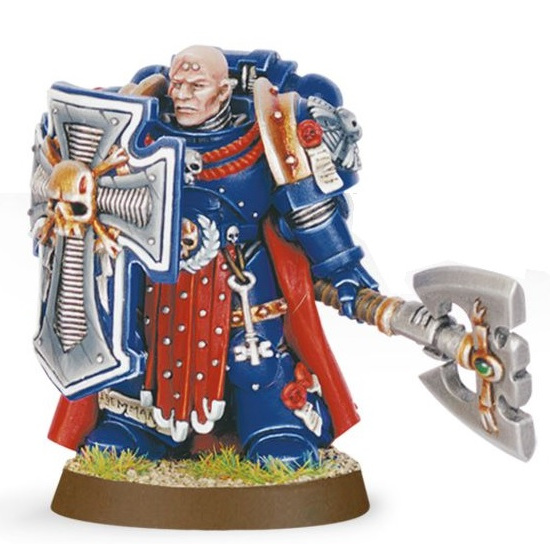
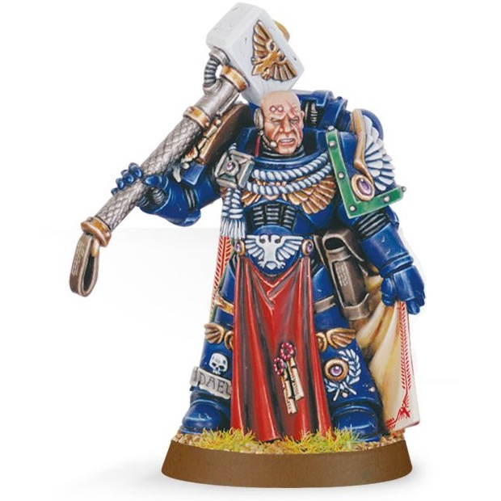
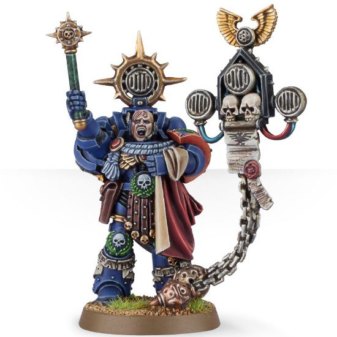
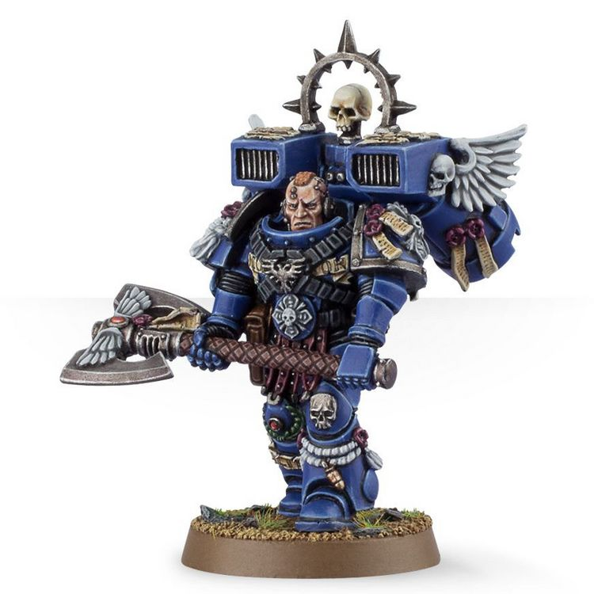

# 0217 大师 Master

精校状态：中文行文已逐段精校，部分术语仍为暂定

分类：通用概念 / 帝国 Imperium / 中央政务部 Adeptus Terra / 阿斯塔特修会 Adeptus Astartes

原文来源：https://www.bilibili.com/opus/1026955143265910787

原作者：帝国神选罐头

原文时间：编辑于 2025年07月30日 11:36

[返回分类目录](目录.md) · [全书目录](../../目录.md)

<!-- A0217-B0001 -->
**英文原文**

In addition to his duties as the leader of a Space Marine Company, each Space Marine Captain also bears one or more honorific titles which may also carry additional responsibilities extending to the entire chapter. Similar titles are also bestowed on other officers of specialized units, such as vehicle commanders or leading Chaplains.

<!-- /A0217-B0001 -->

<!-- A0217-B0002 -->

原译文

除了作为星际战士连队领导者的职责外，每位星际战士连长还拥有一个或多个荣誉头衔，这些头衔也可能承担延伸到整个战团的额外责任。特殊部队的其他军官也被授予类似的头衔，如载具指挥官或首席牧师。

**校订译文**

除统率星际战士连队外，每名连长还拥有一个或多个荣誉头衔，其中一些也意味着承担涉及整个战团的额外职责。载具指挥官、教士领袖等专业单位的军官，也可能获授类似头衔。

<!-- /A0217-B0002 -->

<!-- A0217-B0003 -->
**英文原文**

Some of these titles are commonly used across all Space Marine Chapters, while others are unique products of a single Chapter's history and creed.

<!-- /A0217-B0003 -->

<!-- A0217-B0004 -->

原译文

其中一些头衔通常用于所有星际战士战团，而另一些则是单个战团历史和信条的独特产物。

**校订译文**

其中一些头衔通常用于所有星际战士战团，而另一些则是单个战团历史和信条的独特产物。

<!-- /A0217-B0004 -->

<!-- A0217-B0005 -->
## Common Titles 通用头衔

<!-- /A0217-B0005 -->

<!-- A0217-B0006 -->
**英文原文**

These titles are used by many Chapters, notably the Ultramarines. It should be noted, however, that some Chapters utilise some of these titles but not others (e.g., the Blood Angels have the positions of Master of the Watch, Master of the Marches, and Master of the Recruits, but all other Company titles are unique) and that those who do use these titles do not always follow this exact layout (e.g., the Salamanders' Master of the Recruits is the Captain of the 7th Company, rather than the 10th, and the Blood Angels' Master of the Marches is the Captain of the 7th Company, not the 5th).

<!-- /A0217-B0006 -->

<!-- A0217-B0007 -->

原译文

许多战团都使用这些头衔，特别是极限战士。然而，应该指出的是，有些战团使用了其中一些头衔，但没有使用其他头衔（例如，圣血天使有守望大师、行军大师和新兵大师的职位，但所有其他连队头衔都是独一无二的），使用这些头衔的人并不总是遵循这种确切的布局（例如，火蜥蜴的新兵大师是第七连的连长，而不是第十连的连长；圣血天使的行军大师是第七连的连长而不是第五连的连长）。

**校订译文**

许多战团都使用这些头衔，极限战士尤其如此。不过，一些战团只采用其中部分称谓，例如圣血天使设有守望大师、行军大师和新兵大师，其他连队的头衔则为本战团独有。即使采用同一头衔，所对应的连队也未必相同：火蜥蜴的新兵大师是第七连长，而非第十连长；圣血天使的行军大师也由第七连长担任，而非第五连长。

<!-- /A0217-B0007 -->

<!-- A0217-B0008 -->
### HQ Chapter Master 总指挥官 战团长

<!-- /A0217-B0008 -->

<!-- A0217-B0009 -->
### Chaplaincy Master of Sanctity 教士团 圣洁导师

原题：Chaplaincy Master of Sanctity 隐修会 圣洁导师

<!-- /A0217-B0009 -->

<!-- A0217-B0010 -->
### Armoury Master of the Forge 军械库 铸造大师

<!-- /A0217-B0010 -->

<!-- A0217-B0011 -->
### Apothecarion Master of the Apothecarion 药剂部 药剂大师

<!-- /A0217-B0011 -->

<!-- A0217-B0012 -->
### Librarium Chief Librarian 智库馆 首席智库员

原题：Librarium Chief Librarian 智库馆 首席智库

<!-- /A0217-B0012 -->

<!-- A0217-B0013 -->

原译文

1st Company Regent/Master of the Keep 第一连 摄政/守卫之主

**校订译文**

1st Company Regent/Master of the Keep 第一连 摄政／堡垒之主

<!-- /A0217-B0013 -->

<!-- A0217-B0014 -->

原译文

2nd Company Master of the Watch 第二连 守望之主

**校订译文**

2nd Company Master of the Watch 第二连 守望大师

<!-- /A0217-B0014 -->

<!-- A0217-B0015 图片 -->

<!-- A0217-B0016 -->

原译文

Master of the Watch 守望之主

**校订译文**

Master of the Watch 守望大师

<!-- /A0217-B0016 -->

<!-- A0217-B0017 -->

原译文

3rd Company Master of the Arsenal 第三连 军械之主

**校订译文**

3rd Company Master of the Arsenal 第三连 军械大师

<!-- /A0217-B0017 -->

<!-- A0217-B0018 图片 -->

<!-- A0217-B0019 -->

原译文

Master of the Arsenal 军械之主

**校订译文**

Master of the Arsenal 军械大师

<!-- /A0217-B0019 -->

<!-- A0217-B0020 -->

原译文

4th Company Master of the Fleet 第四连 舰队之主

**校订译文**

4th Company Master of the Fleet 第四连 舰队大师

<!-- /A0217-B0020 -->

<!-- A0217-B0021 图片 -->

<!-- A0217-B0022 -->

原译文

Master of the Fleet 舰队之主

**校订译文**

Master of the Fleet 舰队大师

<!-- /A0217-B0022 -->

<!-- A0217-B0023 -->

原译文

5th Company Master of the Marches 第五连 行军之主

**校订译文**

5th Company Master of the Marches 第五连 行军大师

<!-- /A0217-B0023 -->

<!-- A0217-B0024 图片 -->

<!-- A0217-B0025 -->

原译文

Master of the Marches 行军之主

**校订译文**

Master of the Marches 行军大师

<!-- /A0217-B0025 -->

<!-- A0217-B0026 -->

原译文

6th Company Master of the Rites 第六连 祭仪之主

**校订译文**

6th Company Master of the Rites 第六连 祭仪之主

<!-- /A0217-B0026 -->

<!-- A0217-B0027 图片 -->

<!-- A0217-B0028 -->

原译文

Master of the Rites 祭仪之主

**校订译文**

Master of the Rites 祭仪之主

<!-- /A0217-B0028 -->

<!-- A0217-B0029 -->

原译文

7th Company Chief Victualler 第七连 首席补给官

**校订译文**

7th Company Chief Victualler 第七连 首席补给官

<!-- /A0217-B0029 -->

<!-- A0217-B0030 -->

原译文

8th Company Lord Executioner 第八连 处刑者领主

**校订译文**

8th Company Lord Executioner 第八连 处刑者领主

<!-- /A0217-B0030 -->

<!-- A0217-B0031 图片 -->

<!-- A0217-B0032 -->

原译文

Lord Executioner 处刑者领主

**校订译文**

Lord Executioner 处刑者领主

<!-- /A0217-B0032 -->

<!-- A0217-B0033 -->

原译文

9th Company Master of Relics 第九连 遗物之主

**校订译文**

9th Company Master of Relics 第九连 遗物大师

<!-- /A0217-B0033 -->

<!-- A0217-B0034 图片 -->

<!-- A0217-B0035 -->

原译文

Master of Relics 遗物之主

**校订译文**

Master of Relics 遗物大师

<!-- /A0217-B0035 -->

<!-- A0217-B0036 -->

原译文

10th Company Master of the Recruits/Master of Reconnaissance 第十连 新兵之主/侦查之主

**校订译文**

10th Company Master of the Recruits/Master of Reconnaissance 第十连 新兵大师／侦察大师

<!-- /A0217-B0036 -->

<!-- A0217-B0037 图片 -->

<!-- A0217-B0038 -->

原译文

Master of the Recruits 新兵之主

**校订译文**

Master of the Recruits 新兵大师

<!-- /A0217-B0038 -->

<!-- A0217-B0039 -->
### Other Master of the Signal 其他 信号大师

原题：Other Master of the Signal 其他 信号之主

<!-- /A0217-B0039 -->

<!-- A0217-B0040 -->
### Other Master of the Flag 其他 旗帜之主

<!-- /A0217-B0040 -->

<!-- A0217-B0041 -->
## Other Titles 其他头衔

<!-- /A0217-B0041 -->

<!-- A0217-B0042 -->
**英文原文**

The following are titles unique to their respective Chapters:

<!-- /A0217-B0042 -->

<!-- A0217-B0043 -->

原译文

以下是各自战团独有的头衔：

**校订译文**

以下是各自战团独有的头衔：

<!-- /A0217-B0043 -->

<!-- A0217-B0044 -->
**英文原文**

Aurora Talons: Master Bombardier, of which there are at least five.

<!-- /A0217-B0044 -->

<!-- A0217-B0045 -->

原译文

极光之爪：轰炸之主，其中至少有五位。

**校订译文**

极光之爪：轰炸之主；战团中至少有五人拥有这一头衔。

<!-- /A0217-B0045 -->

<!-- A0217-B0046 -->

原译文

Blood Angels: 圣血天使

**校订译文**

Blood Angels: 圣血天使

<!-- /A0217-B0046 -->

<!-- A0217-B0047 -->
**英文原文**

Shield of Baal (1st Company);

<!-- /A0217-B0047 -->

<!-- A0217-B0048 -->

原译文

巴尔之盾（第一连）

**校订译文**

巴尔之盾（第一连）

<!-- /A0217-B0048 -->

<!-- A0217-B0049 -->
**英文原文**

Master of Sacrifice (3rd Company);

<!-- /A0217-B0049 -->

<!-- A0217-B0050 -->

原译文

牺牲之主（第三连）

**校订译文**

牺牲之主（第三连）

<!-- /A0217-B0050 -->

<!-- A0217-B0051 -->
**英文原文**

Lord Adjudicator (4th Company)

<!-- /A0217-B0051 -->

<!-- A0217-B0052 -->

原译文

裁决领主（第四连）

**校订译文**

裁决领主（第四连）

<!-- /A0217-B0052 -->

<!-- A0217-B0053 -->
**英文原文**

Keeper of the Arsenal (5th Company, possibly a variant of Master of the Arsenal);

<!-- /A0217-B0053 -->

<!-- A0217-B0054 -->

原译文

军械守卫（第五连，可能是军械之主的一种变体）

**校订译文**

军械守卫（第五连，可能是军械大师的一种变体）

<!-- /A0217-B0054 -->

<!-- A0217-B0055 -->
**英文原文**

Caller of the Fires (6th Company);

<!-- /A0217-B0055 -->

<!-- A0217-B0056 -->

原译文

烈焰召者（第六连）

**校订译文**

烈焰召者（第六连）

<!-- /A0217-B0056 -->

<!-- A0217-B0057 -->
**英文原文**

Lord of Skyfall (8th Company);

<!-- /A0217-B0057 -->

<!-- A0217-B0058 -->

原译文

天陨领主（第八连）

**校订译文**

天陨领主（第八连）

<!-- /A0217-B0058 -->

<!-- A0217-B0059 -->
**英文原文**

Master of Sieges (9th Company)

<!-- /A0217-B0059 -->

<!-- A0217-B0060 -->

原译文

攻城之主（第九连）

**校订译文**

攻城之主（第九连）

<!-- /A0217-B0060 -->

<!-- A0217-B0061 -->
**英文原文**

Warden of the Gates (Overseeing the Chapter Serfs and Servitors)

<!-- /A0217-B0061 -->

<!-- A0217-B0062 -->

原译文

门户看守者（监督战团奴工和侍从）

**校订译文**

门户看守者（负责监管战团农奴与机仆）

**校注：** Servitors 为机仆，不是侍从；Serfs 为战团奴仆。

<!-- /A0217-B0062 -->

<!-- A0217-B0063 -->
**英文原文**

Exalted Herald of Sanguinius — Commander of the Sanguinary Guard

<!-- /A0217-B0063 -->

<!-- A0217-B0064 -->

原译文

圣吉列斯崇高传令官 — 圣血卫队指挥官

**校订译文**

圣吉列斯崇高传令官 — 圣血守卫指挥官

<!-- /A0217-B0064 -->

<!-- A0217-B0065 -->

原译文

Dark Angels: 黑暗天使

**校订译文**

Dark Angels: 黑暗天使

<!-- /A0217-B0065 -->

<!-- A0217-B0066 -->
**英文原文**

Supreme Grand Master — Chapter Master;

<!-- /A0217-B0066 -->

<!-- A0217-B0067 -->

原译文

至高大导师 — 战团长

**校订译文**

至高大导师 — 战团长

<!-- /A0217-B0067 -->

<!-- A0217-B0068 -->

原译文

Grand Master of the Librarians; 智库大导师

**校订译文**

Grand Master of the Librarians; 智库员大导师

<!-- /A0217-B0068 -->

<!-- A0217-B0069 -->

原译文

Grand Master of the Deathwing; 死翼大导师

**校订译文**

Grand Master of the Deathwing; 死翼大导师

<!-- /A0217-B0069 -->

<!-- A0217-B0070 -->

原译文

Grand Master of the Ravenwing; 鸦翼大导师

**校订译文**

Grand Master of the Ravenwing; 鸦翼大导师

<!-- /A0217-B0070 -->

<!-- A0217-B0071 -->

原译文

Grand Master of Chaplains; 牧师大导师

**校订译文**

Grand Master of Chaplains; 教士大导师

<!-- /A0217-B0071 -->

<!-- A0217-B0072 -->

原译文

Grand Master of the Fleet; 舰队大导师

**校订译文**

Grand Master of the Fleet; 舰队大导师

<!-- /A0217-B0072 -->

<!-- A0217-B0073 -->

原译文

Grand Master of the Arsenal; 军械大导师

**校订译文**

Grand Master of the Arsenal; 军械大导师

<!-- /A0217-B0073 -->

<!-- A0217-B0074 -->

原译文

Grand Master of Recruits; 新兵大导师

**校订译文**

Grand Master of Recruits; 新兵大导师

<!-- /A0217-B0074 -->

<!-- A0217-B0075 -->

原译文

Grand Master of the Watch; 守望大导师

**校订译文**

Grand Master of the Watch; 守望大导师

<!-- /A0217-B0075 -->

<!-- A0217-B0076 -->

原译文

Executioners 处刑者

**校订译文**

Executioners 处刑者

<!-- /A0217-B0076 -->

<!-- A0217-B0077 -->
**英文原文**

Master of Blades (Second Company)

<!-- /A0217-B0077 -->

<!-- A0217-B0078 -->

原译文

刀锋之主（第二连）

**校订译文**

刀锋之主（第二连）

<!-- /A0217-B0078 -->

<!-- A0217-B0079 -->

原译文

Flesh Tearers 撕肉者

**校订译文**

Flesh Tearers 撕肉者

<!-- /A0217-B0079 -->

<!-- A0217-B0080 -->
**英文原文**

Watcher of the Lost: A title usually held by the High Chaplain, who must monitor those of the chapter who have succumbed to the Black Rage;

<!-- /A0217-B0080 -->

<!-- A0217-B0081 -->

原译文

迷失守望者：通常由至高牧师担任的头衔，他必须监督那些屈服于黑怒的牧师；

**校订译文**

迷失守望者：通常由至高教士担任，负责监护战团中陷入黑怒的战士。

**校注：** those of the chapter 指战团内陷入黑怒的战士，原译误缩为牧师。

<!-- /A0217-B0081 -->

<!-- A0217-B0082 -->

原译文

Salamanders: 火蜥蜴

**校订译文**

Salamanders: 火蜥蜴

<!-- /A0217-B0082 -->

<!-- A0217-B0083 -->
**英文原文**

Forgefather: The Forgefather is a Veteran Salamander who travels the universe seeking out the lost Artefacts of Vulkan and information on the fate of the Primarch of the Salamanders. Upon becoming Forgefather the Salamander also takes on the name of Vulkan. While this post takes him away from the Chapter, he is nevertheless held as one of the lords of the Chapter and granted a seat on the Pantheon Council. The current Forgefather is Vulkan He'stan.

<!-- /A0217-B0083 -->

<!-- A0217-B0084 -->

原译文

铸造之父：铸造之父是一名经验丰富的火蜥蜴，他周游宇宙，寻找失落的沃坎遗物和火蜥蜴原体命运的信息。在成为铸造之父后，火蜥蜴也取了沃坎的名字。虽然这个职位让他离开了战团，但他仍然是战团的领主之一，并被授予万神殿议会的一个席位。目前的铸造之父是伏尔甘·赫斯坦。

**校订译文**

铸造之父：由一名资深火蜥蜴战士担任，负责在宇宙中寻找失落的沃坎遗物，并搜集有关火蜥蜴原体下落的消息。继任者也会采用“沃坎”之名。虽然职责使他长期远离战团，他仍位列战团领主，并在万神殿议会中拥有席位。现任铸造之父是伏尔甘·赫斯坦。

<!-- /A0217-B0084 -->

<!-- A0217-B0085 -->
**英文原文**

Master of Arms: The premier close quarters combat instructor of the Salamanders. Currently held by Master Prebian.

<!-- /A0217-B0085 -->

<!-- A0217-B0086 -->

原译文

武器之主：火蜥蜴的首席近距离战斗教官。目前由普雷比安大师持有。

**校订译文**

武器之主：火蜥蜴的首席近身格斗教官，现由普雷比安大师担任。

<!-- /A0217-B0086 -->

<!-- A0217-B0087 -->
**英文原文**

Lord of Burning Skies: The Master of the Fleet of the Salamanders also holds this honorific title. Currently held by Captain Dac'tyr.

<!-- /A0217-B0087 -->

<!-- A0217-B0088 -->

原译文

燃空领主：火蜥蜴舰队之主也拥有这一荣誉称号。目前由达克提尔连长持有。

**校订译文**

燃空领主：火蜥蜴的舰队大师同时享有这一荣誉头衔，现由达克提尔连长担任。

<!-- /A0217-B0088 -->

<!-- A0217-B0089 -->

原译文

Ultramarines: 极限战士

**校订译文**

Ultramarines: 极限战士

<!-- /A0217-B0089 -->

<!-- A0217-B0090 -->
**英文原文**

Regent of Ultramar: A title typically held by the First Company (Veterans) Captain. The current incumbent is First Captain Severus Agemman

<!-- /A0217-B0090 -->

<!-- A0217-B0091 -->

原译文

奥特拉玛摄政：通常由第一连（老兵）连长持有的头衔。现任是第一连长西弗勒斯·阿格曼

**校订译文**

奥特拉玛摄政：通常由第一连（老兵）连长持有的头衔。现任是第一连长西弗勒斯·阿格曼

<!-- /A0217-B0091 -->

<!-- A0217-B0092 -->
**英文原文**

Spear of Macragge: Given to the Chapter's preeminent tank commander, who enjoys a unique position in that, regardless of rank, he is answerable only to the Chapter Master and not to any Company Captain; the current incumbent is Sergeant Antaro Chronus;

<!-- /A0217-B0092 -->

<!-- A0217-B0093 -->

原译文

马库拉格之矛：该战团杰出的坦克指挥官享有独特的地位，无论级别如何，他只对战团长负责，不向任何连长负责；现任为安塔罗·克罗努斯军士；

**校订译文**

马库拉格之矛：该战团杰出的坦克指挥官享有独特的地位，无论级别如何，他只对战团长负责，不向任何连长负责；现任为安塔罗·克罗努斯军士；

<!-- /A0217-B0093 -->

<!-- A0217-B0094 -->
**英文原文**

High Suzerain of Ultramar: an honorific title currently held by Second Company Captain Cato Sicarius;

<!-- /A0217-B0094 -->

<!-- A0217-B0095 -->

原译文

奥特拉玛高领主：目前由第二连长卡托·西卡留斯担任的荣誉称号；

**校订译文**

奥特拉玛高领主：目前由第二连长卡托·西卡留斯担任的荣誉称号；

**校注：** 本文将西卡留斯列为现任第二连长，属于所给英文底稿的时间视角，保留而不以其他年代任职资料覆盖；后两项同。

<!-- /A0217-B0095 -->

<!-- A0217-B0096 -->
**英文原文**

Knight Champion of Macragge: an honorific title currently held by Second Company Captain Cato Sicarius;

<!-- /A0217-B0096 -->

<!-- A0217-B0097 -->

原译文

马库拉格骑士冠军：目前由第二连长卡托·西卡留斯担任的荣誉称号；

**校订译文**

马库拉格骑士冠军：目前由第二连长卡托·西卡留斯担任的荣誉称号；

<!-- /A0217-B0097 -->

<!-- A0217-B0098 -->
**英文原文**

Master of the Household: an honorific title currently held by Second Company Captain Cato Sicarius;

<!-- /A0217-B0098 -->

<!-- A0217-B0099 -->

原译文

内务总管：目前由第二连长卡托·西卡留斯担任的荣誉称号；

**校订译文**

内务总管：目前由第二连长卡托·西卡留斯担任的荣誉称号；

<!-- /A0217-B0099 -->

<!-- A0217-B0100 -->

原译文

White Scars: 白色疤痕

**校订译文**

White Scars: 白疤

<!-- /A0217-B0100 -->

<!-- A0217-B0101 -->
**英文原文**

Master of the Hunt: the Master of the Hunt is tasked to hunt down any enemy who has clashed with the chapter in the past and, through luck or skill, managed to survive the encounter; the Master of the Hunt is dispatched to hunt down a specific enemy every twenty-five years. The title is traditionally bestowed on the Captain of the 4th Company, although the current incumbent, Captain Kor'sarro Khan, commands the 3rd.

<!-- /A0217-B0101 -->

<!-- A0217-B0102 -->

原译文

狩猎大师：狩猎大师的任务是追捕过去与战团发生冲突的任何敌人，并通过运气或技能在遭遇中幸存下来；狩猎大师每二十五年被派去追捕一个特定的敌人。该头衔传统上授予第四连的连长，尽管现任连长阔萨罗可汗指挥第三连。

**校订译文**

狩猎大师：负责追杀那些曾与战团交锋、凭运气或本领幸存下来的敌人。每隔二十五年，狩猎大师便会受命追猎一名特定敌人。这一头衔传统上授予第四连长，但现任狩猎大师科萨罗可汗指挥的是第三连。

<!-- /A0217-B0102 -->

<!-- A0217-B0103 -->
## Traitor Legions 叛徒军团

<!-- /A0217-B0103 -->

<!-- A0217-B0104 -->
**英文原文**

Whether similar titles are used by the Traitor Legions is uncertain, although at least one, the Iron Warriors, uses the title of "Captain of Arms." One such Captain of Arms was Cadaras Grendel, who traveled in the retinue of Warsmith Berossus

<!-- /A0217-B0104 -->

<!-- A0217-B0105 -->

原译文

叛徒军团是否使用类似的头衔尚不确定，尽管至少有一个钢铁勇士使用了“武器之主”的头衔。其中一个武器之主是卡达拉斯·格伦戴尔，他随战争铁匠贝罗索斯的随从旅行

**校订译文**

叛徒军团是否也使用类似头衔，目前尚不明确。不过，至少钢铁勇士军团使用“武器统领”这一称号。卡达拉斯·格伦戴尔便是一名武器统领，曾作为战争铁匠贝罗索斯的随员同行。

**校注：** at least one 指至少一个叛徒军团，即钢铁勇士，并非至少一名钢铁勇士。Captain of Arms 暂译武器统领，与 Master of Arms 武器之主区分。

<!-- /A0217-B0105 -->

本篇核心术语与暂定项

以下列出本篇出现的英文原形及核心术语表用词。同形词可能指不同对象，具体词义以本篇正文和校注为准；单复数、别名和仅见于图注的名称可能尚未列入。完整候选见[术语表](../../术语表/双语术语候选.csv)。

| 英文 | 采用中文 | 状态 |
| --- | --- | --- |
| Blood Angels | 圣血天使 | 官方已核对 |
| Ultramar | 奥特拉玛 | 官方已核对 |
| Ultramarines | 极限战士 | 官方已核对 |
| Sanguinary | 圣血学派 | 暂定·学派语境 |
| History | 历史 | 编辑用语已统一 |
| Primarch | 原体 | 官方已核对 |
| Iron Warriors | 钢铁勇士 | 暂定·官方待核 |
| Vulkan | 沃坎 | 暂定·官方待核 |
| Salamanders | 火蜥蜴 | 暂定·官方待核 |
| Baal | 巴尔 | 暂定·官方待核 |
| Macragge | 马库拉格 | 暂定·官方待核 |
| Warsmith | 战争铁匠 | 暂定·官方待核 |
| Master | 导师（审判庭职衔）／舰务官（舰员职务） | 语境定译·官方待核 |
| High Chaplain | 至高教士 | 暂定·官方待核 |
| Master of the Watch | 守望大师 | 暂定·官方待核 |
| Master of the Arsenal | 军械大师 | 暂定·官方待核 |
| Master of the Fleet | 舰队大师 | 暂定·官方待核 |
| Master of the Marches | 行军大师 | 暂定·官方待核 |
| Master of the Recruits | 新兵大师 | 暂定·官方待核 |
| Chaplain | 教士 | 官方已核对 |
| Sanguinary Guard | 圣血守卫 | 官方已核对 |
| First Captain | 第一连长 | 暂定·官方待核 |
| Berossus | 贝罗索斯 | 暂定·官方待核 |
| Champion | 冠军 | 暂定·官方待核 |
| Herald | 传令官 | 暂定·官方待核 |
| Space Marine | 星际战士 | 暂定·官方待核 |
| Chapter | 战团 | 暂定·官方待核 |
| Chapter Master | 战团长 | 暂定·官方待核 |
| Captain | 连长 | 暂定·官方待核 |
| Veteran | 老兵 | 暂定·官方待核 |
| Sergeant | 军士 | 暂定·官方待核 |
| Cato Sicarius | 卡托·西卡留斯 | 暂定·官方待核 |
| Severus Agemman | 西弗勒斯·阿格曼 | 暂定·官方待核 |
| Antaro Chronus | 安塔洛·克罗诺斯 | 暂定·官方待核 |
| Vulkan He'stan | 伏尔甘·赫斯坦 | 暂定·官方待核 |
| Kor'sarro Khan | 科萨罗可汗 | 暂定·官方待核 |
| Aurora Talons | 极光之爪 | 暂定·官方待核 |
| Shield of Baal | 巴尔之盾 | 暂定·官方待核 |
| Master of Sacrifice | 牺牲之主 | 暂定·官方待核 |
| Lord Adjudicator | 裁决领主 | 暂定·官方待核 |
| Caller of the Fires | 烈焰召者 | 暂定·官方待核 |
| Lord of Skyfall | 天陨领主 | 暂定·官方待核 |
| Master of Sieges | 攻城之主 | 暂定·官方待核 |
| Warden of the Gates | 门户看守者 | 暂定·官方待核 |
| Exalted Herald of Sanguinius | 圣吉列斯崇高传令官 | 暂定·官方待核 |
| Supreme Grand Master | 至高大导师 | 暂定·官方待核 |
| Master of Blades | 刀锋之主 | 暂定·官方待核 |
| Watcher of the Lost | 迷失守望者 | 暂定·官方待核 |
| Forgefather | 铸造之父 | 暂定·官方待核 |
| Master of Arms | 武器之主 | 暂定·官方待核 |
| Lord of Burning Skies | 燃空领主 | 暂定·官方待核 |
| Regent of Ultramar | 奥特拉玛摄政 | 暂定·官方待核 |
| Spear of Macragge | 马库拉格之矛 | 暂定·官方待核 |
| High Suzerain of Ultramar | 奥特拉玛高领主 | 暂定·官方待核 |
| Knight Champion of Macragge | 马库拉格骑士冠军 | 暂定·官方待核 |
| Master of the Household | 内务总管 | 暂定·官方待核 |
| Master of the Hunt | 狩猎大师 | 暂定·官方待核 |
| Space Marine Company | 星际战士连队 | 暂定·官方待核 |
| Chapter serfs | 战团农奴 | 暂定·官方待核 |
| Monitor | 监视者 | 暂定·官方待核 |
| Captain of Arms | 武器统领 | 暂定·官方待核 |
| Pantheon Council | 万神殿议会 | 暂定·官方待核 |
| Grendel | 格伦德尔号 | 暂定·官方待核 |
| Chaplains | 教士 | 暂定·官方待核 |
| Severus | 西弗勒斯 | 暂定·官方待核 |
| Artefacts of Vulkan | 沃坎造物 | 暂定·官方待核 |
| Grand Master | 大导师 | 暂定·官方待核 |
| The Blood | 鲜血 | 暂定·官方待核 |

