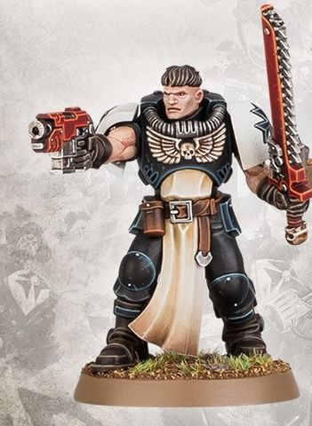
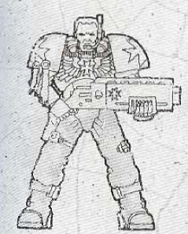

# 0219 新进者 Neophyte

精校状态：中文行文已逐段精校，部分术语仍为暂定

分类：通用概念 / 帝国 Imperium / 中央政务部 Adeptus Terra / 阿斯塔特修会 Adeptus Astartes

原文来源：https://www.bilibili.com/opus/1030761987492020233

原作者：帝国神选罐头

原文时间：2025年02月06日 16:42

[返回分类目录](目录.md) · [全书目录](../../目录.md)

<!-- A0219-B0001 -->
**英文原文**

Neophytes are those humans who undergo the process of becoming a superhuman Space Marine. Before they undergo the transformation, they are called Aspirants.

<!-- /A0219-B0001 -->

<!-- A0219-B0002 -->

原译文

新进者是指那些经历了成为超人星际战士过程的人。在他们经历转变之前，他们被称为有志者。

**校订译文**

新进者是正在接受改造、逐步成为超人星际战士的人类。在改造开始前，他们称为有志者。

<!-- /A0219-B0002 -->

<!-- A0219-B0003 -->
## Indoctrination 教导

<!-- /A0219-B0003 -->

<!-- A0219-B0004 -->
**英文原文**

In most Codex Chapters, Neophytes are formed into Scout Squads, until they are promoted to full Space Marine status. Even though it is a long and painful process, requiring the most brutal training and the receiving of implanted organs, it is a process that is undergone willingly for the defense of the Imperium.

<!-- /A0219-B0004 -->

<!-- A0219-B0005 -->

原译文

在大多数圣典战团中，新进者被组成侦察小队，直到他们被提升为正式的星际战士。尽管这是一个漫长而痛苦的过程，需要最残酷的训练和接受植入器官，但这是为了保卫帝国而自愿经历的过程。

**校订译文**

在大多数圣典战团中，新进者被组成侦察小队，直到他们被提升为正式的星际战士。尽管这是一个漫长而痛苦的过程，需要最残酷的训练和接受植入器官，但这是为了保卫帝国而自愿经历的过程。

<!-- /A0219-B0005 -->

<!-- A0219-B0006 图片 -->

<!-- A0219-B0007 -->

原译文

Neophyte 新进者

**校订译文**

Neophyte 新进者

<!-- /A0219-B0007 -->

<!-- A0219-B0008 -->
## Chapter Variants 战团变体

<!-- /A0219-B0008 -->

<!-- A0219-B0009 -->
### Black Templars 黑色圣堂

<!-- /A0219-B0009 -->

<!-- A0219-B0010 -->
**英文原文**

Uncharacteristic of a Codex Chapter, Black Templars Neophytes are employed as frontline soldiers rather than being used as a separate Scout Company. They attain the rank after completing their grueling training as an Aspirant and are given an Initiate as a tutor. Under the care of their Initiate superiors and acting as their squires, Black Templars Neophytes are deployed in Crusader Squads. Towards the end of their tutelage they may be assigned to a typical Scout formation by their Initiate, and only once they have passed many such trials will they be proclaimed by Chaplains as worthy to ascension as an Initiate.

<!-- /A0219-B0010 -->

<!-- A0219-B0011 -->

原译文

与圣典战团不同，黑色圣堂新进者被作为前线士兵，而不是作为一个单独的侦察连。他们在完成了作为一名有志者的艰苦训练后获得了军衔，并被给予给作为启蒙导师的信徒。在他们的信徒上级的照顾下，作为他们的侍从，黑色圣堂新进者被部署到十字军小队。在他们的教导接近尾声时，他们可能会被他们的信徒导师分配到一个典型的侦查编队，只有当他们通过了许多这样的考验后，牧师才会宣布他们值得提升为信徒。

**校订译文**

与圣典战团不同，黑色圣堂将新进者编入一线部队，而不将他们集中为独立的侦察连。候选人完成有志者阶段的艰苦训练后，即取得新进者身份，并由一名进阶者担任导师。新进者作为导师的侍从，随其编入十字军小队，在导师的指导与照看下作战。训练接近尾声时，导师也可能将他们派往常规侦察编队；只有通过许多这样的试炼，教士才会宣布他们有资格晋升为进阶者。

**校注：** Initiate 在黑色圣堂中指正式战士身份，依 GW-09/GW-10 第10页单位人数表采用“进阶者”；Neophyte 新进者是其学生兼侍从。

<!-- /A0219-B0011 -->

<!-- A0219-B0012 图片 -->

<!-- A0219-B0013 -->

原译文

Black Templars Neophyte 黑色圣堂新进者

**校订译文**

Black Templars Neophyte 黑色圣堂新进者

<!-- /A0219-B0013 -->

<!-- A0219-B0014 -->
### Others 其他

<!-- /A0219-B0014 -->

<!-- A0219-B0015 -->
**英文原文**

Space Wolves Neophytes, after undergoing the first stage of their genetic transformation, are assigned to Blood Claw Packs, encouraged to vent their youthful enthusiasm on the enemy under the tutelage of more experienced Grey Hunters.

<!-- /A0219-B0015 -->

<!-- A0219-B0016 -->

原译文

太空野狼新进者在经历了基因改造的第一阶段后，被分配到血爪，鼓励他们在更有经验的灰猎的指导下向敌人发泄年轻的热情。

**校订译文**

太空野狼的新进者完成第一阶段的基因改造后，会被编入血爪狼群。在经验更丰富的灰色猎手指导下，他们被鼓励将年轻人的旺盛精力尽数倾泻到敌人身上。

<!-- /A0219-B0016 -->

本篇核心术语与暂定项

以下列出本篇出现的英文原形及核心术语表用词。同形词可能指不同对象，具体词义以本篇正文和校注为准；单复数、别名和仅见于图注的名称可能尚未列入。完整候选见[术语表](../../术语表/双语术语候选.csv)。

| 英文 | 采用中文 | 状态 |
| --- | --- | --- |
| Black Templars | 黑色圣堂 | 官方已核对 |
| Space Wolves | 太空野狼 | 官方已核对 |
| Imperium | 帝国 | 暂定·简称 |
| Grey Hunters | 灰色猎手 | 官方已核对 |
| Aspirant | 候补骑士 | 暂定·官方待核 |
| Space Marine | 星际战士 | 暂定·官方待核 |
| Chapter | 战团 | 暂定·官方待核 |
| Scout | 侦察兵 | 暂定·官方待核 |
| Codex Chapter | 圣典战团 | 暂定·官方待核 |
| Scout Company | 侦察连 | 暂定·官方待核 |
| Initiate | 正式成员 | 暂定·官方待核 |
| Chaplains | 教士 | 暂定·官方待核 |
| claw | 利爪分队 | 暂定·官方待核 |

