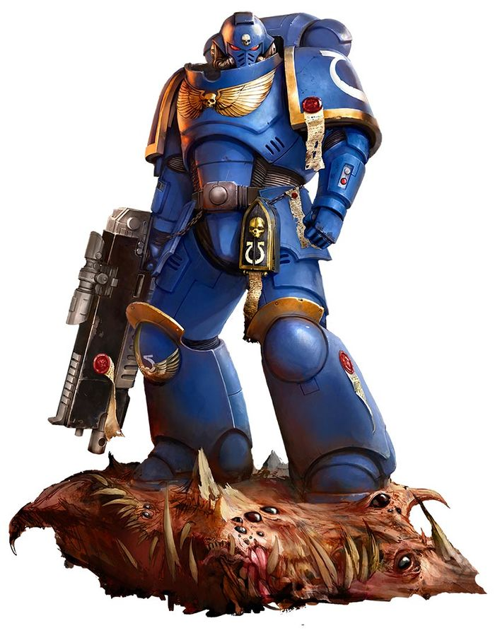
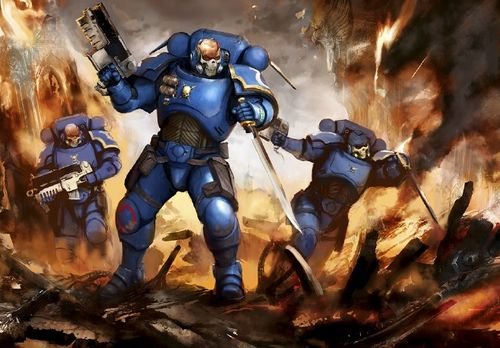
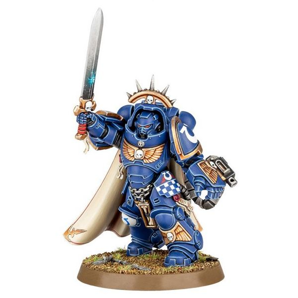
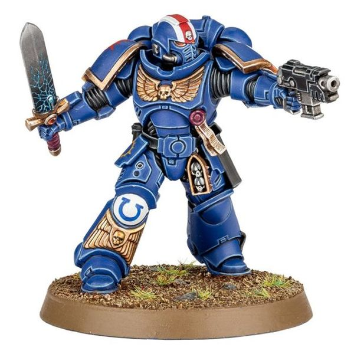
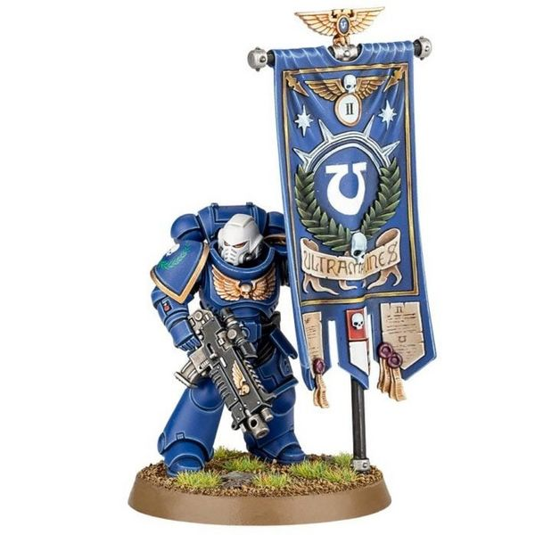
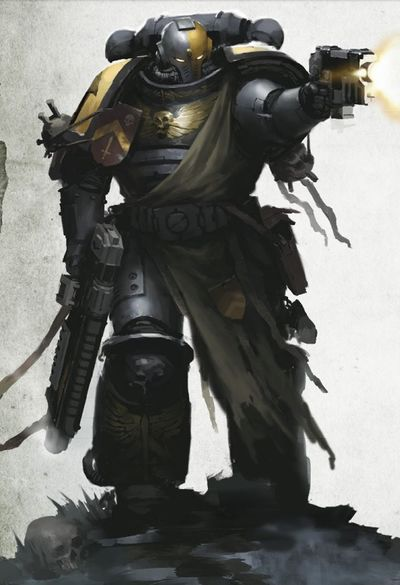
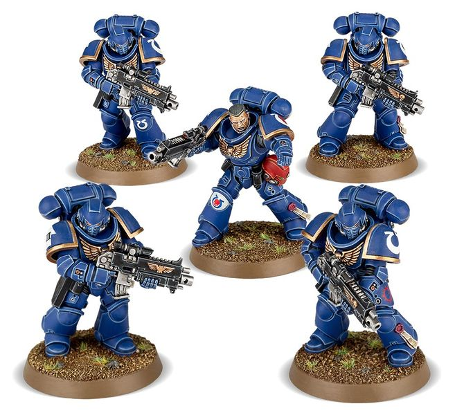
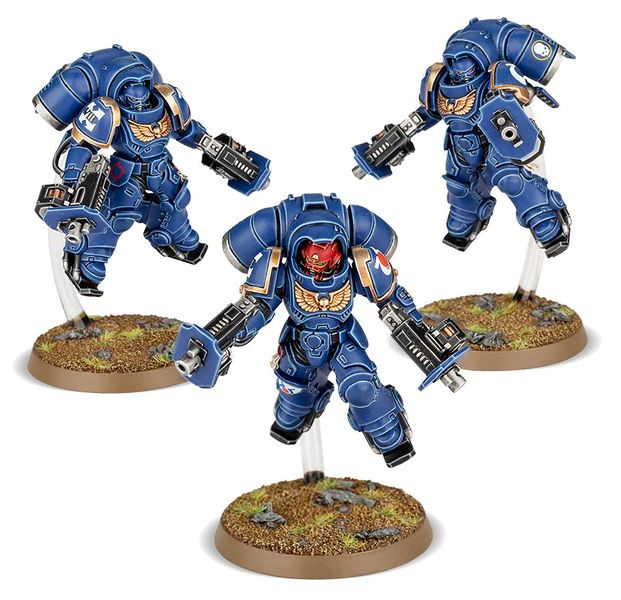
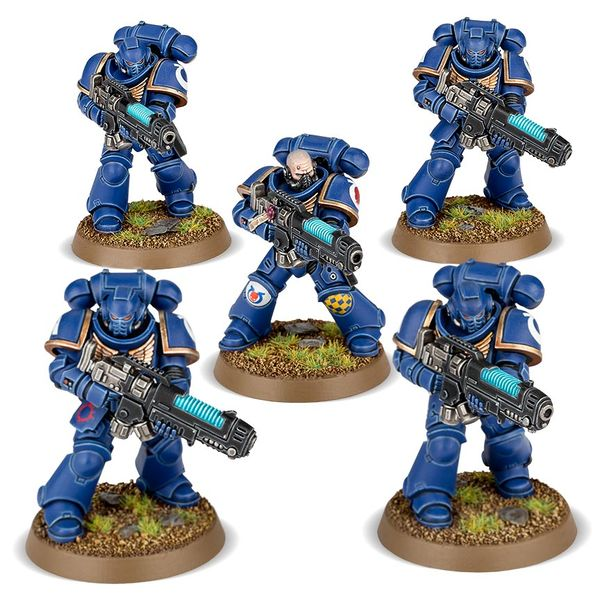
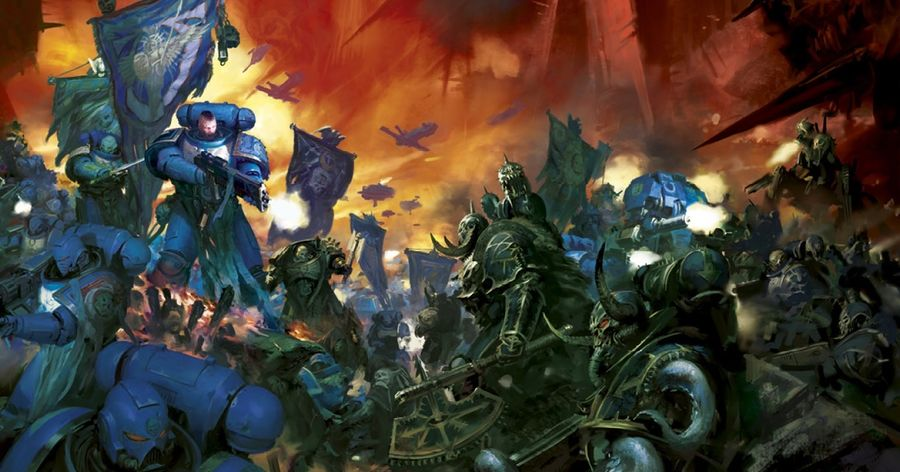

# 0222 原铸星际战士 Primaris Space Marines

精校状态：中文行文已逐段精校，部分术语仍为暂定

分类：通用概念 / 帝国 Imperium / 中央政务部 Adeptus Terra / 阿斯塔特修会 Adeptus Astartes

原文来源：https://www.bilibili.com/opus/985554673587978248

原作者：帝国神选罐头

原文时间：编辑于 2025年09月08日 15:17

[返回分类目录](目录.md) · [全书目录](../../目录.md)

<!-- A0222-B0001 -->
**英文原文**

"They were forged for Mankind's darkest hour - and that hour is upon us."— Lord Commander Roboute Guilliman

<!-- /A0222-B0001 -->

<!-- A0222-B0002 -->

原译文

“它们是为人类最黑暗的时刻而锻造的 - 那一刻即将到来。”— 领主指挥官 罗伯特·基里曼

**校订译文**

“他们为人类最黑暗的时刻而铸就——如今，那一刻已经到来。”——帝国最高统帅罗保特·基里曼

<!-- /A0222-B0002 -->

<!-- A0222-B0003 -->
**英文原文**

Primaris Space Marines are the next step in the evolution of the Emperor's Space Marines. Primaris Marines are larger and more physically powerful than their standard cousins, in addition to having a more stable gene-seed. These mighty warriors have appeared in the closing days of the 41st Millennium following the Thirteenth Black Crusade and resurrection of Roboute Guilliman.

<!-- /A0222-B0003 -->

<!-- A0222-B0004 -->

原译文

原铸星际战士是帝皇的星际战士进化的下一步。除了拥有更稳定的基因种子外，原铸星际战士比他们的标准表亲更大、更强壮。这些强大的战士出现在第十三次黑色远征和罗伯特·基里曼复活后的第41个千年的最后几天。

**校订译文**

原铸星际战士是帝皇所创造的星际战士进一步发展的成果。他们比传统星际战士体型更大、力量更强，基因种子也更加稳定。这批强大战士在第四十一千年末、第十三次黑色远征和罗保特·基里曼复苏之后登场。

<!-- /A0222-B0004 -->

<!-- A0222-B0005 图片 -->

<!-- A0222-B0006 -->

原译文

Ultramarines Primaris Space Marine 极限战士原铸星际战士

**校订译文**

Ultramarines Primaris Space Marine 极限战士原铸星际战士

<!-- /A0222-B0006 -->

<!-- A0222-B0007 -->
**英文原文**

Pre-Primaris original template Space Marines are now referred to as Firstborn.

<!-- /A0222-B0007 -->

<!-- A0222-B0008 -->

原译文

原铸化前的原始模板的星际战士现在被称为长子。

**校订译文**

沿用原铸出现之前的传统改造范式所创造的星际战士，如今称为长子。

<!-- /A0222-B0008 -->

<!-- A0222-B0009 -->
## Overview 概述

<!-- /A0222-B0009 -->

<!-- A0222-B0010 -->
## History 历史

<!-- /A0222-B0010 -->

<!-- A0222-B0011 -->
**英文原文**

Primaris Space Marines have been genetically altered by Archmagos Dominus Belisarius Cawl to be bigger, faster and stronger than their Space Marine brethren. The seed of their creation lies in the aftermath of the Horus Heresy, when the Primarch Roboute Guilliman charged Archmagos Dominus Cawl with creating a new legion of warriors that would aid the Imperium in its next darkest hour. Guilliman gave Cawl the Sangprimus Portum, which allowed the Archmagos access to information regarding all twenty Primarchs themselves. Cawl also used several unique STC-technologies during the process of creating the Primaris'. Nonetheless, the task would take ten thousand years to complete and now, during the Thirteenth Black Crusade when the Imperium is poised on the brink of annihilation, the Primaris Space Marines have been unleashed to fight against the Chaos hordes of the Despoiler.

<!-- /A0222-B0011 -->

<!-- A0222-B0012 -->

原译文

原铸星际战士已经被神圣大贤者贝利撒留·考尔进行了基因改造，使其比星际战士更大、更快、更强。创造他们的种子在于荷鲁斯叛乱的余波，当时原体罗伯特·基里曼要求神圣大贤者考尔创建一个新的战士军团，在帝国下一个最黑暗的时刻为其提供帮助。基里曼给了考尔原血之栈，这使得大贤者能够获得所有有关二十位原体的个体信息。考尔在创建原铸的过程中还使用了几种独特的STC技术。尽管如此，这项任务仍需要一万年才能完成，现在，在第十三次黑色远征期间，当帝国处于毁灭的边缘时，原铸星际战士被释放出来与大掠夺者的混沌大军作战。

**校订译文**

统御大贤者贝利萨留斯·考尔对原铸星际战士进行了基因改造，使他们比原有的星际战士兄弟体型更大、速度更快、力量更强。这一计划起源于荷鲁斯之乱之后：原体罗保特·基里曼命令考尔创造一支新的战士军团，在帝国再次面临至暗时刻时挺身而出。基里曼将原血之栈交给考尔，使他能够获取全部二十位原体的资料。考尔还在原铸计划中采用了数种独特的 STC 技术。即便如此，这项任务仍耗时一万年。到了第十三次黑色远征、帝国濒临毁灭之际，原铸星际战士终于投入战场，迎击大掠夺者的混沌大军。

**校注：** Archmagos Dominus 暂译统御大贤者，Dominus 不含“神圣”义，参考已核官方 Tech-Priest Dominus 技术祭司主宰者；完整职衔仍待核。

<!-- /A0222-B0012 -->

<!-- A0222-B0013 -->
**英文原文**

Tens of thousands of Primaris Marines were secretly created by Cawl over the millennia, while many more were made after the rebirth of Guilliman. Many of these were produced and held in stasis within the Zar-Quaesitor, Cawl's flagship. Half of the original batch of Primaris Marines were used to form the new Chapters of the Ultima Founding. The rest were gathered into great armies known as the Unnumbered Sons that would be gradually reduced over the course of the Indomitus Crusade through the reinforcement of existing Chapters scattered throughout the Galaxy. Roughly 94% of existing Space Marine Chapters came to accept Primaris Marines into their ranks. These marines subsequently were called The Awoken to distinguish them from the other Primaris Space Marines, created later.

<!-- /A0222-B0013 -->

<!-- A0222-B0014 -->

原译文

数千年来，考尔秘密创建了数万名原铸星际战士，而更多的是在基里曼重生后创建的。其中许多是在考尔的旗舰探索者之王号内生产和存放的。最初一批原铸星际战士的一半被用来组建极限建军的新战团。其余的人被集结成被称为“未计之子”的大军，在不屈远征的过程中，通过加强分散在银河系各地的现有战团，这支大军将逐渐减少。大约94%的现有星际战士战团开始接受原铸星际战士加入他们的队伍。这些星际战士后来被称为“觉醒者”，以区别于后来创建的其他原铸星际战士。

**校订译文**

数千年来，考尔秘密培育了数万名原铸星际战士；基里曼复苏后，生产规模进一步扩大。其中许多人在考尔的旗舰探索者之王号上被培育出来，并一直保存在静滞状态中。最初一批原铸的一半用于组建极限建军的新战团，另一半则集结为称作“未计之子”的庞大军队。随着不屈远征推进，他们陆续补入散布银河各地的现有战团，未计之子的规模也随之缩小。约有 94% 的现存战团最终接纳了原铸。这批战士后来被称为“觉醒者”，以区别于随后培育的其他原铸星际战士。

<!-- /A0222-B0014 -->

<!-- A0222-B0015 -->
**英文原文**

The first wave of Primaris Space Marines were great reinforcements for the Imperium. But new forces were needed for defense, and therefore, under the Cawl's guidance and with the help of his arcane technology, the Space Marines Chapters were provided with technologies to create their own Primaris Marines from new aspirants. So the next generation of Primaris appeared, created from people born in the 41st millennium. These marines were named The Indocrinated.

<!-- /A0222-B0015 -->

<!-- A0222-B0016 -->

原译文

第一批原铸星际战士是帝国的强大增援。但是防御需要新的力量，因此，在考尔的指导及他的神秘技术的帮助下，星际战士战团获得了从新的有志者中创建自己的原铸星际战士的技术。于是，下一代原铸出现了，由第41个千年出生的人组成。这些星际战士被称为不屈者。

**校订译文**

第一批原铸为帝国带来了强大的增援，但防御战线仍需要更多兵力。因此，在考尔的指导下，借助他的奥秘技术，各星际战士战团获得了从新招募的有志者中自行培育原铸的能力。由第四十一千年出生的人类培育而成的新一代原铸随之出现，称为“受教者”。

**校注：** 英文 The Indocrinated 疑为 The Indoctrinated 的拼写错误，指接受教导的新一代原铸，暂译“受教者”，非“不屈者”；原英文不改。

<!-- /A0222-B0016 -->

<!-- A0222-B0017 -->
**英文原文**

Soon for ordinary Space Marines the question arose - can the standard space marine change into Primaris, gaining increased combat abilities, strengthening his skills for better protecting the Imperium? So the process of Rubicon Primaris was created. It is not known who the first Space Marines were to take this perilous leap of faith. Some say it was Kor'sarro Khan of the White Scars. Other believe it was the mighty Marneus Calgar of the Ultramarines. These 'remade' Primaris Space Marines were called The Ascended. But the process of remaking is perilous and not every space marine was able to undergo the complex operation - some died in the process, while others failed to ascend. Yet despite the losses more and more space marines crossed the Rubicon with every passing day.

<!-- /A0222-B0017 -->

<!-- A0222-B0018 -->

原译文

很快，对于普通的星际战士来说，问题出现了——标准的星际战士能否转变为原铸，获得更高的战斗能力，加强他的技能去更好地保护帝国？因此，原铸手术的流程应运而生。尚不清楚谁是第一批做出这种危险的大胆尝试的星际战士。有人说，是白色疤痕的阔萨罗可汗。其他人则认为，是极限战士强大的马涅乌斯·卡尔加。这些“重制”的星际战士被称为扬升者。但改造的过程是危险的，并不是每个星际战士都能承受复杂的操作——一些人在这个过程中死亡，而另一些人则未能扬升。然而，尽管损失惨重，越来越多的星际战士每天都在跨越原铸界限。

**校订译文**

传统星际战士很快提出了一个问题：自己能否转化为原铸，提升战力，从而更好地保护帝国？原铸跨越手术因此诞生。究竟是谁最先冒险接受手术，尚无定论：有人说是白疤的科萨罗可汗，也有人认为是极限战士的马涅乌斯·卡尔加。这些经重新改造的原铸称为“扬升者”。然而，改造极其危险，并非每名星际战士都能承受这套复杂手术：有人死于手术，有人则未能完成扬升。尽管有所损失，选择跨越原铸界限的星际战士仍与日俱增。

**校注：** Rubicon Primaris 暂译原铸跨越手术，保留跨越不可逆界限的含义。首位手术接受者在本段有争议，而后文称卡尔加为首个已知成功案例；两种表述均按原文保留。

<!-- /A0222-B0018 -->

<!-- A0222-B0019 -->
## Biology 生理

<!-- /A0222-B0019 -->

<!-- A0222-B0020 -->
**英文原文**

Though they are a step removed from their brothers, the Primaris Space Marines still bear the gene-seed of their Primarchs, and some dissenting voices worry how this new type of warrior will react with the known genetic quirks and flaws of some of the more unusual Chapters. Thanks to the Sangprimus Portum, Cawl collected genetic samples of all twenty of the original Primarchs, including those deemed lost to history. However, Guilliman made clear that only Primaris Marines from loyalist Legions were to be produced.

<!-- /A0222-B0020 -->

<!-- A0222-B0021 -->

原译文

尽管他们与他们的兄弟们有一些差别，但原铸星际战士仍然携带着他们的原体的基因种子，一些反对的声音担心这种新型战士将如何应对一些更不寻常的战团中已知的基因怪癖和缺陷。多亏了原血之栈，考尔收集了所有二十位原体的遗传样本，包括那些被认为已经从历史中失落的。然而，基里曼明确表示，只生产来自忠诚军团的原铸星际战士。

**校订译文**

原铸虽然与既有的战斗兄弟有所不同，却仍承载着各自原体的基因种子。因此，一些反对者担忧，这种新战士会如何表现出某些特殊战团固有的遗传特征与缺陷。借助原血之栈，考尔收集了全部二十位原体的遗传样本，包括那些已经从历史中消失的原体。然而，基里曼明确规定，只准培育出自忠诚军团血脉的原铸星际战士。

<!-- /A0222-B0021 -->

<!-- A0222-B0022 图片 -->

<!-- A0222-B0023 -->

原译文

Primaris Reiver Squad 原铸掠夺者小队

**校订译文**

Primaris Reiver Squad 原铸掠夺者小队

<!-- /A0222-B0023 -->

<!-- A0222-B0024 -->
**英文原文**

The Primaris Marines differ from their standard cousins thanks to three additional Implants not found in the latter: Sinew Coils, the Magnificat, and the Belisarian Furnace. The implants, plus the benefits of more potent geneseed thanks to the Sangprimus Portum, allow the Primaris Marines to be larger and physically stronger than previous generations of Astartes. In addition, their gene-seed is far more stable and only has a 0.001% genetic deviancy per generation, avoiding the severe instability problems seen with Chapters such as the Blood Angels and Space Wolves.

<!-- /A0222-B0024 -->

<!-- A0222-B0025 -->

原译文

原铸星际战士与他们的标准表亲不同，这要归功于后者中没有发现的三个额外植入物：肌腱线圈、圣颂垂体和贝利撒留熔炉。这些植入物，再加上原血之栈带来的更强大的基因种子的好处，使原铸星际战士比前几代阿斯塔特更大、更强壮。此外，他们的基因种子要稳定得多，每代只有0.001%的遗传偏差，避免了圣血天使和太空野狼等战团中出现的严重不稳定问题。

**校订译文**

原铸与传统星际战士的区别之一，是额外拥有三种植入物：肌腱线圈、圣颂垂体和贝利萨留斯熔炉。这些植入物，加上考尔借助原血之栈研制的效能更强的基因种子，使原铸比此前几代阿斯塔特体型更大、力量更强。他们的基因种子也稳定得多，每一代的遗传偏差率仅为 0.001%，从而避免了圣血天使、太空野狼等战团所面临的严重不稳定问题。

**校注：** 本段宣称原铸避免严重遗传不稳定，其他时期资料可能仍记有黑怒等现象；暂按本段英文保留，未擅自用其他版本覆盖。

<!-- /A0222-B0025 -->

<!-- A0222-B0026 -->
**英文原文**

Standard Space Marines can be remade into Primaris Space Marines, but early on this was not advisable as Belisarius Cawl estimated a 61.6% failure rate until the process could be perfected. While many saw transitioning into Primaris as the ultimate destiny of all Space Marines, many opposed converting and there were even whispers of mutiny at the prospect. Ultimately, Marneus Calgar volunteered to become the first known successful case of a Space Marine transitioning into a Primaris Space Marine. Despite it being an agonizing procedure, Calgar became physically enhanced and better equipped to mentally deal with the depredations of the Warp.

<!-- /A0222-B0026 -->

<!-- A0222-B0027 -->

原译文

标准星际战士可以重新制作成原铸星际战士，但早期并不可取，因为贝利撒留·考尔估计在该过程完善之前，失败率为61.6%。虽然许多人认为过渡到原铸是所有星际战士的最终命运，但许多人反对转换，甚至有传言称这一前景会引发叛乱。最终，马涅乌斯·卡尔加自愿成为第一个已知的成功案例，将星际战士转变为原铸星际战士。尽管这是一个痛苦的过程，卡尔加的身体得到了增强，精神上也更有能力应对亚空间的破坏。

**校订译文**

传统星际战士可以接受再次改造，成为原铸，但在早期并不建议这样做：贝利萨留斯·考尔估计，在手术流程完善前，失败率高达 61.6%。虽然许多人将原铸化视为所有星际战士的最终归宿，仍有不少人反对，甚至传出有人可能为此哗变。最终，马涅乌斯·卡尔加自愿接受手术，成为首个已知的成功案例。手术过程极其痛苦，但卡尔加不仅体魄增强，心智也更能抵御亚空间的侵害。

<!-- /A0222-B0027 -->

<!-- A0222-B0028 -->
## Ranks & Types 等级和类型

<!-- /A0222-B0028 -->

<!-- A0222-B0029 -->
## Officials 领袖

<!-- /A0222-B0029 -->

<!-- A0222-B0030 -->
**英文原文**

Captain — Company leaders.

<!-- /A0222-B0030 -->

<!-- A0222-B0031 -->

原译文

连长— 连队领袖

**校订译文**

连长— 连队领袖

<!-- /A0222-B0031 -->

<!-- A0222-B0032 图片 -->

<!-- A0222-B0033 -->

原译文

Primaris Captain 原铸连长

**校订译文**

Primaris Captain 原铸连长

<!-- /A0222-B0033 -->

<!-- A0222-B0034 -->
**英文原文**

Lieutenant — Squad leaders, two per Company.

<!-- /A0222-B0034 -->

<!-- A0222-B0035 -->

原译文

副官— 小队领袖，每个连队两个

**校订译文**

副官— 小队领袖，每个连队两个

**校注：** 英文写 Squad leaders，但副官在本书其他条目统率半连（demi-company），此处疑为英文概括不严谨。保留原译并标待核。

<!-- /A0222-B0035 -->

<!-- A0222-B0036 图片 -->

<!-- A0222-B0037 -->

原译文

Primaris Lieutenant 原铸副官

**校订译文**

Primaris Lieutenant 原铸副官

<!-- /A0222-B0037 -->

<!-- A0222-B0038 -->

原译文

Vanguard Lieutenant 先锋副官

**校订译文**

Vanguard Lieutenant 先锋副官

<!-- /A0222-B0038 -->

<!-- A0222-B0039 -->

原译文

Librarian 智库

**校订译文**

Librarian 智库员

<!-- /A0222-B0039 -->

<!-- A0222-B0040 -->

原译文

Vanguard Librarian 先锋智库

**校订译文**

Vanguard Librarian 先锋智库员

<!-- /A0222-B0040 -->

<!-- A0222-B0041 -->

原译文

Apothecary 药剂师

**校订译文**

Apothecary 药剂师

<!-- /A0222-B0041 -->

<!-- A0222-B0042 -->

原译文

Vanguard Helix Adept 先锋药剂师

**校订译文**

Vanguard Helix Adept 先锋螺旋医疗员

<!-- /A0222-B0042 -->

<!-- A0222-B0043 -->

原译文

Chaplain 牧师

**校订译文**

Chaplain 教士

<!-- /A0222-B0043 -->

<!-- A0222-B0044 -->
**英文原文**

Judiciar - Chaplain in training. Unlike most members of this list, Judiciars are never Firstborn, although the reason for this has never been given.

<!-- /A0222-B0044 -->

<!-- A0222-B0045 -->

原译文

裁决者-训练中的牧师。与这份名单中的大多数成员不同，裁决者从来不是长子，尽管从未给出过原因。

**校订译文**

裁决者——接受教士训练的战士。与本表大多数职位不同，裁决者从不由长子担任，原因尚未说明。

<!-- /A0222-B0045 -->

<!-- A0222-B0046 -->
**英文原文**

Ancient — Standard bearer.

<!-- /A0222-B0046 -->

<!-- A0222-B0047 -->

原译文

旗手— 标准旗手

**校订译文**

旗手——掌旗者。

**校注：** Standard bearer 指军旗持有者，standard 此处不是“标准”。

<!-- /A0222-B0047 -->

<!-- A0222-B0048 图片 -->

<!-- A0222-B0049 -->

原译文

Primaris Ancient Standard bearer 原铸旗手

**校订译文**

Primaris Ancient Standard bearer 原铸旗手

<!-- /A0222-B0049 -->

<!-- A0222-B0050 -->
**英文原文**

Bladeguard Ancient - Standard bearer

<!-- /A0222-B0050 -->

<!-- A0222-B0051 -->

原译文

剑卫旗手- 标准旗手

**校订译文**

剑卫旗手——掌旗者。

<!-- /A0222-B0051 -->

<!-- A0222-B0052 图片 -->

<!-- A0222-B0053 -->

原译文

A Primaris Space Marine of the Silver Templars 一个银色圣堂的原铸星际战士

**校订译文**

A Primaris Space Marine of the Silver Templars 一个银色圣堂的原铸星际战士

<!-- /A0222-B0053 -->

<!-- A0222-B0054 -->
## Squads 小队

<!-- /A0222-B0054 -->

<!-- A0222-B0055 -->
**英文原文**

Intercessor — Legion Tactical Squad equivalent.

<!-- /A0222-B0055 -->

<!-- A0222-B0056 -->

原译文

仲裁者— 等同于军团战术小队

**校订译文**

仲裁者— 等同于军团战术小队

<!-- /A0222-B0056 -->

<!-- A0222-B0057 图片 -->

<!-- A0222-B0058 -->

原译文

Intercessor Squad 仲裁者小队

**校订译文**

Intercessor Squad 仲裁者小队

<!-- /A0222-B0058 -->

<!-- A0222-B0059 -->
**英文原文**

Assault Intercessors - Armed with Chainswords for close combat.

<!-- /A0222-B0059 -->

<!-- A0222-B0060 -->

原译文

突击仲裁者- 装备链锯剑作为近战武器

**校订译文**

突击仲裁者- 装备链锯剑作为近战武器

<!-- /A0222-B0060 -->

<!-- A0222-B0061 -->
**英文原文**

Jump Pack Intercessor - Jump Pack-equipped units

<!-- /A0222-B0061 -->

<!-- A0222-B0062 -->

原译文

跳跃背包仲裁者- 装备跳跃背包的小队

**校订译文**

跳跃背包仲裁者- 装备跳跃背包的小队

<!-- /A0222-B0062 -->

<!-- A0222-B0063 -->
**英文原文**

Veteran Intercessor - Space Marine Veterans

<!-- /A0222-B0063 -->

<!-- A0222-B0064 -->

原译文

仲裁者老兵- 星际战士老兵

**校订译文**

仲裁者老兵- 星际战士老兵

<!-- /A0222-B0064 -->

<!-- A0222-B0065 -->
**英文原文**

Heavy Intercessors - Armed with heavy Bolt Weapons.

<!-- /A0222-B0065 -->

<!-- A0222-B0066 -->

原译文

重装仲裁者- 装备重型爆矢武器

**校订译文**

重装仲裁者- 装备重型爆矢武器

<!-- /A0222-B0066 -->

<!-- A0222-B0067 -->
**英文原文**

Inceptor — Assault Squad equivalent.

<!-- /A0222-B0067 -->

<!-- A0222-B0068 -->

原译文

先驱者— 等同于突击小队

**校订译文**

先驱者— 等同于突击小队

<!-- /A0222-B0068 -->

<!-- A0222-B0069 图片 -->

<!-- A0222-B0070 -->

原译文

Inceptor Squad 先驱者小队

**校订译文**

Inceptor Squad 先驱者小队

<!-- /A0222-B0070 -->

<!-- A0222-B0071 -->
**英文原文**

Hellblaster — Tactical Support Squad equivalent.

<!-- /A0222-B0071 -->

<!-- A0222-B0072 -->

原译文

地狱轰击者— 等同于战术支援小队

**校订译文**

地狱轰击者— 等同于战术支援小队

<!-- /A0222-B0072 -->

<!-- A0222-B0073 图片 -->

<!-- A0222-B0074 -->

原译文

Hellblaster Squad 地狱轰击者小队

**校订译文**

Hellblaster Squad 地狱轰击者小队

<!-- /A0222-B0074 -->

<!-- A0222-B0075 -->
**英文原文**

Eradicator - Equipped with Melta Rifles

<!-- /A0222-B0075 -->

<!-- A0222-B0076 -->

原译文

根除者- 装备热熔步枪

**校订译文**

根除者- 装备热熔步枪

<!-- /A0222-B0076 -->

<!-- A0222-B0077 -->
**英文原文**

Aggressor — Gravis-equipped Marines with shoulder-mounted missile racks and Flame Gauntlets.

<!-- /A0222-B0077 -->

<!-- A0222-B0078 -->

原译文

侵略者— 装备格拉维斯护甲且配备有肩扛式发射架和烈焰臂铠的星际战士

**校订译文**

侵略者——身穿重装型护甲，配备肩载导弹架和烈焰臂铠的星际战士。

**校注：** 按英文保留肩载导弹架及烈焰臂铠组合，具体装备配置可能随版本变化，未据模型记忆改写。

<!-- /A0222-B0078 -->

<!-- A0222-B0079 -->
**英文原文**

Bladeguard Veteran - Space Marine Veterans

<!-- /A0222-B0079 -->

<!-- A0222-B0080 -->

原译文

剑卫老兵- 星际战士老兵

**校订译文**

剑卫老兵- 星际战士老兵

<!-- /A0222-B0080 -->

<!-- A0222-B0081 -->
**英文原文**

Primaris Outrider - Bikers

<!-- /A0222-B0081 -->

<!-- A0222-B0082 -->

原译文

原铸先遣者- 骑手

**校订译文**

原铸摩托警卫——摩托车手。

<!-- /A0222-B0082 -->

<!-- A0222-B0083 -->
**英文原文**

Desolation Squad - Equipped with heavy rocket launchers

<!-- /A0222-B0083 -->

<!-- A0222-B0084 -->

原译文

寂灭者小队- 装备重型导弹发射器

**校订译文**

寂灭小队- 装备重型导弹发射器

<!-- /A0222-B0084 -->

<!-- A0222-B0085 -->
**英文原文**

Infernus Squad - Equipped with Pyreblasters

<!-- /A0222-B0085 -->

<!-- A0222-B0086 -->

原译文

焚狱者小队- 装备焚焰枪

**校订译文**

焚狱者小队- 装备焚焰枪

<!-- /A0222-B0086 -->

<!-- A0222-B0087 -->
**英文原文**

Vanguard - Stealth killers

<!-- /A0222-B0087 -->

<!-- A0222-B0088 -->

原译文

先锋- 隐形杀手

**校订译文**

先锋——擅长潜行的杀手。

<!-- /A0222-B0088 -->

<!-- A0222-B0089 -->

原译文

Vanguard Infiltrator 先锋渗透者

**校订译文**

Vanguard Infiltrator 先锋渗透者

<!-- /A0222-B0089 -->

<!-- A0222-B0090 -->

原译文

Vanguard Incursor 先锋入侵者

**校订译文**

Vanguard Incursor 先锋入侵者

<!-- /A0222-B0090 -->

<!-- A0222-B0091 -->

原译文

Vanguard Reiver 先锋掠夺者

**校订译文**

Vanguard Reiver 先锋掠夺者

<!-- /A0222-B0091 -->

<!-- A0222-B0092 -->

原译文

Vanguard Eliminator 先锋歼灭者

**校订译文**

Vanguard Eliminator 先锋歼灭者

<!-- /A0222-B0092 -->

<!-- A0222-B0093 -->

原译文

Vanguard Suppressor 先锋压制者

**校订译文**

Vanguard Suppressor 先锋压制者

<!-- /A0222-B0093 -->

<!-- A0222-B0094 -->
## Armour and Weapons 护甲和武器

<!-- /A0222-B0094 -->

<!-- A0222-B0095 -->
**英文原文**

To aid them in battle, these new gene-forged warriors are equipped with new arms and armour based on Cawl's designs and forged on Holy Mars itself. These include the Mk X Tacticus armour, a suit of Astartes Power Armour that combines the most effective elements of ancestral Horus Heresy patterns of plate with more recent developments in Power Armour technology, and the Mk II Cawl-pattern Bolt Rifle, which is a re-engineered, re-crafted and perfected design of the archetypal firearm of Space Marines. Primaris Captains and Aggressor Squads use Mk X Gravis Armour.

<!-- /A0222-B0095 -->

<!-- A0222-B0096 -->

原译文

为了在战斗中帮助他们，这些新的基因铸造战士配备了基于考尔设计并在神圣火星上锻造的新武器和盔甲。其中包括Mk X 战术装甲，这是一套阿斯塔特动力装甲，结合了祖传自荷鲁斯叛乱的图版形式中最有效的元素和动力装甲技术的最新发展，以及Mk II 考尔型爆矢步枪，这是对星际战士原型枪支的重新设计、重新制作和完善的设计。 原铸连长和侵略者小队使用Mk X 格拉维斯装甲。

**校订译文**

这些经基因技术铸就的新战士，装备着由考尔设计、在神圣火星制造的新式武器与护甲。其中包括 Mk X 战术型动力甲：它把荷鲁斯之乱时期各型护甲最有效的设计，与动力甲技术的最新成果结合起来。另一项装备是 Mk II 考尔型爆矢步枪，对星际战士标志性枪械进行了重新设计、制造与完善。原铸连长和侵略者小队则使用 Mk X 重装型护甲。

<!-- /A0222-B0096 -->

<!-- A0222-B0097 图片 -->

<!-- A0222-B0098 -->

原译文

Ultramarines Primaris Space Marines battle the Black Legion 极限战士原铸星际战士与黑色军团作战

**校订译文**

Ultramarines Primaris Space Marines battle the Black Legion 极限战士原铸星际战士与黑色军团作战

<!-- /A0222-B0098 -->

<!-- A0222-B0099 -->
## Vehicles 载具

<!-- /A0222-B0099 -->

<!-- A0222-B0100 -->

原译文

Redemptor Dreadnought 救赎者无畏

**校订译文**

Redemptor Dreadnought 救赎者无畏机甲

<!-- /A0222-B0100 -->

<!-- A0222-B0101 -->

原译文

Brutalis Dreadnought 蛮兽无畏

**校订译文**

Brutalis Dreadnought 残暴无畏机甲

<!-- /A0222-B0101 -->

<!-- A0222-B0102 -->

原译文

Invictor Tactical Warsuit 不败者战术机甲

**校订译文**

Invictor Tactical Warsuit 不败者战术机甲

<!-- /A0222-B0102 -->

<!-- A0222-B0103 -->

原译文

Outrider Bikes 先遣者摩托

**校订译文**

Outrider Bikes 摩托警卫摩托

<!-- /A0222-B0103 -->

<!-- A0222-B0104 -->

原译文

Invader ATV 入侵者全地形车

**校订译文**

Invader ATV 入侵者全地形车

<!-- /A0222-B0104 -->

<!-- A0222-B0105 -->

原译文

Storm Speeder 风暴速攻艇

**校订译文**

Storm Speeder 风暴速攻艇

<!-- /A0222-B0105 -->

<!-- A0222-B0106 -->

原译文

Impulsor 冲击者突击艇

**校订译文**

Impulsor 脉冲战车

<!-- /A0222-B0106 -->

<!-- A0222-B0107 -->

原译文

Gladiator 角斗士坦克

**校订译文**

Gladiator 角斗士坦克

<!-- /A0222-B0107 -->

<!-- A0222-B0108 -->

原译文

Repulsor 反击者坦克

**校订译文**

Repulsor 反重力战车

<!-- /A0222-B0108 -->

<!-- A0222-B0109 -->

原译文

Astraeus 阿斯特赖俄斯超重型坦克

**校订译文**

Astraeus 阿斯特赖俄斯超重型坦克

<!-- /A0222-B0109 -->

<!-- A0222-B0110 -->
## Aircraft 飞行器

原题：Aircraft 空军

<!-- /A0222-B0110 -->

<!-- A0222-B0111 -->

原译文

Overlord 霸主炮艇

**校订译文**

Overlord 霸主

<!-- /A0222-B0111 -->

<!-- A0222-B0112 -->
## Notable Primaris Space Marines 著名原铸星际战士

<!-- /A0222-B0112 -->

<!-- A0222-B0113 -->
**英文原文**

Alpha Primus - The first successful Primaris Space Marine, heavily modified and different from the standard template. In the service of Belisarius Cawl.

<!-- /A0222-B0113 -->

<!-- A0222-B0114 -->

原译文

原铸之首 - 第一个成功的原铸星际战士，经过大量修改，与标准模板不同。为贝利撒留·考尔服务。

**校订译文**

原铸之首——首名成功创造的原铸星际战士，经过大量改造，与标准范式并不相同，效力于贝利萨留斯·考尔。

<!-- /A0222-B0114 -->

<!-- A0222-B0115 -->
**英文原文**

Marneus Calgar — The first Firstborn Space Marine to be converted into a Primaris.

<!-- /A0222-B0115 -->

<!-- A0222-B0116 -->

原译文

马涅乌斯·卡尔加 — 第一位被改造成原铸的长子星际战士。

**校订译文**

马涅乌斯·卡尔加 — 第一位被改造成原铸的长子星际战士。

<!-- /A0222-B0116 -->

<!-- A0222-B0117 图片 -->

<!-- A0222-B0118 -->

原译文

Marneus Calgar as a Primaris Space Marine (8th Edition) 作为原铸星际战士的马涅乌斯·卡尔加（第八版）

**校订译文**

Marneus Calgar as a Primaris Space Marine (8th Edition) 作为原铸星际战士的马涅乌斯·卡尔加（第八版）

<!-- /A0222-B0118 -->

<!-- A0222-B0119 -->
**英文原文**

Decimus Felix — Equerry to Roboute Guilliman

<!-- /A0222-B0119 -->

<!-- A0222-B0120 -->

原译文

德西穆斯·菲利克斯——罗伯特·基里曼的近侍

**校订译文**

德西穆斯·菲利克斯——罗保特·基里曼的近侍。

<!-- /A0222-B0120 -->

<!-- A0222-B0121 -->
**英文原文**

Gerrundium — Primaris Librarian

<!-- /A0222-B0121 -->

<!-- A0222-B0122 -->

原译文

杰伦迪乌姆 — 原铸智库

**校订译文**

杰伦迪乌姆——原铸智库员。

<!-- /A0222-B0122 -->

<!-- A0222-B0123 -->
**英文原文**

Cassian Talasadian — Primaris Lieutenant

<!-- /A0222-B0123 -->

<!-- A0222-B0124 -->

原译文

卡西安·塔拉萨迪安 — 原铸副官

**校订译文**

卡西安·塔拉萨迪安 — 原铸副官

<!-- /A0222-B0124 -->

<!-- A0222-B0125 -->
**英文原文**

Keritraeus — Primaris Librarian

<!-- /A0222-B0125 -->

<!-- A0222-B0126 -->

原译文

凯里特雷乌斯 — 原铸智库

**校订译文**

凯里特雷乌斯——原铸智库员。

<!-- /A0222-B0126 -->

<!-- A0222-B0127 -->
**英文原文**

Astoren Korr — Watch Master

<!-- /A0222-B0127 -->

<!-- A0222-B0128 -->

原译文

阿斯托伦•科尔 — 守望之主

**校订译文**

阿斯托伦·科尔——守望堡主。

<!-- /A0222-B0128 -->

<!-- A0222-B0129 -->
**英文原文**

Polixis — Apothecary

<!-- /A0222-B0129 -->

<!-- A0222-B0130 -->

原译文

波利克斯 — 药剂师

**校订译文**

波利克斯 — 药剂师

<!-- /A0222-B0130 -->

<!-- A0222-B0131 -->
**英文原文**

Eothrus — Lieutenant

<!-- /A0222-B0131 -->

<!-- A0222-B0132 -->

原译文

伊欧索斯 — 副官

**校订译文**

伊欧索斯 — 副官

<!-- /A0222-B0132 -->

<!-- A0222-B0133 -->
**英文原文**

Justinian Parris - Novamarines member

<!-- /A0222-B0133 -->

<!-- A0222-B0134 -->

原译文

查士丁尼·帕里斯 - 新星战士的成员

**校订译文**

查士丁尼·帕里斯 - 新星战士的成员

<!-- /A0222-B0134 -->

<!-- A0222-B0135 -->
**英文原文**

Ferren Areios - Unnumbered Son of Ultramarines descent

<!-- /A0222-B0135 -->

<!-- A0222-B0136 -->

原译文

费伦·阿瑞奥斯 - 极限战士出身的无名之子

**校订译文**

费伦·阿瑞奥斯——一名出自极限战士血脉的未计之子。

<!-- /A0222-B0136 -->

本篇核心术语与暂定项

以下列出本篇出现的英文原形及核心术语表用词。同形词可能指不同对象，具体词义以本篇正文和校注为准；单复数、别名和仅见于图注的名称可能尚未列入。完整候选见[术语表](../../术语表/双语术语候选.csv)。

| 英文 | 采用中文 | 状态 |
| --- | --- | --- |
| Space Marines | 星际战士 | 官方已核对 |
| Blood Angels | 圣血天使 | 官方已核对 |
| Space Wolves | 太空野狼 | 官方已核对 |
| Librarian | 智库员 | 官方已核对 |
| Roboute Guilliman | 罗保特·基里曼 | 官方已核对 |
| Ultramarines | 极限战士 | 官方已核对 |
| Horus Heresy | 荷鲁斯之乱 | 官方已核对 |
| Warp | 亚空间 | 官方已核对 |
| Imperium | 帝国 | 暂定·简称 |
| Indomitus | 不屈学派 | 暂定·学派语境 |
| History | 历史 | 编辑用语已统一 |
| Emperor | 帝皇 | 官方已核对 |
| Primarch | 原体 | 官方已核对 |
| Horus | 荷鲁斯 | 暂定·官方待核 |
| STC | 标准建造模板 | 暂定·官方待核 |
| Indomitus Crusade | 不屈远征 | 暂定·官方待核 |
| Mars | 火星 | 暂定·官方待核 |
| Clear | 清明 | 暂定·官方待核 |
| Master | 导师（审判庭职衔）／舰务官（舰员职务） | 语境定译·官方待核 |
| Chaplain | 教士 | 官方已核对 |
| Judiciar | 裁决者 | 官方已核对 |
| Apothecary | 药剂师 | 官方已核对 |
| Ancient | 旗手 | 官方已核对 |
| Bladeguard Ancient | 剑卫旗手 | 官方已核对 |
| Tactical Squad | 战术小队 | 官方已核对 |
| Infernus Squad | 焚狱者小队 | 官方已核对 |
| Desolation Squad | 寂灭小队 | 官方已核对 |
| Primaris Outrider | 原铸摩托警卫 | 暂定·官方待核 |
| Belisarius Cawl | 贝利萨留斯·考尔 | 官方已核对 |
| Archmagos Dominus | 统御大贤者 | 暂定·官方待核 |
| Lord Commander | 领主指挥官 | 暂定·官方待核 |
| Lieutenant | 副官 | 暂定·官方待核 |
| White Scars | 白疤 | 官方已核 |
| Scars | 伤疤 | 暂定·官方待核 |
| Founding | 建军 | 暂定·官方待核 |
| Despoiler | 劫掠者 | 暂定·官方待核 |
| Power Armour | 动力盔甲 | 暂定·官方待核 |
| Tactical Support Squad | 战术支援小队 | 暂定·官方待核 |
| Outrider | 先遣者 | 暂定·官方待核 |
| Space Marine | 星际战士 | 暂定·官方待核 |
| Captain | 连长 | 暂定·官方待核 |
| Veteran | 老兵 | 暂定·官方待核 |
| Bladeguard Veteran | 剑卫老兵 | 暂定·官方待核 |
| Aggressor | 侵略者 | 暂定·官方待核 |
| Inceptor | 先驱者 | 暂定·官方待核 |
| Hellblaster | 地狱轰击者 | 暂定·官方待核 |
| Eradicator | 根除者 | 暂定·官方待核 |
| Vanguard | 先锋 | 暂定·官方待核 |
| Primaris Space Marine | 原铸星际战士 | 暂定·官方待核 |
| Marneus Calgar | 马涅乌斯·卡尔加 | 暂定·官方待核 |
| Kor'sarro Khan | 科萨罗可汗 | 暂定·官方待核 |
| Novamarines | 新星战士 | 暂定·官方待核 |
| Ultima Founding | 极限建军 | 暂定·官方待核 |
| Firstborn | 长子 | 暂定·官方待核 |
| Intercessor | 仲裁者 | 暂定·官方待核 |
| Assault Intercessors | 突击仲裁者 | 暂定·官方待核 |
| Jump Pack Intercessor | 跳跃背包仲裁者 | 暂定·官方待核 |
| Veteran Intercessor | 仲裁者老兵 | 暂定·官方待核 |
| Heavy Intercessors | 重装仲裁者 | 暂定·官方待核 |
| Alpha Primus | 原铸之首 | 暂定·官方待核 |
| Decimus Felix | 德西穆斯·菲利克斯 | 暂定·官方待核 |
| Gerrundium | 杰伦迪乌姆 | 暂定·官方待核 |
| Cassian Talasadian | 卡西安·塔拉萨迪安 | 暂定·官方待核 |
| Keritraeus | 凯里特雷乌斯 | 暂定·官方待核 |
| Astoren Korr | 阿斯托伦·科尔 | 暂定·官方待核 |
| Polixis | 波利克斯 | 暂定·官方待核 |
| Eothrus | 伊欧索斯 | 暂定·官方待核 |
| Justinian Parris | 查士丁尼·帕里斯 | 暂定·官方待核 |
| Ferren Areios | 费伦·阿瑞奥斯 | 暂定·官方待核 |
| Gene-seed | 基因种子 | 暂定·官方待核 |
| Sinew Coils | 肌腱线圈 | 暂定·官方待核 |
| Magnificat | 圣颂垂体 | 暂定·官方待核 |
| Belisarian Furnace | 贝利萨留斯熔炉 | 官方词根参考·全称待核 |
| Aggressor Squads | 侵略者小队 | 暂定·官方待核 |
| Equerry | 近侍 | 暂定·官方待核 |
| Unnumbered Sons | 未计之子 | 暂定·官方待核 |
| Sangprimus Portum | 原血之栈 | 暂定·官方待核 |
| The Indocrinated | 受教者 | 暂定·官方待核 |
| Rubicon Primaris | 原铸跨越手术 | 暂定·官方待核 |
| Standard Bearer | 军旗手 | 暂定·官方待核 |
| Primus | 领军 | 官方已核对 |
| Prospect | 开拓团 | 暂定·官方待核 |
| Zar-Quaesitor | 探索者之王号 | 暂定·官方待核 |
| Judiciars | 裁决者 | 暂定·官方待核 |
| Cassian | 卡西安 | 暂定·官方待核 |
| Watch Master | 守望堡主 | 官方已核 |
| Bear | 熊 | 暂定·官方待核 |
| The Blood | 鲜血 | 暂定·官方待核 |
| Bolt | 爆矢 | 暂定·官方待核 |
| Heavy Bolt | 重爆矢 | 暂定·官方待核 |
| Bolt Rifle | 爆矢步枪 | 暂定·官方待核 |
| Jump Pack | 跳跃背包 | 暂定·官方待核 |

