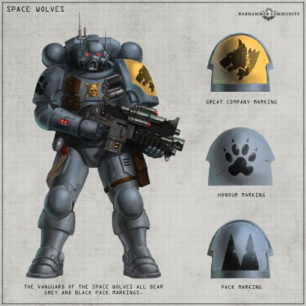
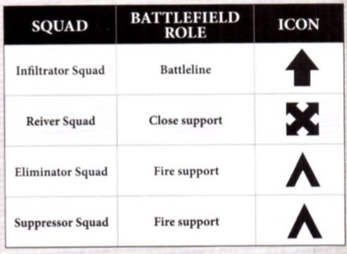

# 0223 先锋星际战士 Vanguard Space Marines

精校状态：中文行文已逐段精校，部分术语仍为暂定

分类：通用概念 / 帝国 Imperium / 中央政务部 Adeptus Terra / 阿斯塔特修会 Adeptus Astartes

原文来源：https://www.bilibili.com/opus/1036603666998493202

原作者：帝国神选罐头

原文时间：2025年02月22日 10:31

[返回分类目录](目录.md) · [全书目录](../../目录.md)

<!-- A0223-B0001 -->
**英文原文**

Vanguards are Primaris Space Marines that are ruthless killers trained in covert operation. They operate behind enemy lines as saboteurs, assassins, and infiltrators.

<!-- /A0223-B0001 -->

<!-- A0223-B0002 -->

原译文

先锋军是原铸星际战士，他们是经过秘密行动训练的无情杀手。他们作为破坏者、刺客和渗透者在敌后活动。

**校订译文**

先锋星际战士是接受过秘密行动训练的原铸星际战士。他们是冷酷的杀手，以破坏者、刺客和渗透者的身份在敌后行动。

<!-- /A0223-B0002 -->

<!-- A0223-B0003 图片 -->

<!-- A0223-B0004 -->

原译文

Space Wolves Vanguard Space Marine 太空野狼先锋星际战士

**校订译文**

Space Wolves Vanguard Space Marine 太空野狼先锋星际战士

<!-- /A0223-B0004 -->

<!-- A0223-B0005 -->
## Overview 概述

<!-- /A0223-B0005 -->

<!-- A0223-B0006 -->
**英文原文**

Vanguard Space Marines are elite reconnaissance troops trained to operate without support across the deadliest frontiers of the galaxy. Ranging far ahead of the main battleline, they slip deep into hostile territory and prosecute a full-spectrum campaign against the enemy. Every component of the enemy is sabotaged and dismantled: communications are cut off, supplies are demolished, and morale is sapped by psychological terror strikes. When the enemies are on their knees, the Vanguard Space Marines emerge from the shadows to perform the killing strike. Vanguard Space Marines prove no less devastating when fighting in concert with conventional battleline troops.

<!-- /A0223-B0006 -->

<!-- A0223-B0007 -->

原译文

先锋星际战士是经过训练的精英侦察部队，可以在没有支援的情况下穿越银河系最致命的边界。他们在主战线前方很远的地方，深入敌方领土，对敌人发动全方位的战役。敌人的每一个组成部分都被破坏和拆除：通信被切断，物资被摧毁，针对心理的恐怖袭击削弱了士气。当敌人在严峻的状态中时，先锋星际战士从阴影中出现，进行杀戮打击。先锋星际战士在与常规战线部队协同作战时，其破坏力同样强大。

**校订译文**

先锋星际战士是精锐侦察部队，能够在毫无支援的情况下，深入银河系最危险的边疆独立作战。他们远远走在主战线之前，潜入敌境，对敌人发动全方位打击：切断通信，摧毁补给，以恐怖袭击进行心理战，瓦解敌军士气。待敌人濒临崩溃，他们便从阴影中现身，给予致命一击。与常规战线部队协同作战时，先锋星际战士同样威力惊人。

<!-- /A0223-B0007 -->

<!-- A0223-B0008 -->
**英文原文**

First deployed on the designs of Roboute Guilliman during the Indomitus Crusade, each of the "great" Space Marine Chapters now possess their own Vanguard complement. So impressed was Guilliman with the performance of Vanguard troops that he made a number of amendments to the Codex Astartes to better accommodate them into Space Marine ranks. These new amendments see most of the great Chapters typically operating around 100 Vanguard Space Marines attached to the 10th Scout Company. These troops fall under the command of a Captain known as the Master of Reconnaissance, who is in turn supported by two Space Marine Lieutenants that have displayed an aptitude for covert operations. Even chapters that are not codex-compliant, such as the Space Wolves and Black Templars, maintain a standing formation of Vanguard Space Marines.

<!-- /A0223-B0008 -->

<!-- A0223-B0009 -->

原译文

罗伯特·基里曼的设计，首次部署在不屈远征期间，每个“伟大”的星际战士战团现在都拥有自己的先锋部队。基里曼对先锋部队的表现印象深刻，他对阿斯塔特圣典进行了一些修改，以更好地将他们纳入星际战士。这些新的修正案看到，大多数伟大的战团通常在隶属于第10侦察连的大约100名先锋星际战士周围运作。这些部队由一位被称为侦察大师的连长指挥，而侦察大师又得到了两名表现出秘密行动才能的星际战士副官的支持。即使是不符合圣典的战团，如太空野狼和黑色圣堂，也保持着先锋星际战士的常备编队。

**校订译文**

先锋星际战士依照罗保特·基里曼的构想，在不屈远征期间首次投入使用；如今，各大星际战士战团都拥有自己的先锋部队。他们的表现令基里曼深感满意，于是他对《阿斯塔特圣典》作出多项修订，将先锋部队正式纳入战团编制。按照新规定，大多数主要战团在第十侦察连中常设约一百名先锋星际战士，由称为“侦察大师”的连长统率，并配有两名擅长秘密行动的副官协助指挥。即使太空野狼、黑色圣堂等不遵循圣典的战团，也维持着常备先锋部队。

<!-- /A0223-B0009 -->

<!-- A0223-B0010 -->
**英文原文**

In the years since their introduction, Vanguard Space Marines have proven vital in reclaiming worlds lost within the Dark Imperium.

<!-- /A0223-B0010 -->

<!-- A0223-B0011 -->

原译文

自引入以来的几年里，先锋星际战士在夺回黑暗帝国中失去的世界方面发挥了至关重要的作用。

**校订译文**

自投入使用以来，先锋星际战士在收复帝国暗面失陷世界的行动中，发挥了至关重要的作用。

<!-- /A0223-B0011 -->

<!-- A0223-B0012 -->
**英文原文**

Space Marine formations composed entirely of Vanguards are known as Vanguard Spearheads. They have the express goal of stealthy penetrating deep into enemy territory to sabotage supplies, cause mayhem, and assassinate high-priority targets. Vanguard Task Forces are another formation that can be used.

<!-- /A0223-B0012 -->

<!-- A0223-B0013 -->

原译文

完全由先锋军组成的星际战士编队被称为先锋矛头。他们的明确目标是潜入敌方领土深处，破坏补给，制造混乱，暗杀高优先级目标。先锋特遣队是另一种可以使用的编队。

**校订译文**

完全由先锋组成的星际战士部队称为“先锋矛头”。他们的明确任务是秘密深入敌境，破坏补给、制造混乱并刺杀重要目标。另一种可采用的编制是先锋特遣队。

<!-- /A0223-B0013 -->

<!-- A0223-B0014 -->
## Recruitment & Training 招募与训练

<!-- /A0223-B0014 -->

<!-- A0223-B0015 -->
**英文原文**

No matter their role, all Primaris Space Marines are trained and indoctrinated in Vanguard tactics and can don patterns of Mk. X Power Armour. In addition, during their time in a Chapter's Scout Company, all Space Marines are fully trained in using Vanguard armour variants and associated wargear. Battle-Brothers from a Chapter's reserve companies may be temporarily seconded to the Battle Companies as Vanguard Space Marines, taking on the colours and markings of their new company for the duration of their service.

<!-- /A0223-B0015 -->

<!-- A0223-B0016 -->

原译文

无论他们的角色如何，所有原铸星际战士都接受过先锋战术的训练和灌输，可以穿上Mk.X动力盔甲。此外，在一个战团的侦察连服役期间，所有星际战士都接受了使用先锋装甲变体和相关作战装备的全面训练。来自一个战团预备连的战斗兄弟可能会被临时借调到战斗连作为先锋星际战士，在服役期间采用新连的颜色和标记。

**校订译文**

无论担任何种战场职责，所有原铸星际战士都会接受先锋战术训练与思想教导，并能穿用 Mk X 动力甲的各型变体。此外，所有星际战士在战团侦察连服役期间，都会全面学习先锋护甲及配套装备的使用。预备连的战斗兄弟可以临时调往战斗连，以先锋身份服役；在此期间，他们采用所加入连队的涂装和标记。

<!-- /A0223-B0016 -->

<!-- A0223-B0017 图片 -->

<!-- A0223-B0018 -->

原译文

Vanguard Heraldry 先锋纹章

**校订译文**

Vanguard Heraldry 先锋纹章

<!-- /A0223-B0018 -->

<!-- A0223-B0019 -->
**英文原文**

Due to their extended time behind enemy lines, Vanguard Space Marines are drilled heavily in the art of survival and self-sufficiency and have their own corps of medical specialists trained by the Apothecarion.

<!-- /A0223-B0019 -->

<!-- A0223-B0020 -->

原译文

由于他们在敌后的时间很长，先锋星际战士在生存和自给自足方面进行了大量训练，并拥有自己的由药剂师训练的医疗专家队伍。

**校订译文**

由于必须长期在敌后行动，先锋星际战士接受了严格的野外生存与自给训练，并拥有由药剂部培养的专属医疗人员。

<!-- /A0223-B0020 -->

<!-- A0223-B0021 -->
## Equipment 装备

<!-- /A0223-B0021 -->

<!-- A0223-B0022 -->
**英文原文**

Vanguard Space Marines operate a variety of equipment all geared towards stealth and covert operations. They don the stealthy Phobos Pattern or in the case of Suppressor Squads Omnis Pattern variants of the Mk.X Power Armour. They wield specialized weaponry such as Instigator Bolt Carbines, Occulus Bolt Carbines, and Accelerator Autocannons. Other specialized equipment includes Omni-Scramblers and Cameleoline Camo-Cloaks.

<!-- /A0223-B0022 -->

<!-- A0223-B0023 -->

原译文

先锋星际战士使用各种装备，都是为了隐形和秘密行动。他们穿着隐形的福波斯型号，或者在压制者小队的情况下，穿着Mk.X动力盔甲的全知型变体。他们使用专门的武器，如煽动者爆矢卡宾枪、全知者爆矢卡宾枪和加速自动炮。其他专业装备包括全知扰频器和迷彩伪装斗篷。

**校订译文**

先锋星际战士的装备以潜行和秘密行动为核心。他们通常穿用 Mk X 动力甲的恐惧型变体；压制者小队则使用全知型变体。其专用武器包括煽动者爆矢卡宾枪、全知者爆矢卡宾枪和加速自动炮，其他装备还有全频扰频器及变色龙素迷彩斗篷。

**校注：** 恐惧型护甲据 GW09 中文32页/GW10 英文31页角色装备对应；Occulus 与 Omnis 区分，前者暂译目镜，不再一概全知；Cameleoline 为变色龙素材料。

<!-- /A0223-B0023 -->

<!-- A0223-B0024 -->
**英文原文**

Vanguard Spearhead formations are given access to specialized equipment, such as Morbidus Bolts, Saboteur Explosive Packs, Marksman Target-Trackers and the relic Armour Umbral.

<!-- /A0223-B0024 -->

<!-- A0223-B0025 -->

原译文

先锋矛头部队可以使用专业装备，如疫病爆矢、破坏者炸药包、神射手目标追踪器和圣物阴影护甲。

**校订译文**

先锋矛头部队可以使用专业装备，如疫病爆矢、破坏者炸药包、神射手目标追踪器和圣物阴影护甲。

<!-- /A0223-B0025 -->

<!-- A0223-B0026 -->
## Vanguard Troops & Vehicles 先锋部队与载具

<!-- /A0223-B0026 -->

<!-- A0223-B0027 -->

原译文

Vanguard Captain 先锋连长

**校订译文**

Vanguard Captain 先锋连长

<!-- /A0223-B0027 -->

<!-- A0223-B0028 -->

原译文

Vanguard Lieutenant 先锋副官

**校订译文**

Vanguard Lieutenant 先锋副官

<!-- /A0223-B0028 -->

<!-- A0223-B0029 -->

原译文

Vanguard Librarian 先锋智库

**校订译文**

Vanguard Librarian 先锋智库员

<!-- /A0223-B0029 -->

<!-- A0223-B0030 -->

原译文

Vanguard Helix Adept 先锋药剂师

**校订译文**

Vanguard Helix Adept 先锋螺旋医疗员

<!-- /A0223-B0030 -->

<!-- A0223-B0031 -->

原译文

Vanguard Infiltrator 先锋渗透者

**校订译文**

Vanguard Infiltrator 先锋渗透者

<!-- /A0223-B0031 -->

<!-- A0223-B0032 -->

原译文

Vanguard Incursor 先锋入侵者

**校订译文**

Vanguard Incursor 先锋入侵者

<!-- /A0223-B0032 -->

<!-- A0223-B0033 -->

原译文

Vanguard Reiver 先锋掠夺者

**校订译文**

Vanguard Reiver 先锋掠夺者

<!-- /A0223-B0033 -->

<!-- A0223-B0034 -->

原译文

Vanguard Eliminator 先锋歼灭者

**校订译文**

Vanguard Eliminator 先锋歼灭者

<!-- /A0223-B0034 -->

<!-- A0223-B0035 -->

原译文

Vanguard Suppressor 先锋压制者

**校订译文**

Vanguard Suppressor 先锋压制者

<!-- /A0223-B0035 -->

<!-- A0223-B0036 -->

原译文

Impulsor 脉冲战车

**校订译文**

Impulsor 脉冲战车

<!-- /A0223-B0036 -->

<!-- A0223-B0037 -->

原译文

Invictor Tactical Warsuit 不败者战术机甲

**校订译文**

Invictor Tactical Warsuit 不败者战术机甲

<!-- /A0223-B0037 -->

<!-- A0223-B0038 -->
## Chapters known to operate Vanguard Units 已知编有先锋部队的战团

原题：Chapters known to operate Vanguard Units 已知操作先锋部队的战团

<!-- /A0223-B0038 -->

<!-- A0223-B0039 -->

原译文

Ultramarines 极限战士

**校订译文**

Ultramarines 极限战士

<!-- /A0223-B0039 -->

<!-- A0223-B0040 -->

原译文

Dark Angels 黑暗天使

**校订译文**

Dark Angels 黑暗天使

<!-- /A0223-B0040 -->

<!-- A0223-B0041 -->

原译文

White Scars 白色疤痕

**校订译文**

White Scars 白疤

<!-- /A0223-B0041 -->

<!-- A0223-B0042 -->

原译文

Space Wolves 太空野狼

**校订译文**

Space Wolves 太空野狼

<!-- /A0223-B0042 -->

<!-- A0223-B0043 -->

原译文

Imperial Fists 帝国之拳

**校订译文**

Imperial Fists 帝国之拳

<!-- /A0223-B0043 -->

<!-- A0223-B0044 -->

原译文

Blood Angels 圣血天使

**校订译文**

Blood Angels 圣血天使

<!-- /A0223-B0044 -->

<!-- A0223-B0045 -->

原译文

Iron Hands 钢铁之手

**校订译文**

Iron Hands 钢铁之手

<!-- /A0223-B0045 -->

<!-- A0223-B0046 -->

原译文

Salamanders 火蜥蜴

**校订译文**

Salamanders 火蜥蜴

<!-- /A0223-B0046 -->

<!-- A0223-B0047 -->

原译文

Raven Guard 暗鸦守卫

**校订译文**

Raven Guard 暗鸦守卫

<!-- /A0223-B0047 -->

<!-- A0223-B0048 -->

原译文

Black Templars 黑色圣堂

**校订译文**

Black Templars 黑色圣堂

<!-- /A0223-B0048 -->

<!-- A0223-B0049 -->

原译文

Crimson Fists 绯红之拳

**校订译文**

Crimson Fists 绯红之拳

<!-- /A0223-B0049 -->

<!-- A0223-B0050 -->
## Notable Vanguard Space Marines 著名先锋星际战士

<!-- /A0223-B0050 -->

<!-- A0223-B0051 -->

原译文

Captain Acheran 阿切兰连长

**校订译文**

Captain Acheran 阿切兰连长

<!-- /A0223-B0051 -->

本篇核心术语与暂定项

以下列出本篇出现的英文原形及核心术语表用词。同形词可能指不同对象，具体词义以本篇正文和校注为准；单复数、别名和仅见于图注的名称可能尚未列入。完整候选见[术语表](../../术语表/双语术语候选.csv)。

| 英文 | 采用中文 | 状态 |
| --- | --- | --- |
| Space Marines | 星际战士 | 官方已核对 |
| Black Templars | 黑色圣堂 | 官方已核对 |
| Space Wolves | 太空野狼 | 官方已核对 |
| Roboute Guilliman | 罗保特·基里曼 | 官方已核对 |
| Imperium | 帝国 | 暂定·简称 |
| Indomitus | 不屈学派 | 暂定·学派语境 |
| Equipment | 装备 | 编辑用语已统一 |
| Dark Imperium | 黑暗帝国 | 暂定·官方待核 |
| Indomitus Crusade | 不屈远征 | 暂定·官方待核 |
| Marksman | 神射手 | 暂定·官方待核 |
| Phobos | 火卫一 | 暂定·官方待核 |
| Master | 导师（审判庭职衔）／舰务官（舰员职务） | 语境定译·官方待核 |
| Apothecarion | 药剂部 | 暂定·官方待核 |
| Master of Reconnaissance | 侦察大师 | 暂定·官方待核 |
| Saboteur | 破坏专家 | 暂定·官方待核 |
| Power Armour | 动力盔甲 | 暂定·官方待核 |
| Space Marine | 星际战士 | 暂定·官方待核 |
| Chapter | 战团 | 暂定·官方待核 |
| Captain | 连长 | 暂定·官方待核 |
| Scout | 侦察兵 | 暂定·官方待核 |
| Vanguard | 先锋 | 暂定·官方待核 |
| Suppressor | 压制者 | 暂定·官方待核 |
| Codex Astartes | 阿斯塔特圣典 | 暂定·官方待核 |
| Battle Companies | 战斗连队 | 暂定·官方待核 |
| Reserve Companies | 预备连队 | 暂定·官方待核 |
| Scout Company | 侦察连 | 暂定·官方待核 |
| Suppressor Squads | 压制者小队 | 暂定·官方待核 |
| Omni-scramblers | 全频扰频器 | 暂定·官方待核 |
| The Dark | 《黑暗》 | 暂定·官方待核 |
| Cameleoline | 变色龙伪装材料 | 暂定·官方待核 |
| Bolt | 爆矢 | 暂定·官方待核 |
| Morbidus Bolts | 疫病爆矢 | 暂定·官方待核 |

