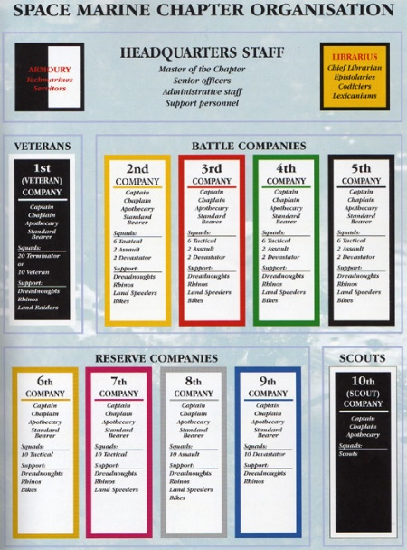

# 0227 星际战士连队 Space Marine Company

精校状态：中文行文已逐段精校，部分术语仍为暂定

分类：通用概念 / 帝国 Imperium / 中央政务部 Adeptus Terra / 阿斯塔特修会 Adeptus Astartes

原文来源：https://www.bilibili.com/opus/1207688969080274964

原作者：帝国神选罐头

原文时间：2026年05月29日 11:30

[返回分类目录](目录.md) · [全书目录](../../目录.md)

<!-- A0227-B0001 -->
**英文原文**

A Space Marine Company is the broadest organisational unit in a Space Marine Chapter.

<!-- /A0227-B0001 -->

<!-- A0227-B0002 -->

原译文

星际战士连队是星际战士战团中最广泛的组织单位。

**校订译文**

连队是星际战士战团下辖的最大一级编制。

<!-- /A0227-B0002 -->

<!-- A0227-B0003 图片 -->

<!-- A0227-B0004 -->

原译文

Pre-Primaris Space Marine Codex Astartes Space Marine Chapter organisational chart 原铸前星际战士阿斯塔特圣典星际战士战团组织图表

**校订译文**

Pre-Primaris Space Marine Codex Astartes Space Marine Chapter organisational chart 原铸出现前，《阿斯塔特圣典》规定的星际战士战团组织图

<!-- /A0227-B0004 -->

<!-- A0227-B0005 -->
## Codex Company 圣典连队

<!-- /A0227-B0005 -->

<!-- A0227-B0006 -->
**英文原文**

Each standard Codex Chapter consists of ten Companies. Each of these Companies is notionally one hundred Marines strong.

<!-- /A0227-B0006 -->

<!-- A0227-B0007 -->

原译文

每个标准圣典战团由十个连队组成。这些连队名义上都有一百名战士。

**校订译文**

每个标准圣典战团由十个连队组成。这些连队名义上都有一百名战士。

<!-- /A0227-B0007 -->

<!-- A0227-B0008 -->
**英文原文**

The 1st Company is made up of the veterans of the Chapter. These include Veteran Squads, Terminator Squads and Terminator Assault Squads. Support for the First Company is Land Raiders and Dreadnoughts.

<!-- /A0227-B0008 -->

<!-- A0227-B0009 -->

原译文

第一连队由战团的老兵组成。这些包括老兵小队、终结者小队和突击终结者小队。对第一连队的支援是兰德掠袭者和无畏。

**校订译文**

第一连由战团老兵组成，编有老兵小队、终结者小队和终结者突击小队，并由兰德掠袭者与无畏机甲提供支援。

<!-- /A0227-B0009 -->

<!-- A0227-B0010 -->
**英文原文**

The 2nd, 3rd, 4th and 5th Companies are known as Battle Companies, as they generally form the main battle force deployed for engagements. All four Companies have the same organisation, split into 6 Battleline Squads which consist of Tactical and Intercessor formations, 2 Close Combat Squads which consist of Assault, Reiver, and Inceptor formations, and 2 Fire Support Squads which consist of Devastator, Hellblaster, or Aggressor formations. Each Battle Company also includes around two Dreadnoughts, and maintains their own motor pool of Rhino and Razorback transports, Land Speeders and Space Marine Bikes.

<!-- /A0227-B0010 -->

<!-- A0227-B0011 -->

原译文

第二、第三、第四和第五连队被称为战斗连队，因为它们通常构成为交战部署的主战部队。所有四个连队都有相同的组织，分为6个战线小队，由战术和仲裁者编队组成，2个近战小队，由突击、掠夺者和先驱者编队组成，以及2个火力支援小队，由毁灭者、地狱爆破者或侵略者编队组成。每个战斗连队还包括大约两名无畏，并拥有自己的犀牛和豪猪运输车、兰德速攻艇和星际战士摩托调度场。

**校订译文**

第二至第五连称为战斗连，通常构成战团出战的主力。这四个连采用相同编制：六个战线小队，由战术小队或仲裁者小队组成；两个近战小队，由突击小队、掠夺者小队或先驱者小队组成；两个火力支援小队，由破坏者小队、地狱轰击者小队或侵略者小队组成。每个战斗连还配有约两台无畏机甲，并拥有自己的犀牛战车、豪猪战车、兰德速攻艇和星际战士摩托车队。

<!-- /A0227-B0011 -->

<!-- A0227-B0012 -->
**英文原文**

The 6th, 7th, 8th and 9th Companies are the Reserve Companies, designed as training and reserve formations, used to bolster the Battle Companies in combat when needed. The 6th and 7th Companies are each comprised entirely of Tactical Squads or Intercessor Squads, and in battle are used to bolster the main battle line, as well as carry out flanking or diversionary attacks. Like Battle Companies, the 6th and 7th include Rhino and Razorback transports, as well as Dreadnoughts. The 6th Company, however, is trained with and equipped to deploy entirely as bike squadrons, while the 7th can do the same on Land Speeders. These forces are held in reserve to be deployed at the discretion of force commanders as tactical situations evolve, often to bolster weak points or aid in breaking through enemy lines at specific locations. The 8th Company is comprised entirely of Assault Squads, Reiver Squads, or Inceptor Squads. and is one of the most mobile forces, used in battle whenever close-quarters fighting is necessary. The 9th Company, meanwhile, is comprised entirely of Devastator Squads and is used as a long-range fire support formation to anchor defensive points. Both the 8th and 9th Companies include Dreadnoughts, Rhinos and Razorbacks, though only the 8th Company is equipped with bikes and Land Speeders.

<!-- /A0227-B0012 -->

<!-- A0227-B0013 -->

原译文

第六、第七、第八和第九连队是预备连队，被设计为训练和预备编队，用于在需要时支援战斗连队。第六和第七连队均完全由战术小队或仲裁者小队组成，在战斗中用于加强主战线，以及进行侧翼或转移注意攻击。与战斗连队一样，第六和第七连队包括犀牛和豪猪运输车，以及无畏。然而，第六连队经过训练并配备了完全作为摩托中队部署的装备，而第七连队可以在兰德速攻艇上做同样的事情。这些部队作为预备役，由部队指挥官根据战术情况的发展自行部署，通常是为了加强薄弱环节或帮助突破特定地点的敌方防线。第八连队完全由突击小队、掠夺者小队或先驱者小队组成。它是最机动的部队之一，在需要近距离战斗时用于战斗。与此同时，第九连队完全由毁灭者小队组成，用作远程火力支援编队，以锚定防御点。第八和第九连队都包括无畏、犀牛和豪猪，尽管只有第八连队配备了摩托和兰德速攻艇。

**校订译文**

第六至第九连为预备连，兼负训练与预备队职责，在必要时增援战斗连。第六和第七连均全部由战术小队或仲裁者小队组成，负责加强主战线，也可实施侧翼攻击或佯攻牵制。两连同样配备犀牛战车、豪猪战车与无畏机甲。此外，第六连经过训练并拥有相应装备，可以全连改以摩托中队出战；第七连则可以全连驾驶兰德速攻艇。这些兵力通常留作预备队，由指挥官依战况投入，补强薄弱环节，或协助突破敌军防线的特定位置。第八连全部由突击小队、掠夺者小队或先驱者小队组成，机动性极强，专门应对需要近身作战的局面。第九连则全部由破坏者小队组成，以远程火力支援巩固防御要点。第八与第九连均配有无畏机甲、犀牛战车和豪猪战车，但只有第八连装备摩托和兰德速攻艇。

<!-- /A0227-B0013 -->

<!-- A0227-B0014 -->
**英文原文**

The 10th Company, or Scout Company, consists entirely of Scouts and is often not entirely one hundred strong as a steady supply of recruits is not possible. They are the most lightly armoured and usually used as a reconnaissance force. They are sometimes mounted on Bikes but do not use Rhino or Razorback transports. The Scout Company will also maintain a force of around 100 Vanguard Space Marines.

<!-- /A0227-B0014 -->

<!-- A0227-B0015 -->

原译文

第十连队或侦察连队完全由侦察兵组成，由于不可能有稳定的新兵供应，因此通常不完全是一百人。他们的盔甲最轻，通常用作侦查部队。它们有时部署在摩托上，但不使用犀牛或豪猪运输车。侦察连队还将维持约100名先锋星际战士。

**校订译文**

第十连又称侦察连，其侦察兵部分由侦察兵组成；由于新兵补充不够稳定，人数往往不足一百。他们装备最轻，通常担负侦察任务，有时骑乘摩托，但不使用犀牛战车或豪猪战车。侦察连此外还常设约一百名先锋星际战士。

**校注：** 英文同时写第十连完全由侦察兵组成，又说附有百名先锋，可能将原铸前后叙述拼接；正文区分侦察兵部分与新增先锋，保留两个数量口径，不视为前后同一百人。

<!-- /A0227-B0015 -->

<!-- A0227-B0016 -->
## Chapter Variations 战团变体

<!-- /A0227-B0016 -->

<!-- A0227-B0017 -->

原译文

The Great Companies of the Space Wolves 太空野狼的大连

**校订译文**

The Great Companies of the Space Wolves 太空野狼的大连

<!-- /A0227-B0017 -->

<!-- A0227-B0018 -->

原译文

The Clans of the Iron Hands 钢铁之手的氏族

**校订译文**

The Clans of the Iron Hands 钢铁之手的氏族

<!-- /A0227-B0018 -->

<!-- A0227-B0019 -->

原译文

The Brotherhoods of the Grey Knights 灰骑士的兄弟会

**校订译文**

The Brotherhoods of the Grey Knights 灰骑士的兄弟会

<!-- /A0227-B0019 -->

<!-- A0227-B0020 -->

原译文

The Brotherhoods of the White Scars 白色疤痕的兄弟会

**校订译文**

The Brotherhoods of the White Scars 白疤的兄弟会

<!-- /A0227-B0020 -->

本篇核心术语与暂定项

以下列出本篇出现的英文原形及核心术语表用词。同形词可能指不同对象，具体词义以本篇正文和校注为准；单复数、别名和仅见于图注的名称可能尚未列入。完整候选见[术语表](../../术语表/双语术语候选.csv)。

| 英文 | 采用中文 | 状态 |
| --- | --- | --- |
| Space Marines | 星际战士 | 官方已核对 |
| Terminator | 终结者 | 官方已核对 |
| Rhino | 犀牛战车 | 官方已核对 |
| Razorback | 豪猪战车 | 官方已核对 |
| Space Marine | 星际战士 | 暂定·官方待核 |
| Chapter | 战团 | 暂定·官方待核 |
| Veteran | 老兵 | 暂定·官方待核 |
| Devastator | 破坏者 | 暂定·官方待核 |
| Aggressor | 侵略者 | 暂定·官方待核 |
| Inceptor | 先驱者 | 暂定·官方待核 |
| Hellblaster | 地狱轰击者 | 暂定·官方待核 |
| Scout | 侦察兵 | 暂定·官方待核 |
| Vanguard | 先锋 | 暂定·官方待核 |
| Reiver | 掠夺者 | 暂定·官方待核 |
| Rhinos | 犀牛 | 暂定·官方待核 |
| Land Speeders | 兰德速攻艇 | 暂定·官方待核 |
| Land Raiders | 兰德掠袭者 | 暂定·官方待核 |
| Tactical Squads | 战术小队 | 暂定·官方待核 |
| Assault Squads | 突击小队 | 暂定·官方待核 |
| Devastator Squads | 破坏者小队 | 暂定·官方待核 |
| Intercessor | 仲裁者 | 暂定·官方待核 |
| Codex Chapter | 圣典战团 | 暂定·官方待核 |
| Space Marine Company | 星际战士连队 | 暂定·官方待核 |
| Battle Companies | 战斗连队 | 暂定·官方待核 |
| Reserve Companies | 预备连队 | 暂定·官方待核 |
| Scout Company | 侦察连 | 暂定·官方待核 |
| Terminator Squads | 终结者小队 | 暂定·官方待核 |
| Terminator Assault Squads | 终结者突击小队 | 暂定·官方待核 |
| Bikes | 摩托 | 暂定·官方待核 |

