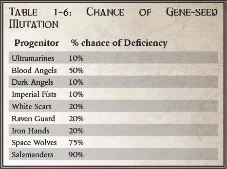

# 0228 基因种子 Gene-seed

精校状态：中文行文已逐段精校，部分术语仍为暂定

分类：通用概念 / 帝国 Imperium / 中央政务部 Adeptus Terra / 阿斯塔特修会 Adeptus Astartes

原文来源：https://www.bilibili.com/opus/1057106505136865286

原作者：帝国神选罐头

原文时间：编辑于 2025年09月09日 19:28

[返回分类目录](目录.md) · [全书目录](../../目录.md)

<!-- A0228-B0001 -->
**英文原文**

Gene-seed is the unique genetic material used to transform a normal human into a super-human Space Marine.

<!-- /A0228-B0001 -->

<!-- A0228-B0002 -->

原译文

基因种子是一种独特的遗传物质，用于将正常人转化为超人星际战士。

**校订译文**

基因种子是一种独特的遗传物质，用于将正常人转化为超人星际战士。

<!-- /A0228-B0002 -->

<!-- A0228-B0003 -->
## Overview 概述

<!-- /A0228-B0003 -->

<!-- A0228-B0004 -->
**英文原文**

It is used to grow the artificial organs that distinguish an Adeptus Astartes from an ordinary human, and helps alter the human's biology to accept the implanted organs. Gene-seed is a Space Marine Chapter's most precious resource, and is conserved by extracting the progenoid glands from fallen Battle-Brothers for return to the Chapter's fortress-monastery.

<!-- /A0228-B0004 -->

<!-- A0228-B0005 -->

原译文

它被用来生长人造器官，将阿斯塔特修会与普通人区分开来，并有助于改变人类的生理以接受植入的器官。基因种子是星际战士战团最宝贵的资源，通过从倒下的战斗兄弟身上提取基因存收腺并返回战团的堡垒修道院来保存。

**校订译文**

基因种子用于培育使阿斯塔特战士区别于普通人的人工器官，也有助于改变受术者的生理，使其能够接受植入物。它是战团最珍贵的资源；药剂师会从阵亡的战斗兄弟体内取出基因存收腺，送回战团的要塞修道院，以延续这一资源。

<!-- /A0228-B0005 -->

<!-- A0228-B0006 图片 -->

<!-- A0228-B0007 -->

原译文

table showing the calculated chances of gene-seed mutation in the First Founding Chapters 表格显示了初次建军战团中基因种子突变的概率

**校订译文**

table showing the calculated chances of gene-seed mutation in the First Founding Chapters 表格显示了初次建军战团中基因种子突变的概率

<!-- /A0228-B0007 -->

<!-- A0228-B0008 -->
**英文原文**

Several Chapters have unique gene-seed flaws that cause differences in their Marines' physiology and behavior. These differences can be merely cosmetic (for instance, all Death Spectres are albinos), while others can have drastic effects that are either a blessing or a curse (or both) for their Chapters, such as the Blood Angels or the Space Wolves.

<!-- /A0228-B0008 -->

<!-- A0228-B0009 -->

原译文

几个战团有独特的基因种子缺陷，导致星际战士的生理和行为存在差异。这些差异可能只是表面的（例如，所有死亡幽灵都是白化病患者），而其他差异可能会对他们的战团产生巨大的影响，要么是祝福，要么是诅咒（或两者兼而有之），比如圣血天使或太空野狼。

**校订译文**

几个战团有独特的基因种子缺陷，导致星际战士的生理和行为存在差异。这些差异可能只是表面的（例如，所有死亡幽灵都是白化病患者），而其他差异可能会对他们的战团产生巨大的影响，要么是祝福，要么是诅咒（或两者兼而有之），比如圣血天使或太空野狼。

<!-- /A0228-B0009 -->

<!-- A0228-B0010 -->
**英文原文**

Some Chapters' gene-seed are inherently more stable than others, and variations in certain Chapters' methods of implantation have resulted in further degradation in some cases. The gene-seed of the Ultramarines is considered the most stable and thus they are the most preferred source of gene-seed for creating new Space Marine Chapters.

<!-- /A0228-B0010 -->

<!-- A0228-B0011 -->

原译文

某些战团的基因种子本质上比其他战团更稳定，某些战团的植入方法的变化在某些情况下导致了进一步的退化。极限战士的基因种子被认为是最稳定的，因此它们是创建新的星际战士战团的首选基因种子来源。

**校订译文**

有些战团的基因种子天生更为稳定。不同战团采用的植入方法也存在差异，其中一些做法会使基因种子进一步退化。极限战士的基因种子被认为最稳定，因此在创建新战团时最受青睐。

<!-- /A0228-B0011 -->

<!-- A0228-B0012 -->
**英文原文**

Geneseed is able to be stored through the use of Methalon Hyper-Freeze, preserving it for future use. When gene-seed and harvested progenoid glands are typically transported in armoured geneseed flasks. A sizable transport container of these is often referred to as a Genovault. One example of a genovault would be a methalon casket held aloft by suspensor fields which contains racks of armoured geneseed flasks. Other names for geneseed carrying containers include genecasque.

<!-- /A0228-B0012 -->

<!-- A0228-B0013 -->

原译文

基因种子可以通过使用梅沙龙超级冷冻液进行储存，以备将来使用。当基因种子和收获的基因存收腺通常在基因种子装甲瓶中运输时。一个相当大的运输箱通常被称为基因种子库。基因库的一个例子是一个由悬吊杆支撑的梅沙龙液体箱，里面有一排排基因种子装甲瓶。携带基因种子的容器的其他名称包括基因之盔。

**校订译文**

基因种子可以采用梅沙龙超低温冷冻法长期保存，以备日后使用。基因种子及收获的基因存收腺通常装在装甲保护瓶中运输。较大型的运输容器常称为基因库：例如，一只由悬浮力场托举的梅沙龙冷冻匣，内部设有成排的基因种子装甲保护瓶。此类容器还有基因匣等名称。

**校注：** 英文首句后 When 为残留语法错误；悬浮力场 suspensor fields 并非悬吊杆。Methalon Hyper-Freeze 暂作为冷冻技术译名，原文没有充分说明其必为液体。

<!-- /A0228-B0013 -->

<!-- A0228-B0014 -->
## History 历史

<!-- /A0228-B0014 -->

<!-- A0228-B0015 -->
### Origins 起源

<!-- /A0228-B0015 -->

<!-- A0228-B0016 -->
**英文原文**

Even before the Emperor had unified Terra, His armies included genetically altered warriors, the Custodes and the Thunder Warriors. Although these soldiers were more powerful than the later Space Marines, they were fewer in number and had a shorter lifespan. It was during this period that the techniques for restructuring genetic codes were perfected. Individual germ-cells, called gene-seeds, were isolated and genetically modified, eventually being used to create specific organs that could be implanted into a warrior. The Emperor was aided by his Terran geneticist cadres, known as the Biotechnical Division.

<!-- /A0228-B0016 -->

<!-- A0228-B0017 -->

原译文

甚至在帝皇一泰拉之前，他的军队就包括转基因战士、禁军和雷霆战士。尽管这些士兵比后来的星际战士更强大，但他们的数量更少，寿命更短。正是在这一时期，重组遗传密码的技术得到了完善。被称为基因种子的单个生殖细胞被分离出来并进行基因改造，最终被用来制造可以植入战士体内的特定器官。帝皇得到了被称为生物技术部门的人类遗传学家骨干的帮助。

**校订译文**

早在帝皇统一泰拉之前，他的军队中就已存在经基因改造的战士，包括帝皇禁军与雷霆战士。按本段原文，这些战士比后来的星际战士更强大，但数量较少，寿命也较短。重组遗传密码的技术正是在这一时期趋于完善：研究者分离出称为基因种子的单个生殖细胞，进行基因改造，最终用它们培育可植入战士体内的特定器官。协助帝皇的是一批来自泰拉的遗传学家，其机构称为生物技术部。

**校注：** 英文将禁军与雷霆战士一并称为较短寿命，概括疑有问题，暂保留并明确归于原文，不据设定记忆删改。

<!-- /A0228-B0017 -->

<!-- A0228-B0018 -->
**英文原文**

The development of these organs took many centuries and the research was in fact an off-shoot of the aborted Primarch project. The Primarchs were god-like beings whose powers far outstripped even that of a "regular" Space Marine. Samples of genetic tissue were taken from each of the fetal Primarchs and used to create the gene-seed of the original twenty Space Marine Legions. Thus each of the original Legions (and therefore their Successor Chapters) inherited some traits associated with their specific Primarch.

<!-- /A0228-B0018 -->

<!-- A0228-B0019 -->

原译文

这些器官的发展花了几个世纪的时间，这项研究实际上是流产的原体项目的一个分支。原体是神一样的生物，他们的力量甚至远远超过了“普通”星际战士。从每位原体胚胎身上采集遗传组织样本，并用于创建最初二十只星际战士军团的基因种子。因此，每个最初的军团（以及他们的子战团）都继承了与他们的特定原体相关的一些特征。

**校订译文**

这些器官的研发历经数个世纪，实际上是中止后的原体计划所衍生出的研究成果。原体是近乎神明的存在，力量远超普通星际战士。研究者从二十位尚处于胚胎阶段的原体身上取得遗传组织样本，培育出最初二十个星际战士军团的基因种子。因此，各军团及其后来的子战团，都继承了各自原体的部分特征。

<!-- /A0228-B0019 -->

<!-- A0228-B0020 -->
**英文原文**

While the original gene-seed was created by the Emperor and His scientists, it was only mass-produced after the conquest of the advanced genetic cults of Luna.

<!-- /A0228-B0020 -->

<!-- A0228-B0021 -->

原译文

虽然最初的基因种子是由帝皇和他的科学家创造的，但它是在征服了月球的先进基因教派之后才大规模生产的。

**校订译文**

虽然最初的基因种子是由帝皇和他的科学家创造的，但它是在征服了月球的先进基因教派之后才大规模生产的。

<!-- /A0228-B0021 -->

<!-- A0228-B0022 -->
### Post-Heresy 叛乱后

<!-- /A0228-B0022 -->

<!-- A0228-B0023 -->
**英文原文**

The events of the Horus Heresy revealed weaknesses in some Legions' gene-seed. In some cases these defects had been heightened by the accelerated cultivation techniques used to keep the Legions at full strength. After the Heresy and the break-up of the original Legions, genetic banks were established on Terra to produce and store Space Marine gene-seed. These banks were to provide all genetic material for new Space Marine Chapters. To prevent cross-contamination of these genetic stocks, the gene-seed of each individual Legion was isolated, so all new Space Marines would receive gene-seed solely from one specific source. The gene-seed of the Traitor Legions was placed under a time-locked stasis seal (rather than being destroyed as many at the time assumed had happened).

<!-- /A0228-B0023 -->

<!-- A0228-B0024 -->

原译文

荷鲁斯叛乱事件揭示了一些军团基因种子的弱点。在某些情况下，这些缺陷因用于保持军团全力的加速培养技术而加剧。叛乱和原初军团分裂后，在泰拉上建立了基因库，以生产和储存星际战士基因种子。这些库将为新的星际战士战团提供所有基因种子。为了防止这些基因库的交叉污染，每个军团的基因种子都被分离出来，因此所有新的星际战士都将只从一个特定的来源获得基因种子。叛徒军团的基因种子被置于时间锁定的停滞状态下（而不是像当时假设的那样被摧毁）。

**校订译文**

荷鲁斯之乱暴露了部分军团基因种子的缺陷；为维持军团满员而采用的加速培育技术，有时又使这些缺陷进一步恶化。叛乱结束、原有军团被拆分后，泰拉建立了基因库，生产并储存星际战士的基因种子，为新建战团提供全部遗传材料。为防止交叉污染，各军团的基因种子分开储存，使每名新星际战士的植入物都来自同一条明确血脉。叛徒军团的基因种子则被加上时间锁，封存在静滞状态中，并未如当时许多人所想的那样遭到销毁。

<!-- /A0228-B0024 -->

<!-- A0228-B0025 -->
### Subsequent Foundings 后续建军

<!-- /A0228-B0025 -->

<!-- A0228-B0026 -->
**英文原文**

After the Heresy, the Space Marine Legions were divided into smaller Chapters. The genetic materials of some Chapters were considered more pure than others and thus, at the time of the 41st Millennium, over half of the thousand known Chapters are descended from the Ultramarines' genetic stock, either directly or through one of their Second Founding Chapters.

<!-- /A0228-B0026 -->

<!-- A0228-B0027 -->

原译文

叛乱之后，星际战士被分成更小的分支。一些战团的遗传物质被认为比其他战团更纯净，因此，在第41个千年之际，已知的1000个战团中有一半以上是直接或通过其二次建军战团之一从极限战士的基因库中继承而来的。

**校订译文**

叛乱之后，星际战士军团被拆分为较小的战团。有些战团的遗传材料被认为更为纯净；因此，到第四十一千年，约一千个已知战团中超过半数承自极限战士的血脉，或直接源出该军团，或经由其第二次建军子战团延续而来。

<!-- /A0228-B0027 -->

<!-- A0228-B0028 -->
**英文原文**

A Marine's gene-seed may be rendered useless by exposure to high levels of radiation. Also, over time a Chapter's gene-seed may change through genetic mutations, so that specific implants become corrupted, producing new effects in Marines, or becoming useless altogether. A corruption in the Chapter's genetic material can lead to the Chapter's extinction. This is why gene-seed must be constantly monitored for mutations. Each chapter is obliged to tithe 5% of its gene-seed to the Adeptus Mechanicus on Mars. The first purpose for this is that it enables the Adeptus Mechanicus to monitor the health of each Marine Chapter. The second is that it creates a store of preserved gene-seed to be used for funding new Chapters.

<!-- /A0228-B0028 -->

<!-- A0228-B0029 -->

原译文

星际战士的基因种子可能会因暴露在高水平的辐射中而变得无用。此外，随着时间的推移，一个战团的基因种子可能会通过基因突变而改变，从而导致特定的植入物被破坏，在星际战士中产生新的效果，或者完全无用。战团基因种子的腐化可能导致战团的消亡。这就是为什么必须不断监测基因种子的突变。每一战团都有义务将其基因种子的5%捐赠给火星上的机械神教。这样做的第一个目的是，它使机械神教能够监测每个星际战士战团的健康状况。第二，它创建了一个保存的基因种子库，用于资助新的战团。

**校订译文**

高强度辐射可能使星际战士的基因种子失去作用。随着时间推移，遗传突变也可能使某些植入器官发生异常，产生新的效果，乃至彻底失效。遗传材料的败坏甚至可能导致整个战团灭绝，因此必须持续监测基因种子的突变。每个战团都须将其基因种子的 5% 作为税赋上缴火星的机械修会：一方面便于机械修会检查各战团的遗传健康状况，另一方面建立储备，为日后创建新战团提供种源。

<!-- /A0228-B0029 -->

<!-- A0228-B0030 -->
**英文原文**

The creation of the gene-seed to be used for founding a new Chapter is a lengthy process. A single suitable gene-seed is selected and used to create a zygote. Zygotes are then grown in culture and implanted into test-slaves, which must be biologically compatible and free from mutation. Test-slaves are little more than physical mediums for the creation of gene-seed, and as such are bound in experimental capsules, where they remain conscious but are completely immobile. The process begins with a single implanted slave, whose body produces two progenoids. These are implanted within two more slaves, that then produce four progenoids; this process is repeated until 1,000 healthy sets of organs are produced, which takes about 55 years of constant reproduction.

<!-- /A0228-B0030 -->

<!-- A0228-B0031 -->

原译文

创建用于创建新战团的基因种子是一个漫长的过程。选择一个合适的基因种子并用于产生合子。然后，合子在培养基中生长并植入测试奴隶体内，测试奴隶必须具有生物相容性且无突变。测试奴隶只不过是创造基因种子的物理媒介，因此被束缚在实验胶囊中，在那里他们保持意识，但完全不动。这个过程始于一个植入的奴隶，他的身体会产生两个基因存收腺。这些物质被植入另外两个奴隶体内，然后产生四个基因存收腺；重复这个过程，直到产生1000组健康的器官，这需要大约55年的持续培殖。

**校订译文**

培育足够建立新战团的基因种子，是一个漫长的过程。首先选取合适的基因种子，制成合子并加以培养，再植入生理相容且没有突变的试验奴隶体内。这些奴隶只是培育基因种子的宿主，被束缚在实验舱中，意识清醒，却完全无法活动。最初的一名受术者会产生两枚基因存收腺；再用它们培育下一代，植入另外两名奴隶体内，便可收获四枚。如此不断重复，约需五十五年的持续培育，才能得到一千套健康的植入器官。

**校注：** 本篇明确写 1,000 healthy sets of organs，一千套器官；216则写 a healthy set of 1,000 organs，两处英文量词不同，分别忠实保留并标记待核。

<!-- /A0228-B0031 -->

<!-- A0228-B0032 -->
**英文原文**

Per Imperial law, only the Emperor is authorized to decree the founding of a new chapter. In practice, this is done by the High Lords of Terra speaking in his name.

<!-- /A0228-B0032 -->

<!-- A0228-B0033 -->

原译文

根据帝国法律，只有帝皇有权下令建立新的战团。在实际中，这是由泰拉的高领主以他的名义完成的。

**校订译文**

根据帝国法律，只有帝皇有权下令建立新的战团。在实际中，这是由泰拉的高领主以他的名义完成的。

<!-- /A0228-B0033 -->

<!-- A0228-B0034 -->
**英文原文**

The Grey Knights are unusual in that the source of their gene-seed is the Emperor's own, unaltered, genetic code.

<!-- /A0228-B0034 -->

<!-- A0228-B0035 -->

原译文

灰骑士的不同寻常之处在于，他们的基因种子来源于帝皇自己的、未经改变的遗传密码。

**校订译文**

灰骑士的不同寻常之处在于，他们的基因种子来源于帝皇自己的、未经改变的遗传密码。

<!-- /A0228-B0035 -->

<!-- A0228-B0036 -->
**英文原文**

The Twenty First Founding (also known as the Cursed Founding) is notable in that its focus was in perfecting and removing deficiencies in flawed gene-seed. Unfortunately, many of the Chapters created at this time have developed genetic idiosyncrasies, mutations that strain the tolerance of the Inquisition and threaten these Chapters' survival.

<!-- /A0228-B0036 -->

<!-- A0228-B0037 -->

原译文

第二十一次建军（也称为诅咒建军）值得注意的是，它的重点是完善和消除有缺陷的基因种子中的缺陷。不幸的是，此时创建的许多战团都发展出了遗传特质，突变使审判庭的容忍度受到压力，并威胁到这些战团的生存。

**校订译文**

第二十一次建军又称诅咒建军，特别之处在于试图修复并完善存在缺陷的基因种子。然而，许多在这次建军中诞生的战团后来出现了特殊的遗传变异。这些突变不断挑战审判庭的容忍底线，也危及战团自身的存续。

<!-- /A0228-B0037 -->

<!-- A0228-B0038 -->
**英文原文**

The Ultima Founding in M42 saw tens of thousands of new Primaris Space Marines produced thanks to the efforts of Belisarius Cawl, all with the same gene-seed of the Primarchs. Thanks to Cawl's Sangprimus Portum, the gene-seed of the Primaris Marines is closer to that of the original Primarch's than standard versions. This and the three additional implants given to Primaris Marines have made them more genetically stable, enabling gene-seed production at rates not seen since the time of the Emperor.

<!-- /A0228-B0038 -->

<!-- A0228-B0039 -->

原译文

由于贝利撒留·考尔的努力，M42的极限建军看到了数万名新的原铸星际战士，他们都拥有与原体相同的基因种子。多亏了考尔的圣血之栈，原铸战士的基因种子比标准版本更接近原初原图的基因种子。这一点以及为原铸星际战士提供的另外三个植入物使它们在基因上更加稳定，能够以自帝皇时代以来从未见过的速度生产基因种子。

**校订译文**

在 M42 的极限建军中，贝利萨留斯·考尔培育出数万名新的原铸星际战士，所用基因种子同样源自各位原体。借助原血之栈，考尔使原铸的基因种子比传统版本更接近原体本身。再加上三种额外植入物，原铸拥有了更稳定的遗传结构，令基因种子的生产恢复到自帝皇时代以来未曾见过的规模与速度。

**校注：** Sangprimus Portum 统一原血之栈；“原初原图”为错字及误译。极限建军时间在此为M42，而215约999.M41，保留原条目时间口径并待核。

<!-- /A0228-B0039 -->

<!-- A0228-B0040 -->
## Implantation and Reproduction 植入与繁育

原题：Implantation and Reproduction 植入和再现

<!-- /A0228-B0040 -->

<!-- A0228-B0041 -->
**英文原文**

The gene-seed of a Chapter is a precious resource, so it is only given to the most worthy of candidates. Each Chapter has its own traditions and procedures for the selection of recruits, but all are subjected to rigorous testing and genetic screening before the process begins.

<!-- /A0228-B0041 -->

<!-- A0228-B0042 -->

原译文

一个战团的基因种子是一种宝贵的资源，所以它只给最有价值的候选人。每个战团都有自己的新兵选拔传统和程序，但在选拔过程开始之前，所有人都要接受严格的检测和基因筛查。

**校订译文**

基因种子极其珍贵，只会授予最合适的候选人。虽然各战团的募兵传统与选拔程序不同，但所有候选人在开始植入改造前，都必须通过严格测试与基因筛查。

<!-- /A0228-B0042 -->

<!-- A0228-B0043 -->
**英文原文**

During the later stages of the implantation process, a recruit will often serve as a Space Marine Scout.

<!-- /A0228-B0043 -->

<!-- A0228-B0044 -->

原译文

在植入过程的后期阶段，新兵通常会担任星际战士侦察兵。

**校订译文**

在植入过程的后期阶段，新兵通常会担任星际战士侦察兵。

<!-- /A0228-B0044 -->

<!-- A0228-B0045 -->
**英文原文**

Reproduction of gene-seed is possible through the Progenoid glands, implants whose sole purpose is the replication of gene-seed. A mature gland can be removed by an Apothecary and new organs artificially cultured from it. This is the only source for new implants, so a Chapter depends on its Marines to create other Marines. In the battle-mysticism of the Astartes, the gene-seed is regarded spiritually - although a fallen Marine's body is dead, he lives on as gene-seed that returns to the Chapter.

<!-- /A0228-B0045 -->

<!-- A0228-B0046 -->

原译文

基因种子可以通过基因存收腺繁殖，存收腺是一种植入物，其唯一目的是复制基因种子。一个成熟的腺体可以被药剂师切除，并从中人工培养出新的器官。这是新植入物的唯一来源，因此一个战团依靠其战士来创建其他战士。在阿斯塔特的战斗神秘主义中，基因种子被视为精神上的——尽管一个牺牲的星际战士的身体已经死了，但他作为基因种子活着，回到了战团。

**校订译文**

基因种子通过基因存收腺增殖。这种植入器官的唯一职责，就是复制基因种子。药剂师可以取出成熟腺体，再以其中的材料人工培育新的植入器官。这是新植入物的唯一来源，因此战团必须依靠现有战士延续下一代。在阿斯塔特的战斗信仰中，基因种子也具有灵性意义：战士肉身虽已阵亡，却能借由送回战团的基因种子继续存在。

<!-- /A0228-B0046 -->

<!-- A0228-B0047 -->
**英文原文**

Apothecaries remove Progenoids after they have matured or if a Marine has died in combat.

<!-- /A0228-B0047 -->

<!-- A0228-B0048 -->

原译文

药剂师在基因存收腺成熟后或星际战士在战斗中死亡后将其清除。

**校订译文**

药剂师会在基因存收腺成熟后，或战士阵亡后，将腺体取出保存。

<!-- /A0228-B0048 -->

<!-- A0228-B0049 -->
## Organs 器官

<!-- /A0228-B0049 -->

<!-- A0228-B0050 -->
**英文原文**

There are nineteen implanted organs - some of which only work properly (or at all) in the presence of other implants. Therefore the removal, mutation or failure of one organ can affect the precise functioning of the others. Because of this, and the fact that each Chapter's gene-seed belongs to that Chapter alone, different Chapters display different characteristics and use different sets of implants and methods of implantation. Throughout the implantation process the Marine must undergo various forms of conditioning in order for the implanted organs to develop and become part of his physiology.

<!-- /A0228-B0050 -->

<!-- A0228-B0051 -->

原译文

有19个植入的器官，其中一些只有在其他植入物存在的情况下才能正常工作（或根本无法工作）。因此，一个器官的切除、突变或衰竭会影响其他器官的精确功能。正因为如此，以及每个战团的基因种子只属于该战团的事实，不同的战团显示出不同的特征，并使用不同的植入物和植入方法。在整个植入过程中，星际战士必须经历各种形式的调节，以便植入的器官发育并成为其生理的一部分。

**校订译文**

传统星际战士需植入十九种器官，其中一些必须依赖其他植入物，才能正常运作，甚至才会发挥作用。因此，一种器官的缺失、突变或衰竭，都可能影响其他器官。再加上各战团拥有自身独有的基因种子，不同战团会表现出不同特征，采用的植入器官组合与手术方法也有所差异。在整个植入过程中，受术者必须接受多种调理，使器官顺利发育，并融入自身生理系统。

<!-- /A0228-B0051 -->

<!-- A0228-B0052 -->
## Chapters with known gene-seed flaws 已知基因种子缺陷的战团

<!-- /A0228-B0052 -->

<!-- A0228-B0053 -->
**英文原文**

Black Dragons: Bony mutation of the forehead, elbows, and forearms, caused by a malfunctioning Ossmodula zygote.

<!-- /A0228-B0053 -->

<!-- A0228-B0054 -->

原译文

黑龙：前额、肘部和前臂的骨突变，由骨骼强化器官合子功能失调引起。

**校订译文**

黑龙：前额、肘部和前臂的骨突变，由骨骼强化器官合子功能失调引起。

<!-- /A0228-B0054 -->

<!-- A0228-B0055 -->
**英文原文**

Blood Angels: The Black Rage and the Red Thirst, sometimes known collectively as The Flaw.

<!-- /A0228-B0055 -->

<!-- A0228-B0056 -->

原译文

圣血天使：黑怒和血渴，有时统称为缺陷。

**校订译文**

圣血天使：黑怒和血渴，有时统称为缺陷。

<!-- /A0228-B0056 -->

<!-- A0228-B0057 -->
**英文原文**

Blood Drinkers: Thirst for blood, expressed in both drinking rituals and in combat, as a result of an Omophagea mutation.

<!-- /A0228-B0057 -->

<!-- A0228-B0058 -->

原译文

饮血者：由于基因侦测神经突变，在饮血仪式和战斗中都表现出对血液的渴望。

**校订译文**

饮血者：由于基因侦测神经突变，在饮血仪式和战斗中都表现出对血液的渴望。

<!-- /A0228-B0058 -->

<!-- A0228-B0059 -->
**英文原文**

Blood Ravens: Eidetic memory and inability to experience R.E.M. sleep.

<!-- /A0228-B0059 -->

<!-- A0228-B0060 -->

原译文

血鸦：记忆迟钝，无法体验R.E.M.睡眠。

**校订译文**

血鸦：拥有映像记忆，能够清晰记住所见之物，但无法进入快速眼动睡眠。

**校注：** Eidetic memory 为高度精确的映像记忆，原译“记忆迟钝”与原义相反；R.E.M. 补为快速眼动睡眠。

<!-- /A0228-B0060 -->

<!-- A0228-B0061 -->
**英文原文**

Death Spectres: Albinism, as a result of a defective Melanchromic Organ.

<!-- /A0228-B0061 -->

<!-- A0228-B0062 -->

原译文

死亡幽灵：白化病，由色素控制器官缺陷引起。

**校订译文**

死亡幽灵：白化病，由色素控制器官缺陷引起。

<!-- /A0228-B0062 -->

<!-- A0228-B0063 -->
**英文原文**

Excoriators: The Darkness.

<!-- /A0228-B0063 -->

<!-- A0228-B0064 -->

原译文

责难者：黑暗。

**校订译文**

责难者：黑暗。

<!-- /A0228-B0064 -->

<!-- A0228-B0065 -->
**英文原文**

Imperial Fists: Missing Betcher's Gland and Sus-an Membrane.

<!-- /A0228-B0065 -->

<!-- A0228-B0066 -->

原译文

帝国之拳：缺少贝彻腺体和苏安脑膜。

**校订译文**

帝国之拳：缺少贝彻腺体和苏安脑膜。

<!-- /A0228-B0066 -->

<!-- A0228-B0067 -->
**英文原文**

Raven Guard: Missing Mucranoid and Betcher's Gland. Pale skin and dark eyes and hair due to a mutated Melanchromic Organ. The Sable Brand, which is of unclear origin.

<!-- /A0228-B0067 -->

<!-- A0228-B0068 -->

原译文

暗鸦守卫：汗腺改进器官和贝彻腺体缺失。由于色素控制器官突变，皮肤变白，眼睛和头发变黑。黑色烙印，起源不明。

**校订译文**

暗鸦守卫：汗腺改进器官和贝彻腺体缺失。由于色素控制器官突变，皮肤变白，眼睛和头发变黑。黑色烙印，起源不明。

<!-- /A0228-B0068 -->

<!-- A0228-B0069 -->
**英文原文**

Salamanders: Onyx-black skin (and improved tolerance of radiation) and bright red eyes, caused by a malfunctioning Melanchromic Organ together with a reaction to the radiation of their homeworld, Nocturne. Infra-red vision, a greater tolerance of extreme temperature, and a higher level of cellular repair. Organs to blame are not explicitly known, but the relevant organs are the Occulobe, Mucranoid, and Larraman's Organ.

<!-- /A0228-B0069 -->

<!-- A0228-B0070 -->

原译文

火蜥蜴：缟玛瑙黑皮肤（对辐射的耐受性提高）和鲜红的眼睛，是由色素控制器官功能失调以及对家乡夜曲星辐射的反应引起的。红外视觉，对极端温度的耐受性更强，细胞修复水平更高。归咎的器官尚不明确，但相关器官是视觉控制器官、汗腺改进器官和拉瑞曼器官。

**校订译文**

火蜥蜴：色素控制器官的异常，与母星夜曲星的辐射共同作用，使他们拥有缟玛瑙般漆黑的皮肤、鲜红双眼，以及更强的辐射耐受力。他们还具有红外视觉，对极端温度的耐受力更高，细胞修复能力也更强。造成这些后几项特征的具体器官尚不明确，但相关器官包括视觉控制器官、汗腺改进器官和拉瑞曼器官。

<!-- /A0228-B0070 -->

<!-- A0228-B0071 -->
**英文原文**

Space Wolves: Enlarged canine teeth and Mark of the Wulfen (see also Canis Helix).

<!-- /A0228-B0071 -->

<!-- A0228-B0072 -->

原译文

太空野狼：放大的犬齿和狼人印记（另见狼之螺旋）。

**校订译文**

太空野狼：犬齿增大，并可能出现狼人印记（另见狼之螺旋）。

<!-- /A0228-B0072 -->

<!-- A0228-B0073 -->
## Chaos Space Marines 混沌星际战士

<!-- /A0228-B0073 -->

<!-- A0228-B0074 -->
**英文原文**

The renegade Legions and Chapters maintain the process of gene-seed implantation and harvesting, allowing new recruits to be turned into Marines. The specifics of the renegade Marines' methods are unclear, but it is known that Fabius Bile provides recruits for some traitors in return for slaves and other resources.

<!-- /A0228-B0074 -->

<!-- A0228-B0075 -->

原译文

叛变的军团和战团维持着基因种子植入和收获的过程，使新兵能够成为星际战士。叛变星际战士的具体方法尚不清楚，但众所周知，法比乌斯·拜耳为一些叛徒提供新兵，以换取奴隶和其他资源。

**校订译文**

叛变军团和战团仍然植入并收获基因种子，以培养新的星际战士。其具体方法尚不清楚，但已知法比乌斯·拜尔会为部分叛徒提供新兵，换取奴隶及其他资源。

<!-- /A0228-B0075 -->

<!-- A0228-B0076 -->
**英文原文**

Nearly all of the Traitor Legions' gene-seed suffers from some kind of instability, though it is debated in the Imperium whether this is caused by some inherent "rot" that was present before the Horus Heresy, or simply the result of constant exposure to the warp inside the Eye of Terror. Whatever the cause, this instability hampers the Chaos Space Marines' ability to create new Marines. For this reason, the Traitor Legions will sometimes raid the strongholds of Imperial Chapters to steal stable gene-seed, which is a prized resource within the Eye.

<!-- /A0228-B0076 -->

<!-- A0228-B0077 -->

原译文

几乎所有叛徒军团的基因种子都存在某种不稳定性，尽管帝国内部存在争议，这是由荷鲁斯叛乱之前存在的一些固有的“腐化”引起的，还是仅仅是由于持续暴露在恐惧之眼内部的亚空间造成的。无论是什么原因，这种不稳定都阻碍了混沌星际战士创建新战士的能力。因此，叛徒军团有时会突袭帝国战团的据点，窃取稳定的基因种子，这是恐惧之眼内的宝贵资源。

**校订译文**

几乎所有叛徒军团的基因种子都存在某种不稳定性，尽管帝国内部存在争议，这是由荷鲁斯之乱之前存在的一些固有的“腐化”引起的，还是仅仅是由于持续暴露在恐惧之眼内部的亚空间造成的。无论是什么原因，这种不稳定都阻碍了混沌星际战士创建新战士的能力。因此，叛徒军团有时会突袭帝国战团的据点，窃取稳定的基因种子，这是恐惧之眼内的宝贵资源。

<!-- /A0228-B0077 -->

<!-- A0228-B0078 -->
## Primaris Marines 原铸星际战士

<!-- /A0228-B0078 -->

<!-- A0228-B0079 -->
**英文原文**

The new breed of Space Marines, the Primaris, have a greater level of genetic stability than those of their standard cousins. As a result they have avoided many of the severe defects and flaws of Chapters such as the Blood Angels and Space Wolves while retaining their quirks and unique benefits. The Primaris Blood Angels in particular still possess the Red Thirst, but show no signs of the Black Rage. The chance of genetic deviancy for Primaris Marines is a mere 0.001%. In addition they are physically larger and stronger thanks to the Sangprimus Portum, which gives them genetic material more potent than standard Gene-Seed descended from the Primarchs.

<!-- /A0228-B0079 -->

<!-- A0228-B0080 -->

原译文

新一代的星际战士，即原铸，比他们的标准表亲有更高的遗传稳定性。因此，他们避免了圣血天使和太空野狼等战团的许多严重缺陷和瑕疵，同时保留了它们的怪癖和独特优势。尤其是圣血天使，他们仍然有血渴，但没有表现出黑怒的迹象。原铸星际战士的基因变异几率仅为0.001%。此外，由于原血之栈，它们的身体更大更强壮，这使它们的遗传物质比原体的标准基因种子更强大。

**校订译文**

原铸星际战士的遗传稳定性高于传统星际战士，因此在保留特殊遗传特征与优势的同时，避开了圣血天使、太空野狼等战团的许多严重缺陷。本段原文记述，原铸圣血天使仍有血渴，却尚未显现黑怒。原铸的遗传偏差率仅为 0.001%；借助原血之栈，他们所用遗传材料的效能也高于传统的原体衍生基因种子，从而拥有更大的体型和更强的力量。

**校注：** 原文称原铸圣血天使未显现黑怒，属于来源当时的叙述，可能与后期资料不同；保留英文基准并标记版本疑点。

<!-- /A0228-B0080 -->

本篇核心术语与暂定项

以下列出本篇出现的英文原形及核心术语表用词。同形词可能指不同对象，具体词义以本篇正文和校注为准；单复数、别名和仅见于图注的名称可能尚未列入。完整候选见[术语表](../../术语表/双语术语候选.csv)。

| 英文 | 采用中文 | 状态 |
| --- | --- | --- |
| Space Marines | 星际战士 | 官方已核对 |
| Adeptus Astartes | 阿斯塔特修会 | 官方已核对 |
| Blood Angels | 圣血天使 | 官方已核对 |
| Grey Knights | 灰骑士 | 官方已核对 |
| Space Wolves | 太空野狼 | 官方已核对 |
| Adeptus Mechanicus | 机械修会 | 官方已核对 |
| Chaos Space Marines | 混沌星际战士 | 官方已核对 |
| Ultramarines | 极限战士 | 官方已核对 |
| Horus Heresy | 荷鲁斯之乱 | 官方已核对 |
| Warp | 亚空间 | 官方已核对 |
| Inquisition | 审判庭 | 暂定 |
| Imperium | 帝国 | 暂定·简称 |
| Eye of Terror | 恐惧之眼 | 官方已核对 |
| Imperial Fists | 帝国之拳 | 暂定 |
| Blood Ravens | 血鸦 | 暂定 |
| Emperor | 帝皇 | 官方已核对 |
| Primarch | 原体 | 官方已核对 |
| Rigorous | 严峻号 | 暂定·官方待核 |
| Terra | 泰拉 | 暂定·官方待核 |
| Horus | 荷鲁斯 | 暂定·官方待核 |
| High Lords of Terra | 泰拉高领主 | 暂定·官方待核 |
| Thunder Warriors | 雷霆战士 | 暂定·官方待核 |
| Salamanders | 火蜥蜴 | 暂定·官方待核 |
| Mars | 火星 | 暂定·官方待核 |
| Nocturne | 夜曲星 | 暂定·官方待核 |
| Luna | 月球 | 暂定·官方待核 |
| Primarch Project | 原体计划 | 暂定·官方待核 |
| Progenoid glands | 基因存收腺 | 暂定·官方待核 |
| Apothecary | 药剂师 | 官方已核对 |
| Fabius Bile | 法比乌斯·拜尔 | 官方已核对 |
| Biotechnical Division | 生物技术部 | 暂定·官方待核 |
| Belisarius Cawl | 贝利萨留斯·考尔 | 官方已核对 |
| Raven Guard | 暗鸦守卫 | 官方已核 |
| Second Founding | 二次建军 | 暂定·官方待核 |
| The Primarchs | 原体 | 暂定·官方待核 |
| Founding | 建军 | 暂定·官方待核 |
| Space Marine | 星际战士 | 暂定·官方待核 |
| Chapter | 战团 | 暂定·官方待核 |
| Fortress-monastery | 要塞修道院 | 暂定·官方待核 |
| Scout | 侦察兵 | 暂定·官方待核 |
| First Founding | 初次建军 | 暂定·官方待核 |
| Blood Drinkers | 饮血者 | 暂定·官方待核 |
| Excoriators | 责难者 | 暂定·官方待核 |
| Death Spectres | 死亡幽灵 | 暂定·官方待核 |
| Black Dragons | 黑龙 | 暂定·官方待核 |
| Ultima Founding | 极限建军 | 暂定·官方待核 |
| Gene-seed | 基因种子 | 暂定·官方待核 |
| Canis Helix | 狼之螺旋 | 暂定·官方待核 |
| Ossmodula | 骨骼强化器官 | 暂定·官方待核 |
| Larraman's Organ | 拉瑞曼器官 | 暂定·官方待核 |
| Omophagea | 基因侦测神经 | 暂定·官方待核 |
| Occulobe | 视觉控制器官 | 暂定·官方待核 |
| Sus-an Membrane | 苏安脑膜 | 暂定·官方待核 |
| Melanchromic Organ | 色素控制器官 | 暂定·官方待核 |
| Mucranoid | 汗腺改进器官 | 暂定·官方待核 |
| Betcher's Gland | 贝彻腺体 | 暂定·官方待核 |
| Progenoids | 基因存收腺 | 暂定·官方待核 |
| Monitor | 监视者 | 暂定·官方待核 |
| Sangprimus Portum | 原血之栈 | 暂定·官方待核 |
| Methalon Hyper-freeze | 梅沙龙超低温冷冻法 | 暂定·官方待核 |
| genovault | 基因库 | 暂定·官方待核 |
| genecasque | 基因匣 | 暂定·官方待核 |
| Powers | 能天使 | 暂定·官方待核 |
| Wulfen | 狼人 | 官方已核对 |
| Strain | 群系 | 暂定·官方待核 |
| Brand | 布兰德 | 暂定·官方待核 |
| Sable Brand | 黑色烙印 | 暂定·官方待核 |
| Sable | 暗夜星 | 暂定·官方待核 |
| The Blood | 鲜血 | 暂定·官方待核 |
| Corruption | 腐败 | 暂定·官方待核 |
| Suspensor | 悬浮装置 | 暂定·官方待核 |

