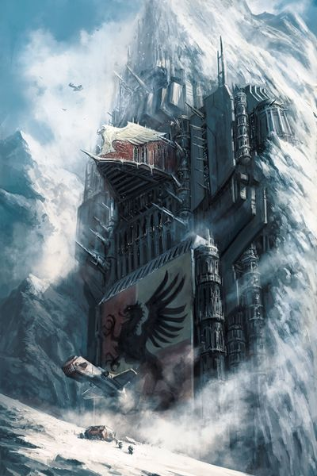
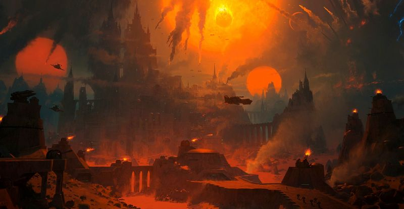
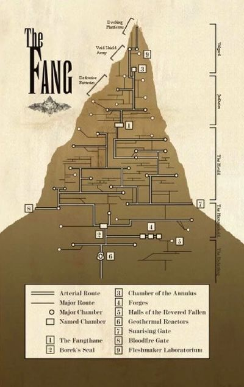

# 0229 堡垒修道院 Fortress-Monasteries

精校状态：中文行文已逐段精校，部分术语仍为暂定

分类：通用概念 / 帝国 Imperium / 中央政务部 Adeptus Terra / 阿斯塔特修会 Adeptus Astartes

原文来源：https://www.bilibili.com/opus/1051474351363194888

原作者：帝国神选罐头

原文时间：编辑于 2025年09月07日 20:19

[返回分类目录](目录.md) · [全书目录](../../目录.md)

<!-- A0229-B0001 -->
**英文原文**

Fortress-Monasteries are enormous fortresses where Space Marine Chapters have their headquarters.

<!-- /A0229-B0001 -->

<!-- A0229-B0002 -->

原译文

堡垒修道院是星际战士战团总部所在的巨大堡垒。

**校订译文**

要塞修道院是星际战士战团总部所在的巨大堡垒。

<!-- /A0229-B0002 -->

<!-- A0229-B0003 图片 -->

<!-- A0229-B0004 -->

原译文

Howling Griffons Fortress-Monastery The Proud Eyrie 咆哮狮鹫堡垒修道院高傲鹰巢

**校订译文**

Howling Griffons Fortress-Monastery The Proud Eyrie 咆哮狮鹫要塞修道院高傲鹰巢

<!-- /A0229-B0004 -->

<!-- A0229-B0005 -->
## Overview 概述

<!-- /A0229-B0005 -->

<!-- A0229-B0006 -->
**英文原文**

Chapters are highly monastic as well as military organizations. As the Space Marines are all warrior-monks in this regard, their fortress-monasteries are devoted both to battle and worship.

<!-- /A0229-B0006 -->

<!-- A0229-B0007 -->

原译文

战团是高度修道院化的军事组织。由于星际战士在这方面都是修道士战士，他们的堡垒修道院既致力于战斗，也致力于礼拜。

**校订译文**

战团既是军事组织，也具有浓厚的修道团体性质。星际战士兼具战士与修士的身份，因此要塞修道院同时承担备战和礼拜的职能。

<!-- /A0229-B0007 -->

<!-- A0229-B0008 图片 -->

<!-- A0229-B0009 -->

原译文

Space Marine Fortress-Monastery 星际战士堡垒修道院

**校订译文**

Space Marine Fortress-Monastery 星际战士要塞修道院

<!-- /A0229-B0009 -->

<!-- A0229-B0010 -->
**英文原文**

Fortress-monasteries are usually based on Imperial worlds, or on deserted moons or asteroids. In the case of fleet-based chapters the chapter flagship serves as a mobile fortress-monastery. The locations of some chapter planets are hidden while others are well-known. The preferred location for a fortress monastery is an Imperial world, which the Chapter Master is sometimes also the planetary governor of. In other cases the Chapter Master will make a deal with the existing planetary governor, paying a tithe in return for the land they occupy. They are usually welcomed by governors, as the presence of Space Marines deters invasion.

<!-- /A0229-B0010 -->

<!-- A0229-B0011 -->

原译文

堡垒修道院通常建在帝国世界，或废弃的卫星或小行星上。在舰基战团的情况下，战团旗舰充当移动堡垒修道院。一些战团行星的位置是隐藏的，而另一些则是众所周知的。堡垒修道院的首选地点是帝国世界，战团长有时也是这个世界的行星总督。在其他情况下，战团长将与现有的行星总督达成协议，支付什一税以换取他们占用的土地。他们通常受到总督的欢迎，因为星际战士的存在可以阻止入侵。

**校订译文**

要塞修道院通常建在帝国世界、荒无人烟的卫星或小行星上。舰基战团则以旗舰充当移动要塞修道院。有些战团世界的位置属于秘密，也有些广为人知。帝国世界是最受青睐的选址，战团长有时还兼任行星总督；若当地已有总督，战团长也可能与其达成协议，缴纳税赋以换取驻地。总督通常欢迎星际战士进驻，因为他们的存在足以威慑入侵者。

<!-- /A0229-B0011 -->

<!-- A0229-B0012 -->
## Typical Structure 典型结构

<!-- /A0229-B0012 -->

<!-- A0229-B0013 -->
**英文原文**

The following is a description of the Space Wolves' fortress-monastery on Fenris:

<!-- /A0229-B0013 -->

<!-- A0229-B0014 -->

原译文

以下是对芬里斯太空野狼堡垒修道院的描述：

**校订译文**

以下是对芬里斯太空野狼要塞修道院的描述：

**校注：** 本节开头称地点为芬里斯，后文动力室、导弹井和大厅却反复称卢坎（Lucan）。所给英文可能混入早期版本材料；两地原称分别保留，不能无证据统一为芬里斯。

<!-- /A0229-B0014 -->

<!-- A0229-B0015 图片 -->

<!-- A0229-B0016 -->

原译文

Interior of the Space Wolves' fortress-monastery 太空野狼堡垒修道院内部

**校订译文**

Interior of the Space Wolves' fortress-monastery 太空野狼要塞修道院内部

<!-- /A0229-B0016 -->

<!-- A0229-B0017 -->
**英文原文**

Company Chapel: The most commonly used place of worship. Every Company has its own chapel located within its Company block. This worship is part of the Marine brethren's regime of discipline.

<!-- /A0229-B0017 -->

<!-- A0229-B0018 -->

原译文

连队礼拜堂：最常用的礼拜场所。每个连队都有自己的教堂，位于连队大楼内。这种崇拜是星际战士兄弟纪律制度的一部分。

**校订译文**

连队礼拜堂：战士最常使用的礼拜场所。每个连都在自己的驻区内设有礼拜堂；参加礼拜也是战斗兄弟纪律生活的一部分。

<!-- /A0229-B0018 -->

<!-- A0229-B0019 -->
**英文原文**

Penitorium: Marine Battle-Brothers guilty of any kind of transgression are held here as a form of remedial and penitent punishment.

<!-- /A0229-B0019 -->

<!-- A0229-B0020 -->

原译文

忏悔室：星际战士战斗兄弟犯下任何罪行都会被关押在这里，作为一种补救和忏悔的惩罚形式。

**校订译文**

忏悔室：犯有各种过失的战斗兄弟会被禁闭于此，接受惩戒、反省与纠正。

<!-- /A0229-B0020 -->

<!-- A0229-B0021 -->
**英文原文**

Private Chambers: These are private offices and rooms used by the various Masters of the Order, including the Master of the Ships, Master of the Forge and Master of Ordnance.

<!-- /A0229-B0021 -->

<!-- A0229-B0022 -->

原译文

私人房间：这些是各修会的大师使用的私人办公室和房间，包括舰船之主、铸造之主和军械之主。

**校订译文**

私人房间：供战团各位职事主管使用的私人办公室和居室，包括舰船之主、铸造大师与军械大师。

<!-- /A0229-B0022 -->

<!-- A0229-B0023 -->
**英文原文**

Communal Dormitories: These contain the living and sleeping chambers of the Chapter's non-combat staff, including servants, technicians and naval personnel.

<!-- /A0229-B0023 -->

<!-- A0229-B0024 -->

原译文

公共宿舍：这些宿舍包括该战团非战斗人员的起居室和卧室，包括侍从、技术人员和海军人员。

**校订译文**

公共宿舍：这些宿舍包括该战团非战斗人员的起居室和卧室，包括侍从、技术人员和海军人员。

<!-- /A0229-B0024 -->

<!-- A0229-B0025 -->
**英文原文**

Guest Chambers: Relatively luxurious chambers reserved for important visitors such as members of the Administratum.

<!-- /A0229-B0025 -->

<!-- A0229-B0026 -->

原译文

客房：为重要访客（如政务部官员）保留的相对豪华的房间。

**校订译文**

客房：为内政部成员等重要访客准备的较为豪华的居室。

<!-- /A0229-B0026 -->

<!-- A0229-B0027 -->
**英文原文**

Foundries:The foundries are where the Marines manufacture and repair their weapons and equipment. The skilled workers of the foundries are known as Brother Artisans. Equipment is evaluated at an adjacent testing and weapon ground.

<!-- /A0229-B0027 -->

<!-- A0229-B0028 -->

原译文

铸造厂：铸造厂是星际战士制造和修理武器和设备的地方。铸造厂的熟练工人被称为工匠兄弟。设备在相邻的测试和武器场地进行评估。

**校订译文**

铸造厂：星际战士制造、修理武器装备的场所，熟练工人称为工匠兄弟。装备会在邻近的测试场和靶场接受检验。

<!-- /A0229-B0028 -->

<!-- A0229-B0029 -->
**英文原文**

Shuttle Silos: The bulk of the Chapters fleet is located in orbit and the only vessels located within the fortress are those required to get to the fleet, mostly including couriers and transport vessels.

<!-- /A0229-B0029 -->

<!-- A0229-B0030 -->

原译文

穿梭机发射井：战团舰队的大部分位于轨道上，堡垒内唯一的船只是那些需要进入舰队的船只，主要包括信使和运输船。

**校订译文**

穿梭机发射井：战团舰队主力停泊在轨道上，因此堡垒内只保留往返舰队所需的小型舰艇，主要是通信艇与运输艇。

<!-- /A0229-B0030 -->

<!-- A0229-B0031 -->
**英文原文**

Teleportorium: These teleporter rooms are spread throughout the base in four places and are the primary means of moving between the fortress and the fleet. Teleportorium One is used to receive guests.

<!-- /A0229-B0031 -->

<!-- A0229-B0032 -->

原译文

传送室：这些传送室分布在基地的四个地方，是堡垒和舰队之间移动的主要手段。一号传送室用于接待客人。

**校订译文**

传送室：这些传送室分布在基地的四个地方，是堡垒和舰队之间移动的主要手段。一号传送室用于接待客人。

<!-- /A0229-B0032 -->

<!-- A0229-B0033 -->
**英文原文**

Launcher Pads: Twenty four aircraft are housed in underground hangers beneath the launcher pads, including four large transports and eight high speed scouts.

<!-- /A0229-B0033 -->

<!-- A0229-B0034 -->

原译文

发射台：24架飞机被安置在发射台下方的地下机库中，其中包括4架大型运输机和8架高速侦察机。

**校订译文**

发射台：24架飞机被安置在发射台下方的地下机库中，其中包括4架大型运输机和8架高速侦察机。

<!-- /A0229-B0034 -->

<!-- A0229-B0035 -->
**英文原文**

Armoury: A large but crowded underground complex used to store ammunition and weaponry. The security for the whole complex falls to the Master of Ordnance and each armoury may only be entered in his presence, the doors requiring his gene-print and coded signal. In an emergency the Chapter Commander may override this with a secret spoken code.

<!-- /A0229-B0035 -->

<!-- A0229-B0036 -->

原译文

军械库：一个大型但拥挤的地下建筑群，用于储存弹药和武器。整个建筑群的安全由军械之主负责，每个军械库只能在他在场的情况下进入，门需要他的基因印记和编码信号。在紧急情况下，战团指挥官可以用秘密语音代码来覆盖这一点。

**校订译文**

军械库：规模庞大但空间拥挤的地下设施，用于储存武器弹药。军械大师负责其整体安保；各库室只能在他在场时进入，大门需要读取他的基因印记并接收编码信号才能开启。紧急情况下，战团指挥官可以使用秘密口令越过这套限制。

<!-- /A0229-B0036 -->

<!-- A0229-B0037 -->
**英文原文**

Apothecarion: An advanced medical facility, used as a hospital, for research and as a bio-lab. This is where warriors are surgically transformed into superhuman Marines. The skilled medical staff have private quarters above the Apothacarion, while the servants and nurses share a dormitory on a lower level.

<!-- /A0229-B0037 -->

<!-- A0229-B0038 -->

原译文

药剂部：一种先进的医疗场所，用作医院、研究和生物实验室。在这里，战士们被手术改造成超人般的星际战士。熟练的医务人员在药剂部楼上有私人宿舍，而侍从和护士在较低的楼层共用宿舍。

**校订译文**

药剂部：一种先进的医疗场所，用作医院、研究和生物实验室。在这里，战士们被手术改造成超人般的星际战士。熟练的医务人员在药剂部楼上有私人宿舍，而侍从和护士在较低的楼层共用宿舍。

<!-- /A0229-B0038 -->

<!-- A0229-B0039 -->
**英文原文**

Assimularum: This is the largest room in the complex besides the Great Hall. It is a vast and high vaulted room, in which the entire chapter can be gathered. It is used for mass meetings, ceremonies, religious festivals and special feasts.

<!-- /A0229-B0039 -->

<!-- A0229-B0040 -->

原译文

同信堂：这是除了大厅之外，建筑群中最大的房间。这是一个高大的拱形房间，可以容纳整个战团。它用于集会、仪式、宗教节日和特殊节日。

**校订译文**

同信堂：除大厅外，整个建筑群中最大的房间，拥有高耸的拱顶，足以容纳全战团。这里用于大型集会、典礼、宗教节庆和特别宴会。

<!-- /A0229-B0040 -->

<!-- A0229-B0041 -->
**英文原文**

Reclusiam: The Reclusiam is usually partitioned from the Assimularum by a screen, and is used only for cult activities. It is looked after by a religious officer known as a Reclusiarch and the chapter's holy relics and many of their most precious battle trophies are kept here. The Reclusiarch has an office off to one side, and there are three private chapels dedicated to Leman Russ, The Emperor Deified and The Emperor Oracular.

<!-- /A0229-B0041 -->

<!-- A0229-B0042 -->

原译文

隐修室：隐修室通常由屏障与同信堂隔开，仅用于宗教活动。它由一位被称为隐修长的宗教官员照顾，该战团的圣物和许多最珍贵的战斗战利品都保存在这里。隐修室一侧有一间办公室，有三间私人教堂，分别供奉黎曼·鲁斯、升天帝皇和神皇。

**校订译文**

隐修室：通常以一道屏障与同信堂隔开，专供教派活动使用，由称为隐修长的宗教官员管理。战团圣物及许多最珍贵的战利品保存在此。隐修长的办公室位于一侧；这里还有三座私人礼拜堂，分别奉祀黎曼·鲁斯、神格化的帝皇，以及降示神谕的帝皇。

**校注：** The Emperor Deified 与 The Emperor Oracular 是两个礼拜对象称号，分别按神格化与神谕义译出，不将两者混为笼统神皇。

<!-- /A0229-B0042 -->

<!-- A0229-B0043 -->
**英文原文**

Refectory: This area is for the main dining procedures and includes kitchens, store-rooms, disposal units and purification vats. The strict and simple diet of the fighting warriors are augmented by a complex bio-chem designed to maintain their superior bodies. Meals are eaten in silence following prayers of thanks by the most senior brother present.

<!-- /A0229-B0043 -->

<!-- A0229-B0044 -->

原译文

食堂：该区域用于主要用餐程序，包括厨房、储藏室、处理装置和净化桶。战斗的战士们严格而简单的饮食，辅以一种复杂的生化物质，旨在保持他们优越的身体。在出席的最年长的兄弟祈祷感谢后，人们默默地吃着饭。

**校订译文**

食堂：主要用餐区，包括厨房、储藏室、废物处理装置和净化槽。战士的饮食严格而简朴，并辅以复杂的生化补剂，以维持超常体魄。用餐前由在场资历最高的兄弟领诵感恩祷词，随后所有人静默进食。

<!-- /A0229-B0044 -->

<!-- A0229-B0045 -->
**英文原文**

Oratorium: There are several Oratorium spread throughout the base and are used for private meetings, lectures, briefings and small assemblies.

<!-- /A0229-B0045 -->

<!-- A0229-B0046 -->

原译文

演讲厅：整个基地有几个演讲厅，用于私人会议、讲座、简报会和小型集会。

**校订译文**

演讲厅：整个基地有几个演讲厅，用于私人会议、讲座、简报会和小型集会。

<!-- /A0229-B0046 -->

<!-- A0229-B0047 -->
**英文原文**

Librarium: The Librarium is more than a collection of books as it also acts as the central repository of records and the main seat of communications. The chapter's astropaths spend most of their time here, monitoring and broadcasting messages from the base. The Chief Librarian is in overall command of the written histories and communications within and without the base as well as the base defences. These defences are controlled from an armoured room in the Librarium. Based within this room are also the Communications Officers and a number of librarians, astropaths and technical assistants.

<!-- /A0229-B0047 -->

<!-- A0229-B0048 -->

原译文

智库：智库不仅仅是书籍的收藏，它还是记录的中央存储库和交流的主要场所。该战团的星语者大部分时间都在这里，监测和广播基地的信息。首席智库全面负责基地内外的书面历史和通信以及基地防御。这些防御是从智库的一个装甲房间控制的。在这个房间里还有通信官员和一些智库、星语者和技术助理。

**校订译文**

智库馆：既收藏书籍，也是战团档案的集中保管处和主要通信中心。战团星语者大部分时间都在这里，接收并传送基地的消息。首席智库员统管历史档案、内外通信及基地防御。防御系统由馆内一间装甲控制室操纵，通信军官、若干智库员、星语者及技术助手也驻于其中。

<!-- /A0229-B0048 -->

<!-- A0229-B0049 -->
**英文原文**

Cells: A cell is given to a brother to live in. They are arranged in blocks of ten, directly related to the members of a fighting squad with each of the ten blocks representing a company. Each block has a small administrative office and the private chambers of the captain.

<!-- /A0229-B0049 -->

<!-- A0229-B0050 -->

原译文

舱室：一个舱室交给一个兄弟居住。它们以十个为一组，与战斗小队的成员直接相关，每十个块代表一个连队。每个块都有一个小型行政办公室和队长的私人房间。

**校订译文**

修士居室：每名战斗兄弟拥有一间单人居室。居室按十间一组排列，对应一个战斗小队；各组再按连队划入住宿区。每个住宿区都设有小型行政办公室和连长的私人居室。

**校注：** 英文对 blocks 的层级指代含混，似将十人居室组和连队住宿区混用；中文按小队组／连队区整理，不额外给出原文无法明确支持的住宿区总数。

<!-- /A0229-B0050 -->

<!-- A0229-B0051 -->
**英文原文**

Hydro-culture: This area contains a supply of local produce and exotic or seasonal vegetables collected and grown for the benefit of the chapter. Other chapters often maintain much larger facilities than the Space Wolves however.

<!-- /A0229-B0051 -->

<!-- A0229-B0052 -->

原译文

水培室：该地区供应当地农产品和为本战团利益而收集和种植的奇异或季节性蔬菜。然而，其他战团通常拥有比太空野狼更大的设施。

**校订译文**

水培室：种植当地作物，以及为战团搜集的外来或时令蔬菜，提供食物补给。其他战团的同类设施通常比太空野狼的大得多。

<!-- /A0229-B0052 -->

<!-- A0229-B0053 -->
**英文原文**

Terrarium: This space is dedicated to the maintenance and propagation of plants from throughout the galaxy. It provides both a restful area and a source for some of the drugs used in the Apothacarion.

<!-- /A0229-B0053 -->

<!-- A0229-B0054 -->

原译文

生物养育室：这个空间专门用于维护和繁殖来自整个星系的植物。它既提供了一个休息区，又为药剂部使用的一些药物提供了来源。

**校订译文**

植物培育室：专门养护和繁育来自银河各地的植物，既供人休憩，也为药剂部提供部分药物的原料。

<!-- /A0229-B0054 -->

<!-- A0229-B0055 -->
**英文原文**

Scriptory: There are several Scriptories spread around the base and they provide instant access to unclassified Librarium files. These are accessed through a computer terminal and allows users to select, consult and record new entries for the main library.

<!-- /A0229-B0055 -->

<!-- A0229-B0056 -->

原译文

抄写室：有几个抄写室分布在基地周围，它们提供对非机密智库文件的即时访问。这些可以通过计算机终端访问，并允许使用者选择、查阅和记录主图书馆的新条目。

**校订译文**

抄写室：分布在基地各处，可通过计算机终端即时访问智库馆的非机密档案。使用者能够检索、查阅，并向中央馆藏录入新条目。

<!-- /A0229-B0056 -->

<!-- A0229-B0057 -->
**英文原文**

Solitorium: The Solitorium is a remote location (outside the fortress) designed to provide brothers with a space for contemplation. It can be occupied for anything from a few days to years on end. Marines who seek promotion are expected to search their souls and go through self-deprivation for weeks on end to prove their worth.

<!-- /A0229-B0057 -->

<!-- A0229-B0058 -->

原译文

冥想室：冥想室是一个偏远的地方（堡垒外），旨在为兄弟们提供一个沉思的空间。它可以被占用几天到几年不等。寻求晋升的战士们预计会寻找自己的灵魂，并连续数周自我剥夺，以证明自己的价值。

**校订译文**

冥想室：位于堡垒外的僻静处，为战斗兄弟提供独自沉思的空间。修士可在此停留数日，甚至数年。谋求晋升的战士须连续数周反省内心、克制自身需求，以证明自己的资格。

<!-- /A0229-B0058 -->

<!-- A0229-B0059 -->
**英文原文**

Dungeon: The Dungeons lie deep beneath the Apothecarion and are home to the common prisoners, but not brothers who would be placed in the Penitorium. The walls are lined with reinforced diamantine although prisoners don't spend long in the dungeons before being taken to the Apothacarion for interrogation.

<!-- /A0229-B0059 -->

<!-- A0229-B0060 -->

原译文

地牢：地牢位于药剂部地下深处，是普通囚犯的家园，但不是被关押在监狱的兄弟。墙壁上排列着加固的精金，尽管囚犯在被带到药剂部接受审问之前不会在地牢里呆太久。

**校订译文**

地牢：位于药剂部地下深处，关押普通囚犯；犯错的战斗兄弟则送往忏悔室。地牢墙壁衬有强化金刚石。不过，囚犯通常不会久留，很快便会被带往药剂部接受审讯。

**校注：** diamantine 为金刚石类材质，不是 adamantium 精金。

<!-- /A0229-B0060 -->

<!-- A0229-B0061 -->
**英文原文**

Generatorum: The power source for the fortress-monastery on Lucan is a group of four huge crystal-piles which penetrate the surface of the planet and convert underground heat into energy via a phased crystal interface (presumably there are many other ways of generating energy on this scale, this is but one example of the possibilities).

<!-- /A0229-B0061 -->

<!-- A0229-B0062 -->

原译文

发电机：卢坎上堡垒修道院的电源是一组四个巨大的晶体堆，它们穿透星球表面，通过相控晶体界面将地热转化为能量（可能还有许多其他方式在这种程度上产生能量，这只是可能性的一个例子）。

**校订译文**

动力室：卢坎上的要塞修道院由四座巨型晶体堆供能。晶体堆深入地表以下，通过相控晶体界面将地热转化为可用能源。这只是该规模供能方式的一个例子，其他堡垒还可能采用不同方法。

<!-- /A0229-B0062 -->

<!-- A0229-B0063 -->
**英文原文**

Defence Laser: These lasers are mounted in armoured turrets and thirty two of them remain permanently switched on. The other eighty eight may be brought to bear within four days of activation.

<!-- /A0229-B0063 -->

<!-- A0229-B0064 -->

原译文

防御激光：这些激光安装在装甲炮塔中，其中32个激光始终处于开启状态。另外88个激光可能会在激活后四天内投入使用。

**校订译文**

防御激光炮：安装在装甲炮塔中，其中三十二门长期保持启动状态；其余八十八门可在接到启用指令后的四天内投入作战。

<!-- /A0229-B0064 -->

<!-- A0229-B0065 -->
**英文原文**

Local Defences: The perimeter of the base is covered by 317 separate weapons turrets including four laser cannons and a missile launcher in each.

<!-- /A0229-B0065 -->

<!-- A0229-B0066 -->

原译文

局部防御：基地周围有317个独立的武器炮塔，每个炮塔包括四门激光炮和一个导弹发射器。

**校订译文**

局部防御：基地周围有317个独立的武器炮塔，每个炮塔包括四门激光炮和一个导弹发射器。

<!-- /A0229-B0066 -->

<!-- A0229-B0067 -->
**英文原文**

Missile Silos: Over 400 Missile Silos are spread over Lucan and are the main force of the Space Wolves' ground to orbit weapons. They are each controlled from the armoured room within the Librarium.

<!-- /A0229-B0067 -->

<!-- A0229-B0068 -->

原译文

导弹发射井：400多个导弹发射井分布在卢坎，是太空野狼地对地轨道武器的主力。它们都由智库内的装甲房间控制。

**校订译文**

导弹发射井：卢坎各处分布着四百多座发射井，是太空野狼对轨道攻击火力的主力。它们均由智库馆内的装甲控制室操纵。

<!-- /A0229-B0068 -->

<!-- A0229-B0069 -->
**英文原文**

Catacombs: The catacombs are the burial place for the Space Wolves and are home to many ancient heroes of the chapter.

<!-- /A0229-B0069 -->

<!-- A0229-B0070 -->

原译文

地下墓穴：地下墓穴是太空野狼的埋葬地，也是本战团许多古代英雄的家园。

**校订译文**

地下墓穴：地下墓穴是太空野狼的埋葬地，也是本战团许多古代英雄的家园。

<!-- /A0229-B0070 -->

<!-- A0229-B0071 -->
**英文原文**

Great Hall: The Great Hall is the first room you come to when entering the base. It is designed to awe the visiting guests and is the largest single room on the planet (Lucan). It contains many of the battle trophies of the Space Wolves and paintings of famous battles are displayed on the walls. Ancient weaponry and armour from as far back as the Horus Heresy are on display behind plexi-glass. The spacecraft Medusa, flown by Leman Russ himself, hangs from the ceiling of the room and spans its entire length.

<!-- /A0229-B0071 -->

<!-- A0229-B0072 -->

原译文

大厅：大厅是你进入基地的第一个房间。它的设计是为了让来访的客人感到敬畏，是星球上最大的单独房间（卢坎）。它包含许多太空野狼的战斗奖杯，墙上还展示着著名战斗的画作。在有机玻璃后面展示着早在荷鲁斯叛乱时期就有的古代武器和盔甲。黎曼·鲁斯亲自驾驶的飞机美杜莎号悬挂在房间的天花板上，横跨整个房间。

**校订译文**

大厅：进入基地后首先抵达的房间，也是卢坎最大的单一室内空间，意在令来访者心生敬畏。这里陈列着太空野狼的众多战利品，墙上悬挂著名战役的画作，透明有机玻璃后展示着最早可追溯至荷鲁斯之乱时期的古老武器与护甲。黎曼·鲁斯曾亲自驾驶的美杜莎号航天器悬挂于天花板下，几乎贯穿整个大厅。

<!-- /A0229-B0072 -->

<!-- A0229-B0073 -->
**英文原文**

Barbican: The Barbican is the massive gate house that leads into the Great Hall. This has a permanent guard to receive guests from overland, air and orbit.

<!-- /A0229-B0073 -->

<!-- A0229-B0074 -->

原译文

望楼：望楼是通往大厅的巨大门房。这有一个永恒守卫来接待来自陆地、空中和轨道的客人。

**校订译文**

瓮城：通往大厅的巨大门楼，常年设有守卫，接待从陆地、空中或轨道抵达的访客。

<!-- /A0229-B0074 -->

<!-- A0229-B0075 -->
**英文原文**

Crypts: Sacred chambers where fallen battle-brothers are laid to rest.

<!-- /A0229-B0075 -->

<!-- A0229-B0076 -->

原译文

墓穴：神圣的房间，倒下的战斗兄弟安息于此。

**校订译文**

墓穴：神圣的房间，倒下的战斗兄弟安息于此。

<!-- /A0229-B0076 -->

<!-- A0229-B0077 -->
## Notable Fortress-Monasteries 著名要塞修道院

原题：Notable Fortress-Monasteries 著名堡垒修道院

<!-- /A0229-B0077 -->

<!-- A0229-B0078 -->
**英文原文**

Blood Angels-Arx Angelicum-Assaulted by the Tyranids of Hive Fleet Leviathan during the Devastation of Baal.

<!-- /A0229-B0078 -->

<!-- A0229-B0079 -->

原译文

圣血天使-天使堡-在巴尔毁灭期间被虫巢舰队利维坦的tail袭击。

**校订译文**

圣血天使——天使堡；巴尔毁灭期间遭到利维坦虫巢舰队的泰伦虫族攻击。

<!-- /A0229-B0079 -->

<!-- A0229-B0080 -->
**英文原文**

Blood Ravens-Omnis Arcanum-Battle Barge.

<!-- /A0229-B0080 -->

<!-- A0229-B0081 -->

原译文

血鸦-全知奥秘-战斗驳船

**校订译文**

血鸦-全知奥秘-战斗驳船

<!-- /A0229-B0081 -->

<!-- A0229-B0082 -->
**英文原文**

Crimson Fists-Arx Tyrannus

<!-- /A0229-B0082 -->

<!-- A0229-B0083 -->

原译文

绯红之拳-暴君堡

**校订译文**

绯红之拳-暴君堡

<!-- /A0229-B0083 -->

<!-- A0229-B0084 -->
**英文原文**

Dark Angels-The Rock-Spaceborne vessel constructed from the largest surviving piece of their destroyed homeworld, Caliban.

<!-- /A0229-B0084 -->

<!-- A0229-B0085 -->

原译文

黑暗天使-巨石-由他们被摧毁的家园世界卡利班中最大的幸存部分制造的太空堡垒。

**校订译文**

黑暗天使-巨石-由他们被摧毁的家园世界卡利班中最大的幸存部分制造的太空堡垒。

<!-- /A0229-B0085 -->

<!-- A0229-B0086 -->
**英文原文**

Executioners-Darkenvault

<!-- /A0229-B0086 -->

<!-- A0229-B0087 -->

原译文

处刑者-深暗墓穴

**校订译文**

处刑者-深暗墓穴

<!-- /A0229-B0087 -->

<!-- A0229-B0088 -->
**英文原文**

Exorcists-Basilica Malefex

<!-- /A0229-B0088 -->

<!-- A0229-B0089 -->

原译文

驱魔者-马勒费克斯大教堂

**校订译文**

驱魔者-马勒费克斯大教堂

<!-- /A0229-B0089 -->

<!-- A0229-B0090 -->
**英文原文**

Grey Knights-The Citadel of Titan

<!-- /A0229-B0090 -->

<!-- A0229-B0091 -->

原译文

灰骑士-泰坦堡

**校订译文**

灰骑士-泰坦堡

<!-- /A0229-B0091 -->

<!-- A0229-B0092 -->
**英文原文**

Howling Griffons-The Proud Eyrie

<!-- /A0229-B0092 -->

<!-- A0229-B0093 -->

原译文

咆哮狮鹫-高傲鹰巢

**校订译文**

咆哮狮鹫-高傲鹰巢

<!-- /A0229-B0093 -->

<!-- A0229-B0094 -->
**英文原文**

Imperial Fists-Phalanx-Star fort.

<!-- /A0229-B0094 -->

<!-- A0229-B0095 -->

原译文

帝国之拳-山阵-行星要塞

**校订译文**

帝国之拳——山阵号；太空要塞。

**校注：** Star fort 指太空要塞，不是行星要塞。

<!-- /A0229-B0095 -->

<!-- A0229-B0096 -->
**英文原文**

Iron Hands-Each of the Ten Clan-Companies of the Iron Hands operates its own land-based mobile Fortress-Monastery on Medusa, each a massive vehicle with tremendous firepower.

<!-- /A0229-B0096 -->

<!-- A0229-B0097 -->

原译文

钢铁之手-十个氏族连队中的每一个都在美杜莎经营着自己的陆基移动堡垒修道院，每个修道院都是一辆拥有巨大火力的巨型载具。

**校订译文**

钢铁之手-十个氏族连队中的每一个都在美杜莎经营着自己的陆基移动要塞修道院，每个修道院都是一辆拥有巨大火力的巨型载具。

<!-- /A0229-B0097 -->

<!-- A0229-B0098 -->
**英文原文**

Lamenters-Mater Lachrymarum

<!-- /A0229-B0098 -->

<!-- A0229-B0099 -->

原译文

恸哭者-泪之女神号

**校订译文**

恸哭者-泪之女神号

<!-- /A0229-B0099 -->

<!-- A0229-B0100 -->
**英文原文**

Marines Errant-Vilamus

<!-- /A0229-B0100 -->

<!-- A0229-B0101 -->

原译文

游侠战士-维拉穆斯

**校订译文**

游侠战士-维拉穆斯

<!-- /A0229-B0101 -->

<!-- A0229-B0102 -->
**英文原文**

Minotaurs-Daedelos Krata-Heavy Assault Carrier.

<!-- /A0229-B0102 -->

<!-- A0229-B0103 -->

原译文

米诺陶-代达罗斯迷宫号-重型突击母舰

**校订译文**

米诺陶-代达罗斯迷宫号-重型突击母舰

<!-- /A0229-B0103 -->

<!-- A0229-B0104 -->
**英文原文**

Mortificators-Basilica Mortis

<!-- /A0229-B0104 -->

<!-- A0229-B0105 -->

原译文

苦行者-死亡大教堂

**校订译文**

苦行者-死亡大教堂

<!-- /A0229-B0105 -->

<!-- A0229-B0106 -->
**英文原文**

Novamarines-The Fortress Novum

<!-- /A0229-B0106 -->

<!-- A0229-B0107 -->

原译文

新星战士-诺乌姆堡垒

**校订译文**

新星战士-诺乌姆堡垒

<!-- /A0229-B0107 -->

<!-- A0229-B0108 -->
**英文原文**

Obsidian Glaives-Penumbral Spike-Assaulted during the Red Waaagh!.

<!-- /A0229-B0108 -->

<!-- A0229-B0109 -->

原译文

黑曜石长刀-半影尖刺-欧克红潮期间被袭击

**校订译文**

黑曜石阔剑——半影尖刺；在欧克红潮期间遭到攻击。

<!-- /A0229-B0109 -->

<!-- A0229-B0110 -->
**英文原文**

Raptors-Prime

<!-- /A0229-B0110 -->

<!-- A0229-B0111 -->

原译文

猛禽-原初要塞

**校订译文**

猛禽-原初要塞

<!-- /A0229-B0111 -->

<!-- A0229-B0112 -->
**英文原文**

Raven Guard-Ravenspire

<!-- /A0229-B0112 -->

<!-- A0229-B0113 -->

原译文

暗鸦守卫-渡鸦尖塔

**校订译文**

暗鸦守卫-渡鸦尖塔

<!-- /A0229-B0113 -->

<!-- A0229-B0114 -->
**英文原文**

Red Scorpions-Vigil-Space Station orbiting Zaebus Minoris.

<!-- /A0229-B0114 -->

<!-- A0229-B0115 -->

原译文

红蝎-警戒堡-在泽巴斯次星轨道上运行的空间站。

**校订译文**

红蝎-警戒堡-在泽巴斯次星轨道上运行的空间站。

<!-- /A0229-B0115 -->

<!-- A0229-B0116 -->
**英文原文**

Salamanders-Prometheus-Moon of the planet Nocturne.

<!-- /A0229-B0116 -->

<!-- A0229-B0117 -->

原译文

火蜥蜴-普罗米修斯-夜曲星的卫星。

**校订译文**

火蜥蜴-普罗米修斯-夜曲星的卫星。

<!-- /A0229-B0117 -->

<!-- A0229-B0118 -->
**英文原文**

Soul Drinkers-Brokenback-Space Hulk.

<!-- /A0229-B0118 -->

<!-- A0229-B0119 -->

原译文

饮魂者-断背号-太空废船

**校订译文**

饮魂者-断背号-太空废船

<!-- /A0229-B0119 -->

<!-- A0229-B0120 -->
**英文原文**

Space Wolves-The Fang-Known to the Space Wolves as The Aett.

<!-- /A0229-B0120 -->

<!-- A0229-B0121 -->

原译文

太空野狼-长牙堡-被太空野狼称为狼巢。

**校订译文**

太空野狼-长牙堡-被太空野狼称为狼巢。

<!-- /A0229-B0121 -->

<!-- A0229-B0122 -->
**英文原文**

Ultramarines-Fortress of Hera

<!-- /A0229-B0122 -->

<!-- A0229-B0123 -->

原译文

极限战士-赫拉堡垒

**校订译文**

极限战士-赫拉堡垒

<!-- /A0229-B0123 -->

<!-- A0229-B0124 -->
**英文原文**

White Scars-Quan Zhou

<!-- /A0229-B0124 -->

<!-- A0229-B0125 -->

原译文

白色疤痕-泉州

**校订译文**

白疤——泉州。

<!-- /A0229-B0125 -->

本篇核心术语与暂定项

以下列出本篇出现的英文原形及核心术语表用词。同形词可能指不同对象，具体词义以本篇正文和校注为准；单复数、别名和仅见于图注的名称可能尚未列入。完整候选见[术语表](../../术语表/双语术语候选.csv)。

| 英文 | 采用中文 | 状态 |
| --- | --- | --- |
| Space Marines | 星际战士 | 官方已核对 |
| Blood Angels | 圣血天使 | 官方已核对 |
| Dark Angels | 黑暗天使 | 官方已核对 |
| Grey Knights | 灰骑士 | 官方已核对 |
| Space Wolves | 太空野狼 | 官方已核对 |
| Tyranids | 泰伦虫族 | 官方已核对 |
| Librarian | 智库员 | 官方已核对 |
| Ultramarines | 极限战士 | 官方已核对 |
| Horus Heresy | 荷鲁斯之乱 | 官方已核对 |
| Waaagh! | Waaagh! | 暂定·保留原文 |
| Description | 描述 | 编辑用语已统一 |
| Equipment | 装备 | 编辑用语已统一 |
| Administratum | 内政部 | 暂定 |
| Imperial Fists | 帝国之拳 | 暂定 |
| Phalanx | 山阵号 | 暂定 |
| Blood Ravens | 血鸦 | 暂定 |
| Emperor | 帝皇 | 官方已核对 |
| Battle Barge | 战斗驳船 | 暂定·官方待核 |
| The Order | 秩序 | 暂定·官方待核 |
| Horus | 荷鲁斯 | 暂定·官方待核 |
| Iron Hands | 钢铁之手 | 暂定·官方待核 |
| Devastation of Baal | 巴尔之毁 | 暂定·官方待核 |
| Hive Fleet Leviathan | 利维坦虫巢舰队 | 暂定·官方待核 |
| Salamanders | 火蜥蜴 | 暂定·官方待核 |
| Caliban | 卡利班 | 暂定·官方待核 |
| Fenris | 芬里斯 | 暂定·官方待核 |
| Baal | 巴尔 | 暂定·官方待核 |
| Nocturne | 夜曲星 | 暂定·官方待核 |
| Medusa | 美杜莎 | 暂定·官方待核 |
| Titan | 泰坦 | 暂定·官方待核 |
| Chief Librarian | 首席智库员 | 暂定·官方待核 |
| Master | 导师（审判庭职衔）／舰务官（舰员职务） | 语境定译·官方待核 |
| Librarium | 智库馆 | 暂定·官方待核 |
| Reclusiarch | 隐修长 | 暂定·官方待核 |
| Reclusiam | 隐修圣殿 | 暂定·官方待核 |
| Minotaurs | 米诺陶 | 暂定·官方待核 |
| Master of the Forge | 铸造大师 | 暂定·官方待核 |
| Apothecarion | 药剂部 | 暂定·官方待核 |
| Ancient | 旗手 | 官方已核对 |
| Vigil | 警戒团（静默修女编制）／警戒堡（红蝎空间站）／守夜星（行星） | 语境定译·官方待核 |
| Daedelos Krata | 代达洛斯·克拉塔 | 暂定·官方待核 |
| White Scars | 白疤 | 官方已核 |
| Raven Guard | 暗鸦守卫 | 官方已核 |
| Scars | 伤疤 | 暂定·官方待核 |
| Penitent | 忏悔 | 暂定·官方待核 |
| Crimson Fists | 绯红之拳 | 暂定·官方待核 |
| Space Marine | 星际战士 | 暂定·官方待核 |
| Chapter | 战团 | 暂定·官方待核 |
| Fortress-monastery | 要塞修道院 | 暂定·官方待核 |
| Chapter Master | 战团长 | 暂定·官方待核 |
| Captain | 连长 | 暂定·官方待核 |
| Brother | 修士 | 暂定·官方待核 |
| Red Scorpions | 红蝎 | 暂定·官方待核 |
| Soul Drinkers | 饮魂者 | 暂定·官方待核 |
| Raptors | 猛禽 | 暂定·官方待核 |
| Novamarines | 新星战士 | 暂定·官方待核 |
| Obsidian Glaives | 黑曜石阔剑 | 暂定·官方待核 |
| Executioners | 处刑者 | 语境定译·官方待核 |
| Exorcists | 驱魔者 | 暂定·官方待核 |
| Lamenters | 恸哭者 | 暂定·官方待核 |
| Marines Errant | 游侠战士 | 暂定·官方待核 |
| Armoury | 军械库 | 暂定·官方待核 |
| Fleet-Based Chapters | 舰基战团 | 暂定·官方待核 |
| Howling Griffons | 咆哮狮鹫 | 暂定·官方待核 |
| Company Chapel | 连队礼拜堂 | 暂定·官方待核 |
| Penitorium | 忏悔室 | 暂定·官方待核 |
| Shuttle Silos | 穿梭机发射井 | 暂定·官方待核 |
| Teleportorium | 传送室 | 暂定·官方待核 |
| Assimularum | 同信堂 | 暂定·官方待核 |
| Solitorium | 冥想室 | 暂定·官方待核 |
| Generatorum | 动力室 | 暂定·官方待核 |
| Mortificators | 苦行者 | 暂定·官方待核 |
| Red Waaagh! | 红潮 | 暂定·官方待核 |
| Arx Tyrannus | 暴君堡 | 暂定·官方待核 |
| Zaebus | 泽巴斯 | 暂定·官方待核 |
| Bear | 熊 | 暂定·官方待核 |
| Ravenspire | 渡鸦尖塔 | 暂定·官方待核 |
| Fortress of Hera | 赫拉要塞 | 暂定·官方待核 |
| Omnis Arcanum | 全知奥秘号 | 暂定·官方待核 |
| Zaebus Minoris | 泽巴斯·米诺若斯 | 暂定·官方待核 |
| Mater Lachrymarum | 眼泪之母号 | 暂定·官方待核 |
| Missile Launcher | 导弹发射器 | 暂定·官方待核 |
| Diamantine | 钻金 | 暂定·官方待核 |
| The Proud Eyrie | 骄傲鹰巢 | 暂定·官方待核 |
| Arx Angelicum | 天使堡 | 暂定·官方待核 |
| Quan Zhou | 泉州 | 暂定·官方待核 |
| Holy relics | 圣遗物 | 暂定·官方待核 |
| Basilica Malefex | 恶灵大教堂 | 暂定·官方待核 |
| Brokenback | 断背号 | 暂定·官方待核 |

