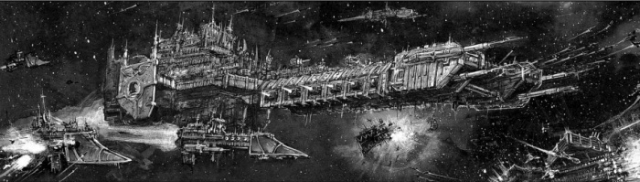
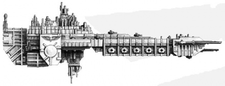
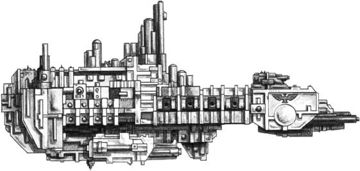
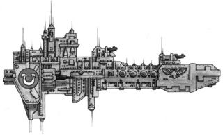

# 0230 星际战士舰队 Space Marine Fleet

精校状态：中文行文已逐段精校，部分术语仍为暂定

分类：通用概念 / 帝国 Imperium / 中央政务部 Adeptus Terra / 阿斯塔特修会 Adeptus Astartes

原文来源：https://www.bilibili.com/opus/1051472873869279237

原作者：帝国神选罐头

原文时间：编辑于 2025年06月30日 12:33

[返回分类目录](目录.md) · [全书目录](../../目录.md)

<!-- A0230-B0001 -->
**英文原文**

Each Space Marine Chapter maintains a fleet of space vessels used for both transport and combat. The exact composition of these fleets can vary greatly between different Chapters, indeed some chapters are entirely fleet-based having no homeworld.

<!-- /A0230-B0001 -->

<!-- A0230-B0002 -->

原译文

每个星际战士战团都有一支用于运输和作战的太空舰队。这些舰队的确切组成在不同战团之间可能存在很大差异，事实上，有些战团完全以舰队为基础，没有家园世界。

**校订译文**

每个星际战士战团都有一支用于运输和作战的太空舰队。这些舰队的确切组成在不同战团之间可能存在很大差异，事实上，有些战团完全以舰队为基础，没有家园世界。

<!-- /A0230-B0002 -->

<!-- A0230-B0003 图片 -->

<!-- A0230-B0004 -->

原译文

Space Marine fleet 星际战士舰队

**校订译文**

Space Marine fleet 星际战士舰队

<!-- /A0230-B0004 -->

<!-- A0230-B0005 -->
## History 历史

<!-- /A0230-B0005 -->

<!-- A0230-B0006 -->
**英文原文**

During the Great Crusade Space Marine vessels served alongside other Imperial forces as combined battlefleets. Space Marine fleets during this time utilized mighty Battleships, Grand Cruisers, Heavy Cruisers, and also heavier vessels. In the wake of the Horus Heresy however, when Roboute Guilliman set about the long and arduous task of preparing the Codex Astartes, the role of space vessels amongst the Adeptus Astartes proved a particular sticking point. For an Imperium still reeling from internecine conflict that almost tore it apart, the division of power was a vitally important consideration. Of the most extreme options on offer, it was ventured by some that the Space Marines should be denied any vessels at all, barring intra-system transports for movement between homeworlds and attendant moons. Corax, amongst others, protested strongly that in fact had the Space Marines been better equipped with fleets of their own his own Legion might not have been so horrendously decimated when trapped on Istvaan V by Horus and the newly revealed traitors. Instead, a compromise was reached which limited the Space Marines to vessels whose primary role was that of transport, delivery and suppression designed to facilitate planetary assault. Only the smallest of vessels would be permitted to act exclusively as gunships, with the larger battlebarges and strike cruisers remaining predominantly as aids to invasion, ensuring the Space Marines would never present a threat to the Imperial Navy proper. Inevitably, the wrangling over interpretation of a ship’s ‘primary role’ leads to some chapters possessing rather more versatile fleets than the Imperial Navy is entirely comfortable with.

<!-- /A0230-B0006 -->

<!-- A0230-B0007 -->

原译文

在大远征期间，星际战士战舰与其他帝国军队一起作为联合作战舰队服役。在此期间，星际战士舰队使用了强大的战列舰、大型巡洋舰、重型巡洋舰以及更重的战舰。然而，在荷鲁斯叛乱之后，当罗伯特·基里曼着手准备阿斯塔特圣典这一漫长而艰巨的任务时，太空战舰在阿斯塔特圣典中的作用被证明是一个特别的症结所在。对于一个仍在经历几乎将其撕裂的内部冲突的帝国来说，权力划分是一个至关重要的考虑因素。在所提供的最极端的选择中，一些人冒险认为，星际战士应该被拒绝拥有任何战舰，禁止在母星和伴随的卫星之间进行系统内运输。科拉克斯和其他人强烈抗议说，事实上，如果星际战士能够更好地装备自己的舰队，他自己的军团在被荷鲁斯和新揭露的叛徒困在伊斯塔万五号时可能不会如此可怕地被摧毁。相反，达成了一项妥协，将星际战士限制在主要作用是运输、运送和压制的战舰上，以促进行星突击。只有最小的战舰才被允许专门充当炮艇，而较大的战斗驳船和打击巡洋舰则主要作为入侵的辅助工具，确保星际战士永远不会对帝国海军本身构成威胁。不可避免的是，对船只“主要作用”的解释的争论导致一些战团拥有比帝国海军完全富裕的多功能舰队。

**校订译文**

大远征期间，星际战士舰船与帝国其他军种共同组成联合战斗舰队，使用强大的战列舰、大型巡洋舰、重型巡洋舰，乃至更庞大的战舰。荷鲁斯之乱后，罗保特·基里曼开始编纂《阿斯塔特圣典》，星际战士舰船的职责却成为最难达成共识的问题之一。帝国刚刚经历几乎令其分崩离析的内战，分散权力至关重要。有人甚至主张，除了往返母星与附近卫星的星系内运输船外，星际战士不应拥有任何舰船。科拉克斯等人强烈反对：如果当初军团拥有更完善的自有舰队，他的战士在伊斯塔万五号遭荷鲁斯和新近暴露的叛徒围困时，就未必会损失如此惨重。各方最终达成妥协，规定星际战士只能使用主要承担运输、投送及火力压制、为行星突击服务的舰船。只有最小型舰艇可以专用于舰炮作战；大型战斗驳船和打击巡洋舰则仍须以支援登陆为主，确保星际战士不威胁帝国海军的主导地位。然而，对舰船“主要职责”的解释终究存在争议，使某些战团得以拥有用途之广超出帝国海军容忍范围的舰队。

**校注：** barring 表示“除……以外”，原译误为禁止星系内运输；最后一句 comfortable with 表示海军能够接受，并非财力富裕。

<!-- /A0230-B0007 -->

<!-- A0230-B0008 -->
## Crew 船员

<!-- /A0230-B0008 -->

<!-- A0230-B0009 -->
**英文原文**

Unlike the vessels of the Imperial Navy, a Space Marine ship has a relatively small crew. A Space Marine is far too valuable to waste in manning a gun or watching a surveyor screen, and so only the officers aboard a vessel are likely to be Space Marines, as well as the few Techmarines who oversee the engines and perform other mechanical duties. Almost all the ship’s systems are run and monitored by servitors; half-human cyborgs who are wired into the vessel’s weapons, engines and communications apparatus. There are also a few hundred Chapter Serfs to attend to other duties, such as routine cleaning and maintenance, serving the Space Marines during meal times and other such honoured tasks. These serfs come from the Chapter’s home planet or the enclave they protect, many of them Novitiates or applicants who have failed some part of the recruiting or training process. These serfs are fanatically loyal to their superhuman masters, and indoctrinated into many of the lesser orders of the Chapter’s Cult. Although human, they still benefit from remarkable training and access to superior weaponry than is usually found on a naval vessel, making them a fearsome prospect in a boarding action – even without the support of their genetically modified lords.

<!-- /A0230-B0009 -->

<!-- A0230-B0010 -->

原译文

与帝国海军的战舰不同，星际战士战舰的船员相对较少。一名星际战士太有价值了，不能浪费在配备枪械或观看测量员屏幕上，因此只有船上的军官可能是星际战士，以及少数监督引擎和执行其他机械任务的技术军士。几乎所有的战舰系统都由机仆运行和监控；半人半机械人与船上的武器、引擎和通信设备相连。还有几百名战团侍从负责其他职责，如日常清洁和维护、在用餐时间为星际战士服务以及其他此类光荣任务。这些侍从来自战团的家园世界或他们保护的飞地，其中许多是新手或在招募或培训过程中失败的申请者。这些侍从狂热地忠于他们超人般的主人，并被灌输进战团教派中许多较为低阶的教团的理念。尽管他们是人类，但他们仍然受益于出色的训练和比通常在海军战舰上使用的更先进的武器，即使没有转基因技术的支持，他们在跳帮行动中也有着可怕的前景。

**校订译文**

星际战士舰船的船员数量通常少于帝国海军舰船。星际战士太过宝贵，不宜浪费在操炮、监看探测屏幕等普通岗位上，因此舰上通常只有军官及少数负责引擎和机械工作的科技战士属于阿斯塔特。几乎所有舰载系统都由机仆运行和监控：这些半人半机械的存在直接接入武器、引擎及通信设备。此外，还有数百名战团农奴负责日常清洁、维护、用餐侍奉等被视为光荣的差事。他们来自战团母星或战团保护的飞地，许多人曾是新进者或候选人，却未能通过某项选拔或训练。这些奴仆对超人般的主人狂热忠诚，并接受战团教派中各类低阶教团的教导。虽然仍是普通人，他们的训练与武器都优于一般海军船员；即使没有星际战士主人的支援，在跳帮战中也极具威胁。

**校注：** genetically modified lords 指经基因改造的星际战士主人，原译漏掉人物、误作没有转基因技术支持。

<!-- /A0230-B0010 -->

<!-- A0230-B0011 -->
## Vessels of the Space Marines 星际战士战舰

<!-- /A0230-B0011 -->

<!-- A0230-B0012 -->
**英文原文**

Space Marines utilise various different types of vessel, the numbers and composition of these fleets varies depending on the history and role of each Chapter. Indeed, some Fleet-based Chapters have mobile Fortress Monasteries, such as the Imperial Fists' Phalanx or the Dark Angels' base The Rock.

<!-- /A0230-B0012 -->

<!-- A0230-B0013 -->

原译文

星际战士使用各种不同类型的战舰，这些舰队的数量和组成因每个战团的历史和作用而异。事实上，一些舰基战团有移动堡垒修道院，如帝国之拳山阵号或黑暗天使基地巨石。

**校订译文**

星际战士使用各种不同类型的战舰，这些舰队的数量和组成因每个战团的历史和作用而异。事实上，一些舰基战团有移动要塞修道院，如帝国之拳山阵号或黑暗天使基地巨石。

<!-- /A0230-B0013 -->

<!-- A0230-B0014 -->
### Battleships 战列舰

<!-- /A0230-B0014 -->

<!-- A0230-B0015 -->
### Current 当前

<!-- /A0230-B0015 -->

<!-- A0230-B0016 -->
**英文原文**

Battle Barge — Large and rare capital ships, they are very heavily armed and armoured.

<!-- /A0230-B0016 -->

<!-- A0230-B0017 -->

原译文

战斗驳船 — 大型且罕见的主力舰，它们装备精良，装甲精良。

**校订译文**

战斗驳船——稀少的大型主力舰，拥有强大火力与厚重装甲。

<!-- /A0230-B0017 -->

<!-- A0230-B0018 图片 -->

<!-- A0230-B0019 -->

原译文

Battle Barge 战斗驳船

**校订译文**

Battle Barge 战斗驳船

<!-- /A0230-B0019 -->

<!-- A0230-B0020 -->
### Former 从前

**校注：** 本表“从前”是原文分类，并不据此推断每种舰型都已完全退役；例如后文仍列个别舰型服役例外。

<!-- /A0230-B0020 -->

<!-- A0230-B0021 -->
**英文原文**

Gloriana Class Battleship — Massive vessels used as flagships by the Legiones Astartes during the Great Crusade

<!-- /A0230-B0021 -->

<!-- A0230-B0022 -->

原译文

荣光女王级战列舰 — 大远征期间阿斯塔特军团用作旗舰的大型船只

**校订译文**

荣光女王级战列舰 — 大远征期间阿斯塔特军团用作旗舰的大型船只

<!-- /A0230-B0022 -->

<!-- A0230-B0023 -->
**英文原文**

Abyss Class Battleship — Titanic warships secretly built for the Word Bearers during the Horus Heresy

<!-- /A0230-B0023 -->

<!-- A0230-B0024 -->

原译文

深渊级战列舰 — 荷鲁斯叛乱时期为怀言者秘密制造的巨大战舰

**校订译文**

深渊级战列舰 — 荷鲁斯之乱时期为怀言者秘密制造的巨大战舰

<!-- /A0230-B0024 -->

<!-- A0230-B0025 -->
**英文原文**

Emperor Class Battleship - Great Crusade-era

<!-- /A0230-B0025 -->

<!-- A0230-B0026 -->

原译文

帝皇级战列舰 - 大远征时期

**校订译文**

帝皇级战列舰 - 大远征时期

<!-- /A0230-B0026 -->

<!-- A0230-B0027 -->
**英文原文**

Lunar Class Battleship — Great Crusade-era

<!-- /A0230-B0027 -->

<!-- A0230-B0028 -->

原译文

月球级战列舰 — 大远征时期

**校订译文**

月球级战列舰 — 大远征时期

<!-- /A0230-B0028 -->

<!-- A0230-B0029 -->
**英文原文**

Infernus Class Battleship — Great Crusade-era

<!-- /A0230-B0029 -->

<!-- A0230-B0030 -->

原译文

炼狱级战列舰 — 大远征时期

**校订译文**

炼狱级战列舰 — 大远征时期

<!-- /A0230-B0030 -->

<!-- A0230-B0031 -->
**英文原文**

Dictatus Class Battleship — Great Crusade-era

<!-- /A0230-B0031 -->

<!-- A0230-B0032 -->

原译文

独裁者级战列舰 — 大远征时期

**校订译文**

独裁者级战列舰 — 大远征时期

<!-- /A0230-B0032 -->

<!-- A0230-B0033 -->
**英文原文**

Oberon Class Battleship - Great Crusade-era

<!-- /A0230-B0033 -->

<!-- A0230-B0034 -->

原译文

天卫四级战列舰 - 大远征时期

**校订译文**

天卫四级战列舰 - 大远征时期

<!-- /A0230-B0034 -->

<!-- A0230-B0035 -->
**英文原文**

Golgotha Class Warship - Great Crusade-era

<!-- /A0230-B0035 -->

<!-- A0230-B0036 -->

原译文

各各他级战舰 - 大远征时期

**校订译文**

各各他级战舰 - 大远征时期

<!-- /A0230-B0036 -->

<!-- A0230-B0037 -->
### Cruisers 巡洋舰

<!-- /A0230-B0037 -->

<!-- A0230-B0038 -->
### Current 当前

<!-- /A0230-B0038 -->

<!-- A0230-B0039 -->
**英文原文**

Strike Cruiser — Smaller and very strongly oriented towards planetary assault with large numbers of fighter bays and drop pods as well as a bombardment cannon.

<!-- /A0230-B0039 -->

<!-- A0230-B0040 -->

原译文

打击巡洋舰 — 体积较小，非常强大，面向行星突击，拥有大量战斗机舱和空投舱以及轰炸加农炮。

**校订译文**

打击巡洋舰——体量较小，设计高度侧重行星突击，拥有大量舰载机库与空降舱，并配备轰炸炮。

<!-- /A0230-B0040 -->

<!-- A0230-B0041 图片 -->

<!-- A0230-B0042 -->

原译文

Space Marine Strike Cruiser 星际战士打击巡洋舰

**校订译文**

Space Marine Strike Cruiser 星际战士打击巡洋舰

<!-- /A0230-B0042 -->

<!-- A0230-B0043 -->
**英文原文**

Vanguard Class Light Cruiser — Scout & escort craft smaller than a Strike Cruiser

<!-- /A0230-B0043 -->

<!-- A0230-B0044 -->

原译文

先锋级轻型巡洋舰 — 比攻击巡洋舰小的侦察和护航战舰

**校订译文**

先锋级轻型巡洋舰——比打击巡洋舰更小的侦察与护航舰。

<!-- /A0230-B0044 -->

<!-- A0230-B0045 -->
**英文原文**

Rudense-style Cruiser - Primaris Inceptor delivery vehicle, for low-orbit assaults

<!-- /A0230-B0045 -->

<!-- A0230-B0046 -->

原译文

鲁登斯式巡洋舰 - 主要是用于低轨道攻击的拦截机运载工具

**校订译文**

鲁登斯式巡洋舰——用于从低轨道投送原铸先驱者实施突击。

**校注：** Primaris Inceptor 指原铸先驱者战士，并非“主要是拦截机”。

<!-- /A0230-B0046 -->

<!-- A0230-B0047 -->
### Former 从前

<!-- /A0230-B0047 -->

<!-- A0230-B0048 -->
**英文原文**

Retribution Class Battlecruiser — Great Crusade-era

<!-- /A0230-B0048 -->

<!-- A0230-B0049 -->

原译文

复仇级战列巡洋舰 — 大远征时期

**校订译文**

复仇级战列巡洋舰 — 大远征时期

<!-- /A0230-B0049 -->

<!-- A0230-B0050 -->
**英文原文**

Avenger Class Grand Cruiser — Great Crusade-era

<!-- /A0230-B0050 -->

<!-- A0230-B0051 -->

原译文

复仇者级大型巡洋舰 — 大远征时期

**校订译文**

复仇者级大型巡洋舰 — 大远征时期

<!-- /A0230-B0051 -->

<!-- A0230-B0052 -->
**英文原文**

Vengeance Class Grand Cruiser — Great Crusade-era

<!-- /A0230-B0052 -->

<!-- A0230-B0053 -->

原译文

复仇级大型巡洋舰 — 大远征时期

**校订译文**

复仇级大型巡洋舰 — 大远征时期

<!-- /A0230-B0053 -->

<!-- A0230-B0054 -->
**英文原文**

Dominus Class Grand Cruiser - Great Crusade-era

<!-- /A0230-B0054 -->

<!-- A0230-B0055 -->

原译文

领主级大型巡洋舰 - 大远征时期

**校订译文**

领主级大型巡洋舰 - 大远征时期

<!-- /A0230-B0055 -->

<!-- A0230-B0056 -->
**英文原文**

Infernus Class Heavy Cruiser — Great Crusade-era

<!-- /A0230-B0056 -->

<!-- A0230-B0057 -->

原译文

炼狱级重型巡洋舰 — 大远征时期

**校订译文**

炼狱级重型巡洋舰 — 大远征时期

<!-- /A0230-B0057 -->

<!-- A0230-B0058 -->
**英文原文**

Indrajit Class Heavy Cruiser - Great Crusade-era

<!-- /A0230-B0058 -->

<!-- A0230-B0059 -->

原译文

因陀罗耆特级重型巡洋舰 - 大远征时期

**校订译文**

因陀罗耆特级重型巡洋舰 - 大远征时期

<!-- /A0230-B0059 -->

<!-- A0230-B0060 -->
**英文原文**

Promethean Class Cruiser - Ancient Terran design used by the Dark Angels during the Great Crusade

<!-- /A0230-B0060 -->

<!-- A0230-B0061 -->

原译文

普罗米修斯级巡洋舰 - 黑暗天使在大远征期间使用的古代泰拉设计

**校订译文**

普罗米修斯级巡洋舰 - 黑暗天使在大远征期间使用的古代泰拉设计

<!-- /A0230-B0061 -->

<!-- A0230-B0062 -->
**英文原文**

Bulk Cruiser — Great Crusade-era

<!-- /A0230-B0062 -->

<!-- A0230-B0063 -->

原译文

巨型巡洋舰 — 大远征时期

**校订译文**

巨型巡洋舰 — 大远征时期

<!-- /A0230-B0063 -->

<!-- A0230-B0064 -->
**英文原文**

Gladius Class Light Cruiser — Great Crusade-era

<!-- /A0230-B0064 -->

<!-- A0230-B0065 -->

原译文

短剑级轻型巡洋舰 — 大远征时期

**校订译文**

短剑级轻型巡洋舰 — 大远征时期

<!-- /A0230-B0065 -->

<!-- A0230-B0066 -->
**英文原文**

Eclipse Class Light Cruiser — Great Crusade-era

<!-- /A0230-B0066 -->

<!-- A0230-B0067 -->

原译文

日蚀级轻型巡洋舰 — 大远征时期

**校订译文**

日蚀级轻型巡洋舰 — 大远征时期

<!-- /A0230-B0067 -->

<!-- A0230-B0068 -->
**英文原文**

Dauntless Class Light Cruiser - Great Crusade-era

<!-- /A0230-B0068 -->

<!-- A0230-B0069 -->

原译文

无畏级轻型巡洋舰 - 大远征时期

**校订译文**

无畏级轻型巡洋舰 - 大远征时期

<!-- /A0230-B0069 -->

<!-- A0230-B0070 -->
**英文原文**

Triton Class Aegis Cruiser - Great Crusade-era

<!-- /A0230-B0070 -->

<!-- A0230-B0071 -->

原译文

海卫一级宙斯盾巡洋舰 - 大远征时期

**校订译文**

海卫一级神盾巡洋舰——大远征时期。

**校注：** 英文仅列舰型 Triton Class Aegis Cruiser；Aegis 按一般神盾词义暂译，不套现代宙斯盾系统，也不认定与灰骑士同名灵能防护有关。

<!-- /A0230-B0071 -->

<!-- A0230-B0072 -->
**英文原文**

Hoplon Assault Cruiser

<!-- /A0230-B0072 -->

<!-- A0230-B0073 -->

原译文

圆盾突击巡洋舰

**校订译文**

圆盾突击巡洋舰

<!-- /A0230-B0073 -->

<!-- A0230-B0074 -->
### Escorts 护卫舰

<!-- /A0230-B0074 -->

<!-- A0230-B0075 -->
### Current 当前

<!-- /A0230-B0075 -->

<!-- A0230-B0076 -->
**英文原文**

Gladius Frigate — Similar to the Sword Class Frigate and the standard vessel used by the Space Marines for escort duties.

<!-- /A0230-B0076 -->

<!-- A0230-B0077 -->

原译文

短剑护卫舰 — 类似于剑级护卫舰和星际战士用于护航任务的标准战舰。

**校订译文**

短剑级护卫舰——类似于剑级护卫舰，是星际战士执行护航任务的标准舰型。

<!-- /A0230-B0077 -->

<!-- A0230-B0078 图片 -->

<!-- A0230-B0079 -->

原译文

Gladius Class Frigate 短剑护卫舰

**校订译文**

Gladius Class Frigate 短剑护卫舰

<!-- /A0230-B0079 -->

<!-- A0230-B0080 -->
**英文原文**

Hunter Destroyer — Similar to the Cobra Class Destroyer but mainly used by the Dark Angels even though it is available to all Space Marine forces.

<!-- /A0230-B0080 -->

<!-- A0230-B0081 -->

原译文

猎手驱逐舰 — 类似于眼镜蛇级驱逐舰，但主要由黑暗天使使用，尽管它可供所有星际战士使用。

**校订译文**

猎手驱逐舰 — 类似于眼镜蛇级驱逐舰，但主要由黑暗天使使用，尽管它可供所有星际战士使用。

<!-- /A0230-B0081 -->

<!-- A0230-B0082 -->
**英文原文**

Nova Frigate — Similar to the Firestorm Class Frigate and controversial as the battle role of the ship impedes on that given to the Imperial Navy, namely space battles and capital ship hunting.

<!-- /A0230-B0082 -->

<!-- A0230-B0083 -->

原译文

新星护卫舰 — 类似于火风暴级护卫舰，但由于该舰的战斗角色阻碍了帝国海军的任务，即太空战和主力舰狩猎，因此存在争议。

**校订译文**

新星级护卫舰——类似于火风暴级护卫舰。它专长于太空交战和猎杀主力舰，涉足了原本划归帝国海军的职责，因此备受争议。

<!-- /A0230-B0083 -->

<!-- A0230-B0084 -->
### Former 从前

<!-- /A0230-B0084 -->

<!-- A0230-B0085 -->
**英文原文**

Thunderbolt Class Heavy Frigate - Great Crusade-era

<!-- /A0230-B0085 -->

<!-- A0230-B0086 -->

原译文

霹雳级重型护卫舰 - 大远征时期

**校订译文**

霹雳级重型护卫舰 - 大远征时期

<!-- /A0230-B0086 -->

<!-- A0230-B0087 -->
**英文原文**

Sword Class Frigate - Great Crusade-era

<!-- /A0230-B0087 -->

<!-- A0230-B0088 -->

原译文

剑级护卫舰 - 大远征时期

**校订译文**

剑级护卫舰 - 大远征时期

<!-- /A0230-B0088 -->

<!-- A0230-B0089 -->
**英文原文**

Venom Class Destroyer — Great Crusade-era

<!-- /A0230-B0089 -->

<!-- A0230-B0090 -->

原译文

毒液级驱逐舰 — 大远征时期

**校订译文**

毒液级驱逐舰 — 大远征时期

<!-- /A0230-B0090 -->

<!-- A0230-B0091 -->
**英文原文**

Cobra Class Destroyer - Great Crusade-era

<!-- /A0230-B0091 -->

<!-- A0230-B0092 -->

原译文

眼镜蛇级驱逐舰 - 大远征时期

**校订译文**

眼镜蛇级驱逐舰 - 大远征时期

<!-- /A0230-B0092 -->

<!-- A0230-B0093 -->
**英文原文**

Tiamat Class Destroyer - Ancient Terran design used by the Dark Angels during the Great Crusade

<!-- /A0230-B0093 -->

<!-- A0230-B0094 -->

原译文

提亚马特级驱逐舰 - 黑暗天使在大远征期间使用的古代泰拉设计

**校订译文**

提亚马特级驱逐舰 - 黑暗天使在大远征期间使用的古代泰拉设计

<!-- /A0230-B0094 -->

<!-- A0230-B0095 -->
**英文原文**

Wrath Hammer Class Escort - Great Crusade-era. At least one remains in service with the Carcharodons.

<!-- /A0230-B0095 -->

<!-- A0230-B0096 -->

原译文

愤怒之锤级护卫舰 — 大远征时期。至少有一艘仍在噬人鲨服役。

**校订译文**

愤怒之锤级护卫舰 — 大远征时期。至少有一艘仍在噬人鲨服役。

<!-- /A0230-B0096 -->

<!-- A0230-B0097 -->

原译文

Gulgor Class Assault Barque 古尔戈尔级突击三桅船

**校订译文**

Gulgor Class Assault Barque 古尔戈尔级突击船

**校注：** Barque 在太空舰艇语境暂译船，不因其帆船词源无据添加三根桅杆；Attack Barque 同。

<!-- /A0230-B0097 -->

<!-- A0230-B0098 -->

原译文

Excelsior Class Craft 埃克塞尔西奥级小船

**校订译文**

Excelsior Class Craft 埃克塞尔西奥级舰艇

<!-- /A0230-B0098 -->

<!-- A0230-B0099 -->

原译文

Credo Class Strike Corvette 信条级打击巡洋舰

**校订译文**

Credo Class Strike Corvette 信条级打击轻型护卫舰

**校注：** Corvette 为小型军舰，暂译轻型护卫舰，不译巡洋舰。

<!-- /A0230-B0099 -->

<!-- A0230-B0100 -->

原译文

Attack Barque 攻击三桅船

**校订译文**

Attack Barque 攻击船

<!-- /A0230-B0100 -->

<!-- A0230-B0101 -->
### Assault Craft and Landers 攻击艇和登陆艇

<!-- /A0230-B0101 -->

<!-- A0230-B0102 -->
### Current 现在

<!-- /A0230-B0102 -->

<!-- A0230-B0103 -->
**英文原文**

Thunderhawk Gunship — Attack Craft and transport vehicle used in both planetary assault and space-combat roles.

<!-- /A0230-B0103 -->

<!-- A0230-B0104 -->

原译文

雷鹰炮艇 — 攻击艇和运输机，用于行星突击和太空作战。

**校订译文**

雷鹰炮艇 — 攻击艇和运输机，用于行星突击和太空作战。

<!-- /A0230-B0104 -->

<!-- A0230-B0105 -->
**英文原文**

Stormraven Gunship — A smaller vessel than the Thunderhawk, primarily used by the Grey Knights and Blood Angels.

<!-- /A0230-B0105 -->

<!-- A0230-B0106 -->

原译文

风暴渡鸦炮艇 - 比雷鹰更小的战船，主要由灰骑士和圣血天使使用。

**校订译文**

风暴鸦炮艇——比雷鹰更小的飞行器，主要由灰骑士和圣血天使使用。

<!-- /A0230-B0106 -->

<!-- A0230-B0107 -->
**英文原文**

Stormhawk Interceptor — A small one-man aerial superiority aircraft.

<!-- /A0230-B0107 -->

<!-- A0230-B0108 -->

原译文

风暴隼截击机 — 一种小型单人空优飞机。

**校订译文**

风暴鹰拦截者战机 — 一种小型单人空优飞机。

<!-- /A0230-B0108 -->

<!-- A0230-B0109 -->
**英文原文**

Stormtalon Gunship — A small one-man interceptor and ground attack craft.

<!-- /A0230-B0109 -->

<!-- A0230-B0110 -->

原译文

风暴爪炮艇 — 一种小型单人拦截机和地面攻击艇。

**校订译文**

风暴爪炮艇 — 一种小型单人拦截机和地面攻击艇。

<!-- /A0230-B0110 -->

<!-- A0230-B0111 -->
**英文原文**

Storm Eagle Gunship — A transport-gunship design

<!-- /A0230-B0111 -->

<!-- A0230-B0112 -->

原译文

风暴鹰炮艇 — 一种运输-炮艇设计

**校订译文**

风暴鹰炮艇 — 一种运输-炮艇设计

<!-- /A0230-B0112 -->

<!-- A0230-B0113 -->
**英文原文**

Fire Raptor Gunship — Attack aircraft design based on the Storm Eagle

<!-- /A0230-B0113 -->

<!-- A0230-B0114 -->

原译文

火隼炮艇——基于风暴鹰的攻击机设计

**校订译文**

火猛禽炮艇——以风暴鹰为基础设计的攻击机。

**校注：** Fire Raptor 暂译火猛禽，与 Stormhawk 不同，未核到完整官译。

<!-- /A0230-B0114 -->

<!-- A0230-B0115 -->
**英文原文**

Overlord — A new type of gunship used by Primaris Space Marines

<!-- /A0230-B0115 -->

<!-- A0230-B0116 -->

原译文

霸主 — 原铸星际战士使用的新型炮艇

**校订译文**

霸主 — 原铸星际战士使用的新型炮艇

<!-- /A0230-B0116 -->

<!-- A0230-B0117 -->
**英文原文**

Xiphon Interceptor — Fighter aircraft first used during the Great Crusade

<!-- /A0230-B0117 -->

<!-- A0230-B0118 -->

原译文

剑尾截击机 — 大远征期间首次使用的战斗机

**校订译文**

剑尾截击机 — 大远征期间首次使用的战斗机

<!-- /A0230-B0118 -->

<!-- A0230-B0119 -->
**英文原文**

Nephilim Jetfighter — Atmospheric fighter used by the Unforgiven

<!-- /A0230-B0119 -->

<!-- A0230-B0120 -->

原译文

拿非利喷气式战斗机 — 不可饶恕者使用的大气层战斗机

**校订译文**

涅菲里姆战机——戴罪者使用的大气层战斗机。

<!-- /A0230-B0120 -->

<!-- A0230-B0121 -->
**英文原文**

Dark Talon — Atmospheric ground attack aircraft used by the Unforgiven

<!-- /A0230-B0121 -->

<!-- A0230-B0122 -->

原译文

暗爪 — 不可饶恕者使用的大气层对地攻击机

**校订译文**

黑暗之爪 — 戴罪者使用的大气层对地攻击机

<!-- /A0230-B0122 -->

<!-- A0230-B0123 -->
**英文原文**

Stormfang Gunship — Attack craft used by the Space Wolves

<!-- /A0230-B0123 -->

<!-- A0230-B0124 -->

原译文

风暴牙炮艇 — 太空野狼使用的攻击飞船

**校订译文**

风暴牙炮艇 — 太空野狼使用的攻击飞船

<!-- /A0230-B0124 -->

<!-- A0230-B0125 -->
**英文原文**

Stormwolf — Landing craft used by the Space Wolves

<!-- /A0230-B0125 -->

<!-- A0230-B0126 -->

原译文

风暴狼 — 太空野狼使用的登陆艇

**校订译文**

风暴狼 — 太空野狼使用的登陆艇

<!-- /A0230-B0126 -->

<!-- A0230-B0127 -->
**英文原文**

Corvus Blackstar — Gunship used by the Deathwatch

<!-- /A0230-B0127 -->

<!-- A0230-B0128 -->

原译文

渡鸦黑星 — 死亡守望使用的炮艇

**校订译文**

黑星渡鸦 — 死亡守望使用的炮艇

<!-- /A0230-B0128 -->

<!-- A0230-B0129 -->
**英文原文**

Caestus Assault Ram — is the primary assault ram of the Space marines. It is mainly used to board enemy ships, but it can also be used as an orbital dropship to land troops directly in the battlefield.

<!-- /A0230-B0129 -->

<!-- A0230-B0130 -->

原译文

拳套突击艇 — 是星际战士的主要突击艇。它主要用于登上敌舰，但也可以用作轨道飞艇，直接将部队降落在战场上。

**校订译文**

拳套突击撞击艇——星际战士主要使用的突击撞击艇，通常用于强行突入敌舰，也可作为轨道登陆艇，将部队直接送入战场。

<!-- /A0230-B0130 -->

<!-- A0230-B0131 -->
**英文原文**

Landing Craft — Large orbital-assault vehicles designed to quickly deliver tanks and troops to a planets surface.

<!-- /A0230-B0131 -->

<!-- A0230-B0132 -->

原译文

登陆艇 — 大型轨道突击载具，旨在将坦克和部队快速运送到行星表面。

**校订译文**

登陆艇 — 大型轨道突击载具，旨在将坦克和部队快速运送到行星表面。

<!-- /A0230-B0132 -->

<!-- A0230-B0133 -->
**英文原文**

Thunderbolt Dropship - Troop transport

<!-- /A0230-B0133 -->

<!-- A0230-B0134 -->

原译文

霹雳空投舰 - 部队运输

**校订译文**

霹雳空投舰 - 部队运输

<!-- /A0230-B0134 -->

<!-- A0230-B0135 -->
**英文原文**

Drop Pod — transports used for orbital insertion and one-way rides.

<!-- /A0230-B0135 -->

<!-- A0230-B0136 -->

原译文

空投舱 — 用于轨道空投和单向飞行的运输工具。

**校订译文**

空降舱——用于从轨道投送部队的单程运输工具。

<!-- /A0230-B0136 -->

<!-- A0230-B0137 -->
### Former 从前

<!-- /A0230-B0137 -->

<!-- A0230-B0138 -->
**英文原文**

Stormbird — An aircraft used during the Great Crusade just before the Horus Heresy and the introduction of the Thunderhawk.

<!-- /A0230-B0138 -->

<!-- A0230-B0139 -->

原译文

风暴鸟 — 在荷鲁斯叛乱和雷鹰引入之前的大十字军东征期间使用的一种飞机。

**校订译文**

风暴鸟——大远征期间使用的飞行器，服役时间早于荷鲁斯之乱与雷鹰的引入。

<!-- /A0230-B0139 -->

<!-- A0230-B0140 -->
**英文原文**

Wrath Starfighter — An older void fighter that was replaced by the end of the Horus Heresy, though it was once the mainstay of the Legio Astartes fleets.

<!-- /A0230-B0140 -->

<!-- A0230-B0141 -->

原译文

愤怒星际战斗机 — 一种较旧的虚空战斗机，被荷鲁斯叛乱的终结所取代，尽管它曾经是阿斯塔特军团舰队的支柱。

**校订译文**

愤怒星际战斗机——曾是阿斯塔特军团舰队主力的旧式虚空战斗机，到荷鲁斯之乱结束时已被其他机型取代。

<!-- /A0230-B0141 -->

<!-- A0230-B0142 -->
**英文原文**

Stormhawk — Great Crusade-era assault gunship

<!-- /A0230-B0142 -->

<!-- A0230-B0143 -->

原译文

风暴隼 — 大远征时期的攻击炮艇

**校订译文**

风暴隼 — 大远征时期的攻击炮艇

<!-- /A0230-B0143 -->

<!-- A0230-B0144 -->
**英文原文**

Lotus — Great Crusade-era fighter

<!-- /A0230-B0144 -->

<!-- A0230-B0145 -->

原译文

莲花 — 大远征时期战斗机

**校订译文**

莲花 — 大远征时期战斗机

<!-- /A0230-B0145 -->

<!-- A0230-B0146 -->
**英文原文**

Deathbird Interceptor - Great Crusade-era Fighter

<!-- /A0230-B0146 -->

<!-- A0230-B0147 -->

原译文

死亡鸟拦截机 - 大远征时期的战斗机

**校订译文**

死亡鸟拦截机 - 大远征时期的战斗机

<!-- /A0230-B0147 -->

<!-- A0230-B0148 -->
**英文原文**

Swordstrike Interceptor - Great Crusade-era fighter

<!-- /A0230-B0148 -->

<!-- A0230-B0149 -->

原译文

剑击截击机 - 大远征时期的战斗机

**校订译文**

剑击截击机 - 大远征时期的战斗机

<!-- /A0230-B0149 -->

<!-- A0230-B0150 -->
**英文原文**

Corsair — Great Crusade-era Bomber

<!-- /A0230-B0150 -->

<!-- A0230-B0151 -->

原译文

海盗船 — 大远征时期的轰炸机

**校订译文**

海盗——大远征时期的轰炸机。

<!-- /A0230-B0151 -->

<!-- A0230-B0152 -->
**英文原文**

Apis — Great Crusade-era bomber

<!-- /A0230-B0152 -->

<!-- A0230-B0153 -->

原译文

蜜蜂 — 大远征时期的轰炸机

**校订译文**

蜜蜂 — 大远征时期的轰炸机

<!-- /A0230-B0153 -->

<!-- A0230-B0154 -->
**英文原文**

Castellan Bomber - Great Crusade-era Heavy Bomber

<!-- /A0230-B0154 -->

<!-- A0230-B0155 -->

原译文

堡主轰炸机 - 大远征时期的重型轰炸机

**校订译文**

堡主轰炸机 - 大远征时期的重型轰炸机

<!-- /A0230-B0155 -->

<!-- A0230-B0156 -->
**英文原文**

Lightning Crow — Great Crusade-era Strike Fighter

<!-- /A0230-B0156 -->

<!-- A0230-B0157 -->

原译文

闪电鸦 — 大远征的攻击战斗机

**校订译文**

闪电鸦 — 大远征的攻击战斗机

<!-- /A0230-B0157 -->

<!-- A0230-B0158 -->
**英文原文**

Skylance — Unification Wars-era gunship, replaced by the Stormbird.

<!-- /A0230-B0158 -->

<!-- A0230-B0159 -->

原译文

天空长枪 - 统一战争时代的炮艇，被风暴鸟取代。

**校订译文**

天空长枪 - 统一战争时代的炮艇，被风暴鸟取代。

<!-- /A0230-B0159 -->

<!-- A0230-B0160 -->
**英文原文**

Orgus Flyer - Light VTOL craft used during the Great Crusade and Horus Heresy.

<!-- /A0230-B0160 -->

<!-- A0230-B0161 -->

原译文

奥格斯飞行器 - 在大远征和荷鲁斯叛乱期间使用的轻型垂直起降飞行器。

**校订译文**

奥格斯飞行器 - 在大远征和荷鲁斯之乱期间使用的轻型垂直起降飞行器。

<!-- /A0230-B0161 -->

<!-- A0230-B0162 -->
**英文原文**

Pythos Scout Plane - Reconnaissance Craft (Great Crusade-era)

<!-- /A0230-B0162 -->

<!-- A0230-B0163 -->

原译文

派索斯侦察机 - 侦察机（大远征时期）

**校订译文**

派索斯侦察机 - 侦察机（大远征时期）

<!-- /A0230-B0163 -->

<!-- A0230-B0164 -->
**英文原文**

Dreadclaw — Large Drop Pod still used by Chaos Space Marines

<!-- /A0230-B0164 -->

<!-- A0230-B0165 -->

原译文

恐怖爪 — 混沌星际战士仍在使用的大型空投舱

**校订译文**

恐怖爪——混沌星际战士仍在使用的大型空降舱。

<!-- /A0230-B0165 -->

<!-- A0230-B0166 -->
**英文原文**

Kharybdis Assault Claw — large type of Drop Pod used during the Great Crusade and Horus Heresy.

<!-- /A0230-B0166 -->

<!-- A0230-B0167 -->

原译文

卡律布狄斯突击爪 — 大远征和荷鲁斯叛乱时期使用的大型空投舱。

**校订译文**

卡律布狄斯突击爪——大远征及荷鲁斯之乱时期使用的大型空降舱。

<!-- /A0230-B0167 -->

<!-- A0230-B0168 -->
**英文原文**

Purgio Class Boarding Transport - Assault Boat (Great Crusade-era)

<!-- /A0230-B0168 -->

<!-- A0230-B0169 -->

原译文

普尔吉奥级跳帮运输机 - 突击船（大远征时期）

**校订译文**

普尔吉奥级跳帮运输机 - 突击船（大远征时期）

<!-- /A0230-B0169 -->

<!-- A0230-B0170 -->
**英文原文**

Anhur Pattern Transport - Heavy landing craft (Great Crusade-era)

<!-- /A0230-B0170 -->

<!-- A0230-B0171 -->

原译文

安赫型运输机 - 重型登陆艇（大远征时期）

**校订译文**

安赫型运输机 - 重型登陆艇（大远征时期）

<!-- /A0230-B0171 -->

<!-- A0230-B0172 -->
**英文原文**

Harbinger Assault Craft - Attack Craft (Great Crusade-era)

<!-- /A0230-B0172 -->

<!-- A0230-B0173 -->

原译文

先驱者突击机 - 攻击艇（大远征时期）

**校订译文**

先驱者突击机 - 攻击艇（大远征时期）

<!-- /A0230-B0173 -->

<!-- A0230-B0174 -->

原译文

Stormstrike Gunship 风暴打击炮艇

**校订译文**

Stormstrike Gunship 风暴打击炮艇

<!-- /A0230-B0174 -->

<!-- A0230-B0175 -->
**英文原文**

Stormcrow - Gunship

<!-- /A0230-B0175 -->

<!-- A0230-B0176 -->

原译文

风暴鸦 - 炮艇

**校订译文**

风暴乌鸦——炮艇。

**校注：** Stormcrow 与本表 Stormraven 是不同名称，暂分别作风暴乌鸦与风暴鸦，待核官译。

<!-- /A0230-B0176 -->

<!-- A0230-B0177 -->
**英文原文**

Hawkwing - Transport

<!-- /A0230-B0177 -->

<!-- A0230-B0178 -->

原译文

鹰翼 - 运输机

**校订译文**

鹰翼 - 运输机

<!-- /A0230-B0178 -->

<!-- A0230-B0179 -->
### Weaponry 武器

<!-- /A0230-B0179 -->

<!-- A0230-B0180 -->

原译文

Torpedo 鱼雷

**校订译文**

Torpedo 鱼雷

<!-- /A0230-B0180 -->

<!-- A0230-B0181 -->

原译文

Lance 光矛

**校订译文**

Lance 光矛

<!-- /A0230-B0181 -->

<!-- A0230-B0182 -->

原译文

Fusion Beamer 聚变光束

**校订译文**

Fusion Beamer 聚变光束

<!-- /A0230-B0182 -->

<!-- A0230-B0183 -->

原译文

Macrocannon 宏炮

**校订译文**

Macrocannon 宏炮

<!-- /A0230-B0183 -->

<!-- A0230-B0184 -->

原译文

Bombardment Cannon 轰炸炮

**校订译文**

Bombardment Cannon 轰炸炮

<!-- /A0230-B0184 -->

<!-- A0230-B0185 -->

原译文

Flak Turret 高射炮塔

**校订译文**

Flak Turret 高射炮塔

<!-- /A0230-B0185 -->

<!-- A0230-B0186 -->

原译文

Plasma Projector 等离子投射炮

**校订译文**

Plasma Projector 等离子投射炮

<!-- /A0230-B0186 -->

<!-- A0230-B0187 -->

原译文

Missile Launchers 导弹发射器

**校订译文**

Missile Launchers 导弹发射器

<!-- /A0230-B0187 -->

<!-- A0230-B0188 -->

原译文

Magma Bombs 熔岩炸弹

**校订译文**

Magma Bombs 熔岩炸弹

<!-- /A0230-B0188 -->

<!-- A0230-B0189 -->

原译文

Exterminatus weaponry 灭绝武器

**校订译文**

Exterminatus weaponry 灭绝令武器

<!-- /A0230-B0189 -->

<!-- A0230-B0190 -->

原译文

Cyclonic Torpedo 旋风鱼雷

**校订译文**

Cyclonic Torpedo 旋风鱼雷

<!-- /A0230-B0190 -->

<!-- A0230-B0191 -->

原译文

Magna Torpedo 熔岩鱼雷

**校订译文**

Magna Torpedo 巨型鱼雷

**校注：** Magna 与 Magma（熔岩）不同，原译疑混淆两词，暂译巨型鱼雷。

<!-- /A0230-B0191 -->

<!-- A0230-B0192 -->

原译文

Virus Bomb 病毒炸弹

**校订译文**

Virus Bomb 病毒炸弹

<!-- /A0230-B0192 -->

<!-- A0230-B0193 -->

原译文

Atmospheric incinerator torpedo 大气焚烧鱼雷

**校订译文**

Atmospheric incinerator torpedo 大气焚烧鱼雷

<!-- /A0230-B0193 -->

<!-- A0230-B0194 -->

原译文

Modalis Atmospheric Missile 莫达利斯大气导弹

**校订译文**

Modalis Atmospheric Missile 莫达利斯大气导弹

<!-- /A0230-B0194 -->

本篇核心术语与暂定项

以下列出本篇出现的英文原形及核心术语表用词。同形词可能指不同对象，具体词义以本篇正文和校注为准；单复数、别名和仅见于图注的名称可能尚未列入。完整候选见[术语表](../../术语表/双语术语候选.csv)。

| 英文 | 采用中文 | 状态 |
| --- | --- | --- |
| Space Marines | 星际战士 | 官方已核对 |
| Adeptus Astartes | 阿斯塔特修会 | 官方已核对 |
| Blood Angels | 圣血天使 | 官方已核对 |
| Dark Angels | 黑暗天使 | 官方已核对 |
| Deathwatch | 死亡守望 | 官方已核对 |
| Grey Knights | 灰骑士 | 官方已核对 |
| Space Wolves | 太空野狼 | 官方已核对 |
| Chaos Space Marines | 混沌星际战士 | 官方已核对 |
| Roboute Guilliman | 罗保特·基里曼 | 官方已核对 |
| Horus Heresy | 荷鲁斯之乱 | 官方已核对 |
| Imperium | 帝国 | 暂定·简称 |
| Imperial Navy | 帝国海军 | 暂定 |
| Promethean | 普罗米修斯学派 | 暂定·学派语境 |
| History | 历史 | 编辑用语已统一 |
| Imperial Fists | 帝国之拳 | 暂定 |
| Phalanx | 山阵号 | 暂定 |
| Emperor | 帝皇 | 官方已核对 |
| Battle Barge | 战斗驳船 | 暂定·官方待核 |
| Word Bearers | 怀言者 | 暂定·官方待核 |
| Corsair | 海盗 | 暂定·官方待核 |
| Great Crusade | 大远征 | 暂定·官方待核 |
| Horus | 荷鲁斯 | 暂定·官方待核 |
| Legiones Astartes | 阿斯塔特军团 | 暂定·官方待核 |
| Unification Wars | 统一战争 | 暂定·官方待核 |
| Nephilim Jetfighter | 涅菲里姆战机 | 官方已核 |
| Unforgiven | 戴罪者 | 暂定·官方待核 |
| Ancient | 旗手 | 官方已核对 |
| Drop Pod | 空降舱 | 官方已核·中英对照 |
| Destroyer | 毁灭者 | 暂定·官方待核 |
| Space Marine | 星际战士 | 暂定·官方待核 |
| Chapter | 战团 | 暂定·官方待核 |
| Inceptor | 先驱者 | 暂定·官方待核 |
| Scout | 侦察兵 | 暂定·官方待核 |
| Vanguard | 先锋 | 暂定·官方待核 |
| Codex Astartes | 阿斯塔特圣典 | 暂定·官方待核 |
| Fleet-Based Chapters | 舰基战团 | 暂定·官方待核 |
| Overlord | 霸主 | 官方已核对 |
| Carcharodons | 噬人鲨 | 暂定·官方待核 |
| Gloriana Class Battleship | 荣光女王级战列舰 | 暂定·官方待核 |
| Abyss Class Battleship | 深渊级战列舰 | 暂定·官方待核 |
| Emperor Class Battleship | 帝皇级战列舰 | 暂定·官方待核 |
| Lunar Class Battleship | 月球级战列舰 | 暂定·官方待核 |
| Infernus Class Battleship | 炼狱级战列舰 | 暂定·官方待核 |
| Dictatus Class Battleship | 独裁者级战列舰 | 暂定·官方待核 |
| Oberon Class Battleship | 天卫四级战列舰 | 暂定·官方待核 |
| Golgotha Class Warship | 各各他级战舰 | 暂定·官方待核 |
| Strike Cruiser | 打击巡洋舰 | 暂定·官方待核 |
| Vanguard Class Light Cruiser | 先锋级轻型巡洋舰 | 暂定·官方待核 |
| Rudense-style Cruiser | 鲁登斯式巡洋舰 | 暂定·官方待核 |
| Retribution Class Battlecruiser | 复仇级战列巡洋舰 | 暂定·官方待核 |
| Avenger Class Grand Cruiser | 复仇者级大型巡洋舰 | 暂定·官方待核 |
| Vengeance Class Grand Cruiser | 复仇级大型巡洋舰 | 暂定·官方待核 |
| Dominus Class Grand Cruiser | 领主级大型巡洋舰 | 暂定·官方待核 |
| Infernus Class Heavy Cruiser | 炼狱级重型巡洋舰 | 暂定·官方待核 |
| Indrajit Class Heavy Cruiser | 因陀罗耆特级重型巡洋舰 | 暂定·官方待核 |
| Promethean Class Cruiser | 普罗米修斯级巡洋舰 | 暂定·官方待核 |
| Bulk Cruiser | 巨型巡洋舰 | 暂定·官方待核 |
| Gladius Class Light Cruiser | 短剑级轻型巡洋舰 | 暂定·官方待核 |
| Eclipse Class Light Cruiser | 日蚀级轻型巡洋舰 | 暂定·官方待核 |
| Dauntless Class Light Cruiser | 无畏级轻型巡洋舰 | 暂定·官方待核 |
| Triton Class Aegis Cruiser | 海卫一级神盾巡洋舰 | 暂定·官方待核 |
| Hoplon Assault Cruiser | 圆盾突击巡洋舰 | 暂定·官方待核 |
| Gladius Frigate | 短剑级护卫舰 | 暂定·官方待核 |
| Hunter Destroyer | 猎手驱逐舰 | 暂定·官方待核 |
| Nova Frigate | 新星级护卫舰 | 暂定·官方待核 |
| Thunderbolt Class Heavy Frigate | 霹雳级重型护卫舰 | 暂定·官方待核 |
| Sword Class Frigate | 剑级护卫舰 | 暂定·官方待核 |
| Venom Class Destroyer | 毒液级驱逐舰 | 暂定·官方待核 |
| Cobra Class Destroyer | 眼镜蛇级驱逐舰 | 暂定·官方待核 |
| Tiamat Class Destroyer | 提亚马特级驱逐舰 | 暂定·官方待核 |
| Wrath Hammer Class Escort | 愤怒之锤级护卫舰 | 暂定·官方待核 |
| Thunderhawk Gunship | 雷鹰炮艇 | 暂定·官方待核 |
| Stormraven Gunship | 风暴鸦炮艇 | 官方已核 |
| Stormhawk Interceptor | 风暴鹰拦截者战机 | 官方已核 |
| Stormtalon Gunship | 风暴爪炮艇 | 官方已核 |
| Storm Eagle Gunship | 风暴鹰炮艇 | 暂定·官方待核 |
| Fire Raptor Gunship | 火猛禽炮艇 | 暂定·官方待核 |
| Xiphon Interceptor | 剑尾截击机 | 暂定·官方待核 |
| Dark Talon | 黑暗之爪 | 暂定·官方待核 |
| Stormfang Gunship | 风暴牙炮艇 | 暂定·官方待核 |
| Stormwolf | 风暴狼 | 暂定·官方待核 |
| Corvus Blackstar | 黑星渡鸦 | 官方已核 |
| Caestus Assault Ram | 拳套突击撞击艇 | 暂定·官方待核 |
| Landing Craft | 登陆艇 | 暂定·官方待核 |
| Thunderbolt Dropship | 霹雳空投舰 | 暂定·官方待核 |
| Stormbird | 风暴鸟 | 暂定·官方待核 |
| Wrath Starfighter | 愤怒星际战斗机 | 暂定·官方待核 |
| Stormhawk | 风暴隼 | 暂定·官方待核 |
| Lotus | 莲花 | 暂定·官方待核 |
| Deathbird Interceptor | 死亡鸟拦截机 | 暂定·官方待核 |
| Swordstrike Interceptor | 剑击截击机 | 暂定·官方待核 |
| Apis | 蜜蜂 | 暂定·官方待核 |
| Castellan Bomber | 堡主轰炸机 | 暂定·官方待核 |
| Lightning Crow | 闪电鸦 | 暂定·官方待核 |
| Skylance | 天空长枪 | 暂定·官方待核 |
| Orgus Flyer | 奥格斯飞行器 | 暂定·官方待核 |
| Pythos Scout Plane | 派索斯侦察机 | 暂定·官方待核 |
| Dreadclaw | 恐怖爪 | 暂定·官方待核 |
| Kharybdis Assault Claw | 卡律布狄斯突击爪 | 暂定·官方待核 |
| Purgio Class Boarding Transport | 普尔吉奥级跳帮运输机 | 暂定·官方待核 |
| Anhur Pattern Transport | 安赫型运输机 | 暂定·官方待核 |
| Harbinger Assault Craft | 先驱者突击机 | 暂定·官方待核 |
| Stormcrow | 风暴乌鸦 | 暂定·官方待核 |
| Hawkwing | 鹰翼 | 暂定·官方待核 |
| Bombardment Cannon | 轰炸炮 | 暂定·官方待核 |
| Chapter serfs | 战团农奴 | 暂定·官方待核 |
| Castellan | 堡主 | 官方已核对 |
| Venom | 毒液飞艇 | 官方已核对 |
| Prospect | 开拓团 | 暂定·官方待核 |
| Vengeance | 复仇号 | 暂定·官方待核 |
| Gun | 甘 | 暂定·官方待核 |
| The Dark | 《黑暗》 | 暂定·官方待核 |
| Pythos | 派索斯 | 暂定·官方待核 |
| System | 星系（恒星系统） | 暂定·官方待核 |
| Avenger | 复仇者号 | 暂定·官方待核 |
| Xiphon | 剑尾 | 暂定·官方待核 |
| claw | 利爪分队 | 暂定·官方待核 |
| Surveyor | 勘测仪 | 暂定·官方待核 |
| Dominus Class | 统御级 | 暂定·官方待核 |
| Firestorm Class Frigate | 火风暴级护卫舰 | 暂定·官方待核 |

