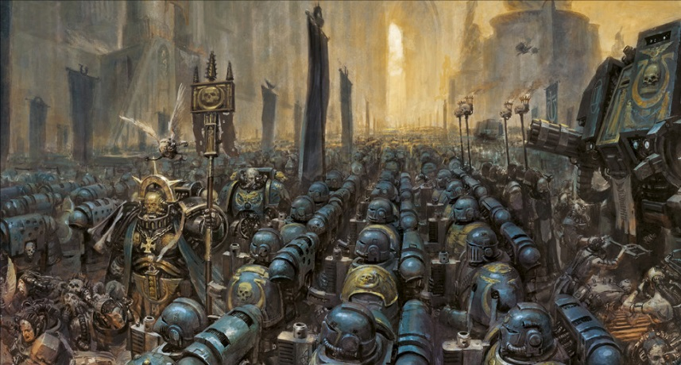
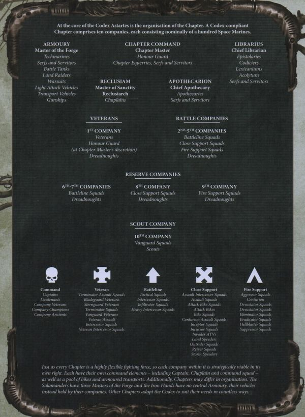
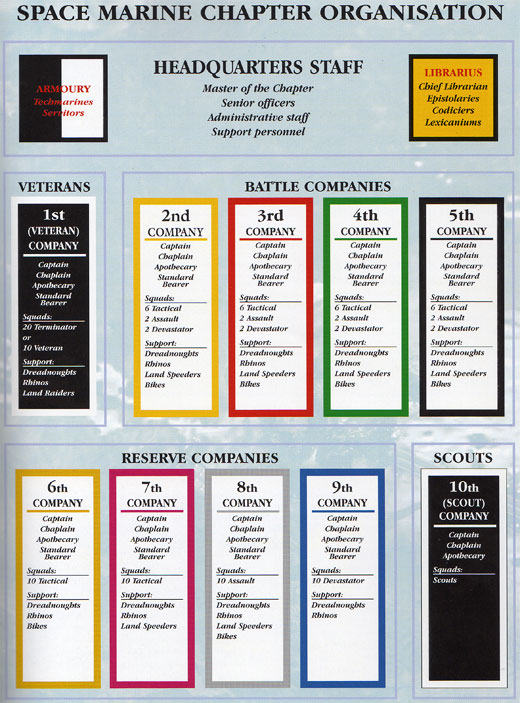
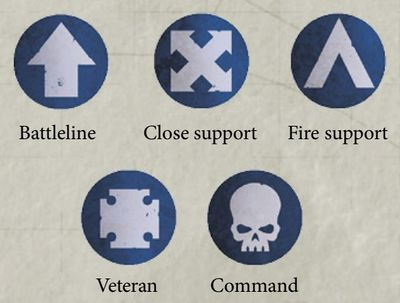

# 0231 阿斯塔特圣典 Codex Astartes

精校状态：中文行文已逐段精校，部分术语仍为暂定

分类：通用概念 / 帝国 Imperium / 中央政务部 Adeptus Terra / 阿斯塔特修会 Adeptus Astartes

原文来源：https://www.bilibili.com/opus/988442742727114803

原作者：帝国神选罐头

原文时间：编辑于 2025年01月06日 16:14

[返回分类目录](目录.md) · [全书目录](../../目录.md)

<!-- A0231-B0001 -->
**英文原文**

The Codex Astartes is the doctrine of the Space Marine Chapters, governing all aspects of Chapter organisation and battlefield tactics. For any given tactical situation, the Codex has hundreds of pages devoted to how it may be met and overcome. The wisdom of thousands of Imperial warriors has contributed to the Codex, and details on everything from unit markings to launching a full-scale planetary assault are contained within its pages.

<!-- /A0231-B0001 -->

<!-- A0231-B0002 -->

原译文

阿斯塔特圣典是星际战士战团的信条，管理着战团组织和战场战术的各个方面。对于任何给定的战术情景，法典都有数百页专门讨论如何应对和克服这种情况。数千名帝国战士的智慧贡献给了圣典，从单位标记到发动全面的行星攻击的所有细节都包含在其中。

**校订译文**

《阿斯塔特圣典》是星际战士战团的纲领，涵盖战团组织与战场战术的各个方面。针对任何一种战术局面，圣典都有数百页论述，说明如何应对并取胜。它汇集了数千名帝国战士的智慧，从部队标识到全面行星突击，无不详加阐述。

<!-- /A0231-B0002 -->

<!-- A0231-B0003 图片 -->

<!-- A0231-B0004 -->

原译文

The Ultramarines chapter assembled for battle 极限战士战团为战斗而集结

**校订译文**

The Ultramarines chapter assembled for battle 极限战士战团为战斗而集结

<!-- /A0231-B0004 -->

<!-- A0231-B0005 -->
**英文原文**

The Codex was written and formalised after the Horus Heresy by the Primarch of the Ultramarines, Roboute Guilliman. Some Chapters, such as the Ultramarines and their successors, regard the Codex as a holy text, and follow it without question. Many other chapters also follow the Codex, though not always as strictly as the Ultramarines; these two types of chapters are collectively known as Codex Chapters. Among the Ultramarines, each battle brother must memorise whole sections of the codex, so that within a company there exists an entire record of the text.

<!-- /A0231-B0005 -->

<!-- A0231-B0006 -->

原译文

圣典是在荷鲁斯叛乱之后由极限战士的原体罗伯特·基里曼撰写并正式化的。一些战团，如极限战士及其子战团，将圣典视为神圣的经文，并毫无疑问地遵循它。许多其他战团也遵循圣典，尽管并不总是像极限战士那样严格；这两类战团统称为圣典战团。在极限战士中，每个战斗兄弟都必须记住圣典的整个部分，这样在一个连队内就存在着完整的文档记录。

**校订译文**

荷鲁斯之乱之后，极限战士原体罗保特·基里曼撰写并确立了《阿斯塔特圣典》。极限战士及其部分子战团将它奉为圣典，不加质疑地遵行；另有许多战团同样采用圣典，却未必像极限战士那样严格。这两类战团统称圣典战团。极限战士的每名战斗兄弟都须背诵其中若干完整章节，确保一个连的成员合起来能够记住整部圣典。

<!-- /A0231-B0006 -->

<!-- A0231-B0007 图片 -->

<!-- A0231-B0008 -->

原译文

Organization of a Codex-Compliant Space Marine Chapter since the introduction of Primaris Space Marines 自引入原铸星际战士以来符合圣典的星际战士战团组织

**校订译文**

Organization of a Codex-Compliant Space Marine Chapter since the introduction of Primaris Space Marines 自引入原铸星际战士以来符合圣典的星际战士战团组织

<!-- /A0231-B0008 -->

<!-- A0231-B0009 -->
## History 历史

<!-- /A0231-B0009 -->

<!-- A0231-B0010 -->
**英文原文**

In the aftermath of the Horus Heresy, the Emperor had been incapacitated, and the Space Marines' numbers had been decimated by defections to Chaos and battle losses. With the Emperor confined to the Golden Throne the High Lords of Terra found themselves the new leaders of the Emperor's domain. Both the High Lords and surviving Primarchs became paranoid of the possibility of such events repeating themselves. The armies of the Emperor once again scoured the galaxy seeking out all forms of heresy and removing even the slightest chance of rebellion. The Ultramarines were left as the largest loyal legion, and Guilliman assumed the title of Lord Commander of the Imperium. Concerned that once again their could be a threat from such a terrible force each Legion was to be divided into smaller Chapters and a new set of regulations would be created to govern them.

<!-- /A0231-B0010 -->

<!-- A0231-B0011 -->

原译文

荷鲁斯叛乱事件发生后，帝皇丧失了能力，星际战士的人数因叛逃到混沌和战斗损失而大量减少。随着帝皇被限制在黄金王座上，泰拉的高领主们发现自己成为了帝皇领地的新领导人。无论是高领主还是幸存的原体，都对此类事件重演的可能性产生了偏执。帝皇的军队再次搜查银河系，寻找各种形式的异端，甚至消除了最轻微的叛乱可能。极限战士成为最大的忠诚军团，基里曼获得了领主指挥官的头衔。担心他们可能再次受到如此可怕的力量的威胁，每个军团都将被分成更小的战团，并制定一套新的规则来管理他们。

**校订译文**

荷鲁斯之乱结束时，帝皇已经失去行动能力，星际战士则因大量成员投向混沌和惨重战损而人数锐减。帝皇被困于黄金王座，泰拉高领主遂成为帝国的新统治者。高领主与幸存原体都极度惧怕悲剧重演，帝皇的军队因此再次扫荡银河，铲除各种异端，力图消灭哪怕最微小的叛乱隐患。极限战士成为残存忠诚军团中规模最大者，基里曼则就任帝国最高统帅。为了防止如此庞大的军事力量再度构成威胁，各军团将被拆分为较小的战团，并接受一套新规章的约束。

<!-- /A0231-B0011 -->

<!-- A0231-B0012 -->
**英文原文**

The Codex Astartes was a code developed by Guilliman. This tome would contain everything a member of the Astartes would need to know to function. From recruitment to organization to tactics and beyond the Codex Astartes became a sacred text to the majority of the Chapters. One of the most significant changes under the new Codex was the newly founded Chapters. Where the Legions could number more than 10,000 strong the Chapters would be limited to about a thousand. Each original Legion would be divided as many times as needed into successor Chapters. This division would come to be called the Second Founding seven years after the Horus Heresy, in 021.M31. The remaining thousand bodies in the original Legion would also survive as a new Chapter of the same name. While these newly created Chapters claimed their founders origins, such as their Primarch, they would also come to develop their own culture and customs. Rogal Dorn initially rejected the Codex Astartes and enmity developed between him and Guilliman. Dorn called Guilliman a coward, citing his lack of participation in the defense of the Imperial Palace. Guilliman accused Dorn of being a rebel for refusing the Codex. This enmity quickly involved other Space Marine Legions and a rift developed, Leman Russ of the Space Wolves stood by the Imperial Fists, while Jaghatai Khan of the White Scars and Corax of the Raven Guard supported the Ultramarines. A second civil war appeared likely when the Imperial Fists strike cruiser Terrible Angel was fired upon by the Imperial Navy in connection with Codex crisis.

<!-- /A0231-B0012 -->

<!-- A0231-B0013 -->

原译文

阿斯塔特圣典是基里曼制定的法典。这本书包含一名阿斯塔特成员的运作所需知晓的一切。从招募到组织再到战术，以及阿斯塔特圣典之外的内容成为大多数战团的神圣经文。新圣典下最重要的变化之一是新成立的战团。如果军团人数超过10000人，那么战团将限制在大约1000人。每个初创军团将根据需要多次划分成子战团。这个在荷鲁斯叛乱七年后的021.M31的划分被称为二次建军。初创军团中剩下的1000人作为同名的新战团继续存在。虽然这些新成立的战团拥有他们的建军起源，比如他们的原体，但他们也会发展自己的文化和习俗。罗格·多恩最初拒绝了阿斯塔特圣典，他和基里曼之间产生了敌意。多恩称基里曼为懦夫，理由是他没有参与皇宫的防御。基里曼指责多恩拒绝接受圣典，是一名叛逆者。这种敌意很快就涉及到了其他星际战士，并产生了分歧，太空野狼的黎曼·鲁斯站在帝国之拳一侧，而白色伤疤的察合台可汗和暗鸦守卫的科拉克斯则支持极限战士。当帝国之拳的打击巡洋舰“恐怖天使号”因圣典危机被帝国海军开火攻击时，第二次内战似乎很可能爆发。

**校订译文**

基里曼制定的《阿斯塔特圣典》囊括阿斯塔特履行职责所需的一切知识，从募兵、编制到战术，以及更多领域，逐渐被大多数战团奉为神圣经典。最重大的改革之一，就是建立新式战团。军团兵力可以超过一万人，战团则限于约一千人；每个原有军团依规模拆分出若干子战团。这一行动发生于荷鲁斯之乱结束七年后的 021.M31，称为第二次建军。原军团余下的一千人，则继承原名，成为同名战团。各子战团承认共同的原体与血脉来源，同时逐渐形成自己的文化和习俗。罗格·多恩起初拒绝接受圣典，与基里曼交恶。他指责未能参加皇宫保卫战的基里曼是懦夫；基里曼则把多恩拒绝圣典的行为视为叛逆。争端很快波及其他军团：太空野狼的黎曼·鲁斯支持帝国之拳，白疤的察合台可汗与暗鸦守卫的科拉克斯支持极限战士。圣典危机期间，帝国海军向帝国之拳的打击巡洋舰恐怖天使号开火，第二场内战似乎一触即发。

<!-- /A0231-B0013 -->

<!-- A0231-B0014 -->
**英文原文**

However, Dorn ultimately relented after spending seven days meditating in the pain glove. There, he concluded that the Legion could no longer serve the Emperor who had been and must serve the Emperor who was, which involved accepting the new order of which the Codex was a part.

<!-- /A0231-B0014 -->

<!-- A0231-B0015 -->

原译文

然而，多恩在用痛苦手套冥想了七天后最终让步了。在那里，他得出结论，军团不能只为曾经的帝皇服务，也必须为现在的帝皇服务。这涉及接受圣典所属的新秩序。

**校订译文**

多恩在痛苦手套中冥想七日后，最终作出让步。他意识到，军团不能再只侍奉昔日的帝皇，而必须侍奉如今的帝皇；这意味着接受包含《阿斯塔特圣典》在内的新秩序。

<!-- /A0231-B0015 -->

<!-- A0231-B0016 -->
## Deviations 偏离

<!-- /A0231-B0016 -->

<!-- A0231-B0017 -->
**英文原文**

Secretly, however, Dorn formulated his own protocol to possibly circumvent the Codex Astartes known as the Last Wall, a code phrase that would require the Imperial Fists and the Successor Chapters to bind together under one supreme commander.

<!-- /A0231-B0017 -->

<!-- A0231-B0018 -->

原译文

然而，多恩秘密制定了可以绕过阿斯塔特圣典被称为“最终高墙”的自己的协议，这是一个密语，要求帝国之拳和子战团在一个最高指挥官的领导下团结在一起。

**校订译文**

不过，多恩另在暗中制定了可能绕过圣典限制的“最终高墙”协议。一旦这一暗语发出，帝国之拳及其子战团便须重新集结，接受一位最高指挥官的统一领导。

<!-- /A0231-B0018 -->

<!-- A0231-B0019 -->
**英文原文**

Likewise, the Dark Angels and their successors, while dividing into chapters, have remained united in their single-minded pursuit of the Fallen.

<!-- /A0231-B0019 -->

<!-- A0231-B0020 -->

原译文

同样，黑暗天使和他们的子战团虽然分为不同的战团，但他们仍然团结一心，一心一意地追捕堕天使。

**校订译文**

同样，黑暗天使和他们的子战团虽然分为不同的战团，但他们仍然团结一心，一心一意地追捕堕天使。

<!-- /A0231-B0020 -->

<!-- A0231-B0021 -->
**英文原文**

The Space Wolves Legion, however, never fully accepted the new doctrine; rather they held sacred the teachings of their Primarch, Leman Russ. For that reason, the Wolves consist of twelve Great Companies, rather than the ten mandated by the Codex, and their system of organization and promotion bears little resemblance to that of hardline Codex chapters, such as the Ultramarines. Although the Space Wolves attempted to create Successor Chapters, the genetic instability of their gene-seed made a disaster of their first (and possibly last) attempt, the ill-fated Wolf Brothers.

<!-- /A0231-B0021 -->

<!-- A0231-B0022 -->

原译文

然而，太空野狼军团从未完全接受这一新教条；相反，他们认为他们的原体黎曼·鲁斯的教义是神圣的。因此，太空野狼由十二个大连组成，而不是圣典规定的十个连队，他们的组织和晋升体系与坚定的圣典战团（如极限战士）几乎没有相似之处。尽管太空野狼试图创建子战团，但他们基因种子的不稳定遗传给他们的第一次（也可能是最后一次）尝试——命运多舛的狼兄弟——带来了灾难。

**校订译文**

然而，太空野狼军团从未完全接受这一新教条；相反，他们认为他们的原体黎曼·鲁斯的教义是神圣的。因此，太空野狼由十二个大连组成，而不是圣典规定的十个连队，他们的组织和晋升体系与坚定的圣典战团（如极限战士）几乎没有相似之处。尽管太空野狼试图创建子战团，但他们基因种子的不稳定遗传给他们的第一次（也可能是最后一次）尝试——命运多舛的狼兄弟——带来了灾难。

**校注：** 本段说野狼兄弟可能是太空野狼最后一次建立子战团的尝试，与后文原铸时代的狼矛等名单存在年代差异；保留英文历史视角，未删改。

<!-- /A0231-B0022 -->

<!-- A0231-B0023 -->
**英文原文**

In the immediate aftermath of the Heresy, Nassir Amit, the founder and first chapter master of the Flesh Tearers, expressed little but scorn for the Codex, finding it amusing that Guilliman, who had been absent from the Battle of Terra, should think himself fit to impose restrictions on the other Legions.

<!-- /A0231-B0023 -->

<!-- A0231-B0024 -->

原译文

叛乱事件发生后，撕肉者的建立者和初代战团长纳西尔·阿密特对圣典表示蔑视，他觉得很有趣，因为基里曼没有参加泰拉战役，他却认为自己适合对其他军团施加限制。

**校订译文**

叛乱刚结束时，撕肉者创立者兼首任战团长纳西尔·阿米特对圣典几乎只有轻蔑。在他看来，未参加泰拉之战的基里曼竟自认有资格限制其他军团，实在可笑。

<!-- /A0231-B0024 -->

<!-- A0231-B0025 图片 -->

<!-- A0231-B0026 -->

原译文

Pre-Primaris Space Marine Codex Astartes Space Marine Chapter organisational chart. 阿斯塔特圣典原铸星际战士组织结构图。

**校订译文**

Pre-Primaris Space Marine Codex Astartes Space Marine Chapter organisational chart. 原铸出现前，《阿斯塔特圣典》规定的星际战士战团组织结构图。

<!-- /A0231-B0026 -->

<!-- A0231-B0027 -->
## Recent Reforms 近期改革

<!-- /A0231-B0027 -->

<!-- A0231-B0028 -->
**英文原文**

After the resurrection of Guilliman in late M41, he began to see many of the flaws that came from overly-strict adherence to the Codex Astartes. As a result, he has reformed much of the Codex and eliminated much of its restrictions on Space Marines. New additions include the addition of Primaris Space Marine formations such as Intercessor, Aggressor, Inceptor, and Reiver Squads, as well as the inclusion of two Space Marine Lieutenants below the Company Captain, each commanding a demi-Company. Furthermore, Squads in the Codex Astartes are now defined as Battleline, Close Support, or Fire Support Squads. These formations exist alongside Veteran Squads, Scout Squads, and Vanguard Space Marine Squads.

<!-- /A0231-B0028 -->

<!-- A0231-B0029 -->

原译文

基里曼在M41晚期复活后，他开始看到许多因过于严格遵守阿斯塔特圣典而产生的缺陷。因此，他对圣典的大部分内容进行了改革，并取消了对星际战士的大部分限制。新增加的包括增加原铸星际战士编队，如仲裁者、侵略者、先驱者和掠夺者小队，以及在连长之下增加两名星际战士副官，每人指挥半个连队。此外，阿斯塔特圣典中的小队现在被定义为战线、近战支援或火力支援小队。这些编队与老兵小队、侦察小队和先锋星际战士小队并存。

**校订译文**

基里曼在 M41 末复苏后，逐渐认识到机械地严守圣典所造成的诸多弊端，遂大幅修订圣典，取消许多对星际战士的限制。新增内容包括仲裁者、侵略者、先驱者、掠夺者等原铸小队，并在连长之下增设两名副官，各指挥半连。小队的职责类别也被重新划分为战线、近战支援和火力支援；这些部队与老兵小队、侦察小队及先锋星际战士小队共同构成战团。

<!-- /A0231-B0029 -->

<!-- A0231-B0030 -->
**英文原文**

This means the number of squads in a perfectly compliant chapter are now 44 Battleline, 18 Close Support, and 18 Fire Support, in addition to 10 squads of veterans and 10 squads of scouts and Vanguard Space Marines, spread across the chapter's companies as detailed below.

<!-- /A0231-B0030 -->

<!-- A0231-B0031 -->

原译文

这意味着，一个完全合规的战团中的小队数量现在是44个战线小队、18个近战支援小队和18个火力支援小队，此外还有10个老兵小队、10个侦察兵小队和先锋星际战士小队，分布在该战团的各个连队中，详见下文。

**校订译文**

这意味着，一个完全合规的战团中的小队数量现在是44个战线小队、18个近战支援小队和18个火力支援小队，此外还有10个老兵小队、10个侦察兵小队和先锋星际战士小队，分布在该战团的各个连队中，详见下文。

**校注：** 英文 ten squads of scouts and Vanguard Space Marines 的计数范围含混。本书其他条目明确侦察兵外另有百名常备先锋，原译保留，不将侦察兵与先锋强行合并为十个小队。

<!-- /A0231-B0031 -->

<!-- A0231-B0032 -->
**英文原文**

Guilliman ultimately intends to replace the Codex Astartes with the Codex Imperialis.

<!-- /A0231-B0032 -->

<!-- A0231-B0033 -->

原译文

基里曼最终打算用帝国圣典取代阿斯塔特圣典。

**校订译文**

基里曼最终打算用帝国圣典取代阿斯塔特圣典。

<!-- /A0231-B0033 -->

<!-- A0231-B0034 -->
## Organisational Doctrine 组织学说

<!-- /A0231-B0034 -->

<!-- A0231-B0035 -->
**英文原文**

Every Chapter should be led by the Chapter Master, an accomplished warrior and strategists who coordinates the Chapter's strenght as a whole, assisted in his tasks by various headquarters staff (including any Honour Guard and the Chapter Champion), the Chapter's servitors and serfs.

<!-- /A0231-B0035 -->

<!-- A0231-B0036 -->

原译文

每个战团都应该由战团长领导，他是一位有成就的战士和战略家，负责协调战团的整体力量，并由各指挥部职员（包括任何荣誉卫队和战团冠军）、战团的机仆和奴工辅助完成任务。

**校订译文**

每个战团都应该由战团长领导，他是一位有成就的战士和战略家，负责协调战团的整体力量，并由各指挥部职员（包括任何荣誉卫队和战团冠军）、战团的机仆和奴工辅助完成任务。

<!-- /A0231-B0036 -->

<!-- A0231-B0037 -->
**英文原文**

Existing outside the Company level organisation, each chapter has an Armoury consisting of the chapter's Techmarines Tanks, Gunships and vehicle staff (pilots, gunners) as it can muster, a Reclusiam hosting the Chaplains, a Librarium hosting the Librarians, and a combat-capable Chapter Fleet.

<!-- /A0231-B0037 -->

<!-- A0231-B0038 -->

原译文

存在于连级组织之外，每个战团都有一个军械库，由该战团的技术军士，坦克、炮艇和载具组人员（飞行员、炮手）组成，一个牧师主持的隐修会，一个智库馆员主持的智库，以及一个有作战能力的战团舰队。

**校订译文**

在连队编制之外，每个战团还设有军械库，统管科技战士、坦克、炮艇及驾驶员、炮手等载具人员；教士驻于隐修室，智库员驻于智库馆，战团另维持一支具备作战能力的舰队。

<!-- /A0231-B0038 -->

<!-- A0231-B0039 -->
**英文原文**

The Codex states that a Space Marine Chapter should be split into 10 companies of 100 Marines each, lead by a Space Marine Captain. Previously, each company would also include a Chaplain, an Apothecary, and a Standard Bearer. After the recent reforms, those specialists were replaced by 2 Lieutenants, each commanding a demi-company, and a Command Squad, composed of 2 Veterans, a Company Ancient, and a Company Champion.

<!-- /A0231-B0039 -->

<!-- A0231-B0040 -->

原译文

圣典规定，星际战士战团应分为10个连，每个连有100名星际战士，由一名星际战士连长领导。此外，每个连队还将包括一名牧师、一名药剂师和一名标准旗手。在最近的改革之后，这些专家被2名副官取代，每人指挥半个连队，以及一个由两名老兵、一名连队旗手和一名连队冠军组成的指挥小队。

**校订译文**

圣典规定，战团分为十个连，每连一百名星际战士，由一名连长统率。此前，每连还配有一名教士、一名药剂师和一名旗手。按本段对近期改革的描述，这些职位被两名副官及一个指挥小队取代：副官各指挥半连，指挥小队则由两名老兵、一名连队旗手和一名连队冠军组成。

**校注：** 原文声称教士、药剂师等在改革后被副官与指挥小队取代，但本篇后文仍列这些职位；正文归于本段描述，保留疑点待核。

<!-- /A0231-B0040 -->

<!-- A0231-B0041 -->
## Organigram of a Codex Compliant Chapter 符合圣典的战团组织结构

<!-- /A0231-B0041 -->

<!-- A0231-B0042 -->
## CHAPTER COMMAND 战团指挥部

原题：CHAPTER COMMAND 连队指挥

<!-- /A0231-B0042 -->

<!-- A0231-B0043 -->
## Master of the Chapter 战团长

<!-- /A0231-B0043 -->

<!-- A0231-B0044 -->
## Honour Guard 荣誉卫队

<!-- /A0231-B0044 -->

<!-- A0231-B0045 -->
## Chapter Serfs 战团农奴

原题：Chapter Serfs 战团奴工

<!-- /A0231-B0045 -->

<!-- A0231-B0046 -->
## Armoury 军械库 Reclusiam 隐修室

原题：Armoury 军械库 Reclusiam 隐修会

<!-- /A0231-B0046 -->

<!-- A0231-B0047 -->
## Librarius 智库 Apothecarion 药剂部 Chapter Fleet 战团舰队

<!-- /A0231-B0047 -->

<!-- A0231-B0048 -->
## Veterans 老兵

<!-- /A0231-B0048 -->

<!-- A0231-B0049 -->
## 4 Battle Companies 四个战斗连队

<!-- /A0231-B0049 -->

<!-- A0231-B0050 -->
## 4 Reserve Companies

<!-- /A0231-B0050 -->

<!-- A0231-B0051 -->
## 四个预备连队

<!-- /A0231-B0051 -->

<!-- A0231-B0052 -->
## Vanguard 先锋

<!-- /A0231-B0052 -->

<!-- A0231-B0053 -->
## Codex heraldry 圣典纹章

<!-- /A0231-B0053 -->

<!-- A0231-B0054 -->
**英文原文**

Each Space Marine company should use a specific heraldic symbol and color.

<!-- /A0231-B0054 -->

<!-- A0231-B0055 -->

原译文

每个星际战士连队都应该使用特定的纹章符号和颜色。

**校订译文**

每个星际战士连队都应该使用特定的纹章符号和颜色。

<!-- /A0231-B0055 -->

<!-- A0231-B0056 -->
## Veteran Company 老兵连队

<!-- /A0231-B0056 -->

<!-- A0231-B0057 -->
**英文原文**

The 1st Company is the most powerful company, consisting entirely of Veteran Space Marines. In addition to having access to the Chapter's rarest and most advanced technology, the 1st Company is the only one trained in and equipped with Terminator Armour. The veterans of the 1st are attached to other Space Marine strike forces rather than the entire formation fighting as one. When serving with other formations they serve as peerless mentors and heroes of legend as well as the most experienced shock troops.

<!-- /A0231-B0057 -->

<!-- A0231-B0058 -->

原译文

第一连是最强大的连，完全由星际战士老兵组成。除了可以使用本战团最稀有、最先进的技术外，第一连是唯一一个接受过终结者装甲训练并配备了终结者装甲的连队。第一连的老兵依附于其他星际战士打击部队，而不是整个编队作为一个整体作战。当与其他编队一起服役时，他们是无与伦比的指导者和传奇英雄，也是最有经验的突击部队。

**校订译文**

第一连由全战团的老兵组成，是最强大的连队。他们可使用战团最稀有、最先进的技术装备，也是唯一接受终结者护甲训练并获配此类护甲的连队。第一连通常不整连行动，而是把老兵分派到各支星际战士突击部队中。随其他部队作战时，他们既是卓越的导师和传奇英雄，也是经验最丰富的突击战士。

<!-- /A0231-B0058 -->

<!-- A0231-B0059 -->
**英文原文**

There are several types of Squads fielded by the Veteran Company. These include Terminator Squads, Sternguard Veteran and Vanguard Veteran Squads, and Bladeguard Veteran Squads.

<!-- /A0231-B0059 -->

<!-- A0231-B0060 -->

原译文

老兵连派遣了多种类型的队伍。其中包括终结者小队、肃卫老兵和先锋老兵小队以及剑卫老兵小队。

**校订译文**

老兵连派遣了多种类型的队伍。其中包括终结者小队、肃卫老兵和先锋老兵小队以及剑卫老兵小队。

<!-- /A0231-B0060 -->

<!-- A0231-B0061 -->
## Battle Companies 战斗连队

<!-- /A0231-B0061 -->

<!-- A0231-B0062 -->
**英文原文**

The 2nd, 3rd, 4th, and 5th Companies are known as Battle Companies, as they generally form the main battle force deployed for engagements. These are highly flexible formations that are the principle fighting forces of the Chapter. Each Company is led by a Captain with two supporting Lieutenants. Support staff includes a Company Champion, and Company Ancient and Company Veterans, the most experienced and peerless warriors of the Company. In times of war the Battle Company may also be accompanied by one or more Chaplain, Librarians and Techmarines. In addition to their command duties, each Company Captain also has a number of titles and duties. Examples include the 2nd Company Captain holding the title of the Master of the Watch, the 4th as the Master of the Fleet, and the 5th as the Master of the Marches.

<!-- /A0231-B0062 -->

<!-- A0231-B0063 -->

原译文

第二、第三、第四和第五连被称为战斗连队，因为它们通常构成为交战部署的主战部队。这些是高度灵活的编队，是该战团的主要作战力量。每个连由一名连长和两名副官领导。支援人员包括一名连队冠军、连队旗手和连队老兵，他们是连队最有经验、最无与伦比的战士。在战争时期，战斗连也可能由一名或多名牧师、智库和技术军士陪同。除了指挥职责外，每个连长还有许多头衔和职责。例如，第二连长拥有守望之主的头衔，第四连长拥有舰队之主的称号，第五连长拥有行军之主的称号。

**校订译文**

第二至第五连称为战斗连，是战团灵活多变的主要作战力量。每连由一名连长统率、两名副官协助，另有连队冠军、连队旗手及连队老兵等最资深的精锐战士辅佐。战时还可能有一名或多名教士、智库员和科技战士随军。各连长除了指挥职责，还兼有其他头衔与事务，例如第二连长兼任守望大师，第四连长兼任舰队大师，第五连长兼任行军大师。

<!-- /A0231-B0063 -->

<!-- A0231-B0064 -->
**英文原文**

Each Battle Company principally has ten squads:

<!-- /A0231-B0064 -->

<!-- A0231-B0065 -->

原译文

每个战斗连主要有十个小队：

**校订译文**

每个战斗连主要有十个小队：

<!-- /A0231-B0065 -->

<!-- A0231-B0066 -->

原译文

six Battleline Squads 六个战线小队

**校订译文**

six Battleline Squads 六个战线小队

<!-- /A0231-B0066 -->

<!-- A0231-B0067 -->

原译文

two Close Support Squads 两个近战支援小队

**校订译文**

two Close Support Squads 两个近战支援小队

<!-- /A0231-B0067 -->

<!-- A0231-B0068 -->

原译文

two Fire Support Squads. 两个火力支援小队

**校订译文**

two Fire Support Squads. 两个火力支援小队

<!-- /A0231-B0068 -->

<!-- A0231-B0069 -->
**英文原文**

The Codex, however, makes provisions for there to be twenty squads, for when squads from the reserve companies are attached. Additionally, a Company's squads can be split in two, forming combat squads. Each Company is in turn split into two demi-Companies, each led by a Lieutenant. The Companies go to war with their own arsenal of wargear and specialist equipment including Phobos Armour, Gravis Armour, Centurion Warsuits, Invictor Warsuits, Land Speeders, Rhinos, Impulsors, Razorbacks, Dreadnoughts, and Bikes. An entire company can fight in stealth if there is enough Phobos Armour to equip them all. The Company Captain can request additional vehicle assets from the armoury in the form of Battle Tanks and aircraft.

<!-- /A0231-B0069 -->

<!-- A0231-B0070 -->

原译文

然而，圣典规定，当预备连的小队加入时，将有20个小队。此外，一个连的小队可以分成两个，组成战斗小队。每个连又分为两个分连，每个分连由一名副官领导。这些连队带着自己的武器和专业装备作战，包括普罗比斯装甲、格拉维斯装甲、百夫长战甲、不败者战甲、兰德掠袭者、犀牛战车、反击者坦克、豪猪战车、无畏机甲和摩托。如果有足够的普罗比斯装甲来装备他们，整个连队都可以隐秘作战。连长可以要求军械库以战斗坦克和战机的形式提供额外的载具资源。

**校订译文**

圣典也允许战斗连接纳预备连的小队，将规模扩大到二十个小队。一个小队还可以分为两个战斗分队；每个连则分成两个半连，分别由副官统率。连队携带自己的武器与专用装备出战，包括恐惧型护甲、重装型护甲、百夫长战甲、不败者战术机甲、兰德速攻艇、犀牛战车、脉冲战车、豪猪战车、无畏机甲和摩托。若恐惧型护甲充足，甚至整连都能执行潜行作战。连长还可向军械库申请额外的主战坦克和飞行器。

**校注：** 纠正载具串译：Land Speeders 为兰德速攻艇，Impulsors 官译脉冲战车；原译分别误为兰德掠袭者和反击者。恐惧型护甲与重装型护甲按已核官方角色装备名统一。

<!-- /A0231-B0070 -->

<!-- A0231-B0071 -->
**英文原文**

Even the squads themselves can be broken down into a variety of roles should their Captain require it. Should 3 brothers be detached from their fire support squad to form an Eliminator Squad, the remaining seven can be formed into a Hellblaster Squad, pilot Invictor Warsuits, or fulfil a number of other roles including operating vehicles. Should the strength of a Battle Company be deemed insufficient, he will request support from one of the Reserve Companies, the formation of which depends on the mission. For instance, if he expects he will need fast-moving forces to rapidly secure ground or counter agile enemies, he will request Close Support Squads.

<!-- /A0231-B0071 -->

<!-- A0231-B0072 -->

原译文

如果连长需要，即使是小队本身也可以被分解为各种角色。如果3个兄弟从他们的火力支援小队中脱离出来，组成一个根除者小队，剩下的7个可以组成一个地狱轰击者小队、不败者机甲驾驶员，或履行一些其他作业，包括操作车辆。如果认为作战连的兵力不足，他将请求其中一个预备连的支援，预备连的组建取决于任务。例如，如果他预计需要快速移动的部队来快速保卫地面或对抗敏捷的敌人，他将请求近战支援小队。

**校订译文**

连长也可根据需要，将一个小队的成员分派为不同作战单位。例如，从火力支援小队抽出三名兄弟组成歼灭者小队后，余下七人可以组成地狱轰击者小队、驾驶不败者战术机甲，或承担驾驶其他载具等职责。若战斗连兵力不足，连长可向预备连请求支援，具体增援类型取决于任务：如果需要迅速夺取阵地或对付机动灵活的敌军，就会请求近战支援小队。

**校注：** Eliminator 是歼灭者，不是 Eradicator 根除者。

<!-- /A0231-B0072 -->

<!-- A0231-B0073 -->
## Reserve Companies 预备连队

<!-- /A0231-B0073 -->

<!-- A0231-B0074 -->
**英文原文**

The 6th, 7th, 8th and 9th Companies are the Reserve Companies, designed as training and reserve formations, used to bolster the Battle Companies in combat when needed.

<!-- /A0231-B0074 -->

<!-- A0231-B0075 -->

原译文

第6、第7、第8和第9连是预备连，被设计为训练和预备编队，用于在需要时支援战斗连。

**校订译文**

第6、第7、第8和第9连是预备连，被设计为训练和预备编队，用于在需要时支援战斗连。

<!-- /A0231-B0075 -->

<!-- A0231-B0076 -->
**英文原文**

Rather than formations of mixed squad types, Reserve Companies contain squads of the same strategic disposition.

<!-- /A0231-B0076 -->

<!-- A0231-B0077 -->

原译文

预备连不是混合小队类型的编队，而是包含具有相同战略部署的小队。

**校订译文**

预备连采用单一职责的小队编制，不混编多种职责的小队。

<!-- /A0231-B0077 -->

<!-- A0231-B0078 -->

原译文

the 6th and 7th Companies each maintain 10 Battleline Squads 第6和第7连各有10个战线小队

**校订译文**

the 6th and 7th Companies each maintain 10 Battleline Squads 第6和第7连各有10个战线小队

<!-- /A0231-B0078 -->

<!-- A0231-B0079 -->

原译文

the 8th is made of 10 Close Support squads 第8连由10个近战支援小队组成

**校订译文**

the 8th is made of 10 Close Support squads 第8连由10个近战支援小队组成

<!-- /A0231-B0079 -->

<!-- A0231-B0080 -->

原译文

the 9th is made of 10 Fire Support Squads 第9连由10个火力支援小队组成

**校订译文**

the 9th is made of 10 Fire Support Squads 第9连由10个火力支援小队组成

<!-- /A0231-B0080 -->

<!-- A0231-B0081 -->
**英文原文**

The Reserve Companies also embed additional specialities to provide the Chapter with the resources to fight campaigns. The 6th and 7th Companies undergo extensive training in vehicle piloting, the 8th specialize in storming defenses, and the 9th excel in providing devastating salvos of fire.

<!-- /A0231-B0081 -->

<!-- A0231-B0082 -->

原译文

预备役连还嵌入了额外的专长，为战团提供作战资源。第6和第7连广泛接受了载具驾驶培训，第8连专门从事突袭防御，第9连擅长提供毁灭性的齐射。

**校订译文**

预备连还培养额外专长，确保战团能够应付各种战役。第六和第七连广泛训练载具驾驶，第八连专精强攻防御工事，第九连擅长以毁灭性齐射提供火力。

<!-- /A0231-B0082 -->

<!-- A0231-B0083 -->
**英文原文**

Typically squads within the Reserve Companies will fight alongside a Battle Company, though on some occasion - particularly in a larger campaign - they might fight as a whole. Each Reserve Company has a leadership similar to a Battle Company, with a Captain, two Lieutenants, Chaplain, Apothecary, Ancient, and Company Veterans. Just as with the Battle Companies, the Captain of each Reserve Company also normally has an additional title and duties.

<!-- /A0231-B0083 -->

<!-- A0231-B0084 -->

原译文

通常，预备连内的小队会与战斗连并肩作战，但在某些情况下，尤其是在更大的战役中，他们可能会作为一个整体作战。每个预备连都有一个类似于战斗连的领导层，有一名连长、两名副官、牧师、药剂师、旗手和连队老兵。与战斗连一样，每个预备连的连长通常也有额外的头衔和职责。

**校订译文**

预备连通常将小队派往战斗连协同作战，但在某些场合，尤其是大型战役中，也会整连出动。其指挥体系与战斗连相似，设连长、两名副官、教士、药剂师、旗手和连队老兵。各预备连长通常也兼有额外头衔与职责。

<!-- /A0231-B0084 -->

<!-- A0231-B0085 -->
**英文原文**

After graduating from the 10th Company, the first destination for a new Space Marine is the Reserve Companies. In the 9th they hone their understanding of wider strategy in the application of heavy firepower, in the 8th they learn the value of rapid assault and the importance of constant movement, while in the 6th and 7th they prove to their brothers and commanders that have assimilated these teachings. After mastering their aspects of war and have demonstrated enough worth will they be promoted to the Battle Companies.

<!-- /A0231-B0085 -->

<!-- A0231-B0086 -->

原译文

从第十连毕业后，新星际战士的第一个目的地是预备连。在第九连，他们磨练了对重型火力的应用中更广泛战略的理解，在第八连，他们学习了快速进攻的价值和不断移动的重要性，而在第六连和第七连，他们向他们的兄弟和指挥官证明了他们已经吸收了这些教导。在掌握了战争的各个方面并表现出足够的价值后，他们将被晋升到战斗连队。

**校订译文**

从第十连完成训练后，新晋星际战士首先进入预备连。他们在第九连学习如何运用重型火力，并理解更广泛的战略；在第八连体会快速突击与保持机动的重要性；再到第六或第七连，向兄弟和指挥官证明自己已融会贯通。只有掌握这些作战技能、充分证明自身价值后，才会晋升进入战斗连。

<!-- /A0231-B0086 -->

<!-- A0231-B0087 -->
## Scout Company 侦察连

原题：Scout Company 侦查连队

<!-- /A0231-B0087 -->

<!-- A0231-B0088 -->
**英文原文**

The 10th Company, also known as the Scout Company, is the first destination for any new Neophyte of the Chapter once they have moved passed the Aspirant stage. There are no regulations dictated in the Codex as to the number of Neophytes a Chapter may have and the recruitment rate is not fixed and methods differ between Chapters. The Neophytes of the 10th have yet to earn the Black Carapace, the final implant that allows them to operate their Power Armour efficiently. Officers of the 10th all closely observe the members of the Company and teach them the way of the Bolter and blade. They also learn how to pilot Bikes and Land Speeders as well as concepts such as tactical withdrawals, target prioritizing, stealth, reconnaissance, and sabotage. Using these lessons they form the intelligence branch of the Chapter that undertake a variety of missions such as picking off sentries, cutting down enemy patrols, supply disruption, and battlefield reconnaissance. In war, they undertake these hazardous missions to measure their strength and ascertain who truly has the skill required to be a true Space Marine. Much like those of the Reserve Companies, members of the 10th are usually assigned to other Companies in war and rarely go to battle as a whole unit.

<!-- /A0231-B0088 -->

<!-- A0231-B0089 -->

原译文

第10连，也被称为侦查连，是该战团任何新进者在通过有志者阶段后的第一个目的地。圣典中没有规定一个战团可以拥有的新兵数量，招募率也不是固定的，战团之间的方法也不同。10连的新兵还没有获得黑色甲壳，这是最后一个植入物，可以让他们有效地操作他们的动力装甲。第十连的领袖们都密切观察着连队的成员，并教他们使用爆矢和刀刃的方法。他们还学习如何驾驶摩托和兰德速攻艇，以及战术撤退、目标优先级、隐秘行动、侦察和破坏等概念。利用这些经验教训，他们组成了该战团的情报部门，负责执行各种任务，如清除哨兵、消灭敌方巡逻队、中断供应和战场侦察。在战争中，他们执行这些危险的任务来衡量自己的实力，并确定谁真正具备成为一名真正的星际战士所需的技能。与预备连的成员非常相似，第10连的成员通常在战争中被分配到其他连，很少作为一个整体参加战斗。

**校订译文**

第十连又称侦察连，是有志者晋升为新进者后的首个归属。《阿斯塔特圣典》不限制战团可以拥有多少新进者；各战团的招募速度与方法也各不相同。这些新进者尚未植入最后一项器官——能让战士有效操纵动力甲的黑色甲壳。第十连的军官密切观察新兵，教授他们爆矢枪与刀剑的运用。他们还学习驾驶摩托和兰德速攻艇，以及战术撤退、目标优先排序、潜行、侦察与破坏。凭借这些技能，他们承担战团的情报工作，执行清除哨兵、歼灭巡逻队、破坏补给和战场侦察等任务。这些危险行动也用于检验新兵，判断谁真正具备成为正式星际战士的能力。与预备连类似，第十连在战时通常分派人员配属其他连队，极少整连出动。

<!-- /A0231-B0089 -->

<!-- A0231-B0090 -->
**英文原文**

Currently, the Scout Company wields a variety of formations besides the basic Scout Squads and Scout Bike formations. It also fields a force of 100 Vanguard Space Marines that may take to the field as Infiltrators, Incursors, Suppressors, Eliminators, and Reivers as well as piloting Invictor Warsuits. Unlike the Scouts, these Vanguard Space Marines are a standing and permanent force within the Company and represent the elite special operations arm of the Chapter.

<!-- /A0231-B0090 -->

<!-- A0231-B0091 -->

原译文

目前，侦查连除了基本的侦查小队和侦查摩托编队外，还拥有各种编队。它还部署了一支由100名先锋星际战士组成的部队，他们可以作为渗透者、入侵者、压制者、歼灭者和掠夺者以及驾驶不败者战术机甲进入战场。与侦查兵不同，这些先锋星际战士是连队内的一支常设部队，代表着该战团的精英特种作战力量。

**校订译文**

如今，侦察连除常规侦察小队与侦察摩托编队外，还拥有一支一百人的先锋星际战士部队。他们可作为渗透者、入侵者、压制者、歼灭者或掠夺者出战，也可驾驶不败者战术机甲。与仍在受训的侦察兵不同，先锋是连内永久编制的常备兵力，承担战团的精锐特种作战任务。

<!-- /A0231-B0091 -->

<!-- A0231-B0092 -->
## Heraldry 纹章

<!-- /A0231-B0092 -->

<!-- A0231-B0093 -->
**英文原文**

Each Chapter has its own unique colour scheme and Chapter Badge; however, Codex Chapters all follow a common heraldry system, though there are many slight variations from the system below.

<!-- /A0231-B0093 -->

<!-- A0231-B0094 -->

原译文

每个战团都有自己独特的配色方案和战团纹章；然而，圣典各战团都遵循一个共同的纹章系统，尽管与下面的系统有许多细微的差异。

**校订译文**

每个战团都有自己独特的配色方案和战团纹章；然而，圣典各战团都遵循一个共同的纹章系统，尽管与下面的系统有许多细微的差异。

<!-- /A0231-B0094 -->

<!-- A0231-B0095 -->
## Company Colours 连队颜色

<!-- /A0231-B0095 -->

<!-- A0231-B0096 -->
**英文原文**

Each Company has a unique colour that its members wear, commonly on the shoulder plate rims, but some chapters use chest eagles, bolter cases, knee pads, helmets, or other parts of a Space Marine's Power Armour:

<!-- /A0231-B0096 -->

<!-- A0231-B0097 -->

原译文

每个连队都有其成员佩戴的独特颜色，通常在肩甲边缘，但有些战团使用胸甲天鹰、爆矢枪标志、护膝、头盔或星际战士动力装甲的其他部分：

**校订译文**

各连拥有独特的识别色，通常涂在肩甲镶边上；有些战团则以胸甲天鹰、爆矢枪外壳、护膝、头盔或动力甲的其他部位标示：

<!-- /A0231-B0097 -->

<!-- A0231-B0098 -->

原译文

1st Company: White or Silver 第一连：白或银

**校订译文**

1st Company: White or Silver 第一连：白或银

<!-- /A0231-B0098 -->

<!-- A0231-B0099 -->
**英文原文**

(members of the 1st Company should also paint their helmet the company colour).

<!-- /A0231-B0099 -->

<!-- A0231-B0100 -->

原译文

（第一连的成员应将头盔也涂成连队颜色）。

**校订译文**

（第一连的成员应将头盔也涂成连队颜色）。

<!-- /A0231-B0100 -->

<!-- A0231-B0101 -->

原译文

2nd Company: Yellow or Gold 第二连：黄或金

**校订译文**

2nd Company: Yellow or Gold 第二连：黄或金

<!-- /A0231-B0101 -->

<!-- A0231-B0102 -->

原译文

3rd Company: Red 第三连：红

**校订译文**

3rd Company: Red 第三连：红

<!-- /A0231-B0102 -->

<!-- A0231-B0103 -->

原译文

4th Company: Green 第四连：绿

**校订译文**

4th Company: Green 第四连：绿

<!-- /A0231-B0103 -->

<!-- A0231-B0104 -->

原译文

5th Company: Black 第五连：黑

**校订译文**

5th Company: Black 第五连：黑

<!-- /A0231-B0104 -->

<!-- A0231-B0105 -->

原译文

6th Company: Orange 第六连：橘

**校订译文**

6th Company: Orange 第六连：橘

<!-- /A0231-B0105 -->

<!-- A0231-B0106 -->

原译文

7th Company: Purple 第七连：紫

**校订译文**

7th Company: Purple 第七连：紫

<!-- /A0231-B0106 -->

<!-- A0231-B0107 -->

原译文

8th Company: Grey 第八连：灰

**校订译文**

8th Company: Grey 第八连：灰

<!-- /A0231-B0107 -->

<!-- A0231-B0108 -->

原译文

9th Company: Light Blue 第九连：天蓝

**校订译文**

9th Company: Light Blue 第九连：天蓝

<!-- /A0231-B0108 -->

<!-- A0231-B0109 -->
**英文原文**

10th Company: Company colour is not displayed on their armour, because of their need to blend with their surroundings on reconnaissance missions.

<!-- /A0231-B0109 -->

<!-- A0231-B0110 -->

原译文

第十连：他们的盔甲上没有显示连的颜色，因为他们在执行侦察任务时需要与周围环境融为一体。

**校订译文**

第十连：他们的盔甲上没有显示连的颜色，因为他们在执行侦察任务时需要与周围环境融为一体。

<!-- /A0231-B0110 -->

<!-- A0231-B0111 -->
## Squad Markings 小队标记

<!-- /A0231-B0111 -->

<!-- A0231-B0112 -->
**英文原文**

The left shoulder plate of a Space Marine in Power Armour always shows the Marine's Chapter Badge. The right pad shows the squad badge, this shows the type of squad the marine belongs to and the number of his squad. Veteran Squads use a stylised version of the Crux Terminatus similar to a Cross Pattée, Tactical Squads use an arrow, Assault Squads use four perpendicular arrows pointing outwards and Devastator Squads use an inverted V. Space Marines in Terminator Armour wear the Crux Terminatus on their left pad, and their Chapter Badge on their right pad.

<!-- /A0231-B0112 -->

<!-- A0231-B0113 -->

原译文

身穿动力装甲的星际战士的左肩甲上总是显示着星际战士的徽章。下图显示了小队徽章，这显示了星际战士所属的小队类型和他的小队编号。老兵小队使用类似十字章的风格化版本的终结者十字，战术小队使用箭头，突击小队使用四个指向外部的垂直箭头，毁灭者小队使用倒置的V形。终结者装甲中的星际战士在左肩甲上佩戴终结者十字，在右肩甲上佩戴战团徽章。

**校订译文**

身穿动力甲的星际战士，左肩甲标示战团徽章，右肩甲标示所属小队的类型与编号。老兵小队使用类似宽臂十字的简化终结者十字；战术小队使用箭头；突击小队使用四个彼此成直角、向外指的箭头；破坏者小队使用倒 V 形。身穿终结者护甲的战士则在左肩甲佩戴终结者十字，右肩甲标示战团徽章。

**校注：** The right pad 指右肩甲，原译误作“下图”；perpendicular 指箭头彼此垂直，并非四个箭头均竖直。

<!-- /A0231-B0113 -->

<!-- A0231-B0114 图片 -->

<!-- A0231-B0115 -->

原译文

Organisational squad markings 组织小队标记

**校订译文**

Organisational squad markings 组织小队标记

<!-- /A0231-B0115 -->

<!-- A0231-B0116 -->
## Officers and Specialists 指挥官和专家

<!-- /A0231-B0116 -->

<!-- A0231-B0117 -->
**英文原文**

Captains wear the heraldry of their company, sometimes embellished with their own personal heraldry

<!-- /A0231-B0117 -->

<!-- A0231-B0118 -->

原译文

连长们佩戴着他们连队的徽章，有时还会装饰上他们自己的个人徽章

**校订译文**

连长们佩戴着他们连队的徽章，有时还会装饰上他们自己的个人徽章

<!-- /A0231-B0118 -->

<!-- A0231-B0119 -->
**英文原文**

Librarians wear blue armour, irrespective of what chapter they belong to, and wear their Chapter Badge as normal. (This practice is now widely ignored, even among the more standard chapters.)

<!-- /A0231-B0119 -->

<!-- A0231-B0120 -->

原译文

智库穿着蓝色盔甲，无论他们属于哪个战团，并正常佩戴他们的战团徽章。（这种做法现在被广泛忽视，即使在更标准的战团中也是如此。）

**校订译文**

智库员无论隶属何战团，都穿蓝色护甲，同时照常佩戴战团徽章。（按原文，这一惯例如今常被忽略，即使较遵循圣典的战团也不例外。）

<!-- /A0231-B0120 -->

<!-- A0231-B0121 -->
**英文原文**

Chaplains wear black armour, irrespective of what chapter they belong to, and wear their Chapter Badge as normal.

<!-- /A0231-B0121 -->

<!-- A0231-B0122 -->

原译文

牧师们穿着黑色盔甲，无论他们属于哪个战团，并正常佩戴他们的战团徽章。

**校订译文**

教士无论隶属何战团，都穿黑色护甲，同时照常佩戴战团徽章。

<!-- /A0231-B0122 -->

<!-- A0231-B0123 -->
**英文原文**

Techmarines wear red armour, irrespective of what chapter they belong to, and wear their Chapter Badge as normal.

<!-- /A0231-B0123 -->

<!-- A0231-B0124 -->

原译文

技术军士穿着红色盔甲，无论他们属于哪个战团，并正常佩戴他们的战团徽章。

**校订译文**

科技战士无论隶属何战团，都穿红色护甲，同时照常佩戴战团徽章。

<!-- /A0231-B0124 -->

<!-- A0231-B0125 -->
**英文原文**

Apothecaries wear white armour, irrespective of what chapter they belong to, and wear their Chapter Badge as normal.

<!-- /A0231-B0125 -->

<!-- A0231-B0126 -->

原译文

药剂师穿着白色盔甲，无论他们属于哪个战团，并正常佩戴他们的战团徽章。

**校订译文**

药剂师穿着白色盔甲，无论他们属于哪个战团，并正常佩戴他们的战团徽章。

<!-- /A0231-B0126 -->

<!-- A0231-B0127 -->
**英文原文**

Sergeants wear the same heraldry as their squad, but carry the squad's banner, which displays the Chapter Badge and the squad's number, plus a red skull (the symbol of a sergeant). Sergeants often paint their helmets red, or in some cases wear a red skull on their helmet instead.

<!-- /A0231-B0127 -->

<!-- A0231-B0128 -->

原译文

军士与他们的小队佩戴相同的徽章，但配有小队的标志，上面有战团徽章和小队编号，还有一个红色头骨（军士的象征）。军士们经常把头盔涂成红色，或者在某些情况下在头盔上配一个红色的头骨。

**校订译文**

军士采用与本小队相同的纹章，并携带标有战团徽章、小队编号及军士标志——红色颅骨的小队旗帜。他们通常将头盔涂红，也有些仅在头盔上绘制红色颅骨。

<!-- /A0231-B0128 -->

<!-- A0231-B0129 -->
**英文原文**

Veteran Sergeants wear the same heraldry as their squad, but carry the squad's banner, which displays the Chapter Badge and the squad's number, plus a red skull (the symbol of a sergeant). Veteran Sergeants often paint their helmets red and add an additional white stripe or laurel wreath.

<!-- /A0231-B0129 -->

<!-- A0231-B0130 -->

原译文

老兵军士与他们的小队佩戴相同的徽章，但配有小队的标志，上面显示着战团徽章和小队编号，还有一个红色头骨（军士的象征）。老兵军士经常将头盔涂成红色，并额外添加白色条纹或桂冠。

**校订译文**

老兵军士采用与本小队相同的纹章，并携带标有战团徽章、小队编号及军士标志——红色颅骨的小队旗帜。他们通常将头盔涂红，再加上白色条纹或桂冠。

<!-- /A0231-B0130 -->

<!-- A0231-B0131 -->
**英文原文**

Terminators: veteran battle-brothers who make use of the Tactical Dreadnought Armour.

<!-- /A0231-B0131 -->

<!-- A0231-B0132 -->

原译文

终结者：使用战术无畏装甲的战斗兄弟老兵。

**校订译文**

终结者：使用战术无畏装甲的战斗兄弟老兵。

<!-- /A0231-B0132 -->

<!-- A0231-B0133 -->
**英文原文**

Vanguard Space Marines: Reconnaissance, infiltration, and assassination specialists.

<!-- /A0231-B0133 -->

<!-- A0231-B0134 -->

原译文

先锋星际战士：侦察、渗透和暗杀专家。

**校订译文**

先锋星际战士：侦察、渗透和暗杀专家。

<!-- /A0231-B0134 -->

<!-- A0231-B0135 -->
## Excerpts 摘录

<!-- /A0231-B0135 -->

<!-- A0231-B0136 -->
**英文原文**

Known passages of the Codex Astartes:

<!-- /A0231-B0136 -->

<!-- A0231-B0137 -->

原译文

阿斯塔特圣典的已知信息：

**校订译文**

《阿斯塔特圣典》的已知段落：

<!-- /A0231-B0137 -->

<!-- A0231-B0138 -->
**英文原文**

"They shall be my finest warriors, these men who give themselves to me. Like clay, I shall mould them, and in the furnace of war forge them. They will be of iron will and steely muscle. In great armour shall I clad them and with the mightiest guns will they be armed. They will be untouched by plague or disease, no sickness will blight them. They will have tactics, strategies, and machines such that no foe can best them in battle. They are my bulwark against the Terror. They are the Defenders of Humanity. They are my Space Marines, and they shall know no fear." - Prelude, The Codex Astartes (Apocrypha of Skaros)

<!-- /A0231-B0138 -->

<!-- A0231-B0139 -->

原译文

“他们将成为我最优秀的战士，这些献身于我的人。像粘土一样，我将塑造他们，在战争的熔炉中锻造他们。他们将拥有钢铁般的意志和钢铁般的肌肉。我将为他们披上厚重的盔甲，用最强大的枪支武装他们。他们不会受到瘟疫或疾病的影响，任何疾病都不会使他们枯萎。他们将有战术、战略和机器，使任何敌人都无法在战斗中击败他们。他们是我抵御恐怖的堡垒。他们是人类的捍卫者。他们是我们的太空陆战队员，他们将无所畏惧。”-序言，阿斯塔特圣典（斯卡罗斯经书）

**校订译文**

“这些献身于我的人，将成为我最优秀的战士。我将如塑泥般塑造他们，在战争的熔炉中锻造他们。他们将拥有钢铁般的意志与筋骨。我将为他们披上坚甲，配备最强大的枪炮。瘟疫与疾病不能侵染他们，任何病痛都无法将他们摧残。他们将拥有战术、战略与战争机器，令任何敌人都无法在战场上胜过他们。他们是我抵御恐怖的壁垒，是人类的捍卫者。他们是我的星际战士，他们将无所畏惧。”——《阿斯塔特圣典》序言，见《斯卡罗斯次经》

<!-- /A0231-B0139 -->

<!-- A0231-B0140 -->
**英文原文**

"They shall be pure of heart and strong of body, untainted by doubt and unsullied by self-aggrandisement. They will be bright stars in the firmament of battle, Angels of Death whose shining wings bring swift annihilation to the enemies of man. So it shall be for a thousand times a thousand years, unto the very end of eternity and the extinction of mortal flesh."

<!-- /A0231-B0140 -->

<!-- A0231-B0141 -->

原译文

“他们将心灵纯洁，身体强壮，不受怀疑的玷污，不受自我膨胀的玷污。他们将成为战斗天空中的明亮之星，死亡天使，他们闪亮的翅膀会迅速消灭人类的敌人。这样的情况将持续一千年，直到永恒的尽头和凡体的灭绝。”

**校订译文**

“他们将心灵纯净、体魄强健，不为疑虑所染，不因自大而蒙污。他们将如战场苍穹中的明星，成为死亡天使，以闪耀的羽翼迅速毁灭人类之敌。如此将延续百万年，直至永恒终结、凡人血肉消亡。”

**校注：** a thousand times a thousand years 为一千乘一千，即一百万年，原译少了三个数量级。

<!-- /A0231-B0141 -->

<!-- A0231-B0142 -->
**英文原文**

"For our enemies will bring us to battle on the caprice of chance. The alien and the renegade are the vagaries of the galaxy incarnate. What can we truly know or would want to of their ways or motivations? They are to us as the rabid wolf at the closed door that knows not even its own mind. Be that door. Be the simplicity of the steadfast and unchanging: the barrier between what is known and the unknowable. Let the Imperium of Man realise its manifold destiny within while without its mindless foes dash themselves against the constancy of our adamantium. In such uniformity of practice and purpose lies the perpetuity of mankind." - Codicil CC-LXXX-IV.ii: The Coda of Balthus Dardanus, 17th Lord of Macragge, entitled Staunch Supremacies

<!-- /A0231-B0142 -->

<!-- A0231-B0143 -->

原译文

“因为我们的敌人会让我们在反复无常的情况下作战。异形和叛徒是银河系化身的变幻莫测。我们能真正了解或想要了解他们的方式或动机吗？对我们来说，他们就像关在紧闭的门前的狂暴野狼，甚至不知道自己的想法。就是那扇门。就是坚定不移的质朴：已知和不可知之间的屏障。让人类帝国在没有愚蠢敌人奋力反抗我们坚韧不拔的意志的情况下，意识到其内在的多重命运。在这种实践和目的的一致性中，人类是永恒的。”-附录 CC-LXXX-IV.ii：第十七任马库拉格领主，巴尔蒂斯·达尔达纽斯的终曲，题为“坚定的至高无上”

**校订译文**

“敌人会以变幻无常的偶然，将我们卷入战斗。异形与叛徒，正是银河反复无常的化身。我们究竟能够、又何必想要了解他们的行径与动机？他们于我们，就像紧闭门外的疯狼，连自己的心意都浑然不知。成为那扇门。成为坚定不移、始终如一的单纯之物：成为已知与不可知之间的屏障。让人类帝国在门内实现它的万千天命，让门外无知的敌人一头撞上我们坚如精金的防线。唯有行动与目标如此一致，人类方能永续。”——附录 CC-LXXX-IV.ii，第十七任马库拉格领主巴尔图斯·达尔达努斯的《坚定至上》尾章

**校注：** while without 指屏障外，within 指屏障内，并非“在没有敌人的情况下”；修复整段核心比喻与因果。人名暂统一巴尔图斯·达尔达努斯。

<!-- /A0231-B0143 -->

<!-- A0231-B0144 -->
**英文原文**

"Gather your wits, as the traveller gauges the depth of the river crossing with the fallen branch, before wading into waters wary." - Codicil MX-VII-IX.i: The Wisdoms of Hera

<!-- /A0231-B0144 -->

<!-- A0231-B0145 -->

原译文

“聚集你的智慧，就像旅行者在小心翼翼地涉水之前，用倒下的树枝测量过河的深度一样。”-附录 MX-VII-IX.i:赫拉的智慧

**校订译文**

“审慎运用你的才智，如旅人涉水之前，先拾一枝落木探明河深。”——附录 MX-VII-IX.i，《赫拉的智慧》

<!-- /A0231-B0145 -->

<!-- A0231-B0146 -->
**英文原文**

"If you know both yourself and your enemy, you can win a hundred battles without a single loss. The clever combatant imposes his will on the enemy, but does not allow the enemy's will to be imposed on him."

<!-- /A0231-B0146 -->

<!-- A0231-B0147 -->

原译文

“如果你既了解你自己，也了解你的敌人，你就可以赢得一百场战斗而没有一场损失。聪明的战士会把自己的意志强加给敌人，但不会让敌人的意志强加在他身上。”

**校订译文**

“知己知彼，百战不殆。善战者使敌人受制于自己的意志，而不受制于敌人的意志。”

<!-- /A0231-B0147 -->

<!-- A0231-B0148 -->
**英文原文**

"With combat knife, boltgun, and grenade, the Space Marine shall assail his foe. The chainsword is the will of the Space Marine made manifest. The Space Marine shall master all weapons, and all battlefields. When harried, the Space Marine shall drive his enemies back. The Space Marine will never know defeat."

<!-- /A0231-B0148 -->

<!-- A0231-B0149 -->

原译文

“星际战士将用战斗刀、爆矢枪和手榴弹攻击敌人。链锯剑是星际战士意志的体现。星际战士应掌握所有武器和所有战场。当受到骚扰时，星际战士会把敌人驱逐。星际战士永远不会知道失败。”

**校订译文**

“星际战士当以战斗刀、爆矢枪与手榴弹迎击敌人。链锯剑，是星际战士意志的显现。星际战士当精通一切武器，驾驭一切战场。遭敌袭扰时，当将其击退。星际战士永不言败。”

<!-- /A0231-B0149 -->

<!-- A0231-B0150 -->
**英文原文**

"The Tactical Squad shall draw the enemy's fire, thus allowing the Devastator Squad to attack from a position of strength."

<!-- /A0231-B0150 -->

<!-- A0231-B0151 -->

原译文

“战术小队应吸引敌人的火力，从而使毁灭者小队能够从优势位置进攻。”

**校订译文**

“战术小队当吸引敌军火力，使破坏者小队得以从优势位置发动攻击。”

<!-- /A0231-B0151 -->

<!-- A0231-B0152 -->
**英文原文**

"Know thy duty, and discharge it above all else." - Chapter IV, Verse I

<!-- /A0231-B0152 -->

<!-- A0231-B0153 -->

原译文

“知晓你的职责，履行它并高于一切。”-第四章，第一节

**校订译文**

“知晓你的职责，将履行职责置于一切之上。”——第四章，第一节

<!-- /A0231-B0153 -->

<!-- A0231-B0154 -->
**英文原文**

"And they shall be the Angels of Death."

<!-- /A0231-B0154 -->

<!-- A0231-B0155 -->

原译文

“他们将成为死亡天使。”

**校订译文**

“他们将成为死亡天使。”

<!-- /A0231-B0155 -->

<!-- A0231-B0156 -->
**英文原文**

"Shells, blades, fire or claw — none shall slow the march of a power armoured Space Marine."

<!-- /A0231-B0156 -->

<!-- A0231-B0157 -->

原译文

“炮弹、刀刃、烈焰或利爪——任何东西都不能减缓一个装备动力装甲的星际战士的行进。”

**校订译文**

“炮弹、刀刃、烈焰或利爪——任何东西都不能减缓一个装备动力装甲的星际战士的行进。”

<!-- /A0231-B0157 -->

<!-- A0231-B0158 -->
**英文原文**

"Look to your wargear, brothers, and let it never leave your sight. Your armour is your lifeward, and your boltgun is the Emperor's wrath incarnate."

<!-- /A0231-B0158 -->

<!-- A0231-B0159 -->

原译文

“兄弟们，看着你们的战争装备，让它永远不会离开你们的视线。你们的盔甲是你们的生命守卫者，你们的爆矢枪是帝皇愤怒的化身。”

**校订译文**

“兄弟们，照看好你们的战具，莫使其离开视线。护甲守护你们的生命，爆矢枪则是帝皇之怒的化身。”

<!-- /A0231-B0159 -->

本篇核心术语与暂定项

以下列出本篇出现的英文原形及核心术语表用词。同形词可能指不同对象，具体词义以本篇正文和校注为准；单复数、别名和仅见于图注的名称可能尚未列入。完整候选见[术语表](../../术语表/双语术语候选.csv)。

| 英文 | 采用中文 | 状态 |
| --- | --- | --- |
| Space Marines | 星际战士 | 官方已核对 |
| Dark Angels | 黑暗天使 | 官方已核对 |
| Space Wolves | 太空野狼 | 官方已核对 |
| Terminator | 终结者 | 官方已核对 |
| Boltgun | 爆矢枪 | 官方已核对 |
| Chainsword | 链锯剑 | 官方已核对 |
| Roboute Guilliman | 罗保特·基里曼 | 官方已核对 |
| Ultramarines | 极限战士 | 官方已核对 |
| Horus Heresy | 荷鲁斯之乱 | 官方已核对 |
| Imperium of Man | 人类帝国 | 官方已核对 |
| Imperium | 帝国 | 暂定·简称 |
| Imperial Navy | 帝国海军 | 暂定 |
| Equipment | 装备 | 编辑用语已统一 |
| Imperial Fists | 帝国之拳 | 暂定 |
| Emperor | 帝皇 | 官方已核对 |
| Primarch | 原体 | 官方已核对 |
| Terra | 泰拉 | 暂定·官方待核 |
| Horus | 荷鲁斯 | 暂定·官方待核 |
| Sternguard Veteran | 肃卫老兵 | 暂定·官方待核 |
| High Lords of Terra | 泰拉高领主 | 暂定·官方待核 |
| Lord Commander of the Imperium | 帝国最高统帅 | 暂定·官方待核 |
| Golden Throne | 黄金王座 | 暂定·官方待核 |
| Phobos | 火卫一 | 暂定·官方待核 |
| Macragge | 马库拉格 | 暂定·官方待核 |
| Master | 导师（审判庭职衔）／舰务官（舰员职务） | 语境定译·官方待核 |
| Neophyte | 新进者 | 暂定 |
| Mission | 教团／传教机构 | 暂定 |
| Apocrypha of Skaros | 斯卡罗斯次经 | 暂定·官方待核 |
| Librarium | 智库馆 | 暂定·官方待核 |
| Reclusiam | 隐修圣殿 | 暂定·官方待核 |
| Mentors | 导师战团 | 暂定·官方待核 |
| Chapter Champion | 战团冠军 | 暂定·官方待核 |
| Company Champion | 连队冠军 | 暂定·官方待核 |
| Company Ancient | 连队旗手 | 暂定·官方待核 |
| Master of the Watch | 守望大师 | 暂定·官方待核 |
| Master of the Fleet | 舰队大师 | 暂定·官方待核 |
| Master of the Marches | 行军大师 | 暂定·官方待核 |
| Command Squad | 指挥小队 | 暂定·官方待核 |
| Chaplain | 教士 | 官方已核对 |
| Apothecary | 药剂师 | 官方已核对 |
| Ancient | 旗手 | 官方已核对 |
| Devastator Squad | 破坏者小队 | 官方已核对 |
| Tactical Squad | 战术小队 | 官方已核对 |
| Hellblaster Squad | 地狱轰击者小队 | 官方已核对 |
| Eliminator Squad | 歼灭者小队 | 官方已核对 |
| Phobos Armour | 恐惧型护甲 | 官方已核 |
| Aspirant | 候补骑士 | 暂定·官方待核 |
| Honour Guard | 荣誉卫队 | 暂定·官方待核 |
| Lord Commander | 领主指挥官 | 暂定·官方待核 |
| Lieutenant | 副官 | 暂定·官方待核 |
| White Scars | 白疤 | 官方已核 |
| Raven Guard | 暗鸦守卫 | 官方已核 |
| Angels of Death | 死亡天使 | 暂定·官方待核 |
| Second Founding | 二次建军 | 暂定·官方待核 |
| Scars | 伤疤 | 暂定·官方待核 |
| Founding | 建军 | 暂定·官方待核 |
| Champion | 冠军 | 暂定·官方待核 |
| Power Armour | 动力盔甲 | 暂定·官方待核 |
| Space Marine | 星际战士 | 暂定·官方待核 |
| Chapter | 战团 | 暂定·官方待核 |
| Chapter Master | 战团长 | 暂定·官方待核 |
| Captain | 连长 | 暂定·官方待核 |
| Veteran | 老兵 | 暂定·官方待核 |
| Terminators | 终结者 | 暂定·官方待核 |
| Bladeguard Veteran | 剑卫老兵 | 暂定·官方待核 |
| Sergeant | 军士 | 暂定·官方待核 |
| Brother | 修士 | 暂定·官方待核 |
| Devastator | 破坏者 | 暂定·官方待核 |
| Aggressor | 侵略者 | 暂定·官方待核 |
| Inceptor | 先驱者 | 暂定·官方待核 |
| Hellblaster | 地狱轰击者 | 暂定·官方待核 |
| Scout | 侦察兵 | 暂定·官方待核 |
| Vanguard | 先锋 | 暂定·官方待核 |
| Reiver | 掠夺者 | 暂定·官方待核 |
| Eliminator | 歼灭者 | 暂定·官方待核 |
| Vanguard Space Marine | 先锋星际战士 | 暂定·官方待核 |
| Primaris Space Marine | 原铸星际战士 | 暂定·官方待核 |
| Flesh Tearers | 撕肉者 | 暂定·官方待核 |
| Codex Astartes | 阿斯塔特圣典 | 暂定·官方待核 |
| Wolf Brothers | 狼兄弟 | 暂定·官方待核 |
| Armoury | 军械库 | 暂定·官方待核 |
| Rhinos | 犀牛 | 暂定·官方待核 |
| Impulsors | 脉冲战车 | 暂定·官方待核 |
| Land Speeders | 兰德速攻艇 | 暂定·官方待核 |
| Tactical Squads | 战术小队 | 暂定·官方待核 |
| Assault Squads | 突击小队 | 暂定·官方待核 |
| Devastator Squads | 破坏者小队 | 暂定·官方待核 |
| Intercessor | 仲裁者 | 暂定·官方待核 |
| Space Marine Company | 星际战士连队 | 暂定·官方待核 |
| Gene-seed | 基因种子 | 暂定·官方待核 |
| Strike Cruiser | 打击巡洋舰 | 暂定·官方待核 |
| Veteran Company | 老兵连队 | 暂定·官方待核 |
| Battle Companies | 战斗连队 | 暂定·官方待核 |
| Reserve Companies | 预备连队 | 暂定·官方待核 |
| Scout Company | 侦察连 | 暂定·官方待核 |
| Black Carapace | 黑色甲壳 | 暂定·官方待核 |
| Vanguard Veteran Squads | 先锋老兵小队 | 暂定·官方待核 |
| Terminator Squads | 终结者小队 | 暂定·官方待核 |
| Fire Support Squad | 火力支援小队 | 暂定·官方待核 |
| Mortal | 凡人 | 暂定·官方待核 |
| Veteran Sergeants | 老兵军士 | 暂定·官方待核 |
| Standard Bearer | 军旗手 | 暂定·官方待核 |
| Nassir Amit | 纳西尔·阿米特 | 暂定·官方待核 |
| Jaghatai Khan | 察合台可汗 | 暂定·官方待核 |
| Imperialis | 帝国徽记 | 暂定·官方待核 |
| Pain Glove | 痛苦手套 | 暂定·官方待核 |
| Dreadnought | 无畏机甲 | 暂定·官方待核 |
| Bikes | 摩托 | 暂定·官方待核 |
| Centurion Warsuits | 百夫长战甲 | 暂定·官方待核 |
| Chaplains | 教士 | 暂定·官方待核 |
| Balthus Dardanus | 巴尔蒂斯·达尔达纽斯 | 暂定·官方待核 |
| Bulwark | 壁垒号 | 暂定·官方待核 |
| Battle Brother | 战斗兄弟 | 暂定·官方待核 |
| The Dark | 《黑暗》 | 暂定·官方待核 |
| System | 星系（恒星系统） | 暂定·官方待核 |
| Crux | 南十字 | 暂定·官方待核 |
| claw | 利爪分队 | 暂定·官方待核 |
| Bolter | 爆矢枪 | 暂定·官方待核 |
| Codex Imperialis | 帝国圣典 | 暂定·官方待核 |
| Combat Knife | 战斗刀 | 暂定·官方待核 |
| Grenade | 手榴弹 | 暂定·官方待核 |
| Terminator Armour | 终结者盔甲 | 暂定·官方待核 |
| Crux Terminatus | 终结者十字章 | 暂定·官方待核 |
| Reivers | 掠夺者 | 暂定·官方待核 |

