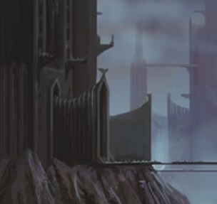
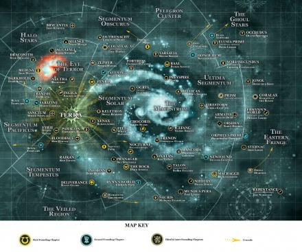

# 0233 星际战士母星 Space Marine homeworld

精校状态：中文行文已逐段精校，部分术语仍为暂定

分类：通用概念 / 帝国 Imperium / 中央政务部 Adeptus Terra / 阿斯塔特修会 Adeptus Astartes

原文来源：https://www.bilibili.com/opus/1051473062871957545

原作者：帝国神选罐头

原文时间：编辑于 2025年08月29日 20:26

[返回分类目录](目录.md) · [全书目录](../../目录.md)

原篇名：阿斯塔特修会家园世界 Space Marine homeworld

<!-- A0233-B0001 -->
**英文原文**

A Space Marine homeworld or a Chapter Planet is the base for a Space Marine fortress-monastery. For some Chapters the world also serves as their sole recruiting world; other chapters draw their recruits from several planets.

<!-- /A0233-B0001 -->

<!-- A0233-B0002 -->

原译文

星际战士家园世界或战团行星是星际战士堡垒修道院的基地。对于一些战团来说，家园世界也是他们唯一的募兵世界；其他战团从几个星球招募新兵。

**校订译文**

星际战士母星，又称战团世界，是战团要塞修道院所在地。某些战团只从母星募兵，另一些则从多个世界征募新兵。

<!-- /A0233-B0002 -->

<!-- A0233-B0003 图片 -->

<!-- A0233-B0004 -->

原译文

Adeptus Astartes Homeworld 阿斯塔特修会家园世界

**校订译文**

Adeptus Astartes Homeworld 阿斯塔特修会家园世界

<!-- /A0233-B0004 -->

<!-- A0233-B0005 -->
## Overview 概述

<!-- /A0233-B0005 -->

<!-- A0233-B0006 -->
**英文原文**

A "Chapter planet" is an Astartes world which is both governed by the chapter and which serves as the base for their fortress-monastery. Astartes homeworlds may be Imperial planets, while some are not planets at all, but take the form of orbiting spacecraft, deserted moons and asteroids. The commander of the chapter is often also the traditional ruler of the chapter planet, in which case the Chapter Master also holds the rank of Planetary Governor. Chapter Planets are exempt from normal Imperial Tithes. Many Astartes homeworlds are Feral Worlds, which provide the best warriors. Not all Space Marine Chapters have a single homeworld; some chapters such as the Imperial Fists, Black Templars and Blood Ravens take their aspirants from several different worlds. Entirely fleet-based chapters do not possess worlds, and instead recruit from any convenient and promising worlds.

<!-- /A0233-B0006 -->

<!-- A0233-B0007 -->

原译文

“战团行星”是一个阿斯塔特家园世界，既受战团的统治，又作为他们堡垒修道院的基地。阿斯塔特的母星可能是帝国行星，而有些则根本不是行星，而是轨道航天器、废弃卫星和小行星的形式。战团的指挥官通常也是战团行星的传统统治者，在这种情况下，战团长还拥有行星总督的头衔。战团行星不受正常帝国什一税的约束。许多阿斯塔特家园世界都是蛮荒世界，那里有最好的战士。并非所有星际战士战团都有一个家园世界；一些战团，如帝国之拳、黑色圣堂和血鸦，从几个不同的世界带走了他们的有志者。完全以舰队为基础的战团不拥有世界，而是从任何方便和有前途的世界募兵。

**校订译文**

“战团世界”既受阿斯塔特战团统治，也设有战团的要塞修道院。广义上的战团家园可能是帝国行星，也可能并非行星，而是轨道舰船、无人卫星或小行星。战团长往往兼任当地传统统治者，在这种情况下，也拥有行星总督的头衔。战团世界免缴常规帝国什一税。许多母星属于蛮荒世界，可提供强悍的战士。不过，并非所有战团只有一个家园：帝国之拳、黑色圣堂和血鸦等会从多个世界选拔有志者；完全舰基的战团则不拥有母星，而会从交通便利、兵源合适的世界招募。

<!-- /A0233-B0007 -->

<!-- A0233-B0008 图片 -->

<!-- A0233-B0009 -->

原译文

Map of Adeptus Astartes Homeworlds 阿斯塔特修会家园世界地图

**校订译文**

Map of Adeptus Astartes Homeworlds 阿斯塔特修会家园世界地图

<!-- /A0233-B0009 -->

<!-- A0233-B0010 -->
**英文原文**

Several Space Marine Chapters guilty of treason (but those still deemed redeemable), such as the Mantis Warriors and Executioners, have been forced to forfeit their homeworlds - which forces them to become totally fleet-based chapters.

<!-- /A0233-B0010 -->

<!-- A0233-B0011 -->

原译文

一些犯有叛国罪的星际战士战团（但仍被视为可救赎的战团），如螳螂勇士和处刑者，已被迫放弃他们的家园世界，这迫使他们成为完全以舰队为基础的战团。

**校订译文**

一些犯有叛国罪的星际战士战团（但仍被视为可救赎的战团），如螳螂勇士和处刑者，已被迫放弃他们的家园世界，这迫使他们成为完全以舰队为基础的战团。

<!-- /A0233-B0011 -->

<!-- A0233-B0012 -->
## List of Adeptus Astartes Homeworlds 阿斯塔特修会家园世界列表

<!-- /A0233-B0012 -->

<!-- A0233-B0013 -->
**英文原文**

108/Beta-Kalapus-9.2-Wolfspear

<!-- /A0233-B0013 -->

<!-- A0233-B0014 -->

原译文

108/贝塔-卡拉普斯-9.2-野狼之矛

**校订译文**

108/贝塔-卡拉普斯-9.2——狼矛。

<!-- /A0233-B0014 -->

<!-- A0233-B0015 -->
**英文原文**

Allhallow-Angels of Absolution

<!-- /A0233-B0015 -->

<!-- A0233-B0016 -->

原译文

万圣-赦免天使

**校订译文**

万圣-赦免天使

<!-- /A0233-B0016 -->

<!-- A0233-B0017 -->
**英文原文**

Anzyra-Angels Sanguine

<!-- /A0233-B0017 -->

<!-- A0233-B0018 -->

原译文

安齐拉-血红天使

**校订译文**

安齐拉-血红天使

<!-- /A0233-B0018 -->

<!-- A0233-B0019 -->
**英文原文**

Aquilon-Executioners

<!-- /A0233-B0019 -->

<!-- A0233-B0020 -->

原译文

阿奎隆-处刑者

**校订译文**

阿奎隆-处刑者

<!-- /A0233-B0020 -->

<!-- A0233-B0021 -->
**英文原文**

Armato-Ultima-Sons of Orar

<!-- /A0233-B0021 -->

<!-- A0233-B0022 -->

原译文

阿马托-极限星域-奥拉尔之子

**校订译文**

阿马托-极限星域-奥拉尔之子

<!-- /A0233-B0022 -->

<!-- A0233-B0023 -->
**英文原文**

Aurelius-Viper Legion

<!-- /A0233-B0023 -->

<!-- A0233-B0024 -->

原译文

奥勒留-蝰蛇军团

**校订译文**

奥勒留-蝰蛇军团

<!-- /A0233-B0024 -->

<!-- A0233-B0025 -->
**英文原文**

Aventinium-Brazen Consuls

<!-- /A0233-B0025 -->

<!-- A0233-B0026 -->

原译文

阿文蒂尼姆-黄铜执政官

**校订译文**

阿文蒂尼姆-黄铜执政官

<!-- /A0233-B0026 -->

<!-- A0233-B0027 -->
**英文原文**

Baal-Ultima-Baal System-122,000-Blood Angels

<!-- /A0233-B0027 -->

<!-- A0233-B0028 -->

原译文

巴尔-极限星域-巴尔星系-122000人-圣血天使

**校订译文**

巴尔-极限星域-巴尔星系-122000人-圣血天使

<!-- /A0233-B0028 -->

<!-- A0233-B0029 -->
**英文原文**

Badab Primaris (former)-Ultima-Sfantu system-Astral Claws(excommunicated)

<!-- /A0233-B0029 -->

<!-- A0233-B0030 -->

原译文

巴达布主星（前）-极限星域-神圣星系-星辰之爪（绝罚）

**校订译文**

巴达布主星（昔日母星）——极限星域；斯凡图星系；星辰之爪（已遭绝罚）。

**校注：** Sfantu 为星系专名，暂音译斯凡图，原译“神圣”可能来自词源推断，未找到官方依据。

<!-- /A0233-B0030 -->

<!-- A0233-B0031 -->
**英文原文**

Banish-Obscurus-Exorcists

<!-- /A0233-B0031 -->

<!-- A0233-B0032 -->

原译文

放逐-朦胧星域-驱魔者

**校订译文**

巴尼什——朦胧星域；驱魔者。

<!-- /A0233-B0032 -->

<!-- A0233-B0033 -->
**英文原文**

Barbarus (former)-Tempestus-Death Guard (excommunicated)

<!-- /A0233-B0033 -->

<!-- A0233-B0034 -->

原译文

巴巴鲁斯（前）-暴风星域-死亡守卫（绝罚）

**校订译文**

巴巴鲁斯（前）-暴风星域-死亡守卫（绝罚）

<!-- /A0233-B0034 -->

<!-- A0233-B0035 -->
**英文原文**

Bellicas-Ultima-Emperor's Swords (Bellicas)

<!-- /A0233-B0035 -->

<!-- A0233-B0036 -->

原译文

贝利卡斯-极限星域-帝皇之剑（贝利卡斯）

**校订译文**

贝利卡斯-极限星域-帝皇之剑（贝利卡斯）

<!-- /A0233-B0036 -->

<!-- A0233-B0037 -->
**英文原文**

Birmingham(The Black Planet)-Harbingers

<!-- /A0233-B0037 -->

<!-- A0233-B0038 -->

原译文

伯明翰（黑色行星）-凶兆

**校订译文**

伯明翰（黑色行星）-凶兆

<!-- /A0233-B0038 -->

<!-- A0233-B0039 -->
**英文原文**

Bloodfall(destroyed)-Red Wolves

<!-- /A0233-B0039 -->

<!-- A0233-B0040 -->

原译文

血坠（毁灭）-红狼

**校订译文**

血坠（毁灭）-红狼

<!-- /A0233-B0040 -->

<!-- A0233-B0041 -->
**英文原文**

Bloodpeak-Ultima-Crimson Raptors

<!-- /A0233-B0041 -->

<!-- A0233-B0042 -->

原译文

血峰-极限星域-深红猛禽

**校订译文**

血峰-极限星域-深红猛禽

<!-- /A0233-B0042 -->

<!-- A0233-B0043 -->
**英文原文**

Bodt (former)-Ultima-Bodt System-No native population-World Eaters (excommunicated)

<!-- /A0233-B0043 -->

<!-- A0233-B0044 -->

原译文

博特（前）-极限星域-博特星系-无本地人口-吞世者（绝罚）

**校订译文**

博特（前）-极限星域-博特星系-无本地人口-吞世者（绝罚）

<!-- /A0233-B0044 -->

<!-- A0233-B0045 -->
**英文原文**

Brycantia-Obscurus-Iron Knights

<!-- /A0233-B0045 -->

<!-- A0233-B0046 -->

原译文

布吕坎蒂亚-朦胧星域-钢铁骑士

**校订译文**

布吕坎蒂亚-朦胧星域-钢铁骑士

<!-- /A0233-B0046 -->

<!-- A0233-B0047 -->
**英文原文**

Caliban (destroyed)-Obscurus-Caliban System-Dark Angels

<!-- /A0233-B0047 -->

<!-- A0233-B0048 -->

原译文

卡利班（毁灭）-朦胧星域-卡利班星系-黑暗天使

**校订译文**

卡利班（毁灭）-朦胧星域-卡利班星系-黑暗天使

<!-- /A0233-B0048 -->

<!-- A0233-B0049 -->
**英文原文**

Carcharias-Crimson Consuls

<!-- /A0233-B0049 -->

<!-- A0233-B0050 -->

原译文

锥齿鲨 - 深红执政官

**校订译文**

锥齿鲨 - 深红执政官

<!-- /A0233-B0050 -->

<!-- A0233-B0051 -->
**英文原文**

Chemos (destroyed)-Ultima-Chemos System-Emperor's Children

<!-- /A0233-B0051 -->

<!-- A0233-B0052 -->

原译文

彻莫斯（毁灭）-极限星域-彻莫斯星系-帝皇之子

**校订译文**

彻莫斯（毁灭）-极限星域-彻莫斯星系-帝皇之子

<!-- /A0233-B0052 -->

<!-- A0233-B0053 -->
**英文原文**

Chogoris-Ultima-Yasan Sector-Chogoris System-10,000,000-White Scars

<!-- /A0233-B0053 -->

<!-- A0233-B0054 -->

原译文

巧高里斯-极限星域-崖山星区-巧高里斯星系-10000000人-白色疤痕

**校订译文**

乔高里斯——极限星域；崖山星区；乔高里斯星系；人口 1000 万；白疤。

<!-- /A0233-B0054 -->

<!-- A0233-B0055 -->
**英文原文**

Colchis (destroyed)-Pacificus-Word Bearers

<!-- /A0233-B0055 -->

<!-- A0233-B0056 -->

原译文

科尔基斯（毁灭）-太平星域-怀言者

**校订译文**

科尔基斯（毁灭）-太平星域-怀言者

<!-- /A0233-B0056 -->

<!-- A0233-B0057 -->
**英文原文**

Coralax-Ultima-Knights of the Raven

<!-- /A0233-B0057 -->

<!-- A0233-B0058 -->

原译文

科拉莱克斯-极限星域-渡鸦骑士

**校订译文**

科拉莱克斯-极限星域-渡鸦骑士

<!-- /A0233-B0058 -->

<!-- A0233-B0059 -->
**英文原文**

Corinal-Angels Vermillion

<!-- /A0233-B0059 -->

<!-- A0233-B0060 -->

原译文

科瑞纳尔-朱红天使

**校订译文**

科瑞纳尔-朱红天使

<!-- /A0233-B0060 -->

<!-- A0233-B0061 -->
**英文原文**

Cousteau XI(rendered uninhabitable)-Fire Hawks

<!-- /A0233-B0061 -->

<!-- A0233-B0062 -->

原译文

库斯托十一号（变得无法居住）-火鹰

**校订译文**

库斯托十一号（变得无法居住）-火鹰

<!-- /A0233-B0062 -->

<!-- A0233-B0063 -->
**英文原文**

Cretacia-Corythos System-Flesh Tearers

<!-- /A0233-B0063 -->

<!-- A0233-B0064 -->

原译文

科瑞塔西亚-克里索斯星系-撕肉者

**校订译文**

科瑞塔西亚-克里索斯星系-撕肉者

<!-- /A0233-B0064 -->

<!-- A0233-B0065 -->
**英文原文**

Cthonia (destroyed)-Solar-Cthonia System-Luna Wolves/Sons of Horus

<!-- /A0233-B0065 -->

<!-- A0233-B0066 -->

原译文

科索尼亚（毁灭）-太阳星域-科索尼亚星系-影月苍狼/荷鲁斯之子

**校订译文**

科索尼亚（毁灭）-太阳星域-科索尼亚星系-影月苍狼/荷鲁斯之子

<!-- /A0233-B0066 -->

<!-- A0233-B0067 -->
**英文原文**

Cyrene Secundus-Blood Ravens

<!-- /A0233-B0067 -->

<!-- A0233-B0068 -->

原译文

昔兰尼二号-血鸦

**校订译文**

昔兰尼二号-血鸦

<!-- /A0233-B0068 -->

<!-- A0233-B0069 -->
**英文原文**

Darkhold-Obscurus-Dark Sons

<!-- /A0233-B0069 -->

<!-- A0233-B0070 -->

原译文

黑暗圣典-朦胧星域-黑暗之子

**校订译文**

黑暗堡——朦胧星域；黑暗之子。

**校注：** Darkhold 在此为世界名，暂译黑暗堡；原译“黑暗圣典”疑套用其他作品同名专有名词。

<!-- /A0233-B0070 -->

<!-- A0233-B0071 -->
**英文原文**

Deliverance (moon)-Tempestus-Forsarr Sector-Kiavahr System-Raven Guard

<!-- /A0233-B0071 -->

<!-- A0233-B0072 -->

原译文

拯救（卫星）-暴风星域-福萨尔星区-基亚瓦尔星系-暗鸦守卫

**校订译文**

拯救星（卫星）——暴风星域；福萨尔星区；基亚瓦尔星系；暗鸦守卫。

<!-- /A0233-B0072 -->

<!-- A0233-B0073 -->
**英文原文**

Draconith-Obscurus-Star Dragons

<!-- /A0233-B0073 -->

<!-- A0233-B0074 -->

原译文

德拉科尼斯-朦胧星域-星龙

**校订译文**

德拉科尼斯-朦胧星域-星龙

<!-- /A0233-B0074 -->

<!-- A0233-B0075 -->
**英文原文**

Drogsh-Brakatoa System-Crimson Sabres

<!-- /A0233-B0075 -->

<!-- A0233-B0076 -->

原译文

德罗什-布拉卡托星系-深红军刀

**校订译文**

德罗什-布拉卡托星系-深红军刀

<!-- /A0233-B0076 -->

<!-- A0233-B0077 -->
**英文原文**

Eidolica-Solar-Fists Exemplar

<!-- /A0233-B0077 -->

<!-- A0233-B0078 -->

原译文

艾多利卡-太阳星域-典范之拳

**校订译文**

艾多利卡-太阳星域-典范之拳

<!-- /A0233-B0078 -->

<!-- A0233-B0079 -->
**英文原文**

Elusia Prime-Ultima-Doom Legion

<!-- /A0233-B0079 -->

<!-- A0233-B0080 -->

原译文

埃卢西亚主星-极限星域-末日军团

**校订译文**

埃卢西亚主星-极限星域-末日军团

<!-- /A0233-B0080 -->

<!-- A0233-B0081 -->
**英文原文**

Elysium IX-Celestial Lions

<!-- /A0233-B0081 -->

<!-- A0233-B0082 -->

原译文

厄琉息斯九号-天狮

**校订译文**

厄琉息斯九号-天狮

<!-- /A0233-B0082 -->

<!-- A0233-B0083 -->
**英文原文**

Epos-Ultima-Grey Giants

<!-- /A0233-B0083 -->

<!-- A0233-B0084 -->

原译文

史诗-极限星域-灰色巨人

**校订译文**

史诗-极限星域-灰色巨人

<!-- /A0233-B0084 -->

<!-- A0233-B0085 -->
**英文原文**

Erenon-Ultima-Celestial Guard

<!-- /A0233-B0085 -->

<!-- A0233-B0086 -->

原译文

埃伦-极限星域-天界守卫

**校订译文**

埃伦-极限星域-天界守卫

<!-- /A0233-B0086 -->

<!-- A0233-B0087 -->
**英文原文**

Erwynn's World-Dragon Lords

<!-- /A0233-B0087 -->

<!-- A0233-B0088 -->

原译文

艾尔文世界-龙之领主

**校订译文**

艾尔文世界-龙之领主

<!-- /A0233-B0088 -->

<!-- A0233-B0089 -->
**英文原文**

Eschara-Excoriators

<!-- /A0233-B0089 -->

<!-- A0233-B0090 -->

原译文

埃斯卡拉-责难者

**校订译文**

埃斯卡拉-责难者

<!-- /A0233-B0090 -->

<!-- A0233-B0091 -->
**英文原文**

Eyrie-Solar-Storm Wings

<!-- /A0233-B0091 -->

<!-- A0233-B0092 -->

原译文

鹰巢-太阳星域-风暴之翼

**校订译文**

鹰巢-太阳星域-风暴之翼

<!-- /A0233-B0092 -->

<!-- A0233-B0093 -->
**英文原文**

Felis-Ultima-White Panthers

<!-- /A0233-B0093 -->

<!-- A0233-B0094 -->

原译文

费利斯-极限星域-白色美洲豹

**校订译文**

费利斯-极限星域-白色美洲豹

<!-- /A0233-B0094 -->

<!-- A0233-B0095 -->
**英文原文**

Fenris-Obscurus/Solar-Fenris Sector-Fenris System-Space Wolves

<!-- /A0233-B0095 -->

<!-- A0233-B0096 -->

原译文

芬里斯-朦胧星域/太阳星域-芬里斯星区-芬里斯星系-太空野狼

**校订译文**

芬里斯-朦胧星域/太阳星域-芬里斯星区-芬里斯星系-太空野狼

<!-- /A0233-B0096 -->

<!-- A0233-B0097 -->
**英文原文**

Firestorm-Ultima-Aurora Chapter

<!-- /A0233-B0097 -->

<!-- A0233-B0098 -->

原译文

火风暴-极限星域-曙光女神

**校订译文**

火风暴-极限星域-曙光女神

<!-- /A0233-B0098 -->

<!-- A0233-B0099 -->
**英文原文**

Fortress-Ultima-Crimson Paladins

<!-- /A0233-B0099 -->

<!-- A0233-B0100 -->

原译文

堡垒-极限星域-深红圣骑士

**校订译文**

堡垒-极限星域-深红圣骑士

<!-- /A0233-B0100 -->

<!-- A0233-B0101 -->
**英文原文**

Gathis II-Doom Eagles

<!-- /A0233-B0101 -->

<!-- A0233-B0102 -->

原译文

加西斯二号-末日天鹰

**校订译文**

加西斯二号-末日天鹰

<!-- /A0233-B0102 -->

<!-- A0233-B0103 -->
**英文原文**

Gheren-Obscurus-Regents of Gheren

<!-- /A0233-B0103 -->

<!-- A0233-B0104 -->

原译文

盖伦-朦胧星域-盖伦摄政

**校订译文**

盖伦-朦胧星域-盖伦摄政

<!-- /A0233-B0104 -->

<!-- A0233-B0105 -->
**英文原文**

Ghorstangrad-Emperor's Swords(Ghorstangrad)

<!-- /A0233-B0105 -->

<!-- A0233-B0106 -->

原译文

戈斯登格拉德-帝皇之剑（戈斯登格拉德）

**校订译文**

戈斯登格拉德-帝皇之剑（戈斯登格拉德）

<!-- /A0233-B0106 -->

<!-- A0233-B0107 -->
**英文原文**

Gladius IV-Twilight Swords

<!-- /A0233-B0107 -->

<!-- A0233-B0108 -->

原译文

格雷迪厄斯四号-暮光之剑

**校订译文**

格雷迪厄斯四号-暮光之剑

<!-- /A0233-B0108 -->

<!-- A0233-B0109 -->
**英文原文**

Goritus-Tempestus-Firebreathers

<!-- /A0233-B0109 -->

<!-- A0233-B0110 -->

原译文

戈里图斯-暴风星域-龙息

**校订译文**

戈里图斯-暴风星域-龙息

<!-- /A0233-B0110 -->

<!-- A0233-B0111 -->
**英文原文**

Haakonath (lost)-Star Phantoms

<!-- /A0233-B0111 -->

<!-- A0233-B0112 -->

原译文

哈克纳特（失踪）-星辰幻影

**校订译文**

哈科内斯（失踪）-星辰幻影

<!-- /A0233-B0112 -->

<!-- A0233-B0113 -->
**英文原文**

Hasciar-Obscurus-Void Axes

<!-- /A0233-B0113 -->

<!-- A0233-B0114 -->

原译文

哈西尔-朦胧星域-虚空之斧

**校订译文**

哈西尔-朦胧星域-虚空之斧

<!-- /A0233-B0114 -->

<!-- A0233-B0115 -->
**英文原文**

Highcastle-Obscurus-Calixis Sector-Drusus Marches-Storm Wardens

<!-- /A0233-B0115 -->

<!-- A0233-B0116 -->

原译文

高堡-朦胧星域-卡利西斯星区-德鲁苏斯边区-风暴守望

**校订译文**

高堡——朦胧星域；卡利西斯星区；德鲁苏斯边区；风暴看守者。

<!-- /A0233-B0116 -->

<!-- A0233-B0117 -->
**英文原文**

Honourum-Ultima-Novamarines

<!-- /A0233-B0117 -->

<!-- A0233-B0118 -->

原译文

荣誉-极限星域-新星战士

**校订译文**

荣誉星-极限星域-新星战士

<!-- /A0233-B0118 -->

<!-- A0233-B0119 -->
**英文原文**

Howsbridge-Ultima-Ultramar-Praetors of Ultramar

<!-- /A0233-B0119 -->

<!-- A0233-B0120 -->

原译文

豪斯布里奇-极限星域-奥特拉玛-奥特拉玛执政

**校订译文**

豪斯布里奇——极限星域；奥特拉玛；奥特拉玛执政官。

<!-- /A0233-B0120 -->

<!-- A0233-B0121 -->
**英文原文**

Icefang-Ultima-Tigers Argent

<!-- /A0233-B0121 -->

<!-- A0233-B0122 -->

原译文

冰牙-极限星域-银白猛虎

**校订译文**

冰牙-极限星域-银白猛虎

<!-- /A0233-B0122 -->

<!-- A0233-B0123 -->
**英文原文**

Ingiga-Solar-Angels of Fury

<!-- /A0233-B0123 -->

<!-- A0233-B0124 -->

原译文

英吉加-太阳星域-狂怒天使

**校订译文**

英吉加-太阳星域-狂怒天使

<!-- /A0233-B0124 -->

<!-- A0233-B0125 -->
**英文原文**

Inwit-Tempestus-Imperial Fists

<!-- /A0233-B0125 -->

<!-- A0233-B0126 -->

原译文

因维特-暴风星域-帝国之拳

**校订译文**

因维特-暴风星域-帝国之拳

<!-- /A0233-B0126 -->

<!-- A0233-B0127 -->
**英文原文**

Istrouma-Pacificus-Macharius Alpha Sector-Caracros Sub-Sector-Istrouman System-8 billion-Tome Keepers

<!-- /A0233-B0127 -->

<!-- A0233-B0128 -->

原译文

伊斯特鲁玛-太平星域-机械教阿尔法星区-卡拉克罗斯分区-伊斯特鲁曼星系-8百万人-典籍守护者

**校订译文**

伊斯特鲁玛——太平星域；马卡里乌斯阿尔法星区；卡拉克罗斯次星区；伊斯特鲁曼星系；人口 80 亿；典籍守护者。

**校注：** 8 billion = 80 亿，原译8百万人少了三个数量级；Macharius 是专名，不是机械教。

<!-- /A0233-B0128 -->

<!-- A0233-B0129 -->
**英文原文**

Ithaka-Obscurus-Iron Snakes

<!-- /A0233-B0129 -->

<!-- A0233-B0130 -->

原译文

伊萨卡-朦胧星域-铁蛇

**校订译文**

伊萨卡-朦胧星域-铁蛇

<!-- /A0233-B0130 -->

<!-- A0233-B0131 -->
**英文原文**

Jaggafall-Obscurus-Blood Swords

<!-- /A0233-B0131 -->

<!-- A0233-B0132 -->

原译文

贾加法尔-朦胧星域-鲜血之剑

**校订译文**

贾加法尔-朦胧星域-鲜血之剑

<!-- /A0233-B0132 -->

<!-- A0233-B0133 -->
**英文原文**

Jagun-Storm Reapers

<!-- /A0233-B0133 -->

<!-- A0233-B0134 -->

原译文

贾贡-风暴收割者

**校订译文**

贾贡-风暴收割者

<!-- /A0233-B0134 -->

<!-- A0233-B0135 -->
**英文原文**

Jahga (moon)-Ultima-Badab Sector-Archaea System-Star Phantoms

<!-- /A0233-B0135 -->

<!-- A0233-B0136 -->

原译文

贾加（卫星）-极限星域-巴达布星区-阿尔凯亚星系-星辰幻影

**校订译文**

贾加（卫星）-极限星域-巴达布星区-阿尔凯亚星系-星辰幻影

<!-- /A0233-B0136 -->

<!-- A0233-B0137 -->
**英文原文**

Jonol-Ultima-Honoured Sons

<!-- /A0233-B0137 -->

<!-- A0233-B0138 -->

原译文

乔诺尔-极限星域-荣誉之子

**校订译文**

乔诺尔-极限星域-荣誉之子

<!-- /A0233-B0138 -->

<!-- A0233-B0139 -->
**英文原文**

Karybdis (moon)-Obscurus-Iron Snakes

<!-- /A0233-B0139 -->

<!-- A0233-B0140 -->

原译文

卡里布迪斯（卫星）-朦胧星域-铁蛇

**校订译文**

卡里布迪斯（卫星）-朦胧星域-铁蛇

<!-- /A0233-B0140 -->

<!-- A0233-B0141 -->
**英文原文**

Keletros-Solar-Skull Bearers

<!-- /A0233-B0141 -->

<!-- A0233-B0142 -->

原译文

克莱特罗斯-太阳星域-承颅者

**校订译文**

克莱特罗斯-太阳星域-承颅者

<!-- /A0233-B0142 -->

<!-- A0233-B0143 -->
**英文原文**

Khamun-Sen(former)-Star Scorpions

<!-- /A0233-B0143 -->

<!-- A0233-B0144 -->

原译文

卡蒙-森（前）-星蝎

**校订译文**

卡蒙-森（前）-星蝎

<!-- /A0233-B0144 -->

<!-- A0233-B0145 -->
**英文原文**

Khassedur (former)-Brazen Drakes

<!-- /A0233-B0145 -->

<!-- A0233-B0146 -->

原译文

克塞达（前）-黄铜之龙

**校订译文**

克塞达（前）-黄铜之龙

<!-- /A0233-B0146 -->

<!-- A0233-B0147 -->
**英文原文**

Khoraj-Tempestus-Iron Champions

<!-- /A0233-B0147 -->

<!-- A0233-B0148 -->

原译文

霍拉杰-暴风星域-钢铁冠军

**校订译文**

霍拉杰-暴风星域-钢铁冠军

<!-- /A0233-B0148 -->

<!-- A0233-B0149 -->
**英文原文**

Kiavahr-Tempestus-Forsarr Sector-Kiavahr System-Raven Guard

<!-- /A0233-B0149 -->

<!-- A0233-B0150 -->

原译文

基亚瓦尔-暴风星域-福萨尔星区-基亚瓦尔星系-暗鸦守卫

**校订译文**

基亚瓦尔-暴风星域-福萨尔星区-基亚瓦尔星系-暗鸦守卫

<!-- /A0233-B0150 -->

<!-- A0233-B0151 -->
**英文原文**

Kremonas-Cruor Blades

<!-- /A0233-B0151 -->

<!-- A0233-B0152 -->

原译文

克雷莫纳斯-凝血之刃

**校订译文**

克雷莫纳斯-凝血之刃

<!-- /A0233-B0152 -->

<!-- A0233-B0153 -->
**英文原文**

Lavantia-Tempestus-Night Swords

<!-- /A0233-B0153 -->

<!-- A0233-B0154 -->

原译文

拉万蒂亚-暴风星域-午夜之剑

**校订译文**

拉万蒂亚-暴风星域-午夜之剑

<!-- /A0233-B0154 -->

<!-- A0233-B0155 -->
**英文原文**

Libethra (destroyed)-Tempestus-Orpheus Sector-Angels Revenant

<!-- /A0233-B0155 -->

<!-- A0233-B0156 -->

原译文

利贝特拉（毁灭）-暴风星域-俄耳甫斯星区-归来天使

**校订译文**

利贝特拉（毁灭）-暴风星域-俄耳甫斯星区-归来天使

<!-- /A0233-B0156 -->

<!-- A0233-B0157 -->
**英文原文**

Lorin Alpha-Fire Angels

<!-- /A0233-B0157 -->

<!-- A0233-B0158 -->

原译文

洛林·阿尔法-火焰天使

**校订译文**

洛林·阿尔法-火焰天使

<!-- /A0233-B0158 -->

<!-- A0233-B0159 -->
**英文原文**

Lychnos-Ultima-Night Sentinels

<!-- /A0233-B0159 -->

<!-- A0233-B0160 -->

原译文

利奇诺斯-极限星域-午夜哨兵

**校订译文**

利奇诺斯-极限星域-午夜哨兵

<!-- /A0233-B0160 -->

<!-- A0233-B0161 -->
**英文原文**

Lynoxis (former)-Golden Paladins

<!-- /A0233-B0161 -->

<!-- A0233-B0162 -->

原译文

利诺西斯（前）-黄金圣骑士

**校订译文**

利诺西斯（前）-黄金圣骑士

<!-- /A0233-B0162 -->

<!-- A0233-B0163 -->
**英文原文**

Macragge-Ultima-Ultima Sector-Ultramar-Macragge System-400,000,000-Ultramarines

<!-- /A0233-B0163 -->

<!-- A0233-B0164 -->

原译文

马库拉格-极限星域-极限星区-奥特拉玛-马库拉格星系-4亿人-极限战士

**校订译文**

马库拉格-极限星域-极限星区-奥特拉玛-马库拉格星系-4亿人-极限战士

<!-- /A0233-B0164 -->

<!-- A0233-B0165 -->
**英文原文**

Malpertuis-Angels Penitent

<!-- /A0233-B0165 -->

<!-- A0233-B0166 -->

原译文

玛珀忒-悔罪天使

**校订译文**

玛珀忒-悔罪天使

<!-- /A0233-B0166 -->

<!-- A0233-B0167 -->
**英文原文**

Mancora-Ultima-Howling Griffons

<!-- /A0233-B0167 -->

<!-- A0233-B0168 -->

原译文

曼科拉-极限星域-咆哮狮鹫

**校订译文**

曼科拉-极限星域-咆哮狮鹫

<!-- /A0233-B0168 -->

<!-- A0233-B0169 -->
**英文原文**

Medusa-Obscurus-Sthenelus System-Iron Hands

<!-- /A0233-B0169 -->

<!-- A0233-B0170 -->

原译文

美杜莎-朦胧星域-斯忒涅洛斯星系-钢铁之手

**校订译文**

美杜莎-朦胧星域-斯忒涅洛斯星系-钢铁之手

<!-- /A0233-B0170 -->

<!-- A0233-B0171 -->
**英文原文**

Mercuria-Silver Sabres

<!-- /A0233-B0171 -->

<!-- A0233-B0172 -->

原译文

摩科瑞-银色军刀

**校订译文**

摩科瑞-银色军刀

<!-- /A0233-B0172 -->

<!-- A0233-B0173 -->
**英文原文**

Miral Prime (former)-Miral System-Scythes of the Emperor

<!-- /A0233-B0173 -->

<!-- A0233-B0174 -->

原译文

米拉尔主星（前）-米拉尔星系-帝皇之镰

**校订译文**

米拉尔主星（前）-米拉尔星系-帝皇之镰

<!-- /A0233-B0174 -->

<!-- A0233-B0175 -->
**英文原文**

Montsegnur-Tempestus-Red Hunters

<!-- /A0233-B0175 -->

<!-- A0233-B0176 -->

原译文

蒙特塞尼-暴风星域-红色猎手

**校订译文**

蒙特塞尼-暴风星域-红色猎手

<!-- /A0233-B0176 -->

<!-- A0233-B0177 -->
**英文原文**

Moriorum-Tempestus-Dark Eagles

<!-- /A0233-B0177 -->

<!-- A0233-B0178 -->

原译文

莫里奥姆-暴风星域-黑暗天鹰

**校订译文**

莫里奥姆-暴风星域-黑暗天鹰

<!-- /A0233-B0178 -->

<!-- A0233-B0179 -->
**英文原文**

Mortikah VII-Pacificus-Guardians of the Covenant

<!-- /A0233-B0179 -->

<!-- A0233-B0180 -->

原译文

莫蒂卡七号-太平星域-圣约守卫者

**校订译文**

莫蒂卡七号-太平星域-圣约守卫者

<!-- /A0233-B0180 -->

<!-- A0233-B0181 -->
**英文原文**

Motulu-Ultima-Charadon Sector-Obolis Sub-Sector-Gildras System-Excruciators

<!-- /A0233-B0181 -->

<!-- A0233-B0182 -->

原译文

莫图卢-极限星域-查拉顿星区-欧布鲁斯分区-吉尔德拉斯星系-施刑者

**校订译文**

莫图卢——极限星域；查拉顿星区；欧布鲁斯次星区；吉尔德拉斯星系；施刑者。

<!-- /A0233-B0182 -->

<!-- A0233-B0183 -->
**英文原文**

Mundus Pyra-Ultima-Fire Lords

<!-- /A0233-B0183 -->

<!-- A0233-B0184 -->

原译文

世界之火-极限星域-火焰领主

**校订译文**

世界之火-极限星域-火焰领主

<!-- /A0233-B0184 -->

<!-- A0233-B0185 -->
**英文原文**

Naktis-Dark Krakens

<!-- /A0233-B0185 -->

<!-- A0233-B0186 -->

原译文

纳克提斯-黑暗海妖

**校订译文**

纳克提斯-黑暗海妖

<!-- /A0233-B0186 -->

<!-- A0233-B0187 -->
**英文原文**

Naraka-Angels of Light

<!-- /A0233-B0187 -->

<!-- A0233-B0188 -->

原译文

那落迦-光明天使

**校订译文**

那落迦-光明天使

<!-- /A0233-B0188 -->

<!-- A0233-B0189 -->
**英文原文**

Nautilos-Dragons Ardent

<!-- /A0233-B0189 -->

<!-- A0233-B0190 -->

原译文

诺提洛斯-炽热之龙

**校订译文**

诺提洛斯-炽热之龙

<!-- /A0233-B0190 -->

<!-- A0233-B0191 -->
**英文原文**

Necris-Outside Imperial boundaries(to the south of Segmentum Tempestus)-Marines Exemplar

<!-- /A0233-B0191 -->

<!-- A0233-B0192 -->

原译文

夜寂-帝国边界外（暴风星域部分以南）-模范战士

**校订译文**

夜寂——帝国疆域之外，位于暴风星域以南；模范战士。

<!-- /A0233-B0192 -->

<!-- A0233-B0193 -->
**英文原文**

Nemeton-Emperor's Spears

<!-- /A0233-B0193 -->

<!-- A0233-B0194 -->

原译文

圣林 - 帝皇之矛

**校订译文**

圣林 - 帝皇之矛

<!-- /A0233-B0194 -->

<!-- A0233-B0195 -->
**英文原文**

Neutra (former)-Obscurus-Relictors

<!-- /A0233-B0195 -->

<!-- A0233-B0196 -->

原译文

诺伊特拉（前）-朦胧星域-遗物守护者

**校订译文**

诺伊特拉（前）-朦胧星域-遗物守护者

<!-- /A0233-B0196 -->

<!-- A0233-B0197 -->
**英文原文**

Newfound-Ultima-Genesis Chapter

<!-- /A0233-B0197 -->

<!-- A0233-B0198 -->

原译文

新现-极限星域-起源战团

**校订译文**

新发现星-极限星域-起源战团

<!-- /A0233-B0198 -->

<!-- A0233-B0199 -->
**英文原文**

Nihilas-Ultima-Death Strike

<!-- /A0233-B0199 -->

<!-- A0233-B0200 -->

原译文

尼希拉斯-极限星域-死亡打击

**校订译文**

尼希拉斯-极限星域-死亡打击

<!-- /A0233-B0200 -->

<!-- A0233-B0201 -->
**英文原文**

Nocturne-Ultima-Nocturne System-Salamanders

<!-- /A0233-B0201 -->

<!-- A0233-B0202 -->

原译文

夜曲-极限星域-夜曲星系-火蜥蜴

**校订译文**

夜曲星——极限星域；夜曲星系；火蜥蜴。

<!-- /A0233-B0202 -->

<!-- A0233-B0203 -->
**英文原文**

Nostramo (destroyed)-Night Lords

<!-- /A0233-B0203 -->

<!-- A0233-B0204 -->

原译文

诺斯特拉莫（毁灭）-午夜领主

**校订译文**

诺斯特拉莫（毁灭）-午夜领主

<!-- /A0233-B0204 -->

<!-- A0233-B0205 -->
**英文原文**

Novaris-Ultima-Silver Templars

<!-- /A0233-B0205 -->

<!-- A0233-B0206 -->

原译文

诺瓦瑞斯-极限星域-银色圣堂

**校订译文**

诺瓦瑞斯-极限星域-银色圣堂

<!-- /A0233-B0206 -->

<!-- A0233-B0207 -->
**英文原文**

Obsidia-Ultima-Sable Swords(formerly Astral Knights (Chapter Destroyed))

<!-- /A0233-B0207 -->

<!-- A0233-B0208 -->

原译文

黑曜石-极限星域-阴暗之剑（前身为星界骑士（战团毁灭））

**校订译文**

奥布西迪亚——极限星域；阴暗之剑；此前属于星界骑士，后者战团已覆灭。

**校注：** 括注 formerly 指此世界先前的所属战团，并非阴暗之剑的前身就是星界骑士；Obsidia 暂音译奥布西迪亚，与矿物黑曜石区分。

<!-- /A0233-B0208 -->

<!-- A0233-B0209 -->
**英文原文**

Obstiria (former)-Ultima-Sanctus Reach-Obsidian Glaives (Chapter Destroyed)

<!-- /A0233-B0209 -->

<!-- A0233-B0210 -->

原译文

奥布斯提利亚（前）-极限星域-三圣颂河段-黑曜石长刀（战团毁灭）

**校订译文**

奥布斯提利亚（昔日母星）——极限星域；圣境宙域；黑曜石阔剑（战团已覆灭）。

**校注：** Sanctus Reach 暂译圣境宙域；原译“三圣颂河段”把星际地域误当河流地段。

<!-- /A0233-B0210 -->

<!-- A0233-B0211 -->
**英文原文**

Occludus-Death Spectres

<!-- /A0233-B0211 -->

<!-- A0233-B0212 -->

原译文

奥勒都司-死亡幽灵

**校订译文**

奥勒都司-死亡幽灵

<!-- /A0233-B0212 -->

<!-- A0233-B0213 -->
**英文原文**

Ogrys-Ultima-Invaders

<!-- /A0233-B0213 -->

<!-- A0233-B0214 -->

原译文

欧格里斯-极限星域-侵略者

**校订译文**

欧格里斯-极限星域-侵略者

<!-- /A0233-B0214 -->

<!-- A0233-B0215 -->
**英文原文**

Olympia (destroyed)-Iron Warriors

<!-- /A0233-B0215 -->

<!-- A0233-B0216 -->

原译文

奥林匹亚（毁灭）-钢铁勇士

**校订译文**

奥林匹亚（毁灭）-钢铁勇士

<!-- /A0233-B0216 -->

<!-- A0233-B0217 -->
**英文原文**

Ootheca-Mantis Warriors (former)，Carcharodons (present)

<!-- /A0233-B0217 -->

<!-- A0233-B0218 -->

原译文

欧德卡-螳螂勇士（前），噬人鲨（目前）

**校订译文**

欧德卡-螳螂勇士（前），噬人鲨（目前）

<!-- /A0233-B0218 -->

<!-- A0233-B0219 -->
**英文原文**

Orinus-Ultima-Iron Hounds

<!-- /A0233-B0219 -->

<!-- A0233-B0220 -->

原译文

奥林纳斯-极限星域-钢铁猎犬

**校订译文**

奥林纳斯-极限星域-钢铁猎犬

<!-- /A0233-B0220 -->

<!-- A0233-B0221 -->
**英文原文**

Orpheus Prime-Ultima-Praetors of Orpheus

<!-- /A0233-B0221 -->

<!-- A0233-B0222 -->

原译文

俄耳甫斯主星-极限星域-俄耳甫斯执政

**校订译文**

俄耳甫斯主星——极限星域；俄耳甫斯执政官。

<!-- /A0233-B0222 -->

<!-- A0233-B0223 -->
**英文原文**

Outrenacht-Obscurus-Legion of Night

<!-- /A0233-B0223 -->

<!-- A0233-B0224 -->

原译文

奥特雷纳赫特-朦胧星域-午夜军团

**校订译文**

奥特雷纳赫特-朦胧星域-午夜军团

<!-- /A0233-B0224 -->

<!-- A0233-B0225 -->
**英文原文**

Oxatan-Ultima-Red Legion

<!-- /A0233-B0225 -->

<!-- A0233-B0226 -->

原译文

奥斯坦-极限星域-红色军团

**校订译文**

奥斯坦-极限星域-红色军团

<!-- /A0233-B0226 -->

<!-- A0233-B0227 -->
**英文原文**

Paragon-Solar-Emperor's Hands

<!-- /A0233-B0227 -->

<!-- A0233-B0228 -->

原译文

典范-太阳星域-帝皇之手

**校订译文**

典范-太阳星域-帝皇之手

<!-- /A0233-B0228 -->

<!-- A0233-B0229 -->
**英文原文**

Pervigilium-Angels of Vigilance

<!-- /A0233-B0229 -->

<!-- A0233-B0230 -->

原译文

守夜-警戒天使

**校订译文**

守夜-警戒天使

<!-- /A0233-B0230 -->

<!-- A0233-B0231 -->
**英文原文**

Phobian-Tempestus-Reductus Sector-Dark Hunters

<!-- /A0233-B0231 -->

<!-- A0233-B0232 -->

原译文

恐惧-暴风星域-还原星区-黑暗猎手

**校订译文**

恐惧-暴风星域-还原星区-黑暗猎手

<!-- /A0233-B0232 -->

<!-- A0233-B0233 -->
**英文原文**

Posul (destroyed)-Tempestus-Mortifactors

<!-- /A0233-B0233 -->

<!-- A0233-B0234 -->

原译文

帕苏尔（毁灭）-暴风星域-苦行者

**校订译文**

帕苏尔（毁灭）-暴风星域-苦行者

<!-- /A0233-B0234 -->

<!-- A0233-B0235 -->
**英文原文**

Praedis Zeta-Ultima-Vidar Sector-Imperial Reavers

<!-- /A0233-B0235 -->

<!-- A0233-B0236 -->

原译文

普雷迪斯·泽塔-极限星域-维达星区-帝国收割者

**校订译文**

普雷迪斯·泽塔-极限星域-维达星区-帝国收割者

**校注：** 英文写 Imperial Reavers，与225的 Imperius Reavers 拼写不同，未无据认定为同一战团；原译暂保留并待核。

<!-- /A0233-B0236 -->

<!-- A0233-B0237 -->
**英文原文**

Praelax-Ultima-Loki Sector-Jade Paladins

<!-- /A0233-B0237 -->

<!-- A0233-B0238 -->

原译文

普雷拉克斯-极限星域-洛基星区-翡翠圣骑士

**校订译文**

普雷拉克斯-极限星域-洛基星区-翡翠圣骑士

<!-- /A0233-B0238 -->

<!-- A0233-B0239 -->
**英文原文**

Praesidia-Ultima-Sons of Guilliman

<!-- /A0233-B0239 -->

<!-- A0233-B0240 -->

原译文

护卫-极限星域-基里曼之子

**校订译文**

护卫-极限星域-基里曼之子

<!-- /A0233-B0240 -->

<!-- A0233-B0241 -->
**英文原文**

Pranagar-Tempestus-Sky Sentinels (Chapter Destroyed)

<!-- /A0233-B0241 -->

<!-- A0233-B0242 -->

原译文

普拉纳加尔-暴风星域-天空哨兵（战团毁灭）

**校订译文**

普拉纳加尔-暴风星域-天空哨兵（战团毁灭）

<!-- /A0233-B0242 -->

<!-- A0233-B0243 -->
**英文原文**

Preyspire-Ultima-Hawk Lords

<!-- /A0233-B0243 -->

<!-- A0233-B0244 -->

原译文

普雷斯比尔-极限星域-雄鹰领主

**校订译文**

普雷斯比尔-极限星域-雄鹰领主

<!-- /A0233-B0244 -->

<!-- A0233-B0245 -->
**英文原文**

Prospero (destroyed)-Ultima-Prospero Sector-Prospero Subsector-Prospero System-Thousand Sons

<!-- /A0233-B0245 -->

<!-- A0233-B0246 -->

原译文

普罗斯佩罗（毁灭）-极限星域-普罗斯佩罗星区-普罗斯佩罗分区-普罗斯佩罗星系-千子

**校订译文**

普罗斯佩罗（已毁）——极限星域；普罗斯佩罗星区；普罗斯佩罗次星区；普罗斯佩罗星系；千子。

<!-- /A0233-B0246 -->

<!-- A0233-B0247 -->
**英文原文**

Raikan-Tempestus-Red Talons

<!-- /A0233-B0247 -->

<!-- A0233-B0248 -->

原译文

雷坎-暴风星域-红爪

**校订译文**

雷坎-暴风星域-红爪

<!-- /A0233-B0248 -->

<!-- A0233-B0249 -->
**英文原文**

Repentance-Ultima-The Nameless

<!-- /A0233-B0249 -->

<!-- A0233-B0250 -->

原译文

忏悔-极限星域-无名者

**校订译文**

忏悔-极限星域-无名者

<!-- /A0233-B0250 -->

<!-- A0233-B0251 -->
**英文原文**

Restitution-Ultima-Nephilim-Gilded Sons

<!-- /A0233-B0251 -->

<!-- A0233-B0252 -->

原译文

归还-极限星域-拿非利-镀金之子

**校订译文**

归还-极限星域-拿非利-镀金之子

<!-- /A0233-B0252 -->

<!-- A0233-B0253 -->
**英文原文**

Rhoghon (destroyed)-Brakatoa System-Crimson Sabres

<!-- /A0233-B0253 -->

<!-- A0233-B0254 -->

原译文

罗贡（毁灭）-布拉卡托星系-深红军刀

**校订译文**

罗贡（毁灭）-布拉卡托星系-深红军刀

<!-- /A0233-B0254 -->

<!-- A0233-B0255 -->
**英文原文**

Rynn's World-Ultima-Loki Sector-Rynnstar System-Crimson Fists

<!-- /A0233-B0255 -->

<!-- A0233-B0256 -->

原译文

林恩世界-极限星域-洛基星区-林恩星系-绯红之拳

**校订译文**

瑞恩世界——极限星域；洛基星区；瑞恩星系；绯红之拳。

<!-- /A0233-B0256 -->

<!-- A0233-B0257 -->
**英文原文**

Sabatine (former)-Pacificus-White Consuls

<!-- /A0233-B0257 -->

<!-- A0233-B0258 -->

原译文

萨巴蒂尼（前）-太平星域-白色执政官

**校订译文**

萨巴蒂尼（前）-太平星域-白色执政官

<!-- /A0233-B0258 -->

<!-- A0233-B0259 -->
**英文原文**

Sacratis-Golden Halos

<!-- /A0233-B0259 -->

<!-- A0233-B0260 -->

原译文

神圣-黄金光轮

**校订译文**

神圣-黄金光轮

<!-- /A0233-B0260 -->

<!-- A0233-B0261 -->
**英文原文**

Sacris-Obscurus-Calixis Sector-Drusus Marches-Storm Wardens

<!-- /A0233-B0261 -->

<!-- A0233-B0262 -->

原译文

献神-朦胧星域-卡里西斯星区-德鲁苏斯边区-风暴守望

**校订译文**

献神——朦胧星域；卡利西斯星区；德鲁苏斯边区；风暴看守者。

<!-- /A0233-B0262 -->

<!-- A0233-B0263 -->
**英文原文**

San Guisaga-Blood Drinkers

<!-- /A0233-B0263 -->

<!-- A0233-B0264 -->

原译文

圣吉萨加-饮血者

**校订译文**

圣吉萨伽-饮血者

<!-- /A0233-B0264 -->

<!-- A0233-B0265 -->
**英文原文**

Sanctum-Solar-White Templars

<!-- /A0233-B0265 -->

<!-- A0233-B0266 -->

原译文

圣地-太阳星域-白色圣堂

**校订译文**

圣地-太阳星域-白色圣堂

<!-- /A0233-B0266 -->

<!-- A0233-B0267 -->
**英文原文**

Scelus-Obscurus-Cadian Sector-Sons of Malice (excommunicated)

<!-- /A0233-B0267 -->

<!-- A0233-B0268 -->

原译文

斯凯鲁斯-朦胧星域-卡迪亚星区-怨恶之子（绝罚）

**校订译文**

斯凯鲁斯-朦胧星域-卡迪亚星区-怨恶之子（绝罚）

<!-- /A0233-B0268 -->

<!-- A0233-B0269 -->
**英文原文**

Scintil-Novax-Ultima-Nova Legion

<!-- /A0233-B0269 -->

<!-- A0233-B0270 -->

原译文

闪烁新星-极限星域-新星军团

**校订译文**

闪烁新星-极限星域-新星军团

<!-- /A0233-B0270 -->

<!-- A0233-B0271 -->
**英文原文**

Shoba-Iron Shades

<!-- /A0233-B0271 -->

<!-- A0233-B0272 -->

原译文

荣耀 - 铁幕

**校订译文**

光辉星 - 铁幕

<!-- /A0233-B0272 -->

<!-- A0233-B0273 -->
**英文原文**

Silence-Obscurus-Night Watch

<!-- /A0233-B0273 -->

<!-- A0233-B0274 -->

原译文

寂静-朦胧星域-午夜守望

**校订译文**

寂静-朦胧星域-午夜守望

<!-- /A0233-B0274 -->

<!-- A0233-B0275 -->
**英文原文**

Solemnus (former)-Obscurus-Black Templars

<!-- /A0233-B0275 -->

<!-- A0233-B0276 -->

原译文

庄严（前）-朦胧星域-黑色圣堂

**校订译文**

庄严（前）-朦胧星域-黑色圣堂

<!-- /A0233-B0276 -->

<!-- A0233-B0277 -->
**英文原文**

Sotha (destroyed)-Ultima-Scythes of the Emperor

<!-- /A0233-B0277 -->

<!-- A0233-B0278 -->

原译文

索萨（毁灭）-极限星域-帝皇之镰

**校订译文**

索萨（毁灭）-极限星域-帝皇之镰

<!-- /A0233-B0278 -->

<!-- A0233-B0279 -->
**英文原文**

Sternac-Ultima-Iron Lords

<!-- /A0233-B0279 -->

<!-- A0233-B0280 -->

原译文

斯特纳克-极限星域-钢铁领主

**校订译文**

斯特纳克-极限星域-钢铁领主

<!-- /A0233-B0280 -->

<!-- A0233-B0281 -->
**英文原文**

Stormfall-Ultima-Iron Hawks

<!-- /A0233-B0281 -->

<!-- A0233-B0282 -->

原译文

风暴陨落-极限星域-铁鹰

**校订译文**

风暴陨落-极限星域-铁鹰

<!-- /A0233-B0282 -->

<!-- A0233-B0283 -->
**英文原文**

Stygia-Aquilon-Tempestus-Executioners

<!-- /A0233-B0283 -->

<!-- A0233-B0284 -->

原译文

冥河天鹰-暴风星域-处刑者

**校订译文**

冥河天鹰-暴风星域-处刑者

<!-- /A0233-B0284 -->

<!-- A0233-B0285 -->
**英文原文**

Talassar-Ultima-Ultramar-Void Tridents

<!-- /A0233-B0285 -->

<!-- A0233-B0286 -->

原译文

塔拉萨-极限星域-奥特拉玛-虚空三叉戟

**校订译文**

塔拉萨-极限星域-奥特拉玛-虚空三叉戟

<!-- /A0233-B0286 -->

<!-- A0233-B0287 -->
**英文原文**

Talon (abandoned)-Ultima-Storm Falcons

<!-- /A0233-B0287 -->

<!-- A0233-B0288 -->

原译文

塔隆（被抛弃）-极限星域-风暴猎鹰

**校订译文**

塔隆（被抛弃）-极限星域-风暴猎鹰

<!-- /A0233-B0288 -->

<!-- A0233-B0289 -->
**英文原文**

Talus IV (destroyed)-Brazen Claws

<!-- /A0233-B0289 -->

<!-- A0233-B0290 -->

原译文

塔卢斯四号（毁灭）-黄铜之爪

**校订译文**

塔卢斯四号（毁灭）-黄铜之爪

<!-- /A0233-B0290 -->

<!-- A0233-B0291 -->
**英文原文**

Taongar-Tempestus-Jade Scorpions

<!-- /A0233-B0291 -->

<!-- A0233-B0292 -->

原译文

陶恩加尔-暴风星域-玉蝎

**校订译文**

陶恩加尔-暴风星域-玉蝎

<!-- /A0233-B0292 -->

<!-- A0233-B0293 -->
**英文原文**

Taran III-Storm Warriors

<!-- /A0233-B0293 -->

<!-- A0233-B0294 -->

原译文

塔兰三号-风暴勇士

**校订译文**

塔兰三号-风暴勇士

<!-- /A0233-B0294 -->

<!-- A0233-B0295 -->
**英文原文**

Tarrengast-Solar-Raptors

<!-- /A0233-B0295 -->

<!-- A0233-B0296 -->

原译文

塔伦加斯特-太阳星域-猛禽

**校订译文**

塔伦加斯特-太阳星域-猛禽

<!-- /A0233-B0296 -->

<!-- A0233-B0297 -->
**英文原文**

Tauron-Brazen Minotaurs

<!-- /A0233-B0297 -->

<!-- A0233-B0298 -->

原译文

陶龙-黄铜米诺陶

**校订译文**

陶龙-黄铜米诺陶

<!-- /A0233-B0298 -->

<!-- A0233-B0299 -->
**英文原文**

Tembron-Crimson Knights

<!-- /A0233-B0299 -->

<!-- A0233-B0300 -->

原译文

滕布伦-深红骑士

**校订译文**

滕布伦-深红骑士

<!-- /A0233-B0300 -->

<!-- A0233-B0301 -->
**英文原文**

Terra-Solar-Sector Solar-Subsector Sol-Sol System-Imperial Fists

<!-- /A0233-B0301 -->

<!-- A0233-B0302 -->

原译文

泰拉-太阳星域-太阳星区-太阳分区-太阳系-帝国之拳

**校订译文**

泰拉——太阳星域；太阳星区；太阳次星区；太阳系；帝国之拳。

<!-- /A0233-B0302 -->

<!-- A0233-B0303 -->
**英文原文**

Throne of Galat-Ultima-Sons of Galathor

<!-- /A0233-B0303 -->

<!-- A0233-B0304 -->

原译文

加拉特王座-极限星域-加拉索尔之子

**校订译文**

加拉特王座-极限星域-加拉索尔之子

<!-- /A0233-B0304 -->

<!-- A0233-B0305 -->
**英文原文**

Titan (moon)-Solar-Sector Solar-Subsector Sol-Sol System-Grey Knights

<!-- /A0233-B0305 -->

<!-- A0233-B0306 -->

原译文

泰坦（卫星）-太阳星区-太阳分区-太阳系-灰骑士

**校订译文**

泰坦（卫星）——太阳星域；太阳星区；太阳次星区；太阳系；灰骑士。

**校注：** 补回原译遗漏的太阳星域一级，区分 Segmentum / Sector / Subsector。

<!-- /A0233-B0306 -->

<!-- A0233-B0307 -->
**英文原文**

Traekonnis Major-Ultima-Avenging Sons

<!-- /A0233-B0307 -->

<!-- A0233-B0308 -->

原译文

特瑞科尼厄斯主星-极限星域-复仇之子

**校订译文**

特瑞科尼厄斯主星-极限星域-复仇之子

<!-- /A0233-B0308 -->

<!-- A0233-B0309 -->
**英文原文**

Tryjon II-Blood Tigers

<!-- /A0233-B0309 -->

<!-- A0233-B0310 -->

原译文

特里琼二号-血虎

**校订译文**

特里琼二号-血虎

<!-- /A0233-B0310 -->

<!-- A0233-B0311 -->
**英文原文**

Ukek-Surozh-Sol-Raguilov-Rechista Fists

<!-- /A0233-B0311 -->

<!-- A0233-B0312 -->

原译文

乌克-苏罗日-索尔-拉古伊洛夫-真实之拳

**校订译文**

乌克-苏罗日-索尔-拉古伊洛夫-真实之拳

<!-- /A0233-B0312 -->

<!-- A0233-B0313 -->
**英文原文**

Vagoris-Ultima-Farstalkers

<!-- /A0233-B0313 -->

<!-- A0233-B0314 -->

原译文

瓦戈里斯-极限星域-远潜者

**校订译文**

瓦戈里斯-极限星域-远潜者

<!-- /A0233-B0314 -->

<!-- A0233-B0315 -->
**英文原文**

Varadon (former)-Shadow Wolves (Chapter Destroyed)

<!-- /A0233-B0315 -->

<!-- A0233-B0316 -->

原译文

瓦拉登（前）-影狼（战团毁灭）

**校订译文**

瓦拉登（前）-影狼（战团毁灭）

<!-- /A0233-B0316 -->

<!-- A0233-B0317 -->
**英文原文**

Varsavia-Ultima-Silver Skulls

<!-- /A0233-B0317 -->

<!-- A0233-B0318 -->

原译文

瓦尔萨维亚-极限星域-银色颅骨

**校订译文**

瓦尔萨维亚-极限星域-银色颅骨

<!-- /A0233-B0318 -->

<!-- A0233-B0319 -->
**英文原文**

Vitrea Mundi-Ultima-Absinthia System-Marines Mordant

<!-- /A0233-B0319 -->

<!-- A0233-B0320 -->

原译文

维特拉·蒙迪-极限星域-阿辛西亚星系-蚀刻战士

**校订译文**

维特拉·蒙迪-极限星域-阿辛西亚星系-蚀刻战士

<!-- /A0233-B0320 -->

<!-- A0233-B0321 -->
**英文原文**

Vorl Secundus (abandoned)-Ultima-Crimson Castellans

<!-- /A0233-B0321 -->

<!-- A0233-B0322 -->

原译文

沃尔二号-极限星域-深红堡主

**校订译文**

沃尔二号（已废弃）——极限星域；深红堡主。

<!-- /A0233-B0322 -->

<!-- A0233-B0323 -->
**英文原文**

Xenax-Solar-Subjugators

<!-- /A0233-B0323 -->

<!-- A0233-B0324 -->

原译文

泽纳克斯-太阳星域-压制者

**校订译文**

泽纳克斯-太阳星域-压制者

<!-- /A0233-B0324 -->

<!-- A0233-B0325 -->
**英文原文**

Zaebus Minoris-Tempestus-Red Scorpions

<!-- /A0233-B0325 -->

<!-- A0233-B0326 -->

原译文

泽巴斯·米诺若斯-暴风星域-红蝎

**校订译文**

泽巴斯次星——暴风星域；红蝎。

<!-- /A0233-B0326 -->

<!-- A0233-B0327 -->
**英文原文**

Zephyr-Obscurus-Storm Hawks

<!-- /A0233-B0327 -->

<!-- A0233-B0328 -->

原译文

和风-朦胧星域-风暴天鹰

**校订译文**

和风-朦胧星域-风暴天鹰

<!-- /A0233-B0328 -->

<!-- A0233-B0329 -->
**英文原文**

Zhoros (destroyed)-Fire Hawks

<!-- /A0233-B0329 -->

<!-- A0233-B0330 -->

原译文

卓洛斯（毁灭）-火鹰

**校订译文**

卓洛斯（毁灭）-火鹰

<!-- /A0233-B0330 -->

本篇核心术语与暂定项

以下列出本篇出现的英文原形及核心术语表用词。同形词可能指不同对象，具体词义以本篇正文和校注为准；单复数、别名和仅见于图注的名称可能尚未列入。完整候选见[术语表](../../术语表/双语术语候选.csv)。

| 英文 | 采用中文 | 状态 |
| --- | --- | --- |
| Black Templars | 黑色圣堂 | 官方已核对 |
| Blood Angels | 圣血天使 | 官方已核对 |
| Dark Angels | 黑暗天使 | 官方已核对 |
| Grey Knights | 灰骑士 | 官方已核对 |
| Space Wolves | 太空野狼 | 官方已核对 |
| Death Guard | 死亡守卫 | 官方已核对 |
| Thousand Sons | 千子 | 官方已核对 |
| World Eaters | 吞世者 | 官方已核对 |
| Ultramar | 奥特拉玛 | 官方已核对 |
| Ultramarines | 极限战士 | 官方已核对 |
| Imperial Fists | 帝国之拳 | 暂定 |
| Blood Ravens | 血鸦 | 暂定 |
| Emperor | 帝皇 | 官方已核对 |
| Word Bearers | 怀言者 | 暂定·官方待核 |
| Emperor's Children | 帝皇之子 | 官方已核对 |
| Iron Warriors | 钢铁勇士 | 暂定·官方待核 |
| Night Lords | 午夜领主 | 暂定·官方待核 |
| Barbarus | 巴巴鲁斯 | 暂定·官方待核 |
| Terra | 泰拉 | 暂定·官方待核 |
| Luna Wolves | 影月苍狼 | 暂定·官方待核 |
| Horus | 荷鲁斯 | 暂定·官方待核 |
| Sons of Horus | 荷鲁斯之子 | 暂定·官方待核 |
| Iron Hands | 钢铁之手 | 暂定·官方待核 |
| Segmentum Tempestus | 暴风星域 | 暂定·官方待核 |
| Segmentum | 星域 | 暂定·官方待核 |
| Sector | 星区 | 暂定·官方待核 |
| Subsector | 次星区 | 暂定·官方待核 |
| Salamanders | 火蜥蜴 | 暂定·官方待核 |
| Badab | 巴达布 | 暂定·官方待核 |
| Nostramo | 诺斯特拉莫 | 暂定·官方待核 |
| Kiavahr | 基亚瓦尔 | 暂定·官方待核 |
| Rynn's World | 瑞恩世界 | 暂定·官方待核 |
| Caliban | 卡利班 | 暂定·官方待核 |
| Olympia | 奥林匹亚 | 暂定·官方待核 |
| Fenris | 芬里斯 | 暂定·官方待核 |
| Baal | 巴尔 | 暂定·官方待核 |
| Cretacia | 科瑞塔西亚 | 暂定·官方待核 |
| Nocturne | 夜曲星 | 暂定·官方待核 |
| Banish | 巴尼什 | 暂定·官方待核 |
| Birmingham | 伯明翰 | 暂定·官方待核 |
| Chogoris | 乔高里斯 | 暂定·官方待核 |
| Coralax | 科拉拉克斯 | 暂定·官方待核 |
| Mancora | 曼科拉 | 暂定·官方待核 |
| Solemnus | 庄严星 | 暂定·官方待核 |
| Luna | 月球 | 暂定·官方待核 |
| Loki | 洛基 | 暂定·官方待核 |
| Deliverance | 拯救星 | 暂定·官方待核 |
| Cthonia | 科索尼亚 | 暂定·官方待核 |
| Chemos | 彻莫斯 | 暂定·官方待核 |
| Obscurus | 朦胧星 | 暂定·官方待核 |
| Macragge | 马库拉格 | 暂定·官方待核 |
| Medusa | 美杜莎 | 暂定·官方待核 |
| Sotha | 索萨 | 暂定·官方待核 |
| Titan | 泰坦 | 暂定·官方待核 |
| Eidolica | 艾多利卡 | 暂定·官方待核 |
| Feral Worlds | 蛮荒世界 | 暂定·官方待核 |
| Master | 导师（审判庭职衔）／舰务官（舰员职务） | 语境定译·官方待核 |
| Minotaurs | 米诺陶 | 暂定·官方待核 |
| Night Swords | 夜剑 | 暂定·官方待核 |
| Angels Sanguine | 鲜血天使 | 暂定·官方待核 |
| White Scars | 白疤 | 官方已核 |
| Raven Guard | 暗鸦守卫 | 官方已核 |
| Scars | 伤疤 | 暂定·官方待核 |
| Penitent | 忏悔 | 暂定·官方待核 |
| Sol | 太阳系 | 暂定·官方待核 |
| Crimson Fists | 绯红之拳 | 暂定·官方待核 |
| Silver Skulls | 银色颅骨 | 暂定·官方待核 |
| Space Marine | 星际战士 | 暂定·官方待核 |
| Chapter | 战团 | 暂定·官方待核 |
| Fortress-monastery | 要塞修道院 | 暂定·官方待核 |
| Chapter Master | 战团长 | 暂定·官方待核 |
| Flesh Tearers | 撕肉者 | 暂定·官方待核 |
| Red Scorpions | 红蝎 | 暂定·官方待核 |
| Angels Vermillion | 朱红天使 | 暂定·官方待核 |
| Blood Drinkers | 饮血者 | 暂定·官方待核 |
| Angels of Absolution | 赦免天使 | 暂定·官方待核 |
| Excoriators | 责难者 | 暂定·官方待核 |
| Fists Exemplar | 典范之拳 | 暂定·官方待核 |
| Brazen Claws | 黄铜之爪 | 暂定·官方待核 |
| Red Talons | 红爪 | 暂定·官方待核 |
| Raptors | 猛禽 | 暂定·官方待核 |
| Aurora Chapter | 曙光女神 | 暂定·官方待核 |
| Doom Eagles | 末日天鹰 | 暂定·官方待核 |
| Genesis Chapter | 起源战团 | 暂定·官方待核 |
| Iron Snakes | 铁蛇 | 暂定·官方待核 |
| Mortifactors | 苦行者 | 暂定·官方待核 |
| Novamarines | 新星战士 | 暂定·官方待核 |
| Obsidian Glaives | 黑曜石阔剑 | 暂定·官方待核 |
| Praetors of Orpheus | 俄耳甫斯执政官 | 暂定·官方待核 |
| White Consuls | 白色执政官 | 暂定·官方待核 |
| Executioners | 处刑者 | 语境定译·官方待核 |
| Scythes of the Emperor | 帝皇之镰 | 暂定·官方待核 |
| Tome Keepers | 典籍守护者 | 暂定·官方待核 |
| Iron Shades | 铁幕 | 暂定·官方待核 |
| Angels Revenant | 归来天使 | 暂定·官方待核 |
| Mantis Warriors | 螳螂勇士 | 暂定·官方待核 |
| Exorcists | 驱魔者 | 暂定·官方待核 |
| Death Spectres | 死亡幽灵 | 暂定·官方待核 |
| Fire Hawks | 火鹰 | 暂定·官方待核 |
| Celestial Lions | 天狮 | 暂定·官方待核 |
| Star Phantoms | 星辰幻影 | 暂定·官方待核 |
| Emperor's Spears | 帝皇之矛 | 暂定·官方待核 |
| Fire Angels | 火焰天使 | 暂定·官方待核 |
| Star Scorpions | 星蝎 | 暂定·官方待核 |
| Dragons Ardent | 炽热之龙 | 暂定·官方待核 |
| Dark Krakens | 黑暗海妖 | 暂定·官方待核 |
| Wolfspear | 狼矛 | 暂定·官方待核 |
| Avenging Sons | 复仇之子 | 暂定·官方待核 |
| Praetors of Ultramar | 奥特拉玛执政官 | 暂定·官方待核 |
| Silver Templars | 银色圣堂 | 暂定·官方待核 |
| Void Tridents | 虚空三叉戟 | 暂定·官方待核 |
| Storm Reapers | 风暴收割者 | 暂定·官方待核 |
| Sable Swords | 阴暗之剑 | 暂定·官方待核 |
| Fleet-Based Chapters | 舰基战团 | 暂定·官方待核 |
| Angels of Fury | 狂怒天使 | 暂定·官方待核 |
| Angels of Light | 光明天使 | 暂定·官方待核 |
| Angels of Vigilance | 警戒天使 | 暂定·官方待核 |
| Angels Penitent | 悔罪天使 | 暂定·官方待核 |
| Astral Knights | 星界骑士 | 暂定·官方待核 |
| Blood Swords | 鲜血之剑 | 暂定·官方待核 |
| Blood Tigers | 血虎 | 暂定·官方待核 |
| Brazen Consuls | 黄铜执政官 | 暂定·官方待核 |
| Brazen Minotaurs | 黄铜米诺陶 | 暂定·官方待核 |
| Carcharodons | 噬人鲨 | 暂定·官方待核 |
| Celestial Guard | 天界守卫 | 暂定·官方待核 |
| Crimson Castellans | 深红堡主 | 暂定·官方待核 |
| Crimson Consuls | 深红执政官 | 暂定·官方待核 |
| Crimson Knights | 深红骑士 | 暂定·官方待核 |
| Crimson Paladins | 深红圣骑士 | 暂定·官方待核 |
| Crimson Raptors | 深红猛禽 | 暂定·官方待核 |
| Cruor Blades | 凝血之刃 | 暂定·官方待核 |
| Dark Eagles | 黑暗天鹰 | 暂定·官方待核 |
| Dark Hunters | 黑暗猎手 | 暂定·官方待核 |
| Dark Sons | 黑暗之子 | 暂定·官方待核 |
| Death Strike | 死亡打击 | 暂定·官方待核 |
| Doom Legion | 末日军团 | 暂定·官方待核 |
| Dragon Lords | 龙之领主 | 暂定·官方待核 |
| Emperor's Hands | 帝皇之手 | 暂定·官方待核 |
| Emperor's Swords | 帝皇之剑 | 暂定·官方待核 |
| Excruciators | 施刑者 | 暂定·官方待核 |
| Farstalkers | 远潜者 | 暂定·官方待核 |
| Fire Lords | 火焰领主 | 暂定·官方待核 |
| Firebreathers | 龙息 | 暂定·官方待核 |
| Gilded Sons | 镀金之子 | 暂定·官方待核 |
| Golden Halos | 黄金光轮 | 暂定·官方待核 |
| Golden Paladins | 黄金圣骑士 | 暂定·官方待核 |
| Grey Giants | 灰色巨人 | 暂定·官方待核 |
| Guardians of the Covenant | 圣约守卫者 | 暂定·官方待核 |
| Harbingers | 凶兆 | 暂定·官方待核 |
| Hawk Lords | 雄鹰领主 | 暂定·官方待核 |
| Honoured Sons | 荣誉之子 | 暂定·官方待核 |
| Howling Griffons | 咆哮狮鹫 | 暂定·官方待核 |
| Invaders | 侵略者 | 暂定·官方待核 |
| Iron Champions | 钢铁冠军 | 暂定·官方待核 |
| Iron Hawks | 铁鹰 | 暂定·官方待核 |
| Iron Hounds | 钢铁猎犬 | 暂定·官方待核 |
| Iron Knights | 钢铁骑士 | 暂定·官方待核 |
| Iron Lords | 钢铁领主 | 暂定·官方待核 |
| Jade Paladins | 翡翠圣骑士 | 暂定·官方待核 |
| Jade Scorpions | 玉蝎 | 暂定·官方待核 |
| Knights of the Raven | 渡鸦骑士 | 暂定·官方待核 |
| Legion of Night | 午夜军团 | 暂定·官方待核 |
| Marines Exemplar | 模范战士 | 暂定·官方待核 |
| Marines Mordant | 蚀刻战士 | 暂定·官方待核 |
| Nameless | 无名者 | 暂定·官方待核 |
| Night Sentinels | 午夜哨兵 | 暂定·官方待核 |
| Night Watch | 午夜守望 | 暂定·官方待核 |
| Nova Legion | 新星军团 | 暂定·官方待核 |
| Panthers | 黑豹 | 暂定·官方待核 |
| Rechista Fists | 真实之拳 | 暂定·官方待核 |
| Red Hunters | 红色猎手 | 暂定·官方待核 |
| Red Legion | 红色军团 | 暂定·官方待核 |
| Red Wolves | 红狼 | 暂定·官方待核 |
| Regents of Gheren | 盖伦摄政 | 暂定·官方待核 |
| Shadow Wolves | 影狼 | 暂定·官方待核 |
| Silver Sabres | 银色军刀 | 暂定·官方待核 |
| Skull Bearers | 承颅者 | 暂定·官方待核 |
| Sky Sentinels | 天空哨兵 | 暂定·官方待核 |
| Sons of Galathor | 加拉索尔之子 | 暂定·官方待核 |
| Sons of Guilliman | 基里曼之子 | 暂定·官方待核 |
| Sons of Orar | 奥拉尔之子 | 暂定·官方待核 |
| Star Dragons | 星龙 | 暂定·官方待核 |
| Storm Falcons | 风暴猎鹰 | 暂定·官方待核 |
| Storm Hawks | 风暴天鹰 | 暂定·官方待核 |
| Storm Wardens | 风暴看守者 | 暂定·官方待核 |
| Storm Warriors | 风暴勇士 | 暂定·官方待核 |
| Storm Wings | 风暴之翼 | 暂定·官方待核 |
| Subjugators | 压制者 | 暂定·官方待核 |
| Tigers Argent | 银白猛虎 | 暂定·官方待核 |
| Twilight Swords | 暮光之剑 | 暂定·官方待核 |
| Viper Legion | 蝰蛇军团 | 暂定·官方待核 |
| Void Axes | 虚空之斧 | 暂定·官方待核 |
| White Panthers | 白色美洲豹 | 暂定·官方待核 |
| White Templars | 白色圣堂 | 暂定·官方待核 |
| Space Marine homeworld | 星际战士母星 | 暂定·官方待核 |
| Relictors | 遗物守护者 | 暂定·官方待核 |
| Newfound | 新发现星 | 暂定·官方待核 |
| Honourum | 荣誉星 | 暂定·官方待核 |
| Shoba | 光辉星 | 暂定·官方待核 |
| Haakonath | 哈科内斯 | 暂定·官方待核 |
| San Guisaga | 圣吉萨伽 | 暂定·官方待核 |
| Obsidia | 奥布西迪亚 | 暂定·官方待核 |
| Colchis | 科尔基斯 | 暂定·官方待核 |
| Malice | 恶意 | 暂定·官方待核 |
| Imperial Reavers | 帝国收割者 | 暂定·官方待核 |
| Sanctus Reach | 圣图斯疆域 | 暂定·官方待核 |
| Reavers | 劫掠者 | 官方已核对 |
| Charadon | 查拉顿 | 暂定·官方待核 |
| Forsarr | 弗萨尔 | 暂定·官方待核 |
| Sanctum | 圣所星 | 暂定·官方待核 |
| Bloodfall | 血落星 | 暂定·官方待核 |
| Sanctus | 圣裁者 | 官方已核对 |
| Reductus | 隐蔽破坏者 | 官方词根参考·全称待核 |
| Elysium IX | 厄琉息斯九号 | 暂定·官方待核 |
| Xenax | 泽纳克斯 | 暂定·官方待核 |
| Macragge System | 马库拉格星系 | 暂定·官方待核 |
| Howsbridge | 豪斯布里奇 | 暂定·官方待核 |
| Talassar | 塔拉萨 | 暂定·官方待核 |
| Vermillion | 维米里恩 | 暂定·官方待核 |
| Zaebus | 泽巴斯 | 暂定·官方待核 |
| Sable | 暗夜星 | 暂定·官方待核 |
| Yasan Sector | 崖山星区 | 暂定·官方待核 |
| Sthenelus | 斯特涅洛斯号 | 暂定·官方待核 |
| Posul | 波苏尔 | 暂定·官方待核 |
| Zaebus Minoris | 泽巴斯·米诺若斯 | 暂定·官方待核 |
| Hasciar | 哈西尔 | 暂定·官方待核 |
| Khamun-Sen | 卡蒙-森 | 暂定·官方待核 |
| Nemeton | 圣林 | 暂定·官方待核 |
| System | 星系（恒星系统） | 暂定·官方待核 |
| Brakatoa System | 布拉卡托星系 | 暂定·官方待核 |
| Calixis Sector | 卡利西斯星区 | 暂定·官方待核 |
| Badab Primaris | 巴达布主星 | 暂定·官方待核 |
| Carcharias | 锥齿鲨星 | 暂定·官方待核 |
| Lavantia | 拉万蒂亚 | 暂定·官方待核 |
| Orar | 奥拉尔 | 暂定·官方待核 |
| Praedis Zeta | 普雷迪斯·泽塔 | 暂定·官方待核 |
| Cyrene | 昔兰尼 | 暂定·官方待核 |
| Caliban (destroyed) | 卡利班 | 暂定·官方待核 |
| Obolis Sub-Sector | 奥波利斯次星区 | 暂定·官方待核 |
| Macharius | 马卡里乌斯 | 暂定·官方待核 |
| Astral Claws | 星辰之爪 | 暂定·官方待核 |
| Beta | 贝塔号 | 暂定·官方待核 |
| Scelus | 斯凯鲁斯 | 暂定·官方待核 |
| Subsector Sol | 太阳次星区 | 暂定·官方待核 |
| Nocturne-Ultima | 夜曲—极限型 | 暂定·官方待核 |
| Pranagar | 帕拉那伽 | 暂定·官方待核 |
| Forsarr Sector | 弗萨尔星区 | 暂定·官方待核 |
| Orpheus Sector | 俄耳甫斯星区 | 暂定·官方待核 |
| Reductus Sector | 雷杜克图斯星区 | 暂定·官方待核 |
| Black Planet | 黑星 | 暂定·官方待核 |
| Corythos System | 科里索斯星系 | 暂定·官方待核 |
| Kiavahr System | 基亚瓦尔星系 | 暂定·官方待核 |
| Restitution | 归还星 | 暂定·官方待核 |
| Rynnstar System | 瑞恩星系 | 暂定·官方待核 |
| Sthenelus System | 斯忒涅洛斯星系 | 暂定·官方待核 |
| Argent | 圣银权杖 | 暂定·官方待核 |
| Miral Prime | 米拉尔主星 | 暂定·官方待核 |
| Ogrys | 奥格里斯 | 暂定·官方待核 |
| Cadian Sector | 卡迪亚星区 | 暂定·官方待核 |
| Drusus | 德鲁苏斯 | 暂定·官方待核 |
| Tarrengast | 塔伦加斯特 | 暂定·官方待核 |
| Sector Solar | 太阳星区 | 暂定·官方待核 |
| Sol System | 太阳系 | 暂定·官方待核 |

