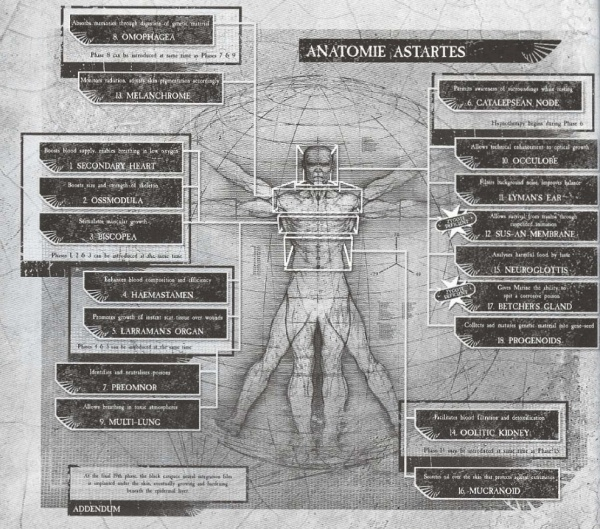
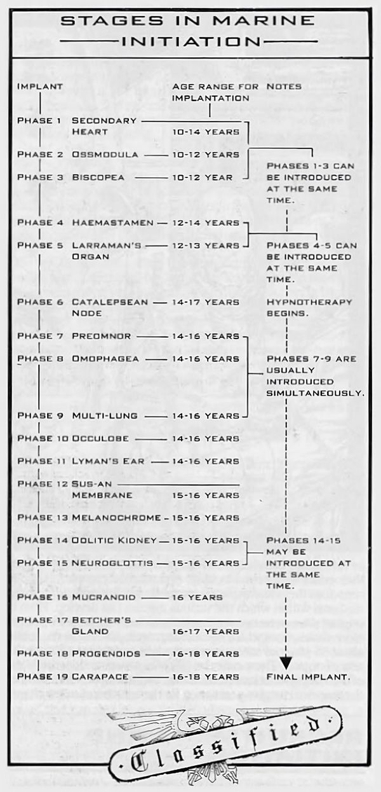
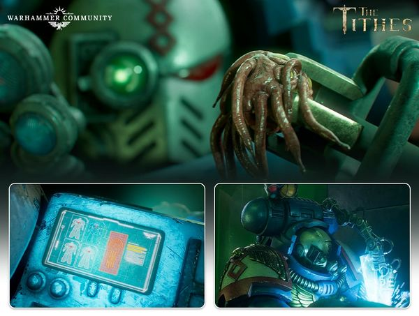
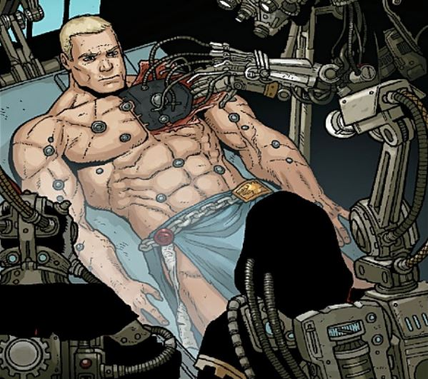

# 0234 创造一名星际战士 Create a Space Marine

精校状态：中文行文已逐段精校，部分术语仍为暂定

分类：通用概念 / 帝国 Imperium / 中央政务部 Adeptus Terra / 阿斯塔特修会 Adeptus Astartes

原文来源：https://www.bilibili.com/opus/1112843111788183555

原作者：帝国神选罐头

原文时间：2025年09月15日 21:19

[返回分类目录](目录.md) · [全书目录](../../目录.md)

<!-- A0234-B0001 -->
**英文原文**

It takes a considerable amount of time to transform normal humans into Space Marines. They receive implants known as gene-seed which transform their bodies and give them superhuman abilities - making them capable of spitting corrosive venom, absorbing the memories of the dead by eating their flesh, darkening their skin to protect it from radiation, and operating for long periods without sleep by switching off parts of their brains at a time. Wounds suffered by a Space Marine that would take a baseline human months to heal, if they ever healed at all, take only days to recover from.

<!-- /A0234-B0001 -->

<!-- A0234-B0002 -->

原译文

将普通人转变为星际战士需要相当长的时间。他们接受了被称为基因种子的植入物，这种植入物可以改变他们的身体，赋予他们超人的能力 — 使他们能够吐出腐蚀性毒液，通过吞食血肉来吸收死者的记忆，使皮肤变黑以保护其免受辐射，并通过一次关闭部分大脑来长时间不睡觉。星际战士所受的创伤，对于一个普通人类而言，即便能够愈合，也需要数月时间，而星际战士只需几天便可恢复。

**校订译文**

将普通人改造为星际战士，需要漫长的时间。由基因种子培育的植入物会改变他们的身体，赋予超常能力：吐出腐蚀性毒液，吞食死者血肉以获取其记忆，改变肤色以抵御辐射，以及让大脑各部分轮流休息，从而长时间保持行动。普通人即使能够愈合，也需数月才能恢复的创伤，星际战士往往数日便能痊愈。

<!-- /A0234-B0002 -->

<!-- A0234-B0003 图片 -->

<!-- A0234-B0004 -->

原译文

Anatomy of a Space Marine 星际战士的剖析

**校订译文**

Anatomy of a Space Marine 星际战士解剖图

<!-- /A0234-B0004 -->

<!-- A0234-B0005 -->
**英文原文**

Recruits are subjected to psycho-indoctrination and conditioning, strengthening their resolve and honing them into dedicated and merciless warriors. Not all recruits survive the brutal training, of course, and not all are accepted.

<!-- /A0234-B0005 -->

<!-- A0234-B0006 -->

原译文

新兵接受心理灌输和训练，增强他们的决心，把他们磨练成忠诚无情的战士。当然，并非所有新兵都能在残酷的训练中幸存下来，也并非所有人都被接受。

**校订译文**

新兵接受心理灌输和训练，增强他们的决心，把他们磨练成忠诚无情的战士。当然，并非所有新兵都能在残酷的训练中幸存下来，也并非所有人都被接受。

<!-- /A0234-B0006 -->

<!-- A0234-B0007 -->
## Selection 选择

<!-- /A0234-B0007 -->

<!-- A0234-B0008 -->
**英文原文**

Recruits are typically chosen from the best warriors among humanity. Naturally this makes Death and Feral Worlds prized recruitment grounds, as such harsh and primal conditions produce the best warriors. However, hive worlds are considered the ideal source of potential recruits; while the populace of the lower levels are often composed of some of the most murderous scum in the human Imperium, more importantly, the higher the population of a world, the higher the chance to find truly impressive individuals. Whole gangs of hive scum are sometimes hunted down and captured for recruitment, although chapters typically prefer volunteers. Among the most valued traits in a recruit are aggression and psychotic-level killer instinct. More rarely, certain civilized worlds are also recruited from.

<!-- /A0234-B0008 -->

<!-- A0234-B0009 -->

原译文

新兵通常是从人类中最好的战士中挑选出来的。自然地，这使得死亡和蛮荒世界成为珍贵的招募地，因为如此恶劣和原始的条件造就了最好的战士。然而，巢都世界被认为是潜在新兵的理想来源；虽然下层民众通常由人类帝国中一些最凶残的渣滓组成，但更重要的是，世界人口越多，找到真正令人印象深刻的人的机会就越大。尽管战团通常更喜欢志愿者，但有时会追捕并抓捕整群巢都渣滓进行招募。新兵最有价值的特质之一是攻击性和心理水平的杀手本能。更罕见的是，某些文明世界也被招募。

**校订译文**

新兵通常从人类最优秀的战士中挑选。死亡世界与蛮荒世界环境严酷、生活原始，能磨炼出强悍战士，因此是备受重视的兵源地。巢都世界也极为理想：下层居民中不乏帝国最凶残的亡命之徒，更何况人口越多，出现非凡个体的机会就越大。战团通常倾向于招募自愿者，但有时也会追捕整支巢都帮派，将其成员带走选拔。强烈的攻击性，以及近乎精神病态的杀戮本能，都是受到看重的资质。少数战团也会从某些文明世界募兵。

<!-- /A0234-B0009 -->

<!-- A0234-B0010 -->
## Requirements 资格要求

原题：Requirements 招募

<!-- /A0234-B0010 -->

<!-- A0234-B0011 -->
**英文原文**

Recruits must be fairly young, because implants often do not become fully functional if the recipient has reached a certain level of physical maturity. They must be male because the geneseed zygotes are keyed to male hormones and genetic structure. Only a small percentage of people are compatible with the implants and hypno-suggestion necessary to turn them into Marines. Before the process of implantation begins the potential recruit receives tissue compatibility tests and psychological screening. If the testing proves successful the recruit becomes an aspirant. After the organ implantation process begins he becomes a neophyte. When the final implant is in place and the requisite training and hypnotherapy complete, he becomes a full brother.

<!-- /A0234-B0011 -->

<!-- A0234-B0012 -->

原译文

新兵必须相当年轻，因为如果接受者已经达到一定的身体成熟度，植入物通常不会完全发挥作用。他们必须是雄性，因为基因种子合子与雄性激素和遗传结构有关。只有一小部分人能够接受将他们变成战士所需的植入物和催眠建议。在植入过程开始之前，潜在的新兵接受组织相容性测试和心理筛查。如果测试成功，新兵就会成为有志者。器官植入过程开始后，他就成了新进者。当最后的植入物就位，必要的训练和催眠治疗完成后，他就成了一个完全的修士。

**校订译文**

候选人必须足够年轻；身体一旦成熟到一定程度，植入物往往无法充分发挥功能。他们还必须是男性，因为基因种子合子与男性激素及遗传结构相匹配。只有少数人能够适应改造所需的植入物与催眠暗示。潜在新兵在开始植入前，须接受组织相容性测试与心理筛查。通过测试者成为有志者，开始器官植入后成为新进者；待最后一项植入完成，并通过规定的训练与催眠治疗，才正式成为修士。

<!-- /A0234-B0012 -->

<!-- A0234-B0013 -->
**英文原文**

Even once the organs are implanted they are generally inactive or useless without associated training, hypnotherapy, and chemical treatment. Most recruits join the ranks as a brother between the ages of 16-18 years.

<!-- /A0234-B0013 -->

<!-- A0234-B0014 -->

原译文

即使器官被植入，如果没有相关的训练、催眠治疗和化学治疗，它们通常也是不活跃或无用的。大多数新兵在16-18岁之间以修士的身份加入队伍。

**校订译文**

器官即使成功植入，若缺少配套训练、催眠治疗及药物调理，通常也不会发挥作用。大多数新兵在十六至十八岁时取得正式修士身份。

<!-- /A0234-B0014 -->

<!-- A0234-B0015 -->
## Implants 植入物

<!-- /A0234-B0015 -->

<!-- A0234-B0016 -->
**英文原文**

The 19-22 (plus, rarely, 1) implanted organs are very complicated, and because several of them only work properly or at all in the presence of other implants, the removal, mutation, or failure of one organ can affect the precise functioning of the others. Because of this, and the fact that each Chapter's gene-seed belongs to that Chapter alone, different Chapters display different characteristics and use different sets of implants and methods of implantation. A "geneseed organ" retains this name even when it is spread across multiple implants, such as the Progenoids or Betcher's Gland, and/or is a cybernetic implant rather than an organ in the traditional sense.

<!-- /A0234-B0016 -->

<!-- A0234-B0017 -->

原译文

19-22个（上下波动一个）植入的器官非常复杂，因为其中几个只有在其他植入物存在的情况下才能正常工作或完全工作，一个器官的切除、突变或衰竭会影响其他器官的精确功能。正因为如此，以及每个战团的基因种子只属于该战团的事实，不同的战团显示出不同的特征，并使用不同的植入物和植入方法。即使“基因种子器官”分布在多个植入物上，如基因存收腺或贝彻腺体，和/或是一种智控植入物，而不是传统意义上的器官，它也保留了这个名字。

**校订译文**

这十九至二十二种植入器官极其复杂，极少数情况下还会额外增加一种。部分器官只有在其他植入物存在时才能正常运作，甚至才会发挥作用，因此一种器官的缺失、突变或衰竭，可能影响其他器官。各战团拥有自身独有的基因种子，因而表现出不同特征，采用的植入器官组合与手术方法也不尽相同。所谓一种“基因种子器官”，可能由多个植入物组成，例如基因存收腺和贝彻腺体；也可能是机械义体，而非传统意义上的生物器官，但仍沿用这一称呼。

**校注：** plus, rarely, 1 意为极少数情况下额外加一，不是上下波动一个；cybernetic 为机械义体类改造，不直接等于机械教的智控技术。

<!-- /A0234-B0017 -->

<!-- A0234-B0018 图片 -->

<!-- A0234-B0019 -->

原译文

Implant Stages 植入阶段

**校订译文**

Implant Stages 植入阶段

<!-- /A0234-B0019 -->

<!-- A0234-B0020 -->
**英文原文**

Throughout the implantation process the Marine must undergo various forms of conditioning in order for the implanted organs to develop and become part of his physiology.

<!-- /A0234-B0020 -->

<!-- A0234-B0021 -->

原译文

在整个植入过程中，战士必须经历各种形式的调节，以便植入的器官发育并成为其生理的一部分。

**校订译文**

在整个植入过程中，战士必须经历各种形式的调节，以便植入的器官发育并成为其生理的一部分。

<!-- /A0234-B0021 -->

<!-- A0234-B0022 -->
**英文原文**

Listed below is the complete set of implants used:

<!-- /A0234-B0022 -->

<!-- A0234-B0023 -->

原译文

下面列出了使用的整套植入物：

**校订译文**

下面列出了使用的整套植入物：

<!-- /A0234-B0023 -->

<!-- A0234-B0024 -->
**英文原文**

If the Marine is from a chapter that drinks something derived from their gene-seed, as Space Wolves and Blood Angels do, this is done either before (as in Space Wolves) or after (as in Blood Angels) every other phase.

<!-- /A0234-B0024 -->

<!-- A0234-B0025 -->

原译文

如果战士来自一个喝来自他们基因种子的东西的战团，就像太空野狼和圣血天使一样，这要么在每隔一个阶段之前（如太空野狼）要么在之后（如圣血天使）完成。

**校订译文**

有些战团会让受术者饮用由本战团基因种子衍生的物质。太空野狼与圣血天使都有这种仪式：前者在其他所有阶段之前进行，后者则在其他所有阶段结束后进行。

**校注：** every other phase 此处指其他所有阶段，原译误为每隔一个阶段，导致仪式时序错误。

<!-- /A0234-B0025 -->

<!-- A0234-B0026 -->
**英文原文**

Phases 1-3 can be introduced at the same time, ideally between 10 and 12 years of age; Phase 1 remains ideal until age 14, but 13-14 are not ideal for Phases 2 or 3.

<!-- /A0234-B0026 -->

<!-- A0234-B0027 -->

原译文

阶段1-3可以同时引入，理想情况下在10至12岁之间；第一阶段在14岁之前仍然是理想的，但13-14岁对于第二或第三阶段来说并不理想。

**校订译文**

阶段1-3可以同时引入，理想情况下在10至12岁之间；第一阶段在14岁之前仍然是理想的，但13-14岁对于第二或第三阶段来说并不理想。

<!-- /A0234-B0027 -->

<!-- A0234-B0028 -->
**英文原文**

If the Marine is receiving Primaris implants, the Sinew Coils and Magnificat are introduced between Phases 3 and 4, in that order or simultaneously; their ideal age is 12-13. The Belisarean Furnace is presumably introduced during this time as well, but in what order, and at what ideal age, is unknown; apparently all three are always introduced across at most 2 steps, so the Furnace is presumably always simultaneous with at least one of the other two. These 1-2 phases are unnumbered, and are instead known as the Primaris Alpha and Primaris Beta phases.

<!-- /A0234-B0028 -->

<!-- A0234-B0029 -->

原译文

如果战士正在接受原铸植入，肌腱线圈和圣颂垂体将按顺序或同时在第3和第4阶段之间引入；他们的理想年龄是12-13岁。贝利撒留熔炉大概也是在这段时间引入的，但其顺序和理想年龄尚不清楚；显然，这三个步骤总是最多两个步骤，因此熔炉可能总是与另外两个步骤中的至少一个同时进行。这1-2个阶段没有编号，而是被称为原铸阿尔法和原铸贝塔阶段。

**校订译文**

若受术者将接受原铸改造，肌腱线圈与圣颂垂体会在第三和第四阶段之间植入；可先植入前者、再植入后者，也可同时进行，理想年龄为十二至十三岁。贝利萨留斯熔炉推测也在这一时期植入，但具体顺序及最佳年龄不明。三种原铸植入物似乎总是在最多两步内完成，因此熔炉应当至少与另外一种同时植入。这一至两个附加阶段不占用原有编号，而称为原铸阿尔法阶段与原铸贝塔阶段。

<!-- /A0234-B0029 -->

<!-- A0234-B0030 -->
**英文原文**

Phases 4 and 5 can be introduced at the same time, ideally between 12 and 14 years of age.

<!-- /A0234-B0030 -->

<!-- A0234-B0031 -->

原译文

第4和第5阶段可以同时进行，最好在12至14岁之间。

**校订译文**

第4和第5阶段可以同时进行，最好在12至14岁之间。

<!-- /A0234-B0031 -->

<!-- A0234-B0032 -->
**英文原文**

Hypnotherapy normally begins at phase 6, ideally sometime between 14 and 17 years of age.

<!-- /A0234-B0032 -->

<!-- A0234-B0033 -->

原译文

催眠治疗通常在第6阶段开始，理想情况下在14至17岁之间。

**校订译文**

催眠治疗通常在第6阶段开始，理想情况下在14至17岁之间。

<!-- /A0234-B0033 -->

<!-- A0234-B0034 -->
**英文原文**

Phases 7 to 9 are normally introduced simultaneously, ideally at a point between 14 and 16 years old.

<!-- /A0234-B0034 -->

<!-- A0234-B0035 -->

原译文

第7至第9阶段通常同时引入，最好在14至16岁之间。

**校订译文**

第7至第9阶段通常同时引入，最好在14至16岁之间。

<!-- /A0234-B0035 -->

<!-- A0234-B0036 -->
**英文原文**

Phases 10 and 11 are also ideally implanted between the ages of 14 and 16.

<!-- /A0234-B0036 -->

<!-- A0234-B0037 -->

原译文

第10和第11阶段最好在14至16岁之间植入。

**校订译文**

第10和第11阶段最好在14至16岁之间植入。

<!-- /A0234-B0037 -->

<!-- A0234-B0038 -->
**英文原文**

Phases 12 and 13 are ideally implanted between the ages of 15 and 16.

<!-- /A0234-B0038 -->

<!-- A0234-B0039 -->

原译文

第12和13阶段最好在15至16岁之间植入。

**校订译文**

第12和13阶段最好在15至16岁之间植入。

<!-- /A0234-B0039 -->

<!-- A0234-B0040 -->
**英文原文**

Phases 14 and 15 may be introduced at the same time, ideally between 15 and 16 years of age.

<!-- /A0234-B0040 -->

<!-- A0234-B0041 -->

原译文

第14和第15阶段可以同时引入，理想情况下在15至16岁之间。

**校订译文**

第14和第15阶段可以同时引入，理想情况下在15至16岁之间。

<!-- /A0234-B0041 -->

<!-- A0234-B0042 -->
**英文原文**

Phases 15 to 19 are then ideally introduced to the recipient between the ages of 16 and 18.

<!-- /A0234-B0042 -->

<!-- A0234-B0043 -->

原译文

第15至19阶段最好在16至18岁之间引入给接受者。

**校订译文**

第15至19阶段最好在16至18岁之间引入给接受者。

**校注：** 英文把第15阶段同时列在15—16岁和16—18岁范围，保留两处数字，待核原始器官表。

<!-- /A0234-B0043 -->

<!-- A0234-B0044 -->
### Canis Helix 狼之螺旋

<!-- /A0234-B0044 -->

<!-- A0234-B0045 -->
**英文原文**

Phase 0: Unique to the Space Wolves chapter, their aspirants drink something derived from their Chapter's gene-seed prior to the rest of the process, in an intricate procedure involving this "Canis Helix". See also Insanguination, the Blood Angels equivalent which happens at the end.

<!-- /A0234-B0045 -->

<!-- A0234-B0046 -->

原译文

第0阶段：太空野狼战团的独特之处在于，在涉及“狼之螺旋”的复杂程序中，他们的有志者在剩下的过程之前喝下来自战团基因种子的东西。另见最后发生的圣血天使。

**校订译文**

第零阶段：太空野狼独有。在其他改造开始前，有志者须通过一套涉及“狼之螺旋”的复杂程序，饮下由本战团基因种子衍生的物质。另见圣血天使对应的“染血”仪式；后者在其他阶段结束后进行。

<!-- /A0234-B0046 -->

<!-- A0234-B0047 -->
### Secondary Heart 第二心脏

<!-- /A0234-B0047 -->

<!-- A0234-B0048 -->
**英文原文**

Phase 1: This simplest and most self-sufficient of implants allows a Space Marine to survive his other heart being damaged or destroyed, and to survive in low oxygen environments. Not just a back-up, the secondary heart can boost the blood flow around the Marine's body.

<!-- /A0234-B0048 -->

<!-- A0234-B0049 -->

原译文

第一阶段：这种最简单、最自给自足的植入物使星际战士能够在另一颗心脏受损或毁坏的情况下存活下来，并在低氧环境中生存。不仅是一个备用心脏，还可以促进战士周身的血液流动。

**校订译文**

第一阶段：这是最简单、最能独立发挥作用的植入器官。即使另一颗心脏受损或被毁，星际战士仍可存活，也能适应低氧环境。第二心脏并非仅供备用，还能增强全身血流。

<!-- /A0234-B0049 -->

<!-- A0234-B0050 -->
### Ossmodula 骨骼强化器官

<!-- /A0234-B0050 -->

<!-- A0234-B0051 -->
**英文原文**

Phase 2: A small, complex, tubular organ, the ossmodula secretes hormones that both affect the ossification of the skeleton and encourages the forming bone growths to absorb ceramic-based chemicals that are laced into the Marine's diet. This drastically alters the way a Space Marine's bones grow and develop. Two years after this implant is first put in the subject's long bones will have increased in size and strength (along with most other bones), and the rib cage will have been fused into a solid, bulletproof mass of interlocking plates. It is not clear how a Space Marine's (non-implanted) lungs operate without a rib cage that can expand and contract.

<!-- /A0234-B0051 -->

<!-- A0234-B0052 -->

原译文

第二阶段：骨骼强化器官是一个小型、复杂的管状器官，分泌激素，既影响骨骼的骨化，又促进骨骼生长，吸收战士饮食中添加的陶钢基化学物质。这彻底改变了星际战士骨骼的生长和发育方式。在这种植入物首次植入受试者体内两年后，受试者的长骨（以及大多数其他骨骼）的大小和强度都会增加，肋骨将融合成一个坚固的、防弹的联锁板块。目前尚不清楚星际战士（未植入）的肺部在没有可以膨胀和收缩的肋骨的情况下是如何运作的。

**校订译文**

第二阶段：骨骼强化器官是一种小型而复杂的管状器官，分泌激素来调节骨化过程，并促使新生骨组织吸收饮食中添加的陶瓷基化合物。这会彻底改变星际战士骨骼的生长方式。植入约两年后，长骨及大多数其他骨骼都会增大、增强；胸廓则融合成相互嵌合的坚硬骨板，足以防弹。原文也指出，若胸廓无法扩张收缩，星际战士原有的肺究竟如何工作，尚未解释。

**校注：** ceramic-based 为陶瓷基，并非明确专名 ceramite 陶钢；生理疑问是英文原作者所述，并非校者新增判断。

<!-- /A0234-B0052 -->

<!-- A0234-B0053 -->
**英文原文**

Known mutations:

<!-- /A0234-B0053 -->

<!-- A0234-B0054 -->

原译文

著名突变：

**校订译文**

已知突变：

<!-- /A0234-B0054 -->

<!-- A0234-B0055 -->
**英文原文**

Black Dragons have a mutated Ossmodula, resulting in bony growths on their foreheads, elbows, and/or forearms.

<!-- /A0234-B0055 -->

<!-- A0234-B0056 -->

原译文

黑龙的骨骼强化器官发生了突变，导致其额头、肘部和/或前臂出现骨质生长。

**校订译文**

黑龙的骨骼强化器官发生了突变，导致其额头、肘部和/或前臂出现骨质生长。

<!-- /A0234-B0056 -->

<!-- A0234-B0057 -->
### Biscopea 肌肉强化器官

<!-- /A0234-B0057 -->

<!-- A0234-B0058 -->
**英文原文**

Phase 3: This small, circular organ is inserted into the chest cavity and releases hormones that vastly increase muscle growth throughout the marine's body. It also serves to form the hormonal basis for many of the later implants.

<!-- /A0234-B0058 -->

<!-- A0234-B0059 -->

原译文

第三阶段：这个小的圆形器官被插入胸腔，释放激素，大大增加整个战士身体的肌肉生长。它还为许多后来的植入物奠定了激素基础。

**校订译文**

第三阶段：一种植入胸腔的小型圆形器官，分泌激素，大幅促进全身肌肉生长，同时为后续许多植入物建立所需的激素环境。

<!-- /A0234-B0059 -->

<!-- A0234-B0060 -->
### Primaris Implants 原铸植入

<!-- /A0234-B0060 -->

<!-- A0234-B0061 -->
**英文原文**

In addition to the above, the new line of Primaris Space Marines are given three additional implants that allow for their superior size and strength in addition to a greater level of genetic stability. The Primaris implants take place between Phases 3 and 4, known as the Primaris Alpha and Primaris Beta phases. Both phases can be introduced simultaneously.

<!-- /A0234-B0061 -->

<!-- A0234-B0062 -->

原译文

除此之外，原铸星际战士的新系列还获得了三个额外的植入物，这些植入物除了具有更高的遗传稳定性外，还具有更优的尺寸和强度。原铸植入发生在第3和第4阶段之间，称为原铸阿尔法和原铸贝塔阶段。这两个阶段可以同时引入。

**校订译文**

原铸星际战士另有三种植入物，使其体型更大、力量更强，遗传结构也更加稳定。它们在第三与第四阶段之间植入，分别称为原铸阿尔法与原铸贝塔阶段；两阶段可以同时进行。

<!-- /A0234-B0062 -->

<!-- A0234-B0063 -->
### Sinew Coils 肌腱线圈

<!-- /A0234-B0063 -->

<!-- A0234-B0064 -->
**英文原文**

Phase 3 Alpha: Also known as the Steel Within. The Space Marine's sinews (tendons and ligaments) are reinforced with durametallic coil-cables that contract with incredible force, dramatically magnifying the subject's strength beyond that of a regular Space Marine and giving another layer of interior defense, which greatly increases their durability.

<!-- /A0234-B0064 -->

<!-- A0234-B0065 -->

原译文

第三阶段阿尔法：也称为钢铁内构。星际战士的肌腱（肌腱和韧带）用硬金属线圈电缆加固，这些电缆以难以置信的力量收缩，极大地增强了受试者的力量，使其超过了普通星际战士的力量，并提供了另一层内部防御，大大提高了他们的韧性。

**校订译文**

第三阶段阿尔法：又称钢铁内构。以高强度金属螺旋缆线强化战士的肌腱与韧带，缆线收缩时可产生惊人力量，使受术者的力量远超传统星际战士。同时，这些结构构成额外的内部防护，大幅增强身体的抗损伤能力。

<!-- /A0234-B0065 -->

<!-- A0234-B0066 -->
### Magnificat 圣颂垂体

<!-- /A0234-B0066 -->

<!-- A0234-B0067 -->
**英文原文**

Phase 3 Beta: Known as the Amplifier, this small thumbnail-sized lobe is inserted into the brain's core. The implant secretes hormones that increases the body's growth functions while also intensifying its advanced systems, especially the ossmodula and biscopea. In truth, this implant is but half of the true, dual-valve immmortis gland (the "God-Maker") which the Emperor made for the Primarchs. Belisarius Cawl was able to build the "dextrophic" lobe (right half) but discovered that information on the "sintarius" (left half) had been wholly eradicated by an unknown force.

<!-- /A0234-B0067 -->

<!-- A0234-B0068 -->

原译文

第3阶段贝塔：被称为增幅器，这个拇指甲大小的小叶被插入大脑的核心。植入物分泌激素，增加身体的生长功能，同时增强其高级系统，特别是骨骼强化器官和肌肉强化器官。事实上，这个植入物只是帝皇为原体制造的真正的双瓣膜不朽腺体（“造神者”）的一半。贝利撒留·考尔能够构建“右生”垂体（右半部分），但发现“隐秘垂体”（左半部分）的信息已被一种未知的力量完全根除。

**校订译文**

第三阶段贝塔：又称增幅器，是植入大脑深部、仅拇指甲大小的腺叶。它分泌激素，增强身体生长，并强化其他改造系统，尤其是骨骼强化器官与肌肉强化器官。实际上，它只是帝皇为原体创造的双叶不朽腺——又称“造神者”——的一半。贝利萨留斯·考尔成功重建了右半部“右生叶”，却发现左半部“辛塔里乌斯叶”的资料已被某种未知力量彻底抹除。

**校注：** sintarius 为虚构腺叶名，暂音译辛塔里乌斯，不据词根将其定为“隐秘”；dextrophic 暂沿用右生叶并保留英文供核。immmortis 在原英文中疑多一个m，原文不改。

<!-- /A0234-B0068 -->

<!-- A0234-B0069 -->
### Belisarian Furnace 贝利萨留斯熔炉

原题：Belisarian Furnace 贝利撒留熔炉

<!-- /A0234-B0069 -->

<!-- A0234-B0070 -->
**英文原文**

Phase Unknown: Known as the Revitalizer, this dormant organ connects to both hearts. In times of extreme stress or trauma, it expels self-manufactured chemicals similar to combat stimms that also aid in regeneration. After activation, the gland will fall dormant again, taking some time to build itself up for activation once more. While information is scarce on when this implant normally occurs, it appears to lack its own phase, instead implanted with either the Sinew Coils, Magnificat, or both.

<!-- /A0234-B0070 -->

<!-- A0234-B0071 -->

原译文

未知阶段：这个休眠器官被称为复活器，与两颗心脏相连。在极端压力或创伤的时候，它会排出类似于对抗刺激的自制化学物质，这些化学物质也有助于再生。激活后，腺体将再次进入休眠状态，需要一些时间来建造自己以再次激活。虽然关于这种植入通常何时发生的信息很少，但它似乎缺乏自己的阶段，而是与肌腱线圈、圣颂垂体一起或两者兼而有之。

**校订译文**

阶段不明：又称复苏器，这一通常休眠的器官与两颗心脏相连。在遭受极端压力或重创时，它会释放自身合成的化学物质，其作用类似战斗兴奋剂，同时促进组织再生。激活后，腺体重新休眠，经过一段时间积累，才可再次启动。有关其植入时机的资料很少；它似乎没有独立阶段，而是与肌腱线圈、圣颂垂体中的一种或两种同时植入。

**校注：** combat stimms 是战斗兴奋剂，非“对抗刺激”；重新休眠后积累药物，并非重新建造器官。

<!-- /A0234-B0071 -->

<!-- A0234-B0072 -->
### Haemastamen 重造血器官

<!-- /A0234-B0072 -->

<!-- A0234-B0073 -->
**英文原文**

Phase 4: Implanted into the main circulatory system, this tiny implant not only increases the haemoglobin content of the subject's blood, making it more efficient at carrying oxygen around the body and making the subject's blood a bright red, it also serves to monitor and control the actions of the phase 2 and phase 3 implants.

<!-- /A0234-B0073 -->

<!-- A0234-B0074 -->

原译文

第四阶段：植入主循环系统，这种微小的植入物不仅增加了受试者血液中的血红蛋白含量，使其更有效地在周身携带氧气，使受试者的血液呈鲜红色，还用于监测和控制第二阶段和第三阶段植入物的动作。

**校订译文**

第四阶段：这种微小器官植入主要循环系统，增加血液中的血红蛋白含量，提高输氧效率，使血液呈鲜红色；同时监测并调节第二、第三阶段植入器官的活动。

<!-- /A0234-B0074 -->

<!-- A0234-B0075 -->
### Larraman's Organ 拉瑞曼器官

<!-- /A0234-B0075 -->

<!-- A0234-B0076 -->
**英文原文**

Phase 5: A liver-shaped organ about the size of a golf-ball, this implant is placed within the chest cavity and connected to the circulatory system. It generates and controls 'Larraman cells', which are released into the blood stream if the recipient is wounded. They attach themselves to leukocytes (white blood cells) in the blood and are carried to the site of the wound, whereupon contact with air they form a near instant patch of scar tissue, sealing any wounds the Space Marine may suffer - acting like platelets, only better.

<!-- /A0234-B0076 -->

<!-- A0234-B0077 -->

原译文

第五阶段：一个高尔夫球大小的肝脏状器官，这种植入物被放置在胸腔内并连接到循环系统。它产生并控制“拉瑞曼细胞”，如果受体受伤，这些细胞会释放到血液中。它们附着在血液中的白细胞（白血细胞）上，并被带到伤口部位，与空气接触后，它们几乎立即形成疤痕组织，密封了星际战士可能遭受的任何伤口 — 就像血小板一样，但效果更好。

**校订译文**

第五阶段：一个高尔夫球大小的肝脏状器官，这种植入物被放置在胸腔内并连接到循环系统。它产生并控制“拉瑞曼细胞”，如果受体受伤，这些细胞会释放到血液中。它们附着在血液中的白细胞（白血细胞）上，并被带到伤口部位，与空气接触后，它们几乎立即形成疤痕组织，密封了星际战士可能遭受的任何伤口 — 就像血小板一样，但效果更好。

<!-- /A0234-B0077 -->

<!-- A0234-B0078 -->
### Catalepsean Node 调控神经节点

<!-- /A0234-B0078 -->

<!-- A0234-B0079 -->
**英文原文**

Phase 6: Implanted into the back of the brain, this pea-sized organ influences the circadian rhythms of sleep and the body's response to sleep deprivation. If deprived of sleep, the catalepsean node cuts in. The node allows a Marine to sleep and remain awake at the same time by switching off areas of his brain sequentially. This process cannot replace sleep entirely, but increases the Marine's survivability by allowing perception of the environment while resting. This means that a Space Marine needs no more than 4 hours of sleep a day, and can potentially go for 2 weeks without any sleep at all.

<!-- /A0234-B0079 -->

<!-- A0234-B0080 -->

原译文

第六阶段：植入大脑后部，这个豌豆大小的器官会影响睡眠的昼夜节律和身体对睡眠剥夺的反应。如果被剥夺了睡眠，调控神经节点就会切入。该节点通过顺序关闭大脑区域，使战士既能入睡，又能保持清醒。这个过程不能完全取代睡眠，但通过在休息时感知环境，提高了战士的生存能力。这意味着一名战士每天只需要不超过4小时的睡眠，并且可以在两周内根本不睡觉。

**校订译文**

第六阶段：这种豌豆大小的器官植入大脑后部，调节睡眠的昼夜节律，以及身体对睡眠不足的反应。缺乏睡眠时，调控神经节点便会启动，让大脑各部分依次休息，使战士能够同时休息并保持清醒。它不能完全取代睡眠，却能让战士在休息时仍感知周围环境，提高生存能力。星际战士因此每天所需睡眠不超过四小时，必要时甚至可能连续两周不睡。

<!-- /A0234-B0080 -->

<!-- A0234-B0081 -->
### Preomnor 预置胃

<!-- /A0234-B0081 -->

<!-- A0234-B0082 -->
**英文原文**

Phase 7: This is essentially a pre-stomach that can neutralise otherwise poisonous or indigestible foods. No actual digestion takes place in the preomnor, as it acts as a decontamination chamber placed before the natural stomach in the body's system and can be isolated from the rest of the digestive tract in order to contain particularly troublesome intake.

<!-- /A0234-B0082 -->

<!-- A0234-B0083 -->

原译文

第7阶段：这基本上是一个胃前阶段，可以中和有毒或难以消化的食物。没有实际的消化发生在预置胃，因为它充当了一个放置在身体系统中天然胃之前的净化室，可以与消化道的其他部分隔离开来，以控制特别麻烦的摄入。

**校订译文**

第七阶段：预置胃位于天然胃之前，负责处理原本有毒或难以消化的食物，本身并不进行真正的消化。它如同一道净化舱，必要时还能与其余消化道隔离，将特别危险的摄入物封存其中。

<!-- /A0234-B0083 -->

<!-- A0234-B0084 -->
### Omophagea 基因侦测神经

<!-- /A0234-B0084 -->

<!-- A0234-B0085 -->
**英文原文**

Phase 8: This implant, also called "the Remembrancer", allows a Space Marine to 'learn by eating'. It is situated in the spinal cord but is actually part of the brain. Four nerve bundles are implanted connecting the spine and the stomach wall. Able to 'read' or absorb genetic material consumed by the marine, the omophagea transmits the gained information to the Marine's brain as a set of memories or experiences. It is the presence of this organ which has led to the various flesh-eating and blood-drinking rituals for which the Astartes are famous, as well as giving names to chapters such as the Blood Drinkers and Flesh Tearers. Over time, mutations in this implant have given some chapters unnatural cravings for blood or flesh.

<!-- /A0234-B0085 -->

<!-- A0234-B0086 -->

原译文

第8阶段：这种植入物也被称为记忆器，可以让星际战士“通过吃来学习”。它位于脊髓中，但实际上是大脑的一部分。植入四个神经束，连接脊柱和胃壁。能够“阅读”或吸收战士吃的遗传物质，基因侦测神经将获得的信息作为一组记忆或经历传递给战士的大脑。正是由于这个器官的存在，阿斯塔特以各种食肉和吸血仪式而闻名，并为饮血者和撕肉者等战团命名。随着时间的推移，这种植入物的突变使一些战团对血液或血肉产生了不自然的渴望。

**校订译文**

第八阶段：又称记忆器，使星际战士能够“以进食获取知识”。它位于脊髓内，但实际上属于大脑的一部分；四束植入的神经连接脊柱与胃壁，读取或吸收食物中的遗传材料，再将信息以记忆和经历的形式传递给大脑。这种器官促成了阿斯塔特众多食肉、饮血仪式，也影响了饮血者、撕肉者等战团名称的形成。随着时间推移，相关突变还使一些战团对鲜血或血肉产生异常渴求。

<!-- /A0234-B0086 -->

<!-- A0234-B0087 -->
**英文原文**

Known mutations:

<!-- /A0234-B0087 -->

<!-- A0234-B0088 -->

原译文

著名突变：

**校订译文**

已知突变：

<!-- /A0234-B0088 -->

<!-- A0234-B0089 -->
**英文原文**

Blood Angels have an overactive Omophagea, but whether or to what extent this is relevant to The Flaw is unclear.

<!-- /A0234-B0089 -->

<!-- A0234-B0090 -->

原译文

圣血天使有一个过度活跃的基因侦测神经，但这是否或在多大程度上与缺陷有关尚不清楚。

**校订译文**

圣血天使有一个过度活跃的基因侦测神经，但这是否或在多大程度上与缺陷有关尚不清楚。

<!-- /A0234-B0090 -->

<!-- A0234-B0091 -->
**英文原文**

Blood Drinkers are a Blood Angels successor who suffer an even more extreme form of the Red Thirst from The Flaw; this is known to be caused by their Omophagea being even more mutated.

<!-- /A0234-B0091 -->

<!-- A0234-B0092 -->

原译文

饮血者是圣血天使的子战团，他们患有缺陷中更极端的血渴；众所周知，这是由于它们的基因侦测神经发生了更大的突变。

**校订译文**

饮血者是圣血天使的子战团，其遗传缺陷使他们承受更强烈的血渴。已知这是其基因侦测神经进一步突变所致。

<!-- /A0234-B0092 -->

<!-- A0234-B0093 -->
### Multi-lung 第三肺

<!-- /A0234-B0093 -->

<!-- A0234-B0094 -->
**英文原文**

Phase 9: This additional lung activates when a Space Marine needs to breathe in low-oxygen or poisoned atmospheres. The natural lungs are closed off by a sphincter muscle associated with the multi-lung and the implanted organ takes over breathing operations. It has highly efficient toxin dispersal systems. The multi-lung even allows space marines to breathe water.

<!-- /A0234-B0094 -->

<!-- A0234-B0095 -->

原译文

第9阶段：当星际战士需要在低氧或有毒环境中呼吸时，这个额外的肺会被激活。天然肺被与第三肺相关的括约肌封闭，植入的器官接管呼吸操作。它具有高效的毒素分散系统。第三肺甚至允许星际战士在水中呼吸。

**校订译文**

第9阶段：当星际战士需要在低氧或有毒环境中呼吸时，这个额外的肺会被激活。天然肺被与第三肺相关的括约肌封闭，植入的器官接管呼吸操作。它具有高效的毒素分散系统。第三肺甚至允许星际战士在水中呼吸。

<!-- /A0234-B0095 -->

<!-- A0234-B0096 -->
### Occulobe 视觉控制器官

<!-- /A0234-B0096 -->

<!-- A0234-B0097 -->
**英文原文**

Phase 10: This implant sits at the base of the brain, and provides hormonal and genetic stimuli which enable a Marine's eyes to respond to optic-therapy. This in turn allows the Apothecaries to make adjustments to the growth patterns of the eye and the light-receptive retinal cells - the result being that Space Marines have far superior vision to normal humans, and can see in low-light conditions almost as well as in daylight. The enhanced eyesight also allows Space Marines to clearly see targets at a distance of a couple of kilometres, making out enemy details with ease.

<!-- /A0234-B0097 -->

<!-- A0234-B0098 -->

原译文

第10阶段：这种植入物位于大脑底部，提供激素和遗传刺激，使战士的眼睛能够对视觉治疗做出反应。这反过来又使药剂师能够调整眼睛和感光视网膜细胞的生长模式，结果是星际战士的视力远远优于正常人，在低光照条件下几乎能和白天一样看东西。增强的视力也使星际战士能够清楚地看到几公里外的目标，轻松地分辨出敌人的细节。

**校订译文**

第10阶段：这种植入物位于大脑底部，提供激素和遗传刺激，使战士的眼睛能够对视觉治疗做出反应。这反过来又使药剂师能够调整眼睛和感光视网膜细胞的生长模式，结果是星际战士的视力远远优于正常人，在低光照条件下几乎能和白天一样看东西。增强的视力也使星际战士能够清楚地看到几公里外的目标，轻松地分辨出敌人的细节。

<!-- /A0234-B0098 -->

<!-- A0234-B0099 -->
### Lyman's Ear 莱曼之耳

<!-- /A0234-B0099 -->

<!-- A0234-B0100 -->
**英文原文**

Phase 11: Not only does this implant make a Space Marine immune to dizziness or motion sickness, it also allows Space Marines to consciously filter out and enhance certain sounds. To such an extent that a Marine is able to distinguish a human heartbeat from a kilometre away. The Lyman's Ear completely replaces a Marine's original ears. It is externally indistinguishable from a normal human ear.

<!-- /A0234-B0100 -->

<!-- A0234-B0101 -->

原译文

第11阶段：这种植入物不仅使星际战士对头晕或晕动病免疫，还使星际战士能够有意识地过滤和增强某些声音。以至于一名战士能够区分一公里外的人的心跳。莱曼之耳完全取代了星际战士原来的耳朵。它在外观上与正常人的耳朵无法区分。

**校订译文**

第11阶段：这种植入物不仅使星际战士对头晕或晕动病免疫，还使星际战士能够有意识地过滤和增强某些声音。以至于一名战士能够区分一公里外的人的心跳。莱曼之耳完全取代了星际战士原来的耳朵。它在外观上与正常人的耳朵无法区分。

<!-- /A0234-B0101 -->

<!-- A0234-B0102 -->
### Sus-an Membrane 苏安脑膜

<!-- /A0234-B0102 -->

<!-- A0234-B0103 -->
**英文原文**

Phase 12: Initially implanted above the brain, this membrane eventually merges with the recipient's entire brain. Ineffective without follow-up chemical therapy and training, with sufficient training a Space Marine can use this implant to enter a state of suspended animation, consciously or as an automatic reaction to extreme trauma, keeping the Marine alive for years, even if he has suffered otherwise mortal wounds. Only the appropriate chemical therapy or auto-suggestion can revive a Marine from this state. The longest recorded period spent in suspended animation was undertaken by Brother Silas Err of the Dark Angels, who was revived after 567 years (d.321.M37)

<!-- /A0234-B0103 -->

<!-- A0234-B0104 -->

原译文

第12阶段：最初植入大脑上方，这层膜最终与受体的整个大脑融合。即使没有后续的化学治疗和训练，只要经过足够的训练，星际战士也可以使用这种植入物进入假死状态，有意识地或作为对极端创伤的自动反应，使战士存活多年，即使他遭受了致命伤。只有适当的化学疗法或自我暗示才能使战士从这种状态中复活。有记录以来最长的假死时间是由黑暗天使的修士塞拉斯·厄尔完成的，他在567年后复活（d.321.M37）

**校订译文**

第十二阶段：这层膜最初植入大脑上方，最终与整个大脑融合。若没有后续药物调理与训练，它便无法生效。经过充分训练后，星际战士可以主动进入假死状态，也可能在遭受极端创伤时自动进入；即使伤势原本足以致命，也能借此存活多年。唯有适当的药物治疗或自我暗示，才能将其唤醒。有记录以来最长的假死者，是黑暗天使修士塞拉斯·厄尔，他在沉眠五百六十七年后苏醒（原文记 d.321.M37）。

**校注：** 原译把 Ineffective without follow-up chemical therapy and training 误解为即使没有药物治疗也可生效，已恢复必要条件。末尾 d.321.M37 的 d. 可能是日期或死亡标记，原文未说明，原样保留待核。

<!-- /A0234-B0104 -->

<!-- A0234-B0105 -->
**英文原文**

This organ is also known as the hibernator implant.

<!-- /A0234-B0105 -->

<!-- A0234-B0106 -->

原译文

这个器官也被称为沉眠器植入物。

**校订译文**

这个器官也被称为沉眠器植入物。

<!-- /A0234-B0106 -->

<!-- A0234-B0107 -->
### Melanchromic Organ 色素控制器官

<!-- /A0234-B0107 -->

<!-- A0234-B0108 -->
**英文原文**

Phase 13: This implant controls the amount of melanin in a Marine's skin. Exposure to high levels of sunlight will result in the Marine's skin darkening to compensate. It also protects the Marine from other forms of radiation.

<!-- /A0234-B0108 -->

<!-- A0234-B0109 -->

原译文

第13阶段：该植入物控制战士皮肤中的黑色素含量。暴露在高水平的阳光下会导致战士的皮肤变黑以进行补偿。它还保护战士免受其他形式的辐射。

**校订译文**

第十三阶段：控制战士皮肤中的黑色素含量。受到强烈日照时，皮肤便会加深颜色，以增强防护；它也能帮助抵御其他形式的辐射。

<!-- /A0234-B0109 -->

<!-- A0234-B0110 -->
### Oolitic Kidney 卵石肾脏

<!-- /A0234-B0110 -->

<!-- A0234-B0111 -->
**英文原文**

Phase 14: In conjunction with the secondary heart this implant allows a Space Marine to filter his blood very quickly, rendering him immune to most poisons. This action comes at a price, however, as this emergency detoxification usually renders the Marine unconscious while his blood is circulated at high speed. The organ's everyday function is to monitor the entire circulatory system and allow other organs to function effectively.

<!-- /A0234-B0111 -->

<!-- A0234-B0112 -->

原译文

第14阶段：与第二心脏结合，这种植入物使星际战士能够非常快速地过滤血液，使他对大多数毒素免疫。然而，这一行动是有代价的，因为这种紧急排毒通常会使战士在血液高速循环时失去意识。该器官的日常功能是监测整个循环系统，并使其他器官有效运作。

**校订译文**

第14阶段：与第二心脏结合，这种植入物使星际战士能够非常快速地过滤血液，使他对大多数毒素免疫。然而，这一行动是有代价的，因为这种紧急排毒通常会使战士在血液高速循环时失去意识。该器官的日常功能是监测整个循环系统，并使其他器官有效运作。

<!-- /A0234-B0112 -->

<!-- A0234-B0113 -->
### Neuroglottis 味觉监测神经

<!-- /A0234-B0113 -->

<!-- A0234-B0114 -->
**英文原文**

Phase 15: This enhances a Space Marine's sense of taste to such a high degree that he can identify many common chemicals by taste alone. A Marine can even track a target like a hound by taste or just sampling air. This also has the effect of enhancing the flavour of consumables such as wine.

<!-- /A0234-B0114 -->

<!-- A0234-B0115 -->

原译文

第15阶段：这大大增强了星际战士的味觉，使他能够仅凭味觉识别许多常见的化学物质。战士甚至可以像猎犬一样通过味觉或只是采样空气来追踪目标。这也有增强果酒等消耗品风味的效果。

**校订译文**

第十五阶段：大幅增强味觉，使星际战士仅凭味道就能辨识许多常见化学物质，甚至能像猎犬一样，通过尝味或采样空气追踪目标。这也使他们感受到的酒类等饮品风味更加浓烈。

<!-- /A0234-B0115 -->

<!-- A0234-B0116 -->
### Mucranoid 汗腺改进器官

<!-- /A0234-B0116 -->

<!-- A0234-B0117 -->
**英文原文**

Phase 16: This implant allows a Space Marine to sweat a substance that coats the skin and offers resistance to extreme heat and cold and can even provide some protection for the marine in a vacuum. This can only be activated by outside treatment, and is common when Space Marines are expected to be fighting in vacuum.

<!-- /A0234-B0117 -->

<!-- A0234-B0118 -->

原译文

第16阶段：这种植入物可以让星际战士分泌一种覆盖皮肤的物质，这种物质可以抵抗极端的冷热，甚至可以在真空中为战士提供一些保护。这只能通过外部处理激活，在星际战士预计在真空中作战时很常见。

**校订译文**

第十六阶段：使星际战士分泌覆盖皮肤的保护物质，抵御酷热与严寒，甚至能在真空中提供一定保护。这项功能必须以外部治疗手段激活，通常在预期需要真空作战时启用。

<!-- /A0234-B0118 -->

<!-- A0234-B0119 -->
### Betcher's Gland 贝彻腺体

<!-- /A0234-B0119 -->

<!-- A0234-B0120 -->
**英文原文**

Phase 17: Consists of two identical glands, implanted either into the lower lip, alongside the salivary glands, or into the hard palate. The gland works in a similar way to the poison gland of venomous reptiles by synthesizing and storing deadly poison, which the Marines themselves are immune to. This allows a Space Marine to spit a blinding contact poison. The poison is also corrosive and can even burn away "strong" metals, given sufficient time.

<!-- /A0234-B0120 -->

<!-- A0234-B0121 -->

原译文

第17阶段：由两个相同的腺体组成，植入下唇、唾液腺旁或硬腭。这种腺体的工作方式与有毒爬行动物的毒腺相似，通过合成和储存致命的毒素，而战士本身对这种毒素免疫。这使得星际战士能够吐出令人致盲的接触毒素。这种毒药也有腐蚀性，只要时间足够，甚至可以烧掉“坚固的”金属。

**校订译文**

第17阶段：由两个相同的腺体组成，植入下唇、唾液腺旁或硬腭。这种腺体的工作方式与有毒爬行动物的毒腺相似，通过合成和储存致命的毒素，而战士本身对这种毒素免疫。这使得星际战士能够吐出令人致盲的接触毒素。这种毒药也有腐蚀性，只要时间足够，甚至可以烧掉“坚固的”金属。

<!-- /A0234-B0121 -->

<!-- A0234-B0122 -->
### Progenoids 基因存收腺

<!-- /A0234-B0122 -->

<!-- A0234-B0123 -->
**英文原文**

Phase 18: There are two of these glands, one situated in the neck and the other within the chest cavity. These glands are vitally important and represent the future of the Chapter, as the only way new gene-seed can be produced is by reproducing it within the bodies of the Marines themselves. This is the implant's only purpose. The glands absorb genetic material from the other implanted organs. When they have matured, each gland will have developed a single gene-seed corresponding to each of the zygotes which have been implanted into the Marine.

<!-- /A0234-B0123 -->

<!-- A0234-B0124 -->

原译文

第18阶段：有两个腺体，一个位于颈部，另一个位于胸腔内。这些腺体至关重要，代表着战团的未来，因为产生新基因种子的唯一方法是在战士体内繁殖。这是植入物的唯一目的。腺体从其他植入器官吸收遗传物质。当它们成熟时，每个腺体都会发育出一个与植入战士的每个合子相对应的单个基因种子。

**校订译文**

第十八阶段：两枚基因存收腺分别位于颈部与胸腔。它们关乎战团的未来，因为新基因种子只能在现有星际战士体内繁育；这也是该器官唯一的职责。腺体从其他植入器官中吸收遗传材料，成熟时，会针对受术者植入的每一种合子，各生成一份对应的基因种子。

<!-- /A0234-B0124 -->

<!-- A0234-B0125 图片 -->

<!-- A0234-B0126 -->

原译文

Primaris Apothecary harvesting Progenoid Gland 原铸药剂师收割基因存收腺

**校订译文**

Primaris Apothecary harvesting Progenoid Gland 原铸药剂师收割基因存收腺

<!-- /A0234-B0126 -->

<!-- A0234-B0127 -->
**英文原文**

These take time (5 years in the first case, 10 in the latter) to mature into gene-seed. The gene-seed can then be extracted and used to create more Space Marines. Thanks to the superior implantation process and genetic stability of Primaris Space Marines, the Imperium has recently been able to harvest gene-seed at a rate previously unseen.

<!-- /A0234-B0127 -->

<!-- A0234-B0128 -->

原译文

这些需要时间（第一种情况为5年，第二种情况为10年）才能成熟为基因种子。然后可以提取基因种子并用于创建更多的星际战士。得益于原铸星际战士的卓越植入工艺和遗传稳定性，帝国最近能够以前所未有的速度收获基因种子。

**校订译文**

颈部腺体约五年成熟，胸腔腺体约十年成熟。随后即可提取其中的基因种子，培育更多星际战士。凭借原铸更完善的植入流程与更稳定的遗传结构，帝国近来能够以前所未见的速度收获基因种子。

<!-- /A0234-B0128 -->

<!-- A0234-B0129 -->
### Black Carapace 黑色甲壳

<!-- /A0234-B0129 -->

<!-- A0234-B0130 -->
**英文原文**

Phase 19: The most distinctive implant, it resembles a film of black plastic that is implanted directly beneath the skin of the Marine's torso in sheets. It hardens on the outside and sends invasive neural bundles into the Marine's body. After the organ has matured the recipient is then fitted with neural sensors and interface points cut into the carapace's surface. This allows a Space Marine to interface directly with his Power Armour. Without the Black Carapace many of the systems of the power armour will not function. While driving the vehicles of the Chapter, a special spinal interface plugged into the power armour and Black Carapace provides the Space Marine an intuitive 'feel' for vehicles systems and controls, literally making him a part of his vehicle. A similar cybernetic used by the Imperium of Man is the Mind Impulse Unit.

<!-- /A0234-B0130 -->

<!-- A0234-B0131 -->

原译文

第19阶段：最独特的植入物，它类似于一层黑色塑料薄膜，直接植入战士躯干的皮肤下。它在外部变硬，并将侵入性神经束发送到战士的体内。器官成熟后，受体会被安装神经传感器，并在甲壳表面切割出接入点。这使得星际战士可以直接与他的动力盔甲进行交互。没有黑色甲壳，许多动力盔甲系统将无法运行。在驾驶战团的载具时，插入动力盔甲和黑色甲壳的特殊脊柱接口为星际战士提供了对载具系统和控制的直观“感觉”，使他成为载具的一部分。人类帝国使用的一种类似的智控是思维脉冲单元。

**校订译文**

第十九阶段：这是最具代表性的植入物，外观如黑色塑料薄膜，以片状直接植入躯干皮下。其外层逐渐硬化，内部则生出深入身体的神经束。成熟后，医生会在甲壳表面开设接口，安装神经传感器，使星际战士能够直接接入动力甲；没有黑色甲壳，动力甲的许多系统便无法运作。驾驶战团载具时，连接动力甲与黑色甲壳的专用脊柱接口，还能让战士直觉般感知载具系统及操控，仿佛与载具合为一体。帝国另有一种作用类似的机械接口，称为思维脉冲单元。

<!-- /A0234-B0131 -->

<!-- A0234-B0132 图片 -->

<!-- A0234-B0133 -->

原译文

Marneus Calgar being implanted with the Black Carapace 马涅乌斯·卡尔加被植入黑色甲壳

**校订译文**

Marneus Calgar being implanted with the Black Carapace 马涅乌斯·卡尔加被植入黑色甲壳

<!-- /A0234-B0133 -->

<!-- A0234-B0134 -->
**英文原文**

The Black Carapace was originally developed during the Unification era by the Terran scientist Amar Astarte. However, it was flawed, and could not be utilized until Ezekiel Sedayne perfected the technology. Director Sedayne stated that this unusual part of the Astartes program required the carapace to be grafted in substantial pieces, as it couldn't be grown internally from seed germs, like some other organs. Once in place, it encourages the human body to adopt it as its own, and it spreads. It is an engineered, controlled cancer.

<!-- /A0234-B0134 -->

<!-- A0234-B0135 -->

原译文

黑色甲壳最初是由人类科学家阿马尔·阿斯塔特在统一时代开发的。然而，它有缺陷，在以西结·赛丹完善这项技术之前无法使用。负责人赛丹表示，阿斯塔特项目的这一不同寻常的部分要求将甲壳以大块移植，因为它不能像其他一些器官一样从种子胚胎在内部生长。一旦到位，它就会刺激人体将其视为自己的，并伸展开来。它是一种工程化的、可控的似癌器官。

**校订译文**

黑色甲壳最早由统一战争时期的泰拉科学家阿玛尔·阿斯塔特研制，但初期存在缺陷，直到以西结·赛丹完善技术后才得以使用。赛丹主任解释说，这项阿斯塔特计划中的特殊成果，必须以较大块的组织移植，无法像某些器官一样从种子细胞在体内长成。植入后，它会促使人体将其接纳为自身组织，并继续扩展——本质上是一种人工设计、受控的癌组织。

**校注：** engineered, controlled cancer 明确是人工设计的受控癌组织，不将其弱化为仅仅“似癌”。

<!-- /A0234-B0135 -->

<!-- A0234-B0136 -->
### Insanguination 染血

<!-- /A0234-B0136 -->

<!-- A0234-B0137 -->
**英文原文**

Phase 20: Unique to the Blood Angels chapter, their neophytes drink something derived from their Chapter's gene-seed after the rest of the process, in a very involved process called Insanguination. See also Canis Helix, the Space Wolves equivalent which happens at the beginning.

<!-- /A0234-B0137 -->

<!-- A0234-B0138 -->

原译文

第20阶段：圣血天使战团的独特之处在于，在剩下的过程中，他们的新进者会喝下来自该战团基因种子的东西，这是一个非常复杂的过程，称为染血。另请参阅狼之螺旋，这是太空野狼在开始时发生的类似事件。

**校订译文**

第二十阶段：圣血天使独有。在其他改造阶段完成后，新进者须参加复杂的“染血”仪式，饮用由本战团基因种子衍生的物质。另见太空野狼对应的“狼之螺旋”仪式；后者在改造开始前进行。

<!-- /A0234-B0138 -->

<!-- A0234-B0139 -->
## Conditioning 调节

<!-- /A0234-B0139 -->

<!-- A0234-B0140 -->
**英文原文**

Chemical Treatment - Until his initiation, a Marine must submit to constant tests and examinations. The newly implanted organs must be monitored very carefully, imbalances corrected, and any sign of maldevelopment treated. This chemical treatment is reduced after completion of the initiation process, but it never ends. Marines undergo periodic treatment for the rest of their lives in order to maintain a stable metabolism. Marine power armour contains monitoring equipment and drug dispensers to aid in this.

<!-- /A0234-B0140 -->

<!-- A0234-B0141 -->

原译文

化学治疗 - 在开始之前，战士必须接受持续的测试和检查。必须非常仔细地监测新植入的器官，纠正不平衡，并治疗任何发育不良的迹象。在启动过程完成后，这种化学治疗会减少，但永远不会结束。战士在余生中会定期接受治疗，以保持稳定的新陈代谢。战士的动力盔甲包含监控设备和药物分配器，以帮助实现这一目标。

**校订译文**

药物调理——正式入团前，战士必须持续接受测试和检查。新植入器官受到严密监测，任何失衡或发育异常都须及时纠正。入团程序完成后，用药会减少，却不会终止；战士终生都要定期接受调理，以维持稳定代谢。动力甲也配有监测设备和自动给药装置，辅助这一过程。

<!-- /A0234-B0141 -->

<!-- A0234-B0142 -->
**英文原文**

Hypnotherapy - As the super-enhanced body grows, the recipient must learn how to use his new abilities. Some of the implants, specifically the phase 6 and 10 implants, can only function once correct hypnotherapy has been administered. Hypnotherapy is not always as effective as chemical treatment, but it can have substantial results. If a Marine can be taught how to control his own metabolism, his dependence on drugs is lessened. The process is undertaken in a machine called a Hypnomat. Marines are placed in a state of hypnosis and subjected to visual and aural stimuli in order to awaken their minds to their unconscious metabolic processes.

<!-- /A0234-B0142 -->

<!-- A0234-B0143 -->

原译文

催眠疗法 - 随着超级增强身体的生长，接受者必须学会如何使用他的新能力。一些植入物，特别是6和10阶段的植入物，只有在进行了正确的催眠治疗后才能发挥作用。催眠疗法并不总是像化学治疗那样有效，但它可以产生实质性的效果。如果一名战士能够学会如何控制自己的新陈代谢，他对药物的依赖就会减少。该过程在一台名为催眠装置的机器中进行。战士被置于催眠状态，并受到视觉和听觉刺激，以唤醒他们对无意识代谢过程的意识。

**校订译文**

催眠疗法 - 随着超级增强身体的生长，接受者必须学会如何使用他的新能力。一些植入物，特别是6和10阶段的植入物，只有在进行了正确的催眠治疗后才能发挥作用。催眠疗法并不总是像化学治疗那样有效，但它可以产生实质性的效果。如果一名战士能够学会如何控制自己的新陈代谢，他对药物的依赖就会减少。该过程在一台名为催眠装置的机器中进行。战士被置于催眠状态，并受到视觉和听觉刺激，以唤醒他们对无意识代谢过程的意识。

<!-- /A0234-B0143 -->

<!-- A0234-B0144 -->
**英文原文**

Indoctrination - Just as their bodies receive 19-22 separate implants, so their minds are altered to release the latent powers within. These mental powers are, if anything, more extraordinary than even the physical powers described above. For example, a Marine can control his senses and nervous system to a remarkable degree, and can consequently endure pain that would kill an ordinary man. A Marine can also think and react at lightning speeds. Memory training is an important part of the indoctrination, too. Some Marines develop photographic memories. Obviously, Marines vary in intelligence as do other men, and their individual mental abilities vary in degree.

<!-- /A0234-B0144 -->

<!-- A0234-B0145 -->

原译文

灌输 - 就像他们的身体接受19-22个单独的植入物一样，他们的思想也会被改变，以释放内在的潜在力量。如果说有什么不同的话，这些精神力量甚至比上述身体力量更非凡。例如，一名战士可以在很大程度上控制自己的感官和神经系统，因此可以忍受杀死普通人的疼痛。战士还可以以闪电般的速度思考和反应。记忆训练也是灌输的重要组成部分。一些战士会发展出照相记忆。显然，战士和其他人一样，智力各不相同，他们的个人精神能力也各不相同。

**校订译文**

思想教导——身体接受十九至二十二种植入物的同时，心智也经过改造，以释放潜能。某些心智能力甚至比身体强化更惊人：战士可以高度控制感官与神经系统，承受足以让普通人死亡的痛苦，并以闪电般速度思考和反应。记忆训练也是重要一环，有些人因此获得过目不忘的能力。当然，星际战士同样存在智力差异，各人的心智能力也不完全相同。

<!-- /A0234-B0145 -->

<!-- A0234-B0146 -->
**英文原文**

Physical Training - Physical training stimulates the implants and allows them to be tested for effectiveness.

<!-- /A0234-B0146 -->

<!-- A0234-B0147 -->

原译文

体能训练 - 体能训练可以刺激植入物，并测试其有效性。

**校订译文**

体能训练 - 体能训练可以刺激植入物，并测试其有效性。

<!-- /A0234-B0147 -->

<!-- A0234-B0148 -->
**英文原文**

After all of these implants and alterations to the human body, there is a serious debate whether or not Space Marines are human. While they indubitably serve humanity, they are at least two meters tall and can breathe poison and eat through metal.

<!-- /A0234-B0148 -->

<!-- A0234-B0149 -->

原译文

在对人体进行了所有这些植入和改造之后，对于星际战士是否是人类存在着一场激烈的争论。虽然他们无疑为人类服务，但他们至少有两米高，可以呼吸毒素，吞食金属。

**校订译文**

经历如此多的植入与改造后，星际战士究竟是否仍算人类，成为严肃的争论。虽然他们无疑效力于人类，却至少身高两米，能够呼吸有毒气体，甚至以酸液蚀穿金属。

**校注：** eat through metal 结合本篇贝彻腺体的腐蚀性毒液，指蚀穿金属，并非把金属当食物吞食。

<!-- /A0234-B0149 -->

本篇核心术语与暂定项

以下列出本篇出现的英文原形及核心术语表用词。同形词可能指不同对象，具体词义以本篇正文和校注为准；单复数、别名和仅见于图注的名称可能尚未列入。完整候选见[术语表](../../术语表/双语术语候选.csv)。

| 英文 | 采用中文 | 状态 |
| --- | --- | --- |
| Space Marines | 星际战士 | 官方已核对 |
| Blood Angels | 圣血天使 | 官方已核对 |
| Dark Angels | 黑暗天使 | 官方已核对 |
| Space Wolves | 太空野狼 | 官方已核对 |
| Imperium of Man | 人类帝国 | 官方已核对 |
| Imperium | 帝国 | 暂定·简称 |
| Equipment | 装备 | 编辑用语已统一 |
| Emperor | 帝皇 | 官方已核对 |
| Amar Astarte | 阿玛尔·阿斯塔特 | 暂定·官方待核 |
| Feral Worlds | 蛮荒世界 | 暂定·官方待核 |
| Clear | 清明 | 暂定·官方待核 |
| Neophyte | 新进者 | 暂定 |
| Ezekiel Sedayne | 以西结·赛丹 | 暂定·官方待核 |
| Belisarius Cawl | 贝利萨留斯·考尔 | 官方已核对 |
| Aspirant | 候补骑士 | 暂定·官方待核 |
| The Primarchs | 原体 | 暂定·官方待核 |
| Power Armour | 动力盔甲 | 暂定·官方待核 |
| Space Marine | 星际战士 | 暂定·官方待核 |
| Chapter | 战团 | 暂定·官方待核 |
| Brother | 修士 | 暂定·官方待核 |
| Ezekiel | 以西结 | 暂定·官方待核 |
| Flesh Tearers | 撕肉者 | 暂定·官方待核 |
| Blood Drinkers | 饮血者 | 暂定·官方待核 |
| Black Dragons | 黑龙 | 暂定·官方待核 |
| Gene-seed | 基因种子 | 暂定·官方待核 |
| Canis Helix | 狼之螺旋 | 暂定·官方待核 |
| Secondary Heart | 第二心脏 | 暂定·官方待核 |
| Ossmodula | 骨骼强化器官 | 暂定·官方待核 |
| Biscopea | 肌肉强化器官 | 暂定·官方待核 |
| Sinew Coils | 肌腱线圈 | 暂定·官方待核 |
| Magnificat | 圣颂垂体 | 暂定·官方待核 |
| Catalepsean Node | 调控神经节点 | 暂定·官方待核 |
| Preomnor | 预置胃 | 暂定·官方待核 |
| Omophagea | 基因侦测神经 | 暂定·官方待核 |
| Multi-lung | 第三肺 | 暂定·官方待核 |
| Lyman's Ear | 莱曼之耳 | 暂定·官方待核 |
| Betcher's Gland | 贝彻腺体 | 暂定·官方待核 |
| Progenoids | 基因存收腺 | 暂定·官方待核 |
| Black Carapace | 黑色甲壳 | 暂定·官方待核 |
| Insanguination | 染血 | 暂定·官方待核 |
| Monitor | 监视者 | 暂定·官方待核 |
| Mortal | 凡人 | 暂定·官方待核 |
| God-Maker | 造神者 | 暂定·官方待核 |
| Dextrophic | 右生叶 | 暂定·官方待核 |
| Sintarius | 辛塔里乌斯叶 | 暂定·官方待核 |
| Powers | 能天使 | 暂定·官方待核 |
| Venom | 毒液飞艇 | 官方已核对 |
| Merciless | 无情号 | 暂定·官方待核 |
| The Dark | 《黑暗》 | 暂定·官方待核 |
| The Blood | 鲜血 | 暂定·官方待核 |
| Price | 普莱斯 | 暂定·官方待核 |
| System | 星系（恒星系统） | 暂定·官方待核 |
| Beta | 贝塔号 | 暂定·官方待核 |
| Mind Impulse Unit | 思维驱动单元 | 暂定·官方待核 |

