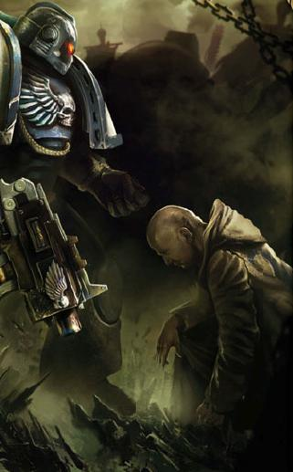

# 0240 战团农奴 Chapter serfs

精校状态：中文行文已逐段精校，部分术语仍为暂定

分类：通用概念 / 帝国 Imperium / 中央政务部 Adeptus Terra / 阿斯塔特修会 Adeptus Astartes

原文来源：https://www.bilibili.com/opus/1207704448153944131

原作者：帝国神选罐头

原文时间：2026年05月29日 12:30

[返回分类目录](目录.md) · [全书目录](../../目录.md)

原篇名：战团侍从 Chapter serfs

<!-- A0240-B0001 -->
**英文原文**

Chapter serfs (or Legion serfs during the Great Crusade and Horus Heresy) are the normal human bondsmen and servants of a Space Marine Chapter. The Space Marines themselves are too few in number to manage all the tasks required to maintain all the aspects of the Chapter, its fleet, fortress, and other myriad aspects. It is the serfs who perform most of these vital functions.

<!-- /A0240-B0001 -->

<!-- A0240-B0002 -->

原译文

战团侍从（或大远征和荷鲁斯叛乱时期的军团侍从）是星际战士战团的正常人类奴隶和仆人。星际战士人数太少，无法管理维护战团、舰队、堡垒和其他无数方面所需的所有任务。侍从履行了这些重要职能中的大部分。

**校订译文**

战团农奴是隶属于星际战士战团的普通人类奴仆；大远征与荷鲁斯之乱时期，则称军团农奴。星际战士人数有限，无法亲自承担维持战团、舰队和堡垒运作的所有事务，这些不可或缺的工作大多由农奴完成。

**校注：** Chapter serfs 沿用本篇“战团侍从”作为名称；正文保留其受束缚、世袭的奴仆身份，不将其改述为自由雇员。 serf按奴役关系统一农奴；原稿称侍从，Equerry等具体侍从官职务不改。

<!-- /A0240-B0002 -->

<!-- A0240-B0003 -->
## Overview 概述

<!-- /A0240-B0003 -->

<!-- A0240-B0004 -->
**英文原文**

A Chapter's fortress-monastery is home to a large population of these hereditary servants. Although they occupy a humble position, they are loyal members of the Chapter. They are generally descended from individuals selected as potential recruits to the Chapter, but in the end, judged unfit to become actual Space Marines. Many serfs are these unsuccessful aspirants. Although many failed Astartes aspirants show nothing but love and devotion for their duties, from the most honoured Artificer to the lowliest programmer of servitors, many still harbour closely guarded regret and resentment.

<!-- /A0240-B0004 -->

<!-- A0240-B0005 -->

原译文

一个战团的堡垒修道院是这些大量世袭仆人的家园。虽然他们地位卑微，但他们是战团的忠实成员。他们通常是被选为战团潜在新兵的人的后代，但最终被认为不适合成为真正的星际战士。许多侍从都是这些未成功的有志者。尽管许多失败的阿斯塔特有志者只表现出对职责的热爱和奉献，从最受尊敬的技工到最低级的机仆程序员，但许多人仍然怀有深藏不露的遗憾和怨恨。

**校订译文**

要塞修道院中生活着大量世代服役的农奴。他们虽地位卑微，却是战团的忠诚成员。许多人是曾获选为候选人、最终却不适合成为星际战士者的后代，也有不少人本身就是落选的有志者。从最受尊敬的工匠到最卑微的机仆程序员，许多落选者只表现出对职责的热爱与奉献；然而，也有人把遗憾与怨怼深藏心中。

<!-- /A0240-B0005 -->

<!-- A0240-B0006 图片 -->

<!-- A0240-B0007 -->

原译文

Chapter serf bowing to a Space Marine 战团侍从向星际战士鞠躬

**校订译文**

Chapter serf bowing to a Space Marine 战团农奴向星际战士鞠躬

<!-- /A0240-B0007 -->

<!-- A0240-B0008 -->
**英文原文**

The serfs are inducted into the Chapter cult and tend to not begrudge their status. Both men and women are bound to serfdom under their Astartes masters. They are generally well treated within the Chapter, are educated and trained to a much higher standard than most other servants of the Imperium, and have access to a better range of equipment. Commendations received from their Space Marines for exemplary execution of their duties might consist of branding of the Chapter's symbol into their flesh.

<!-- /A0240-B0008 -->

<!-- A0240-B0009 -->

原译文

侍从被引入战团教派，并倾向于不嫉妒自己的地位。男人和女人都受制于他们阿斯塔特主人的农奴制。他们通常在战团内受到良好待遇，接受的教育和训练标准比帝国的大多数其他仆人高得多，并且可以使用更好的装备范围。从他们的星际战士处因模范履行职责而获得的表彰可能包括将战团的象征印在他们的血肉上。

**校订译文**

农奴接受战团教派的教导，通常并不怨恨自身地位。无论男女，都以束缚于主人的奴仆身份服役。他们一般受到较好待遇，教育与训练水准远高于帝国多数其他仆役，也能使用更好的装备。若出色履行职责，星际战士给予的嘉奖可能是在他们皮肉上烙下战团徽记。

<!-- /A0240-B0009 -->

<!-- A0240-B0010 -->
**英文原文**

Chapter Serfs might serve as intermediaries between human civilian populations or xenos delegations where subtle diplomacy or non-intimidating representative of Space Marine forces are needed. Prominent Chapter Serfs might serve an individual Battle-Brother as their personal Equerry (a role typically filled by either a Chapter Serf or Space Marine). These individuals serve a assistants, advisors, and intermediaries for their master so that they may focus on other matters.

<!-- /A0240-B0010 -->

<!-- A0240-B0011 -->

原译文

在需要微妙外交或非恐吓性星际战士部队代表的情况下，侍从可能会成为人类平民或异型代表团之间的中间人。著名的战团侍从可能会为一个单独的战斗兄弟服务，作为他们的个人侍从官（这个角色通常由战团侍从或星际战士担任）。这些人为他们的主人担任助理、顾问和中间人，这样他们就可以专注于其他事情。

**校订译文**

若交涉需要细腻的外交手腕，或不宜派出威压过强的星际战士，战团农奴就会作为代表，与人类平民或异形使团联络。资深农奴还可能成为某名战斗兄弟的私人近侍——这一职责也可由星际战士担任。他们兼任助手、顾问与联络人，让主人能够专注于其他事务。

<!-- /A0240-B0011 -->

<!-- A0240-B0012 -->
**英文原文**

When Space Marines go to war, the serfs maintain the fortress and defend it from attack. Chapter serfs auxiliaries aren't often deployed in battle alongside their Space Marine masters, as their human limitations would be incapable of keeping pace. Some are trained to levels at least equivalent to that of the Imperial Guard, and are expected to assist in the defense of chapter assets such as fortresses and vessels. Indeed, when facing down a Space Marine Battle Barge it would be a chapter serf manning the gun turrets, as a full Space Marine would be too valuable for the menial task. Combat Scribes are sometimes deployed alongside their lords. Specially trained serfs might also be employed for missions of infiltration or sabotage within human populations, or other missions where a hulking mass and unsubtle nature of a Space Marine would prove unfit for the task.

<!-- /A0240-B0012 -->

<!-- A0240-B0013 -->

原译文

当星际战士开战时，侍从会维护堡垒并保护其免受攻击。战团侍从辅助军不经常与他们的星际战士主人一起部署在战斗中，因为他们的人类局限性将无法跟上步伐。有些人的训练水平至少与帝国卫队相当，预计将协助防御堡垒和战舰等战团资产。事实上，当面对一艘星际战士战斗驳船时，他将是一名操作炮塔的侍从，因为一名完全的星际战士对于这项卑微的任务来说太有价值了。战斗抄写员有时会与他们的领主并肩作战。受过专门训练的侍从也可能被雇佣来执行渗透或在人口内部破坏的任务，或者执行其他任务，在这些任务中，一名笨重庞大的星际战士的直来直去的性格将被证明不适合执行任务。

**校订译文**

星际战士出征时，农奴负责维护并守卫堡垒。作为凡人，他们往往跟不上主人的作战节奏，因此农奴辅助部队很少与星际战士共同投入前线。有些农奴的训练至少达到帝国卫队水准，须协助守卫堡垒与舰船等战团设施。与星际战士战斗驳船交锋时，对手面对的炮塔操作者很可能就是战团农奴，因为让正式星际战士承担这类常规工作过于浪费。战斗抄写员有时会随主人出征。另有受过专门训练的农奴，负责在人类社会中执行渗透、破坏，以及其他不适合由体型庞大、行动醒目的星际战士承担的任务。

<!-- /A0240-B0013 -->

<!-- A0240-B0014 -->
**英文原文**

The treatment of serfs varies from chapter to chapter. While many have privileged and honours roles such as in the Space Wolves and Imperial Fists successors such as the Excoriators, in chapters such as the Carcharodons they are regarded as slaves beneath the notice of most members of the Chapter. Even before their fall to Chaos the Iron Warriors regarded serfs as little more than replaceable fodder. In the Salamanders serfs often form genuine bonds of friendship and camaraderie with their masters.

<!-- /A0240-B0014 -->

<!-- A0240-B0015 -->

原译文

侍从的待遇各战团不同。虽然许多人都有特权和荣誉角色，如太空野狼和帝国之拳的子战团，如责难者，但在噬人鲨等战团中，他们被视为奴隶，不受该战团大多数成员的注意。甚至在他们堕入混沌之前，钢铁勇士就把侍从视为可替代的饵料。在火蜥蜴中，侍从经常与主人建立真正的友谊和同事情谊。

**校订译文**

农奴的待遇因战团而异。在太空野狼，以及责难者等帝国之拳子战团中，他们常拥有一定特权和受人尊重的职责；在噬人鲨等战团，农奴却是多数战士不屑一顾的奴隶。钢铁勇士甚至早在投向混沌之前，就把他们当作随时可替换的炮灰。火蜥蜴的农奴则常与主人建立真挚的友谊和同袍情谊。

**校注：** fodder 在此为炮灰，非饵料。

<!-- /A0240-B0015 -->

<!-- A0240-B0016 -->
**英文原文**

Some Iron Hands Clans such as Clan Borrgos do not use serfs at all, and instead rely entirely on servitors, while Clan Garrsak has tens of thousands of serfs.

<!-- /A0240-B0016 -->

<!-- A0240-B0017 -->

原译文

一些钢铁之手氏族，如博古斯氏族，根本不使用侍从，而是完全依靠机仆，而格拉萨克氏族则有数万名侍从。

**校订译文**

一些钢铁之手氏族，如博古斯氏族，根本不使用农奴，而是完全依靠机仆，而格拉萨克氏族则有数万名农奴。

<!-- /A0240-B0017 -->

<!-- A0240-B0018 -->
## Serf Specialties 特殊农奴

原题：Serf Specialties 特殊侍从

<!-- /A0240-B0018 -->

<!-- A0240-B0019 -->
**英文原文**

Artificer — Assist Techmarines in technical & mechanical work. Sometimes called Craftsmen.

<!-- /A0240-B0019 -->

<!-- A0240-B0020 -->

原译文

技工 — 协助技术军士进行技术和机械工作。有时被称为工匠。

**校订译文**

技工——协助科技战士处理技术与机械事务，有时也称工匠。

<!-- /A0240-B0020 -->

<!-- A0240-B0021 -->
**英文原文**

Combat Scribe — Sometimes deployed alongside Space Marines.

<!-- /A0240-B0021 -->

<!-- A0240-B0022 -->

原译文

战斗抄写员 — 有时与星际战士一起部署。

**校订译文**

战斗抄写员 — 有时与星际战士一起部署。

<!-- /A0240-B0022 -->

<!-- A0240-B0023 -->
**英文原文**

Conversi — Serfs who operate and manage a bridge aboard an Astartes warship.

<!-- /A0240-B0023 -->

<!-- A0240-B0024 -->

原译文

皈依者— 在阿斯塔特战舰上操作和管理舰桥的侍从。

**校订译文**

皈依者— 在阿斯塔特战舰上操作和管理舰桥的农奴。

<!-- /A0240-B0024 -->

<!-- A0240-B0025 -->
**英文原文**

Enginarium Laborer — Toil within the reactor and engine complexes of Chapter Warships.

<!-- /A0240-B0025 -->

<!-- A0240-B0026 -->

原译文

引擎工人 — 在战团战舰的反应堆和发动机建筑群中工作。

**校订译文**

引擎工人——在战团舰船的反应堆与引擎舱区从事繁重劳动。

<!-- /A0240-B0026 -->

<!-- A0240-B0027 -->
**英文原文**

Equerry — Advisor and servant to an individual Battle-Brother.

<!-- /A0240-B0027 -->

<!-- A0240-B0028 -->

原译文

侍从官 — 战斗兄弟的顾问和仆人。

**校订译文**

近侍——某名战斗兄弟的私人顾问与仆从。

**校注：** Equerry 统一近侍，与222基里曼近侍职称一致；原稿侍从官作为旧译供对照。

<!-- /A0240-B0028 -->

<!-- A0240-B0029 -->
**英文原文**

Historitors — Serfs that assist in the recording of the Chapter's history.

<!-- /A0240-B0029 -->

<!-- A0240-B0030 -->

原译文

历史学家 — 协助记录战团历史的侍从。

**校订译文**

历史学家 — 协助记录战团历史的农奴。

<!-- /A0240-B0030 -->

<!-- A0240-B0031 -->
**英文原文**

Housecarl — Personal servant of a battle-brother, sometimes serving as an artisan or equerry.

<!-- /A0240-B0031 -->

<!-- A0240-B0032 -->

原译文

侍卫 — 战斗兄弟的个人仆人，有时担任工匠或侍从官。

**校订译文**

侍卫——某名战斗兄弟的私人仆从，有时兼任工匠或近侍。

<!-- /A0240-B0032 -->

<!-- A0240-B0033 -->
**英文原文**

Logisticiam Illuminati — Serfs that assist the Chapter in logistical matters.

<!-- /A0240-B0033 -->

<!-- A0240-B0034 -->

原译文

后勤先觉者 — 在后勤事务上协助战团的侍从。

**校订译文**

后勤先觉者 — 在后勤事务上协助战团的农奴。

<!-- /A0240-B0034 -->

<!-- A0240-B0035 -->
**英文原文**

Medicae — Assist Apothecaries in medical work.

<!-- /A0240-B0035 -->

<!-- A0240-B0036 -->

原译文

医疗工 — 协助药剂师进行医疗工作。

**校订译文**

医疗工 — 协助药剂师进行医疗工作。

<!-- /A0240-B0036 -->

<!-- A0240-B0037 -->
**英文原文**

Monitor — Hypno-indoctrinated messengers who memorize an important message and recite it upon being spoken an activation code.

<!-- /A0240-B0037 -->

<!-- A0240-B0038 -->

原译文

监视者 — 催眠灌输的信使，他们记住一条重要信息，并在被说出激活码时背诵出来。

**校订译文**

监视者——接受催眠教导的信使，牢记重要消息，在听到启动口令后将其复述。

<!-- /A0240-B0038 -->

<!-- A0240-B0039 -->
**英文原文**

Ordinator of the House — High-ranking position that sees service to the Chapter Master as his personal seneschals.

<!-- /A0240-B0039 -->

<!-- A0240-B0040 -->

原译文

家族协调人 — 一个高级职位，将为战团长服务并被视为他的个人总管。

**校订译文**

家族协调人——高级农奴职位，担任战团长的私人总管。

<!-- /A0240-B0040 -->

<!-- A0240-B0041 -->
**英文原文**

Refectorium — Oversee cooking in the Fortress-Monastery.

<!-- /A0240-B0041 -->

<!-- A0240-B0042 -->

原译文

膳堂工 — 监督堡垒修道院的烹饪。

**校订译文**

膳堂工 — 监督要塞修道院的烹饪。

<!-- /A0240-B0042 -->

<!-- A0240-B0043 -->
**英文原文**

Sacratium — Assist Chaplains in their work and maintain Chapter Relics.

<!-- /A0240-B0043 -->

<!-- A0240-B0044 -->

原译文

祝圣工 — 协助牧师工作，维护战团圣物。

**校订译文**

祝圣工——协助教士工作，并维护战团圣物。

<!-- /A0240-B0044 -->

<!-- A0240-B0045 -->
**英文原文**

Scholiasts — Serf Scholars.

<!-- /A0240-B0045 -->

<!-- A0240-B0046 -->

原译文

学者 — 侍从学者。

**校订译文**

学者 — 农奴学者。

<!-- /A0240-B0046 -->

<!-- A0240-B0047 -->
**英文原文**

Scribellum — Assist Librarians in the Librarius and help in the creation of Purity Seals.

<!-- /A0240-B0047 -->

<!-- A0240-B0048 -->

原译文

抄写员 — 协助智库馆的智库，帮助创造纯结印记。

**校订译文**

抄写员——在智库中协助智库员，并参与制作纯洁印记。

<!-- /A0240-B0048 -->

<!-- A0240-B0049 -->
**英文原文**

Serf-Laborer — Given construction duties.

<!-- /A0240-B0049 -->

<!-- A0240-B0050 -->

原译文

侍从劳工 — 承担施工责任。

**校订译文**

农奴劳工——负责建造工作。

<!-- /A0240-B0050 -->

<!-- A0240-B0051 -->
**英文原文**

Serf-Pilot — Operate various vehicles and aircraft of the Chapter.

<!-- /A0240-B0051 -->

<!-- A0240-B0052 -->

原译文

侍从驾驶员 — 操作战团的各种载具和飞行器。

**校订译文**

农奴驾驶员 — 操作战团的各种载具和飞行器。

<!-- /A0240-B0052 -->

<!-- A0240-B0053 -->
**英文原文**

Shipmaster — Oversee Chapter Fleet vessels.

<!-- /A0240-B0053 -->

<!-- A0240-B0054 -->

原译文

舰长 — 监督战团舰队战舰。

**校订译文**

舰长 — 监督战团舰队战舰。

<!-- /A0240-B0054 -->

<!-- A0240-B0055 -->
**英文原文**

Warrior Serf — Serfs trained for combat.

<!-- /A0240-B0055 -->

<!-- A0240-B0056 -->

原译文

战士侍从 — 为战斗而训练的侍从。

**校订译文**

战士农奴 — 为战斗而训练的农奴。

<!-- /A0240-B0056 -->

<!-- A0240-B0057 -->
**英文原文**

Armsmen — Serve aboard Astartes void ships. These warriors are clad in Carapace armour, and wield lasguns, shotguns, shotcannons, laspistols, and shock mauls.

<!-- /A0240-B0057 -->

<!-- A0240-B0058 -->

原译文

武装水手 — 在阿斯塔特虚空舰上服役。这些战士身穿甲壳盔甲，挥舞着激光枪、霰弹枪、霰弹炮、激光手枪和震撼槌。

**校订译文**

武装水手——在阿斯塔特虚空舰上服役的战士，身穿甲壳甲，配备激光枪、霰弹枪、霰弹炮、激光手枪和电击槌。

<!-- /A0240-B0058 -->

<!-- A0240-B0059 -->
## Chapter-Specific Specialties 各战团的专属农奴职责

原题：Chapter-Specific Specialties 特定战团特殊

<!-- /A0240-B0059 -->

<!-- A0240-B0060 -->
**英文原文**

Aettguard — Warrior serfs used in the Space Wolves to defend their Fortress-Monestary. Drawn from the elite of the warrior serfs of the chapter, known as "Kaerls".

<!-- /A0240-B0060 -->

<!-- A0240-B0061 -->

原译文

氏族守卫 — 太空野狼用来保卫他们的堡垒修道院的战士侍从。出自战团战士侍从的精英，被称为“自由民”。

**校订译文**

狼巢守卫——太空野狼用于守卫要塞修道院的武装农奴，从战团称为“自由民”的武装农奴精锐中选出。

**校注：** Aettguard 的 Aett 对应229狼巢，暂译狼巢守卫；Kaerls 沿用现稿自由民，不据字面否定其本设定中的侍从身份。

<!-- /A0240-B0061 -->

<!-- A0240-B0062 -->
**英文原文**

Amarean Guard — Warrior serfs used in the Blood Angels to defend the Tower of the Lost.

<!-- /A0240-B0062 -->

<!-- A0240-B0063 -->

原译文

永恒卫队 — 圣血天使中用来保卫失落之塔的战士侍从。

**校订译文**

阿玛瑞安卫队——圣血天使用于守卫失落之塔的武装农奴。

**校注：** Amarean 为专名，暂音译阿玛瑞安；原译永恒缺乏本段英文依据，列待核。

<!-- /A0240-B0063 -->

<!-- A0240-B0064 -->
**英文原文**

Auric Auxilia — Warrior serfs used in the Imperial Fists as the standing guard of the Phalanx. Formerly made up solely of failed Aspirants, its ranks were bolstered to thousands by former members of the Imperial Guard fleeing from the destruction of Cadia.

<!-- /A0240-B0064 -->

<!-- A0240-B0065 -->

原译文

黄金辅助军 — 帝国之拳中用作山阵号常设卫队的战士侍从。它以前只由失败的有志者组成，现在因逃离卡迪亚的前帝国卫队成员而增加到数千人。

**校订译文**

黄金辅助军——帝国之拳在山阵号上的常备卫队。最初只由落选的有志者组成，后来接纳了从卡迪亚毁灭中逃生的前帝国卫队军人，扩充至数千人。

<!-- /A0240-B0065 -->

<!-- A0240-B0066 -->
**英文原文**

Brander-Priest — Used in the Salamanders Chapter. These serfs brand their masters with hot irons while they recite litanies from the Promethean Cult.

<!-- /A0240-B0066 -->

<!-- A0240-B0067 -->

原译文

烙印祭司 — 用于火蜥蜴战团。这些侍从在吟诵普罗米修斯教派的连祷文时，用热铁给主人烙上烙印。

**校订译文**

烙印祭司——火蜥蜴的专属农奴，在吟诵普罗米修斯教派连祷文时，以烧红的烙铁为主人施加烙印。

<!-- /A0240-B0067 -->

<!-- A0240-B0068 -->
**英文原文**

Lictor, Seneschal, Absterge — Used in the Excoriators Chapter. Each Battle-Brother of the Chapter have 3 of these armoury specialists. The Seneschal maintains the Marine's armour, the Lictor whips him during the donning of the armour, and the Absterge tends to the wounds after.

<!-- /A0240-B0068 -->

<!-- A0240-B0069 -->

原译文

扈从、总管、清洁工 — 用于责难者战团。战团的每个战斗兄弟都有3名这样的军械库专家。总管负责维护战士的盔甲，扈从在穿上盔甲时鞭打他，清洁工则负责处理伤口。

**校订译文**

扈从、总管、清洁工——责难者战团的三类军械农奴。每名战斗兄弟各有三人侍奉：总管维护护甲，扈从在主人着甲时鞭打其身体，清洁工则随后照料伤口。

<!-- /A0240-B0069 -->

<!-- A0240-B0070 -->
**英文原文**

Hasasi — Used in the Tome Keepers. They have the duty to commit the content of a battle-brother's tome into memory.

<!-- /A0240-B0070 -->

<!-- A0240-B0071 -->

原译文

哈萨西— 用于典籍守护者。他们有责任把战斗兄弟的巨著内容铭记在心。

**校订译文**

哈萨西——典籍守护者的农奴，负责将战斗兄弟典籍中的内容牢记于心。

<!-- /A0240-B0071 -->

<!-- A0240-B0072 -->
**英文原文**

Helot — Used in the Mentor Legion and Ultramarines. These serfs are assigned to a Battle-Brother of the Chapter and relay vital battlefield data from a Damocles Command Rhino to the Marine. They also assist in a variety of other roles such as donning armour, maintaining weaponry, and they themselves are trained in the use of weapons.

<!-- /A0240-B0072 -->

<!-- A0240-B0073 -->

原译文

农奴 — 用于导师军团和极限战士。这些侍从被分配给战团的战斗兄弟，并将达摩克利斯指挥犀牛的重要战场数据传递给战士。他们还协助各种其他角色，如穿盔甲、维护武器，他们自己也接受过使用武器的训练。

**校订译文**

农奴——导师战团与极限战士使用的农奴，配属个别战斗兄弟，从达摩克利斯指挥犀牛中继传重要战场数据。他们也协助着甲、保养武器，并接受过武器训练。

**校注：** Mentor Legion 是导师战团的别称，不据 Legion 把它判断为未拆分的阿斯塔特军团。

<!-- /A0240-B0073 -->

<!-- A0240-B0074 -->
**英文原文**

Sergeant Majoris — The highest rank of the warrior-serfs in the Black Templars chapter.

<!-- /A0240-B0074 -->

<!-- A0240-B0075 -->

原译文

主军士 — 黑色圣堂战团中最高级别的战士侍从。

**校订译文**

主军士 — 黑色圣堂战团中最高级别的战士农奴。

<!-- /A0240-B0075 -->

<!-- A0240-B0076 -->
**英文原文**

Knave — A lower form of serf used in the Dark Angels. These are slaves who are only above Servitors in the chapter hierarchy.

<!-- /A0240-B0076 -->

<!-- A0240-B0077 -->

原译文

男仆 — 黑暗天使中使用的一种低级侍从。这些奴隶在战团层次结构中仅位于机仆之上。

**校订译文**

男仆 — 黑暗天使中使用的一种低级农奴。这些奴隶在战团层次结构中仅位于机仆之上。

<!-- /A0240-B0077 -->

<!-- A0240-B0078 -->
## Title Variations 头衔变体

<!-- /A0240-B0078 -->

<!-- A0240-B0079 -->
**英文原文**

General interchangeable variations of the term "serf" include "thrall", "menial", "helot", or "servile". All denote the slavish relationship with their masters.

<!-- /A0240-B0079 -->

<!-- A0240-B0080 -->

原译文

“侍从”一词的一般可互换变体包括“奴隶”、“仆人”、“农奴”或“卑贱者”。所有这些都表示与主人的奴隶关系。

**校订译文**

“农奴”一词的一般可互换变体包括“奴隶”、“仆人”、“农奴”或“卑贱者”。所有这些都表示与主人的奴隶关系。

<!-- /A0240-B0080 -->

<!-- A0240-B0081 -->
**英文原文**

Blood Thrall — Used in the Blood Angels.

<!-- /A0240-B0081 -->

<!-- A0240-B0082 -->

原译文

血奴 — 用于圣血天使。

**校订译文**

血奴 — 用于圣血天使。

<!-- /A0240-B0082 -->

<!-- A0240-B0083 -->
**英文原文**

Clan-Serf — Used in the Iron Hands. Sworn to a specific Clan of the Chapter.

<!-- /A0240-B0083 -->

<!-- A0240-B0084 -->

原译文

氏族侍从 — 钢铁之手使用。宣誓加入战团的特定氏族。

**校订译文**

氏族农奴 — 钢铁之手使用。宣誓加入战团的特定氏族。

<!-- /A0240-B0084 -->

<!-- A0240-B0085 -->
**英文原文**

Helot — Used in the Mentor Legion.

<!-- /A0240-B0085 -->

<!-- A0240-B0086 -->

原译文

农奴 — 用于导师军团。

**校订译文**

农奴——导师战团使用的称谓。

<!-- /A0240-B0086 -->

<!-- A0240-B0087 -->
**英文原文**

Mortal — Used in the Space Wolves.

<!-- /A0240-B0087 -->

<!-- A0240-B0088 -->

原译文

凡人 — 用于太空野狼。

**校订译文**

凡人 — 用于太空野狼。

<!-- /A0240-B0088 -->

<!-- A0240-B0089 -->
**英文原文**

Servile — Used in the Angels Excelsis.

<!-- /A0240-B0089 -->

<!-- A0240-B0090 -->

原译文

卑贱者 — 用于精益天使

**校订译文**

卑贱者——至高天使使用的称谓。

**校注：** Angels Excelsis 暂译至高天使；原译精益天使混入现代商业词义，未见官方依据。

<!-- /A0240-B0090 -->

<!-- A0240-B0091 -->
**英文原文**

Zart — Used in the White Scars.

<!-- /A0240-B0091 -->

<!-- A0240-B0092 -->

原译文

脆弱者 — 用于白色疤痕

**校订译文**

扎尔特——白疤使用的称谓。

**校注：** Zart 未在本段定义为脆弱者，暂音译扎尔特，避免擅定专名含义。

<!-- /A0240-B0092 -->

<!-- A0240-B0093 -->
## Notable Chapter Serfs 著名战团农奴

原题：Notable Chapter Serfs 著名战团侍从

<!-- /A0240-B0093 -->

<!-- A0240-B0094 -->
**英文原文**

Anuradha Daaz — Mentor Legion

<!-- /A0240-B0094 -->

<!-- A0240-B0095 -->

原译文

阿努拉达·达兹 — 导师军团

**校订译文**

阿努拉达·达兹——导师战团。

<!-- /A0240-B0095 -->

<!-- A0240-B0096 -->
**英文原文**

Nalyatov — Pilot serf, Scythes of the Emperor

<!-- /A0240-B0096 -->

<!-- A0240-B0097 -->

原译文

纳利亚托夫 — 驾驶员侍从，帝皇之镰

**校订译文**

纳利亚托夫 — 驾驶员农奴，帝皇之镰

<!-- /A0240-B0097 -->

<!-- A0240-B0098 -->
**英文原文**

Orfeo — One of the personal aides to Primarch Lion El'Jonson of the Dark Angels.

<!-- /A0240-B0098 -->

<!-- A0240-B0099 -->

原译文

奥尔菲奥 — 黑暗天使原体莱昂·艾尔庄森的个人助手之一。

**校订译文**

奥尔菲奥——黑暗天使原体莱昂·艾尔’庄森的私人助手之一。

<!-- /A0240-B0099 -->

<!-- A0240-B0100 -->
**英文原文**

Tsek — Brander-priest to Dak'ir of the Salamanders

<!-- /A0240-B0100 -->

<!-- A0240-B0101 -->

原译文

泽克 — 火蜥蜴的达基'尔的烙印祭司

**校订译文**

泽克——火蜥蜴战士达基尔的烙印祭司。

<!-- /A0240-B0101 -->

<!-- A0240-B0102 -->
**英文原文**

Valdric — Sergeant Majoris. Chief officer of the Black Templars’s warrior-serfs.

<!-- /A0240-B0102 -->

<!-- A0240-B0103 -->

原译文

瓦尔德里克 — 主军士。黑色圣堂的战士侍从的首席军官。

**校订译文**

瓦尔德里克 — 主军士。黑色圣堂的战士农奴的首席军官。

<!-- /A0240-B0103 -->

<!-- A0240-B0104 -->
## Trivia 琐事

<!-- /A0240-B0104 -->

<!-- A0240-B0105 -->
**英文原文**

Note 1: The term Helots is typically used to reference a subjugated group of people forced into servitude. The Helots of ancient Greece comprised the majority of the populations of Laconia and Messenia, ruled by Sparta, and who's forced labour supported the citizens of Sparta.

<!-- /A0240-B0105 -->

<!-- A0240-B0106 -->

原译文

注1：农奴一词通常用于指代被迫奴役的被征服群体。古希腊的农奴由斯巴达统治的拉科尼亚和梅西尼的大部分人口组成，他们的强迫劳动支撑了斯巴达的公民。

**校订译文**

注一：Helot 通常指被征服并被迫服役的人群。古希腊的希洛人占拉科尼亚和美塞尼亚人口的大多数，受斯巴达统治，其强制劳动供养了斯巴达公民。

<!-- /A0240-B0106 -->

本篇核心术语与暂定项

以下列出本篇出现的英文原形及核心术语表用词。同形词可能指不同对象，具体词义以本篇正文和校注为准；单复数、别名和仅见于图注的名称可能尚未列入。完整候选见[术语表](../../术语表/双语术语候选.csv)。

| 英文 | 采用中文 | 状态 |
| --- | --- | --- |
| Space Marines | 星际战士 | 官方已核对 |
| Black Templars | 黑色圣堂 | 官方已核对 |
| Blood Angels | 圣血天使 | 官方已核对 |
| Dark Angels | 黑暗天使 | 官方已核对 |
| Space Wolves | 太空野狼 | 官方已核对 |
| Imperial Guard | 帝国卫队 | 暂定·语境区分 |
| Ultramarines | 极限战士 | 官方已核对 |
| Horus Heresy | 荷鲁斯之乱 | 官方已核对 |
| Imperium | 帝国 | 暂定·简称 |
| Librarius | 智库（机构）／智库学派（灵能学派） | 语境定译·官方待核 |
| Promethean | 普罗米修斯学派 | 暂定·学派语境 |
| History | 历史 | 编辑用语已统一 |
| Equipment | 装备 | 编辑用语已统一 |
| Imperial Fists | 帝国之拳 | 暂定 |
| Phalanx | 山阵号 | 暂定 |
| Emperor | 帝皇 | 官方已核对 |
| Primarch | 原体 | 官方已核对 |
| Chapter Serf | 战团农奴 | 暂定·官方待核 |
| Helot | 农奴；希洛人（古希腊语境） | 语境定译·官方待核 |
| Battle Barge | 战斗驳船 | 暂定·官方待核 |
| Iron Warriors | 钢铁勇士 | 暂定·官方待核 |
| Great Crusade | 大远征 | 暂定·官方待核 |
| Horus | 荷鲁斯 | 暂定·官方待核 |
| Lion El'Jonson | 莱昂·艾尔’庄森 | 官方已核对 |
| Iron Hands | 钢铁之手 | 暂定·官方待核 |
| Illuminati | 光照会 | 暂定·官方待核 |
| Salamanders | 火蜥蜴 | 暂定·官方待核 |
| Cadia | 卡迪亚 | 暂定·官方待核 |
| Master | 导师（审判庭职衔）／舰务官（舰员职务） | 语境定译·官方待核 |
| Ancient | 旗手 | 官方已核对 |
| Rhino | 犀牛战车 | 官方已核对 |
| Artisan | 铸造士 | 暂定·官方待核 |
| White Scars | 白疤 | 官方已核 |
| Scars | 伤疤 | 暂定·官方待核 |
| The Phalanx | 山阵号 | 暂定·官方待核 |
| Space Marine | 星际战士 | 暂定·官方待核 |
| Chapter | 战团 | 暂定·官方待核 |
| Fortress-monastery | 要塞修道院 | 暂定·官方待核 |
| Chapter Master | 战团长 | 暂定·官方待核 |
| Sergeant | 军士 | 暂定·官方待核 |
| Brother | 修士 | 暂定·官方待核 |
| Battle-Brother | 战斗兄弟 | 暂定·官方待核 |
| Chapter cult | 战团教派 | 暂定·官方待核 |
| Excoriators | 责难者 | 暂定·官方待核 |
| Scythes of the Emperor | 帝皇之镰 | 暂定·官方待核 |
| Tome Keepers | 典籍守护者 | 暂定·官方待核 |
| Mentor Legion | 导师军团 | 暂定·官方待核 |
| The Black Templars | 黑色圣堂 | 暂定·官方待核 |
| Armoury | 军械库 | 暂定·官方待核 |
| Carcharodons | 噬人鲨 | 暂定·官方待核 |
| Chapter serfs | 战团农奴 | 暂定·官方待核 |
| Artificer | 技工 | 暂定·官方待核 |
| Combat Scribe | 战斗抄写员 | 暂定·官方待核 |
| Conversi | 皈依者 | 暂定·官方待核 |
| Enginarium Laborer | 引擎工人 | 暂定·官方待核 |
| Equerry | 近侍 | 暂定·官方待核 |
| Historitors | 历史学家 | 暂定·官方待核 |
| Housecarl | 侍卫 | 暂定·官方待核 |
| Logisticiam Illuminati | 后勤先觉者 | 暂定·官方待核 |
| Medicae | 医疗工 | 暂定·官方待核 |
| Monitor | 监视者 | 暂定·官方待核 |
| Ordinator of the House | 家族协调人 | 暂定·官方待核 |
| Refectorium | 膳堂工 | 暂定·官方待核 |
| Sacratium | 祝圣工 | 暂定·官方待核 |
| Scholiasts | 学者 | 暂定·官方待核 |
| Scribellum | 抄写员 | 暂定·官方待核 |
| Serf-Laborer | 农奴劳工 | 暂定·官方待核 |
| Serf-Pilot | 农奴驾驶员 | 暂定·官方待核 |
| Shipmaster | 舰长 | 暂定·官方待核 |
| Warrior Serf | 战士农奴 | 暂定·官方待核 |
| Armsmen | 武装水手 | 暂定·官方待核 |
| Aettguard | 狼巢守卫 | 暂定·官方待核 |
| Amarean Guard | 阿玛瑞安卫队 | 暂定·官方待核 |
| Auric Auxilia | 黄金辅助军 | 暂定·官方待核 |
| Brander-Priest | 烙印祭司 | 暂定·官方待核 |
| Hasasi | 哈萨西 | 暂定·官方待核 |
| Sergeant Majoris | 主军士 | 暂定·官方待核 |
| Knave | 男仆 | 暂定·官方待核 |
| Blood Thrall | 血奴 | 暂定·官方待核 |
| Clan-Serf | 氏族农奴 | 暂定·官方待核 |
| Mortal | 凡人 | 暂定·官方待核 |
| Servile | 卑贱者 | 暂定·官方待核 |
| Zart | 扎尔特 | 暂定·官方待核 |
| Anuradha Daaz | 阿努拉达·达兹 | 暂定·官方待核 |
| Nalyatov | 纳利亚托夫 | 暂定·官方待核 |
| Orfeo | 奥尔菲奥 | 暂定·官方待核 |
| Tsek | 泽克 | 暂定·官方待核 |
| Valdric | 瓦尔德里克 | 暂定·官方待核 |
| Xenos | 异形 | 暂定·官方待核 |
| Lictor | 刀斧虫（泰伦单位）／侍从官（禁军职衔） | 语境定译·泰伦单位官译已核 |
| Clan Garrsak | 格拉萨克氏族 | 暂定·官方待核 |
| Clan Borrgos | 博古斯氏族 | 暂定·官方待核 |
| Chaplains | 教士 | 暂定·官方待核 |
| Brand | 布兰德 | 暂定·官方待核 |
| Dak'ir | 达克'尔 | 暂定·官方待核 |
| Scribes | 抄写员 | 暂定·官方待核 |
| Promethean Cult | 普罗米修斯教派 | 暂定·官方待核 |
| Gun | 甘 | 暂定·官方待核 |
| The Dark | 《黑暗》 | 暂定·官方待核 |
| The Blood | 鲜血 | 暂定·官方待核 |
| Toil | 劳役星 | 暂定·官方待核 |
| Kaerls | 卡尔斯 | 暂定·官方待核 |
| Tower of the Lost | 迷失之塔 | 暂定·官方待核 |
| Angels Excelsis | 精益天使 | 暂定·官方待核 |
| Carapace Armour | 甲壳盔甲 | 暂定·官方待核 |
| Damocles Command Rhino | 达摩克利斯指挥犀牛 | 暂定·官方待核 |

