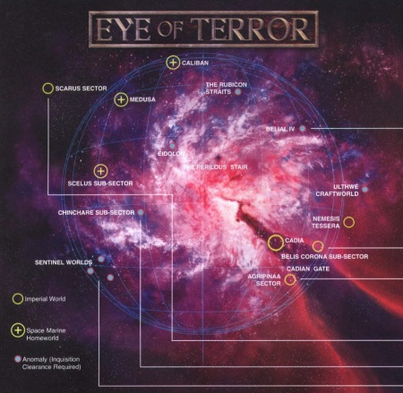

# 0241 阿斯塔特总督 Astartes Praeses

精校状态：中文行文已逐段精校，部分术语仍为暂定

分类：通用概念 / 帝国 Imperium / 中央政务部 Adeptus Terra / 阿斯塔特修会 Adeptus Astartes

原文来源：https://www.bilibili.com/opus/1212891909649858610

原作者：帝国神选罐头

原文时间：2026年06月12日 12:00

[返回分类目录](目录.md) · [全书目录](../../目录.md)

<!-- A0241-B0001 -->
**英文原文**

The Astartes Praeses were twenty Space Marine Chapters whose main task was to guard the frontiers of the Eye of Terror. By the time of the 13th Black Crusade, the Astartes Praeses numbered eighteen; one of them has been destroyed and another declared excommunicatus traitorus.

<!-- /A0241-B0001 -->

<!-- A0241-B0002 -->

原译文

阿斯塔特总督是20个星际战士战团，其主要任务是保卫恐惧之眼的边界。到第13次黑色远征时，阿斯塔特总督仅余18个；其中一个被摧毁，另一个被宣布为逐出绝罚叛徒。

**校订译文**

阿斯塔特总督由二十个星际战士战团组成，主要负责守卫恐惧之眼周边。到第十三次黑色远征时，只剩十八个：一个已被摧毁，另一个被宣告绝罚叛徒。

<!-- /A0241-B0002 -->

<!-- A0241-B0003 图片 -->

<!-- A0241-B0004 -->

原译文

The Eye of Terror and its outskirts 恐惧之眼及其边缘地带

**校订译文**

The Eye of Terror and its outskirts 恐惧之眼及其边缘地带

<!-- /A0241-B0004 -->

<!-- A0241-B0005 -->
**英文原文**

According to the Mythos Angelica Mortis were those chapters founded with the expressed purpose of guarding the regions surrounding the Eye of Terror.

<!-- /A0241-B0005 -->

<!-- A0241-B0006 -->

原译文

根据死亡天使神话那些成立的战团，其明确目的是守卫恐惧之眼周围的地区。

**校订译文**

据《死亡天使传说》记载，这些战团建立时的明确使命，就是守卫恐惧之眼周围地区。

<!-- /A0241-B0006 -->

<!-- A0241-B0007 -->
**英文原文**

Thanks to the judgement of Saint Basillius, many of the chapters were sent into the Eye of Terror. In the immediate aftermath of the Abyssal Crusade, the region was wrecked, leading to a perpetual state of siege in the region from then on known Cadian Gate.

<!-- /A0241-B0007 -->

<!-- A0241-B0008 -->

原译文

由于圣巴西利厄斯的判决，许多战团被送入了恐惧之眼。在深渊远征结束后，该地区遭到毁坏，导致该地区从已知的卡迪亚之门开始陷入永久的围困状态。

**校订译文**

圣巴西利厄斯作出裁决后，许多战团被送入恐惧之眼。深渊远征结束后，这片区域遭到严重破坏；后来称为卡迪亚之门的地区，自此陷入长期围困。

**校注：** 英文自身叙述对深渊远征、卡迪亚之门名称与长期围困的先后关系较含混，按其表达保留，不另补历史年代。

<!-- /A0241-B0008 -->

<!-- A0241-B0009 -->
**英文原文**

The loss of Cadia and the destruction of the Cadian Gate leaves the future of the Astartes Praeses order uncertain.

<!-- /A0241-B0009 -->

<!-- A0241-B0010 -->

原译文

卡迪亚的损失和卡迪亚之门的破坏使阿斯塔特总督组织的未来变得不确定。

**校订译文**

卡迪亚失陷、卡迪亚之门被摧毁后，阿斯塔特总督的未来变得不明朗。

<!-- /A0241-B0010 -->

<!-- A0241-B0011 -->
## Known Chapters 已知战团

<!-- /A0241-B0011 -->

<!-- A0241-B0012 -->
**英文原文**

The Astartes Praeses Chapters are:

<!-- /A0241-B0012 -->

<!-- A0241-B0013 -->

原译文

阿斯塔特总督战团有

**校订译文**

阿斯塔特总督战团有

<!-- /A0241-B0013 -->

<!-- A0241-B0014 -->

原译文

Angels Eradicant 根除天使

**校订译文**

Angels Eradicant 根除天使

<!-- /A0241-B0014 -->

<!-- A0241-B0015 -->
**英文原文**

Black Consuls - Reported destroyed 455.M41. Remnants bolstered by Primaris Marines; now reside at Cyclopia.

<!-- /A0241-B0015 -->

<!-- A0241-B0016 -->

原译文

黑色执政官 - 据报告在455.M41被摧毁。被原铸战士支援的残余；现在居住在独眼星。

**校订译文**

黑色执政官——据报于 455.M41 覆灭；残存部队后来获得原铸增援，目前驻于赛克洛皮亚。

<!-- /A0241-B0016 -->

<!-- A0241-B0017 -->

原译文

Brothers Penitent 忏悔修士

**校订译文**

Brothers Penitent 忏悔修士

<!-- /A0241-B0017 -->

<!-- A0241-B0018 -->

原译文

Crimson Scythes 深红镰刀

**校订译文**

Crimson Scythes 深红之镰

<!-- /A0241-B0018 -->

<!-- A0241-B0019 -->

原译文

Excoriators 责难者

**校订译文**

Excoriators 责难者

<!-- /A0241-B0019 -->

<!-- A0241-B0020 -->

原译文

Iron Talons 铁爪

**校订译文**

Iron Talons 铁爪

<!-- /A0241-B0020 -->

<!-- A0241-B0021 -->

原译文

Knights Unyielding 不屈骑士

**校订译文**

Knights Unyielding 不屈骑士

<!-- /A0241-B0021 -->

<!-- A0241-B0022 -->

原译文

Marines Exemplar 典范战士

**校订译文**

Marines Exemplar 模范战士

<!-- /A0241-B0022 -->

<!-- A0241-B0023 -->

原译文

Night Watch 午夜守望

**校订译文**

Night Watch 午夜守望

<!-- /A0241-B0023 -->

<!-- A0241-B0024 -->
**英文原文**

Relictors - Excommunicatus traitorus.

<!-- /A0241-B0024 -->

<!-- A0241-B0025 -->

原译文

遗物守护者 - 绝罚叛徒

**校订译文**

遗物守护者 - 绝罚叛徒

<!-- /A0241-B0025 -->

<!-- A0241-B0026 -->

原译文

Subjugators 压制者

**校订译文**

Subjugators 压制者

<!-- /A0241-B0026 -->

<!-- A0241-B0027 -->

原译文

Viper Legion 蝰蛇军团

**校订译文**

Viper Legion 蝰蛇军团

<!-- /A0241-B0027 -->

<!-- A0241-B0028 -->

原译文

White Consuls 白色执政官

**校订译文**

White Consuls 白色执政官

<!-- /A0241-B0028 -->

<!-- A0241-B0029 -->
## Trivia 琐事

<!-- /A0241-B0029 -->

<!-- A0241-B0030 -->
## Conflicting sources 来源冲突

<!-- /A0241-B0030 -->

<!-- A0241-B0031 -->
**英文原文**

One of the sources on the fate of Astartes Praeses suggests many chapters were declared traitors. Other sources suggest only one was declared a traitor and there were 18 chapters guarding the Cadian Gate at the time of the 13th Black Crusade. Another source suggests that these chapters were specifically made to guard the Cadian Gate.

<!-- /A0241-B0031 -->

<!-- A0241-B0032 -->

原译文

关于阿斯塔特总督命运的一个消息来源表明，许多战团被宣布为叛徒。其他消息来源表明，只有一个被宣布为叛徒，在第13次黑色远征期间，有18个战团守卫着卡迪亚之门。另一个消息来源表明，这些战团是专门为守卫卡迪亚之门而制造的。

**校订译文**

关于阿斯塔特总督的命运，各来源说法不一。有资料称，许多战团遭到叛徒判定；另有资料则称只有一个战团被宣告叛变，第十三次黑色远征时仍有十八个战团守卫卡迪亚之门。还有资料说，这些战团从建军之初就是为守卫卡迪亚之门而设。

<!-- /A0241-B0032 -->

本篇核心术语与暂定项

以下列出本篇出现的英文原形及核心术语表用词。同形词可能指不同对象，具体词义以本篇正文和校注为准；单复数、别名和仅见于图注的名称可能尚未列入。完整候选见[术语表](../../术语表/双语术语候选.csv)。

| 英文 | 采用中文 | 状态 |
| --- | --- | --- |
| Eye of Terror | 恐惧之眼 | 官方已核对 |
| Perpetual | 永生者 | 暂定·官方待核 |
| Cadia | 卡迪亚 | 暂定·官方待核 |
| Space Marine | 星际战士 | 暂定·官方待核 |
| Black Consuls | 黑色执政官 | 暂定·官方待核 |
| Remnants | 残骸 | 暂定·官方待核 |
| Astartes Praeses | 阿斯塔特总督 | 暂定·官方待核 |
| Relictors | 遗物守护者 | 暂定·官方待核 |
| Cyclopia | 赛克洛皮亚 | 暂定·官方待核 |
| Mythos Angelica Mortis | 死亡天使传说 | 暂定·官方待核 |
| Saint Basillius | 圣巴西利乌斯 | 暂定·官方待核 |
| The Loss | 失落 | 暂定·官方待核 |

