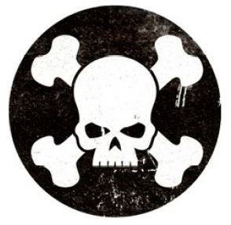

# 0244 隐修室 Reclusiam

精校状态：中文行文已逐段精校，部分术语仍为暂定

分类：通用概念 / 帝国 Imperium / 中央政务部 Adeptus Terra / 阿斯塔特修会 Adeptus Astartes

原文来源：https://www.bilibili.com/opus/1111581551092563989

原作者：帝国神选罐头

原文时间：2025年09月12日 11:44

[返回分类目录](目录.md) · [全书目录](../../目录.md)

<!-- A0244-B0001 -->
**英文原文**

The Reclusiam is a chamber located within the fortress-monastery of a Space Marine Chapter (or the flagship in the case of a fleet-based chapter). This is the place where the chapter's holy relics are displayed, and where the Chapter's cult ceremonies and rituals are performed in the presence of the entire Chapter. These are carried out under the guidance of a senior Chaplain with the title of Reclusiarch, and his superior, the Master of Sanctity, who is the spiritual head of the entire Chapter.

<!-- /A0244-B0001 -->

<!-- A0244-B0002 -->

原译文

隐修室是位于星际战士战团（或舰基战团的旗舰）堡垒修道院内的一个房间。这是展示战团圣物的地方，也是在整个战团在场的情况下举行战团祭礼仪式和典礼的地方。这些活动是在一位名为隐修长的高级牧师及其上级 — 圣洁导师的指导下进行的，圣洁导师是整个战团的精神领袖。

**校订译文**

隐修室位于星际战士战团的要塞修道院内；舰基战团则将其设在旗舰上。这里陈列战团圣物，并举行全体战团成员参加的宗教仪式与典礼。仪式由一名称为隐修长的高级教士，以及其上级、全战团的精神领袖圣洁导师主持。

<!-- /A0244-B0002 -->

<!-- A0244-B0003 图片 -->

<!-- A0244-B0004 -->

原译文

Symbol of the Reclusiam 隐修室标志

**校订译文**

Symbol of the Reclusiam 隐修室标志

<!-- /A0244-B0004 -->

本篇核心术语与暂定项

以下列出本篇出现的英文原形及核心术语表用词。同形词可能指不同对象，具体词义以本篇正文和校注为准；单复数、别名和仅见于图注的名称可能尚未列入。完整候选见[术语表](../../术语表/双语术语候选.csv)。

| 英文 | 采用中文 | 状态 |
| --- | --- | --- |
| Master | 导师（审判庭职衔）／舰务官（舰员职务） | 语境定译·官方待核 |
| Master of Sanctity | 圣洁导师 | 暂定·官方待核 |
| Reclusiarch | 隐修长 | 暂定·官方待核 |
| Reclusiam | 隐修圣殿 | 暂定·官方待核 |
| Chaplain | 教士 | 官方已核对 |
| Space Marine | 星际战士 | 暂定·官方待核 |
| Chapter | 战团 | 暂定·官方待核 |
| Fortress-monastery | 要塞修道院 | 暂定·官方待核 |
| Holy relics | 圣遗物 | 暂定·官方待核 |

