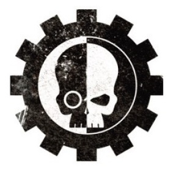

# 0245 军械库 Armoury

精校状态：中文行文已逐段精校，部分术语仍为暂定

分类：通用概念 / 帝国 Imperium / 中央政务部 Adeptus Terra / 阿斯塔特修会 Adeptus Astartes

原文来源：https://www.bilibili.com/opus/1111581675636129795

原作者：帝国神选罐头

原文时间：2025年09月12日 11:44

[返回分类目录](目录.md) · [全书目录](../../目录.md)

<!-- A0245-B0001 -->
**英文原文**

The Armoury is an integral part of a Space Marine Chapter, forming part of its headquarter staff and led by a Master of the Forge. The Armoury is responsible for the creation, maintenance, storage and operation of the many Space Marine Vehicles used by the Chapter in battle.

<!-- /A0245-B0001 -->

<!-- A0245-B0002 -->

原译文

军械库是星际战士战团的一个组成部分，是其总部工作人员的一部分，由铸造大师领导。军械库负责创造、维护、储存和操作该战团在战斗中使用的许多星际战士载具。

**校订译文**

军械库是星际战士战团指挥体系的重要组成部分，由铸造大师领导，负责制造、保养、储存和操作战团作战所需的各类载具。

<!-- /A0245-B0002 -->

<!-- A0245-B0003 图片 -->

<!-- A0245-B0004 -->

原译文

Armoury symbol 军械库标志

**校订译文**

Armoury symbol 军械库标志

<!-- /A0245-B0004 -->

<!-- A0245-B0005 -->
## Organization 组织

<!-- /A0245-B0005 -->

<!-- A0245-B0006 -->
**英文原文**

The Master of the Forge is the Chapter's most senior Techmarine, well-versed in even the most arcane areas of scientific knowledge. Answering directly to the Chapter Master, he is responsible for everything that goes on within the Armoury, allocating weapons and vehicles as needed or storing them within the Chapter's heavy armour pool. For this reason the Master of the Forge will rarely go into battle himself, as his vast store knowledge is particularly priceless. In times of great need, though, he will gladly march to war, wielding some of the Chapter's most wondrous and awe-inspiring weaponry which only his wisdom can maintain.

<!-- /A0245-B0006 -->

<!-- A0245-B0007 -->

原译文

铸造大师是战团最资深的技术军士，精通最神秘的科学知识领域。直接向战团长负责，他负责军械库内发生的一切，根据需要分配武器和载具，或将其存放在战团的重型装甲库中。出于这个原因，铸造大师很少亲自参加战斗，因为他丰富的知识尤其无价。然而，在非常需要的时候，他会很乐意加入战争，挥舞着战团最令人惊叹、最令人敬畏的武器，只有他的智慧才能维持这些武器。

**校订译文**

铸造大师是战团最资深的科技战士，连最奥秘的科学知识也熟稔于心。他直接向战团长负责，统管军械库事务，按需分配武器与载具，或将其收入重型装甲载具库。由于知识极其宝贵，他很少亲自出战；但在危急时刻，也会欣然奔赴战场，操持那些只有凭他的学识才能维护的奇妙而可怖的武器。

<!-- /A0245-B0007 -->

<!-- A0245-B0008 -->
**英文原文**

Besides the Master of the Forge, the Armoury is home to the rest of the Chapter's Techmarines, trained for many years on an allied Forge World or Mars itself in the mysterious ways of the Adeptus Mechanicus. For this reason there is some level of distrust between them and their fellow battle-brothers, but Techmarines are vital to the continued upkeep of the many weapons and war-machines, some of which are ancient beyond all recollection.

<!-- /A0245-B0008 -->

<!-- A0245-B0009 -->

原译文

除了铸造大师，军械库还是战团其他技术军士的休息处，他们在盟友铸造世界或火星上以机械神教的神秘方式接受了多年的训练。出于这个原因，他们和他们的战友之间存在一定程度的不信任，但技术军士对于许多武器和战争机械的持续维护至关重要，其中一些武器和机械已经古老到无法回忆。

**校订译文**

其他科技战士也隶属军械库。他们曾在盟友铸造世界或火星接受多年训练，学习机械修会的奥秘，因此与其他战斗兄弟之间存在一定隔阂。然而，战团的众多武器与战争机器全赖他们维护，其中一些装备古老得连来历都已无人记得。

<!-- /A0245-B0009 -->

<!-- A0245-B0010 -->
**英文原文**

The Armoury also includes the various crew members for its armoured fighting vehicles. Known as Custodians, most of these Space Marines are drawn from the Chapter's Reserve Companies. Custodians plug into their vehicle's spinal interfaces, which connect with their Power Armour and Black Carapace, allowing for much greater control of its systems. For a Space Marine to be assigned to the Armoury is considered a great honour, as Custodians must suppress their physical self and learn to command their vehicles' controls and systems as instinctively as they would their own limbs.

<!-- /A0245-B0010 -->

<!-- A0245-B0011 -->

原译文

军械库还包括其装甲战斗载具的各种乘员。这些被称为监管者的星际战士大多来自该战团的预备连队。监管者插入他们载具的脊柱接口，该接口与他们的动力装甲和黑色甲壳连接，从而可以更好地控制其系统。被分配到军械库的星际战士被认为是一种巨大的荣誉，因为监管者必须抑制自己的身体，学会像控制自己的四肢一样本能地指挥载具的控制和系统。

**校订译文**

军械库还包括装甲战斗载具的乘员，称为监管者，多从预备连选调。他们将载具的脊柱接口接入动力甲与黑色甲壳，从而更精确地操纵系统。获派军械库被视为重大荣誉：监管者必须淡化对自身肉体的感知，学会像控制四肢一样，本能地操纵载具。

**校注：** Custodians 在此指星际战士的载具监管者，非帝皇禁军；保留同形词的语境区分。

<!-- /A0245-B0011 -->

<!-- A0245-B0012 -->
## Construction 制造

原题：Construction 结构

<!-- /A0245-B0012 -->

<!-- A0245-B0013 -->
**英文原文**

For most Chapters, the Armoury's forges are located within their Fortress-monastery, where Techmarines assisted by Servitors, Techno-mats and other levied humans man its esoteric machinery. When a vehicle is to be produced, the basic chassis is built, its parts blessed and its future prognosticated. Interpretation of these omens indicate what the vehicle's Machine Spirit is and so which variant it will become. For example, a Rhino chassis is constructed, and upon reading its future it may be earmarked to become a Vindicator. Once completed, the vehicle is given a unique identifier during the ceremony of naming, and the ceremony of awakening rouses its Machine Spirit from slumber.

<!-- /A0245-B0013 -->

<!-- A0245-B0014 -->

原译文

对于大多数战团来说，军械库的铸造厂都位于他们的堡垒修道院内，在那里，技术军士在机仆、技术机仆和其他被征用的人的协助下，操纵着其深奥的机械。当一辆载具要生产时，基本的底盘就要制造出来，它的零件要被祝福，它的未来要被预测。对这些征兆的解释表明了载具的机魂是什么，以及它将成为什么变体。例如，一个犀牛底盘被建造出来，在阅读了它的未来后，它可能会被指定为维护者。一旦完成，在命名仪式上，载具会被赋予一个唯一的标识符，唤醒仪式会将其机魂从沉睡中唤醒。

**校订译文**

多数战团的军械铸造设施位于要塞修道院内，由科技战士在机仆、技术机仆和其他征调人员的协助下操作。制造载具时，先完成基础底盘，祝圣零件，并占卜其命运。对征兆的解读将确定机魂的性质，进而决定载具的具体型号。例如，某副犀牛底盘经过占卜后，可能被指定制成维护者战车。竣工后，载具在命名仪式中获得独有名号，再经唤醒仪式唤起沉睡的机魂。

<!-- /A0245-B0014 -->

<!-- A0245-B0015 -->
**英文原文**

Some forges lack the necessary equipment or resources to produce all of the required vehicles and weaponry. Instead these items are produced on allied Forge Worlds, based upon ancient charters and oaths of agreement between it and a specific Chapter, where they are constructed and shipped to order. Such construction is strictly monitored and secured against, to prevent any advanced technology from falling into the wrong hands.

<!-- /A0245-B0015 -->

<!-- A0245-B0016 -->

原译文

一些铸造厂缺乏生产所有所需载具和武器所需的设备或资源。相反，这些物品是在盟友的铸造世界上生产的，基于古代宪章和它与特定战团之间的协议誓言，在那里它们被制造并按订单运输。这种建筑受到严格监控和保护，以防止任何先进技术落入坏人之手。

**校订译文**

有些铸造设施缺少生产全部所需装备的资源或设备，便依据战团与盟友铸造世界之间的古老契约和誓约，由后者按订单制造并运送武器载具。这一过程受到严密监督和保护，以免先进技术落入不当之手。

<!-- /A0245-B0016 -->

<!-- A0245-B0017 -->
## Deployment 部署

<!-- /A0245-B0017 -->

<!-- A0245-B0018 -->
**英文原文**

Though each Company within the Chapter maintains their own store of light vehicles, such as Rhinos and Land Speeders, heavy armour is kept within the Armoury's motor pool and deployed only on a mission-by-mission basis. The only exception is the Chapter's 1st Company, which maintains a permanent store of Land Raiders for their personal need.

<!-- /A0245-B0018 -->

<!-- A0245-B0019 -->

原译文

虽然该战团内的每个连队都有自己的轻型载具仓库，如犀牛和兰德速攻艇，但重型装甲仍存放在军械库的载具库中，仅在每个任务的基础上部署。唯一的例外是战团的第一连队，战团为个人需要保留了一个永久性的兰德掠袭者仓库。

**校订译文**

各连拥有自己的轻型载具，如犀牛战车和兰德速攻艇；重型装甲载具则集中保管于军械库，按具体任务调拨。唯一的例外是第一连，其常备兰德掠袭者，专供本连使用。

<!-- /A0245-B0019 -->

<!-- A0245-B0020 -->
**英文原文**

Space Marine heavy armour is always used for a specific mission, such as breaking an enemy strong-point, in close coordination with their battle-brothers. Their small numbers and priceless technology preclude their use for extended periods of time, such as a prolonged siege. On extended campaigns, these forces will normally be recalled to their orbiting Battle Barge to rearm and refit prior to subsequent redeployment.

<!-- /A0245-B0020 -->

<!-- A0245-B0021 -->

原译文

星际战士重型装甲总是用于特定的任务，例如与他们的战斗兄弟密切协调，摧毁敌人的据点。它们的数量少，技术无价，因此无法长时间使用，例如长期围困。在长期战役中，这些部队通常会被召回其轨道战斗驳船，在随后重新部署之前重新武装和改装。

**校订译文**

星际战士的重型装甲载具总是配合战斗兄弟，执行突破敌军坚固据点等明确任务。由于数量稀少、技术珍贵，通常不会长期留在战场上消耗，例如参加旷日持久的围城。在长期战役中，它们一般会返回轨道上的战斗驳船，补充弹药、整修装备后，再次投入行动。

<!-- /A0245-B0021 -->

本篇核心术语与暂定项

以下列出本篇出现的英文原形及核心术语表用词。同形词可能指不同对象，具体词义以本篇正文和校注为准；单复数、别名和仅见于图注的名称可能尚未列入。完整候选见[术语表](../../术语表/双语术语候选.csv)。

| 英文 | 采用中文 | 状态 |
| --- | --- | --- |
| Space Marines | 星际战士 | 官方已核对 |
| Adeptus Mechanicus | 机械修会 | 官方已核对 |
| Equipment | 装备 | 编辑用语已统一 |
| Techmarine | 科技战士 | 官方已核对 |
| Battle Barge | 战斗驳船 | 暂定·官方待核 |
| Forge World | 铸造世界 | 暂定·官方待核 |
| Mars | 火星 | 暂定·官方待核 |
| Master | 导师（审判庭职衔）／舰务官（舰员职务） | 语境定译·官方待核 |
| Mission | 教团／传教机构 | 暂定 |
| Master of the Forge | 铸造大师 | 暂定·官方待核 |
| Techno-mats | 技术工役（技术劳工）／技术机仆（机仆类别） | 语境定译·官方待核 |
| Ancient | 旗手 | 官方已核对 |
| Rhino | 犀牛战车 | 官方已核对 |
| Vindicator | 维护者战车 | 官方已核对 |
| Power Armour | 动力盔甲 | 暂定·官方待核 |
| Space Marine | 星际战士 | 暂定·官方待核 |
| Chapter | 战团 | 暂定·官方待核 |
| Fortress-monastery | 要塞修道院 | 暂定·官方待核 |
| Chapter Master | 战团长 | 暂定·官方待核 |
| Armoury | 军械库 | 暂定·官方待核 |
| Rhinos | 犀牛 | 暂定·官方待核 |
| Land Speeders | 兰德速攻艇 | 暂定·官方待核 |
| Land Raiders | 兰德掠袭者 | 暂定·官方待核 |
| Reserve Companies | 预备连队 | 暂定·官方待核 |
| Black Carapace | 黑色甲壳 | 暂定·官方待核 |

