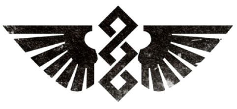

# 0246 药剂部 Apothecarion

精校状态：中文行文已逐段精校，部分术语仍为暂定

分类：通用概念 / 帝国 Imperium / 中央政务部 Adeptus Terra / 阿斯塔特修会 Adeptus Astartes

原文来源：https://www.bilibili.com/opus/1111581606921895941

原作者：帝国神选罐头

原文时间：2025年09月12日 11:44

[返回分类目录](目录.md) · [全书目录](../../目录.md)

<!-- A0246-B0001 -->
**英文原文**

The Apothecarion is a Space Marine Chapter's medical and bio-engineering department. Their most important duty is the preservation of the Chapter's gene-seed, the only means by which new Space Marines may be created. The life or death of a Chapter is therefore dependent upon their Apothecarion.

<!-- /A0246-B0001 -->

<!-- A0246-B0002 -->

原译文

药剂部是星际战士战团的医疗和生物工程部门。他们最重要的职责是保护战团的基因种子，这是创建新的星际战士的唯一途径。因此，一个战团的生死存亡取决于他们的药剂部。

**校订译文**

药剂部是星际战士战团的医疗和生物工程部门。他们最重要的职责是保护战团的基因种子，这是创建新的星际战士的唯一途径。因此，一个战团的生死存亡取决于他们的药剂部。

<!-- /A0246-B0002 -->

<!-- A0246-B0003 图片 -->

<!-- A0246-B0004 -->

原译文

Apothecarion Symbol 药剂部标志

**校订译文**

Apothecarion Symbol 药剂部标志

<!-- /A0246-B0004 -->

<!-- A0246-B0005 -->
## Structure 体系

<!-- /A0246-B0005 -->

<!-- A0246-B0006 -->
**英文原文**

Each Apothecarion is typically headed by a Chief Apothecary and permanently staffed by a number of Apothecaries. These Apothecaries rarely take to the field of battle themselves. Their primary function is the maintenance of the various bio-vaults, each one containing a gene-seed ready for implantation. These gene-seeds are extensively monitored, with only the healthiest kept, while those showing signs of mutation are removed to avoid further contamination. The Apothecaries are also responsible for screening new Aspirants for any physical deficiencies, before continuing on the process of creating a new Space Marine, and are responsible for maintaining routine medical and surgical duties to ensure the Chapter's warriors are in fighting shape. For accurate record-keeping the Apothecarion will maintain vast memory banks which contain the extensive genetic history of their Chapter.

<!-- /A0246-B0006 -->

<!-- A0246-B0007 -->

原译文

每个药剂部通常由一名首席药剂师领导，并由多名药剂师常驻。这些药剂师很少亲自前往战场。它们的主要功能是维护各种生物保险库，每个生物保险库都包含一个准备植入的基因种子。这些基因种子受到广泛监测，只保存最健康的种子，而那些有突变迹象的种子则被移除以避免进一步污染。药剂师还负责在继续创建新的星际战士之前，筛查新的有志者是否有任何身体缺陷，并负责维持日常的医疗和手术职责，以确保战团的战士处于战斗状态。为了准确记录，药剂部将维护庞大的记忆库，其中包含其战团的大量遗传历史。

**校订译文**

药剂部通常由首席药剂师统率，另有若干常驻药剂师，后者很少亲赴战场。他们主要维护各处生物储存库，保管准备用于植入的基因种子。种子受到严密监测，只留下最健康者；一旦发现突变迹象，便将其隔离移除，避免进一步污染。他们还筛查有志者的身体缺陷，主持后续改造，并承担日常医疗与外科工作，确保战团战士保持战斗状态。为准确追踪血脉，药剂部保存庞大的资料库，记录战团详尽的遗传历史。

**校注：** 本段“很少亲赴战场”限定于药剂部常驻人员，不包括下一段各连随军药剂师。

<!-- /A0246-B0007 -->

<!-- A0246-B0008 -->
**英文原文**

In addition to the Apothecarion's staff, each Company has its own Apothecary. In the field, these Apothecaries are responsible for administering battlefield medical care, including emergency surgery. However, their most important duty is the recovery of the gene-seed from fallen battle-brothers, removing the progenoid organs from their body and returning them to the Apothecarion for the next recruit.

<!-- /A0246-B0008 -->

<!-- A0246-B0009 -->

原译文

除了药剂部的员工外，每个连队都有自己的药剂师。在战场上，这些药剂师负责管理战场医疗服务，包括紧急手术。然而，他们最重要的职责是从倒下的战友身上回收基因种子，从他们的身体中移除基因存收腺，并将其带回药剂部，以备下一次招募。

**校订译文**

除药剂部常驻人员外，各连还有自己的药剂师。他们在战场提供医疗救护，包括紧急手术；最重要的任务，则是从阵亡战斗兄弟体内取出基因存收腺，将基因种子带回药剂部，用于培育下一代新兵。

<!-- /A0246-B0009 -->

本篇核心术语与暂定项

以下列出本篇出现的英文原形及核心术语表用词。同形词可能指不同对象，具体词义以本篇正文和校注为准；单复数、别名和仅见于图注的名称可能尚未列入。完整候选见[术语表](../../术语表/双语术语候选.csv)。

| 英文 | 采用中文 | 状态 |
| --- | --- | --- |
| Space Marines | 星际战士 | 官方已核对 |
| History | 历史 | 编辑用语已统一 |
| Chief Apothecary | 首席药剂师 | 暂定·官方待核 |
| Apothecarion | 药剂部 | 暂定·官方待核 |
| Apothecary | 药剂师 | 官方已核对 |
| Space Marine | 星际战士 | 暂定·官方待核 |
| Chapter | 战团 | 暂定·官方待核 |
| Gene-seed | 基因种子 | 暂定·官方待核 |

