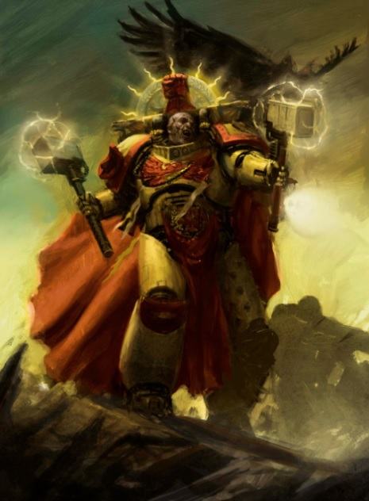

# 0247 战团长 Chapter Master

精校状态：中文行文已逐段精校，部分术语仍为暂定

分类：通用概念 / 帝国 Imperium / 中央政务部 Adeptus Terra / 阿斯塔特修会 Adeptus Astartes

原文来源：https://www.bilibili.com/opus/1020226510048460800

原作者：帝国神选罐头

原文时间：2025年01月09日 07:19

[返回分类目录](目录.md) · [全书目录](../../目录.md)

<!-- A0247-B0001 -->
**英文原文**

A Space Marine Chapter is led by a Chapter Master, who is at once one of the Chapter's most experienced warriors and among the most gifted military leaders in the Imperium.

<!-- /A0247-B0001 -->

<!-- A0247-B0002 -->

原译文

星际战士战团由战团长领导，他既是战团最有经验的战士之一，也是帝国中最有天赋的军事领袖之一。

**校订译文**

星际战士战团由战团长领导，他既是战团最有经验的战士之一，也是帝国中最有天赋的军事领袖之一。

<!-- /A0247-B0002 -->

<!-- A0247-B0003 -->
## Role and Responsibilities 角色与职责

<!-- /A0247-B0003 -->

<!-- A0247-B0004 -->
**英文原文**

A Chapter Master possesses centuries of battle experience and is invariably highly skilled in tactics, leadership and all kinds of combat. In battle he leads from the front, combining front-line combat with tactical and strategic assessment that allows him to see how victory can be accomplished.

<!-- /A0247-B0004 -->

<!-- A0247-B0005 -->

原译文

战团长拥有数百年的战斗经验，在战术、领导和各种战斗方面都非常熟练。在战斗中，他在前线领导，将前线战斗与战术和战略评估相结合，使他能够看到如何取得胜利。

**校订译文**

战团长拥有数百年战斗经验，精通战术、指挥及各种作战方式。他在战场上身先士卒，同时分析战略与战术局势，判断取胜之道。

<!-- /A0247-B0005 -->

<!-- A0247-B0006 图片 -->

<!-- A0247-B0007 -->

原译文

Space Marine Chapter Master 星际战士战团长

**校订译文**

Space Marine Chapter Master 星际战士战团长

<!-- /A0247-B0007 -->

<!-- A0247-B0008 -->
**英文原文**

A Chapter Master is a peer of the Imperium, the leader of an autonomous military force of nearly unrivaled power, and as such is answerable to the authority of no other, except to other such Masters.

<!-- /A0247-B0008 -->

<!-- A0247-B0009 -->

原译文

战团长是帝国的贵族，是一支几乎无与伦比的自主军事力量的领导者，因此除了对其他这样的大师负责外，不对其他人的权威负责。

**校订译文**

战团长位列帝国权贵之中，统率一支自治、强大而几无匹敌的军队。按本段表述，他不向其他权威负责，只有同等地位的战团长能够与他相互问责。

**校注：** 英文把战团长问责关系表述为只对同侪负责，属于本段的概括；不据此抹除本书其他篇章中审判庭、帝国最高统帅等干预战团的情形。

<!-- /A0247-B0009 -->

<!-- A0247-B0010 -->
**英文原文**

In addition to his military responsibilities, a Chapter Master often acts as Governor of his Chapter's homeworld, and has overall command of immense battle-fleets, PDF units, and civilian organizations.

<!-- /A0247-B0010 -->

<!-- A0247-B0011 -->

原译文

除了军事职责外，战团长还经常担任战团家园世界的总督，全面指挥庞大的作战舰队、行星防卫部队和民间组织。

**校订译文**

除了军事职责外，战团长还经常担任战团家园世界的总督，全面指挥庞大的作战舰队、行星防卫部队和民间组织。

<!-- /A0247-B0011 -->

<!-- A0247-B0012 -->
## Chapter Variations 战团变体

<!-- /A0247-B0012 -->

<!-- A0247-B0013 -->
**英文原文**

The title "Chapter Master" is not consistent throughout the Adeptus Astartes, and some Chapters use different titles to describe a similar rank. The most notable variations include the Supreme Grand Master of the Dark Angels, the Great Wolf of the Space Wolves, the High Marshal of the Black Templars, and the Master of Shadows of the Raven Guard. Other specialized titles are listed below.

<!-- /A0247-B0013 -->

<!-- A0247-B0014 -->

原译文

“战团长”这一称号在阿斯塔特修会中并不一致，有些战团使用不同的称号来描述类似的等级。最显著的变体包括黑暗天使的至高大导师、太空野狼的头狼、黑色圣堂的至高元帅和暗鸦守卫的阴影大师。其他专业头衔如下。

**校订译文**

阿斯塔特修会并不统一使用“战团长”这一头衔。有些战团以其他称谓表示同等职位，例如黑暗天使的至高大导师、太空野狼的头狼、黑色圣堂的至高元帅，以及暗鸦守卫的暗影大师。其他特殊头衔见下表。

<!-- /A0247-B0014 -->

<!-- A0247-B0015 -->
**英文原文**

Some Chapter Masters have adopted additional responsibilities by combining their ranks with one or more of the other highest ranks of their Chapter. For instance, several Masters of the Blood Ravens (who are renowned for the obsessive search for knowledge) have combined the title and duties of Chapter Master and Chief Librarian.

<!-- /A0247-B0015 -->

<!-- A0247-B0016 -->

原译文

一些战团长通过将他们的级别与战团的一个或多个其他最高级别相结合，承担了额外的责任。例如，几位血鸦战团长（以痴迷于寻找知识而闻名）将战团长和智库馆长的头衔和职责结合在一起。

**校订译文**

部分战团长兼任战团内其他最高职位，因而承担额外职责。例如，以执着追寻知识著称的血鸦，曾有数任战团长同时兼任首席智库员。

<!-- /A0247-B0016 -->

<!-- A0247-B0017 -->
## Notable Chapter Masters

**补译**

著名战团长

<!-- /A0247-B0017 -->

<!-- A0247-B0018 -->
**英文原文**

Gabriel Angelos - Blood Ravens

<!-- /A0247-B0018 -->

<!-- A0247-B0019 -->

原译文

加百列·安杰罗 - 血鸦

**校订译文**

加百列·安杰罗斯 - 血鸦

<!-- /A0247-B0019 -->

<!-- A0247-B0020 -->
**英文原文**

Azrael - Supreme Grand Master - Dark Angels

<!-- /A0247-B0020 -->

<!-- A0247-B0021 -->

原译文

阿兹瑞尔 - 至高大导师 - 黑暗天使

**校订译文**

阿兹瑞尔 - 至高大导师 - 黑暗天使

<!-- /A0247-B0021 -->

<!-- A0247-B0022 -->
**英文原文**

Marneus Augustus Calgar - Ultramarines

<!-- /A0247-B0022 -->

<!-- A0247-B0023 -->

原译文

马涅乌斯·奥古斯图斯·卡尔加 - 极限战士

**校订译文**

马涅乌斯·奥古斯图斯·卡尔加 - 极限战士

<!-- /A0247-B0023 -->

<!-- A0247-B0024 -->
**英文原文**

Carab Culln - Lord High Commander - Red Scorpions

<!-- /A0247-B0024 -->

<!-- A0247-B0025 -->

原译文

卡拉布·库伦 - 领主至高指挥官 - 红蝎

**校订译文**

卡拉布·库伦——至高指挥领主；红蝎。

**校注：** 本篇英文 Carab Culln 与224的 Carab Culin 拼写不同，疑为224拼误；中文统一卡拉布·库伦，原英文分别保留。

<!-- /A0247-B0025 -->

<!-- A0247-B0026 -->
**英文原文**

Dante - Lord Commander - Blood Angels

<!-- /A0247-B0026 -->

<!-- A0247-B0027 -->

原译文

但丁 - 领主指挥官 - 圣血天使

**校订译文**

但丁 - 领主指挥官 - 圣血天使

<!-- /A0247-B0027 -->

<!-- A0247-B0028 -->
**英文原文**

Kaldor Draigo - Supreme Grand Master - Grey Knights

<!-- /A0247-B0028 -->

<!-- A0247-B0029 -->

原译文

卡尔多·迪亚哥 - 至高大导师 - 灰骑士

**校订译文**

卡尔多·迪亚哥 - 至高大导师 - 灰骑士

<!-- /A0247-B0029 -->

<!-- A0247-B0030 -->
**英文原文**

Logan Grimnar - Great Wolf - Space Wolves

<!-- /A0247-B0030 -->

<!-- A0247-B0031 -->

原译文

罗根·格里姆那尔 - 头狼 - 太空野狼

**校订译文**

洛根·格里姆纳尔——头狼；太空野狼。

<!-- /A0247-B0031 -->

<!-- A0247-B0032 -->
**英文原文**

Helbrecht - High Marshal - Black Templars

<!-- /A0247-B0032 -->

<!-- A0247-B0033 -->

原译文

赫尔布莱切特 - 至高元帅 - 黑色圣堂

**校订译文**

赫尔布雷彻——至高元帅；黑色圣堂。

<!-- /A0247-B0033 -->

<!-- A0247-B0034 -->
**英文原文**

Kardan Stronos - Iron Father - Iron Hands

<!-- /A0247-B0034 -->

<!-- A0247-B0035 -->

原译文

卡丹·斯特罗诺斯 - 铁父 - 钢铁之手

**校订译文**

卡丹·斯特罗诺斯——钢铁圣父；钢铁之手。

<!-- /A0247-B0035 -->

<!-- A0247-B0036 -->
**英文原文**

Pedro Kantor - Crimson Fists

<!-- /A0247-B0036 -->

<!-- A0247-B0037 -->

原译文

佩德罗·坎托 - 绯红之拳

**校订译文**

佩德罗·坎托 - 绯红之拳

<!-- /A0247-B0037 -->

<!-- A0247-B0038 -->
**英文原文**

Jubal Khan - Great Khan - White Scars

<!-- /A0247-B0038 -->

<!-- A0247-B0039 -->

原译文

朱巴可汗 - 大可汗 - 白色疤痕

**校订译文**

朱巴可汗——大可汗；白疤。

<!-- /A0247-B0039 -->

<!-- A0247-B0040 -->
**英文原文**

Khoisan Neotera - Mantis Warriors

<!-- /A0247-B0040 -->

<!-- A0247-B0041 -->

原译文

科伊桑·尼奥泰拉 - 螳螂勇士

**校订译文**

科伊桑·尼奥泰拉 - 螳螂勇士

<!-- /A0247-B0041 -->

<!-- A0247-B0042 -->
**英文原文**

Gregor Dessian - Imperial Fists

<!-- /A0247-B0042 -->

<!-- A0247-B0043 -->

原译文

格雷戈尔·德西安 - 帝国之拳

**校订译文**

格雷戈尔·德西安 - 帝国之拳

<!-- /A0247-B0043 -->

<!-- A0247-B0044 -->
**英文原文**

Sarpedon - Chapter Master (and Chief Librarian) - Soul Drinkers

<!-- /A0247-B0044 -->

<!-- A0247-B0045 -->

原译文

萨尔佩冬 - 战团长（首席智库）- 饮魂者

**校订译文**

萨尔佩冬——战团长兼首席智库员；饮魂者。

<!-- /A0247-B0045 -->

<!-- A0247-B0046 -->
**英文原文**

Kayvaan Shrike - Master of Shadows - Raven Guard

<!-- /A0247-B0046 -->

<!-- A0247-B0047 -->

原译文

凯万·史瑞克 - 暗影大师 - 暗鸦守卫

**校订译文**

凯万·史瑞克 - 暗影大师 - 暗鸦守卫

<!-- /A0247-B0047 -->

<!-- A0247-B0048 -->
**英文原文**

Seydon - Iron Snakes

<!-- /A0247-B0048 -->

<!-- A0247-B0049 -->

原译文

塞顿 - 钢铁之蛇

**校订译文**

塞顿——铁蛇。

<!-- /A0247-B0049 -->

<!-- A0247-B0050 -->
**英文原文**

Tu'Shan - Master of the Fire Drakes - Salamanders

<!-- /A0247-B0050 -->

<!-- A0247-B0051 -->

原译文

图'杉 - 火龙之主 - 火蜥蜴

**校订译文**

图杉——火龙之主；火蜥蜴。

<!-- /A0247-B0051 -->

<!-- A0247-B0052 -->
**英文原文**

Gabriel Seth - Flesh Tearers

<!-- /A0247-B0052 -->

<!-- A0247-B0053 -->

原译文

加百列·赛斯 - 撕肉者

**校订译文**

加百列·赛斯 - 撕肉者

<!-- /A0247-B0053 -->

<!-- A0247-B0054 -->
**英文原文**

Zargo - Castellan - Angels Encarmine

<!-- /A0247-B0054 -->

<!-- A0247-B0055 -->

原译文

扎戈 - 堡主 - 赤红天使

**校订译文**

扎戈 - 堡主 - 赤红天使

<!-- /A0247-B0055 -->

<!-- A0247-B0056 -->
## Renegade Chapter Masters 叛徒战团长

<!-- /A0247-B0056 -->

<!-- A0247-B0057 -->
**英文原文**

Kathal, Sons of Malice

<!-- /A0247-B0057 -->

<!-- A0247-B0058 -->

原译文

卡萨尔，仇恨之子

**校订译文**

卡萨尔——怨恶之子。

<!-- /A0247-B0058 -->

<!-- A0247-B0059 -->
**英文原文**

Lufgt Huron, Red Corsairs

<!-- /A0247-B0059 -->

<!-- A0247-B0060 -->

原译文

鲁夫特·休伦，红海盗

**校订译文**

鲁夫特·休伦，红海盗

<!-- /A0247-B0060 -->

<!-- A0247-B0061 -->
**英文原文**

Azariah Kyras, Blood Ravens

<!-- /A0247-B0061 -->

<!-- A0247-B0062 -->

原译文

阿扎里亚·凯拉斯，血鸦

**校订译文**

亚撒利雅·凯拉斯——血鸦。

<!-- /A0247-B0062 -->

<!-- A0247-B0063 -->
**英文原文**

Sevastus Kranon, Crimson Slaughter

<!-- /A0247-B0063 -->

<!-- A0247-B0064 -->

原译文

塞瓦图斯·克拉能，猩红屠杀者

**校订译文**

塞瓦图斯·克拉能，猩红屠杀者

<!-- /A0247-B0064 -->

本篇核心术语与暂定项

以下列出本篇出现的英文原形及核心术语表用词。同形词可能指不同对象，具体词义以本篇正文和校注为准；单复数、别名和仅见于图注的名称可能尚未列入。完整候选见[术语表](../../术语表/双语术语候选.csv)。

| 英文 | 采用中文 | 状态 |
| --- | --- | --- |
| Adeptus Astartes | 阿斯塔特修会 | 官方已核对 |
| Black Templars | 黑色圣堂 | 官方已核对 |
| Blood Angels | 圣血天使 | 官方已核对 |
| Dark Angels | 黑暗天使 | 官方已核对 |
| Grey Knights | 灰骑士 | 官方已核对 |
| Space Wolves | 太空野狼 | 官方已核对 |
| Librarian | 智库员 | 官方已核对 |
| Ultramarines | 极限战士 | 官方已核对 |
| Imperium | 帝国 | 暂定·简称 |
| Imperial Fists | 帝国之拳 | 暂定 |
| Azariah Kyras | 亚撒利雅·凯拉斯 | 暂定 |
| Blood Ravens | 血鸦 | 暂定 |
| Iron Hands | 钢铁之手 | 暂定·官方待核 |
| Salamanders | 火蜥蜴 | 暂定·官方待核 |
| Chief Librarian | 首席智库员 | 暂定·官方待核 |
| Master | 导师（审判庭职衔）／舰务官（舰员职务） | 语境定译·官方待核 |
| Iron Father | 钢铁圣父 | 暂定·官方待核 |
| Lord Commander | 领主指挥官 | 暂定·官方待核 |
| White Scars | 白疤 | 官方已核 |
| Raven Guard | 暗鸦守卫 | 官方已核 |
| Scars | 伤疤 | 暂定·官方待核 |
| Crimson Fists | 绯红之拳 | 暂定·官方待核 |
| Jubal Khan | 朱巴可汗 | 暂定·官方待核 |
| Space Marine | 星际战士 | 暂定·官方待核 |
| Chapter | 战团 | 暂定·官方待核 |
| Chapter Master | 战团长 | 暂定·官方待核 |
| Azrael | 阿兹瑞尔 | 官方已核 |
| Logan Grimnar | 洛根·格里姆纳尔 | 官方已核 |
| Dante | 但丁 | 暂定·官方待核 |
| Kardan Stronos | 卡丹·斯特罗诺斯 | 暂定·官方待核 |
| Kayvaan Shrike | 凯万·史瑞克 | 官方已核 |
| Helbrecht | 赫尔布雷彻 | 暂定·官方待核 |
| Pedro Kantor | 佩德罗·坎托 | 官方已核 |
| Flesh Tearers | 撕肉者 | 暂定·官方待核 |
| Gabriel Seth | 加百列·赛斯 | 暂定·官方待核 |
| Kaldor Draigo | 卡尔多·迪亚哥 | 暂定·官方待核 |
| Gabriel Angelos | 加百列·安杰罗斯 | 暂定·官方待核 |
| Red Scorpions | 红蝎 | 暂定·官方待核 |
| Carab Culln | 卡拉布·库伦 | 暂定·官方待核 |
| Angels Encarmine | 赤红天使 | 暂定·官方待核 |
| Soul Drinkers | 饮魂者 | 暂定·官方待核 |
| Iron Snakes | 铁蛇 | 暂定·官方待核 |
| Mantis Warriors | 螳螂勇士 | 暂定·官方待核 |
| The Black Templars | 黑色圣堂 | 暂定·官方待核 |
| Supreme Grand Master | 至高大导师 | 暂定·官方待核 |
| Marneus Augustus Calgar | 马涅乌斯·奥古斯图斯·卡尔加 | 暂定·官方待核 |
| Khoisan Neotera | 科伊桑·尼奥泰拉 | 暂定·官方待核 |
| Gregor Dessian | 格雷戈尔·德西安 | 暂定·官方待核 |
| Sarpedon | 萨尔佩冬 | 暂定·官方待核 |
| Seydon | 塞顿 | 暂定·官方待核 |
| Tu'Shan | 图杉 | 暂定·官方待核 |
| Zargo | 扎戈 | 暂定·官方待核 |
| Kathal | 卡萨尔 | 暂定·官方待核 |
| Lufgt Huron | 鲁夫特·休伦 | 暂定·官方待核 |
| Sevastus Kranon | 塞瓦图斯·克拉能 | 暂定·官方待核 |
| Castellan | 堡主 | 官方已核对 |
| Lord High Commander | 至高领主指挥官 | 暂定·官方待核 |
| Malice | 恶意 | 暂定·官方待核 |
| Marshal | 元帅 | 官方已核对 |
| Master of Shadows | 暗影之主 | 暂定·官方待核 |
| Grand Master | 大导师 | 暂定·官方待核 |
| The Dark | 《黑暗》 | 暂定·官方待核 |
| The Blood | 鲜血 | 暂定·官方待核 |

