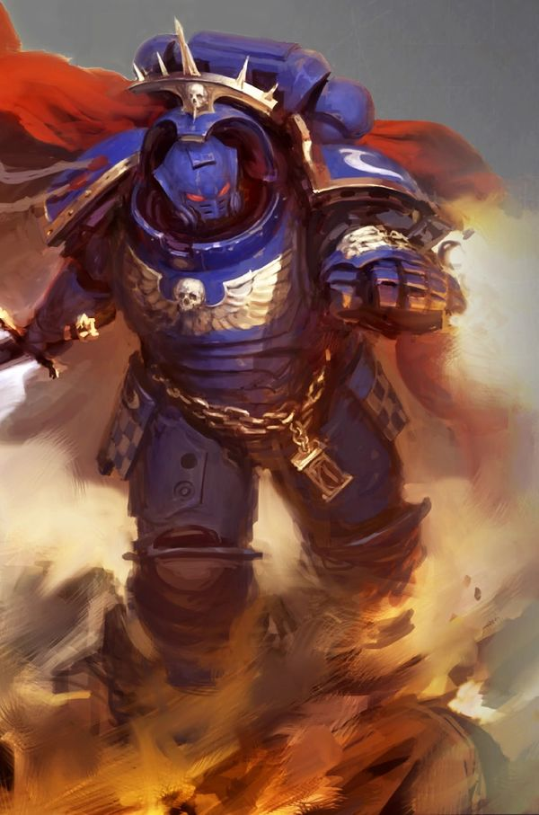
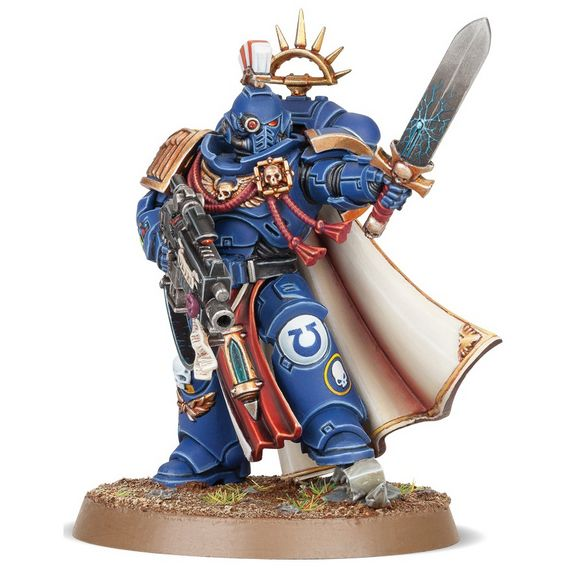
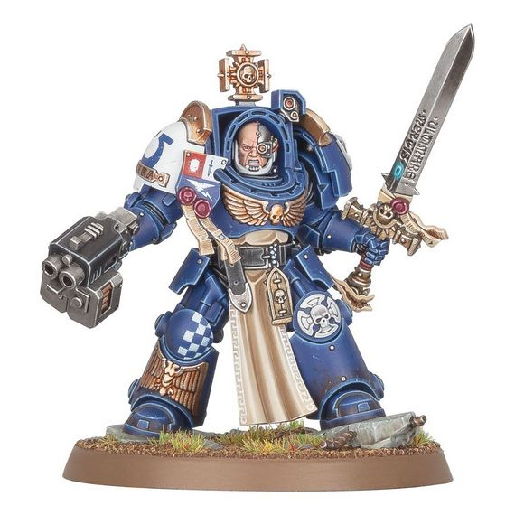
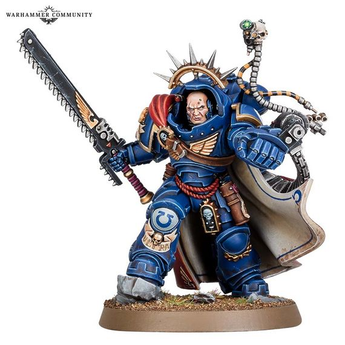
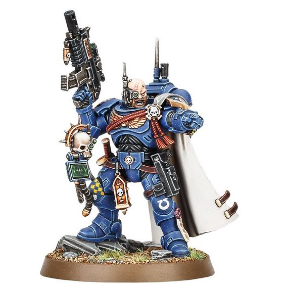

# 0248 连长 Captain

精校状态：中文行文已逐段精校，部分术语仍为暂定

分类：通用概念 / 帝国 Imperium / 中央政务部 Adeptus Terra / 阿斯塔特修会 Adeptus Astartes

原文来源：https://www.bilibili.com/opus/1019533426859966473

原作者：帝国神选罐头

原文时间：2025年01月07日 10:30

[返回分类目录](目录.md) · [全书目录](../../目录.md)

<!-- A0248-B0001 -->
**英文原文**

A Captain leads from the front. By his example shall his men know what it is to be of the Adeptus Astartes, and from his teachings shall they learn the trade of battle in the Emperor's name.

<!-- /A0248-B0001 -->

<!-- A0248-B0002 -->
**英文原文**

No ordinary man can a Captain be, for many are the paths to victory and he must be master of them all. His very being shall be an extension of the Emperor's work. With every strike of his sword, with every word of his speech, does he reaffirm the ideals of our honoured master. He will vanquish darkness and heresy with every thought, word, and deed. So shall his coming be a sign of deliverance to the dutiful, and a herald of dismay to all traitors. No living man shall stay his wrath. Roboute Guilliman, quoted in the Apocrypha of Skaros.

<!-- /A0248-B0002 -->

<!-- A0248-B0003 -->

原译文

一位连长要身先士卒。他的部下应从他的榜样中了解到作为阿斯塔特修士的意义，并从他的教导中学习以帝皇之名战斗的技艺。 连长绝非寻常之人，因为通往胜利的道路众多，而他必须精通所有。他的存在本身就是帝皇功业的延伸。他的每一次挥剑，每一句言辞，都在重申我们尊敬的主宰的理想。他的每一个思想、每一句话语、每一个行动，都将战胜黑暗与异端。因此，他的到来对尽职者是救赎的标志，对所有叛徒则是警示的先兆。没有活人能够阻挡他的愤怒。

**校订译文**

“连长当身先士卒。部下将以他为榜样，领会身为阿斯塔特修会一员的意义，并从他的教导中学会以帝皇之名作战。连长绝非庸常之人：通往胜利的道路众多，他须一一精通。他的存在本身，就是帝皇事业的延续。他的每次挥剑、每句话语，都在重申吾等尊主的理想。他将以一思一言、一举一动驱逐黑暗与异端。因此，他的到来当为尽职者带来救赎，为叛徒带来恐惧。世间无一活人能阻挡他的怒火。”

<!-- /A0248-B0003 -->

<!-- A0248-B0004 -->

原译文

罗伯特·基利曼，引自斯卡罗斯经书

**校订译文**

——罗保特·基里曼，引自《斯卡罗斯次经》

<!-- /A0248-B0004 -->

<!-- A0248-B0005 -->
**英文原文**

A Space Marine 'Captain'(also known as Brother-Captain, or Company Captain) is a Senior rank within a Space marine Chapter. They typically commands an entire Company of his battle brothers (a customary maximum of one hundred Marines).

<!-- /A0248-B0005 -->

<!-- A0248-B0006 -->

原译文

星际战士“连长”（也称为兄弟连长或连队连长）是星际战士战团的高级军衔。他们通常指挥他的整个连队的战斗兄弟（通常最多一百名星际战士）。

**校订译文**

连长又称兄弟连长或连队连长，是星际战士战团的高级军阶，通常统率一整个连的战斗兄弟，按惯例最多约一百人。

<!-- /A0248-B0006 -->

<!-- A0248-B0007 图片 -->

<!-- A0248-B0008 -->

原译文

Ultramarines Primaris Captain 极限战士原铸连长

**校订译文**

Ultramarines Primaris Captain 极限战士原铸连长

<!-- /A0248-B0008 -->

<!-- A0248-B0009 -->
## History 历史

<!-- /A0248-B0009 -->

<!-- A0248-B0010 -->
**英文原文**

The ancient rank of Captain has been employed since the days of the Space Marine Legions. During the Great Crusade a Company Captain was a military rank given to the commander of a Company, a command level between Battalion and Squad, leading a force of a hundred Legionaries. Depending on the Legion, the designation would vary and could be Centurion, Prime, Knight-Captain, Wolf Lord, Blooded, Khan, etc... This position was mostly granted to Legion Centurions, elite officers of the Legions who demonstrated their worth in the fires of conflict.

<!-- /A0248-B0010 -->

<!-- A0248-B0011 -->

原译文

自星际战士军团时代以来，连长这一古老军衔就一直在使用。在大远征期间，连长是授予连队指挥官的军衔，是营和小队之间的指挥级别，领导着一支由一百名军团士兵组成的部队。根据军团的不同，称呼会有所不同，可能是百夫长、主官、骑士连长、狼主、染血者、可汗等……这个职位主要授予军团百夫长，军团的精英军官，他们在冲突中表现出了自己的价值。

**校订译文**

自星际战士军团时代以来，连长这一古老军衔就一直在使用。在大远征期间，连长是授予连队指挥官的军衔，是营和小队之间的指挥级别，领导着一支由一百名军团士兵组成的部队。根据军团的不同，称呼会有所不同，可能是百夫长、主官、骑士连长、狼主、染血者、可汗等……这个职位主要授予军团百夫长，军团的精英军官，他们在冲突中表现出了自己的价值。

<!-- /A0248-B0011 -->

<!-- A0248-B0012 图片 -->

<!-- A0248-B0013 -->

原译文

Primaris Captain 原铸连长

**校订译文**

Primaris Captain 原铸连长

<!-- /A0248-B0013 -->

<!-- A0248-B0014 -->
**英文原文**

With the institution of the Codex Astartes, the rank of Captain as Commander of a Company remained and is still in use in the current era.

<!-- /A0248-B0014 -->

<!-- A0248-B0015 -->

原译文

随着阿斯塔特圣典的建立，连长作为连队指挥官的军衔仍然存在，并且在当今时代仍在使用。

**校订译文**

随着阿斯塔特圣典的建立，连长作为连队指挥官的军衔仍然存在，并且在当今时代仍在使用。

<!-- /A0248-B0015 -->

<!-- A0248-B0016 -->
## Role and Responsibilities 角色与职责

<!-- /A0248-B0016 -->

<!-- A0248-B0017 -->
**英文原文**

In a Space Marine Chapter, each company is under the authority of a Captain, seasoned veterans and expert strategists, who have proven their combat skills either in the Chapter's elite 1st Company or through exceptional service in their own company. The Captain’s guidance increases the value of his battle-brothers tenfold, and he justifies their faith in him with every command.

<!-- /A0248-B0017 -->

<!-- A0248-B0018 -->

原译文

在星际战士战团中，每个连队都由一名连长、经验丰富的老兵和专家战略家领导，他们要么在战团的精英第一连队，要么在自己的连队中通过出色的服务证明了自己的战斗技能。连长的指导使他的战斗兄弟的价值增加了十倍，他用每一个命令证明了他们对他的信任。

**校订译文**

各连由一名连长统率。连长是久经沙场的老兵与战略专家，或曾在精锐第一连证明实力，或因在原连队表现卓越而晋升。他的指挥能使战斗兄弟的战力倍增，每一道命令都应无愧于部下的信任。

**校注：** seasoned veterans and expert strategists 是对连长的同位说明，并非连长、老兵、战略家三方共同领导连队。

<!-- /A0248-B0018 -->

<!-- A0248-B0019 图片 -->

<!-- A0248-B0020 -->

原译文

Captain in Terminator Armour 终结者连长

**校订译文**

Captain in Terminator Armour 终结者护甲连长

<!-- /A0248-B0020 -->

<!-- A0248-B0021 -->
**英文原文**

Typically, the senior-most Captain commands the First Company and often serves as second-in-command to the Chapter Master and as their immediate successor. In addition, some chapters, such as the Salamanders and the Space Wolves, the Chapter Master is at once the leader of the entire chapter and of his own company of marines.

<!-- /A0248-B0021 -->

<!-- A0248-B0022 -->

原译文

通常情况下，最高级的连长指挥第一连，并经常担任战团长的副手和他们的直接继任者。此外，在某些战团，如火蜥蜴和太空野狼，连长同时是整个战团和他自己的星际战士连队的领导者。

**校订译文**

资历最深的连长通常统率第一连，并常担任战团长的副手及首要继任人选。在火蜥蜴、太空野狼等战团中，战团长还会在统领整个战团的同时，直接指挥自己的连队。

**校注：** 后半句主语为 Chapter Master 战团长，原译误作连长。

<!-- /A0248-B0022 -->

<!-- A0248-B0023 -->
**英文原文**

A Captain isn't just a warrior; they must also possess the ability to persuade and negotiate. Though Captains are capable of decisive action, they understand the importance of subtlety in certain situations. Besides their rank, Captains also carry honorific titles related to their duties as a Master, responsible for an area of Chapter logistics or organization.

<!-- /A0248-B0023 -->

<!-- A0248-B0024 -->

原译文

连长不仅仅是一名战士；他们还必须具备说服和谈判的能力。虽然连长能够采取果断行动，但他们明白在某些情况下细微之处的重要性。除了军衔，连长还拥有与大师职责相关的尊称，负责战团后勤或组织领域。

**校订译文**

连长不仅要善战，也须擅长说服与谈判。他们能够果断行动，也懂得何时需要审慎而细腻的处置。除军阶外，连长还常兼有各类荣誉头衔，负责战团某一领域的后勤或组织事务。

<!-- /A0248-B0024 -->

<!-- A0248-B0025 -->
## Wargear 武备

原题：Wargear 战备

<!-- /A0248-B0025 -->

<!-- A0248-B0026 -->
**英文原文**

Captains have access to the best equipment available to a Chapter, such as Artificer Armour, Terminator Armour and weapons，Gravis Armour, Power Fist, Relic weapons, Thunder Hammer, Jump Packs and Bikes.

<!-- /A0248-B0026 -->

<!-- A0248-B0027 -->

原译文

连长可以使用一个战团可用的最佳装备，如精工甲、终结者甲和武器、重型甲、动力拳、圣物武器、雷霆锤、跳跃背包和摩托。

**校订译文**

连长可使用战团最优良的装备，包括精工甲、终结者护甲及配套武器、重装型护甲、动力拳、圣物武器、雷霆锤、跳跃背包和摩托。

<!-- /A0248-B0027 -->

<!-- A0248-B0028 图片 -->

<!-- A0248-B0029 -->

原译文

Primaris Captain in Gravis Armor 重装连长

**校订译文**

Primaris Captain in Gravis Armor 重装型护甲原铸连长

<!-- /A0248-B0029 -->

<!-- A0248-B0030 -->
**英文原文**

Captains assigned to Vanguard Space Marine formations will typically adopt stealth tools such as Omni-Scramblers, lightweight Phobos Armour, and master-crafted Instigator Bolters.

<!-- /A0248-B0030 -->

<!-- A0248-B0031 -->

原译文

被分配到先锋星际战士编队的连长通常会使用全频干扰器、轻型恐惧甲和大师级的煽动者爆矢枪等潜行工具。

**校订译文**

配属先锋部队的连长通常采用潜行装备，例如全频扰频器、轻便的恐惧型护甲，以及精工煽动者爆矢枪。

<!-- /A0248-B0031 -->

<!-- A0248-B0032 图片 -->

<!-- A0248-B0033 -->

原译文

Primaris Captain in Phobos Armour 先锋连长

**校订译文**

Primaris Captain in Phobos Armour 恐惧型护甲原铸连长

<!-- /A0248-B0033 -->

<!-- A0248-B0034 -->
## Chapter Variations 战团变体

<!-- /A0248-B0034 -->

<!-- A0248-B0035 -->
**英文原文**

Within many chapters, the Captain is sometimes referred to as "Brother-Captain" in recognition that all marines within the chapter are brethren. Several chapters refer to their Company Captains by different titles:

<!-- /A0248-B0035 -->

<!-- A0248-B0036 -->

原译文

在许多战团中，连长有时被称为“兄弟连长”，以承认该战团中的所有星际战士都是兄弟。有几个战团以不同的称呼提到了他们的连长：

**校订译文**

在许多战团中，连长有时被称为“兄弟连长”，以承认该战团中的所有星际战士都是兄弟。有几个战团以不同的称呼提到了他们的连长：

<!-- /A0248-B0036 -->

<!-- A0248-B0037 -->
### Dark Angels 黑暗天使

原题：Dark Angels 黑暗天使 Master 导师

<!-- /A0248-B0037 -->

<!-- A0248-B0038 -->
### Space Wolves 太空野狼

原题：Space Wolves 太空野狼 Wolf Lord 狼主

<!-- /A0248-B0038 -->

<!-- A0248-B0039 -->
### Red Scorpions 红蝎 Commander 指挥官

<!-- /A0248-B0039 -->

<!-- A0248-B0040 -->
### Black Templars 黑色圣堂

原题：Black Templars 黑色圣堂 Marshal or Castellan 元帅或堡主

<!-- /A0248-B0040 -->

<!-- A0248-B0041 -->
### Iron Hands 钢铁之手 Iron Captain or Clan-Commander 钢铁连长或氏族指挥官

<!-- /A0248-B0041 -->

<!-- A0248-B0042 -->
### Grey Knights 灰骑士 Brother-Captain (represents a slightly different rank) 兄弟会连长（其军阶含义略有不同）

原题：Grey Knights 灰骑士 Brother-Captain (represents a slightly different rank) 兄弟连长（代表稍微不同的军衔）

<!-- /A0248-B0042 -->

<!-- A0248-B0043 -->
### Raven Guard 暗鸦守卫 Shadow Captain 暗影连长

<!-- /A0248-B0043 -->

<!-- A0248-B0044 -->
### Excoriators 责难者 Corpus-Captain 圣体连长

<!-- /A0248-B0044 -->

<!-- A0248-B0045 -->
### White Scars 白疤 Khan 可汗

原题：White Scars 白色疤痕 Khan 可汗

<!-- /A0248-B0045 -->

<!-- A0248-B0046 -->
### Deathwatch 死亡守望

原题：Deathwatch 死亡守望 Watch Captain 守望连长

<!-- /A0248-B0046 -->

<!-- A0248-B0047 -->
## Notable Space Marine Captains 著名星际战士连长

<!-- /A0248-B0047 -->

<!-- A0248-B0048 -->

原译文

Ultramarines 极限战士

**校订译文**

Ultramarines 极限战士

<!-- /A0248-B0048 -->

<!-- A0248-B0049 -->
**英文原文**

Severus Agemman - Captain of the 1st Company

<!-- /A0248-B0049 -->

<!-- A0248-B0050 -->

原译文

西弗勒斯·阿格曼 - 第一连长

**校订译文**

西弗勒斯·阿格曼 - 第一连长

<!-- /A0248-B0050 -->

<!-- A0248-B0051 -->
**英文原文**

Sevastus Acheran - Captain of the 2nd Company

<!-- /A0248-B0051 -->

<!-- A0248-B0052 -->

原译文

西瓦图斯·阿切兰 - 第二连长

**校订译文**

西瓦图斯·阿切兰 - 第二连长

<!-- /A0248-B0052 -->

<!-- A0248-B0053 -->
**英文原文**

Cato Sicarius - Former Captain of the 2nd Company and High Suzerain of Ultramar

<!-- /A0248-B0053 -->

<!-- A0248-B0054 -->

原译文

卡托·西卡留斯 - 极限战士前第二连长和奥特拉玛高领主

**校订译文**

卡托·西卡留斯 - 极限战士前第二连长和奥特拉玛高领主

<!-- /A0248-B0054 -->

<!-- A0248-B0055 -->
**英文原文**

Uriel Ventris - Captain of the 4th Company

<!-- /A0248-B0055 -->

<!-- A0248-B0056 -->

原译文

乌瑞尔·文崔斯 - 第四连长

**校订译文**

乌瑞尔·文崔斯 - 第四连长

<!-- /A0248-B0056 -->

<!-- A0248-B0057 -->

原译文

Space Wolves 太空野狼

**校订译文**

Space Wolves 太空野狼

<!-- /A0248-B0057 -->

<!-- A0248-B0058 -->
**英文原文**

Ragnar Blackmane - Wolf Lord of the Blackmanes

<!-- /A0248-B0058 -->

<!-- A0248-B0059 -->

原译文

拉格纳·黑鬃 - 黑鬃大连狼主

**校订译文**

拉格纳·黑鬃 - 黑鬃大连狼主

<!-- /A0248-B0059 -->

<!-- A0248-B0060 -->
**英文原文**

Harald Deathwolf - Wolf Lord of the Deathwolves

<!-- /A0248-B0060 -->

<!-- A0248-B0061 -->

原译文

哈拉德·死狼 - 死狼大连狼主

**校订译文**

哈拉尔德·死狼 - 死狼大连狼主

<!-- /A0248-B0061 -->

<!-- A0248-B0062 -->
**英文原文**

Krom Dragongaze - Wolf Lord of the Drakeslayers

<!-- /A0248-B0062 -->

<!-- A0248-B0063 -->

原译文

克罗姆·龙瞪 - 屠龙大连狼主

**校订译文**

克罗姆·龙瞪 - 屠龙大连狼主

<!-- /A0248-B0063 -->

<!-- A0248-B0064 -->
**英文原文**

Sven Bloodhowl - Wolf Lord of the Firehowlers

<!-- /A0248-B0064 -->

<!-- A0248-B0065 -->

原译文

斯万·血吼 - 火吼大连狼主

**校订译文**

斯万·血吼 - 火吼大连狼主

<!-- /A0248-B0065 -->

<!-- A0248-B0066 -->

原译文

Blood Angels 圣血天使

**校订译文**

Blood Angels 圣血天使

<!-- /A0248-B0066 -->

<!-- A0248-B0067 -->
**英文原文**

Karlaen - Captain of the 1st Company

<!-- /A0248-B0067 -->

<!-- A0248-B0068 -->

原译文

卡莱恩 - 第一连长

**校订译文**

卡莱恩 - 第一连长

<!-- /A0248-B0068 -->

<!-- A0248-B0069 -->
**英文原文**

Erasmus Tycho - Former Captain of the 3rd Company

<!-- /A0248-B0069 -->

<!-- A0248-B0070 -->

原译文

伊拉斯谟·第谷 - 前第三连长

**校订译文**

伊拉斯谟·第谷 - 前第三连长

<!-- /A0248-B0070 -->

<!-- A0248-B0071 -->

原译文

Dark Angels 黑暗天使

**校订译文**

Dark Angels 黑暗天使

<!-- /A0248-B0071 -->

<!-- A0248-B0072 -->
**英文原文**

Belial - Grand Master of the Deathwing

<!-- /A0248-B0072 -->

<!-- A0248-B0073 -->

原译文

贝利尔 - 死翼大导师

**校订译文**

贝利亚——死翼大导师。

<!-- /A0248-B0073 -->

<!-- A0248-B0074 -->
**英文原文**

Sammael - Master of the Ravenwing

<!-- /A0248-B0074 -->

<!-- A0248-B0075 -->

原译文

撒缪尔 - 鸦翼导师

**校订译文**

萨麦尔——鸦翼导师。

<!-- /A0248-B0075 -->

<!-- A0248-B0076 -->
**英文原文**

Lazarus - Master of the 5th Company

<!-- /A0248-B0076 -->

<!-- A0248-B0077 -->

原译文

拉萨路 - 第五连队导师

**校订译文**

拉撒路——第五连导师。

<!-- /A0248-B0077 -->

<!-- A0248-B0078 -->

原译文

White Scars 白色疤痕

**校订译文**

White Scars 白疤

<!-- /A0248-B0078 -->

<!-- A0248-B0079 -->
**英文原文**

Kor'sarro Khan - Khan of the 3rd Company and Master of the Hunt

<!-- /A0248-B0079 -->

<!-- A0248-B0080 -->

原译文

阔萨罗可汗 - 第三连队可汗和狩猎大师

**校订译文**

科萨罗可汗——第三连可汗兼狩猎大师。

<!-- /A0248-B0080 -->

<!-- A0248-B0081 -->

原译文

Imperial Fists 帝国之拳

**校订译文**

Imperial Fists 帝国之拳

<!-- /A0248-B0081 -->

<!-- A0248-B0082 -->
**英文原文**

Darnath Lysander - Captain of the 1st Company

<!-- /A0248-B0082 -->

<!-- A0248-B0083 -->

原译文

达纳斯·莱山德 - 第一连长

**校订译文**

达纳斯·莱山德 - 第一连长

<!-- /A0248-B0083 -->

<!-- A0248-B0084 -->
**英文原文**

Tor Garadon - Captain of the 3rd Company

<!-- /A0248-B0084 -->

<!-- A0248-B0085 -->

原译文

托尔·加拉顿 - 第三连长

**校订译文**

托尔·加拉顿 - 第三连长

<!-- /A0248-B0085 -->

<!-- A0248-B0086 -->
**英文原文**

Taelos - Captain of the 10th Company

<!-- /A0248-B0086 -->

<!-- A0248-B0087 -->

原译文

泰洛斯 - 第十连长

**校订译文**

泰洛斯 - 第十连长

<!-- /A0248-B0087 -->

<!-- A0248-B0088 -->

原译文

Salamanders 火蜥蜴

**校订译文**

Salamanders 火蜥蜴

<!-- /A0248-B0088 -->

<!-- A0248-B0089 -->
**英文原文**

Adrax Agatone - Captain of the 3rd Company

<!-- /A0248-B0089 -->

<!-- A0248-B0090 -->

原译文

阿德拉克斯·阿加顿 - 第三连长

**校订译文**

阿德拉克斯·阿伽顿——第三连长。

<!-- /A0248-B0090 -->

<!-- A0248-B0091 -->
**英文原文**

Ur'zan Drakgaard - Captain of the 6th Company

<!-- /A0248-B0091 -->

<!-- A0248-B0092 -->

原译文

乌尔赞·德拉克加德 - 第六连长

**校订译文**

乌尔赞·德拉克加德 - 第六连长

<!-- /A0248-B0092 -->

<!-- A0248-B0093 -->

原译文

Raven Guard 暗鸦守卫

**校订译文**

Raven Guard 暗鸦守卫

<!-- /A0248-B0093 -->

<!-- A0248-B0094 -->
**英文原文**

Kyrin Solaq - Shadow-Captain of the 5th Company

<!-- /A0248-B0094 -->

<!-- A0248-B0095 -->

原译文

基林·索拉克 - 第五连队暗影连长

**校订译文**

基林·索拉克 - 第五连队暗影连长

<!-- /A0248-B0095 -->

<!-- A0248-B0096 -->

原译文

Black Templars 黑色圣堂

**校订译文**

Black Templars 黑色圣堂

<!-- /A0248-B0096 -->

<!-- A0248-B0097 -->
**英文原文**

Marius Amalrich - Marshal

<!-- /A0248-B0097 -->

<!-- A0248-B0098 -->

原译文

马里乌斯·阿马尔里奇 - 元帅

**校订译文**

马里乌斯·阿马尔里奇 - 元帅

<!-- /A0248-B0098 -->

<!-- A0248-B0099 -->

原译文

Grey Knights 灰骑士

**校订译文**

Grey Knights 灰骑士

<!-- /A0248-B0099 -->

<!-- A0248-B0100 -->
**英文原文**

Arvann Stern - Brother-Captain of the 3rd Brotherhood

<!-- /A0248-B0100 -->

<!-- A0248-B0101 -->

原译文

阿尔文·斯特恩 - 第三兄弟会的兄弟连长

**校订译文**

艾维安·斯特恩——第三兄弟会的兄弟会连长。

<!-- /A0248-B0101 -->

<!-- A0248-B0102 -->

原译文

Deathwatch 死亡守望

**校订译文**

Deathwatch 死亡守望

<!-- /A0248-B0102 -->

<!-- A0248-B0103 -->
**英文原文**

Artemis - Watch Captain

<!-- /A0248-B0103 -->

<!-- A0248-B0104 -->

原译文

阿尔忒弥斯 - 守望连长

**校订译文**

阿尔忒弥斯 - 守望连长

<!-- /A0248-B0104 -->

<!-- A0248-B0105 -->

原译文

Red Scorpions 红蝎

**校订译文**

Red Scorpions 红蝎

<!-- /A0248-B0105 -->

<!-- A0248-B0106 -->

原译文

Casan Sabius 卡桑·萨比乌斯

**校订译文**

Casan Sabius 卡桑·萨比乌斯

<!-- /A0248-B0106 -->

本篇核心术语与暂定项

以下列出本篇出现的英文原形及核心术语表用词。同形词可能指不同对象，具体词义以本篇正文和校注为准；单复数、别名和仅见于图注的名称可能尚未列入。完整候选见[术语表](../../术语表/双语术语候选.csv)。

| 英文 | 采用中文 | 状态 |
| --- | --- | --- |
| Adeptus Astartes | 阿斯塔特修会 | 官方已核对 |
| Space Wolves | 太空野狼 | 官方已核对 |
| Terminator | 终结者 | 官方已核对 |
| Roboute Guilliman | 罗保特·基里曼 | 官方已核对 |
| Ultramar | 奥特拉玛 | 官方已核对 |
| Equipment | 装备 | 编辑用语已统一 |
| Darnath Lysander | 达纳斯·莱山德 | 官方已核对 |
| Emperor | 帝皇 | 官方已核对 |
| Great Crusade | 大远征 | 暂定·官方待核 |
| Salamanders | 火蜥蜴 | 暂定·官方待核 |
| Brotherhood | 兄弟会 | 暂定·官方待核 |
| Phobos | 火卫一 | 暂定·官方待核 |
| Deliverance | 拯救星 | 暂定·官方待核 |
| Master | 导师（审判庭职衔）／舰务官（舰员职务） | 语境定译·官方待核 |
| Apocrypha of Skaros | 斯卡罗斯次经 | 暂定·官方待核 |
| Ancient | 旗手 | 官方已核对 |
| Phobos Armour | 恐惧型护甲 | 官方已核 |
| Herald | 传令官 | 暂定·官方待核 |
| Space Marine | 星际战士 | 暂定·官方待核 |
| Chapter | 战团 | 暂定·官方待核 |
| Chapter Master | 战团长 | 暂定·官方待核 |
| Captain | 连长 | 暂定·官方待核 |
| Brother | 修士 | 暂定·官方待核 |
| Vanguard | 先锋 | 暂定·官方待核 |
| Vanguard Space Marine | 先锋星际战士 | 暂定·官方待核 |
| Cato Sicarius | 卡托·西卡留斯 | 暂定·官方待核 |
| Severus Agemman | 西弗勒斯·阿格曼 | 暂定·官方待核 |
| Sevastus Acheran | 西瓦图斯·阿切兰 | 暂定·官方待核 |
| Uriel Ventris | 乌瑞尔·文崔斯 | 官方已核 |
| Sammael | 萨麦尔 | 官方已核 |
| Belial | 贝利亚 | 官方已核 |
| Lazarus | 拉撒路 | 官方已核 |
| Ragnar Blackmane | 拉格纳·黑鬃 | 官方已核 |
| Krom Dragongaze | 克罗姆·龙瞪 | 暂定·官方待核 |
| Harald Deathwolf | 哈拉尔德·死狼 | 暂定·官方待核 |
| Karlaen | 卡莱恩 | 暂定·官方待核 |
| Tor Garadon | 托尔·加拉顿 | 官方已核 |
| Adrax Agatone | 阿德拉克斯·阿伽顿 | 官方已核 |
| Kor'sarro Khan | 科萨罗可汗 | 暂定·官方待核 |
| Arvann Stern | 艾维安·斯特恩 | 暂定·官方待核 |
| Artemis | 阿尔忒弥斯 | 暂定·官方待核 |
| Codex Astartes | 阿斯塔特圣典 | 暂定·官方待核 |
| Grand Master of the Deathwing | 死翼大导师 | 暂定·官方待核 |
| High Suzerain of Ultramar | 奥特拉玛高领主 | 暂定·官方待核 |
| Master of the Hunt | 狩猎大师 | 暂定·官方待核 |
| Centurions | 百夫长 | 暂定·官方待核 |
| Artificer | 技工 | 暂定·官方待核 |
| Sven Bloodhowl | 斯万·血吼 | 暂定·官方待核 |
| Erasmus Tycho | 伊拉斯谟·第谷 | 暂定·官方待核 |
| Taelos | 泰洛斯 | 暂定·官方待核 |
| Ur'zan Drakgaard | 乌尔赞·德拉克加德 | 暂定·官方待核 |
| Kyrin Solaq | 基林·索拉克 | 暂定·官方待核 |
| Marius Amalrich | 马里乌斯·阿马尔里奇 | 暂定·官方待核 |
| Omni-scramblers | 全频扰频器 | 暂定·官方待核 |
| Brother-Captain | 兄弟会连长（灰骑士）／兄弟连长（通称） | 语境定译·灰骑士职衔官译已核 |
| Marshal | 元帅 | 官方已核对 |
| Bikes | 摩托 | 暂定·官方待核 |
| Severus | 西弗勒斯 | 暂定·官方待核 |
| Watch Captain | 守望连长 | 暂定·官方待核 |
| Grand Master | 大导师 | 暂定·官方待核 |
| Deathwolves | 死狼 | 暂定·官方待核 |
| Drakeslayers | 屠龙者 | 暂定·官方待核 |
| Thunder Hammer | 雷霆锤 | 暂定·官方待核 |
| Power fist | 动力拳 | 官方已核对 |
| Terminator Armour | 终结者盔甲 | 暂定·官方待核 |
| Artificer Armour | 精工盔甲 | 暂定·官方待核 |

