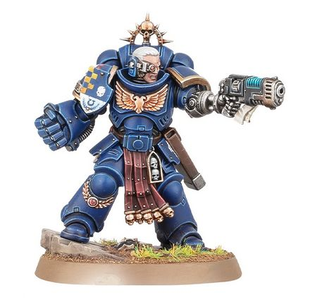
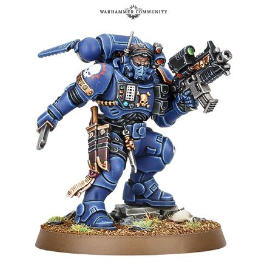

# 0249 副官 Lieutenant

精校状态：中文行文已逐段精校，部分术语仍为暂定

分类：通用概念 / 帝国 Imperium / 中央政务部 Adeptus Terra / 阿斯塔特修会 Adeptus Astartes

原文来源：https://www.bilibili.com/opus/1026559108627562516

原作者：帝国神选罐头

原文时间：编辑于 2025年09月08日 15:18

[返回分类目录](目录.md) · [全书目录](../../目录.md)

<!-- A0249-B0001 -->
**英文原文**

Lieutenant was a rank of Space Marine used in the Legiones Astartes during the Great Crusade and Horus Heresy. For a time it fell out of use for many years thereafter upon the implementation of the Codex Astartes.

<!-- /A0249-B0001 -->

<!-- A0249-B0002 -->

原译文

副官是大远征和荷鲁斯叛乱期间在阿斯塔特军团服役的星际战士军衔。在阿斯塔特圣典实施后的许多年里，它一度停止使用。

**校订译文**

副官是大远征和荷鲁斯之乱期间在阿斯塔特军团服役的星际战士军衔。在阿斯塔特圣典实施后的许多年里，它一度停止使用。

<!-- /A0249-B0002 -->

<!-- A0249-B0003 图片 -->

<!-- A0249-B0004 -->

原译文

Ultramarines Lieutenant 极限战士副官

**校订译文**

Ultramarines Lieutenant 极限战士副官

<!-- /A0249-B0004 -->

<!-- A0249-B0005 -->
## Modern Lieutenants 现代副官

<!-- /A0249-B0005 -->

<!-- A0249-B0006 -->
**英文原文**

Ten thousand years after the Heresy upon the return of Roboute Guilliman, the rank of Lieutenant was again implemented. Lieutenants now serve under the command of Captains, acting as their right hands by providing flexibility and helping to direct their battle-brothers in engagements. Space Marine Companies are typically divided into two demi-companies, each of which is commanded by a Lieutenant.

<!-- /A0249-B0006 -->

<!-- A0249-B0007 -->

原译文

在叛乱一万年后，罗伯特·基里曼回归，副官的军衔再次生效。副官现在在连长的指挥下服役，作为他们的得力助手，提供灵活性，帮助指导他们的战斗兄弟参与战斗。星际战士通常分为两个半连，每个半连由一名副官指挥。

**校订译文**

荷鲁斯之乱一万年后，罗保特·基里曼回归，重新设立副官军阶。副官在连长之下服役，作为左右手协助指挥战斗兄弟，使部署更加灵活。星际战士连队通常分成两个半连，各由一名副官统率。

<!-- /A0249-B0007 -->

<!-- A0249-B0008 -->
**英文原文**

Some Chapters assign additional roles to Lieutenants; for instance, in the Salamanders, they are given ceremonial duty as bodyguards to their Captain, whereas in the Iron Hands, they are charged with questioning their Captain's plans so as to probe for human error.

<!-- /A0249-B0008 -->

<!-- A0249-B0009 -->

原译文

一些战团为连长分配了额外的角色；例如，在火蜥蜴，他们被赋予作为队长护卫的仪式职责，而在钢铁之手，他们被赋予质疑他们连长的计划的职责，以探究人为错误。

**校订译文**

一些战团还赋予副官额外职责。例如，火蜥蜴的副官在礼仪场合担任连长护卫；钢铁之手的副官则须质疑连长的计划，从中找出人为失误。

**校注：** 原文主语 Lieutenants 为副官，原译误作连长；下一段也多次发生相同误译，已修正。

<!-- /A0249-B0009 -->

<!-- A0249-B0010 -->
## Vanguard Lieutenant 先锋副官

<!-- /A0249-B0010 -->

<!-- A0249-B0011 -->
**英文原文**

Vanguard Lieutenants have demonstrated an aptitude for covert operations and serve in Vanguard strike forces. They wear Phobos Armour. Lieutenants are skilled bladesmen, as well as dead-eye shots with their occulus bolt carbines. Their leadership qualities provide their Captains with support and tactical flexibility, which allow the Lieutenants to be assigned to oversee one or more critical aspects of a multi-faceted Vanguard battle operation.

<!-- /A0249-B0011 -->

<!-- A0249-B0012 -->

原译文

先锋副官表现出了秘密行动的天赋，并在先锋打击部队服役。他们穿着福波斯盔甲。连长是熟练的刀兵，也会用他们的全知者爆矢卡宾枪进行致命射击。他们的领导素质为他们的连长提供了支持和战术灵活性，这使得连长能够被指派监督多方面先锋作战行动的一个或多个关键方面。

**校订译文**

先锋副官擅长秘密行动，服役于先锋突击部队，身穿恐惧型护甲。他们精通刀剑，也能以全知者爆矢卡宾枪百发百中。其领导能力为连长提供支持，使战术安排更具弹性；在复杂的先锋作战行动中，副官可受命主管一个或多个关键环节。

<!-- /A0249-B0012 -->

<!-- A0249-B0013 图片 -->

<!-- A0249-B0014 -->

原译文

Vanguard Lieutenant 先锋副官

**校订译文**

Vanguard Lieutenant 先锋副官

<!-- /A0249-B0014 -->

<!-- A0249-B0015 -->
## Variations 变体

<!-- /A0249-B0015 -->

<!-- A0249-B0016 -->
**英文原文**

Battle Leader — Space Wolves.

<!-- /A0249-B0016 -->

<!-- A0249-B0017 -->

原译文

战斗头领 — 太空野狼

**校订译文**

战斗领袖——太空野狼。

<!-- /A0249-B0017 -->

<!-- A0249-B0018 -->
**英文原文**

Castellan — Black Templars.

<!-- /A0249-B0018 -->

<!-- A0249-B0019 -->

原译文

堡主 — 黑色圣堂

**校订译文**

堡主 — 黑色圣堂

<!-- /A0249-B0019 -->

<!-- A0249-B0020 -->
**英文原文**

Naysmith — Iron Hands.

<!-- /A0249-B0020 -->

<!-- A0249-B0021 -->

原译文

否决铁匠 — 钢铁之手

**校订译文**

谏官（原稿别名：否决铁匠）——钢铁之手。

**校注：** Naysmith 的职责是审视、质疑连长命令，非从事锻造。参照729篇职责说明，采用暂定功能译名谏官，首处保留原稿别名。

<!-- /A0249-B0021 -->

<!-- A0249-B0022 -->
**英文原文**

Strikemaster — Dark Angels.

<!-- /A0249-B0022 -->

<!-- A0249-B0023 -->

原译文

打击大师 — 黑暗天使

**校订译文**

打击大师 — 黑暗天使

<!-- /A0249-B0023 -->

<!-- A0249-B0024 -->
**英文原文**

Talonmaster — Dark Angels.

<!-- /A0249-B0024 -->

<!-- A0249-B0025 -->

原译文

利爪大师 — 黑暗天使

**校订译文**

利爪大师 — 黑暗天使

<!-- /A0249-B0025 -->

<!-- A0249-B0026 -->
## Notable Space Marine Lieutenants 著名星际战士副官

<!-- /A0249-B0026 -->

<!-- A0249-B0027 -->
**英文原文**

Cassian Talasadian — Ultramarines. Encased in a Primaris Redemptor Dreadnought after the battle on Kalides Prime.

<!-- /A0249-B0027 -->

<!-- A0249-B0028 -->

原译文

卡西安·塔拉萨迪安 — 极限战士。在卡利德斯主星之战后，被装入原铸救赎者无畏中。

**校订译文**

卡西安·塔拉萨迪安——极限战士；卡利德斯主星之战后，被安置于原铸救赎者无畏机甲中。

<!-- /A0249-B0028 -->

<!-- A0249-B0029 -->
**英文原文**

Eothrus — Ultramarines.

<!-- /A0249-B0029 -->

<!-- A0249-B0030 -->

原译文

伊欧索斯 — 极限战士

**校订译文**

伊欧索斯 — 极限战士

<!-- /A0249-B0030 -->

<!-- A0249-B0031 -->
**英文原文**

Ferren Areios — Unnumbered Sons/Ultramarines.

<!-- /A0249-B0031 -->

<!-- A0249-B0032 -->

原译文

费伦·阿雷奥斯 — 未计之子/极限战士

**校订译文**

费伦·阿瑞奥斯——未计之子／极限战士。

<!-- /A0249-B0032 -->

<!-- A0249-B0033 -->
**英文原文**

Heyd Calder — Imperial Fists.

<!-- /A0249-B0033 -->

<!-- A0249-B0034 -->

原译文

海德·卡尔德 — 帝国之拳

**校订译文**

海德·卡尔德 — 帝国之拳

<!-- /A0249-B0034 -->

<!-- A0249-B0035 -->
**英文原文**

Lucian Calsius — Ultramarines.

<!-- /A0249-B0035 -->

<!-- A0249-B0036 -->

原译文

卢西安·卡尔修斯 — 极限战士

**校订译文**

卢西安·卡尔修斯 — 极限战士

<!-- /A0249-B0036 -->

<!-- A0249-B0037 -->
**英文原文**

Mykonis — Silver Templars.

<!-- /A0249-B0037 -->

<!-- A0249-B0038 -->

原译文

麦克尼斯 — 银色颅骨

**校订译文**

麦克尼斯——银色圣堂。

**校注：** Silver Templars 是银色圣堂，原译误作 Silver Skulls 银色颅骨。

<!-- /A0249-B0038 -->

<!-- A0249-B0039 -->
**英文原文**

Nemetus — Ultramarines.

<!-- /A0249-B0039 -->

<!-- A0249-B0040 -->

原译文

涅米图斯 — 极限战士

**校订译文**

涅米图斯 — 极限战士

<!-- /A0249-B0040 -->

<!-- A0249-B0041 -->
**英文原文**

Praxa­medes — Ultramarines.

<!-- /A0249-B0041 -->

<!-- A0249-B0042 -->

原译文

普拉萨梅德斯 — 极限战士

**校订译文**

普拉萨梅德斯 — 极限战士

<!-- /A0249-B0042 -->

<!-- A0249-B0043 -->
**英文原文**

Xedro Farren — Dark Angels.

<!-- /A0249-B0043 -->

<!-- A0249-B0044 -->

原译文

谢德罗·法伦 — 黑暗天使

**校订译文**

谢德罗·法伦 — 黑暗天使

<!-- /A0249-B0044 -->

本篇核心术语与暂定项

以下列出本篇出现的英文原形及核心术语表用词。同形词可能指不同对象，具体词义以本篇正文和校注为准；单复数、别名和仅见于图注的名称可能尚未列入。完整候选见[术语表](../../术语表/双语术语候选.csv)。

| 英文 | 采用中文 | 状态 |
| --- | --- | --- |
| Black Templars | 黑色圣堂 | 官方已核对 |
| Dark Angels | 黑暗天使 | 官方已核对 |
| Space Wolves | 太空野狼 | 官方已核对 |
| Roboute Guilliman | 罗保特·基里曼 | 官方已核对 |
| Ultramarines | 极限战士 | 官方已核对 |
| Horus Heresy | 荷鲁斯之乱 | 官方已核对 |
| Imperial Fists | 帝国之拳 | 暂定 |
| Great Crusade | 大远征 | 暂定·官方待核 |
| Horus | 荷鲁斯 | 暂定·官方待核 |
| Iron Hands | 钢铁之手 | 暂定·官方待核 |
| Legiones Astartes | 阿斯塔特军团 | 暂定·官方待核 |
| Salamanders | 火蜥蜴 | 暂定·官方待核 |
| Phobos | 火卫一 | 暂定·官方待核 |
| Phobos Armour | 恐惧型护甲 | 官方已核 |
| Lieutenant | 副官 | 暂定·官方待核 |
| Space Marine | 星际战士 | 暂定·官方待核 |
| Captain | 连长 | 暂定·官方待核 |
| Vanguard | 先锋 | 暂定·官方待核 |
| Codex Astartes | 阿斯塔特圣典 | 暂定·官方待核 |
| Silver Templars | 银色圣堂 | 暂定·官方待核 |
| Redemptor Dreadnought | 救赎者无畏机甲 | 官方已核对 |
| Cassian Talasadian | 卡西安·塔拉萨迪安 | 暂定·官方待核 |
| Eothrus | 伊欧索斯 | 暂定·官方待核 |
| Ferren Areios | 费伦·阿瑞奥斯 | 暂定·官方待核 |
| Battle Leader | 战斗领袖 | 暂定·官方待核 |
| Castellan | 堡主 | 官方已核对 |
| naysmith | 谏官 | 暂定·官方待核 |
| Strikemaster | 打击大师 | 暂定·官方待核 |
| Talonmaster | 利爪大师 | 暂定·官方待核 |
| Heyd Calder | 海德·卡尔德 | 暂定·官方待核 |
| Lucian Calsius | 卢西安·卡尔修斯 | 暂定·官方待核 |
| Mykonis | 麦克尼斯 | 暂定·官方待核 |
| Nemetus | 涅米图斯 | 暂定·官方待核 |
| Xedro Farren | 谢德罗·法伦 | 暂定·官方待核 |
| Unnumbered Sons | 未计之子 | 暂定·官方待核 |
| Dreadnought | 无畏机甲 | 暂定·官方待核 |
| Cassian | 卡西安 | 暂定·官方待核 |
| Bolt | 爆矢 | 暂定·官方待核 |

