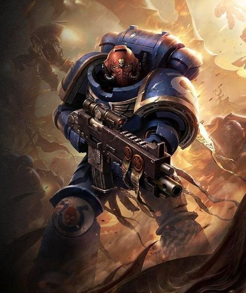
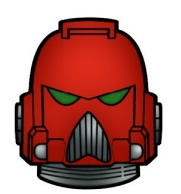
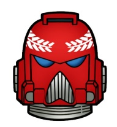
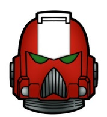
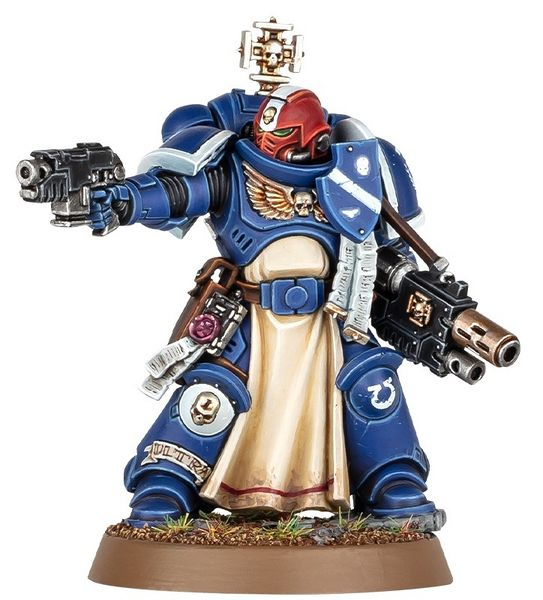
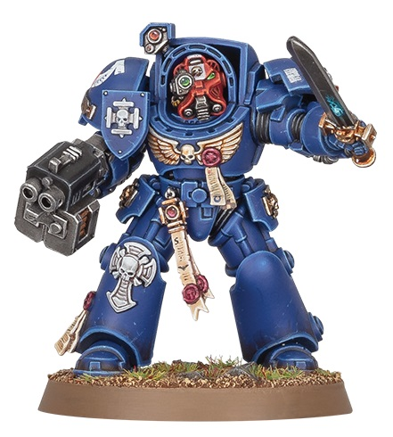

# 0250 军士 Sergeant

精校状态：中文行文已逐段精校，部分术语仍为暂定

分类：通用概念 / 帝国 Imperium / 中央政务部 Adeptus Terra / 阿斯塔特修会 Adeptus Astartes

原文来源：https://www.bilibili.com/opus/1034371327688966160

原作者：帝国神选罐头

原文时间：编辑于 2025年09月24日 12:58

[返回分类目录](目录.md) · [全书目录](../../目录.md)

<!-- A0250-B0001 -->
**英文原文**

The Codex Astartes dictates that every Space Marine Squad is to be led by a Space Marine Sergeant, a veteran of hundreds of battles, forged in the fires of war, who will lead his squad with an icy calm through the most dangerous of scenarios and emerge victorious.

<!-- /A0250-B0001 -->

<!-- A0250-B0002 -->

原译文

阿斯塔特圣典规定，每个星际战士小队都要由一名星际战士军士领导，他是一名在战火中铸造的经过数百场战斗的老兵，他将以冰冷的平静带领他的小队度过最危险的情境，并取得胜利。

**校订译文**

《阿斯塔特圣典》规定，每个小队都由一名军士统率。军士是历经数百场战斗、在战火中锤炼而成的老兵，能以冷静沉着的指挥，带领小队从最危险的局面中赢得胜利。

<!-- /A0250-B0002 -->

<!-- A0250-B0003 图片 -->

<!-- A0250-B0004 -->

原译文

Intercessor Sergeant 仲裁者军士

**校订译文**

Intercessor Sergeant 仲裁者军士

<!-- /A0250-B0004 -->

<!-- A0250-B0005 -->
## Overview 概述

<!-- /A0250-B0005 -->

<!-- A0250-B0006 -->
**英文原文**

Sergeants typically lead Tactical, Assault, Devastator, Terminator, Veterans, Scout Squads, as well as any kind of Battleline, Close Support and Fire Support Squads.

<!-- /A0250-B0006 -->

<!-- A0250-B0007 -->

原译文

军士通常领导战术、突击、毁灭者、终结者、老兵、侦察小队，以及任何类型的前线、近战支援和火力支援小队。

**校订译文**

军士统率战术、突击、破坏者、终结者、老兵和侦察小队，以及各类战线、近战支援与火力支援小队。

<!-- /A0250-B0007 -->

<!-- A0250-B0008 -->
**英文原文**

To become a Sergeant, a Space Marine has to prove himself capable of keeping his nerves through the toughest of warzones, as well as being a formidable fighter. He has to be willing to make difficult decisions based on his instincts, and so only a few Space Marines have the required level of ability to take on this role.

<!-- /A0250-B0008 -->

<!-- A0250-B0009 -->

原译文

要成为一名军士，星际战士必须证明自己有能力在最艰难的战区保持镇定，同时也是一名强大的战士。他必须愿意根据自己的直觉做出艰难的决定，因此只有少数星际战士具备承担这一角色所需的能力。

**校订译文**

要成为一名军士，星际战士必须证明自己有能力在最艰难的战区保持镇定，同时也是一名强大的战士。他必须愿意根据自己的直觉做出艰难的决定，因此只有少数星际战士具备承担这一角色所需的能力。

<!-- /A0250-B0009 -->

<!-- A0250-B0010 -->
**英文原文**

A sergeant acquiring the Veteran Status may be transferred to a Command Squad or the First Company.

<!-- /A0250-B0010 -->

<!-- A0250-B0011 -->

原译文

获得老兵身份的军士可能会被调到指挥组或第一连。

**校订译文**

取得老兵资格的军士，可能调入指挥小队或第一连。

<!-- /A0250-B0011 -->

<!-- A0250-B0012 -->
### Marking and Equipment 标记和装备

<!-- /A0250-B0012 -->

<!-- A0250-B0013 -->
**英文原文**

According to the Codex Astartes, a Sergeant should show his rank with a red-colored helmet, with veterancy marked out by a white laurel around the helmet; they also wear a red skull on the left shoulder pad. but variations exist between Chapters : for example, the Blood Angels mark out their Sergeants with black pauldrons, with red edgings, on which yellow versions of the Chapter icon and their company badge. The Emperor's Spears mark out their Sergeants with transverse crests in red, with Veteran Sergeants' crests being red and black.

<!-- /A0250-B0013 -->

<!-- A0250-B0014 -->

原译文

根据阿斯塔特圣典，军士应佩戴红色头盔以示军衔，头盔周围的白色月桂标志着老兵；他们的左肩甲上还镶嵌一个红色的头骨。但各战团之间存在差异：例如，圣血天使用黑色徽章和红色镶边标记他们的军士，徽章上有黄色版本的战团标志和连队徽章。帝皇之矛用红色的横嵴标记他们的军士，老兵的徽章是红色和黑色的。

**校订译文**

按照《阿斯塔特圣典》，军士以红色头盔标示军阶；若取得老兵资格，则在头盔上加绘白色桂冠，左肩甲还标有红色颅骨。各战团也有不同惯例：圣血天使军士使用红色镶边的黑色肩甲，绘有黄色战团徽章与连队标志；帝皇之矛军士佩戴红色横向盔缨，老兵军士则使用红黑双色盔缨。

**校注：** pauldrons 是肩甲，crests 是盔缨，原译多处误作徽章。

<!-- /A0250-B0014 -->

<!-- A0250-B0015 图片 -->

<!-- A0250-B0016 -->

原译文

Sergeant helmet 军士头盔

**校订译文**

Sergeant helmet 军士头盔

<!-- /A0250-B0016 -->

<!-- A0250-B0017 -->
**英文原文**

Ten thousand years ago during the Great Crusade, the red coloring of the helmet was a mark of shame and discipline to the Ultramarines Legion. However, after Aeonid Thiel's heroic actions during the Battle of Calth in the early days of the Horus Heresy, the mark was changed by Roboute Guilliman to one honoring Thiel's rank of Sergeant.

<!-- /A0250-B0017 -->

<!-- A0250-B0018 -->

原译文

一万年前，在大远征期间，红色头盔是极限战士军团的耻辱和处罚的标志。然而，在荷鲁斯叛乱早期考斯战役中，埃奥尼德·蒂尔的英勇行为之后，罗伯特·基利曼将这个标志改为纪念蒂尔军士军衔的标志。

**校订译文**

一万年前的大远征时期，红盔在极限战士军团中原是耻辱与惩戒的标记。然而，荷鲁斯之乱初期，埃奥尼德·蒂尔在考斯之战表现英勇，罗保特·基里曼遂将红盔改为军士军阶的标志，以纪念他的功绩。

<!-- /A0250-B0018 -->

<!-- A0250-B0019 图片 -->

<!-- A0250-B0020 -->

原译文

Veteran Sergeant helmet with Laurels 月桂老兵军士头盔

**校订译文**

Veteran Sergeant helmet with Laurels 月桂老兵军士头盔

<!-- /A0250-B0020 -->

<!-- A0250-B0021 -->
**英文原文**

Most Sergeants take to the field with different weapons from their squad mates. As a status symbol they often wield close combat weapons, especially Chainswords or Power Swords.

<!-- /A0250-B0021 -->

<!-- A0250-B0022 -->

原译文

大多数军士带着与队友不同的武器上场。作为地位的象征，他们经常使用近战武器，尤其是链锯剑或动力剑。

**校订译文**

大多数军士带着与队友不同的武器上场。作为地位的象征，他们经常使用近战武器，尤其是链锯剑或动力剑。

<!-- /A0250-B0022 -->

<!-- A0250-B0023 -->
### Scout Sergeants 侦察兵军士

<!-- /A0250-B0023 -->

<!-- A0250-B0024 -->
**英文原文**

Scout Sergeants both teach and lead squads of Space Marine Scouts. By passing on their skills and experience to future battle-brothers they are arguably among the most influential members of a Chapter. In addition to teaching their charges how to fight and operate in the field, they are also responsible for keeping discipline and monitoring the Scouts' psychological and biological conditioning in the field (where they may be operating away from Chaplains and Apothecaries).

<!-- /A0250-B0024 -->

<!-- A0250-B0025 -->

原译文

侦察兵军士既教授又领导星际战士侦察小队。通过将他们的技能和经验传授给未来的战斗兄弟，他们可以说是战团中最有影响力的成员之一。除了教他们的后辈如何在战场上战斗和行动外，他们还负责保持纪律，监测侦察兵在战场上的心理和生物影响（他们可能在远离牧师和药剂师的地方行动）。

**校订译文**

侦察军士既是教官，也是侦察小队的指挥者。他们向未来的战斗兄弟传授技能与经验，因此堪称战团最具影响力的成员之一。除教授实战技能外，他们还负责维持纪律，并监督侦察兵在外行动期间的心理与生理调理——此时部队可能远离教士和药剂师的照看。

<!-- /A0250-B0025 -->

<!-- A0250-B0026 -->
## Veteran Sergeants 老兵军士

<!-- /A0250-B0026 -->

<!-- A0250-B0027 -->
**英文原文**

A Veteran Sergeant is a Space Marine who has fought in thousands of campaigns and has proven himself worthy of command many times in battle and received the Crux Terminatus, thus acquiring the Veteran status. As a Veteran, he may be transferred to a Command Squad or become part of the First Company. Veteran Sergeants are sometimes seconded to other company squads who can benefit from their experience and their access to advanced wargear.

<!-- /A0250-B0027 -->

<!-- A0250-B0028 -->

原译文

老兵军士是一名星际战士，他参加了数千场战役，在战斗中多次证明自己有价值的指挥，并获得了终结者十字章，从而获得了老兵身份。作为一名老兵，他可能会被调到指挥组或成为第一连的一员。老兵军士有时会被借调到其他连队，这些连队可以从他们的经验和先进的作战装备中受益。

**校订译文**

老兵军士经历数千场战役，多次证明指挥才能，并获授终结者十字，取得老兵资格。他们可以转入指挥小队或第一连，也可能临时配属其他连的小队，让后者受益于其丰富经验和获准使用的先进装备。

<!-- /A0250-B0028 -->

<!-- A0250-B0029 图片 -->

<!-- A0250-B0030 -->

原译文

Veteran Sergeant helmet 老兵军士头盔

**校订译文**

Veteran Sergeant helmet 老兵军士头盔

<!-- /A0250-B0030 -->

<!-- A0250-B0031 -->
**英文原文**

Veteran Sergeants wears a red-coloured helmet with a white stripe from the back to the forehead. They are usually given relic weapons and armour of the Chapter Armoury to carry into battle, though a Techmarine expects them to return it safely.

<!-- /A0250-B0031 -->

<!-- A0250-B0032 -->

原译文

老兵军士戴着一顶红色头盔，从后面到额头有一条白色条纹。他们通常会获得战团军械库的圣物武器和盔甲，以便携带作战，尽管一名技术军士希望他们安全将其归还。

**校订译文**

老兵军士的红色头盔上，有一道从后脑延伸至额头的白色条纹。他们常获准携带战团军械库的圣物武器与护甲出战，但科技战士会要求他们完好归还。

<!-- /A0250-B0032 -->

<!-- A0250-B0033 图片 -->

<!-- A0250-B0034 -->

原译文

Sternguard Veteran Sergeant 肃卫老兵军士

**校订译文**

Sternguard Veteran Sergeant 肃卫老兵军士

<!-- /A0250-B0034 -->

<!-- A0250-B0035 -->
### Promotions 晋升

<!-- /A0250-B0035 -->

<!-- A0250-B0036 -->
**英文原文**

It is not odd for a Veteran Sergeant to be promoted to wear Tactical Dreadnought Armour if he does a heroic act in battle. If the deed is very great, the Veteran Sergeant may instead be promoted to replace a deceased Space Marine Captain.

<!-- /A0250-B0036 -->

<!-- A0250-B0037 -->

原译文

如果一名老兵在战斗中表现英勇，那么他被提拔穿上战术无畏装甲并不奇怪。如果这一行为非常伟大，这位老兵军士可能会被提拔，以取代牺牲的星际战士连长。

**校订译文**

老兵军士在战场上立下英勇功绩后，获准穿用战术无畏护甲并不罕见；若战功格外显赫，也可能晋升为连长，接替阵亡的前任。

<!-- /A0250-B0037 -->

<!-- A0250-B0038 图片 -->

<!-- A0250-B0039 -->

原译文

Terminator Sergeant 终结者军士

**校订译文**

Terminator Sergeant 终结者军士

<!-- /A0250-B0039 -->

<!-- A0250-B0040 -->
### Famous Veteran Sergeants 著名老兵军士

<!-- /A0250-B0040 -->

<!-- A0250-B0041 -->
**英文原文**

Attica Centurius of the Legion of the Damned

<!-- /A0250-B0041 -->

<!-- A0250-B0042 -->

原译文

咒缚军团的阿提卡·森丘利乌斯

**校订译文**

诅咒军团的阿提卡·森丘利乌斯。

<!-- /A0250-B0042 -->

<!-- A0250-B0043 -->
**英文原文**

Gideon of the Blood Angels

<!-- /A0250-B0043 -->

<!-- A0250-B0044 -->

原译文

圣血天使的吉迪恩

**校订译文**

圣血天使的吉迪恩

<!-- /A0250-B0044 -->

<!-- A0250-B0045 -->
**英文原文**

Jegun of the White Scars

<!-- /A0250-B0045 -->

<!-- A0250-B0046 -->

原译文

白色疤痕的杰根

**校订译文**

白疤的杰根。

<!-- /A0250-B0046 -->

<!-- A0250-B0047 -->
**英文原文**

Nzahan of the Eagle Warriors

<!-- /A0250-B0047 -->

<!-- A0250-B0048 -->

原译文

雄鹰勇士的纳兹罕

**校订译文**

雄鹰勇士的纳兹罕

<!-- /A0250-B0048 -->

<!-- A0250-B0049 -->
**英文原文**

Surrufus of the Angels Vermillion (Assault Squad)

<!-- /A0250-B0049 -->

<!-- A0250-B0050 -->

原译文

朱红天使的苏鲁福斯（突击小队）

**校订译文**

朱红天使的苏鲁福斯（突击小队）

<!-- /A0250-B0050 -->

<!-- A0250-B0051 -->
**英文原文**

Dienekas Agathon of the Imperial Fists/Deathwatch

<!-- /A0250-B0051 -->

<!-- A0250-B0052 -->

原译文

帝国之拳/死亡守望的狄涅刻斯·阿加索恩

**校订译文**

帝国之拳/死亡守望的狄涅刻斯·阿加索恩

<!-- /A0250-B0052 -->

<!-- A0250-B0053 -->
**英文原文**

Jovan - Ultramarines

<!-- /A0250-B0053 -->

<!-- A0250-B0054 -->

原译文

极限战士的约万

**校订译文**

极限战士的约万

<!-- /A0250-B0054 -->

<!-- A0250-B0055 -->
## Chapter Variations 战团变体

<!-- /A0250-B0055 -->

<!-- A0250-B0056 -->
**英文原文**

Pride Leader — Celestial Lions.

<!-- /A0250-B0056 -->

<!-- A0250-B0057 -->

原译文

狮群领袖 — 天狮

**校订译文**

狮群领袖 — 天狮

<!-- /A0250-B0057 -->

<!-- A0250-B0058 -->
**英文原文**

Watch Sergeant — Deathwatch.

<!-- /A0250-B0058 -->

<!-- A0250-B0059 -->

原译文

守望军士 — 死亡守望

**校订译文**

守望军士 — 死亡守望

<!-- /A0250-B0059 -->

<!-- A0250-B0060 -->
**英文原文**

Squad Whip — Excoriators.

<!-- /A0250-B0060 -->

<!-- A0250-B0061 -->

原译文

小队之鞭 — 责难者

**校订译文**

小队之鞭 — 责难者

<!-- /A0250-B0061 -->

<!-- A0250-B0062 -->
**英文原文**

Pack Leader — Space Wolves.

<!-- /A0250-B0062 -->

<!-- A0250-B0063 -->

原译文

狼群领袖 — 太空野狼

**校订译文**

狼群领袖 — 太空野狼

<!-- /A0250-B0063 -->

<!-- A0250-B0064 -->
**英文原文**

Knight-Sergeant or Sergeant-at-Arms — Dark Angels.

<!-- /A0250-B0064 -->

<!-- A0250-B0065 -->

原译文

骑士军士或武装军士 — 黑暗天使

**校订译文**

骑士军士或武装军士 — 黑暗天使

<!-- /A0250-B0065 -->

本篇核心术语与暂定项

以下列出本篇出现的英文原形及核心术语表用词。同形词可能指不同对象，具体词义以本篇正文和校注为准；单复数、别名和仅见于图注的名称可能尚未列入。完整候选见[术语表](../../术语表/双语术语候选.csv)。

| 英文 | 采用中文 | 状态 |
| --- | --- | --- |
| Space Marines | 星际战士 | 官方已核对 |
| Blood Angels | 圣血天使 | 官方已核对 |
| Dark Angels | 黑暗天使 | 官方已核对 |
| Deathwatch | 死亡守望 | 官方已核对 |
| Space Wolves | 太空野狼 | 官方已核对 |
| Terminator | 终结者 | 官方已核对 |
| Roboute Guilliman | 罗保特·基里曼 | 官方已核对 |
| Ultramarines | 极限战士 | 官方已核对 |
| Horus Heresy | 荷鲁斯之乱 | 官方已核对 |
| Imperial Fists | 帝国之拳 | 暂定 |
| Techmarine | 科技战士 | 官方已核对 |
| Emperor | 帝皇 | 官方已核对 |
| Great Crusade | 大远征 | 暂定·官方待核 |
| Horus | 荷鲁斯 | 暂定·官方待核 |
| Space Marine Scouts | 星际战士侦察兵 | 暂定·官方待核 |
| Calth | 考斯 | 暂定·官方待核 |
| Command Squad | 指挥小队 | 暂定·官方待核 |
| White Scars | 白疤 | 官方已核 |
| Scars | 伤疤 | 暂定·官方待核 |
| Space Marine | 星际战士 | 暂定·官方待核 |
| Chapter | 战团 | 暂定·官方待核 |
| Captain | 连长 | 暂定·官方待核 |
| Veteran | 老兵 | 暂定·官方待核 |
| Sergeant | 军士 | 暂定·官方待核 |
| Devastator | 破坏者 | 暂定·官方待核 |
| Scout | 侦察兵 | 暂定·官方待核 |
| Codex Astartes | 阿斯塔特圣典 | 暂定·官方待核 |
| Angels Vermillion | 朱红天使 | 暂定·官方待核 |
| Excoriators | 责难者 | 暂定·官方待核 |
| Eagle Warriors | 雄鹰勇士 | 暂定·官方待核 |
| Celestial Lions | 天狮 | 暂定·官方待核 |
| Emperor's Spears | 帝皇之矛 | 暂定·官方待核 |
| Armoury | 军械库 | 暂定·官方待核 |
| Legion of the Damned | 诅咒军团 | 暂定·官方待核 |
| Scout Sergeants | 侦察兵军士 | 暂定·官方待核 |
| Veteran Sergeants | 老兵军士 | 暂定·官方待核 |
| Pride Leader | 狮群领袖 | 暂定·官方待核 |
| Watch Sergeant | 守望军士 | 暂定·官方待核 |
| Squad Whip | 小队之鞭 | 暂定·官方待核 |
| Pack Leader | 狼群领袖 | 暂定·官方待核 |
| Aeonid Thiel | 伊奥尼德·希尔 | 暂定·官方待核 |
| Dreadnought | 无畏机甲 | 暂定·官方待核 |
| Battle of Calth | 考斯之战 | 暂定·官方待核 |
| Chaplains | 教士 | 暂定·官方待核 |
| Vermillion | 维米里恩 | 暂定·官方待核 |
| The Blood | 鲜血 | 暂定·官方待核 |
| Crux | 南十字 | 暂定·官方待核 |
| Attica | 阿提卡 | 暂定·官方待核 |
| Attica Centurius | 阿提卡·森丘利乌斯 | 暂定·官方待核 |
| Crux Terminatus | 终结者十字章 | 暂定·官方待核 |
| Jegun | 杰根 | 暂定·官方待核 |

