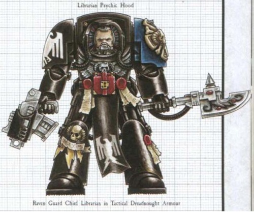

# 0251 首席智库员 Chief Librarian

精校状态：中文行文已逐段精校，部分术语仍为暂定

分类：通用概念 / 帝国 Imperium / 中央政务部 Adeptus Terra / 阿斯塔特修会 Adeptus Astartes

原文来源：https://www.bilibili.com/opus/1020226832169959449

原作者：帝国神选罐头

原文时间：2025年01月09日 07:21

[返回分类目录](目录.md) · [全书目录](../../目录.md)

原篇名：首席智库 Chief Librarian

<!-- A0251-B0001 -->
**英文原文**

The Chief Librarian is the strongest and most psychically attuned Librarian of a Space Marine Chapter.

<!-- /A0251-B0001 -->

<!-- A0251-B0002 -->

原译文

首席智库是星际战士战团中最强壮、最具灵能协调能力的智库。

**校订译文**

首席智库员是星际战士战团中力量最强、与灵能力量最为契合的智库员。

**校注：** strongest 此处为整体实力与灵能资质，不限于肉体强壮。Chief Librarian 采用官译中出现的首席智库员，见 GW-09/GW-10 第11页；官方第32/31页也见首席智库这一变体。

<!-- /A0251-B0002 -->

<!-- A0251-B0003 图片 -->

<!-- A0251-B0004 -->

原译文

Raven Guard Chief Librarian in Terminator armour 穿着终结者盔甲的暗鸦守卫首席智库

**校订译文**

Raven Guard Chief Librarian in Terminator armour 身穿终结者护甲的暗鸦守卫首席智库员

<!-- /A0251-B0004 -->

<!-- A0251-B0005 -->
**英文原文**

He is master of the Librarium and has full access to otherwise restricted parts of it that house the Chapter's most powerful and dangerous relics. His century-long studies and experience, gathered on thousands of battlefields, makes him a crucial advisor to his Chapter and its commanders.

<!-- /A0251-B0005 -->

<!-- A0251-B0006 -->

原译文

他是智库的主人，可以完全访问智库中其他受限制的部分，这些部分存放着本战团最强大、最危险的文物。他在数千个战场上积累了长达一个世纪的研究和经验，使他成为战团及其指挥官的重要顾问。

**校订译文**

他主管智库馆，能够进入平常禁止他人涉足的区域；那里收藏着战团最强大、也最危险的遗物。长达百年的研习，以及在数千处战场上积累的经验，使他成为战团及其指挥官不可或缺的顾问。

<!-- /A0251-B0006 -->

<!-- A0251-B0007 -->
**英文原文**

Chief Librarians often lead forces or assist the Chapter Master in battle while other Librarians aid company Captains. They also hold the overall responsibility for communications, as well as scrutinizing battle reports to provide recommendations for honour awards.

<!-- /A0251-B0007 -->

<!-- A0251-B0008 -->

原译文

首席智库经常在战斗中领导部队或协助战团长，而其他智库则协助连长。他们还全面负责沟通，审查战斗报告，为荣誉奖项提供建议。

**校订译文**

战斗中，首席智库员常亲自统率部队，或协助战团长；其他智库员则支援各连连长。首席智库员还统管通信，并审阅战报，为授予荣誉提出建议。

<!-- /A0251-B0008 -->

<!-- A0251-B0009 -->
## Notable Chief Librarians 著名首席智库员

原题：Notable Chief Librarians 著名首席智库

<!-- /A0251-B0009 -->

<!-- A0251-B0010 -->
**英文原文**

Ahzek Ahriman of the Thousand Sons

<!-- /A0251-B0010 -->

<!-- A0251-B0011 -->

原译文

千字的阿扎克·阿里曼

**校订译文**

千子的阿扎克·阿里曼

<!-- /A0251-B0011 -->

<!-- A0251-B0012 -->
**英文原文**

Aldrek of the Space Wolves

<!-- /A0251-B0012 -->

<!-- A0251-B0013 -->

原译文

太空野狼的阿德雷克

**校订译文**

太空野狼的阿德雷克

<!-- /A0251-B0013 -->

<!-- A0251-B0014 -->
**英文原文**

Azariah Kyras of the Blood Ravens

<!-- /A0251-B0014 -->

<!-- A0251-B0015 -->

原译文

血鸦的阿扎利亚·凯拉斯

**校订译文**

血鸦的亚撒利雅·凯拉斯

<!-- /A0251-B0015 -->

<!-- A0251-B0016 -->
**英文原文**

Jonah Orion of the Blood Ravens

<!-- /A0251-B0016 -->

<!-- A0251-B0017 -->

原译文

血鸦的约拿·奥利安

**校订译文**

血鸦的约拿·俄里翁

**校注：** 已核同一人物、组织、型号或事件，与全书核心术语及后续专篇统一；原译保留对照。

<!-- /A0251-B0017 -->

<!-- A0251-B0018 -->
**英文原文**

Azmachai of the Imperial Fists

<!-- /A0251-B0018 -->

<!-- A0251-B0019 -->

原译文

帝国之拳的阿兹玛凯

**校订译文**

帝国之拳的阿兹玛凯

<!-- /A0251-B0019 -->

<!-- A0251-B0020 -->
**英文原文**

Brin Maxen of the Storm Wardens

<!-- /A0251-B0020 -->

<!-- A0251-B0021 -->

原译文

风暴看守者的布林·马克森

**校订译文**

风暴看守者的布林·马克森

<!-- /A0251-B0021 -->

<!-- A0251-B0022 -->
**英文原文**

Eustace Mendoza of the Crimson Fists

<!-- /A0251-B0022 -->

<!-- A0251-B0023 -->

原译文

绯红之拳的尤斯塔斯·门多萨

**校订译文**

绯红之拳的尤斯塔斯·门多萨

<!-- /A0251-B0023 -->

<!-- A0251-B0024 -->
**英文原文**

Ezekiel of the Dark Angels

<!-- /A0251-B0024 -->

<!-- A0251-B0025 -->

原译文

黑暗天使的以西结

**校订译文**

黑暗天使的以西结

<!-- /A0251-B0025 -->

<!-- A0251-B0026 -->
**英文原文**

Fel Zharost of the Night Lords

<!-- /A0251-B0026 -->

<!-- A0251-B0027 -->

原译文

午夜领主的费尔·扎罗斯特

**校订译文**

午夜领主的费尔·扎罗斯特

<!-- /A0251-B0027 -->

<!-- A0251-B0028 -->
**英文原文**

Luciferus of the Flesh Tearers

<!-- /A0251-B0028 -->

<!-- A0251-B0029 -->

原译文

撕肉者的路西法

**校订译文**

撕肉者的路西法

<!-- /A0251-B0029 -->

<!-- A0251-B0030 -->
**英文原文**

Scaraban of the Flesh Eaters

<!-- /A0251-B0030 -->

<!-- A0251-B0031 -->

原译文

食肉者的斯卡拉班

**校订译文**

食肉者的斯卡拉班

<!-- /A0251-B0031 -->

<!-- A0251-B0032 -->
**英文原文**

Lydriik of the Iron Hands

<!-- /A0251-B0032 -->

<!-- A0251-B0033 -->

原译文

钢铁之手的林德里克

**校订译文**

钢铁之手的林德里克

<!-- /A0251-B0033 -->

<!-- A0251-B0034 -->
**英文原文**

Malandar Osrak of the Imperial Fists

<!-- /A0251-B0034 -->

<!-- A0251-B0035 -->

原译文

帝国之拳的马兰达尔·奥斯拉克

**校订译文**

帝国之拳的马兰达尔·奥斯拉克

<!-- /A0251-B0035 -->

<!-- A0251-B0036 -->
**英文原文**

Mathias Dee of the Fire Angels

<!-- /A0251-B0036 -->

<!-- A0251-B0037 -->

原译文

火焰天使的马蒂亚斯·迪

**校订译文**

火焰天使的马蒂亚斯·迪

<!-- /A0251-B0037 -->

<!-- A0251-B0038 -->
**英文原文**

Marest of the Blood Angels

<!-- /A0251-B0038 -->

<!-- A0251-B0039 -->

原译文

圣血天使的马雷斯特

**校订译文**

圣血天使的马雷斯特

<!-- /A0251-B0039 -->

<!-- A0251-B0040 -->
**英文原文**

Mercaeno of the Howling Griffons

<!-- /A0251-B0040 -->

<!-- A0251-B0041 -->

原译文

咆哮狮鹫的梅尔卡诺

**校订译文**

咆哮狮鹫的梅尔卡诺

<!-- /A0251-B0041 -->

<!-- A0251-B0042 -->
**英文原文**

Mephiston of the Blood Angels

<!-- /A0251-B0042 -->

<!-- A0251-B0043 -->

原译文

圣血天使的墨菲斯顿

**校订译文**

圣血天使的墨菲斯顿

<!-- /A0251-B0043 -->

<!-- A0251-B0044 -->
**英文原文**

Sevrin Loth of the Red Scorpions

<!-- /A0251-B0044 -->

<!-- A0251-B0045 -->

原译文

红蝎的塞夫林·洛特

**校订译文**

红蝎的塞弗林·罗斯

**校注：** 已核同一人物、组织、型号或事件，与全书核心术语及后续专篇统一；原译保留对照。

<!-- /A0251-B0045 -->

<!-- A0251-B0046 -->
**英文原文**

Te Kahurangi of the Carcharodons

<!-- /A0251-B0046 -->

<!-- A0251-B0047 -->

原译文

噬人鲨的特·卡胡拉吉

**校订译文**

噬人鲨的特·卡胡拉吉

<!-- /A0251-B0047 -->

<!-- A0251-B0048 -->
**英文原文**

Targutai Yesugei of the White Scars

<!-- /A0251-B0048 -->

<!-- A0251-B0049 -->

原译文

白色伤疤的塔里忽台·也速该

**校订译文**

白疤的塔里忽台·也速该

<!-- /A0251-B0049 -->

<!-- A0251-B0050 -->
**英文原文**

Saghari of the White Scars

<!-- /A0251-B0050 -->

<!-- A0251-B0051 -->

原译文

白色疤痕的萨哈里

**校订译文**

白疤的萨哈里

<!-- /A0251-B0051 -->

<!-- A0251-B0052 -->
**英文原文**

Valdar Aurikon of the Grey Knights

<!-- /A0251-B0052 -->

<!-- A0251-B0053 -->

原译文

灰骑士的瓦尔达·奥里肯

**校订译文**

灰骑士的瓦尔达尔·奥里康

**校注：** 已核同一人物、组织、型号或事件，与全书核心术语及后续专篇统一；原译保留对照。

<!-- /A0251-B0053 -->

<!-- A0251-B0054 -->
**英文原文**

Voldus of the Grey Knights

<!-- /A0251-B0054 -->

<!-- A0251-B0055 -->

原译文

灰骑士的沃尔达斯

**校订译文**

灰骑士的沃尔达斯

<!-- /A0251-B0055 -->

<!-- A0251-B0056 -->
**英文原文**

Varro Tigurius of the Ultramarines

<!-- /A0251-B0056 -->

<!-- A0251-B0057 -->

原译文

极限战士的瓦罗·狄格里斯

**校订译文**

极限战士的瓦罗·狄格里斯

<!-- /A0251-B0057 -->

<!-- A0251-B0058 -->
**英文原文**

Ares Ionnas of the Silver Templars

<!-- /A0251-B0058 -->

<!-- A0251-B0059 -->

原译文

银色圣堂的阿瑞斯·约纳斯

**校订译文**

银色圣堂的阿瑞斯·约纳斯

<!-- /A0251-B0059 -->

<!-- A0251-B0060 -->
**英文原文**

Vel'cona of the Salamanders

<!-- /A0251-B0060 -->

<!-- A0251-B0061 -->

原译文

火蜥蜴的维尔科纳

**校订译文**

火蜥蜴的维尔科纳

<!-- /A0251-B0061 -->

<!-- A0251-B0062 -->
**英文原文**

Kva of the Space Wolves

<!-- /A0251-B0062 -->

<!-- A0251-B0063 -->

原译文

太空野狼的卡瓦

**校订译文**

太空野狼的卡瓦

<!-- /A0251-B0063 -->

<!-- A0251-B0064 -->
**英文原文**

Xeros Darsway of the Imperial Fists

<!-- /A0251-B0064 -->

<!-- A0251-B0065 -->

原译文

帝国之拳的泽罗斯·达斯韦

**校订译文**

帝国之拳的泽罗斯·达斯韦

<!-- /A0251-B0065 -->

本篇核心术语与暂定项

以下列出本篇出现的英文原形及核心术语表用词。同形词可能指不同对象，具体词义以本篇正文和校注为准；单复数、别名和仅见于图注的名称可能尚未列入。完整候选见[术语表](../../术语表/双语术语候选.csv)。

| 英文 | 采用中文 | 状态 |
| --- | --- | --- |
| Blood Angels | 圣血天使 | 官方已核对 |
| Dark Angels | 黑暗天使 | 官方已核对 |
| Grey Knights | 灰骑士 | 官方已核对 |
| Space Wolves | 太空野狼 | 官方已核对 |
| Thousand Sons | 千子 | 官方已核对 |
| Librarian | 智库员 | 官方已核对 |
| Ultramarines | 极限战士 | 官方已核对 |
| Imperial Fists | 帝国之拳 | 暂定 |
| Azariah Kyras | 亚撒利雅·凯拉斯 | 暂定 |
| Blood Ravens | 血鸦 | 暂定 |
| Night Lords | 午夜领主 | 暂定·官方待核 |
| Iron Hands | 钢铁之手 | 暂定·官方待核 |
| Salamanders | 火蜥蜴 | 暂定·官方待核 |
| Targutai Yesugei | 塔里忽台·也速该 | 暂定·官方待核 |
| Chief Librarian | 首席智库员 | 暂定·官方待核 |
| Master | 导师（审判庭职衔）／舰务官（舰员职务） | 语境定译·官方待核 |
| Librarium | 智库馆 | 暂定·官方待核 |
| White Scars | 白疤 | 官方已核 |
| Scars | 伤疤 | 暂定·官方待核 |
| Fel Zharost | 费尔·扎罗斯特 | 暂定·官方待核 |
| Mathias | 马蒂亚斯 | 暂定·官方待核 |
| Crimson Fists | 绯红之拳 | 暂定·官方待核 |
| Ahzek Ahriman | 阿扎克·阿里曼 | 暂定·官方待核 |
| Space Marine | 星际战士 | 暂定·官方待核 |
| Chapter | 战团 | 暂定·官方待核 |
| Chapter Master | 战团长 | 暂定·官方待核 |
| Varro Tigurius | 瓦罗·狄格里斯 | 暂定·官方待核 |
| Ezekiel | 以西结 | 暂定·官方待核 |
| Mephiston | 墨菲斯顿 | 暂定·官方待核 |
| Flesh Tearers | 撕肉者 | 暂定·官方待核 |
| Red Scorpions | 红蝎 | 暂定·官方待核 |
| Fire Angels | 火焰天使 | 暂定·官方待核 |
| Silver Templars | 银色圣堂 | 暂定·官方待核 |
| Carcharodons | 噬人鲨 | 暂定·官方待核 |
| Flesh Eaters | 食肉者 | 暂定·官方待核 |
| Howling Griffons | 咆哮狮鹫 | 暂定·官方待核 |
| Storm Wardens | 风暴看守者 | 暂定·官方待核 |
| Sevrin Loth | 塞弗林·罗斯 | 暂定·官方待核 |
| Luciferus | 路西法 | 暂定·官方待核 |
| Kva | 卡瓦 | 暂定·官方待核 |
| Scaraban | 斯卡拉班 | 暂定·官方待核 |
| Lydriik | 林德里克 | 暂定·官方待核 |
| Mathias Dee | 马蒂亚斯·迪 | 暂定·官方待核 |
| The Dark | 《黑暗》 | 暂定·官方待核 |
| The Blood | 鲜血 | 暂定·官方待核 |
| Valdar Aurikon | 瓦尔达尔·奥里康 | 暂定·官方待核 |
| Jonah Orion | 约拿·俄里翁 | 暂定·官方待核 |
| Marest | 马雷斯特 | 暂定·官方待核 |

