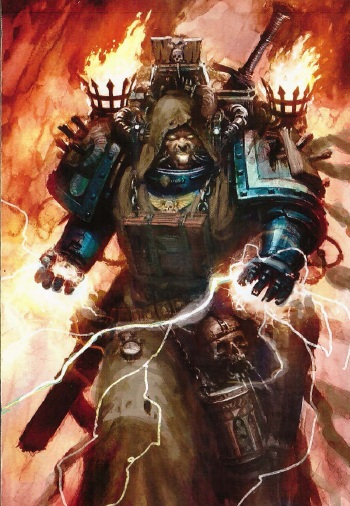
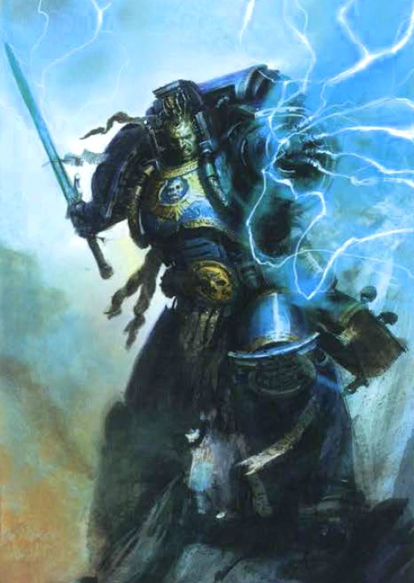
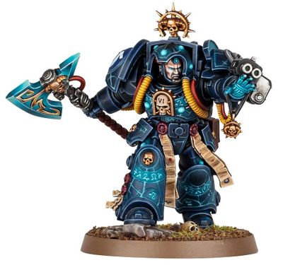
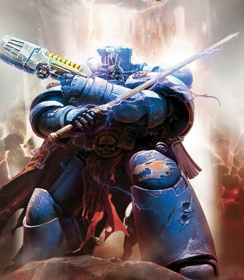
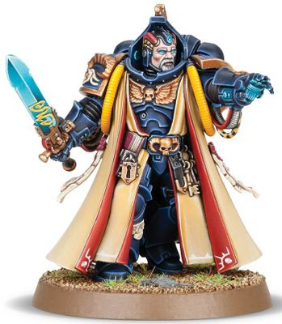
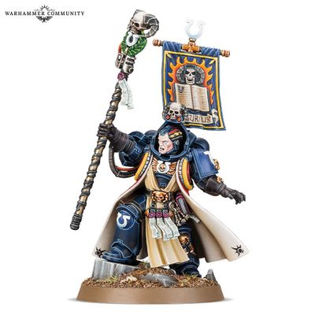

# 0252 智库员 Librarian

精校状态：中文行文已逐段精校，部分术语仍为暂定

分类：通用概念 / 帝国 Imperium / 中央政务部 Adeptus Terra / 阿斯塔特修会 Adeptus Astartes

原文来源：https://www.bilibili.com/opus/1025820378525597703

原作者：帝国神选罐头

原文时间：2025年01月24日 09:06

[返回分类目录](目录.md) · [全书目录](../../目录.md)

原篇名：智库 Librarian

<!-- A0252-B0001 -->
**英文原文**

Librarians are Space Marine psykers. They fulfill several important specialist roles in a Chapter: off the battlefield they are responsible for interstellar psychic communications. In battle they utilise their abilities as powerful psykers. They are among the most knowledgeable of the Chapter's history and traditions.

<!-- /A0252-B0001 -->

<!-- A0252-B0002 -->

原译文

智库是星际战士的灵能者。他们在一个战团中承担着几个重要的专业角色：在战场之外，他们负责星际间灵能通讯。在战斗中，他们利用自己作为强大的灵能者的能力。他们是最了解战团历史和传统的人之一。

**校订译文**

智库员是星际战士中的灵能者，在战团中承担多项重要的专门职责。平时，他们负责星际灵能通信；作战时，则以强大的灵能投入战斗。他们也是战团中最熟悉自身历史与传统的一群人。

<!-- /A0252-B0002 -->

<!-- A0252-B0003 图片 -->

<!-- A0252-B0004 -->

原译文

Dark Angels Librarian 黑暗天使智库

**校订译文**

Dark Angels Librarian 黑暗天使智库员

<!-- /A0252-B0004 -->

<!-- A0252-B0005 -->
## History 历史

<!-- /A0252-B0005 -->

<!-- A0252-B0006 -->
**英文原文**

The earliest known Space Marine battle Psykers were the Host of Pentacles of the First Legion during the Unification Wars. However these warriors suffered from many grim calamities and in time the project was abandoned.

<!-- /A0252-B0006 -->

<!-- A0252-B0007 -->

原译文

已知最早的星际战士战斗战斗灵能者是统一战争期间第一军团的五芒天军。然而，这些战士遭受了许多可怕的灾难，最终该项目被放弃了。

**校订译文**

已知最早的星际战士战斗灵能者，是统一战争期间第一军团的“五芒天军”（Host of Pentacles）。然而，这些战士接连遭逢可怕的灾难，该计划最终被放弃。

<!-- /A0252-B0007 -->

<!-- A0252-B0008 -->
**英文原文**

Space Marine Battle Psykers reappeared during the Great Crusade. The early history of the Librarians is chequered with mistrust and intrigue. Initially the Legions made no use of psykers within their ranks, however Magnus the Red, Sanguinius, and Jaghatai Khan proposed the Librarian program, allowing the Thousand Sons to train and create Librarius departments in a variety of Legions. Librarians were favoured for use or have been seen within the White Scars, Night Lords, Ultramarines, Thousand Sons, Word Bearers, Salamanders, Alpha Legion,Dark Angels,World Eaters,and Raven Guard Legions. Some of the Primarchs were against using psykers in the Space Marine Legions at all, or at least within their own Legions. Legions that did not favour their use or employ them were the Iron Warriors, Space Wolves, Imperial Fists, Iron Hands, and Death Guard. The Space Wolves insisted that their Librarian equivalents, known as Rune Priests, were not Psykers in that they drew their powers from the natural energy of Fenris as opposed to the Warp.

<!-- /A0252-B0008 -->

<!-- A0252-B0009 -->

原译文

星际战士战斗灵能者在大远征期间重新出现。智库的早期历史充满了不信任和阴谋。起初，军团在他们的队伍中没有使用灵能者，但赤红之马格努斯、圣吉列斯和察合台可汗提出了智库计划，允许千子军团在各军团中培训和创建智库部门。智库在白色疤痕、午夜领主、极限战士、千子、怀言者、火蜥蜴、阿尔法军团、黑暗天使、吞世者和暗鸦守卫军团中受到青睐或被注视。一些原体从根本上反对在星际战士中使用灵能者，或者至少在他们自己的军团中。不赞成使用或应用它们的军团是钢铁勇士、太空野狼、帝国之拳、钢铁之手和死亡守卫。太空野狼坚持认为，他们的智库同位者，即符文牧师，不是灵能者，因为他们的力量来自芬里斯的自然能量，而不是亚空间。

**校订译文**

大远征期间，星际战士战斗灵能者再次出现。智库员的早期历史交织着猜忌与阴谋：起初，各军团都不在队伍中使用灵能者，但红魔马格努斯、圣吉列斯与察合台可汗提出了智库员计划，使千子得以为多个军团培训人员、建立智库部门。白疤、午夜领主、极限战士、千子、怀言者、火蜥蜴、阿尔法军团、黑暗天使、吞世者及暗鸦守卫，都曾青睐或使用智库员。另一些原体则反对军团使用灵能者，至少不愿在自己的军团中采用。不赞成或没有使用智库员的军团，包括钢铁勇士、太空野狼、帝国之拳、钢铁之手和死亡守卫。太空野狼坚称，承担同类职责的“符文牧师”并非灵能者，因为他们的力量来自芬里斯的自然能量，而非亚空间。

<!-- /A0252-B0009 -->

<!-- A0252-B0010 -->
**英文原文**

The first Librarian experiments were sanctioned by the Emperor. They were seen as a good way of controlling the random development of psychic powers among Space Marines. Magnus and his fellow pro-psyker Primarchs such as Sanguinius, Jaghatai Khan, and Fulgrim then asked the Emperor to allow recruitment of psychic individuals into the ranks of the legions. The Emperor accepted, and the Librarians became some of the most loyal troops to the Emperor. The debate over Librarians came to a head when Mortarion, Leman Russ and others accused Magnus of sorcery. The Emperor summoned a meeting at Nikaea in an effort to provide a final resolution to the Librarian issue.

<!-- /A0252-B0010 -->

<!-- A0252-B0011 -->

原译文

第一次智库实验得到了帝皇的批准。它们被视为控制星际战士灵能力量随机发展的好方法。马格努斯和他的亲灵能者原体同僚，如圣吉列斯、察合台可汗和福格瑞姆，随后要求帝皇允许招募灵能者加入军团。帝皇接受了，智库成为了帝皇最忠诚的军队之一。当莫塔里安、黎曼·鲁斯和其他人指责马格努斯使用巫术时，关于智库的争论达到了高潮。帝皇在尼凯亚召集了一次会议，试图为智库问题提供最终解决方案。

**校订译文**

最初的智库员试验得到了帝皇批准，被视为控制星际战士中不定期出现的灵能天赋的有效手段。随后，马格努斯与圣吉列斯、察合台可汗、福格瑞姆等支持灵能者的原体，又请求帝皇允许直接招募具有灵能天赋的人加入军团。帝皇同意了，智库员也成为他最忠诚的战士之一。后来，莫塔里安、黎曼·鲁斯等人指控马格努斯施行巫术，使围绕智库员的争论达到顶点。帝皇遂在尼凯亚召集会议，希望为此作出最终裁决。

<!-- /A0252-B0011 -->

<!-- A0252-B0012 -->
**英文原文**

The Emperor's decree following the Council of Nikaea banned the use of psychic powers, demanding the systematic dismantling of all Legion's psychic corps and redistribute them back into the battle companies as standard troops. Further, the Emperor threatened any who contravened his order with heavy censure and summary destruction. This ultimately culminated in the infamous Burning of Prospero and the destruction of much of the Thousand Sons by the Space Wolves at the onset of the Horus Heresy.

<!-- /A0252-B0012 -->

<!-- A0252-B0013 -->

原译文

尼凯亚会议后，帝皇颁布法令禁止使用灵能力量，要求有计划地解散所有军团的灵能部队，并将其作为标准部队重新分配到战斗连中。此外，帝皇威胁任何违反他的命令的人，严厉谴责并立即销毁。这最终导致了臭名昭著的普罗斯佩罗之焚，以及在荷鲁斯叛乱开始时，太空野狼摧毁了千子的大部分。

**校订译文**

尼凯亚会议之后，帝皇下令禁止使用灵能，要求全面解散各军团的灵能部队，将其成员重新编入战斗连，作为普通战士服役。他还警告，任何违令者都将遭到严惩，甚至被当场消灭。这一系列事态最终演变为臭名昭著的普罗斯佩罗之焚：荷鲁斯之乱初起时，太空野狼摧毁了千子的绝大部分力量。

<!-- /A0252-B0013 -->

<!-- A0252-B0014 -->
**英文原文**

As the Heresy ground on it became clear that in order to combat the traitors and their dark sorcery that the loyalists would need warp lore of their own. To that end, most of the loyalist Primarchs such as Roboute Guilliman, Sanguinius, Jaghatai Khan, Rogal Dorn, Corax, and Lion El'Jonson all technically defied the Council of Nikaea and reestablished the use of Librarians by the time of the Siege of Terra.

<!-- /A0252-B0014 -->

<!-- A0252-B0015 -->

原译文

随着叛乱势力的壮大，很明显，为了打击叛徒及其黑暗巫术，忠诚派需要自己的亚空间知识。为此，大多数忠诚的原体，如罗伯特·基里曼、圣吉列斯、察合台可汗、罗格·多恩、科拉克斯和莱昂·艾尔庄森，都在技术上无视了尼凯亚会议，并在泰拉围城时重新确立了智库的使用。

**校订译文**

随着荷鲁斯之乱持续，忠诚派逐渐意识到，要对抗叛军及其黑暗巫术，自己也必须掌握亚空间知识。因此，在泰拉围城之前，罗保特·基里曼、圣吉列斯、察合台可汗、罗格·多恩、科拉克斯与莱昂·艾尔’庄森等多数忠诚派原体，都已恢复智库员的使用；严格说来，这违反了尼凯亚会议的禁令。

<!-- /A0252-B0015 -->

<!-- A0252-B0016 -->
**英文原文**

Following the Heresy, the use of Librarians was recognized as vital in order to combat the perils of Chaos and Librarius' were maintained by the new loyalist Chapters as part of Guilliman's Codex Astartes.

<!-- /A0252-B0016 -->

<!-- A0252-B0017 -->

原译文

叛乱之后，智库的使用被认为对于对抗混沌的危险至关重要，新的忠诚派战团将智库视为基利曼阿斯塔特圣典的一部分。

**校订译文**

荷鲁斯之乱结束后，智库员被公认为抵御混沌威胁的关键力量。基里曼的《阿斯塔特圣典》为其确立了位置，新成立的忠诚派战团也据此保留智库机构。

<!-- /A0252-B0017 -->

<!-- A0252-B0018 -->
## Training 训练

<!-- /A0252-B0018 -->

<!-- A0252-B0019 -->
**英文原文**

All potential recruits into a Chapter are scrutinised by Librarians for psychic ability. Those with psychic powers undergo judgment that divides them into those who will join the Chapter as Librarians, and those who are so weak in power or character that they would present a danger. Worthy psychic candidates are passed on to the chapter Librarium for training. The rate of attrition is the greatest for psychically gifted candidates, as they must not only be strong enough to survive the training that the normal candidate must undergo, but possess the mental strength to endure the shaping of their minds and to fend off the daemons and entities of the Warp who see the strong form and mind of a Librarian as a great prize.

<!-- /A0252-B0019 -->

<!-- A0252-B0020 -->

原译文

智库会仔细审查一个战团的所有潜在新成员的灵能能力。那些拥有灵能能力的人会接受判断，将他们分为两类：一类是作为智库加入本战团的人，另一类是力量或性格如此软弱，以至于会构成危险的人。有价值的灵能候选人被送往智库馆进行培训。对于有灵能天赋的候选人来说，损耗率是最高的，因为他们不仅必须足够强壮，能够经受住正常候选人必须接受的训练，而且必须拥有足够的灵能力量，能够忍受塑造自己的思想，抵御那些将智库的强大形态和思想视为最好奖励的亚空间恶魔和实体。

**校订译文**

战团的所有潜在新兵，都要接受智库员检查，以确定是否具有灵能天赋。对显露天赋的人，还须进一步评判：合格者可以成为智库员；力量或意志过于薄弱、可能构成危险者，则不被接纳。通过评判的候选人会被送入战团智库馆训练。灵能候选人的损耗率最高，因为他们不仅要有足够强健的身体，熬过普通候选人必须经历的训练，还要具备坚韧的心志，承受对心智的塑造，抵挡亚空间恶魔与其他实体的侵扰——在这些存在眼中，智库员强大的肉身与心灵，是极有价值的猎物。

<!-- /A0252-B0020 -->

<!-- A0252-B0021 图片 -->

<!-- A0252-B0022 -->

原译文

Psychic lightning bolts from an Ultramarines Librarian 极限战士智库发射灵能闪电

**校订译文**

Psychic lightning bolts from an Ultramarines Librarian 极限战士智库员释放灵能闪电

<!-- /A0252-B0022 -->

<!-- A0252-B0023 -->
**英文原文**

During their training they must hone their psychic power as well as gain some measure of protection from the predators of the warp. The greatest danger psyker recruits face is the loss of their very sanity.

<!-- /A0252-B0023 -->

<!-- A0252-B0024 -->

原译文

在训练过程中，他们必须磨练自己的灵能力量，并从亚空间的捕食者那里获得一定程度的保护。灵能者新兵面临的最大危险是失去理智。

**校订译文**

训练中，他们既要磨炼灵能力量，也要学会保护自己，抵御亚空间中的掠食者。灵能新兵面临的最大危险，是彻底丧失理智。

<!-- /A0252-B0024 -->

<!-- A0252-B0025 -->
## Disciplines 灵能学派

原题：Disciplines 异能

<!-- /A0252-B0025 -->

<!-- A0252-B0026 -->
**英文原文**

There are four primary psychic disciplines mastered by Space Marine Librarians.

<!-- /A0252-B0026 -->

<!-- A0252-B0027 -->

原译文

星际战士智库掌握了四种主要的灵能学派。

**校订译文**

星际战士智库员掌握的主要灵能学派有四种：

**校注：** 四种主要学派是本段所采用的分类框架，不据此删除第1篇列出的其他版本或战团学派。

<!-- /A0252-B0027 -->

<!-- A0252-B0028 -->
**英文原文**

Librarius - Specialize in researching ancient psychic lore, combating the Immaterium, mental defenses, and severing the connections of other psykers.

<!-- /A0252-B0028 -->

<!-- A0252-B0029 -->

原译文

智库法术 - 专门研究古代灵能知识，对抗亚空间，心灵防御，切断其他灵能者者的联系。

**校订译文**

智库学派——专门研究古老灵能知识、对抗非物质界、建立心智防御，以及切断其他灵能者的联系。

**校注：** Librarius 在此明确是学派名，译作智库学派；其他段落中同词指战团机构时译作智库。

<!-- /A0252-B0029 -->

<!-- A0252-B0030 -->
**英文原文**

Technomancy - Enables the user to influence a targets Machine Spirit or otherwise manipulate machinery. The psyker reaches into the workings of his target, subverting its vital energies to turn guns on their owners or cause tanks to roll to a shuddering halt. The power to destroy can also be turned to more benign ends, and Technomancy is equally effective in mending ailing machine spirits, readying them for war once more. Even fortifications can be targeted.

<!-- /A0252-B0030 -->

<!-- A0252-B0031 -->

原译文

科技法术 - 使使用者能够影响目标机魂或以其他方式操纵机机械。灵能者深入目标的运作，破坏其重要能源，向其主人开火或使坦克颤抖停止。毁灭的力量也可以转化为更温和的目的，科技法术在修复生病的机魂方面同样有效，使它们再次为战争做好准备。甚至防御工事也可以成为目标。

**校订译文**

科技学派——影响目标的机魂，或以其他方式操纵机械。灵能者深入机械的运行机制，扰乱其中的关键能量，使枪炮倒戈攻击主人，或让坦克在剧烈震颤中停摆。这种力量也能用于修复受损的机魂，使机器重新投入战争。甚至防御工事也可以成为目标。

<!-- /A0252-B0031 -->

<!-- A0252-B0032 -->
**英文原文**

Fulmination - Enables the user to manipulate warp-spawned lightning. This allows abilities from emitting simple electric projectiles and anti-daemonic wardings to teleportation.

<!-- /A0252-B0032 -->

<!-- A0252-B0033 -->

原译文

爆发法术 - 使使用者能够操纵亚空间产生的闪电。这允许从发射简单的闪电和反恶魔保护到传送的能力。

**校订译文**

雷霆学派——操纵亚空间生成的闪电，既能释放电光弹、建立抵御恶魔的防护，也能实现传送。

<!-- /A0252-B0033 -->

<!-- A0252-B0034 -->
**英文原文**

Geokinesis - Allows the user to manipulate the very ground and earth itself.

<!-- /A0252-B0034 -->

<!-- A0252-B0035 -->

原译文

控地法术 - 允许使用者操纵地面和星球本身

**校订译文**

控地学派——操纵脚下的大地与土石。

<!-- /A0252-B0035 -->

<!-- A0252-B0036 -->
## Role 职责

原题：Role 角色

<!-- /A0252-B0036 -->

<!-- A0252-B0037 -->
**英文原文**

Once a psyker has completed his training, he will be allowed to join the Librarius as a Lexicanium and can then rise through the ranks, becoming a Codicier, Epistolary and eventually Chief Librarian. His duties include interstellar communication and screening potential recruits for psychic abilities.

<!-- /A0252-B0037 -->

<!-- A0252-B0038 -->

原译文

一旦灵能者完成了训练，他将被允许加入智库馆作位编修员，然后可以晋升为典记员、星语官，最终成为首席智库。他的职责包括星际通讯和筛选潜在的新兵的灵能能力。

**校订译文**

完成训练后，灵能者便能以“编修员”身份加入智库，再逐级晋升为典记员、星语官，最终成为首席智库员。他们的职责包括星际通信，以及筛查新兵是否具有灵能天赋。

<!-- /A0252-B0038 -->

<!-- A0252-B0039 -->
**英文原文**

Librarians are often treated with distrust due to their nature. Marines are taught to hate the deviant and abnormal, particularly mutants and those with psychic powers. This creates a gulf between the Librarians and the rest of the chapter brethren, though the powers they can bring to bear on the battlefield makes them always welcome in combat.

<!-- /A0252-B0039 -->

<!-- A0252-B0040 -->

原译文

由于图书馆员的天性，他们经常不受到信任。星际战士被教导要憎恨异常和反常的人，尤其是变种人和具有灵能能力的人。这在智库和本战团其他成员之间造成了鸿沟，尽管他们在战场上可以发挥的力量使他们在战斗中始终受到欢迎。

**校订译文**

智库员常因自身特质而受到猜忌。星际战士被教导要憎恨偏离常态的存在，尤其是变种人与灵能者，这在智库员和其他战团兄弟之间造成了隔阂。不过，他们能在战场上发挥的强大力量，又使他们成为战斗中备受欢迎的同伴。

<!-- /A0252-B0040 -->

<!-- A0252-B0041 -->
**英文原文**

On the battlefield, Librarian psychic powers often manifest in useful, and often destructive, ways. These can include anything from projecting energy bolts to erecting powerful protective fields. The more powerful Librarians tend to use their powers in more subtle ways, stepping out of time for a moment to anticipate their enemy's next move or redirecting bullets away from friendly targets. To aid them in using these powers, and protecting themselves, Librarians wear psychic hoods. These devices incorporate psychically-nullifying crystals which provide defence against enemy psychic attacks. They are often armed with force weapons, which only Librarians and other psykers can use to full effect, channelling their powers through the weapon.

<!-- /A0252-B0041 -->

<!-- A0252-B0042 -->

原译文

在战场上，智库的灵能力量往往以有用且具有破坏性的方式表现出来。这些可以包括从发射能量闪电到建立强大的保护立场的任何事情。更强大的智库倾向于以更微妙的方式使用他们的力量，超越时间来预测敌人的下一步行动，或者将子弹从友军目标上转移开。为了帮助他们使用这些力量并保护自己，智库戴着灵能头箍。这些装置结合了灵能免疫晶体，可以防御敌人的灵能攻击。他们通常配备有灵能武器，只有智库和其他灵能者才能充分利用这些武器，通过武器传递他们的力量。

**校订译文**

战场上，智库员能以多种实用、且往往极具破坏力的方式运用灵能，从投射能量束，到建立强大的防护力场，不一而足。更强大的智库员会采用更精妙的手段，例如短暂脱离时间流，预判敌人的下一步行动，或让射向友军的子弹偏转。为了辅助施法并保护自身，他们佩戴灵能兜帽；其中的灵能抑制晶体能够抵御敌方灵能攻击。智库员还常使用灵能武器，将自身力量灌注其中。只有智库员等灵能者，才能完全发挥这类武器的威力。

<!-- /A0252-B0042 -->

<!-- A0252-B0043 -->
## Heraldry 纹章

<!-- /A0252-B0043 -->

<!-- A0252-B0044 -->
**英文原文**

According to the guidelines of the Codex Astartes, the armour of Librarians is blue with gold and yellow highlights, regardless of chapter colours. The left shoulder plate of the Librarian's armour displays the chapter symbol in the case of power armour; for Terminator armoured Librarians, the chapter symbol is displayed on the right shoulder armour (leaving the Crux Terminatus for the left). The free shoulder pad displays the Librarius symbol, its exact form denoting the rank of the Librarian. Librarians wear golden yellow tabards which are edged with black patterns, the complexity of the pattern denoting the Librarian's rank.

<!-- /A0252-B0044 -->

<!-- A0252-B0045 -->

原译文

根据阿斯塔特圣典的指导方针，智库的盔甲是蓝色，带有金色和黄色亮点，无论战团颜色如何。智库盔甲的左肩甲在动力盔甲的情况下显示了战团标志；对于终结者盔甲智库来说，战团标志显示在右肩甲上（将终结者十字章留在左边）。任意的护肩上显示着智库标志，其确切形式表示智库的级别。智库穿着金黄色的战袍，边缘有黑色图案，图案的复杂性表示智库的级别。

**校订译文**

按照《阿斯塔特圣典》的规范，无论所属战团采用何种配色，智库员的护甲都应以蓝色为主，辅以金色和黄色饰纹。穿动力甲时，战团徽记位于左肩甲；穿终结者护甲时，徽记则在右肩甲，左肩留给终结者十字章。未绘战团徽记的一侧肩甲上，还会出现智库标志，其具体形式表明佩戴者的级别。智库员也穿着金黄色罩袍，袍缘饰有黑色花纹；纹样越复杂，代表的级别也越高。

**校注：** 原文在终结者肩甲、战团徽记、十字章与智库标志的分配上不够明确；译文保留其叙述，没有据此绘制强制适用于所有模型的纹章规范。

<!-- /A0252-B0045 -->

<!-- A0252-B0046 图片 -->

<!-- A0252-B0047 -->

原译文

Librarian in Terminator Armour 终结者盔甲智库

**校订译文**

Librarian in Terminator Armour 身穿终结者护甲的智库员

<!-- /A0252-B0047 -->

<!-- A0252-B0048 -->
**英文原文**

Their equipment is often heavily ornamented by artificers of the chapter due to the heroism and valour shown by the Librarians, making every piece individual.

<!-- /A0252-B0048 -->

<!-- A0252-B0049 -->

原译文

由于智库表现出的英勇表现和勇气，他们的装备经常被战团的工匠精心装饰，使每一件作品都独具特色。

**校订译文**

为彰显智库员的英勇功绩，战团工匠常在他们的装备上施以精美装饰，使每件装备都独具特色。

<!-- /A0252-B0049 -->

<!-- A0252-B0050 -->
**英文原文**

It it known that many Librarians personalise their colours, like only having their helmet and right pauldron in blue, having their left arm in their chapter colour, only having their right pauldron and arm in blue, splitting their armour colours with the upper part in blue and the lower part in their Chapter colour, only their Psychic Hood in blue, only their left pauldron in blue, both pauldrons in their Chapter's colours, backpack and both pauldrons in their Chapter's colours and some Librarians keep fully to their Chapter's standard colours, while other are fully blue without any of their Chapter's colour on their armour.

<!-- /A0252-B0050 -->

<!-- A0252-B0051 -->

原译文

众所周知，许多智库个性化他们的颜色，比如只有蓝色的头盔和右肩甲，左臂是本战团的颜色；只有蓝色的右护肩和手臂；将盔甲的颜色分开，上半部分是蓝色的，下半部分是本战团颜色；只有蓝色的灵能头箍；只有蓝色的左肩甲；两个肩甲都是本战团颜色；背包和两个肩甲都是本战团颜色，一些智库完全保持本战团的标准颜色，而另一些智库则是全蓝色的，盔甲上没有任何本战团的颜色。

**校订译文**

许多智库员也会自行调整配色：有人只把头盔与右肩甲涂成蓝色，左臂保留战团色；有人仅将右肩甲和右臂涂蓝；有人让护甲上半身呈蓝色，下半身使用战团色；也有人只将灵能兜帽或左肩甲涂蓝。另有一些人让两侧肩甲，或背包连同两侧肩甲，都保留战团配色。有的智库员完全沿用战团的标准颜色，也有的从头到脚全是蓝色，护甲上完全不出现战团色。

<!-- /A0252-B0051 -->

<!-- A0252-B0052 -->
**英文原文**

Many Librarian seconded to the Deathwatch keep their knees, backpack and armour collar in Librarian blue, with the rest of the armour in Deathwatch black.

<!-- /A0252-B0052 -->

<!-- A0252-B0053 -->

原译文

许多借调到死亡守望的智库将膝盖、背包和盔甲领都换成了智库蓝，其余的盔甲部分则换成了死亡守望黑。

**校订译文**

许多借调到死亡守望的智库员，会让膝甲、背包与护甲领圈保留智库蓝，其余部分则涂成死亡守望的黑色。

<!-- /A0252-B0053 -->

<!-- A0252-B0054 -->
## Chapter Variations 各战团的不同做法

原题：Chapter Variations 战团变体

<!-- /A0252-B0054 -->

<!-- A0252-B0055 -->
**英文原文**

Several Chapters have different names for Librarians, who vary subtly in their methods and their role in the Chapter hierarchies.

<!-- /A0252-B0055 -->

<!-- A0252-B0056 -->

原译文

几个战团对智库有不同的称呼，他们的条理和在战团等级结构中的角色也有微妙的差异。

**校订译文**

一些战团对智库员另有称呼；这些人的行事方式，以及在战团等级体系中的职责，也略有差异。

<!-- /A0252-B0056 -->

<!-- A0252-B0057 -->
**英文原文**

The Rune Priests of the Space Wolves, maintain that their psychic powers derives from the animistic spirits of Fenris, rather than from the Warp.

<!-- /A0252-B0057 -->

<!-- A0252-B0058 -->

原译文

太空野狼的符文牧师认为，他们的灵能力量来自芬里斯的万物之灵，而不是来自亚空间。

**校订译文**

太空野狼的符文牧师坚持认为，他们的灵能来自芬里斯的万物之灵，而非亚空间。

<!-- /A0252-B0058 -->

<!-- A0252-B0059 -->
**英文原文**

The Stormseers of the White Scars.

<!-- /A0252-B0059 -->

<!-- A0252-B0060 -->

原译文

白色伤疤的风暴先知。

**校订译文**

白疤称其为风暴先知。

<!-- /A0252-B0060 -->

<!-- A0252-B0061 图片 -->

<!-- A0252-B0062 -->

原译文

White Scars Stormseer 白色疤痕风暴先知

**校订译文**

White Scars Stormseer 白疤风暴先知

<!-- /A0252-B0062 -->

<!-- A0252-B0063 -->
**英文原文**

The Dark Angels' Librarians play a similar role to those of other chapters, but they also watch over the dungeons of the Rock and aid Interrogator-Chaplains in extracting confessions from the Fallen by reducing their mental barriers and gathering the truth from the web of lies they speak.

<!-- /A0252-B0063 -->

<!-- A0252-B0064 -->

原译文

黑暗天使的智库承担着与其他战团类似的角色，但他们也监视着巨石的地牢，并通过减少心灵障碍和从他们所说的谎言中收集真相来帮助审讯牧师从堕天使那里提取供词。

**校订译文**

黑暗天使智库员的职责与其他战团大致相同，但他们还负责看守巨石要塞的地牢，并协助审讯牧师逼取堕天使的供词。他们会削弱囚徒的心智屏障，从层层谎言中发掘真相。

<!-- /A0252-B0064 -->

<!-- A0252-B0065 -->
**英文原文**

The Emperor's Spears group together their Librarians with their Chaplains, Techmarines and Apothecaries under the title Druids, who all have black armour. These warrior-priests each stand ready to harvest the gene-seed of fallen brothers, as well as performing their own duties based on their specialist skills and esoteric abilities.

<!-- /A0252-B0065 -->

<!-- A0252-B0066 -->

原译文

帝皇之矛将他们的智库与他们的牧师、技术军士和药剂师整合在一起，统称为德鲁伊，他们都穿着黑色盔甲。这些战斗牧师随时准备收获牺牲兄弟的基因种子，并根据他们的专业技能和深奥能力履行自己的职责。

**校订译文**

帝皇之矛把智库员、牧师、技术军士和药剂师统称为“德鲁伊”，这些人都穿黑色护甲。他们既凭各自的专门技艺与秘传能力履行本职，也随时准备回收阵亡兄弟的基因种子。

<!-- /A0252-B0066 -->

<!-- A0252-B0067 -->

原译文

Grey Knights Librarian 灰骑士智库

**校订译文**

Grey Knights Librarian 灰骑士智库员

<!-- /A0252-B0067 -->

<!-- A0252-B0068 -->
**英文原文**

Some chapters do not use Librarians at all, such as the Black Templars and the Marines Malevolent. Others revere Librarians greatly:

<!-- /A0252-B0068 -->

<!-- A0252-B0069 -->

原译文

有些战团根本不使用智库，比如黑色圣堂和恶意战士。其他人非常尊敬智库：

**校订译文**

黑色圣堂、恶意战士等战团完全不使用智库员。另一些战团则对他们格外尊崇：

<!-- /A0252-B0069 -->

<!-- A0252-B0070 -->
**英文原文**

The Silver Skulls view their Librarians, known as Prognosticators, as conduits of the Emperor's divine will, and will not go into battle without one taking the auguries and pronouncing them favourable;

<!-- /A0252-B0070 -->

<!-- A0252-B0071 -->

原译文

银色颅骨认为他们的智库，即预言者，是帝皇神圣意志的渠道，如果没有人接受预兆并宣布有利，他们就不会参战；

**校订译文**

银色颅骨称智库员为“预言者”，认为他们传达着帝皇的神圣意志。除非预言者完成占卜，并宣告征兆有利，否则战团不会出战。

<!-- /A0252-B0071 -->

<!-- A0252-B0072 -->
**英文原文**

The Blood Ravens use a higher proportion of Librarians than many other chapters, and several of their past Chapter Masters, including Azariah Vidya and Azariah Kyras, have combined the ranks of Chapter Master and Chief Librarian.

<!-- /A0252-B0072 -->

<!-- A0252-B0073 -->

原译文

血鸦使用的智库比例高于许多其他战团，他们过去的几位战团长，包括阿扎利亚·维迪亚和阿扎利亚·凯拉斯，都将战团长和首席智库的职位结合在一起。

**校订译文**

血鸦中智库员所占比例，比许多其他战团都高。过去数位战团长，包括亚撒利雅·维迪亚与亚撒利雅·凯拉斯，还同时兼任首席智库员。

<!-- /A0252-B0073 -->

<!-- A0252-B0074 -->
## Ranks 等级

<!-- /A0252-B0074 -->

<!-- A0252-B0075 -->

原译文

Lexicanium 编修员

**校订译文**

Lexicanium 编修员

<!-- /A0252-B0075 -->

<!-- A0252-B0076 -->

原译文

Codicier 典记员

**校订译文**

Codicier 典记员

<!-- /A0252-B0076 -->

<!-- A0252-B0077 -->

原译文

Epistolary 星语官

**校订译文**

Epistolary 星语官

<!-- /A0252-B0077 -->

<!-- A0252-B0078 -->

原译文

Chief Librarian 首席智库

**校订译文**

Chief Librarian 首席智库员

<!-- /A0252-B0078 -->

<!-- A0252-B0079 图片 -->

<!-- A0252-B0080 -->

原译文

Salamanders Librarian 火蜥蜴智库

**校订译文**

Salamanders Librarian 火蜥蜴智库员

<!-- /A0252-B0080 -->

<!-- A0252-B0081 -->
## Primaris Librarians 原铸智库员

原题：Primaris Librarians 原铸智库

<!-- /A0252-B0081 -->

<!-- A0252-B0082 -->
**英文原文**

Librarians also exist among the new Primaris Space Marines. Primaris Chapters seem to use the same ranks as their standard counterparts.

<!-- /A0252-B0082 -->

<!-- A0252-B0083 -->

原译文

智库也存在于新的原铸星际战士中。原铸战团似乎使用与标准战团相同的等级。

**校订译文**

新出现的原铸星际战士中，同样有智库员。原铸战团似乎沿用了传统战团的智库员等级。

<!-- /A0252-B0083 -->

<!-- A0252-B0084 图片 -->

<!-- A0252-B0085 -->

原译文

Primaris Librarian 原铸智库

**校订译文**

Primaris Librarian 原铸智库员

<!-- /A0252-B0085 -->

<!-- A0252-B0086 -->
## Notable Librarians 著名智库员

原题：Notable Librarians 著名智库

<!-- /A0252-B0086 -->

<!-- A0252-B0087 -->

原译文

Dark Angels 黑暗天使

**校订译文**

Dark Angels 黑暗天使

<!-- /A0252-B0087 -->

<!-- A0252-B0088 -->
**英文原文**

Ezekiel - Current Chief Librarian

<!-- /A0252-B0088 -->

<!-- A0252-B0089 -->

原译文

以西结 - 现任首席智库

**校订译文**

以西结——现任首席智库员。

**校注：** 本篇各处现任与新出现等时间用语，均对应原条目的记述时点，未另行核查2026年出版进展。

<!-- /A0252-B0089 -->

<!-- A0252-B0090 -->
**英文原文**

Zahariel El'Zurias - Heresy-era, joined the Fallen

<!-- /A0252-B0090 -->

<!-- A0252-B0091 -->

原译文

扎哈里尔·艾尔·苏里亚斯 - 叛乱时期，加入堕天使

**校订译文**

扎哈瑞尔·艾尔’苏里亚斯——荷鲁斯之乱时期的智库员，后来加入堕天使。

**校注：** 已核同一人物、组织、型号或事件，与全书核心术语及后续专篇统一；原译保留对照。

<!-- /A0252-B0091 -->

<!-- A0252-B0092 -->

原译文

White Scars 白色疤痕

**校订译文**

White Scars 白疤

<!-- /A0252-B0092 -->

<!-- A0252-B0093 -->
**英文原文**

Targutai Yesugei - Chief Stormseer, Heresy-era

<!-- /A0252-B0093 -->

<!-- A0252-B0094 -->

原译文

塔里忽台·也速该 - 首席风暴先知，叛乱时期

**校订译文**

塔里忽台·也速该——荷鲁斯之乱时期的首席风暴先知。

<!-- /A0252-B0094 -->

<!-- A0252-B0095 -->
**英文原文**

Naranbaatar - Heresy-era

<!-- /A0252-B0095 -->

<!-- A0252-B0096 -->

原译文

纳兰巴达 - 叛乱时期

**校订译文**

纳兰巴达——活动于荷鲁斯之乱时期。

<!-- /A0252-B0096 -->

<!-- A0252-B0097 -->

原译文

Space Wolves 太空野狼

**校订译文**

Space Wolves 太空野狼

<!-- /A0252-B0097 -->

<!-- A0252-B0098 -->
**英文原文**

Njal Stormcaller - Rune Priest

<!-- /A0252-B0098 -->

<!-- A0252-B0099 -->

原译文

尼加尔·风暴呼唤者 - 符文牧师

**校订译文**

风暴召唤者纳吉奥 - 符文牧师

**校注：** 已核同一人物、组织、型号或事件，与全书核心术语及后续专篇统一；原译保留对照。

<!-- /A0252-B0099 -->

<!-- A0252-B0100 -->
**英文原文**

Bodvar Bjarki - Heresy-era

<!-- /A0252-B0100 -->

<!-- A0252-B0101 -->

原译文

博德瓦尔·比亚尔基 - 叛乱时期

**校订译文**

博德瓦尔·比亚尔基——活动于荷鲁斯之乱时期。

<!-- /A0252-B0101 -->

<!-- A0252-B0102 -->

原译文

Night Lords 午夜领主

**校订译文**

Night Lords 午夜领主

<!-- /A0252-B0102 -->

<!-- A0252-B0103 -->
**英文原文**

Fel Zharost - Chief Librarian (Heresy-era). Became a member of the Knights-Errant.

<!-- /A0252-B0103 -->

<!-- A0252-B0104 -->

原译文

费尔·扎罗斯特 - 首席智库（叛乱时期）。称为游侠骑士的一员

**校订译文**

费尔·扎罗斯特——荷鲁斯之乱时期的首席智库员，后来成为游侠骑士的一员。

<!-- /A0252-B0104 -->

<!-- A0252-B0105 -->

原译文

Blood Angels 圣血天使

**校订译文**

Blood Angels 圣血天使

<!-- /A0252-B0105 -->

<!-- A0252-B0106 -->
**英文原文**

Mephiston - Current Chief Librarian

<!-- /A0252-B0106 -->

<!-- A0252-B0107 -->

原译文

墨菲斯顿 - 现任首席智库

**校订译文**

墨菲斯顿——现任首席智库员。

<!-- /A0252-B0107 -->

<!-- A0252-B0108 -->

原译文

Ultramarines 极限战士

**校订译文**

Ultramarines 极限战士

<!-- /A0252-B0108 -->

<!-- A0252-B0109 -->
**英文原文**

Varro Tigurius - Current Chief Librarian

<!-- /A0252-B0109 -->

<!-- A0252-B0110 -->

原译文

瓦罗·狄格里斯 - 现任首席智库

**校订译文**

瓦罗·狄格里斯——现任首席智库员。

<!-- /A0252-B0110 -->

<!-- A0252-B0111 图片 -->

<!-- A0252-B0112 -->

原译文

Tigurius 狄格里斯

**校订译文**

Tigurius 狄格里斯

<!-- /A0252-B0112 -->

<!-- A0252-B0113 -->
**英文原文**

Tylos Rubio - Knights-Errant

<!-- /A0252-B0113 -->

<!-- A0252-B0114 -->

原译文

泰洛斯·卢比奥 - 游侠骑士

**校订译文**

泰洛斯·鲁比奥 - 游侠骑士

**校注：** 已核同一人物、组织、型号或事件，与全书核心术语及后续专篇统一；原译保留对照。

<!-- /A0252-B0114 -->

<!-- A0252-B0115 -->

原译文

Thousand Sons 千子

**校订译文**

Thousand Sons 千子

<!-- /A0252-B0115 -->

<!-- A0252-B0116 -->
**英文原文**

Ahzek Ahriman - Chief Librarian (Heresy-era)

<!-- /A0252-B0116 -->

<!-- A0252-B0117 -->

原译文

阿扎克·阿里曼 - 首席智库（叛乱时期）

**校订译文**

阿扎克·阿里曼——荷鲁斯之乱时期的首席智库员。

<!-- /A0252-B0117 -->

<!-- A0252-B0118 -->

原译文

Salamanders 火蜥蜴

**校订译文**

Salamanders 火蜥蜴

<!-- /A0252-B0118 -->

<!-- A0252-B0119 -->
**英文原文**

Vel'cona - Current Chief Librarian

<!-- /A0252-B0119 -->

<!-- A0252-B0120 -->

原译文

维尔科纳 - 现任首席智库

**校订译文**

维尔科纳——现任首席智库员。

<!-- /A0252-B0120 -->

<!-- A0252-B0121 -->
**英文原文**

Vynsakai - Consul Librarian (Crusade- and Heresy-era)

<!-- /A0252-B0121 -->

<!-- A0252-B0122 -->

原译文

温萨凯 - 领事智库（大远征和叛乱时期）

**校订译文**

温萨凯——大远征与荷鲁斯之乱时期的智库执政官。

**校注：** Consul 在军团职务语境中译作执政官，不是外交领事。

<!-- /A0252-B0122 -->

<!-- A0252-B0123 -->

原译文

Raven Guard 暗鸦守卫

**校订译文**

Raven Guard 暗鸦守卫

<!-- /A0252-B0123 -->

<!-- A0252-B0124 -->
**英文原文**

Balsar Kurthuri - Chief Librarian and Knights-Errant (Heresy-era).

<!-- /A0252-B0124 -->

<!-- A0252-B0125 -->

原译文

巴尔萨·库图里 - 首席智库和游侠骑士（叛乱时期）

**校订译文**

巴尔萨·库尔图里——荷鲁斯之乱时期的首席智库员，也是游侠骑士的一员。

**校注：** 已核同一人物、组织、型号或事件，与全书核心术语及后续专篇统一；原译保留对照。

<!-- /A0252-B0125 -->

<!-- A0252-B0126 -->

原译文

Grey Knights 灰骑士

**校订译文**

Grey Knights 灰骑士

<!-- /A0252-B0126 -->

<!-- A0252-B0127 -->
**英文原文**

Aldrik Voldus - Grey Knights Grand Master & Warden of the Librarius.

<!-- /A0252-B0127 -->

<!-- A0252-B0128 -->

原译文

阿尔德里克·沃尔达斯 - 灰骑士大导师&守望智库

**校订译文**

阿尔德里克·沃尔达斯——灰骑士大导师兼智库守望者。

**校注：** 已核同一人物、组织、型号或事件，与全书核心术语及后续专篇统一；原译保留对照。

<!-- /A0252-B0128 -->

<!-- A0252-B0129 -->

原译文

Deathwatch 死亡守望

**校订译文**

Deathwatch 死亡守望

<!-- /A0252-B0129 -->

<!-- A0252-B0130 -->
**英文原文**

Zadkiel - Part of the Dark Angels.

<!-- /A0252-B0130 -->

<!-- A0252-B0131 -->

原译文

扎德基尔 - 黑暗天使的一员

**校订译文**

扎德基尔 - 黑暗天使的一员

<!-- /A0252-B0131 -->

<!-- A0252-B0132 -->

原译文

Other: 其他

**校订译文**

Other: 其他

<!-- /A0252-B0132 -->

<!-- A0252-B0133 -->
**英文原文**

Sarpedon of the Soul Drinkers

<!-- /A0252-B0133 -->

<!-- A0252-B0134 -->

原译文

饮魂者的萨尔佩冬

**校订译文**

饮魂者的萨尔佩冬

<!-- /A0252-B0134 -->

<!-- A0252-B0135 -->
**英文原文**

Azariah Kyras of the Blood Ravens

<!-- /A0252-B0135 -->

<!-- A0252-B0136 -->

原译文

血鸦的阿扎利亚·凯拉斯

**校订译文**

血鸦的亚撒利雅·凯拉斯

<!-- /A0252-B0136 -->

本篇核心术语与暂定项

以下列出本篇出现的英文原形及核心术语表用词。同形词可能指不同对象，具体词义以本篇正文和校注为准；单复数、别名和仅见于图注的名称可能尚未列入。完整候选见[术语表](../../术语表/双语术语候选.csv)。

| 英文 | 采用中文 | 状态 |
| --- | --- | --- |
| Space Marines | 星际战士 | 官方已核对 |
| Black Templars | 黑色圣堂 | 官方已核对 |
| Dark Angels | 黑暗天使 | 官方已核对 |
| Deathwatch | 死亡守望 | 官方已核对 |
| Grey Knights | 灰骑士 | 官方已核对 |
| Space Wolves | 太空野狼 | 官方已核对 |
| Death Guard | 死亡守卫 | 官方已核对 |
| Thousand Sons | 千子 | 官方已核对 |
| World Eaters | 吞世者 | 官方已核对 |
| Psyker | 灵能者 | 官方已核对 |
| Librarian | 智库员 | 官方已核对 |
| Terminator | 终结者 | 官方已核对 |
| Roboute Guilliman | 罗保特·基里曼 | 官方已核对 |
| Ultramarines | 极限战士 | 官方已核对 |
| Horus Heresy | 荷鲁斯之乱 | 官方已核对 |
| Warp | 亚空间 | 官方已核对 |
| Teleportation | 传送 | 暂定 |
| Psychic Hood | 灵能兜帽 | 暂定·官方待核 |
| Librarius | 智库（机构）／智库学派（灵能学派） | 语境定译·官方待核 |
| Technomancy | 科技学派 | 暂定·官方待核 |
| Fulmination | 雷霆学派 | 暂定·官方待核 |
| Geokinesis | 控地学派 | 暂定·官方待核 |
| History | 历史 | 编辑用语已统一 |
| Equipment | 装备 | 编辑用语已统一 |
| Imperial Fists | 帝国之拳 | 暂定 |
| Azariah Kyras | 亚撒利雅·凯拉斯 | 暂定 |
| Blood Ravens | 血鸦 | 暂定 |
| Emperor | 帝皇 | 官方已核对 |
| Word Bearers | 怀言者 | 暂定·官方待核 |
| Iron Warriors | 钢铁勇士 | 暂定·官方待核 |
| Night Lords | 午夜领主 | 暂定·官方待核 |
| Great Crusade | 大远征 | 暂定·官方待核 |
| Mortarion | 莫塔里安 | 官方已核对 |
| Terra | 泰拉 | 暂定·官方待核 |
| Horus | 荷鲁斯 | 暂定·官方待核 |
| Lion El'Jonson | 莱昂·艾尔’庄森 | 官方已核对 |
| Iron Hands | 钢铁之手 | 暂定·官方待核 |
| Fulgrim | 福格瑞姆 | 官方已核对 |
| Magnus the Red | 红魔马格努斯 | 官方已核对 |
| Unification Wars | 统一战争 | 暂定·官方待核 |
| Salamanders | 火蜥蜴 | 暂定·官方待核 |
| Fenris | 芬里斯 | 暂定·官方待核 |
| Clear | 清明 | 暂定·官方待核 |
| Council of Nikaea | 尼凯亚会议 | 暂定·官方待核 |
| Targutai Yesugei | 塔里忽台·也速该 | 暂定·官方待核 |
| Epistolary | 星语官 | 暂定·官方待核 |
| Codicier | 典记员 | 暂定·官方待核 |
| Chief Librarian | 首席智库员 | 暂定·官方待核 |
| Tylos Rubio | 泰洛斯·鲁比奥 | 暂定·官方待核 |
| Master | 导师（审判庭职衔）／舰务官（舰员职务） | 语境定译·官方待核 |
| Librarium | 智库馆 | 暂定·官方待核 |
| Host of Pentacles | 五芒天军 | 暂定·官方待核 |
| Lexicanium | 编修员 | 暂定·官方待核 |
| Druids | 德鲁伊 | 暂定·官方待核 |
| Ancient | 旗手 | 官方已核对 |
| White Scars | 白疤 | 官方已核 |
| Alpha Legion | 阿尔法军团 | 暂定·官方待核 |
| Raven Guard | 暗鸦守卫 | 官方已核 |
| The Primarchs | 原体 | 暂定·官方待核 |
| Scars | 伤疤 | 暂定·官方待核 |
| Balsar Kurthuri | 巴尔萨·库尔图里 | 暂定·官方待核 |
| Knights-Errant | 游侠骑士 | 暂定·官方待核 |
| Fel Zharost | 费尔·扎罗斯特 | 暂定·官方待核 |
| Silver Skulls | 银色颅骨 | 暂定·官方待核 |
| Ahzek Ahriman | 阿扎克·阿里曼 | 暂定·官方待核 |
| Consul | 领事 | 暂定·官方待核 |
| Stormseer | 风暴先知 | 暂定·官方待核 |
| Power Armour | 动力盔甲 | 暂定·官方待核 |
| Space Marine | 星际战士 | 暂定·官方待核 |
| Chapter | 战团 | 暂定·官方待核 |
| Chapter Master | 战团长 | 暂定·官方待核 |
| Varro Tigurius | 瓦罗·狄格里斯 | 暂定·官方待核 |
| Ezekiel | 以西结 | 暂定·官方待核 |
| Njal Stormcaller | 风暴召唤者纳吉奥 | 官方已核 |
| Mephiston | 墨菲斯顿 | 暂定·官方待核 |
| Aldrik Voldus | 阿尔德里克·沃尔达斯 | 暂定·官方待核 |
| Codex Astartes | 阿斯塔特圣典 | 暂定·官方待核 |
| Soul Drinkers | 饮魂者 | 暂定·官方待核 |
| Emperor's Spears | 帝皇之矛 | 暂定·官方待核 |
| The Black Templars | 黑色圣堂 | 暂定·官方待核 |
| Predators | 掠食者 | 暂定·官方待核 |
| Marines Malevolent | 恶意战士 | 暂定·官方待核 |
| Gene-seed | 基因种子 | 暂定·官方待核 |
| Battle Companies | 战斗连队 | 暂定·官方待核 |
| Sarpedon | 萨尔佩冬 | 暂定·官方待核 |
| Zadkiel | 扎德基尔 | 暂定·官方待核 |
| Powers | 能天使 | 暂定·官方待核 |
| Host | 天军 | 暂定·官方待核 |
| Jaghatai Khan | 察合台可汗 | 暂定·官方待核 |
| Chaplains | 教士 | 暂定·官方待核 |
| Warden of the Librarius | 智库守望者 | 暂定·官方待核 |
| Grand Master | 大导师 | 暂定·官方待核 |
| Bodvar Bjarki | 博德瓦尔·比亚尔基 | 暂定·官方待核 |
| Zahariel | 扎哈瑞尔 | 暂定·官方待核 |
| Zahariel El'Zurias | 扎哈瑞尔·艾尔’苏里亚斯 | 暂定·官方待核 |
| The Weapon | 武器 | 暂定·官方待核 |
| Bear | 熊 | 暂定·官方待核 |
| The Dark | 《黑暗》 | 暂定·官方待核 |
| The Blood | 鲜血 | 暂定·官方待核 |
| Crux | 南十字 | 暂定·官方待核 |
| Bullets | 子弹 | 暂定·官方待核 |
| Force Weapons | 灵能武器 | 暂定·官方待核 |
| Crux Terminatus | 终结者十字章 | 暂定·官方待核 |
| The Loss | 失落 | 暂定·官方待核 |
| Nikaea | 尼凯亚 | 暂定·官方待核 |

