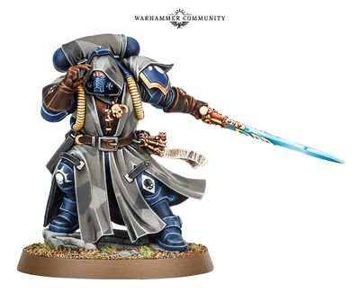

# 0253 先锋智库员 Vanguard Librarian

精校状态：中文行文已逐段精校，部分术语仍为暂定

分类：通用概念 / 帝国 Imperium / 中央政务部 Adeptus Terra / 阿斯塔特修会 Adeptus Astartes

原文来源：https://www.bilibili.com/opus/1036603602602295297

原作者：帝国神选罐头

原文时间：2025年02月22日 10:31

[返回分类目录](目录.md) · [全书目录](../../目录.md)

原篇名：先锋智库 Vanguard Librarian

<!-- A0253-B0001 -->
**英文原文**

Vanguard Librarians are Primaris Space Marine Psykers that are masters of shrouding and stealth, allowing their Battle Brothers to strike at enemy forces when they’re least expected. They sometimes lead Vanguard Space Marine strike forces to battle.

<!-- /A0253-B0001 -->

<!-- A0253-B0002 -->

原译文

先锋军智库是原铸星际战士的灵能者，他们精通遮蔽和隐形技术，使他们的战斗兄弟能够在最意想不到的时候打击敌军。他们有时会率领先锋星际战士打击部队作战。

**校订译文**

先锋智库员是原铸星际战士中的灵能者，精于遮蔽踪迹与隐秘行动，使战斗兄弟能够趁敌人最不防备之时发动攻击。他们有时也亲自率领先锋星际战士突击部队作战。

<!-- /A0253-B0002 -->

<!-- A0253-B0003 图片 -->

<!-- A0253-B0004 -->

原译文

Vanguard Librarian 先锋军智库

**校订译文**

Vanguard Librarian 先锋智库员

<!-- /A0253-B0004 -->

<!-- A0253-B0005 -->
**英文原文**

Librarians chosen for Vanguard service have mastered unique battle-disciplines that focus on obscuring the passage of their comrades and wrong-footing the opponent with illusions and hallucinations. Shaping psychic energy about themselves like a cloak of shadow, these psykers guide their battle-brothers through enemy territory to their destination without raising so much as a flicker of suspicion from watchful foes. They are cowled in hooded camo cloaks to keep their identity – and the formidable psychic potential at their disposal – concealed.

<!-- /A0253-B0005 -->

<!-- A0253-B0006 -->

原译文

被选为服役先锋军的智库掌握了独特的战斗训练，专注于借助幻象和幻觉来遮蔽己方战友的行动路线，并使对手判断失误。这些灵能者将灵能像阴影披风一样环绕自身，引导他们的战斗兄弟穿越敌方领地，抵达目的地，而不会引起敌人的警惕和哪怕一丝怀疑。他们身着带兜帽的伪装斗篷，以隐藏自己的身份，以及他们所能掌控的强大灵能潜力。

**校订译文**

被选入先锋部队的智库员，掌握独特的战斗灵能技巧，能够掩藏战友的行踪，并以幻象与幻觉误导对手。他们把灵能塑成暗影斗篷般的屏障，环绕自身，引导战斗兄弟穿过敌境抵达目标，让警惕的敌人也生不出一丝疑心。他们还穿着带兜帽的迷彩斗篷，隐藏自己的身份，以及所能施展的强大灵能力量。

<!-- /A0253-B0006 -->

本篇核心术语与暂定项

以下列出本篇出现的英文原形及核心术语表用词。同形词可能指不同对象，具体词义以本篇正文和校注为准；单复数、别名和仅见于图注的名称可能尚未列入。完整候选见[术语表](../../术语表/双语术语候选.csv)。

| 英文 | 采用中文 | 状态 |
| --- | --- | --- |
| Space Marine | 星际战士 | 暂定·官方待核 |
| Vanguard | 先锋 | 暂定·官方待核 |
| Vanguard Space Marine | 先锋星际战士 | 暂定·官方待核 |
| Primaris Space Marine | 原铸星际战士 | 暂定·官方待核 |

