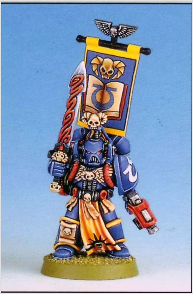

# 0254 星语官 Epistolary

精校状态：中文行文已逐段精校，部分术语仍为暂定

分类：通用概念 / 帝国 Imperium / 中央政务部 Adeptus Terra / 阿斯塔特修会 Adeptus Astartes

原文来源：https://www.bilibili.com/opus/1022463148602425345

原作者：帝国神选罐头

原文时间：2025年01月15日 07:59

[返回分类目录](目录.md) · [全书目录](../../目录.md)

<!-- A0254-B0001 -->
**英文原文**

Epistolary is the third rank of Space Marine Librarians. Their primary role is chief communications officer, both on the battlefield and beyond. They are able to use their powers to project their mind through the warp, similar to the Astropaths of the Adeptus Astra Telepathica, but without the need to endure the torturous ritual of soul binding that is otherwise required. More commonly, their abilities are used over shorter distances, coordinating attacks and battle orders.

<!-- /A0254-B0001 -->

<!-- A0254-B0002 -->

原译文

星语官是星际战士智库的第三梯队。他们的主要角色是战场内外的首席通信官。他们能够利用自己的力量通过亚空间投射自己的思想，类似于星语庭的星语者，但不需要忍受灵魂结合的折磨仪式。更常见的是，他们的能力用于较短的距离，协调攻击和战斗命令。

**校订译文**

星语官是星际战士智库员的第三级职衔，主要担任战场内外的首席通信官。他们能够把心智投射到亚空间中，其方式类似星语庭的星语者，却不必接受后者必须经历的痛苦魂缚仪式。更常见的用途，是在较短距离内传递信息，协调进攻与作战命令。

**校注：** Epistolary 采用暂定职衔“星语官”，与 Astropath（星语者）区分；third rank 为等级，不是第三梯队编制。

<!-- /A0254-B0002 -->

<!-- A0254-B0003 图片 -->

<!-- A0254-B0004 -->

原译文

Epistolary 星语官

**校订译文**

Epistolary 星语官

<!-- /A0254-B0004 -->

<!-- A0254-B0005 -->
## Notable Epistolaries 著名星语官

<!-- /A0254-B0005 -->

<!-- A0254-B0006 -->
**英文原文**

Anathrus - Blood Angels (seconded to Deathwatch)

<!-- /A0254-B0006 -->

<!-- A0254-B0007 -->

原译文

阿纳斯图斯 - 圣血天使（借调到死亡守望）

**校订译文**

阿纳斯图斯 - 圣血天使（借调到死亡守望）

<!-- /A0254-B0007 -->

<!-- A0254-B0008 -->
**英文原文**

Anteas - Blood Ravens

<!-- /A0254-B0008 -->

<!-- A0254-B0009 -->

原译文

安提阿斯 - 血鸦

**校订译文**

安提阿斯 - 血鸦

<!-- /A0254-B0009 -->

<!-- A0254-B0010 -->
**英文原文**

Gaius Rhacelus - Blood Angels

<!-- /A0254-B0010 -->

<!-- A0254-B0011 -->

原译文

盖乌斯·莱切罗斯 - 圣血天使

**校订译文**

盖乌斯·莱切罗斯 - 圣血天使

<!-- /A0254-B0011 -->

<!-- A0254-B0012 -->
**英文原文**

Galius - Novamarines

<!-- /A0254-B0012 -->

<!-- A0254-B0013 -->

原译文

加利乌斯 - 新星战士

**校订译文**

加利乌斯 - 新星战士

<!-- /A0254-B0013 -->

<!-- A0254-B0014 -->
**英文原文**

Hilesto Fabian - Sons of Guilliman

<!-- /A0254-B0014 -->

<!-- A0254-B0015 -->

原译文

希勒斯托·费边 - 基里曼之子

**校订译文**

希勒斯托·费边 - 基里曼之子

<!-- /A0254-B0015 -->

<!-- A0254-B0016 -->
**英文原文**

Julius Zenobi - Angels of Wrath

<!-- /A0254-B0016 -->

<!-- A0254-B0017 -->

原译文

尤利乌斯·泽诺比 - 愤怒天使

**校订译文**

尤利乌斯·泽诺比 - 愤怒天使

<!-- /A0254-B0017 -->

<!-- A0254-B0018 -->
**英文原文**

Kuran - Revilers

<!-- /A0254-B0018 -->

<!-- A0254-B0019 -->

原译文

库兰 - 谩骂者

**校订译文**

库兰 - 谩骂者

<!-- /A0254-B0019 -->

<!-- A0254-B0020 -->
**英文原文**

Lothar Ortan - Imperial Fists

<!-- /A0254-B0020 -->

<!-- A0254-B0021 -->

原译文

洛塔尔·奥坦 - 帝国之拳

**校订译文**

洛塔尔·奥坦 - 帝国之拳

<!-- /A0254-B0021 -->

<!-- A0254-B0022 -->
**英文原文**

Lydriik - Iron Hands

<!-- /A0254-B0022 -->

<!-- A0254-B0023 -->

原译文

林德里克 - 钢铁之手

**校订译文**

林德里克 - 钢铁之手

<!-- /A0254-B0023 -->

<!-- A0254-B0024 -->
**英文原文**

Marcello - Blood Angels

<!-- /A0254-B0024 -->

<!-- A0254-B0025 -->

原译文

马尔切罗 - 圣血天使

**校订译文**

马尔切罗 - 圣血天使

<!-- /A0254-B0025 -->

<!-- A0254-B0026 -->
**英文原文**

Pyriel - Salamanders

<!-- /A0254-B0026 -->

<!-- A0254-B0027 -->

原译文

派瑞尔 - 火蜥蜴

**校订译文**

派瑞尔 - 火蜥蜴

<!-- /A0254-B0027 -->

<!-- A0254-B0028 -->
**英文原文**

Saribander - Blood Ravens

<!-- /A0254-B0028 -->

<!-- A0254-B0029 -->

原译文

萨里班德尔 - 血鸦

**校订译文**

萨里班德尔 - 血鸦

<!-- /A0254-B0029 -->

<!-- A0254-B0030 -->
**英文原文**

Graucis Telomane - Grey Knights

<!-- /A0254-B0030 -->

<!-- A0254-B0031 -->

原译文

格劳西斯.泰洛迈恩

**校订译文**

格劳西斯·泰洛迈恩——灰骑士。

<!-- /A0254-B0031 -->

<!-- A0254-B0032 -->
**英文原文**

Thule - Silver Skulls

<!-- /A0254-B0032 -->

<!-- A0254-B0033 -->

原译文

图勒 - 银色颅骨

**校订译文**

图勒 - 银色颅骨

<!-- /A0254-B0033 -->

<!-- A0254-B0034 -->
**英文原文**

Vekt - Flesh Tearers

<!-- /A0254-B0034 -->

<!-- A0254-B0035 -->

原译文

维克特 - 撕肉者

**校订译文**

维克特 - 撕肉者

<!-- /A0254-B0035 -->

<!-- A0254-B0036 -->
**英文原文**

Vezuel - Dark Angels

<!-- /A0254-B0036 -->

<!-- A0254-B0037 -->

原译文

维祖尔 - 黑暗天使

**校订译文**

维祖尔 - 黑暗天使

<!-- /A0254-B0037 -->

<!-- A0254-B0038 -->
**英文原文**

Zoldt - Imperial Fists

<!-- /A0254-B0038 -->

<!-- A0254-B0039 -->

原译文

佐尔特 - 帝国之拳

**校订译文**

佐尔特 - 帝国之拳

<!-- /A0254-B0039 -->

本篇核心术语与暂定项

以下列出本篇出现的英文原形及核心术语表用词。同形词可能指不同对象，具体词义以本篇正文和校注为准；单复数、别名和仅见于图注的名称可能尚未列入。完整候选见[术语表](../../术语表/双语术语候选.csv)。

| 英文 | 采用中文 | 状态 |
| --- | --- | --- |
| Blood Angels | 圣血天使 | 官方已核对 |
| Dark Angels | 黑暗天使 | 官方已核对 |
| Deathwatch | 死亡守望 | 官方已核对 |
| Grey Knights | 灰骑士 | 官方已核对 |
| Adeptus Astra Telepathica | 星语庭 | 暂定 |
| Warp | 亚空间 | 官方已核对 |
| Imperial Fists | 帝国之拳 | 暂定 |
| Blood Ravens | 血鸦 | 暂定 |
| Iron Hands | 钢铁之手 | 暂定·官方待核 |
| Salamanders | 火蜥蜴 | 暂定·官方待核 |
| Epistolary | 星语官 | 暂定·官方待核 |
| Silver Skulls | 银色颅骨 | 暂定·官方待核 |
| Space Marine | 星际战士 | 暂定·官方待核 |
| Flesh Tearers | 撕肉者 | 暂定·官方待核 |
| Revilers | 谩骂者 | 暂定·官方待核 |
| Novamarines | 新星战士 | 暂定·官方待核 |
| Angels of Wrath | 愤怒天使 | 暂定·官方待核 |
| Sons of Guilliman | 基里曼之子 | 暂定·官方待核 |
| Powers | 能天使 | 暂定·官方待核 |
| Lydriik | 林德里克 | 暂定·官方待核 |
| Thule | 图勒 | 暂定·官方待核 |
| Galius | 盖利乌斯 | 暂定·官方待核 |
| Pyriel | 派瑞尔 | 暂定·官方待核 |
| Graucis Telomane | 格劳西斯·泰洛迈恩 | 暂定·官方待核 |
| Gaius Rhacelus | 盖乌斯·莱切罗斯 | 暂定·官方待核 |

