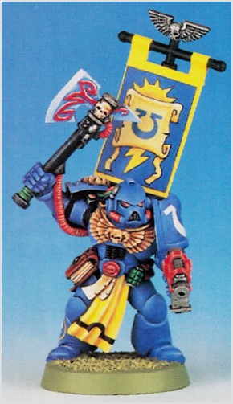

# 0256 编修员 Lexicanium

精校状态：中文行文已逐段精校，部分术语仍为暂定

分类：通用概念 / 帝国 Imperium / 中央政务部 Adeptus Terra / 阿斯塔特修会 Adeptus Astartes

原文来源：https://www.bilibili.com/opus/1025820296941142021

原作者：帝国神选罐头

原文时间：2025年01月24日 09:06

[返回分类目录](目录.md) · [全书目录](../../目录.md)

<!-- A0256-B0001 -->
**英文原文**

Lexicanium is the lowest rank of Space Marine Librarian. This rank is given to those who have recently joined the Librarius and are given duties related to the creation of battle reports to submit to the Chapter's records. These summary accounts chronicle the history of a Chapter and can vary in nature, depending on the Lexicanium's beliefs and philosophy or the campaign.

<!-- /A0256-B0001 -->

<!-- A0256-B0002 -->

原译文

编修员是星际战士智库中级别最低的。这个等级授予那些最近加入智库并被赋予与创建战斗报告相关的职责以提交给战团记录的人。这些摘要记录了一个战团的历史，其性质可能因编修员的信仰和哲学或战役而异。

**校订译文**

编修员是星际战士智库员的最低一级职衔，授予刚刚加入智库的成员。他们负责撰写战报，提交战团存档。这些概要记录构成战团历史的一部分，其内容与风格会因编修员的信念、思想或战役本身而有所不同。

<!-- /A0256-B0002 -->

<!-- A0256-B0003 图片 -->

<!-- A0256-B0004 -->

原译文

Lexicanium 编修员

**校订译文**

Lexicanium 编修员

<!-- /A0256-B0004 -->

<!-- A0256-B0005 -->
**英文原文**

Lexicania are often distinguished by their lack of a psychic hood or even helmet, appearing very similar to their brother-marines except for the blue Power Armour that Librarians wear.

<!-- /A0256-B0005 -->

<!-- A0256-B0006 -->

原译文

编修员的特点通常是他们没有灵能头箍，甚至没有头盔，除了智库穿的蓝色动力盔甲外，看起来与他们的战士兄弟非常相似。

**校订译文**

编修员通常没有灵能兜帽，有时甚至不戴头盔；除了智库员特有的蓝色动力甲，他们的外表与其他战斗兄弟颇为相似。

<!-- /A0256-B0006 -->

<!-- A0256-B0007 -->
## Notable Lexicaniums 著名编修员

<!-- /A0256-B0007 -->

<!-- A0256-B0008 -->
**英文原文**

Fulgarr - Ultramarines

<!-- /A0256-B0008 -->

<!-- A0256-B0009 -->

原译文

富尔加尔 - 极限战士

**校订译文**

富尔加尔 - 极限战士

<!-- /A0256-B0009 -->

<!-- A0256-B0010 -->
**英文原文**

Macex - Raptors

<!-- /A0256-B0010 -->

<!-- A0256-B0011 -->

原译文

马克赛斯 - 猛禽

**校订译文**

马克赛斯 - 猛禽

<!-- /A0256-B0011 -->

<!-- A0256-B0012 -->
**英文原文**

Charon - Dark Angels

<!-- /A0256-B0012 -->

<!-- A0256-B0013 -->

原译文

卡戎 - 黑暗天使

**校订译文**

卡戎 - 黑暗天使

<!-- /A0256-B0013 -->

<!-- A0256-B0014 -->
**英文原文**

Hebron - Dark Angels

<!-- /A0256-B0014 -->

<!-- A0256-B0015 -->

原译文

希伯伦 - 黑暗天使

**校订译文**

希伯伦 - 黑暗天使

<!-- /A0256-B0015 -->

<!-- A0256-B0016 -->
**英文原文**

Acutus - Dark Angels

<!-- /A0256-B0016 -->

<!-- A0256-B0017 -->

原译文

阿库图斯 - 黑暗天使

**校订译文**

阿库图斯 - 黑暗天使

<!-- /A0256-B0017 -->

<!-- A0256-B0018 -->
**英文原文**

Merlith - Dark Angels

<!-- /A0256-B0018 -->

<!-- A0256-B0019 -->

原译文

梅尔利斯 - 黑暗天使

**校订译文**

梅尔利斯 - 黑暗天使

<!-- /A0256-B0019 -->

<!-- A0256-B0020 -->
**英文原文**

Lucius Antros - Blood Angels

<!-- /A0256-B0020 -->

<!-- A0256-B0021 -->

原译文

卢修斯·安特罗斯 - 圣血天使

**校订译文**

卢修斯·安特罗斯 - 圣血天使

<!-- /A0256-B0021 -->

本篇核心术语与暂定项

以下列出本篇出现的英文原形及核心术语表用词。同形词可能指不同对象，具体词义以本篇正文和校注为准；单复数、别名和仅见于图注的名称可能尚未列入。完整候选见[术语表](../../术语表/双语术语候选.csv)。

| 英文 | 采用中文 | 状态 |
| --- | --- | --- |
| Blood Angels | 圣血天使 | 官方已核对 |
| Dark Angels | 黑暗天使 | 官方已核对 |
| Librarian | 智库员 | 官方已核对 |
| Ultramarines | 极限战士 | 官方已核对 |
| Psychic Hood | 灵能兜帽 | 暂定·官方待核 |
| Librarius | 智库（机构）／智库学派（灵能学派） | 语境定译·官方待核 |
| History | 历史 | 编辑用语已统一 |
| Lucius | 卢修斯 | 暂定·官方待核 |
| Lexicanium | 编修员 | 暂定·官方待核 |
| Power Armour | 动力盔甲 | 暂定·官方待核 |
| Space Marine | 星际战士 | 暂定·官方待核 |
| Chapter | 战团 | 暂定·官方待核 |
| Brother | 修士 | 暂定·官方待核 |
| Raptors | 猛禽 | 暂定·官方待核 |
| Lexicania | 编修员 | 暂定·官方待核 |
| Lucius Antros | 卢修斯·安特罗斯 | 暂定·官方待核 |

