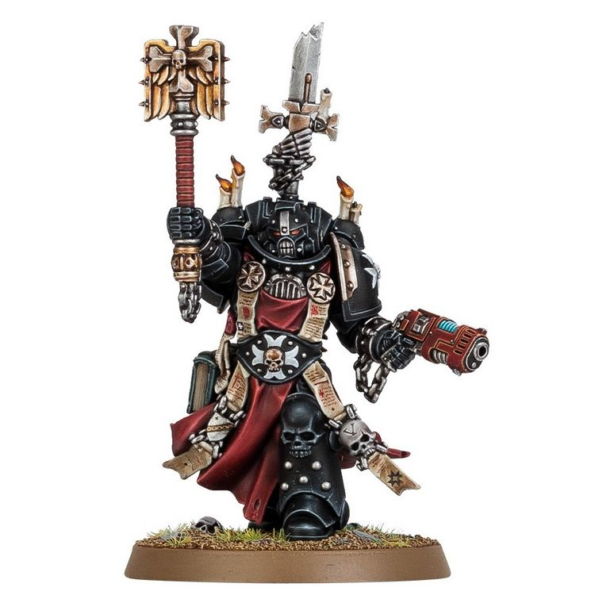
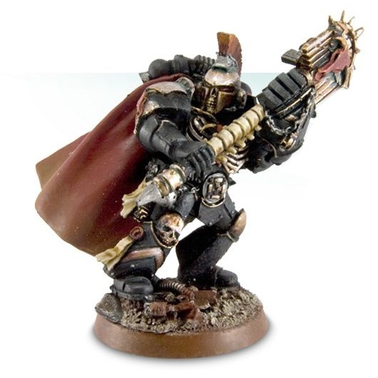
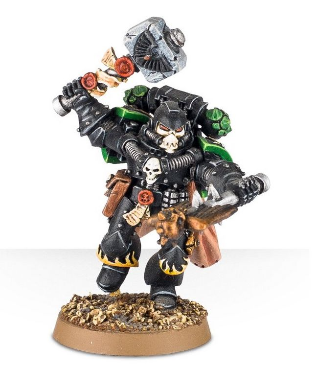

# 0259 隐修长 Reclusiarch

精校状态：中文行文已逐段精校，部分术语仍为暂定

分类：通用概念 / 帝国 Imperium / 中央政务部 Adeptus Terra / 阿斯塔特修会 Adeptus Astartes

原文来源：https://www.bilibili.com/opus/1032514162385747993

原作者：帝国神选罐头

原文时间：编辑于 2025年09月01日 18:59

[返回分类目录](目录.md) · [全书目录](../../目录.md)

<!-- A0259-B0001 -->
**英文原文**

A Reclusiarch is one of the senior members of the Chaplaincy in a Space Marines Chapter. The immediate subordinate of the Master of Sanctity, the Reclusiarch is charged with overseeing the Reclusiam, the holiest place in the fortress-monastery which houses the Chapter's holiest relics. The Reclusiarch also oversees the rituals pertaining to the relics, as well as training new Chaplains.

<!-- /A0259-B0001 -->

<!-- A0259-B0002 -->

原译文

隐修长是星际战士战团牧师职位的高级成员之一。隐修长是圣洁导师的直接下属，负责监督隐修室，这是堡垒修道院中最神圣的地方，存放着战团最神圣的文物。隐修士还负责监督与圣物有关的仪式，以及培训新的牧师。

**校订译文**

隐修长是星际战士战团教士体系中的高级成员，直属圣洁导师。他负责管理隐修圣殿——要塞修道院中最神圣的场所，战团最珍贵的圣物就供奉于此。他也主持与圣物有关的仪式，并负责培训新教士。

**校注：** Fortress-monastery 与全书核心定译统一为要塞修道院。

<!-- /A0259-B0002 -->

<!-- A0259-B0003 -->
## Notable Reclusiarchs 著名隐修长

原题：Notable Reclusiarchs 著名隐修士

<!-- /A0259-B0003 -->

<!-- A0259-B0004 -->
**英文原文**

Albanactus — High Reclusiarch for Watch Fortress Furor Shield's Reclusiam and Chaplain of the Black Templars

<!-- /A0259-B0004 -->

<!-- A0259-B0005 -->

原译文

阿尔巴纳克托斯 — 狂热之盾守望堡垒隐修会的高级隐修士和黑色圣堂牧师

**校订译文**

阿尔巴纳克托斯——主管狂热之盾守望堡垒隐修圣殿的最高隐修长，亦是黑色圣堂教士。

<!-- /A0259-B0005 -->

<!-- A0259-B0006 -->
**英文原文**

Carnaevon of the Flesh Tearers

<!-- /A0259-B0006 -->

<!-- A0259-B0007 -->

原译文

撕肉者的卡奈冯

**校订译文**

撕肉者的卡奈冯

<!-- /A0259-B0007 -->

<!-- A0259-B0008 -->
**英文原文**

Grimaldus of the Black Templars

<!-- /A0259-B0008 -->

<!-- A0259-B0009 -->

原译文

黑色圣堂的格瑞马度斯

**校订译文**

黑色圣堂的格里玛度斯

<!-- /A0259-B0009 -->

<!-- A0259-B0010 图片 -->

<!-- A0259-B0011 -->

原译文

Grimaldus of the Black Templars 黑色圣堂的格瑞马度斯

**校订译文**

Grimaldus of the Black Templars 黑色圣堂的格里玛度斯

<!-- /A0259-B0011 -->

<!-- A0259-B0012 -->
**英文原文**

Ivanus Enkomi of the Minotaurs

<!-- /A0259-B0012 -->

<!-- A0259-B0013 -->

原译文

米诺陶的伊万努斯.恩科米

**校订译文**

米诺陶的伊万努斯·恩科米

<!-- /A0259-B0013 -->

<!-- A0259-B0014 图片 -->

<!-- A0259-B0015 -->

原译文

Ivanus Enkomi of the Minotaurs 米诺陶的伊万努斯.恩科米

**校订译文**

Ivanus Enkomi of the Minotaurs 米诺陶的伊万努斯·恩科米

<!-- /A0259-B0015 -->

<!-- A0259-B0016 -->
**英文原文**

Mikelus of the Blood Ravens

<!-- /A0259-B0016 -->

<!-- A0259-B0017 -->

原译文

血鸦的米凯卢斯

**校订译文**

血鸦的米凯卢斯

<!-- /A0259-B0017 -->

<!-- A0259-B0018 -->
**英文原文**

Raneil of the Blood Angels

<!-- /A0259-B0018 -->

<!-- A0259-B0019 -->

原译文

血鸦的雷内尔

**校订译文**

圣血天使的雷内尔

**校注：** 英文 Blood Angels 对应圣血天使；原译误作血鸦（Blood Ravens）。

<!-- /A0259-B0019 -->

<!-- A0259-B0020 -->
**英文原文**

Thalastian Jorus of the Blood Angels

<!-- /A0259-B0020 -->

<!-- A0259-B0021 -->

原译文

圣血天使的塔拉斯坦·乔鲁斯

**校订译文**

圣血天使的塔拉斯坦·乔鲁斯

<!-- /A0259-B0021 -->

<!-- A0259-B0022 -->
**英文原文**

Theodorich of the Black Templars

<!-- /A0259-B0022 -->

<!-- A0259-B0023 -->

原译文

黑色圣堂的西奥多里克

**校订译文**

黑色圣堂的西奥多里克

<!-- /A0259-B0023 -->

<!-- A0259-B0024 -->
**英文原文**

Thulsa Kane of the Executioners

<!-- /A0259-B0024 -->

<!-- A0259-B0025 -->

原译文

处刑者的塔尔萨·凯恩

**校订译文**

处刑者的塔尔萨·凯恩

<!-- /A0259-B0025 -->

<!-- A0259-B0026 -->
**英文原文**

Xavier of the Salamanders

<!-- /A0259-B0026 -->

<!-- A0259-B0027 -->

原译文

火蜥蜴的赛维尔

**校订译文**

火蜥蜴的泽维尔

<!-- /A0259-B0027 -->

<!-- A0259-B0028 图片 -->

<!-- A0259-B0029 -->

原译文

Xavier of the Salamanders 火蜥蜴的赛维尔

**校订译文**

Xavier of the Salamanders 火蜥蜴的泽维尔

<!-- /A0259-B0029 -->

<!-- A0259-B0030 -->
**英文原文**

Relian of the Angels Penitent

<!-- /A0259-B0030 -->

<!-- A0259-B0031 -->

原译文

忏悔天使的雷利安

**校订译文**

悔罪天使的雷利安

**校注：** 已核同一人物、组织、型号或事件，与全书核心术语及后续专篇统一；原译保留对照。

<!-- /A0259-B0031 -->

本篇核心术语与暂定项

以下列出本篇出现的英文原形及核心术语表用词。同形词可能指不同对象，具体词义以本篇正文和校注为准；单复数、别名和仅见于图注的名称可能尚未列入。完整候选见[术语表](../../术语表/双语术语候选.csv)。

| 英文 | 采用中文 | 状态 |
| --- | --- | --- |
| Space Marines | 星际战士 | 官方已核对 |
| Black Templars | 黑色圣堂 | 官方已核对 |
| Blood Angels | 圣血天使 | 官方已核对 |
| Blood Ravens | 血鸦 | 暂定 |
| Salamanders | 火蜥蜴 | 暂定·官方待核 |
| Master | 导师（审判庭职衔）／舰务官（舰员职务） | 语境定译·官方待核 |
| Master of Sanctity | 圣洁导师 | 暂定·官方待核 |
| Reclusiarch | 隐修长 | 暂定·官方待核 |
| Reclusiam | 隐修圣殿 | 暂定·官方待核 |
| Albanactus | 阿尔巴纳克托斯 | 暂定·官方待核 |
| Watch Fortress Furor Shield | 狂热之盾守望堡垒 | 暂定·官方待核 |
| Ivanus Enkomi | 伊万努斯·恩科米 | 暂定·官方待核 |
| Minotaurs | 米诺陶 | 暂定·官方待核 |
| Raneil | 雷内尔 | 暂定·官方待核 |
| Thulsa Kane | 塔尔萨·凯恩 | 暂定·官方待核 |
| Xavier | 泽维尔 | 暂定·官方待核 |
| Chaplain | 教士 | 官方已核对 |
| Penitent | 忏悔 | 暂定·官方待核 |
| Chapter | 战团 | 暂定·官方待核 |
| Fortress-monastery | 要塞修道院 | 暂定·官方待核 |
| Flesh Tearers | 撕肉者 | 暂定·官方待核 |
| Executioners | 处刑者 | 语境定译·官方待核 |
| The Black Templars | 黑色圣堂 | 暂定·官方待核 |
| Angels Penitent | 悔罪天使 | 暂定·官方待核 |
| Chaplaincy | 教士团 | 暂定·官方待核 |
| Chaplains | 教士 | 暂定·官方待核 |
| The Blood | 鲜血 | 暂定·官方待核 |

