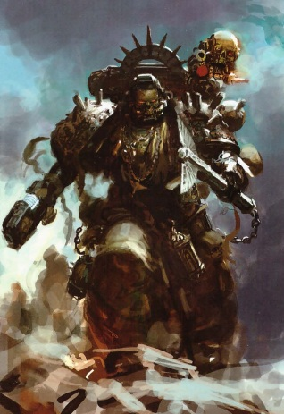
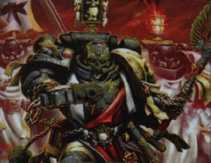
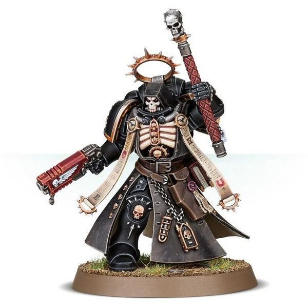
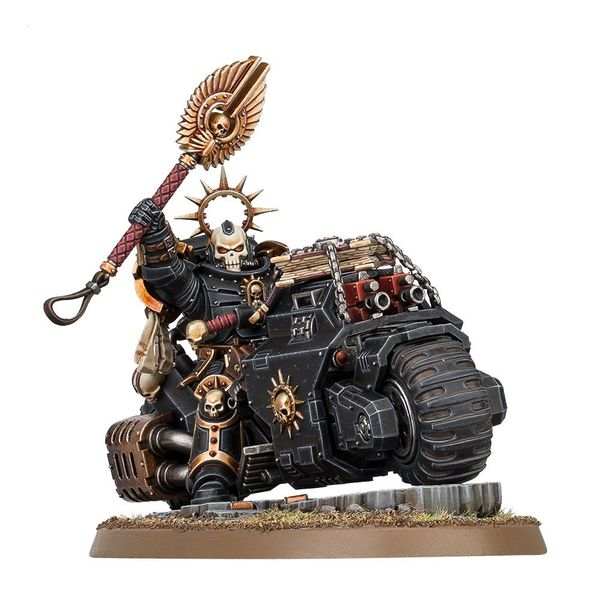
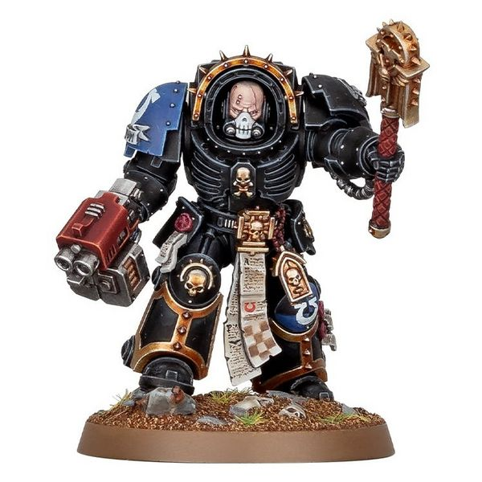
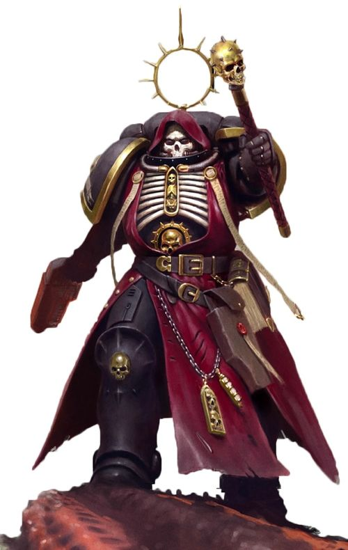

# 0260 教士 Chaplain

精校状态：中文行文已逐段精校，部分术语仍为暂定

分类：通用概念 / 帝国 Imperium / 中央政务部 Adeptus Terra / 阿斯塔特修会 Adeptus Astartes

原文来源：https://www.bilibili.com/opus/1019945382963052566

原作者：帝国神选罐头

原文时间：编辑于 2025年07月26日 11:44

[返回分类目录](目录.md) · [全书目录](../../目录.md)

原篇名：牧师 Chaplain

<!-- A0260-B0001 -->
**英文原文**

Space Marine Chaplains are the spiritual leaders of Space Marine Chapters.

<!-- /A0260-B0001 -->

<!-- A0260-B0002 -->

原译文

星际战士牧师是星际战士战团的精神领袖。

**校订译文**

星际战士教士是星际战士战团的精神领袖。

<!-- /A0260-B0002 -->

<!-- A0260-B0003 -->
**英文原文**

Warrior-priests, they fight alongside their battle-brothers, chanting the Chapter's sacred battle creeds, and inspiring their brethren to greater feats of bravery. To enemies they appear as terrifying and sinister figures in black power armour and skull-visaged helmets.

<!-- /A0260-B0003 -->

<!-- A0260-B0004 -->

原译文

战斗牧师，他们与他们的战斗兄弟并肩作战，吟唱本战团神圣的战斗信条，并激励他们的兄弟们取得更大的勇气。在敌人看来，他们穿着黑色动力盔甲和骷髅头盔，是可怕而险恶的人物。

**校订译文**

这些战斗祭司与战斗兄弟并肩作战，高声吟唱战团的神圣战斗信条，激励同袍作出更加英勇的壮举。在敌人眼中，他们身披黑色动力甲、头戴骷髅面盔的形象恐怖而阴森。

<!-- /A0260-B0004 -->

<!-- A0260-B0005 图片 -->

<!-- A0260-B0006 -->

原译文

Firstborn Chaplain of the Dark Angels 黑暗天使长子牧师

**校订译文**

Firstborn Chaplain of the Dark Angels 黑暗天使长子星际战士教士

**校注：** Firstborn 暂沿用原译长子，指相对于原铸、沿用传统改造流程的星际战士；这里不是家族排行。详见第0221篇。

<!-- /A0260-B0006 -->

<!-- A0260-B0007 -->
## Overview 概述

<!-- /A0260-B0007 -->

<!-- A0260-B0008 -->
**英文原文**

Each Chapter has its own unique cult, which is often thousands of years old. As these cults often predate the rise of the Ecclesiarchy, the Chapter cults are not simply facets of the common Imperial Cult. While the Ecclesiarchy and its lay followers worship the Emperor of Mankind as a deity, several Chapter cults regard him as merely a brilliant and inspirational man, though with scarcely less reverence. As in all things, this view of the Emperor's divinity, or lack thereof, varies from Chapter to Chapter. The chapter's own Primarch is also a major part of the Chapter's specific cult, revered as much as the Emperor.

<!-- /A0260-B0008 -->

<!-- A0260-B0009 -->

原译文

每个战团都有自己独特的信仰，通常有数千年的历史。由于这些信仰往往早于国教的兴起，战团信仰不仅仅是普通帝国信仰的一个方面。虽然国教及其世俗追随者将人类帝皇视为神，但一些战团信仰认为他只是一个才华横溢、鼓舞人心的人，尽管他们的崇敬程度并不低。正如在所有事物中一样，这种对帝皇神性的看法，或者说缺乏这种看法，在每一战团中都有所不同。该战团自己的原体也是该战团特定信仰的重要组成部分，与帝皇一样受人尊敬。

**校订译文**

每个战团都有独特的信仰体系，历史往往长达数千年。由于这些传统常在国教会兴起前便已存在，战团信仰不能简单视为通行帝皇信仰的分支。国教会及其普通信众将人类帝皇奉为神明，一些战团却只将他看作一位卓越非凡、鼓舞人心的人物，但崇敬之情几乎丝毫不减。各战团对帝皇是否具有神性的看法，正如其他许多问题一样，各不相同。战团自身的原体也是其信仰的重要组成部分，受到与帝皇同等的尊崇。

<!-- /A0260-B0009 -->

<!-- A0260-B0010 图片 -->

<!-- A0260-B0011 -->

原译文

Chaplain of the Black Templars 黑色圣堂牧师

**校订译文**

Chaplain of the Black Templars 黑色圣堂教士

<!-- /A0260-B0011 -->

<!-- A0260-B0012 -->
**英文原文**

A formal sign of entente between the Ecclesiarchy and the Space Marines is the rosarius, a holy symbol, taking the form of a necklace, amulet or brooch which often displays the Imperial Eagle or the Crux Terminatus, or other shapes to suit the particular devotional qualities of the Chapter concerned (for example, the Space Wolves and their wolf iconography). Gifted to Space Marine Chaplains by the Ecclesiarchy, this blessing represents the brotherhood of the Imperial Faith and formally marks the continuance of religious concord between the two groups. In practice, though, the link between the organisations remains rather tenuous.

<!-- /A0260-B0012 -->

<!-- A0260-B0013 -->

原译文

国教和星际战士之间达成协议的正式标志是玫瑰念珠，这是一种神圣的象征，以项链、护身符或胸针的形式出现，通常显示帝国天鹰或终结者十字章，或其他形状，以适应相关战团的特定忠诚品质（例如，太空野狼及其野狼图像）。这一祝福由国教赠送给星际战士牧师，代表了帝国信仰的兄弟情谊，正式标志着两个群体之间宗教和谐的延续。然而，在现实中，这些组织之间的联系仍然相当薄弱。

**校订译文**

玫瑰念珠是国教会与星际战士保持和睦的正式标志。这种圣徽可以做成项链、护身符或胸针，常饰有帝国天鹰、终结者十字章，或符合所属战团信仰传统的其他图案，例如太空野狼的狼形纹饰。国教会将其赐予星际战士教士，作为祝福，象征帝国信众之间的兄弟情谊，也正式确认双方继续维持宗教上的和睦。不过，实际而言，两者在组织层面的联系仍相当薄弱。

<!-- /A0260-B0013 -->

<!-- A0260-B0014 -->
## History 历史

<!-- /A0260-B0014 -->

<!-- A0260-B0015 -->
**英文原文**

During the Great Crusade, the Emperor specifically outlawed religious worship of any kind, but several Space Marine Legions still employed spiritual advisors of some kind. The first known Space Marines who bore a resemblance to Chaplains were members of the XVIIth Legion, known as the Imperial Heralds. The Legion's 'heralds' wore black armour with a skull-faced helmet and a winged mace and delivered the Emperor's ultimatum to new worlds: submission or destruction. After the Primarch Lorgar joined the XVIIth, renaming them the Word Bearers, he created a role for spiritual advisors, referring to them as 'Chaplains', who were assigned to minister to their brothers' psychological needs. Like the heralds, these Chaplains carried a skull-faced helmet and a winged mace but initially wore the same colours as other Word Bearer Legionaries. They later repainted their armour black in remembrance of the ashes of Monarchia.

<!-- /A0260-B0015 -->

<!-- A0260-B0016 -->

原译文

在大远征期间，帝皇明确禁止任何形式的宗教崇拜，但一些星际战士军团仍然使用了某种精神顾问。第一批与牧师相似的星际战士是第十七军团的成员，被称为帝国先驱。军团的“使者”身穿黑色盔甲，戴着骷髅头盔和带翼权杖，向新世界发出帝皇的最后通牒：要么屈服，要么毁灭。原体珞珈加入第十七军团后，将他们重新命名为“怀言者”，他为精神顾问创造了一个角色，称他们为“牧师”，他们被指派为满足兄弟们的心理需求的牧师。与先驱一样，这些牧师戴着骷髅头盔和带翅膀的权杖，但最初穿着与其他怀言者军团士兵相同的颜色。他们后来将盔甲重新漆成黑色，以纪念摩纳齐亚的毁灭。

**校订译文**

大远征期间，帝皇明令禁止一切宗教崇拜，但若干星际战士军团仍设有某种精神顾问。已知最早与教士相似的星际战士，来自当时称为“帝国先驱”的第十七军团。军团的“传令使”身穿黑甲、头戴骷髅面盔、手持带翼权杖，向新发现的世界宣告帝皇的最后通牒：臣服，或毁灭。原体珞珈回归第十七军团、将其改名为怀言者后，设立了称为“教士”的精神顾问，照料兄弟们的心理需求。与昔日传令使一样，这些教士配备骷髅面盔和带翼权杖，但最初的甲色与其他怀言者相同。后来，他们将护甲漆黑，以铭记摩纳齐亚的灰烬。

<!-- /A0260-B0016 -->

<!-- A0260-B0017 图片 -->

<!-- A0260-B0018 -->

原译文

Primaris Chaplain 原铸牧师

**校订译文**

Primaris Chaplain 原铸教士

<!-- /A0260-B0018 -->

<!-- A0260-B0019 -->
**英文原文**

Similar positions also existed in other Legions, such as the Blood Angels Wardens, who served as the watchmen of the Blood Angels, serving as mentors and guides for the younger members of the Blood Angels, but also charged with upholding the laws of the IX Legion. These duties were varied, from offering a Captain advice on tactical doctrine, to leading a ceremony of remembrance for fallen Space Marines. Wardens also wore all-black armour and carried the Crozius Arcanum as a weapon. The Salamanders also had a body of chosen Legionaries who carried out the direct promulgation of the doctrines of Vulkan, shaped by the culture of Nocturne, called the 'Voices of Fire'. The Iron Hands' role of Iron Father, which combines the position of Chaplain and Techmarine was brought into the legion from an order of engineer-mystics who maintained Dark Age of Technology machinery on Medusa, following the re-discovery of Ferrus Manus.

<!-- /A0260-B0019 -->

<!-- A0260-B0020 -->

原译文

其他军团也有类似的职位，如圣血天使监察者，他们担任圣血天使的守望者，为圣血天使的年轻成员担任导师和向导，但也负责维护第九军团的法律。这些职责各不相同，从为连长提供战术理论建议，到为阵亡的星际战士主持纪念仪式。监察者还穿着全黑盔甲，并携带牧师权杖作为武器。火蜥蜴也有一种受选的军团士兵，他们直接传播了由夜曲星的文化塑造的沃坎教义，称为“火之声”。钢铁之手的铁父，结合了牧师和技术军士的角色，是在马努斯回归之后，从维护美杜莎黑暗技术时代机器的隐秘工匠的命令中被带入军团的。

**校订译文**

其他军团也存在类似职位。圣血天使的监察者既是年轻成员的导师与引路人，也负责维护第九军团的法度。他们的职责广泛，从向连长提供战术准则方面的建议，到主持阵亡星际战士的追思仪式，均在其列。监察者同样身穿全黑护甲，以教士权杖为武器。火蜥蜴则从军团战士中选出“火之声”，直接传播沃坎的教义；这些教义深受夜曲星文化影响。钢铁之手的钢铁圣父兼具教士与科技战士的职责。这一传统源自美杜莎上维护黑暗科技时代机械的技师秘修者团体，在费鲁斯·马努斯被重新寻回之后传入军团。

**校注：** Iron Father 统一暂译钢铁圣父，参考官译人物全称 Iron Father Feirros／钢铁圣父费洛斯（GW-09中文32页，GW-10英文31页）；单独职衔尚待官方直接证据。

<!-- /A0260-B0020 -->

<!-- A0260-B0021 -->
**英文原文**

After the Decree of Nikaea, Lorgar offered his Chaplains' services to the other Legions. These Chaplains travelled among the Legions to counsel former Librarians who felt uncomfortable at the loss of their psychic role, and ease them back into duty as ordinary Battle-Brothers. Many Primarchs accepted Lorgar's offer, the use of Chaplains spread to legions such as the Dark Angels, Emperor's Children, World Eaters, and the Death Guard . Other Primarchs such as Sanguinius declined, the duties being given to the already existing Wardens.

<!-- /A0260-B0021 -->

<!-- A0260-B0022 -->

原译文

在尼凯亚法令颁布后，珞珈将他的牧师服务提供给其他军团。这些牧师在军团中旅行，为那些对失去灵能者地位而感到不舒服的前智库提供咨询，并让他们重新承担起普通战斗兄弟的职责。许多原体接受了珞珈的提议，牧师的使用传播到了黑暗天使、帝皇之子、吞世者和死亡守卫等军团。其他原体，如圣吉列斯拒绝了，将职责交给了现有的监察者。

**校订译文**

尼凯亚法令颁布后，珞珈提出让自己的教士为其他军团服务。这些教士往来于各军团，开导那些因失去灵能职责而无所适从的前智库员，帮助他们重新适应普通战斗兄弟的职务。许多原体接受了提议，黑暗天使、帝皇之子、吞世者与死亡守卫等军团因而开始采用教士制度。圣吉列斯等原体则婉拒了邀请，将相应职责交给军团已有的监察者。

<!-- /A0260-B0022 -->

<!-- A0260-B0023 图片 -->

<!-- A0260-B0024 -->

原译文

Primaris Chaplain on Bike 原铸摩托牧师

**校订译文**

Primaris Chaplain on Bike 原铸摩托教士

<!-- /A0260-B0024 -->

<!-- A0260-B0025 -->
**英文原文**

Following the Horus Heresy, the position of Chaplain continued in both Loyalist and Traitor Legions, those in the Traitor Legions becoming known as Dark Apostles.

<!-- /A0260-B0025 -->

<!-- A0260-B0026 -->

原译文

荷鲁斯叛乱之后，牧师的职位在忠诚派和叛徒军团中都继续存在，叛徒军团中的牧师被称为黑暗使徒。

**校订译文**

荷鲁斯之乱后，忠诚派与叛变军团都保留了教士一职；叛变军团中的教士则被称为黑暗使徒。

<!-- /A0260-B0026 -->

<!-- A0260-B0027 -->
## Responsibilities within a Chapter 战团内职责

<!-- /A0260-B0027 -->

<!-- A0260-B0028 -->
**英文原文**

Chaplains are the most well-versed in the knowledge of the Chapter's cult. This knowledge is put to practical use as Chaplains are responsible for the spiritual health, discipline, and faith of the chapter brethren. The bond between Marines and their Chaplains is a strong one. Chaplains are present in a Marine's life from the moment he is chosen as a neophyte, presiding over their indoctrination as they progress toward becoming full battle-brothers.

<!-- /A0260-B0028 -->

<!-- A0260-B0029 -->

原译文

牧师们最熟悉战团的信仰知识。这一知识被付诸实践，因为牧师负责本战团兄弟的精神健康、纪律和信仰。星际战士和他们的牧师之间的关系很牢固。从一名星际战士被选为新进者的那一刻起，牧师就出现在他的生活中，在他们走向成为正式战斗兄弟的过程中主持对他们的教导。

**校订译文**

教士最熟悉战团的信仰与传统，并将这些知识运用于维护兄弟们的精神状态、纪律与信念。星际战士与教士之间有着紧密的纽带：从一名战士被选为新兵起，教士便参与其成长，在他逐步成为正式战斗兄弟的过程中，主持思想与信仰的灌输。

<!-- /A0260-B0029 -->

<!-- A0260-B0030 图片 -->

<!-- A0260-B0031 -->

原译文

Terminator Chaplain 终结者牧师

**校订译文**

Terminator Chaplain 终结者教士

<!-- /A0260-B0031 -->

<!-- A0260-B0032 -->
**英文原文**

Within a Chapter's fortress-monastery is the Reclusiam, a large chamber devoted to cult activities, and where the Chapter's holy relics and, sometimes, the body of its Primarch are housed. The Chaplains lead their sermons from here, and rouse the Marines in their love of the Emperor. The Battle Barges and ships of the Chapter's fleet also include huge cathedrals in the heart of each ship, allowing the Space Marines to pray while away from the fortress. Chaplains always lead the Space Marines in prayer, but a Chaplain is not always needed for a Marine to pray.

<!-- /A0260-B0032 -->

<!-- A0260-B0033 -->

原译文

在战团的堡垒修道院内是隐修会，这是一个专门用于信仰活动的大房间，战团的圣物，有时还有其原体的尸体都存放在这里。牧师们从这里开始布道，唤醒星际战士对帝皇的热爱。战斗驳船和战团舰队的船只在每艘船的中心还包括巨大的教堂，让星际战士在远离堡垒时祈祷。牧师总是带领星际战士祈祷，但星际战士并不总是需要牧师来祈祷。

**校订译文**

战团的要塞修道院内设有隐修圣殿。这座用于宗教活动的宏伟殿堂，供奉着战团圣物，有时还保存着原体的遗体。教士在此布道，激发星际战士对帝皇的热爱。战团舰队的战斗驳船及其他舰船，也在舰体深处设有大型教堂，供远离堡垒的星际战士祈祷。集体祈祷由教士带领，但星际战士也可以在没有教士陪同的情况下独自祈祷。

**校注：** Fortress-monastery 与全书核心定译统一为要塞修道院。

<!-- /A0260-B0033 -->

<!-- A0260-B0034 -->
**英文原文**

Each Space Marine Company has its own Chaplain. Chaplains begin their careers as Judicars within the Chapter. At the headquarters level of the Chapter organization are Chaplains holding the ranks of Reclusiarch and Master of Sanctity, whose responsibilities extend to the Chapter as a whole.

<!-- /A0260-B0034 -->

<!-- A0260-B0035 -->

原译文

每个星际战士战团都有自己的牧师。牧师在战团内开始了他们的职业生涯，担任审判者。在战团组织的总部一级，有担任隐修长和圣洁大师的牧师，他们的职责延伸到整个战团。

**校订译文**

每个星际战士连都有自己的教士。教士以战团中的裁决者身份开始生涯。在战团总部层级，担任隐修长和圣洁导师的教士则负责全战团的相关事务。

**校注：** Company 为连，原译错成战团；Judicars 为原英文拼写，按对应职务 Judiciar 采用官译裁决者，保留原英文。

<!-- /A0260-B0035 -->

<!-- A0260-B0036 -->
## Wargear 战备

<!-- /A0260-B0036 -->

<!-- A0260-B0037 -->
**英文原文**

The power armour suits worn by Chaplains are considered holy in themselves. Often they are hundreds, if not thousands, of years old. A Chaplain's armour is highly stylised and archaic in appearance. Black is the colour associated with Chaplains, and most or all of their armour is painted in this colour, but not all. Know variation are fully silver.

<!-- /A0260-B0037 -->

<!-- A0260-B0038 -->

原译文

牧师所穿的动力盔甲本身就被认为是神圣的。它们通常有数百年的历史，如果不是数千年的话。牧师的盔甲在外观上非常风格化和古老。黑色是与牧师相关的颜色，他们的大部分或全部盔甲都涂成这种颜色，但不是全部。已知变体是完全银色的。

**校订译文**

教士所穿的动力甲本身就被视为圣物，往往已有数百年乃至数千年的历史。其外观古老，装饰风格鲜明。黑色是教士的标志色，大多数教士的护甲全部或大部漆成黑色，但也存在例外，例如全银色的护甲。

<!-- /A0260-B0038 -->

<!-- A0260-B0039 -->
**英文原文**

Symbols such as skulls and Imperial eagles commonly adorn the armour, but Chapter-specific symbols are also used. The face plate or the entire helmet is traditionally skull-shaped. Skulls are also repeated throughout a Chaplain's armour - adorning an entire shoulder plate, the upper chest armour or the groin guard. One area of the armour, such as a shoulder guard, is always left in the Chapter colours, displaying the Chapter symbol. Part of the Chaplain's formal regalia is the Crozius Arcanum, the Chaplain's staff of office. Used in chapter ceremonies and worship, many Chaplains take them into battle, symbolizing that battle is the highest ritual of the Chapter. The crozius is usually topped with an Imperial Eagle or winged skull. It incorporates a potent energy field, allowing it to be used as a weapon; one that will punch through armour easily, showing the power of faith.

<!-- /A0260-B0039 -->

<!-- A0260-B0040 -->

原译文

骷髅和帝国天鹰等符号通常装饰盔甲，但也会使用特定战团的符号。面罩或整个头盔传统上是头骨形状的。骷髅也在牧师的盔甲上重复出现，装饰着整个肩甲、上胸甲或腹甲。盔甲的一个区域，如肩甲，始终保留为战团颜色，显示战团符号。牧师正式的特别物品的一部分是牧师权杖，牧师的职务权杖。在战团仪式和信仰中，许多牧师会带他们参加战斗，象征着战斗是战团的最高仪式。权杖通常顶部有帝国天鹰或带翅膀的头骨。它包含一个强大的能量力场，使其可以用作武器；一个能轻易穿透盔甲的权杖，展现信仰的力量。

**校订译文**

护甲常以骷髅与帝国天鹰为饰，也会采用所属战团独有的符号。面甲或整个头盔通常呈骷髅形状；骷髅纹饰也遍布肩甲、上胸甲与裆甲等部位。至少一处甲片，例如肩甲，会保留战团配色并展示战团徽记。教士的正式仪仗还包括象征职权的教士权杖。它用于战团典礼与礼拜，许多教士也将其带上战场，象征战斗就是战团最高的仪式。权杖顶端通常饰有帝国天鹰或带翼骷髅，内置强大的能量场，可以轻易击穿护甲，以武器的威力彰显信仰。

<!-- /A0260-B0040 -->

<!-- A0260-B0041 -->
**英文原文**

In many Chapters, once a Space Marine is inducted into the Chaplaincy, they are forbidden to remove their helmets while in the presence of those who are not of their order.

<!-- /A0260-B0041 -->

<!-- A0260-B0042 -->

原译文

在许多战团中，一旦一名星际战士被任命为牧师，他们就被禁止在不属于他们的人面前摘下头盔。

**校订译文**

在许多战团中，星际战士一旦加入教士行列，就不得在教士体系之外的人面前摘下头盔。

<!-- /A0260-B0042 -->

<!-- A0260-B0043 -->
**英文原文**

The Rosarius that Chaplains wear around their neck incorporates a powerful force field generator, offering the bearer protection against weapons that even power armour would offer no hope of survival against. In light of this, the rosarius is sometimes referred to as a Chaplain's "soul armour."

<!-- /A0260-B0043 -->

<!-- A0260-B0044 -->

原译文

牧师们戴在脖子上的玫瑰念珠包含一个强大的力场发生器，为持有者提供保护，使其免受即使是动力盔甲也无法生存的武器的伤害。有鉴于此，玫瑰念珠有时被称为牧师的“灵魂盔甲”

**校订译文**

教士颈上的玫瑰念珠内置强大的力场发生器。即使某些武器足以击穿动力甲、令穿戴者毫无生还希望，它仍可能提供保护。因此，玫瑰念珠有时被称为教士的“灵魂护甲”。

<!-- /A0260-B0044 -->

<!-- A0260-B0045 -->
## Chapter Variations 各战团的不同做法

原题：Chapter Variations 战团变体

<!-- /A0260-B0045 -->

<!-- A0260-B0046 -->
**英文原文**

As each chapter has its own distinct cult, the specific roles of Chaplains can vary from Chapter to Chapter. The most notable differences in the roles of Chaplains of different Chapters are as follows:

<!-- /A0260-B0046 -->

<!-- A0260-B0047 -->

原译文

由于每一战团都有自己独特的信仰，牧师的具体角色可能因战团而异。不同战团牧师角色的最显著差异如下：

**校订译文**

各战团的信仰传统不同，教士的具体职责也有所差异。较为显著的例子如下：

<!-- /A0260-B0047 -->

<!-- A0260-B0048 -->
### Blood Angels 圣血天使

<!-- /A0260-B0048 -->

<!-- A0260-B0049 -->
**英文原文**

The Chaplains of the Blood Angels chapter constantly watch their brothers for the onset of the Black Rage. Only the Chaplains can communicate successfully with those unfortunates who have succumbed to the Rage and so lead them in battle as the Death Company, fearsome warriors whose demise is assured. They also care for those who completely succumb to the Red Thirst, and are rumoured to look after those who are locked away on their homeworld, Baal. The Blood Angels' chaplains also share responsibility for their battle-brothers' spiritual health with the chapter's apothecaries, known as Sanguinary Priests The Death Company of the Blood Angels maintains its own special variant of the Chaplain, the Death Company Chaplain. These officers provide sanity amidst the carnage and rage of the Death Company.

<!-- /A0260-B0049 -->

<!-- A0260-B0050 -->

原译文

圣血天使战团的牧师不断地看着他们的兄弟们爆发黑怒。只有牧师才能成功地与那些屈服于愤怒的不幸者沟通，并带领他们作为死亡连投入战斗，作为死亡已成定局的可怕战士。他们还照顾那些完全屈服于血渴的人，据传他们会照顾那些被锁在家乡巴尔的人。圣血天使的牧师也与该战团的药剂师（被称为圣血祭司）共同负责他们的战斗兄弟的精神健康。圣血天使的死亡连保留了自己特殊的牧师变体，即死亡连牧师。这些军官在死亡连的屠杀和愤怒中提供了理智。

**校订译文**

圣血天使教士时刻留意兄弟们是否出现黑怒发作的征兆。只有教士能够与陷入黑怒的不幸者有效沟通，带领他们编成死亡连队投入战斗；这些可怕战士的命运，注定以死亡告终。教士也照料彻底屈服于血渴的人，据传还看护着被关押在母星巴尔的那些同袍。此外，他们与战团中称为“圣血祭司”的药剂师，共同维护战斗兄弟的精神健康。死亡连队另设专门的死亡连队教士，在狂怒与屠戮之中维系一线理智。

<!-- /A0260-B0050 -->

<!-- A0260-B0051 -->
### Dark Angels 黑暗天使

<!-- /A0260-B0051 -->

<!-- A0260-B0052 -->
**英文原文**

Although the Dark Angels have normal Chaplains, above the company level are specialised Chaplains known as Interrogator-Chaplains, who form part of the chapter's Inner Circle. Their primary task is hunting down the Fallen, their damned brethren, and forcing them to repent, which usually involves torture.

<!-- /A0260-B0052 -->

<!-- A0260-B0053 -->

原译文

虽然黑暗天使有普通的牧师，但在连队层面之上是被称为审讯牧师的专业牧师，他们是该战团内环的一部分。他们的主要任务是追捕堕天使，他们该死的兄弟，并强迫他们悔改，这通常涉及酷刑。

**校订译文**

黑暗天使除普通教士外，还在连级以上设有专门的审讯教士；他们也是战团内环的成员。其首要职责是追捕那些被诅咒的兄弟——堕天使，并迫使其悔罪，通常会使用酷刑。

<!-- /A0260-B0053 -->

<!-- A0260-B0054 -->
**英文原文**

This highly confidential mission makes the Interrogator-Chaplains a secretive and somewhat sinister group. Once a member of the Fallen has been captured, it is the duty of the Interrogator-Chaplains to force the prisoner to confess and repent. Those who repent are spared further torture and receive a painless death. Those who hold to their innocence are exorcised of their sins through excruciation and death.

<!-- /A0260-B0054 -->

<!-- A0260-B0055 -->

原译文

这项高度机密的任务使审讯牧师成为一个秘密的、有点不详的团体。一旦堕天使的成员被捕，审讯牧师有责任强迫囚犯认罪并悔改。那些悔改的人可以免受进一步的折磨，并获得无痛的死亡。那些坚持自己清白的人将通过折磨和死亡来驱除罪恶。

**校订译文**

这项高度保密的使命，使审讯教士成为一群行事隐秘、令人不寒而栗的人。俘获堕天使后，他们必须迫使囚犯认罪悔改。悔罪者不再遭受折磨，会被赐予无痛的死亡；坚持声称清白者，则要在痛苦的折磨与死亡中被“涤除罪孽”。

<!-- /A0260-B0055 -->

<!-- A0260-B0056 -->
### Emperor's Spears 帝皇之矛

<!-- /A0260-B0056 -->

<!-- A0260-B0057 -->
**英文原文**

The Emperor's Spears group together their Chaplains, Librarians, Techmarines and Apothecaries under the term Druids. These warrior-priests each stand ready to harvest the gene-seed of fallen brothers, as well as performing their own duties based on their specialist skills and esoteric abilities.

<!-- /A0260-B0057 -->

<!-- A0260-B0058 -->

原译文

帝皇之矛将他们的牧师、智库、技术军事和药剂师统称为德鲁伊。这些战斗牧师随时准备收获阵亡兄弟的基因种子，并根据他们的专业技能和深奥能力履行自己的职责。

**校订译文**

帝皇之矛将教士、智库员、科技战士和药剂师统称为德鲁伊。这些战斗祭司既须随时准备回收阵亡兄弟的基因种子，也根据各自的专门技能与秘传能力，履行本职工作。

<!-- /A0260-B0058 -->

<!-- A0260-B0059 -->
### Executioners 处刑者

<!-- /A0260-B0059 -->

<!-- A0260-B0060 -->
**英文原文**

The Executioners assign three chaplains, instead of just one, to each company. Each trio of Chaplains is known as the Death Speakers and are charged with maintaining the roll of the dead, and ensuring order within the chapter.

<!-- /A0260-B0060 -->

<!-- A0260-B0061 -->

原译文

处刑者为每个连队指派三名牧师，而不是一名。这三位牧师都被称为述死者，负责维护死亡名单，并确保战团内的秩序。

**校订译文**

处刑者每个连配属三名教士。这些三人小组称为“亡者代言人”，负责维护阵亡者名册，并维持战团秩序。

<!-- /A0260-B0061 -->

<!-- A0260-B0062 -->
### Iron Hands 钢铁之手

<!-- /A0260-B0062 -->

<!-- A0260-B0063 -->
**英文原文**

The Iron Hands use the specialised rank of Iron Father, combining the roles of Chaplain and Techmarine. Iron Fathers hold a particular reverence for the mechanical, and are rumoured to spend time on Mars as guests of the Adeptus Mechanicus during their training. It is said that they venerate the Machine God aspect of the Emperor ahead of any other version, which does not please the Ecclesiarchy at all. Due to this animosity between the Iron Hands and the Ecclesiarchy, the Iron Fathers are not issued with a rosarius and they must instead manufacture their own versions of the protective holy symbol.

<!-- /A0260-B0063 -->

<!-- A0260-B0064 -->

原译文

钢铁之手使用被称为铁父的特殊级别，结合了牧师和技术军士的角色。铁父们对机械教怀有特别的敬意，据传他们在训练期间会作为机械教的客人在火星上度过一段时间。据说他们比其他任何战团都更崇拜帝皇的万机之神一侧，这根本不符合国教的要求。由于钢铁之手和国教之间的这种敌意，铁父们没有获得玫瑰念珠，他们必须制造自己版本的保护性神圣符号。

**校订译文**

钢铁之手设有钢铁圣父这一特殊职衔，兼具教士与科技战士的职责。钢铁圣父格外崇敬机械，据传在训练期间，会作为机械修会的宾客前往火星学习。他们据说最尊崇帝皇作为万机神的一面，将其置于帝皇的其他形象之上，这令国教会极为不满。由于钢铁之手与国教会之间的敌意，钢铁圣父不会获赠玫瑰念珠，必须自行制造具有相同防护作用的圣徽。

<!-- /A0260-B0064 -->

<!-- A0260-B0065 -->
### Space Wolves 太空野狼

<!-- /A0260-B0065 -->

<!-- A0260-B0066 -->
**英文原文**

Within the Space Wolves, the Wolf Priests combine the roles of Chaplain and Apothecary. They minister to both the spiritual and physical well-being of their brethren, and are completely responsible for all parts of the recruitment and indoctrination of new Space Wolves. As a result, individual Wolf Priests can regularly be seen traveling across the surface of Fenris, watching the proud natives for those who show the potential to become one of the Imperium's mightiest warriors.

<!-- /A0260-B0066 -->

<!-- A0260-B0067 -->

原译文

在太空野狼中，狼牧师结合了牧师和药剂师的角色。他们为兄弟们的精神和身体健康服务，并对招募和灌输新的太空野狼的所有部分负全部责任。因此，经常可以看到个别的狼牧师在芬里斯表面旅行，看着骄傲的当地人寻找那些有潜力成为帝国最强大战士之一的人。

**校订译文**

太空野狼的狼牧师兼具教士与药剂师的职责，照料兄弟们的精神与身体，并全权负责新兵招募和思想灌输。因此，人们常能见到狼牧师独自行走于芬里斯各地，从骄傲的当地居民中寻找有潜力成为帝国最强大战士的人。

<!-- /A0260-B0067 -->

<!-- A0260-B0068 -->
### Grey Knights 灰骑士

<!-- /A0260-B0068 -->

<!-- A0260-B0069 -->
**英文原文**

Grey Knights Chaplains are given the duty of ensuring the mental fortitude of the Chapter's warriors against all things Daemonic. They are also focuses of the Emperor's anti-daemonic might.

<!-- /A0260-B0069 -->

<!-- A0260-B0070 -->

原译文

灰骑士牧师的职责是确保本战团战士的精神坚韧，对抗一切恶魔。他们也是帝皇反恶魔力量的焦点。

**校订译文**

灰骑士教士负责锤炼战团战士的心志，使其足以抵抗一切恶魔威胁。他们也是帝皇克制恶魔之力的汇聚点。

<!-- /A0260-B0070 -->

<!-- A0260-B0071 -->
### Primaris Chaplains 原铸教士

原题：Primaris Chaplains 原铸牧师

<!-- /A0260-B0071 -->

<!-- A0260-B0072 -->
**英文原文**

The new generation of Space Marine, Primaris Space Marines, also utilize the rank of Chaplain. Besides their standard Crozius, Primaris Chaplains are frequently seen wielding an Absolvor Bolt Pistol.

<!-- /A0260-B0072 -->

<!-- A0260-B0073 -->

原译文

新一代的星际战士，原铸星际战士也使用牧师的军衔。除了他们标准的牧师权杖外，原铸牧师还经常挥舞着赦免者爆矢手枪。

**校订译文**

新一代的原铸星际战士同样设有教士一职。除了标准的教士权杖，原铸教士也常配备赦免者爆矢手枪。

<!-- /A0260-B0073 -->

<!-- A0260-B0074 图片 -->

<!-- A0260-B0075 -->

原译文

Primaris Chaplain 原铸牧师

**校订译文**

Primaris Chaplain 原铸教士

<!-- /A0260-B0075 -->

<!-- A0260-B0076 -->
## Notable Space Marine Chaplains 著名星际战士教士

原题：Notable Space Marine Chaplains 著名星际战士

<!-- /A0260-B0076 -->

<!-- A0260-B0077 -->
**英文原文**

Asmodai — Master Interrogator-Chaplain of the Dark Angels.

<!-- /A0260-B0077 -->

<!-- A0260-B0078 -->

原译文

阿斯莫代 — 黑暗天使审讯牧师大导师

**校订译文**

阿斯莫德——黑暗天使审讯教士导师。

**校注：** 已核同一人物、组织、型号或事件，与全书核心术语及后续专篇统一；原译保留对照。

<!-- /A0260-B0078 -->

<!-- A0260-B0079 -->
**英文原文**

Astorath — High Chaplain of the Blood Angels.

<!-- /A0260-B0079 -->

<!-- A0260-B0080 -->

原译文

阿斯托拉斯 — 圣血天使至高牧师

**校订译文**

阿斯托拉斯——圣血天使至高教士。

<!-- /A0260-B0080 -->

<!-- A0260-B0081 -->
**英文原文**

Daenor — Death Company Chaplain of the Blood Angels.

<!-- /A0260-B0081 -->

<!-- A0260-B0082 -->

原译文

代诺尔 — 圣血天使死亡连牧师

**校订译文**

代诺尔——圣血天使死亡连队教士。

<!-- /A0260-B0082 -->

<!-- A0260-B0083 -->
**英文原文**

Grimaldus — Reclusiarch of the Black Templars.

<!-- /A0260-B0083 -->

<!-- A0260-B0084 -->

原译文

格瑞马度斯 — 黑色圣堂隐修长

**校订译文**

格里玛度斯——黑色圣堂隐修长。

<!-- /A0260-B0084 -->

<!-- A0260-B0085 -->
**英文原文**

Ivanus Enkomi — Reclusiarch of the Minotaurs.

<!-- /A0260-B0085 -->

<!-- A0260-B0086 -->

原译文

伊万纳斯·恩科米 — 米诺陶诺斯隐修长

**校订译文**

伊万努斯·恩科米——米诺陶隐修长。

<!-- /A0260-B0086 -->

<!-- A0260-B0087 -->
**英文原文**

Lemartes — Blood Angels.

<!-- /A0260-B0087 -->

<!-- A0260-B0088 -->

原译文

雷玛斯特 — 圣血天使

**校订译文**

雷马特斯——圣血天使。

<!-- /A0260-B0088 -->

<!-- A0260-B0089 -->
**英文原文**

Lo Chang — Imperial Fists.

<!-- /A0260-B0089 -->

<!-- A0260-B0090 -->

原译文

张洛 — 帝国之拳

**校订译文**

张洛 — 帝国之拳

<!-- /A0260-B0090 -->

<!-- A0260-B0091 -->
**英文原文**

Ordamael — Paternis Sanguis of the Blood Angels.

<!-- /A0260-B0091 -->

<!-- A0260-B0092 -->

原译文

奥达梅尔 — 圣血天使圣血祭司

**校订译文**

奥达梅尔——圣血天使的“圣血之父”（Paternis Sanguis）。

**校注：** Paternis Sanguis 暂译圣血之父，保留原名供核实；不能直接当作药剂师职衔 Sanguinary Priest（圣血祭司）。

<!-- /A0260-B0092 -->

<!-- A0260-B0093 -->
**英文原文**

Ortan Cassius — Master of Sanctity of the Ultramarines.

<!-- /A0260-B0093 -->

<!-- A0260-B0094 -->

原译文

奥坦·卡西乌斯 — 极限战士圣洁大师

**校订译文**

奥坦·卡西乌斯——极限战士圣洁导师。

<!-- /A0260-B0094 -->

<!-- A0260-B0095 -->
**英文原文**

Ulrik — High Wolf Priest of the Space Wolves.

<!-- /A0260-B0095 -->

<!-- A0260-B0096 -->

原译文

乌尔里克 — 太空野狼的至高狼牧师

**校订译文**

乌尔里克 — 太空野狼的至高狼牧师

<!-- /A0260-B0096 -->

<!-- A0260-B0097 -->
**英文原文**

Xavier — Salamanders.

<!-- /A0260-B0097 -->

<!-- A0260-B0098 -->

原译文

泽维尔 — 火蜥蜴

**校订译文**

泽维尔 — 火蜥蜴

<!-- /A0260-B0098 -->

本篇核心术语与暂定项

以下列出本篇出现的英文原形及核心术语表用词。同形词可能指不同对象，具体词义以本篇正文和校注为准；单复数、别名和仅见于图注的名称可能尚未列入。完整候选见[术语表](../../术语表/双语术语候选.csv)。

| 英文 | 采用中文 | 状态 |
| --- | --- | --- |
| Space Marines | 星际战士 | 官方已核对 |
| Black Templars | 黑色圣堂 | 官方已核对 |
| Blood Angels | 圣血天使 | 官方已核对 |
| Dark Angels | 黑暗天使 | 官方已核对 |
| Grey Knights | 灰骑士 | 官方已核对 |
| Space Wolves | 太空野狼 | 官方已核对 |
| Adeptus Mechanicus | 机械修会 | 官方已核对 |
| Death Guard | 死亡守卫 | 官方已核对 |
| World Eaters | 吞世者 | 官方已核对 |
| Bolt Pistol | 爆矢手枪 | 官方已核对 |
| Ultramarines | 极限战士 | 官方已核对 |
| Horus Heresy | 荷鲁斯之乱 | 官方已核对 |
| Imperium | 帝国 | 暂定·简称 |
| Dark Age of Technology | 黑暗科技时代 | 暂定 |
| Sanguinary | 圣血学派 | 暂定·学派语境 |
| Imperial Fists | 帝国之拳 | 暂定 |
| Techmarine | 科技战士 | 官方已核对 |
| Emperor of Mankind | 人类帝皇 | 暂定 |
| Emperor | 帝皇 | 官方已核对 |
| Primarch | 原体 | 官方已核对 |
| Ecclesiarchy | 国教会 | 暂定 |
| Word Bearers | 怀言者 | 暂定·官方待核 |
| Emperor's Children | 帝皇之子 | 官方已核对 |
| Great Crusade | 大远征 | 暂定·官方待核 |
| Ferrus Manus | 费鲁斯·马努斯 | 暂定·官方待核 |
| Horus | 荷鲁斯 | 暂定·官方待核 |
| The Brotherhood | 兄弟会 | 暂定·官方待核 |
| Iron Hands | 钢铁之手 | 暂定·官方待核 |
| Imperial Cult | 帝皇信仰 | 暂定·官方待核 |
| Machine God | 万机神 | 暂定·官方待核 |
| Vulkan | 沃坎 | 暂定·官方待核 |
| Salamanders | 火蜥蜴 | 暂定·官方待核 |
| Brotherhood | 兄弟会 | 暂定·官方待核 |
| Mars | 火星 | 暂定·官方待核 |
| Fenris | 芬里斯 | 暂定·官方待核 |
| Baal | 巴尔 | 暂定·官方待核 |
| Nocturne | 夜曲星 | 暂定·官方待核 |
| Medusa | 美杜莎 | 暂定·官方待核 |
| Master | 导师（审判庭职衔）／舰务官（舰员职务） | 语境定译·官方待核 |
| Neophyte | 新进者 | 暂定 |
| Mission | 教团／传教机构 | 暂定 |
| Master of Sanctity | 圣洁导师 | 暂定·官方待核 |
| High Chaplain | 至高教士 | 暂定·官方待核 |
| Reclusiarch | 隐修长 | 暂定·官方待核 |
| Reclusiam | 隐修圣殿 | 暂定·官方待核 |
| Ivanus Enkomi | 伊万努斯·恩科米 | 暂定·官方待核 |
| Minotaurs | 米诺陶 | 暂定·官方待核 |
| Xavier | 泽维尔 | 暂定·官方待核 |
| Rosarius | 玫瑰念珠 | 暂定·官方待核 |
| Crozius Arcanum | 教士权杖 | 暂定·官方待核 |
| Imperial Heralds | 帝国先驱 | 暂定·官方待核 |
| Voices of Fire | 火之声 | 暂定·官方待核 |
| Interrogator-Chaplain | 审讯教士 | 暂定·官方待核 |
| Druids | 德鲁伊 | 暂定·官方待核 |
| Death Speakers | 亡者代言人 | 暂定·官方待核 |
| Iron Father | 钢铁圣父 | 暂定·官方待核 |
| Death Company Chaplain | 死亡连队教士 | 暂定·官方待核 |
| Paternis Sanguis | 圣血之父 | 暂定·官方待核 |
| Absolvor Bolt Pistol | 赦免者爆矢手枪 | 暂定·官方待核 |
| Mentors | 导师战团 | 暂定·官方待核 |
| Chaplain | 教士 | 官方已核对 |
| Lemartes | 雷马特斯 | 官方已核对 |
| Asmodai | 阿斯莫德 | 官方已核对 |
| Apothecary | 药剂师 | 官方已核对 |
| Power Armour | 动力盔甲 | 暂定·官方待核 |
| Space Marine | 星际战士 | 暂定·官方待核 |
| Chapter | 战团 | 暂定·官方待核 |
| Fortress-monastery | 要塞修道院 | 暂定·官方待核 |
| Captain | 连长 | 暂定·官方待核 |
| Ortan Cassius | 奥坦·卡西乌斯 | 暂定·官方待核 |
| Astorath | 阿斯托拉斯 | 暂定·官方待核 |
| Executioners | 处刑者 | 语境定译·官方待核 |
| Emperor's Spears | 帝皇之矛 | 暂定·官方待核 |
| The Black Templars | 黑色圣堂 | 暂定·官方待核 |
| Space Marine Company | 星际战士连队 | 暂定·官方待核 |
| Gene-seed | 基因种子 | 暂定·官方待核 |
| Wolf Priest | 狼牧师 | 官方语境参考·待核 |
| Lorgar | 珞珈 | 暂定·官方待核 |
| Monarchia | 摩纳齐亚 | 暂定·官方待核 |
| Daenor | 代诺尔 | 暂定·官方待核 |
| Chaplaincy | 教士团 | 暂定·官方待核 |
| Iron Fathers | 钢铁圣父 | 暂定·官方待核 |
| Chaplains | 教士 | 暂定·官方待核 |
| Master Interrogator-Chaplain | 审讯教士导师 | 暂定·官方待核 |
| The Dark | 《黑暗》 | 暂定·官方待核 |
| The Blood | 鲜血 | 暂定·官方待核 |
| Lo | 洛 | 暂定·官方待核 |
| Crux | 南十字 | 暂定·官方待核 |
| Bolt | 爆矢 | 暂定·官方待核 |
| Crux Terminatus | 终结者十字章 | 暂定·官方待核 |
| Holy relics | 圣遗物 | 暂定·官方待核 |
| The Loss | 失落 | 暂定·官方待核 |
| Nikaea | 尼凯亚 | 暂定·官方待核 |

