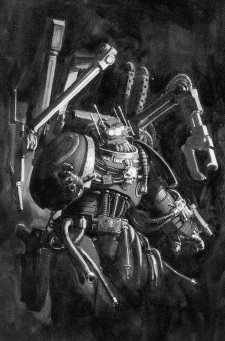

# 0262 铸造大师 Master of the Forge

精校状态：中文行文已逐段精校，部分术语仍为暂定

分类：通用概念 / 帝国 Imperium / 中央政务部 Adeptus Terra / 阿斯塔特修会 Adeptus Astartes

原文来源：https://www.bilibili.com/opus/1028220925955276808

原作者：帝国神选罐头

原文时间：2025年01月30日 20:22

[返回分类目录](目录.md) · [全书目录](../../目录.md)

<!-- A0262-B0001 -->
**英文原文**

The Master of the Forge is an honoured title with great responsibilities given to the chief weaponsmith responsible for managing the Armoury of a Space Marine Chapter. He is one of the Masters of a Chapter.

<!-- /A0262-B0001 -->

<!-- A0262-B0002 -->

原译文

铸造大师是一个荣誉称号，赋予了负责管理星际战士军械库的首席武器匠巨大的责任。他是一个战团的大师之一。

**校订译文**

铸造大师是一项备受尊崇、责任重大的职衔，授予负责管理星际战士战团军械库的首席武器匠。他也是战团高层的一员。

<!-- /A0262-B0002 -->

<!-- A0262-B0003 图片 -->

<!-- A0262-B0004 -->

原译文

Ultramarines Master of the Forge 极限战士铸造之主

**校订译文**

Ultramarines Master of the Forge 极限战士铸造大师

<!-- /A0262-B0004 -->

<!-- A0262-B0005 -->
## Overview 概述

<!-- /A0262-B0005 -->

<!-- A0262-B0006 -->
**英文原文**

These senior ranking Techmarines are charged with the maintenance of their Chapter's fleet of armoured vehicles and use their arcane knowledge of science that had been refined over centuries that rivals the most senior Techpriests of Mars. All of the Chapter's Techmarines, Servitors, Techno-mats and the slave workers of the Forge are under his command. Skills of the Masters of the Forge are refined to such an extent that they can determine the ailment of a Machine Spirit with a simple glance and recognise the cause of its intemperance from the whisper of its tortured mantra of function. Such a skill tends to make them somewhat of an outcast within the Chapter even though they are members of the Chapter Council. Despite this being the case, they are seen as outsiders to all but their subordinate Techmarines and are shunned in all matters except the mechanical. This isolation tends to further a Master of the Forge path into eccentricity as they are surrounded either by silent machines or witless Servitors. As a result, their own voice becomes atrophied and on the rare occasions when they do speak, they do so with a clipped, monotone, cold tone that is uncomfortably precise in detail as well as delivery.

<!-- /A0262-B0006 -->

<!-- A0262-B0007 -->

原译文

这些高级技术军士负责维护他们战团的装甲载具，并利用他们几个世纪以来完善的技术的神秘知识，与火星上最高级的技术神甫相媲美。该战团的所有技术军士、奴工、技术材料和铸造厂的奴隶工人都在他的指挥之下。铸造大师的技能被精炼到这样的程度，他们可以用简单的一瞥来确定机魂的疾病，并能从其痛苦的机械之语的低语中识别出其放纵的原因。尽管他们是战团议会的成员，但这种技能往往使他们在战团内有点被抛弃。尽管如此，他们被视为除了下属技术军士之外的所有人的局外人，除了机械之外，在所有事情上都被回避。这种隔离往往会使铸造大师的行动更加古怪，因为他们要么被沉默的机器包围，要么被愚蠢的奴工包围。因此，他们自己的声音变得萎缩，在极少数情况下，当他们说话时，他们会用一种简短、单调、冷酷的语调，在细节和表达上都非常精确。

**校订译文**

这些资深科技战士负责维护战团的装甲载具。他们耗费数百年精研神秘的科学知识，造诣足以比肩火星最高阶的技术祭司。战团的科技战士、机仆、技术工役及铸造厂奴工，均归其统辖。铸造大师的技艺精湛到了惊人的地步：只消一瞥，就能辨出机魂的病症；只听机械运转时那如受苦祷文般的低语，就能找出其失常的原因。然而，这种能力也使他们在战团中显得格格不入。尽管位列战团议会，除了麾下科技战士，其他人仍视他们为外人；若非机械事务，往往不愿与之往来。终日与沉默的机器和缺乏心智的机仆为伍，又使铸造大师更加孤僻古怪。他们的说话能力逐渐退化，偶尔开口时，语调也简短、单一而冰冷，无论内容细节还是表达方式，都精确得令人不适。

**校注：** Techno-mats 指铸造体系人员，此处暂译技术工役，不是技术材料；Servitors 为机仆，不是奴工。

<!-- /A0262-B0007 -->

<!-- A0262-B0008 -->
**英文原文**

Whilst this is generally the case, not all Chapters treat the Master of the Forge in this manner as the Mentors, Praetors of Orpheus and Astral Knights embrace the dwindling technology of Mankind without superstition whilst the Iron Hands relish in it. Amongst such Astartes, a Master of the Forge is an honoured individual that is equal to the Chapter Master himself though these are rare cases. In fact, those that follow such practices tend to be viewed with suspicion by their more conventional thinking Battle-Brothers.

<!-- /A0262-B0008 -->

<!-- A0262-B0009 -->

原译文

虽然情况通常如此，但并非所有战团都以这种方式看待铸造大师，像导师，俄耳甫斯执政官和星界骑士都毫无迷信观念地接受了人类日益减少的技术，而钢铁之手们却对此津津乐道。在这些阿斯塔特中，铸造大师是一个与战团长本人同等的荣誉人物，尽管这种情况很少见。事实上，那些遵循这种做法的人往往会被他们更传统的思维方式的“战斗兄弟”怀疑。

**校订译文**

不过，并非所有战团都如此对待铸造大师。导师战团、俄耳甫斯执政官与星界骑士，不带迷信地接纳人类日渐失传的技术；钢铁之手更对其推崇备至。在这些阿斯塔特中，铸造大师享有崇高地位，甚至与战团长平起平坐。不过，这种情况并不多见，持守传统的战斗兄弟也常对这些做法心存疑虑。

<!-- /A0262-B0009 -->

<!-- A0262-B0010 -->
**英文原文**

In addition to their responsibilities to the armoury, these weaponsmiths are charged with the responsibility of protecting the many technological relics that fall within the Chapter's care. Among the oldest and more famous Chapters, these can include mechanical wonders that remain sealed within their vaults with most being so complex that no living man is capable of learning their secrets. Others are created from ancient secrets that it requires artisans with a Master's knowledge to be able to use them without harming themselves or others. In times of need, a Master of the Forge is able to take these relics from the vaults in order to unleash the ancient lost technology of Mankind against their foes.

<!-- /A0262-B0010 -->

<!-- A0262-B0011 -->

原译文

除了对军械库的责任外，这些武器匠还负责保护属于该战团管辖范围内的许多技术遗物。在最古老、最著名的战团中，这些战团可能包括密封在密室中的机械奇迹，其中大多数都非常复杂，没有人能够了解它们的秘密。其他则是根据古老的秘密创造的，这需要具有大师知识的工匠能够在不伤害自己或他人的情况下使用它们。在需要的时候，铸造大师能够从密室中取出这些遗物，以释放人类古老的失落技术来对抗敌人。

**校订译文**

除管理军械库外，铸造大师还负责守护战团保管的众多技术遗物。某些历史悠久、声名显赫的战团，其宝库深处封存着不可思议的机械奇迹；许多复杂到当世已无人能够理解。另一些遗物依照古老秘法制成，只有具备铸造大师级别知识的工匠，才能在不伤及自己或他人的情况下使用。危急时刻，铸造大师便会取出这些遗物，以人类失落的古老技术对抗敌人。

<!-- /A0262-B0011 -->

<!-- A0262-B0012 -->
## Chapter Variations 各战团的不同做法

原题：Chapter Variations 战团变体

<!-- /A0262-B0012 -->

<!-- A0262-B0013 -->
### Master of the Rock 巨石之主

<!-- /A0262-B0013 -->

<!-- A0262-B0014 -->
**英文原文**

The Master of the Rock is a variation of the Master of the Forge used by the Dark Angels. Ominously different from standard Masters of the Forge, upon ascending to this honored position the Master of the Rock follows his predecessors by being permanently wired into the control system of the machine banks of The Rock. It is an important duty meant to placate the most important Machine Spirits, direct the maintenance engines and Warp Drives, and preserve the asteroids force fields. The previous Masters, whose bodies have completely withered, are left in place, their mechanical upgrades still working. Eventually they will be collected for display in the Alcoves of Honor of The Rock.

<!-- /A0262-B0014 -->

<!-- A0262-B0015 -->

原译文

巨石之主是黑暗天使使用的铸造大师的变体。与标准的铸造大师不同的是，在升至这一荣誉职位后，巨石之主跟随他的前任，永久地连接到巨石机械库的控制系统中。这是一项重要的职责，旨在安抚最重要的机魂，指导维护引擎和亚空间驱动器，并保护小行星的灵能场。之前的大师们的身体已经完全枯萎，他们的机械升级仍然有效。最终，它们将被收集起来，在巨石的荣誉壁龛中展示。

**校订译文**

巨石之主是黑暗天使对铸造大师这一职位的特殊称谓，其处境也比一般铸造大师更加阴森。就任后，他须效法历任前辈，将自身永久接入巨石要塞机械阵列的控制系统，负责安抚最重要的机魂，指挥引擎及亚空间驱动器的维护，并维持这座小行星要塞的防护力场。那些肉身已经彻底枯萎的前任，仍被留在原位，体内的机械部件继续运转。最终，他们才会被移走，陈列于巨石要塞的荣誉壁龛。

<!-- /A0262-B0015 -->

<!-- A0262-B0016 -->
**英文原文**

Because of their dual allegiances to the Chapter and the Adeptus Mechanicus, Techmarines are not inducted into the Deathwing or Inner Circle. This includes the Master of the Rock, who is privy only to the technological secrets and ancient technologies stored about the asteroid base.

<!-- /A0262-B0016 -->

<!-- A0262-B0017 -->

原译文

由于他们对战团和机械神教的双重忠诚，技术军士不会被纳入死翼或内环。这包括巨石之主，他只知道小行星基地的科技秘密和古代技术。

**校订译文**

科技战士同时效忠战团与机械修会，因此不会获准加入死翼或内环。巨石之主也不例外：他只能知晓这座小行星基地所保存的技术机密与古老科技。

<!-- /A0262-B0017 -->

<!-- A0262-B0018 -->
### Salamanders 火蜥蜴

<!-- /A0262-B0018 -->

<!-- A0262-B0019 -->
**英文原文**

The Salamanders have three Masters of the Forge. They assign armored vehicles and artillery to their Chapter's strike forces.

<!-- /A0262-B0019 -->

<!-- A0262-B0020 -->

原译文

火蜥蜴有三位铸造大师。他们为战团的打击部队分配装甲载具和火炮。

**校订译文**

火蜥蜴有三位铸造大师。他们为战团的打击部队分配装甲载具和火炮。

<!-- /A0262-B0020 -->

<!-- A0262-B0021 -->
## Equipment 装备

<!-- /A0262-B0021 -->

<!-- A0262-B0022 -->
**英文原文**

Masters of the Forge are equipped with: Servo-arms, Servo-harness and Conversion Beamers. Some carry the Mortis Machina, a relic Power Axe.

<!-- /A0262-B0022 -->

<!-- A0262-B0023 -->

原译文

铸造大师配备了：伺服臂、伺服套件和转换光束。有些人携带机械之死，一把古老的动力斧。

**校订译文**

铸造大师配备伺服臂、伺服套件与转化光束炮。有些人还携带名为“机械之死”的圣物动力斧。

<!-- /A0262-B0023 -->

<!-- A0262-B0024 -->
## Notable Masters of the Forge 著名铸造大师

<!-- /A0262-B0024 -->

<!-- A0262-B0025 -->
**英文原文**

Argos of the Salamanders

<!-- /A0262-B0025 -->

<!-- A0262-B0026 -->

原译文

火蜥蜴的阿尔戈斯

**校订译文**

火蜥蜴的阿尔戈斯

<!-- /A0262-B0026 -->

<!-- A0262-B0027 -->
**英文原文**

Armanneus Valthex of the Astral Claws

<!-- /A0262-B0027 -->

<!-- A0262-B0028 -->

原译文

星辰之爪的阿梅努斯·瓦尔泰克斯

**校订译文**

星辰之爪的阿梅努斯·瓦尔泰克斯

<!-- /A0262-B0028 -->

<!-- A0262-B0029 -->
**英文原文**

Atornus Geis of the Imperial Fists

<!-- /A0262-B0029 -->

<!-- A0262-B0030 -->

原译文

帝国之拳的阿托努斯·盖斯

**校订译文**

帝国之拳的阿托努斯·盖斯

<!-- /A0262-B0030 -->

<!-- A0262-B0031 -->
**英文原文**

Belaphor of the Dark Angels, known as the Warden of the Rock

<!-- /A0262-B0031 -->

<!-- A0262-B0032 -->

原译文

黑暗天使的贝拉福尔，巨石守望

**校订译文**

黑暗天使的贝拉福尔，称号为“巨石守望者”。

<!-- /A0262-B0032 -->

<!-- A0262-B0033 -->
**英文原文**

Feirros of the Iron Hands

<!-- /A0262-B0033 -->

<!-- A0262-B0034 -->

原译文

钢铁之手的费洛斯

**校订译文**

钢铁之手的费洛斯

<!-- /A0262-B0034 -->

<!-- A0262-B0035 -->
**英文原文**

Fennias Maxim of the Ultramarines

<!-- /A0262-B0035 -->

<!-- A0262-B0036 -->

原译文

极限战士的芬尼亚斯·马克西姆

**校订译文**

极限战士的芬尼亚斯·马克西姆

<!-- /A0262-B0036 -->

<!-- A0262-B0037 -->
**英文原文**

Javier Adon of the Crimson Fists

<!-- /A0262-B0037 -->

<!-- A0262-B0038 -->

原译文

绯红之拳的哈维尔・阿顿

**校订译文**

绯红之拳的哈维尔·阿顿

<!-- /A0262-B0038 -->

<!-- A0262-B0039 -->
**英文原文**

Incarael of the Blood Angels, known as the Master of the Blade

<!-- /A0262-B0039 -->

<!-- A0262-B0040 -->

原译文

圣血天使的因加瑞尔，刀锋之主

**校订译文**

圣血天使的因加瑞尔，刀锋之主

<!-- /A0262-B0040 -->

<!-- A0262-B0041 -->
**英文原文**

Isak Siavash of the Night Swords

<!-- /A0262-B0041 -->

<!-- A0262-B0042 -->

原译文

午夜领主的伊萨克·西亚瓦什

**校订译文**

夜剑的伊萨克·西亚瓦什

**校注：** Night Swords 暂译夜剑；原译午夜领主对应 Night Lords，属战团误认。

<!-- /A0262-B0042 -->

<!-- A0262-B0043 -->
**英文原文**

Regis Vortimer — of the Grey Knights

<!-- /A0262-B0043 -->

<!-- A0262-B0044 -->

原译文

灰骑士的雷吉斯·沃蒂默

**校订译文**

灰骑士的雷吉斯·沃蒂默

<!-- /A0262-B0044 -->

<!-- A0262-B0045 -->
**英文原文**

Su'Matr of the Salamanders. Later was encased in a Dreadnought

<!-- /A0262-B0045 -->

<!-- A0262-B0046 -->

原译文

火蜥蜴的苏马特，后来进入了无畏

**校订译文**

火蜥蜴的苏马特，后来被安置进无畏机甲。

<!-- /A0262-B0046 -->

<!-- A0262-B0047 -->
**英文原文**

T'kell of the Salamanders

<!-- /A0262-B0047 -->

<!-- A0262-B0048 -->

原译文

火蜥蜴的特凯尔

**校订译文**

火蜥蜴的特凯尔

<!-- /A0262-B0048 -->

<!-- A0262-B0049 -->
**英文原文**

Kor'hadron of the Salamanders

<!-- /A0262-B0049 -->

<!-- A0262-B0050 -->

原译文

火蜥蜴的科尔哈顿

**校订译文**

火蜥蜴的科尔哈顿

<!-- /A0262-B0050 -->

<!-- A0262-B0051 -->
**英文原文**

Rhoshan of the Salamanders

<!-- /A0262-B0051 -->

<!-- A0262-B0052 -->

原译文

火蜥蜴的罗尚

**校订译文**

火蜥蜴的罗尚

<!-- /A0262-B0052 -->

<!-- A0262-B0053 -->
**英文原文**

Vardan Kai of the Grey Knights, known as the Steward of the Armoury

<!-- /A0262-B0053 -->

<!-- A0262-B0054 -->

原译文

灰骑士的瓦尔丹·凯，军械库主管

**校订译文**

灰骑士的瓦尔丹·凯，军械库统筹者

**校注：** 已核同一人物、组织、型号或事件，与全书核心术语及后续专篇统一；原译保留对照。

<!-- /A0262-B0054 -->

<!-- A0262-B0055 -->
**英文原文**

Vorstecht of the Imperial Fists

<!-- /A0262-B0055 -->

<!-- A0262-B0056 -->

原译文

帝国之拳的沃施泰希特

**校订译文**

帝国之拳的沃施泰希特

<!-- /A0262-B0056 -->

本篇核心术语与暂定项

以下列出本篇出现的英文原形及核心术语表用词。同形词可能指不同对象，具体词义以本篇正文和校注为准；单复数、别名和仅见于图注的名称可能尚未列入。完整候选见[术语表](../../术语表/双语术语候选.csv)。

| 英文 | 采用中文 | 状态 |
| --- | --- | --- |
| Blood Angels | 圣血天使 | 官方已核对 |
| Dark Angels | 黑暗天使 | 官方已核对 |
| Grey Knights | 灰骑士 | 官方已核对 |
| Adeptus Mechanicus | 机械修会 | 官方已核对 |
| Ultramarines | 极限战士 | 官方已核对 |
| Warp | 亚空间 | 官方已核对 |
| Imperial Fists | 帝国之拳 | 暂定 |
| Iron Hands | 钢铁之手 | 暂定·官方待核 |
| Salamanders | 火蜥蜴 | 暂定·官方待核 |
| Mars | 火星 | 暂定·官方待核 |
| Master | 导师（审判庭职衔）／舰务官（舰员职务） | 语境定译·官方待核 |
| Master of the Forge | 铸造大师 | 暂定·官方待核 |
| Techno-mats | 技术工役（技术劳工）／技术机仆（机仆类别） | 语境定译·官方待核 |
| Mentors | 导师战团 | 暂定·官方待核 |
| Master of the Rock | 巨石之主 | 暂定·官方待核 |
| Alcoves of Honor | 荣誉壁龛 | 暂定·官方待核 |
| Mortis Machina | 机械之死 | 暂定·官方待核 |
| Night Swords | 夜剑 | 暂定·官方待核 |
| Ancient | 旗手 | 官方已核对 |
| Crimson Fists | 绯红之拳 | 暂定·官方待核 |
| Space Marine | 星际战士 | 暂定·官方待核 |
| Chapter | 战团 | 暂定·官方待核 |
| Chapter Master | 战团长 | 暂定·官方待核 |
| Praetors of Orpheus | 俄耳甫斯执政官 | 暂定·官方待核 |
| Armoury | 军械库 | 暂定·官方待核 |
| Astral Knights | 星界骑士 | 暂定·官方待核 |
| T'kell | 特凯尔 | 暂定·官方待核 |
| Dreadnought | 无畏机甲 | 暂定·官方待核 |
| Feirros | 费洛斯 | 暂定·官方待核 |
| Argos | 阿尔戈斯 | 暂定·官方待核 |
| Kor'hadron | 科尔’哈顿 | 暂定·官方待核 |
| Rhoshan | 罗尚 | 暂定·官方待核 |
| Steward of the Armoury | 军械库统筹者 | 暂定·官方待核 |
| Vardan Kai | 瓦尔丹·凯 | 暂定·官方待核 |
| Regis Vortimer | 雷吉斯·沃蒂默 | 暂定·官方待核 |
| The Dark | 《黑暗》 | 暂定·官方待核 |
| The Blood | 鲜血 | 暂定·官方待核 |
| System | 星系（恒星系统） | 暂定·官方待核 |
| Kai | 凯 | 暂定·官方待核 |
| Astral Claws | 星辰之爪 | 暂定·官方待核 |
| Servo-harness | 伺服套件 | 暂定·官方待核 |

