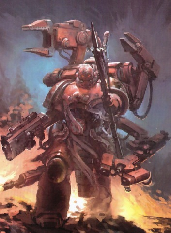
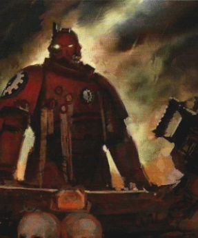
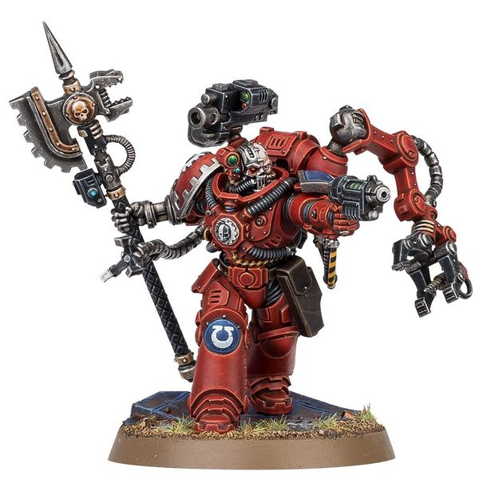
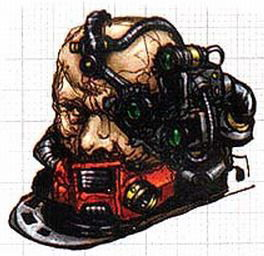
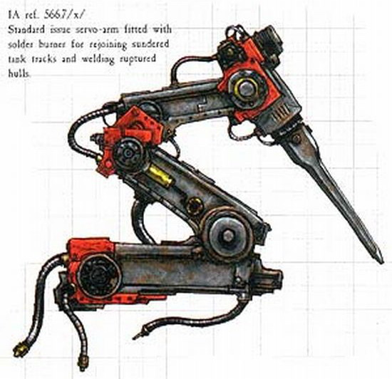

# 0263 科技战士 Techmarine

精校状态：中文行文已逐段精校，部分术语仍为暂定

分类：通用概念 / 帝国 Imperium / 中央政务部 Adeptus Terra / 阿斯塔特修会 Adeptus Astartes

原文来源：https://www.bilibili.com/opus/1035458280832368649

原作者：帝国神选罐头

原文时间：2025年02月19日 08:26

[返回分类目录](目录.md) · [全书目录](../../目录.md)

原篇名：技术军士 Techmarine

<!-- A0263-B0001 -->
**英文原文**

A Techmarine is an Adeptus Astartes with advanced technical knowledge and training. In addition to being battle-brothers to their fellow Space Marines, Techmarines (Frater Astrotechnicus) also serve as mechanics and technicians to their respective Chapters, similar to the Enginseers who serve in the Imperial Guard. They are marked out by the Machina Opus Honour Badge.

<!-- /A0263-B0001 -->

<!-- A0263-B0002 -->

原译文

技术军士是一种拥有先进技术知识和训练的阿斯塔特修会成员。除了是星际战士的战斗兄弟外，技术军士（机械神教修士）还担任各自战团的机械师和技术员，类似于在帝国卫队服役的工造士。他们被用机械齿轮荣誉徽章标记。

**校订译文**

科技战士是接受过进阶技术训练、掌握专门知识的阿斯塔特修会成员。他们既是其他星际战士的战斗兄弟，也是所属战团的机械师与技术员，其职责类似帝国卫队中的工造士。科技战士又称 Frater Astrotechnicus，以佩戴“机械之作”荣誉徽章为标志。

**校注：** Machina Opus 暂译机械之作；Frater Astrotechnicus 保留拉丁化原名，不据此改成机械修会成员。

<!-- /A0263-B0002 -->

<!-- A0263-B0003 图片 -->

<!-- A0263-B0004 -->

原译文

Techmarine 技术军士

**校订译文**

Techmarine 科技战士

<!-- /A0263-B0004 -->

<!-- A0263-B0005 -->
**英文原文**

In addition to their engineering roles, Techmarines are often the pilots of Space Marine tanks, gunships, and aircraft.

<!-- /A0263-B0005 -->

<!-- A0263-B0006 -->

原译文

除了他们的工程角色外，技术军士还经常是星际战士坦克、炮艇和飞行器的驾驶员。

**校订译文**

除工程职责外，科技战士还经常驾驶星际战士的坦克、炮艇与其他飞行器。

<!-- /A0263-B0006 -->

<!-- A0263-B0007 -->
## Overview 概述

<!-- /A0263-B0007 -->

<!-- A0263-B0008 -->
**英文原文**

Space Marine Chapters identify prospective Techmarines from within their own companies, favouring those who show the greatest affinity for machines. These aspirants are then sent to Mars for thirty years of training, where they are taught the lore of the Machine God, how to divine the Runes of Engineering and the Liturgy of Maintenance. This great body of lore must be fully understood and committed to memory by the novice Techmarine. A great deal of the thirty years of instruction involves learning each of the many and intricate maintenance rituals and hymns by heart. The rituals, furthermore, have variations to cover every conceivable circumstance in battle. A fully-fledged Techmarine is expected to be able to "feel" the pain of a damaged machine and heal it. After completing the training, the Techmarine is ordained, and returns to his Chapter. Techmarines pledge allegiance to both the Cult Mechanicus and their Chapter, which makes them something of an oddity among their battle-brothers. The highest position among the Techmarines is held by the Master of the Forge.

<!-- /A0263-B0008 -->

<!-- A0263-B0009 -->

原译文

星际战士战团从自己的连队内部确定潜在的技术军士，优先考虑那些对机械表现出最大亲和力的人。这些有志者随后被送往火星接受三十年的训练，在那里他们被传授万机神的知识，如何领悟工程符文和维护圣礼。新手技术军士必须充分理解并牢记这一伟大的知识体系。在三十年的教学中，有很多内容都涉及到熟记许多复杂的维护仪式和赞美诗。此外，仪式也有变化，以涵盖战斗中的每一种可能的情况。一个完全成熟的技术军士应该能够“感受”到受损机械的疼痛并治愈它。完成训练后，技术军士被任命，并返回他的战团。技术军士宣誓效忠机械神教和他们的战团，这使他们在战斗兄弟中显得有些奇怪。技术军士中的最高职位由铸造大师担任。

**校订译文**

星际战士战团从各连选拔科技战士候选人，尤其看重对机械最有亲和力的成员。他们随后被送往火星，接受长达三十年的训练，学习万机神的知识，以及如何解读工程符文、诵念维护礼文。见习者必须彻底理解并牢记这一庞大的知识体系。三十年训练中的很大一部分，便用于背诵复杂繁多的维护仪式与赞美诗；这些仪式还有种种变式，以应对战场上一切可以想象的情况。合格的科技战士应能“感受”受损机械的痛苦，并将其治愈。完成训练、接受授职后，他们才返回战团。他们同时宣誓效忠机械教派与所属战团，因此在战斗兄弟中颇显另类。科技战士中的最高职位，是铸造大师。

<!-- /A0263-B0009 -->

<!-- A0263-B0010 图片 -->

<!-- A0263-B0011 -->

原译文

Techmarine vehicle operator 技术军士车辆操作员

**校订译文**

Techmarine vehicle operator 驾驶载具的科技战士

<!-- /A0263-B0011 -->

<!-- A0263-B0012 -->
**英文原文**

A Techmarine's Power Armour is modified to accommodate his cybernetic enhancements and his armour's backpack is also upgraded with several servo-arms and mechadendrites. His armour bears the rust-red colours of the Adeptus Mechanicus, but his Chapter badge is retained and displayed on one of the shoulder guards, so as not to disrespect the armour's spirit. Techmarines are able to wear full servo-harnesses, huge harnesses armed with servo-arms, Forge Bolters, plasma cutters, and flamers. They commonly use a Grav-Pistol as a sidearm. Techmarines can also be accompanied by a retinue of Servitors; Gun Servitors, Combat Servitors, and Tech Servitors. Techmarines additionally make use of Cyber-familiars in their retinue, a term that encompasses a variety of semi-autonomous devices such as servo-skulls, mek-spiders and other smaller drone units and lesser haemonculites tied into the direct neural control of their operator. These minion-drones are an extension of their master's will and provide them with a host of additional senses and capabilities. Their usual weapon is an Omnissian Power Axe with the Adeptus Mechanicus symbol on the head, as both a symbol of rank and as a weapon.

<!-- /A0263-B0012 -->

<!-- A0263-B0013 -->

原译文

技术军士的动力盔甲经过改装，以适应他的智控增强，他的披甲的背包也升级了几个伺服臂和机械触须。他的盔甲是机械神教的铁锈红色，但他的战团徽章被保留并展示在其中一个肩甲上，以免不尊重盔甲的机魂。技术军士能够佩戴全套伺服套件、配备伺服臂的巨大背带、铸炉爆矢枪、等离子切割枪和火焰枪。他们通常使用重力手枪作为武器。技术军士也可以由机仆陪同；枪炮机仆、战斗机仆和技术机仆。技术军士还在他们的机仆中使用智控单位，这个术语包括各种半自主设备，如伺服头骨、机械蜘蛛和其他较小的无人机单位，以及与操控者直接神经控制相连的低级刑讯者。这些仆从无人机是主人意志的延伸，为他们提供了许多额外的感官和能力。他们常用的武器是欧姆尼赛亚动力斧，头上有机械神教符号，既是等级的象征，也是武器。

**校订译文**

科技战士的动力甲经过改造，以适应其机械强化部件；背包也加装了多条伺服臂与机械触须。护甲采用机械修会的铁锈红色，但会在一侧肩甲保留战团徽记，以免冒犯护甲的机魂。他们还能配备完整的伺服套件：这种巨大的支架可搭载伺服臂、铸炉爆矢枪、等离子切割器与喷火器。重力手枪则是常见的随身武器。科技战士往往带着机仆随从，包括枪炮机仆、战斗机仆与技术机仆。他们也使用统称为“智控魔宠”的半自主装置，例如伺服颅骨、机械蜘蛛、其他小型无人装置，以及直接接入操作者神经控制的小型人造生物。这些随从装置是主人意志的延伸，赋予其额外的感官与能力。他们通常还携带欧姆尼赛亚动力斧，斧首饰有机械修会的标志，既是身份象征，也是作战武器。

**校注：** Cyber-familiars 暂译智控魔宠；lesser haemonculites 暂作小型人造生物，非刑讯者，具体中文定名待核。

<!-- /A0263-B0013 -->

<!-- A0263-B0014 图片 -->

<!-- A0263-B0015 -->

原译文

Primaris Techmarine 原铸技术军士

**校订译文**

Primaris Techmarine 原铸科技战士

<!-- /A0263-B0015 -->

<!-- A0263-B0016 -->
**英文原文**

It is known that many Techmarines personalise their colours, like having both their left pauldron and arm in their chapter colour; having their left pauldron, arm and knee in their chapter colour; only having their helmet, right pauldron, servo-arms and areas around their Machina Opus symbols in red; only having their helmet, right pauldron, servo-arms and areas around their gut Machina Opus symbol in red; or only having their helmet, right pauldron and knee, and servo-arms in red.

<!-- /A0263-B0016 -->

<!-- A0263-B0017 -->

原译文

众所周知，许多技术军士会个性化他们的颜色，比如将他们的左肩甲和手臂都涂成战团的颜色；他们的左肩甲、手臂和膝盖都是战团的颜色；他们的头盔、右肩甲、伺服臂和机械齿轮符号周围的区域都是红色的；他们的头盔、右肩甲、伺服臂和红色机械齿轮符号周围的区域；或者只戴着红色的头盔、右肩甲和膝盖，以及伺服臂。

**校订译文**

许多科技战士会自行调整护甲配色。例如，有人让左肩甲和左臂保留战团色；有人将左侧肩甲、手臂和膝甲都涂成战团色；有人只将头盔、右肩甲、伺服臂及“机械之作”徽记周围涂红；有人采用类似方案，但所保留的红色纹饰特指腹部徽记周围；也有人仅将头盔、右肩甲、右膝甲和伺服臂涂红。

<!-- /A0263-B0017 -->

<!-- A0263-B0018 -->
**英文原文**

Many Chaos Obliterators are said to be the former Techmarines of the Traitor Legions.

<!-- /A0263-B0018 -->

<!-- A0263-B0019 -->

原译文

据说许多混沌泯灭者都是叛徒军团的前技术军士。

**校订译文**

据说，许多混沌泯灭者都曾是叛变军团的科技战士。

<!-- /A0263-B0019 -->

<!-- A0263-B0020 -->
### Techmarine Novitiate 见习科技战士

原题：Techmarine Novitiate 新手技术军士

<!-- /A0263-B0020 -->

<!-- A0263-B0021 -->
**英文原文**

Techmarine Novitiates are junior Techmarines still undergoing their training. They often serve as pilots for Space Marine tanks and aircraft.

<!-- /A0263-B0021 -->

<!-- A0263-B0022 -->

原译文

新手技术军士是仍在接受训练的初级技术军士。他们经常担任星际战士坦克和飞机的驾驶员。

**校订译文**

见习科技战士是尚在接受训练的初级成员，常担任星际战士坦克与飞行器的驾驶员。

<!-- /A0263-B0022 -->

<!-- A0263-B0023 -->
### Equipment 装备

<!-- /A0263-B0023 -->

<!-- A0263-B0024 图片 -->

<!-- A0263-B0025 -->

原译文

Bionic augmentation including a Mark 3 Signum that is often used by Techmarine Adepts 仿生增强，包括机械修会经常使用的Mark 3标志

**校订译文**

Bionic augmentation including a Mark 3 Signum that is often used by Techmarine Adepts 机械强化部件，包括科技战士常用的 III 型目标指示器

**校注：** Signum 为瞄准设备，暂译目标指示器；Techmarine Adepts 指科技战士，原译机械修会误把人员当组织。

<!-- /A0263-B0025 -->

<!-- A0263-B0026 图片 -->

<!-- A0263-B0027 -->

原译文

Standard Servo-arm bionic attachment fitted with solder burner, often employed by Techmarines for vehicle repairs in the field 配备焊接头的标准伺服臂仿生附件，通常由技术军士用于现场车辆维修

**校订译文**

Standard Servo-arm bionic attachment fitted with solder burner, often employed by Techmarines for vehicle repairs in the field 装有焊炬的标准伺服臂机械附件，科技战士常用其在野外维修载具

<!-- /A0263-B0027 -->

<!-- A0263-B0028 -->
## Chapter Variants 各战团的不同称谓

原题：Chapter Variants 战团变体

<!-- /A0263-B0028 -->

<!-- A0263-B0029 -->
**英文原文**

Grey Knights Techmarine - Grey Knights

<!-- /A0263-B0029 -->

<!-- A0263-B0030 -->

原译文

灰骑士技术军士 - 灰骑士

**校订译文**

灰骑士科技战士——灰骑士

<!-- /A0263-B0030 -->

<!-- A0263-B0031 -->
**英文原文**

Iron Father — Iron Hands

<!-- /A0263-B0031 -->

<!-- A0263-B0032 -->

原译文

铁父 — 钢铁之手

**校订译文**

钢铁圣父——钢铁之手

<!-- /A0263-B0032 -->

<!-- A0263-B0033 -->
**英文原文**

Forge-Wright — Sons of Medusa

<!-- /A0263-B0033 -->

<!-- A0263-B0034 -->

原译文

铸炉工匠 — 美杜莎之子

**校订译文**

铸炉工匠 — 美杜莎之子

<!-- /A0263-B0034 -->

<!-- A0263-B0035 -->
**英文原文**

Iron Priest — Space Wolves

<!-- /A0263-B0035 -->

<!-- A0263-B0036 -->

原译文

钢铁祭司 — 太空野狼

**校订译文**

钢铁牧师——太空野狼

<!-- /A0263-B0036 -->

<!-- A0263-B0037 -->
**英文原文**

Brother-Adept — Star Phantoms

<!-- /A0263-B0037 -->

<!-- A0263-B0038 -->

原译文

技师修士 — 星空幻影

**校订译文**

技师修士 — 星辰幻影

**校注：** 已核同一人物、组织、型号或事件，与全书核心术语及后续专篇统一；原译保留对照。

<!-- /A0263-B0038 -->

<!-- A0263-B0039 -->
**英文原文**

The Emperor's Spears group together their Techmarines with their Apothecaries, Chaplains and Librarians under the title Druids, who all have black armour. These warrior-priests each stand ready to harvest the gene-seed of fallen brothers, as well as performing their own duties based on their specialist skills and esoteric abilities.

<!-- /A0263-B0039 -->

<!-- A0263-B0040 -->

原译文

帝皇之矛将他们的技术军士与他们的药剂师、牧师和智库聚合在一起，统称为德鲁伊，他们都穿着黑色盔甲。这些战斗牧师随时准备收获牺牲兄弟的基因种子，并根据他们的专业技能和深奥能力履行自己的职责。

**校订译文**

帝皇之矛将科技战士、药剂师、教士和智库员统称为德鲁伊，全部身穿黑甲。这些战斗祭司既须随时准备回收阵亡兄弟的基因种子，也根据各自的专门技能与秘传能力，履行本职工作。

<!-- /A0263-B0040 -->

<!-- A0263-B0041 -->
## Notable Techmarines 著名科技战士

原题：Notable Techmarines 著名技术军士

<!-- /A0263-B0041 -->

<!-- A0263-B0042 -->
**英文原文**

Abrahim Kobal — Salamanders, see also his quotes

<!-- /A0263-B0042 -->

<!-- A0263-B0043 -->

原译文

阿布拉希姆·科巴尔 — 火蜥蜴，另见他的语录

**校订译文**

阿布拉希姆·科巴尔 — 火蜥蜴，另见他的语录

<!-- /A0263-B0043 -->

<!-- A0263-B0044 -->
**英文原文**

Aviren — Iron Hands

<!-- /A0263-B0044 -->

<!-- A0263-B0045 -->

原译文

阿维伦 — 钢铁之手

**校订译文**

阿维伦 — 钢铁之手

<!-- /A0263-B0045 -->

<!-- A0263-B0046 -->
**英文原文**

Martellus — Blood Ravens

<!-- /A0263-B0046 -->

<!-- A0263-B0047 -->

原译文

马特勒斯 — 血鸦

**校订译文**

马特勒斯 — 血鸦

<!-- /A0263-B0047 -->

<!-- A0263-B0048 -->
**英文原文**

Paullian Blantar — Iron Hands

<!-- /A0263-B0048 -->

<!-- A0263-B0049 -->

原译文

帕利安·布兰塔尔 — 钢铁之手

**校订译文**

保利安·布兰塔尔 — 钢铁之手

**校注：** 已核同一人物、组织、型号或事件，与全书核心术语及后续专篇统一；原译保留对照。

<!-- /A0263-B0049 -->

<!-- A0263-B0050 -->
**英文原文**

Sevano Tomasin — Ultramarines

<!-- /A0263-B0050 -->

<!-- A0263-B0051 -->

原译文

塞瓦诺·托马辛 — 极限战士

**校订译文**

塞瓦诺·托马辛 — 极限战士

<!-- /A0263-B0051 -->

<!-- A0263-B0052 -->
**英文原文**

Vexos — Ultramarines

<!-- /A0263-B0052 -->

<!-- A0263-B0053 -->

原译文

维克索斯 — 极限战士

**校订译文**

维克索斯 — 极限战士

<!-- /A0263-B0053 -->

<!-- A0263-B0054 -->
**英文原文**

Skvarl Cogfang — Space Wolves

<!-- /A0263-B0054 -->

<!-- A0263-B0055 -->

原译文

斯卡尔·齿牙 — 太空野狼

**校订译文**

斯卡尔·齿牙 — 太空野狼

<!-- /A0263-B0055 -->

<!-- A0263-B0056 -->
**英文原文**

Shen'ra — Salamanders

<!-- /A0263-B0056 -->

<!-- A0263-B0057 -->

原译文

申拉 — 火蜥蜴

**校订译文**

申拉 — 火蜥蜴

<!-- /A0263-B0057 -->

本篇核心术语与暂定项

以下列出本篇出现的英文原形及核心术语表用词。同形词可能指不同对象，具体词义以本篇正文和校注为准；单复数、别名和仅见于图注的名称可能尚未列入。完整候选见[术语表](../../术语表/双语术语候选.csv)。

| 英文 | 采用中文 | 状态 |
| --- | --- | --- |
| Space Marines | 星际战士 | 官方已核对 |
| Adeptus Astartes | 阿斯塔特修会 | 官方已核对 |
| Grey Knights | 灰骑士 | 官方已核对 |
| Space Wolves | 太空野狼 | 官方已核对 |
| Adeptus Mechanicus | 机械修会 | 官方已核对 |
| Imperial Guard | 帝国卫队 | 暂定·语境区分 |
| Ultramarines | 极限战士 | 官方已核对 |
| Cult Mechanicus | 机械教派 | 暂定·概念区分 |
| Blood Ravens | 血鸦 | 暂定 |
| Techmarine | 科技战士 | 官方已核对 |
| Emperor | 帝皇 | 官方已核对 |
| Iron Hands | 钢铁之手 | 暂定·官方待核 |
| Machine God | 万机神 | 暂定·官方待核 |
| Salamanders | 火蜥蜴 | 暂定·官方待核 |
| Mars | 火星 | 暂定·官方待核 |
| Medusa | 美杜莎 | 暂定·官方待核 |
| Tech | 技术语 | 暂定·官方待核 |
| Master | 导师（审判庭职衔）／舰务官（舰员职务） | 语境定译·官方待核 |
| Druids | 德鲁伊 | 暂定·官方待核 |
| Iron Father | 钢铁圣父 | 暂定·官方待核 |
| Master of the Forge | 铸造大师 | 暂定·官方待核 |
| Machina Opus | 机械之作 | 暂定·官方待核 |
| Cyber-familiars | 智控魔宠 | 暂定·官方待核 |
| lesser haemonculites | 小型人造生物 | 暂定·官方待核 |
| Omnissian Power Axe | 欧姆尼赛亚动力斧 | 暂定·官方待核 |
| Iron Priest | 钢铁牧师 | 官方已核对 |
| Adept | 帝国任职者（广义）／文吏（行政语境） | 语境定译·官方待核 |
| Shen'ra | 申’拉 | 暂定·官方待核 |
| Power Armour | 动力盔甲 | 暂定·官方待核 |
| Space Marine | 星际战士 | 暂定·官方待核 |
| Chapter | 战团 | 暂定·官方待核 |
| Brother | 修士 | 暂定·官方待核 |
| Star Phantoms | 星辰幻影 | 暂定·官方待核 |
| Emperor's Spears | 帝皇之矛 | 暂定·官方待核 |
| Sons of Medusa | 美杜莎之子 | 暂定·官方待核 |
| Gene-seed | 基因种子 | 暂定·官方待核 |
| Host | 天军 | 暂定·官方待核 |
| Flamers | 火妖（奸奇单位）／火焰喷射器（武器） | 语境定译·对应官译已核 |
| Mek | 蛮人技师 | 官方已核对 |
| Paullian Blantar | 保利安·布兰塔尔 | 暂定·官方待核 |
| Chaplains | 教士 | 暂定·官方待核 |
| Gun | 甘 | 暂定·官方待核 |
| Martellus | 马特勒斯 | 暂定·官方待核 |
| Obliterators | 泯灭者 | 官方已核 |
| Grav-Pistol | 重力手枪 | 暂定·官方待核 |
| Mechadendrites | 机械触须 | 暂定·官方待核 |

