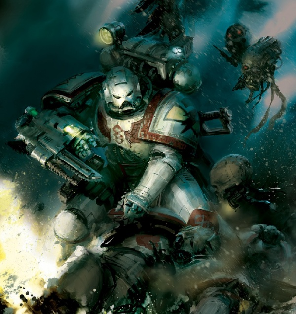
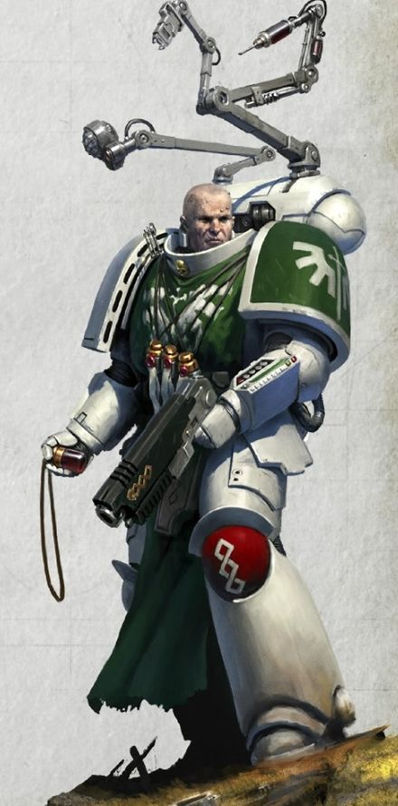
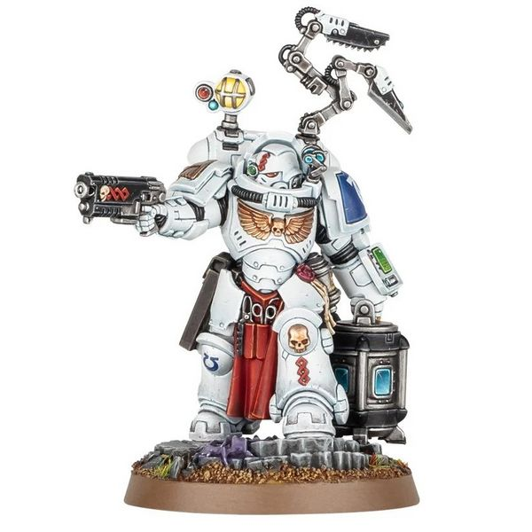
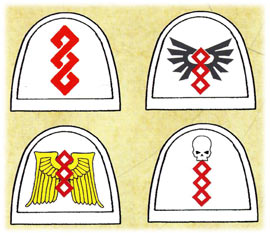
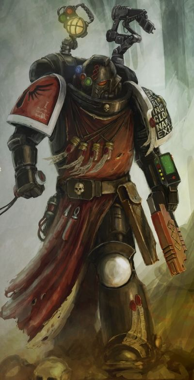
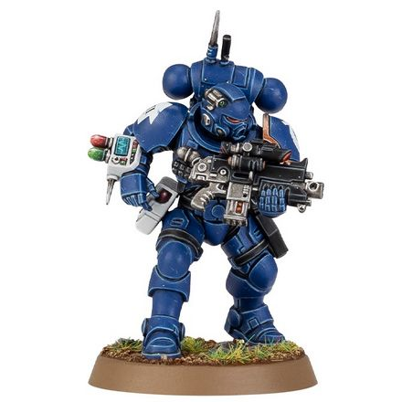
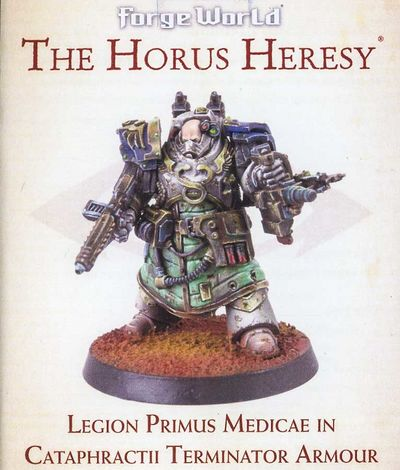

# 0265 药剂师 Apothecaries

精校状态：中文行文已逐段精校，部分术语仍为暂定

分类：通用概念 / 帝国 Imperium / 中央政务部 Adeptus Terra / 阿斯塔特修会 Adeptus Astartes

原文来源：https://www.bilibili.com/opus/1018379180160581652

原作者：帝国神选罐头

原文时间：编辑于 2025年02月06日 18:32

[返回分类目录](目录.md) · [全书目录](../../目录.md)

<!-- A0265-B0001 -->
**英文原文**

He that may fight, heal him. He that may fight no more, give him peace. He that is dead, take from him the Chapter's due. While his geneseed returns to the Chapter, a Space Marine cannot die. Without death, pain loses its relevance.

<!-- /A0265-B0001 -->

<!-- A0265-B0002 -->
**英文原文**

— Master of the Apothecarion Aslon Marr

<!-- /A0265-B0002 -->

<!-- A0265-B0003 -->

原译文

那可能战斗之人，治愈他。那可能不再战斗之人，给予他安宁。那已死亡之人，从他身上取走战团应得之物。当他的基因种子回归战团时，一名星际战士不会真正死亡。没有死亡，痛苦便失去了其意义。

**校订译文**

尚能再战者，治愈他；再也无法战斗者，赐他安宁；已经死去者，从他身上取回战团应得之物。只要基因种子重归战团，星际战士便不会真正死去。死亡既已不复存在，痛苦也便失去了意义。

<!-- /A0265-B0003 -->

<!-- A0265-B0004 -->

原译文

— 药剂部之主阿斯伦·马尔

**校订译文**

——药剂大师阿斯隆·玛尔

<!-- /A0265-B0004 -->

<!-- A0265-B0005 -->
**英文原文**

Apothecaries are Space Marines with special medical training. Their role in battle is to recover the Chapter's gene-seed from killed Marines and to tend to the wounded. Outside of combat, Apothecaries are responsible for monitoring recruits and neophytes for mutation or flaws in their gene-seed organs and implants.

<!-- /A0265-B0005 -->

<!-- A0265-B0006 -->

原译文

药剂师是受过特殊医学训练的星际战士。他们在战斗中的作用是从阵亡的星际战士身上提取战团的基因种子，并照顾伤员。在战斗之外，药剂师负责监测新兵和新进者的基因种子器官和植入物中的突变或缺陷。

**校订译文**

药剂师是接受过专门医学训练的星际战士。战斗中，他们负责救治伤员，并从阵亡战士身上回收战团的基因种子。平时，他们也监测新招募者与受训新兵，检查其基因种子器官和其他植入物是否存在突变或缺陷。

<!-- /A0265-B0006 -->

<!-- A0265-B0007 图片 -->

<!-- A0265-B0008 -->

原译文

White Scars Firstborn Apothecary 白疤长子药剂师

**校订译文**

White Scars Firstborn Apothecary 白疤长子星际战士药剂师

<!-- /A0265-B0008 -->

<!-- A0265-B0009 -->
## Overview 概述

<!-- /A0265-B0009 -->

<!-- A0265-B0010 -->
**英文原文**

The Apothecary's role is to serve as a field medic and bio-researcher. Along with being highly trained in medicine, they are among the elite warriors in the chapter.

<!-- /A0265-B0010 -->

<!-- A0265-B0011 -->

原译文

药剂师的角色是作为一名现场医生和生物研究者。除了在医学方面受过严格训练外，他们还是本战团中的精英战士之一。

**校订译文**

药剂师既是战地医师，也是生物研究者。他们不仅医术精湛，还是战团中的精锐战士。

<!-- /A0265-B0011 -->

<!-- A0265-B0012 图片 -->

<!-- A0265-B0013 -->

原译文

Dark Angels Primaris Apothecary 黑暗天使原铸药剂师

**校订译文**

Dark Angels Primaris Apothecary 黑暗天使原铸药剂师

<!-- /A0265-B0013 -->

<!-- A0265-B0014 -->
**英文原文**

Apothecaries are greatly honoured within the Chapter, as they are responsible for maintaining the purity of its gene-seed. If its gene-seed were to become mutated, it could well bring the Chapter's extinction or its fall to Chaos. The Apothecaries are charged with maintaining the health and genetic purity of the Space Marines. Their skills and equipment, when combined with the added organs and resilience of a Space Marine, allow an Apothecary to perform battle surgery with a good chance of success.

<!-- /A0265-B0014 -->

<!-- A0265-B0015 -->

原译文

药剂师在本战团中受到极大的尊重，因为他们负责保持其基因种子的纯度。如果战团的基因种子发生突变，很可能会导致该战团灭绝或堕入混沌。药剂师负责维护星际战士的健康和基因纯洁。他们的技能和装备，再加上星际战士的额外器官和恢复力，使药剂师能够很好地进行战斗手术。

**校订译文**

药剂师负责维持战团基因种子的纯净，因此深受尊崇。基因种子一旦发生突变，可能使整个战团灭绝，或堕入混沌。他们守护星际战士的身体健康与遗传纯度；凭借专业技能和装备，再加上星际战士额外植入的器官及其强大生命力，即使在战场上动手术，也有相当高的成功机会。

<!-- /A0265-B0015 -->

<!-- A0265-B0016 -->
**英文原文**

Not all wounded Marines can be saved; some are beyond even the Apothecary's skills. In this case, it is the Apothecary's responsibility to administer "the Emperor's Peace" (euthanasia) to those warriors who deserve it. The Apothecary's medi-pack (known as a Narthecium) includes a special humane killer for this task, called a Carnifex — a solid spring-loaded piston of metal. This is applied to the sufferer's temple, its powerful spring hurling the piston through the Marine's brain and killing him instantly.

<!-- /A0265-B0016 -->

<!-- A0265-B0017 -->

原译文

并非所有受伤的星际战士都能获救；有些甚至超出了药剂师的技能。在这种情况下，药剂师有责任为那些应得的战士实施“帝皇的安宁”（安乐死）。药剂师的医疗包（称为医疗套件）包括一种特殊的仁慈杀手，称为刽子手 — 一种坚固的弹簧式金属活塞。用于患者的太阳穴，其强力的弹簧将活塞穿过星际战士的大脑，立即杀死他。

**校订译文**

并非每名伤员都能获救，有些伤势即使药剂师也无能为力。此时，他便有责任向这些战士施以“帝皇的安宁”，即安乐死。药剂师的医疗套件中，装有一件专为此用的器械，称为“刽子手”：一根由强力弹簧驱动的实心金属活塞。将其抵住伤员的太阳穴并启动，活塞便会穿入大脑，使战士立即死去。

**校注：** 此处 Carnifex 为医疗器械，暂保留刽子手；勿与同名泰伦生物混同。

<!-- /A0265-B0017 -->

<!-- A0265-B0018 -->
**英文原文**

It is also the Apothecary's duty to harvest from the bodies' of fallen Marines the two implanted Progenoid glands, allowing for the gene-seed material to be cultivated and re-implanted in a Neophyte. Marines rarely go into battle without an Apothecary being available, as every Marine is a valuable resource and to lose any of their gene-seed would be a blow to the Chapter.

<!-- /A0265-B0018 -->

<!-- A0265-B0019 -->

原译文

药剂师还有责任从阵亡星际战士的尸体上采集两个植入的基因腺体，以便将基因种子材料被培育并重新植入新进者体内。星际战士很少在没有药剂师的情况下投入战斗，因为每个星际战士都是一种宝贵的资源，失去他们中的任何一个的基因种子都会对本战团造成打击。

**校订译文**

药剂师还须从阵亡星际战士身上取出两枚植入的基因存收腺，以便培育其中的基因种子材料，用于后续新兵的植入程序。星际战士极少在没有药剂师可提供支援的情况下出战：每名战士都弥足珍贵，任何一份基因种子的损失，都会重创战团。

**校注：** Progenoid glands 暂译基因存收腺；与泛称基因种子分开登记。

<!-- /A0265-B0019 -->

<!-- A0265-B0020 -->
**英文原文**

Each Company in a Chapter has an attached Apothecary that accompanies them into battle. Additional Apothecaries staff the Apothecarion, although they rarely take to the field, instead acting as bio-researchers and occupying themselves in taking part in the training of Neophytes and potential new Apothecaries.

<!-- /A0265-B0020 -->

<!-- A0265-B0021 -->

原译文

一个战团中的每个连队都有一个附属的药剂师陪同他们参加战斗。额外的药剂师为药剂部服务，尽管他们很少到现场，而是作为生物研究人员，致力于参与新进者和潜在的新药剂师的培训。

**校订译文**

战团每个连都配属一名随队出征的药剂师。其他药剂师则在药剂部任职，通常不赴前线，而是从事生物研究，并参与新兵及药剂师候选人的训练。

<!-- /A0265-B0021 -->

<!-- A0265-B0022 -->
**英文原文**

Apothecaries that seek to understand Xenos biology and collect samples from such foes in order to better combat them in the future are known as an Apothecary Biologis

<!-- /A0265-B0022 -->

<!-- A0265-B0023 -->

原译文

寻求了解异型生物学并从这些敌人那里收集样本以在未来更好地对抗它们的药剂师被称为生物药剂师

**校订译文**

研究异形生物学、采集敌人样本以便今后更有效地对抗它们的药剂师，称为生物药剂师。

<!-- /A0265-B0023 -->

<!-- A0265-B0024 图片 -->

<!-- A0265-B0025 -->

原译文

Apothecary Biologis 生物药剂师

**校订译文**

Apothecary Biologis 生物药剂师

<!-- /A0265-B0025 -->

<!-- A0265-B0026 -->
## Heraldry 纹章

<!-- /A0265-B0026 -->

<!-- A0265-B0027 -->
**英文原文**

The insignia of the Apothecaries is the prime helix, rendered in bright red. The symbol represents the sacred code of the Chapter's gene-seed. The helix symbol is often adorned with additional iconography such as wings and skulls.

<!-- /A0265-B0027 -->

<!-- A0265-B0028 -->

原译文

药剂师的徽章是亮红色的至高螺旋。这个符号代表了战团基因种子的神圣代码。螺旋符号通常装饰有额外的标志，如翅膀和头骨。

**校订译文**

药剂师的徽记是鲜红色的至高螺旋，象征战团基因种子的神圣密码。螺旋周围常饰以羽翼、骷髅等图案。

<!-- /A0265-B0028 -->

<!-- A0265-B0029 图片 -->

<!-- A0265-B0030 -->

原译文

Prime Helix symbol and variants 至高螺旋标志和变体

**校订译文**

Prime Helix symbol and variants 至高螺旋标志和变体

<!-- /A0265-B0030 -->

<!-- A0265-B0031 -->
**英文原文**

The Apothecaries of most Chapters wear white power armor, with the left shoulder plate retaining the Chapter colors along with the Chapter symbol. The right shoulder armor displays the prime helix. Some less traditional Chapters use different schemes.

<!-- /A0265-B0031 -->

<!-- A0265-B0032 -->

原译文

大多数战团的药剂师都穿着白色的护甲，左肩甲保留了战团的颜色和战团的标志。右肩甲显示了至高螺旋。一些不太传统的战团使用不同的方案。

**校订译文**

大多数战团的药剂师身穿白色动力甲，左肩甲保留战团配色与徽记，右肩甲则绘有至高螺旋。一些不拘传统的战团，也采用不同的配色方案。

<!-- /A0265-B0032 -->

<!-- A0265-B0033 -->
**英文原文**

It it known that many Apothecaries personalise their colours, like having only the helix on their helmet's brow and their right shoulder plate in white, only their Narthecium, helmet, right right shoulder plate and knee in white, only their Narthecium, the bracer it's on, helmet, left shoulder plate trim, right right shoulder plate and knee in white, only their narthecium, the bracer it's on, right shoulder plate trim in white, with the right shoulder plate in red with a white helix on it, their armour bone coloured instead of white, both their pauldrons in Chapter's colours, only their helmet in their Chapter's colours, and some Apothecaries keep fully to their Chapter's standard colours.

<!-- /A0265-B0033 -->

<!-- A0265-B0034 -->

原译文

众所周知，许多药剂师会个性化他们的颜色，比如仅头盔额头的螺旋和右肩甲为白色，仅他们的医疗套件、头盔、右肩甲和膝甲为白色，仅他们的医疗套件、所佩戴的护腕、头盔、左肩甲镶边、右肩甲和膝甲为白色，仅他们的医疗套件、所佩戴的护腕、右肩甲镶边为白色，右肩甲为红色且上面有一个白色螺旋，他们的盔甲为骨色而非白色，他们的两个肩甲为其所在战团的颜色，仅他们的头盔为其所在战团的颜色，还有一些药剂师完全遵循其所在战团的标准颜色。

**校订译文**

许多药剂师会自行调整配色。例如，有人仅将头盔额部的螺旋与右肩甲涂白；有人让医疗套件、头盔、右肩甲和膝甲呈白色；有人在此基础上，再将安装医疗套件的护腕及左肩甲边缘涂白。还有人只把医疗套件、相应护腕与右肩甲边缘涂白，右肩甲主体则涂红，并绘上白色螺旋。另一些人用骨白色代替纯白，或让两侧肩甲保留战团色，或仅让头盔保留战团色；也有人完全沿用本战团的标准配色。

<!-- /A0265-B0034 -->

<!-- A0265-B0035 -->
## Chapter Variations 各战团的不同做法

原题：Chapter Variations 战团变体

<!-- /A0265-B0035 -->

<!-- A0265-B0036 -->
**英文原文**

The Blood Angels Apothecaries bear the honourary title Sanguinary Priest. In addition to their roles as medics and overseeing the induction of new recruits, the Sanguinary Priests share a role with the Angels' Chaplains in watching over their battle-brothers' spiritual well-being, guarding against the influence of the Red Thirst and the Black Rage.

<!-- /A0265-B0036 -->

<!-- A0265-B0037 -->

原译文

圣血天使药剂师享有圣血祭司的荣誉称号。除了担任医务人员和监督新兵的入职培训外，圣血祭司还与天使牧师共同监督他们的战斗兄弟的精神健康，防范血渴和黑怒的影响。

**校订译文**

圣血天使的药剂师享有“圣血祭司”的荣誉称号。他们除救治伤员、监督新兵加入战团外，还与教士共同维护战斗兄弟的精神健康，防范血渴与黑怒的侵袭。

<!-- /A0265-B0037 -->

<!-- A0265-B0038 -->
**英文原文**

The Wolf Priests of the Space Wolves combine the roles of Apothecary and Chaplain within their Great Companies. They also prefer not to use Codex medical equipment but instead use healing potions and balms, the knowledge passed down through the generations.

<!-- /A0265-B0038 -->

<!-- A0265-B0039 -->

原译文

太空野狼的狼牧师在他们的大连中结合了药剂师和牧师的角色。他们也不喜欢使用圣典医疗设备，而是使用代代相传的治疗药水和香膏。

**校订译文**

太空野狼的狼牧师，在所属大连内兼任药剂师与教士。他们偏好代代相传的疗伤药剂与药膏，而不采用《阿斯塔特圣典》规定的医疗装备。

<!-- /A0265-B0039 -->

<!-- A0265-B0040 -->
**英文原文**

The Emperor's Spears group together their Apothecaries with their Chaplains, Techmarines, and Librarians under the title Druids, who all have black armour. These warrior-priests each stand ready to harvest the gene-seed of fallen brothers, as well as performing their own duties based on their specialist skills and esoteric abilities.

<!-- /A0265-B0040 -->

<!-- A0265-B0041 -->

原译文

帝皇之矛将他们的药剂师、牧师、技术军士和智库整合在一起，他们的头衔都是德鲁伊，他们都穿着黑色盔甲。这些战士牧师随时准备收割牺牲兄弟的基因种子，并根据他们的专业技能和秘传能力履行自己的职责。

**校订译文**

帝皇之矛将药剂师、教士、科技战士和智库员统称为德鲁伊，全部身穿黑甲。这些战斗祭司既须随时准备回收阵亡兄弟的基因种子，也根据各自的专门技能与秘传能力，履行本职工作。

<!-- /A0265-B0041 -->

<!-- A0265-B0042 -->

原译文

Grey Knights Apothecary 灰骑士药剂师

**校订译文**

Grey Knights Apothecary 灰骑士药剂师

<!-- /A0265-B0042 -->

<!-- A0265-B0043 -->
## Primaris Apothecaries 原铸药剂师

<!-- /A0265-B0043 -->

<!-- A0265-B0044 -->
**英文原文**

The new generation of Primaris Space Marines also utilizes Apothecaries. Unlike their firstborn cousins, they are known to wield reductor and absolvor bolt pistols.

<!-- /A0265-B0044 -->

<!-- A0265-B0045 -->

原译文

新一代的原铸星际战士也使用药剂师。与他们的长子表亲不同，他们以使用还原者手枪和赦免者爆矢手枪而闻名。

**校订译文**

新一代的原铸星际战士同样设有药剂师。与长子星际战士中的同袍不同，他们配备还原者手枪与赦免者爆矢手枪。

<!-- /A0265-B0045 -->

<!-- A0265-B0046 图片 -->

<!-- A0265-B0047 -->

原译文

Deathwatch Primaris Apothecary 死亡守望原铸药剂师

**校订译文**

Deathwatch Primaris Apothecary 死亡守望原铸药剂师

<!-- /A0265-B0047 -->

<!-- A0265-B0048 -->
**英文原文**

Primaris Apothecaries may also become a specialist known as a Helix Adept, which is assigned to Vanguard Space Marine squads.

<!-- /A0265-B0048 -->

<!-- A0265-B0049 -->

原译文

原铸药剂师也可能成为一名被称为先锋药剂师的专家，该专家被分配到先锋星际战士小队。

**校订译文**

原铸药剂师也可担任名为螺旋医疗员的专门职务，配属先锋星际战士小队。

**校注：** 本篇英文将 Helix Adept 写作原铸药剂师的专门职务；第0266篇则明确为尚未完成训练者。两处英文表述不同，保留并列待核。

<!-- /A0265-B0049 -->

<!-- A0265-B0050 图片 -->

<!-- A0265-B0051 -->

原译文

Helix Adept 先锋药剂师

**校订译文**

Helix Adept 先锋药剂师

<!-- /A0265-B0051 -->

<!-- A0265-B0052 -->
## Initiate Apothecaries 见习药剂师

原题：Initiate Apothecaries 新进药剂师

<!-- /A0265-B0052 -->

<!-- A0265-B0053 -->
**英文原文**

Are Apothecaries in training, who have been selected due to the medical talents they have shown while serving in their squadrons. The Initiates are apprenticed to an Apothecary for their training and will also assist in their mentor's duties. However until they are declared Apothecaries themselves, the Initiates must continue to serve in their squads, when they are not undergoing training.

<!-- /A0265-B0053 -->

<!-- A0265-B0054 -->

原译文

是正在接受训练的药剂师，他们之所以被选中，是因为他们在中队服役时表现出的医学才能。入会者将接受药剂师的培训，并协助导师履行职责。然而，在他们自己被宣布为药剂师之前，启蒙者必须在不接受训练的时候继续在他们的小队中服役。

**校订译文**

见习药剂师是尚在受训的药剂师候选人，因在小队服役时展现出医学才能而获选。他们拜在药剂师门下学习，并协助导师履行职责。不过，在正式获授药剂师资格前，他们在训练之外的时间仍须回到原小队服役。

<!-- /A0265-B0054 -->

<!-- A0265-B0055 -->
## Primus Medicae 首席药剂师

<!-- /A0265-B0055 -->

<!-- A0265-B0056 -->
**英文原文**

Primuses Medicae were high-ranking Apothecaries of the Legiones Astartes during the Great Crusade and Horus Heresy. These officers held the onerous duty of overseeing the battle-readiness of their Battle-Brothers and above all else protecting the Legion's Gene-Seed.

<!-- /A0265-B0056 -->

<!-- A0265-B0057 -->

原译文

首席药剂师是大远征和荷鲁斯叛乱时期阿斯塔特军团的高级药剂师。这些军官肩负着监督其作战兄弟战备的繁重职责，最重要的是保护军团的基因种子。

**校订译文**

首席药剂师是大远征与荷鲁斯之乱时期阿斯塔特军团中的高级药剂师。这些军官承担着监督战斗兄弟战备状态的重任，而最重要的职责，是保护军团的基因种子。

**校注：** Primus Medicae 是军团时代职衔，中文暂沿用首席药剂师；与现代战团 Chief Apothecary 分条登记，不认定二者组织地位完全相同。

<!-- /A0265-B0057 -->

<!-- A0265-B0058 图片 -->

<!-- A0265-B0059 -->

原译文

Primus Medicae 首席药剂师

**校订译文**

Primus Medicae 首席药剂师

<!-- /A0265-B0059 -->

<!-- A0265-B0060 -->
## Notable Apothecaries 著名药剂师

<!-- /A0265-B0060 -->

<!-- A0265-B0061 -->

原译文

Dark Angels 黑暗天使

**校订译文**

Dark Angels 黑暗天使

<!-- /A0265-B0061 -->

<!-- A0265-B0062 -->
**英文原文**

Razaek — Dark Angels

<!-- /A0265-B0062 -->

<!-- A0265-B0063 -->

原译文

拉泽克 — 黑暗天使

**校订译文**

拉扎克——黑暗天使

<!-- /A0265-B0063 -->

<!-- A0265-B0064 -->

原译文

Emperor's Children 帝皇之子

**校订译文**

Emperor's Children 帝皇之子

<!-- /A0265-B0064 -->

<!-- A0265-B0065 -->
**英文原文**

Fabius Bile — Former Chief Apothecary

<!-- /A0265-B0065 -->

<!-- A0265-B0066 -->

原译文

法比乌斯·拜耳 — 著名首席药剂师

**校订译文**

法比乌斯·拜尔——前任首席药剂师

**校注：** Former 是前任，原译误作著名；Fabius Bile 官译法比乌斯·拜尔（GW-09/GW-10第15页）。

<!-- /A0265-B0066 -->

<!-- A0265-B0067 -->

原译文

Oleander Koh 欧利昂德·科赫

**校订译文**

Oleander Koh 欧利昂德·科赫

<!-- /A0265-B0067 -->

<!-- A0265-B0068 -->

原译文

Von Kalda 冯·卡尔达

**校订译文**

Von Kalda 冯·卡尔达

<!-- /A0265-B0068 -->

<!-- A0265-B0069 -->

原译文

Abdle Comendius 阿布德尔·科米纽斯

**校订译文**

Abdle Comendius 阿布德尔·科米纽斯

<!-- /A0265-B0069 -->

<!-- A0265-B0070 -->

原译文

Iron Warriors 钢铁勇士

**校订译文**

Iron Warriors 钢铁勇士

<!-- /A0265-B0070 -->

<!-- A0265-B0071 -->

原译文

Tzimiskes Flay 齐米斯基斯·弗莱

**校订译文**

Tzimiskes Flay 齐米斯基斯·弗莱

<!-- /A0265-B0071 -->

<!-- A0265-B0072 -->

原译文

Imperial Fists 帝国之拳

**校订译文**

Imperial Fists 帝国之拳

<!-- /A0265-B0072 -->

<!-- A0265-B0073 -->

原译文

Dyserna 戴塞纳

**校订译文**

Dyserna 戴瑟纳

<!-- /A0265-B0073 -->

<!-- A0265-B0074 -->

原译文

Night Lords 午夜领主

**校订译文**

Night Lords 午夜领主

<!-- /A0265-B0074 -->

<!-- A0265-B0075 -->
**英文原文**

Mawdrym Llansahai - Flaymaster

<!-- /A0265-B0075 -->

<!-- A0265-B0076 -->

原译文

莫德瑞姆·兰萨海尔 - 剥皮大师

**校订译文**

莫德瑞姆·兰萨海尔 - 剥皮大师

<!-- /A0265-B0076 -->

<!-- A0265-B0077 -->

原译文

Talos Valcoran 塔洛斯·瓦尔科兰

**校订译文**

Talos Valcoran 塔洛斯·瓦尔科兰

<!-- /A0265-B0077 -->

<!-- A0265-B0078 -->

原译文

Blood Angels 圣血天使

**校订译文**

Blood Angels 圣血天使

<!-- /A0265-B0078 -->

<!-- A0265-B0079 -->
**英文原文**

Corbulo — Sanguinary High Priest

<!-- /A0265-B0079 -->

<!-- A0265-B0080 -->

原译文

科尔布罗 — 高级圣血祭司

**校订译文**

科布罗——至高圣血祭司

<!-- /A0265-B0080 -->

<!-- A0265-B0081 -->

原译文

Sachiel 萨基尔

**校订译文**

Sachiel 萨基尔

<!-- /A0265-B0081 -->

<!-- A0265-B0082 -->

原译文

Meros 梅洛斯

**校订译文**

Meros 梅洛斯

<!-- /A0265-B0082 -->

<!-- A0265-B0083 -->

原译文

Iron Hands 钢铁之手

**校订译文**

Iron Hands 钢铁之手

<!-- /A0265-B0083 -->

<!-- A0265-B0084 -->

原译文

Anaar Telech 阿纳尔·特莱奇

**校订译文**

Anaar Telech 阿纳尔·特莱奇

<!-- /A0265-B0084 -->

<!-- A0265-B0085 -->

原译文

Goran Gorgonson 戈兰·戈尔根森

**校订译文**

Goran Gorgonson 戈兰·戈尔根森

<!-- /A0265-B0085 -->

<!-- A0265-B0086 -->

原译文

Death Guard 死亡守卫

**校订译文**

Death Guard 死亡守卫

<!-- /A0265-B0086 -->

<!-- A0265-B0087 -->

原译文

Khorag Sinj 霍拉格·辛杰

**校订译文**

Khorag Sinj 霍拉格·辛杰

<!-- /A0265-B0087 -->

<!-- A0265-B0088 -->

原译文

Meric Voyen 梅里克·沃延

**校订译文**

Meric Voyen 梅里克·沃延

<!-- /A0265-B0088 -->

<!-- A0265-B0089 -->

原译文

Koray Barcu 科雷·巴尔楚

**校订译文**

Koray Barcu 科雷·巴尔楚

<!-- /A0265-B0089 -->

<!-- A0265-B0090 -->

原译文

World Eaters 吞世者

**校订译文**

World Eaters 吞世者

<!-- /A0265-B0090 -->

<!-- A0265-B0091 -->

原译文

Gahlan Surlak 加兰·苏拉克

**校订译文**

Gahlan Surlak 加兰·苏拉克

<!-- /A0265-B0091 -->

<!-- A0265-B0092 -->

原译文

Arrian Zorzi 阿里安·佐尔齐

**校订译文**

Arrian Zorzi 阿里安·佐尔齐

<!-- /A0265-B0092 -->

<!-- A0265-B0093 -->

原译文

Kargos 卡戈斯

**校订译文**

Kargos 卡戈斯

<!-- /A0265-B0093 -->

<!-- A0265-B0094 -->
**英文原文**

Ultramarines

**补译**

极限战士

<!-- /A0265-B0094 -->

<!-- A0265-B0095 -->
**英文原文**

Corpus Helix - Chief Apothecary

<!-- /A0265-B0095 -->

<!-- A0265-B0096 -->

原译文

科尔普斯·赫利克斯 - 首席药剂师

**校订译文**

科尔珀斯·赫利克斯——首席药剂师

<!-- /A0265-B0096 -->

<!-- A0265-B0097 -->

原译文

Pythol 皮索尔

**校订译文**

Pythol 皮索尔

<!-- /A0265-B0097 -->

<!-- A0265-B0098 -->

原译文

Selenus 塞勒努斯

**校订译文**

Selenus 塞勒努斯

<!-- /A0265-B0098 -->

<!-- A0265-B0099 -->

原译文

Sons of Horus 荷鲁斯之子

**校订译文**

Sons of Horus 荷鲁斯之子

<!-- /A0265-B0099 -->

<!-- A0265-B0100 -->

原译文

Skalagrim Phar 斯卡拉格里姆·法尔

**校订译文**

Skalagrim Phar 斯卡拉格里姆·法尔

<!-- /A0265-B0100 -->

<!-- A0265-B0101 -->

原译文

Word Bearers 怀言者

**校订译文**

Word Bearers 怀言者

<!-- /A0265-B0101 -->

<!-- A0265-B0102 -->

原译文

Ban Xisugal 班·希苏加尔

**校订译文**

Ban Xisugal 班·希苏加尔

<!-- /A0265-B0102 -->

<!-- A0265-B0103 -->

原译文

Salamanders 火蜥蜴

**校订译文**

Salamanders 火蜥蜴

<!-- /A0265-B0103 -->

<!-- A0265-B0104 -->

原译文

Fugis 富吉斯

**校订译文**

Fugis 富吉斯

<!-- /A0265-B0104 -->

<!-- A0265-B0105 -->

原译文

Harath Shen 哈拉特·沈

**校订译文**

Harath Shen 赫拉斯·沈

<!-- /A0265-B0105 -->

<!-- A0265-B0106 -->

原译文

Raven Guard 暗鸦守卫

**校订译文**

Raven Guard 暗鸦守卫

<!-- /A0265-B0106 -->

<!-- A0265-B0107 -->
**英文原文**

Vincente Sixx - Former Chief Apothecary

<!-- /A0265-B0107 -->

<!-- A0265-B0108 -->

原译文

文森特·西克斯 - 前首席药剂师

**校订译文**

文森特·西克斯 - 前首席药剂师

<!-- /A0265-B0108 -->

<!-- A0265-B0109 -->

原译文

Blood Ravens 血鸦

**校订译文**

Blood Ravens 血鸦

<!-- /A0265-B0109 -->

<!-- A0265-B0110 -->
**英文原文**

Francis — 4th Company

<!-- /A0265-B0110 -->

<!-- A0265-B0111 -->

原译文

弗朗西斯 — 第四连

**校订译文**

弗朗西斯 — 第四连

<!-- /A0265-B0111 -->

<!-- A0265-B0112 -->
**英文原文**

Galan — Honour Guard

<!-- /A0265-B0112 -->

<!-- A0265-B0113 -->

原译文

加兰 — 荣誉卫队

**校订译文**

加兰 — 荣誉卫队

<!-- /A0265-B0113 -->

<!-- A0265-B0114 -->

原译文

Gordion 戈尔迪翁

**校订译文**

Gordion 戈尔迪翁

<!-- /A0265-B0114 -->

<!-- A0265-B0115 -->

原译文

Red Corsairs 红海盗

**校订译文**

Red Corsairs 红海盗

<!-- /A0265-B0115 -->

<!-- A0265-B0116 -->
**英文原文**

Garreon - Chief Apothecary during and after the Badab War

<!-- /A0265-B0116 -->

<!-- A0265-B0117 -->

原译文

加里恩 - 巴达布战争期间和之后的首席药剂师

**校订译文**

加里恩 - 巴达布战争期间和之后的首席药剂师

<!-- /A0265-B0117 -->

<!-- A0265-B0118 -->
**英文原文**

Variel - Defected to First Claw of the Night Lords Tenth Company

<!-- /A0265-B0118 -->

<!-- A0265-B0119 -->

原译文

瓦里尔 - 叛逃至午夜领主第一利爪第十连

**校订译文**

瓦里尔——叛离原战团，加入午夜领主第十连的第一利爪。

**校注：** First Claw 属于第十连，原译倒置其层级。

<!-- /A0265-B0119 -->

<!-- A0265-B0120 -->

原译文

Other其他

**校订译文**

Other其他

<!-- /A0265-B0120 -->

<!-- A0265-B0121 -->
**英文原文**

Curien Droga — Crimson Fists

<!-- /A0265-B0121 -->

<!-- A0265-B0122 -->

原译文

库里恩·德罗加 — 绯红之拳

**校订译文**

库里恩·德罗加 — 绯红之拳

<!-- /A0265-B0122 -->

<!-- A0265-B0123 -->
**英文原文**

Gideon Fax — Mentors

<!-- /A0265-B0123 -->

<!-- A0265-B0124 -->

原译文

吉迪恩·法克斯 — 导师

**校订译文**

吉迪恩·法克斯——导师战团

<!-- /A0265-B0124 -->

<!-- A0265-B0125 -->
**英文原文**

Kharola — Executioners, took part in the Khymara Incident

<!-- /A0265-B0125 -->

<!-- A0265-B0126 -->

原译文

哈罗拉 — 处刑者，参与了凯马拉入侵

**校订译文**

哈罗拉——处刑者，参与凯马拉事件。

<!-- /A0265-B0126 -->

<!-- A0265-B0127 -->
**英文原文**

Khiron — Iron Snakes

<!-- /A0265-B0127 -->

<!-- A0265-B0128 -->

原译文

基隆 — 钢铁之蛇

**校订译文**

基隆 — 钢铁之蛇

<!-- /A0265-B0128 -->

<!-- A0265-B0129 -->
**英文原文**

Kregor Thann — Red Scorpions

<!-- /A0265-B0129 -->

<!-- A0265-B0130 -->

原译文

克雷戈尔·坦恩 — 红蝎

**校订译文**

克雷戈尔·坦恩 — 红蝎

<!-- /A0265-B0130 -->

<!-- A0265-B0131 -->
**英文原文**

Malus — Silver Skulls

<!-- /A0265-B0131 -->

<!-- A0265-B0132 -->

原译文

马鲁斯 — 银色颅骨

**校订译文**

马鲁斯 — 银色颅骨

<!-- /A0265-B0132 -->

<!-- A0265-B0133 -->
**英文原文**

Servius — Angels Sanguine

<!-- /A0265-B0133 -->

<!-- A0265-B0134 -->

原译文

塞尔维乌斯 — 血红天使

**校订译文**

塞尔维乌斯 — 鲜血天使

**校注：** 已核同一人物、组织、型号或事件，与全书核心术语及后续专篇统一；原译保留对照。

<!-- /A0265-B0134 -->

本篇核心术语与暂定项

以下列出本篇出现的英文原形及核心术语表用词。同形词可能指不同对象，具体词义以本篇正文和校注为准；单复数、别名和仅见于图注的名称可能尚未列入。完整候选见[术语表](../../术语表/双语术语候选.csv)。

| 英文 | 采用中文 | 状态 |
| --- | --- | --- |
| Space Marines | 星际战士 | 官方已核对 |
| Blood Angels | 圣血天使 | 官方已核对 |
| Dark Angels | 黑暗天使 | 官方已核对 |
| Space Wolves | 太空野狼 | 官方已核对 |
| Ultramarines | 极限战士 | 官方已核对 |
| Horus Heresy | 荷鲁斯之乱 | 官方已核对 |
| Sanguinary | 圣血学派 | 暂定·学派语境 |
| Equipment | 装备 | 编辑用语已统一 |
| Emperor | 帝皇 | 官方已核对 |
| Night Lords | 午夜领主 | 暂定·官方待核 |
| Great Crusade | 大远征 | 暂定·官方待核 |
| Horus | 荷鲁斯 | 暂定·官方待核 |
| Legiones Astartes | 阿斯塔特军团 | 暂定·官方待核 |
| Badab | 巴达布 | 暂定·官方待核 |
| Master | 导师（审判庭职衔）／舰务官（舰员职务） | 语境定译·官方待核 |
| Neophyte | 新进者 | 暂定 |
| Druids | 德鲁伊 | 暂定·官方待核 |
| Mentors | 导师战团 | 暂定·官方待核 |
| Chief Apothecary | 首席药剂师 | 暂定·官方待核 |
| Master of the Apothecarion | 药剂大师 | 暂定·官方待核 |
| Apothecarion | 药剂部 | 暂定·官方待核 |
| Aslon Marr | 阿斯隆·玛尔 | 暂定·官方待核 |
| Corbulo | 科布罗 | 暂定·官方待核 |
| Corpus Helix | 科尔珀斯·赫利克斯 | 暂定·官方待核 |
| Razaek | 拉扎克 | 暂定·官方待核 |
| Narthecium | 医疗套件 | 暂定·官方待核 |
| Carnifex | 刽子手 | 暂定·官方待核 |
| Progenoid glands | 基因存收腺 | 暂定·官方待核 |
| Prime Helix | 至高螺旋 | 暂定·官方待核 |
| Helix Adept | 螺旋医疗员 | 暂定·官方待核 |
| Chaplain | 教士 | 官方已核对 |
| Apothecary | 药剂师 | 官方已核对 |
| Apothecary Biologis | 生物药剂师 | 官方已核对 |
| Fabius Bile | 法比乌斯·拜尔 | 官方已核对 |
| Adept | 帝国任职者（广义）／文吏（行政语境） | 语境定译·官方待核 |
| High Priest | 高阶祭司 | 暂定·官方待核 |
| Angels Sanguine | 鲜血天使 | 暂定·官方待核 |
| Honour Guard | 荣誉卫队 | 暂定·官方待核 |
| Vincente Sixx | 文森特·西克斯 | 暂定·官方待核 |
| Crimson Fists | 绯红之拳 | 暂定·官方待核 |
| Silver Skulls | 银色颅骨 | 暂定·官方待核 |
| Space Marine | 星际战士 | 暂定·官方待核 |
| Chapter | 战团 | 暂定·官方待核 |
| Vanguard | 先锋 | 暂定·官方待核 |
| Vanguard Space Marine | 先锋星际战士 | 暂定·官方待核 |
| Red Scorpions | 红蝎 | 暂定·官方待核 |
| Iron Snakes | 铁蛇 | 暂定·官方待核 |
| Executioners | 处刑者 | 语境定译·官方待核 |
| Emperor's Spears | 帝皇之矛 | 暂定·官方待核 |
| Firstborn | 长子 | 暂定·官方待核 |
| Gene-seed | 基因种子 | 暂定·官方待核 |
| Medicae | 医疗工 | 暂定·官方待核 |
| Initiates | 进阶者 | 官方已核 |
| Sanguinary Priest | 圣血祭司 | 官方已核 |
| Xenos | 异形 | 暂定·官方待核 |
| Reductor | 基因提取器 | 暂定·官方待核 |
| Chaplains | 教士 | 暂定·官方待核 |
| Malus | 马吕斯 | 暂定·官方待核 |
| Kregor Thann | 克雷戈尔·坦恩 | 暂定·官方待核 |
| Bear | 熊 | 暂定·官方待核 |
| The Blood | 鲜血 | 暂定·官方待核 |
| Khymara | 凯马拉 | 暂定·官方待核 |
| claw | 利爪分队 | 暂定·官方待核 |
| Bolt | 爆矢 | 暂定·官方待核 |

