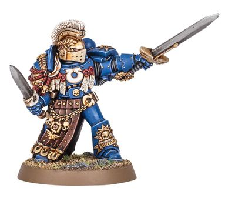

# 0267 战团冠军 Chapter Champion

精校状态：中文行文已逐段精校，部分术语仍为暂定

分类：通用概念 / 帝国 Imperium / 中央政务部 Adeptus Terra / 阿斯塔特修会 Adeptus Astartes

原文来源：https://www.bilibili.com/opus/1019945266975866901

原作者：帝国神选罐头

原文时间：2025年01月08日 13:08

[返回分类目录](目录.md) · [全书目录](../../目录.md)

<!-- A0267-B0001 -->
**英文原文**

The Chapter Champion is a member of a Space Marine Chapter's Honour Guard. He must be ready to challenge any enemy leader to single combat.

<!-- /A0267-B0001 -->

<!-- A0267-B0002 -->

原译文

战团冠军是星际战士战团荣誉卫队的成员。他必须准备好挑战任何敌方领袖进行单挑。

**校订译文**

战团冠军是星际战士战团荣誉卫队的成员，必须随时准备向敌方领袖发起单挑。

<!-- /A0267-B0002 -->

<!-- A0267-B0003 图片 -->

<!-- A0267-B0004 -->

原译文

Chapter Champion 战团冠军

**校订译文**

Chapter Champion 战团冠军

<!-- /A0267-B0004 -->

<!-- A0267-B0005 -->
**英文原文**

These individuals hold a special place within their Chapter as they are warriors of immense skill and are known for their unyielding bravery. Chapter Champions are willing to lay down their lives in defence of their Chapter Master and in battle they are ready to face the challenges of any enemy leader in single combat with all their training focused on this singular duty. As befitting their role, they are provided with Power Swords and a combat blade in order to fight for the honour of their Chapter.

<!-- /A0267-B0005 -->

<!-- A0267-B0006 -->

原译文

这些人在他们的战团中占有特殊的地位，因为他们是技能高超的战士，以不屈不挠的勇气而闻名。战团冠军愿意为保卫他们的战团长献出生命，在战斗中，他们准备在一场战斗中面对任何敌方领袖的挑战，所有的训练都集中在这一独特的任务上。为了与他们的角色相称，他们被提供了动力剑和战斗刃，以便为他们的战团荣誉而战。

**校订译文**

战团冠军武艺高强，以无畏的勇气闻名，因此在战团中地位特殊。他们愿意为保护战团长献出生命，也随时准备在战场上接受敌方领袖的单挑；其全部训练，都围绕这项职责展开。为使其能够捍卫战团荣誉，他们获配动力剑与战斗短刃。

<!-- /A0267-B0006 -->

<!-- A0267-B0007 -->
## Notable Chapter Champions 著名战团冠军

<!-- /A0267-B0007 -->

<!-- A0267-B0008 -->
**英文原文**

Demitrius Valor - Imperial Fists

<!-- /A0267-B0008 -->

<!-- A0267-B0009 -->

原译文

德米特里厄斯·瓦洛尔 - 帝国之拳

**校订译文**

德米特里厄斯·瓦洛尔 - 帝国之拳

<!-- /A0267-B0009 -->

<!-- A0267-B0010 -->
**英文原文**

Hervald Strom - Iron Knights

<!-- /A0267-B0010 -->

<!-- A0267-B0011 -->

原译文

赫瓦尔德·斯特罗姆 - 钢铁骑士

**校订译文**

赫瓦尔德·斯特罗姆 - 钢铁骑士

<!-- /A0267-B0011 -->

<!-- A0267-B0012 -->
**英文原文**

Adeon - Ultramarines

<!-- /A0267-B0012 -->

<!-- A0267-B0013 -->

原译文

阿迪恩 - 极限战士

**校订译文**

阿迪恩 - 极限战士

<!-- /A0267-B0013 -->

<!-- A0267-B0014 -->
**英文原文**

Domelechus Tigon - Ultramarines

<!-- /A0267-B0014 -->

<!-- A0267-B0015 -->

原译文

多梅莱楚斯·提贡 - 极限战士

**校订译文**

多梅莱楚斯·提贡 - 极限战士

<!-- /A0267-B0015 -->

<!-- A0267-B0016 -->
**英文原文**

Icator Ristus - Ultramarines

<!-- /A0267-B0016 -->

<!-- A0267-B0017 -->

原译文

伊卡托·里斯特斯 - 极限战士

**校订译文**

伊卡托·里斯特斯 - 极限战士

<!-- /A0267-B0017 -->

<!-- A0267-B0018 -->
**英文原文**

Varro Ortyras - Ultramarines

<!-- /A0267-B0018 -->

<!-- A0267-B0019 -->

原译文

瓦罗·奥蒂拉斯 - 极限战士

**校订译文**

瓦罗·奥蒂拉斯 - 极限战士

<!-- /A0267-B0019 -->

本篇核心术语与暂定项

以下列出本篇出现的英文原形及核心术语表用词。同形词可能指不同对象，具体词义以本篇正文和校注为准；单复数、别名和仅见于图注的名称可能尚未列入。完整候选见[术语表](../../术语表/双语术语候选.csv)。

| 英文 | 采用中文 | 状态 |
| --- | --- | --- |
| Ultramarines | 极限战士 | 官方已核对 |
| Imperial Fists | 帝国之拳 | 暂定 |
| Master | 导师（审判庭职衔）／舰务官（舰员职务） | 语境定译·官方待核 |
| Chapter Champion | 战团冠军 | 暂定·官方待核 |
| Honour Guard | 荣誉卫队 | 暂定·官方待核 |
| Champion | 冠军 | 暂定·官方待核 |
| Space Marine | 星际战士 | 暂定·官方待核 |
| Chapter | 战团 | 暂定·官方待核 |
| Chapter Master | 战团长 | 暂定·官方待核 |
| Iron Knights | 钢铁骑士 | 暂定·官方待核 |

