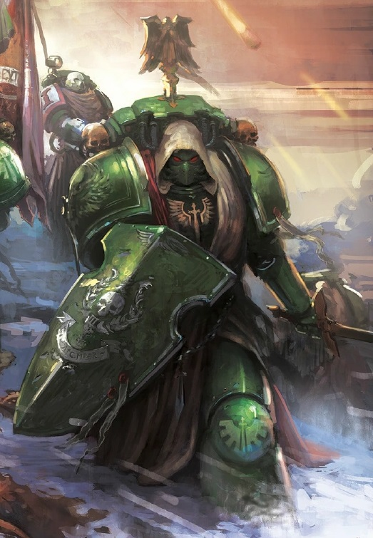
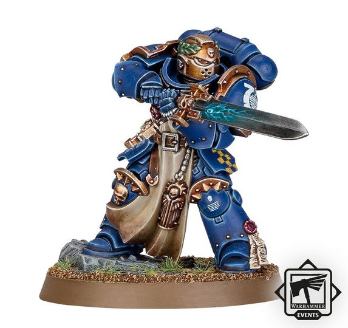
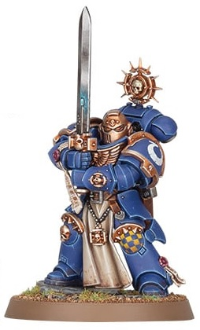
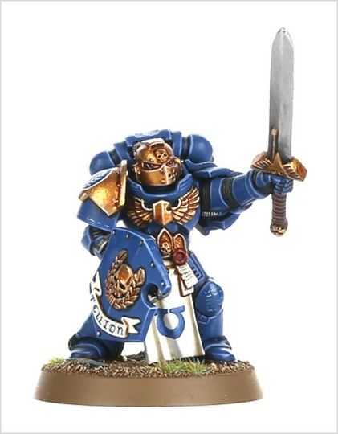
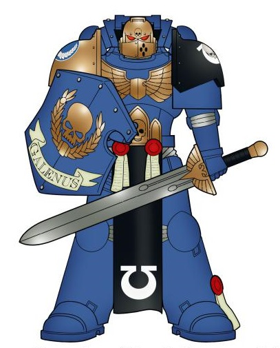

# 0268 连队冠军 Company Champion

精校状态：中文行文已逐段精校，部分术语仍为暂定

分类：通用概念 / 帝国 Imperium / 中央政务部 Adeptus Terra / 阿斯塔特修会 Adeptus Astartes

原文来源：https://www.bilibili.com/opus/1020657587326025784

原作者：帝国神选罐头

原文时间：2025年01月10日 11:12

[返回分类目录](目录.md) · [全书目录](../../目录.md)

<!-- A0268-B0001 -->
**英文原文**

The Company Champion is the greatest warrior of a Space Marine Company, though he is not a high-ranking officer, such as a Captain or even a Sergeant. Part of a Captain's Command Squad, they can be seen fighting in the fiercest of battles.

<!-- /A0268-B0001 -->

<!-- A0268-B0002 -->

原译文

连队冠军是星际战士连队中最伟大的战士，尽管他不是连长甚至军士这样的高级军官。作为连长指挥组的一部分，他们可以在最激烈的战斗中战斗。

**校订译文**

连队冠军是星际战士连中武艺最出众的战士，但他并不担任连长，甚至不具有军士那样的指挥职衔。他属于连长的指挥小队，总在最激烈的战斗中冲锋陷阵。

<!-- /A0268-B0002 -->

<!-- A0268-B0003 图片 -->

<!-- A0268-B0004 -->

原译文

Dark Angels Company Champion 黑暗天使连队冠军

**校订译文**

Dark Angels Company Champion 黑暗天使连队冠军

<!-- /A0268-B0004 -->

<!-- A0268-B0005 -->
## Overview 概述

<!-- /A0268-B0005 -->

<!-- A0268-B0006 -->
**英文原文**

Charged with upholding the honour of his company, his Chapter and the Emperor himself, a Company Champion's primary role is to engage enemy warlords and champions in single combat, so that their commanding officer may conduct the wider battle free from interference. They also hold key roles in conducting the various rituals and ceremonies of the Chapter.

<!-- /A0268-B0006 -->

<!-- A0268-B0007 -->

原译文

连队冠军的主要职责是维护连队、战团和帝皇的荣誉，在一场战斗中与敌方军阀和冠军交战，以便他们的指挥官可以在不受干扰的情况下进行更广泛的战斗。他们在主持战团的各种仪式和典礼中也发挥着关键作用。

**校订译文**

连队冠军肩负维护所属连、战团乃至帝皇本人荣誉的使命。其主要职责是与敌方军阀和冠军单挑，让己方指挥官得以免受干扰，统筹整场战斗。他们也在战团的各种典礼与仪式中承担重要职责。

<!-- /A0268-B0007 -->

<!-- A0268-B0008 图片 -->

<!-- A0268-B0009 -->

原译文

Primaris Company Champion 原铸连队冠军

**校订译文**

Primaris Company Champion 原铸连队冠军

<!-- /A0268-B0009 -->

<!-- A0268-B0010 -->
## Origins 起源

<!-- /A0268-B0010 -->

<!-- A0268-B0011 -->
**英文原文**

The first Company Champions rose from the ranks of the Space Marine Legions during the Great Crusade. There remain fragmented reports of heroes armed with shining blades and clad in mighty armor who protected legion officers and even Primarchs. When the Codex Astartes was established by Primarch Roboute Guilliman, the role of the Company Champion was established in the makeup of each Chapter. With this being the case it is likely the role originated in the Ultramarines Legion.

<!-- /A0268-B0011 -->

<!-- A0268-B0012 -->

原译文

在大远征期间，第一批连队冠军从星际战士中崛起。仍有零星的报道称，英雄们手持闪亮的刀刃，身穿强大的盔甲，保护着军团军官甚至原体。当原体罗伯特·基里曼建立阿斯塔特圣典时，连队冠军的角色在每个战团的组成中都得到了确立。在这种情况下，这个角色很可能起源于极限战士军团。

**校订译文**

大远征期间，星际战士军团中出现了最早的连队冠军。残存的零星记载描述了这样一些英雄：他们身披坚甲、手持利刃，守护军团军官，甚至原体。原体罗保特·基里曼制定《阿斯塔特圣典》时，连队冠军被正式纳入各战团的编制。由此推测，这一职务很可能起源于极限战士军团。

<!-- /A0268-B0012 -->

<!-- A0268-B0013 -->
## Selection 选拔

<!-- /A0268-B0013 -->

<!-- A0268-B0014 -->
**英文原文**

Company Champions are chosen with care, as their skill at arms could be the difference between the life and death for his captain, and therefore victory or defeat. The Codex Astartes indicates that feats of great valor mark a Space Marine for consideration, along with humility and the focus to keep their Captain safe.

<!-- /A0268-B0014 -->

<!-- A0268-B0015 -->

原译文

连队冠军的选择是谨慎的，因为他们的武器技能可能是连长生死的关键，因此也是胜利或失败的关键。阿斯塔特圣典指出，英勇壮举标志着一名星际战士值得考虑，同时还有谦逊和专注于保护连长的安全。

**校订译文**

连队冠军的选拔十分慎重，因为其武艺可能决定连长的生死，进而影响战局胜败。《阿斯塔特圣典》指出，立下英勇战功的星际战士可被列入候选，但同时还须谦逊，并能专注于保护连长。

<!-- /A0268-B0015 -->

<!-- A0268-B0016 图片 -->

<!-- A0268-B0017 -->

原译文

Company Champion 连队冠军

**校订译文**

Company Champion 连队冠军

<!-- /A0268-B0017 -->

<!-- A0268-B0018 -->
**英文原文**

Different Chapters will choose their champions in other ways, however. For example, the Silver Skulls utilize the visions of their Prognosticars to find those marked for greatness and have them trained accordingly. Another fine example would be the Imperial Fists, who hold great tournaments to select new Company Champions whenever a previous one dies in battle.

<!-- /A0268-B0018 -->

<!-- A0268-B0019 -->

原译文

然而，不同的战团将以其他方式选择他们的冠军。例如，银色颅骨利用他们的预言者的视界来找到那些被标记为伟大的人，并对他们进行相应的训练。另一个很好的例子是帝国之拳，每当前一位连队冠军在战斗中牺牲时，他们都会举行盛大的比赛来选出新的连队冠军。

**校订译文**

不过，各战团也有自己的选拔方式。银色颅骨借助预言者的异象，寻找命中注定成就大业的人，再加以培养。帝国之拳则在连队冠军阵亡后，举行盛大的比武，选出继任者。

<!-- /A0268-B0019 -->

<!-- A0268-B0020 -->
## Role and Responsibilities 角色与职责

<!-- /A0268-B0020 -->

<!-- A0268-B0021 -->
**英文原文**

Company Champions often take to the field as part of their company's Command Squad, but they can also be placed in the service of a Chaplain or Librarian. As part of a Command Squad the champion has three key duties:

<!-- /A0268-B0021 -->

<!-- A0268-B0022 -->

原译文

连队冠军经常作为连队指挥组的一员前往现场，但他们也可以被安排为牧师或智库服务。作为指挥小队的一员，冠军有三项关键职责：

**校订译文**

连队冠军通常随所属连的指挥小队出战，也可能被指派护卫教士或智库员。作为指挥小队成员，他有三项主要职责：

<!-- /A0268-B0022 -->

<!-- A0268-B0023 -->
**英文原文**

protecting the captain or any other assigned officer,

<!-- /A0268-B0023 -->

<!-- A0268-B0024 -->

原译文

保护连长或任何其他指定军官，

**校订译文**

保护连长或任何其他指定军官，

<!-- /A0268-B0024 -->

<!-- A0268-B0025 -->
**英文原文**

acting as a counselor for his Captain and sharing whatever knowledge on martial styles he may possess,

<!-- /A0268-B0025 -->

<!-- A0268-B0026 -->

原译文

作为连长的顾问，分享他可能掌握的任何军事知识，

**校订译文**

为连长提供建议，传授自己掌握的各类武技；

<!-- /A0268-B0026 -->

<!-- A0268-B0027 -->
**英文原文**

and sometimes acting as his Captain's second when it is appropriate.

<!-- /A0268-B0027 -->

<!-- A0268-B0028 -->

原译文

有时在适当的时候充当连长的副手。

**校订译文**

有时在适当的时候充当连长的副手。

<!-- /A0268-B0028 -->

<!-- A0268-B0029 -->
**英文原文**

Although technically outside the regular chain of command, a Champion would be a veteran of many wars and served at his Captain's side longer than most. The last duty can also be a great burden, for if the Champion fails in protecting his Captain's life and the battle it would bring dishonor on them both. Few Champions have ever dealt with such failure, but those that do often choose to stand down from their honoured role and take penance at their Chapter Master's discretion.

<!-- /A0268-B0029 -->

<!-- A0268-B0030 -->

原译文

虽然从技术层面上讲，冠军不属于常规指挥链，但他是许多场战争的老兵，在连长身边服役的时间比大多数人都长。最后的责任也可能是一个巨大的负担，因为如果冠军未能保护他的连长的生命和战斗，这将给他们带来耻辱。很少有冠军经历过这样的失败，但那些经历过的人经常选择退出他们的荣誉角色，并由战团长自行决定进行忏悔。

**校订译文**

虽然连队冠军严格来说不在常规指挥链中，却通常身经百战，比多数人更长久地陪伴在连长身侧。上述最后一项职责也可能带来沉重负担：若他在战斗中未能保住连长的性命，两人的荣誉都会蒙羞。鲜有冠军经历如此失败；遭遇此事的人，往往选择辞去这一尊贵职务，并接受战团长裁定的赎罪安排。

**校注：** 原英文“protecting his Captain’s life and the battle”存在语法残缺；按上下文译为在战斗中保护连长，未增加原文无据的指挥权限。

<!-- /A0268-B0030 -->

<!-- A0268-B0031 图片 -->

<!-- A0268-B0032 -->

原译文

Company Champion 连队冠军

**校订译文**

Company Champion 连队冠军

<!-- /A0268-B0032 -->

<!-- A0268-B0033 -->
**英文原文**

Champions also have other duties off of the battlefield. All Chapters have long-lived traditions that usually revolve around significant events. Champions represent their own companies for events where multiple companies are involved. For example, during the Feast of Blades conducted by the Imperial Fists and their successors the Chapters will nominate Champions to represent them during the great tournament.

<!-- /A0268-B0033 -->

<!-- A0268-B0034 -->

原译文

冠军在战场之外还有其他职责。所有战团都有悠久的传统，通常围绕重大事件展开。冠军代表自己的连队参加多个连队参与的活动。例如，在帝国之拳及其子战团举行的刀锋盛宴期间，各战团将提名冠军代表他们参加这场盛大的比赛。

**校订译文**

冠军在战场之外也有职责。各战团都有悠久的传统，通常围绕重大历史事件展开；多个连共同参与活动时，冠军便代表各自所属连出席。例如，帝国之拳及其子战团举行刀锋盛宴时，会各自选派冠军，代表战团参加这场盛大的比武。

<!-- /A0268-B0034 -->

<!-- A0268-B0035 -->
## Wargear 战备

<!-- /A0268-B0035 -->

<!-- A0268-B0036 -->
**英文原文**

Most Champions will arm themselves with Power Swords and Combat Shields.

<!-- /A0268-B0036 -->

<!-- A0268-B0037 -->

原译文

大多数冠军会用动力剑和战斗盾武装自己。

**校订译文**

大多数冠军会用动力剑和战斗盾武装自己。

<!-- /A0268-B0037 -->

<!-- A0268-B0038 图片 -->

<!-- A0268-B0039 -->

原译文

Ultramarine Company Champion 极限战士连队冠军

**校订译文**

Ultramarine Company Champion 极限战士连队冠军

<!-- /A0268-B0039 -->

<!-- A0268-B0040 -->
**英文原文**

Champions wear Power Armour specifically tailored for them, a pattern known informally as the Curadh variant which is based loosely on Aquila Pattern battleplate. It features additional reinforcement upon the shoulder guards, designed to showcase the Champion's many honors and provide better protection. Curadh armor comes with a reinforced breastplate where a Champion is allowed to display his personal heraldry. As for the helm it is deliberately fashioned to resemble knightly helms of Terra's ancient past, in honor of the ideals of those half-forgotten warriors, represented by the Champions.

<!-- /A0268-B0040 -->

<!-- A0268-B0041 -->

原译文

冠军们穿着专门为他们量身定制的动力盔甲，这种型号非正式地称为库拉德变体，它松散地基于天鹰型的战斗板。它在肩甲上增加了额外的加固，旨在展示冠军的许多荣誉，并提供更好的保护。库拉德盔甲配有加固的胸甲，冠军可以在胸甲上展示他的个人纹章。至于头盔，它被刻意设计成类似于泰拉古代骑士的头盔，以纪念那些被遗忘的战士的理想，以冠军为代表。

**校订译文**

冠军穿着量身定制的动力甲，非正式地称为“库拉德”变型。它以天鹰型动力甲为基础作出调整，肩甲进一步加固，既提供更好的防护，也用于展示冠军的诸多荣誉。加固胸甲上可以绘制个人纹章。头盔则特意模仿泰拉古代骑士的样式，以纪念那些几乎被遗忘的武士及其理想；冠军正是这些理想的继承者。

<!-- /A0268-B0041 -->

<!-- A0268-B0042 -->
**英文原文**

When a Champion falls in battle and his body is recovered, his armor will be placed in the Chapter's reliquary to be lauded and remembered.

<!-- /A0268-B0042 -->

<!-- A0268-B0043 -->

原译文

当一位冠军在战斗中倒下，他的尸体被找到时，他的盔甲将被放置在战团的圣物箱中，以受到赞扬和纪念。

**校订译文**

冠军阵亡后，若遗体得以收回，其护甲便会被安置在战团的圣物收藏处，供人纪念、颂扬。

<!-- /A0268-B0043 -->

<!-- A0268-B0044 -->
## Known Champions 著名冠军

<!-- /A0268-B0044 -->

<!-- A0268-B0045 -->
**英文原文**

Addah - White Scars

<!-- /A0268-B0045 -->

<!-- A0268-B0046 -->

原译文

亚达 - 白色疤痕

**校订译文**

亚达——白疤

<!-- /A0268-B0046 -->

<!-- A0268-B0047 -->
**英文原文**

Amadael - Blood Angels

<!-- /A0268-B0047 -->

<!-- A0268-B0048 -->

原译文

阿玛戴尔 - 圣血天使

**校订译文**

阿玛戴尔 - 圣血天使

<!-- /A0268-B0048 -->

<!-- A0268-B0049 -->
**英文原文**

Balus Karath - Novamarines

<!-- /A0268-B0049 -->

<!-- A0268-B0050 -->

原译文

巴鲁斯·卡拉斯 - 新星战士

**校订译文**

巴卢斯·卡拉特 - 新星战士

**校注：** 已核同一人物、组织、型号或事件，与全书核心术语及后续专篇统一；原译保留对照。

<!-- /A0268-B0050 -->

<!-- A0268-B0051 -->
**英文原文**

Brayden - Invaders

<!-- /A0268-B0051 -->

<!-- A0268-B0052 -->

原译文

布雷登 - 侵袭者

**校订译文**

布雷登 - 侵袭者

<!-- /A0268-B0052 -->

<!-- A0268-B0053 -->
**英文原文**

Cadulon - Iron Knights

<!-- /A0268-B0053 -->

<!-- A0268-B0054 -->

原译文

卡杜隆 - 钢铁骑士

**校订译文**

卡杜隆 - 钢铁骑士

<!-- /A0268-B0054 -->

<!-- A0268-B0055 -->
**英文原文**

Corswain - Dark Angels

<!-- /A0268-B0055 -->

<!-- A0268-B0056 -->

原译文

考斯维恩 - 黑暗天使

**校订译文**

考斯维恩 - 黑暗天使

<!-- /A0268-B0056 -->

<!-- A0268-B0057 -->
**英文原文**

Gaius Prabian - Ultramarines

<!-- /A0268-B0057 -->

<!-- A0268-B0058 -->

原译文

盖乌斯·普拉比安 - 极限战士

**校订译文**

盖乌斯·普拉比安 - 极限战士

<!-- /A0268-B0058 -->

<!-- A0268-B0059 -->
**英文原文**

Gauthard - Imperial Fists (temporarily)

<!-- /A0268-B0059 -->

<!-- A0268-B0060 -->

原译文

高萨德 - 帝国之拳（暂时）

**校订译文**

高萨德 - 帝国之拳（暂时）

<!-- /A0268-B0060 -->

<!-- A0268-B0061 -->
**英文原文**

Jhogai - White Scars

<!-- /A0268-B0061 -->

<!-- A0268-B0062 -->

原译文

乔盖 - 白色疤痕

**校订译文**

乔盖——白疤

<!-- /A0268-B0062 -->

<!-- A0268-B0063 -->
**英文原文**

Jonas - Ultramarines

<!-- /A0268-B0063 -->

<!-- A0268-B0064 -->

原译文

乔纳斯 -极限战士

**校订译文**

乔纳斯——极限战士

<!-- /A0268-B0064 -->

<!-- A0268-B0065 -->
**英文原文**

Lydon - Imperial Fists

<!-- /A0268-B0065 -->

<!-- A0268-B0066 -->

原译文

莱登 - 帝国之拳

**校订译文**

莱登 - 帝国之拳

<!-- /A0268-B0066 -->

<!-- A0268-B0067 -->
**英文原文**

Morgen Blackblood - Blood Angels

<!-- /A0268-B0067 -->

<!-- A0268-B0068 -->

原译文

摩根·黑血 - 圣血天使

**校订译文**

摩根·黑血 - 圣血天使

<!-- /A0268-B0068 -->

<!-- A0268-B0069 -->
**英文原文**

Oros Telemar - Iron Hands

<!-- /A0268-B0069 -->

<!-- A0268-B0070 -->

原译文

奥罗斯·特莱马尔 - 钢铁之手

**校订译文**

奥罗斯·特莱马尔 - 钢铁之手

<!-- /A0268-B0070 -->

<!-- A0268-B0071 -->
**英文原文**

Petronius Nero - Ultramarines

<!-- /A0268-B0071 -->

<!-- A0268-B0072 -->

原译文

佩特罗尼乌斯·尼禄 - 极限战士

**校订译文**

佩特罗尼乌斯·尼禄 - 极限战士

<!-- /A0268-B0072 -->

<!-- A0268-B0073 -->
**英文原文**

Tolemion - Genesis Chapter

<!-- /A0268-B0073 -->

<!-- A0268-B0074 -->

原译文

托勒米恩 - 起源战团

**校订译文**

托勒米恩 - 起源战团

<!-- /A0268-B0074 -->

<!-- A0268-B0075 -->
**英文原文**

Torius - Ultramarines

<!-- /A0268-B0075 -->

<!-- A0268-B0076 -->

原译文

托里乌斯 - 极限战士

**校订译文**

托里乌斯 - 极限战士

<!-- /A0268-B0076 -->

<!-- A0268-B0077 -->
**英文原文**

Zalthus - Ultramarines

<!-- /A0268-B0077 -->

<!-- A0268-B0078 -->

原译文

扎尔萨斯 - 极限战士

**校订译文**

扎尔萨斯 - 极限战士

<!-- /A0268-B0078 -->

本篇核心术语与暂定项

以下列出本篇出现的英文原形及核心术语表用词。同形词可能指不同对象，具体词义以本篇正文和校注为准；单复数、别名和仅见于图注的名称可能尚未列入。完整候选见[术语表](../../术语表/双语术语候选.csv)。

| 英文 | 采用中文 | 状态 |
| --- | --- | --- |
| Blood Angels | 圣血天使 | 官方已核对 |
| Dark Angels | 黑暗天使 | 官方已核对 |
| Librarian | 智库员 | 官方已核对 |
| Roboute Guilliman | 罗保特·基里曼 | 官方已核对 |
| Ultramarines | 极限战士 | 官方已核对 |
| Imperial Fists | 帝国之拳 | 暂定 |
| Emperor | 帝皇 | 官方已核对 |
| Primarch | 原体 | 官方已核对 |
| Great Crusade | 大远征 | 暂定·官方待核 |
| Terra | 泰拉 | 暂定·官方待核 |
| Iron Hands | 钢铁之手 | 暂定·官方待核 |
| Aquila | 天鹰 | 暂定·官方待核 |
| Master | 导师（审判庭职衔）／舰务官（舰员职务） | 语境定译·官方待核 |
| Company Champion | 连队冠军 | 暂定·官方待核 |
| Curadh | 库拉德 | 暂定·官方待核 |
| Command Squad | 指挥小队 | 暂定·官方待核 |
| Chaplain | 教士 | 官方已核对 |
| Ancient | 旗手 | 官方已核对 |
| White Scars | 白疤 | 官方已核 |
| Scars | 伤疤 | 暂定·官方待核 |
| Silver Skulls | 银色颅骨 | 暂定·官方待核 |
| Corswain | 考斯韦恩 | 暂定·官方待核 |
| Champion | 冠军 | 暂定·官方待核 |
| Power Armour | 动力盔甲 | 暂定·官方待核 |
| Space Marine | 星际战士 | 暂定·官方待核 |
| Chapter | 战团 | 暂定·官方待核 |
| Chapter Master | 战团长 | 暂定·官方待核 |
| Captain | 连长 | 暂定·官方待核 |
| Veteran | 老兵 | 暂定·官方待核 |
| Sergeant | 军士 | 暂定·官方待核 |
| Codex Astartes | 阿斯塔特圣典 | 暂定·官方待核 |
| Genesis Chapter | 起源战团 | 暂定·官方待核 |
| Novamarines | 新星战士 | 暂定·官方待核 |
| Invaders | 侵略者 | 暂定·官方待核 |
| Iron Knights | 钢铁骑士 | 暂定·官方待核 |
| Space Marine Company | 星际战士连队 | 暂定·官方待核 |
| Prognosticars | 预言者 | 暂定·官方待核 |
| Oros Telemar | 奥罗斯·特莱马尔 | 暂定·官方待核 |
| Torius | 托瑞斯 | 暂定·官方待核 |
| Balus Karath | 巴卢斯·卡拉特 | 暂定·官方待核 |
| Gaius Prabian | 盖乌斯·普拉比安 | 暂定·官方待核 |
| Feast of Blades | 刀锋盛宴 | 暂定·官方待核 |
| Gauthard | 高萨德 | 暂定·官方待核 |

