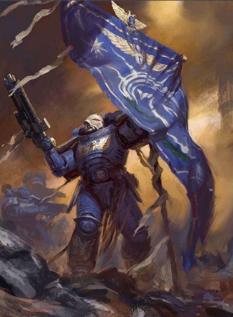
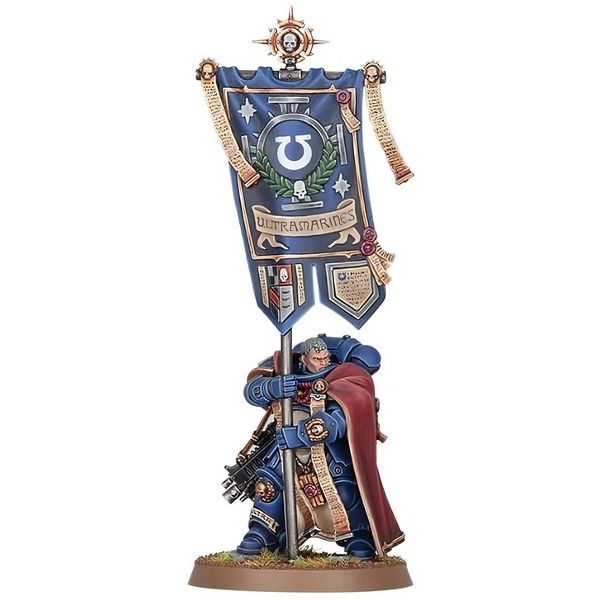
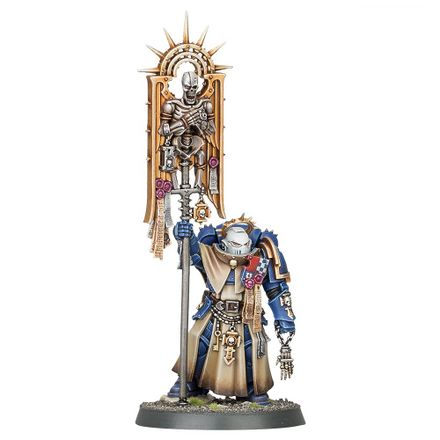

# 0269 旗手 Ancient

精校状态：中文行文已逐段精校，部分术语仍为暂定

分类：通用概念 / 帝国 Imperium / 中央政务部 Adeptus Terra / 阿斯塔特修会 Adeptus Astartes

原文来源：https://www.bilibili.com/opus/1018378965418508294

原作者：帝国神选罐头

原文时间：2025年01月04日 07:50

[返回分类目录](目录.md) · [全书目录](../../目录.md)

<!-- A0269-B0001 -->
**英文原文**

Ancients are the Standard Bearers in a Space Marines Chapter.

<!-- /A0269-B0001 -->

<!-- A0269-B0002 -->

原译文

旗手是星际战士的持旗者。

**校订译文**

旗手是星际战士战团中负责执掌军旗的战士。

<!-- /A0269-B0002 -->

<!-- A0269-B0003 -->
## Company Ancient 连队旗手

<!-- /A0269-B0003 -->

<!-- A0269-B0004 -->
**英文原文**

Company Ancients, also known as Company Standard Bearers, are Space Marines who has shown honour and combat prowess sufficient to be granted the right to carry the Company Banner into battle. They often form part of a Command Squad and fight alongside the company's Captain.

<!-- /A0269-B0004 -->

<!-- A0269-B0005 -->

原译文

连队旗手，也称为连队持旗者，是表现出足够的荣誉和战斗能力的星际战士，有权携带连队旗帜参加战斗。他们经常组成指挥小队，与连长并肩作战。

**校订译文**

连队旗手又称连队持旗者，只有荣誉与武艺足够出众的星际战士，才会获准扛起连旗出征。他们通常编入指挥小队，与连长并肩作战。

<!-- /A0269-B0005 -->

<!-- A0269-B0006 图片 -->

<!-- A0269-B0007 -->

原译文

Ultramarines Company Ancient 极限战士连队旗手

**校订译文**

Ultramarines Company Ancient 极限战士连队旗手

<!-- /A0269-B0007 -->

<!-- A0269-B0008 -->
**英文原文**

One of the most common specialists found fighting alongside Veteran Squads, Company Ancients have the privilege of wielding the Company Standard into battle. Each such standard is an ancient relic, steeped in history and deeply revered by the warriors of the Company. Many have been carried over battlefields for hundreds and even thousands of years. Every Space Marine of a Company, from the most seasoned veteran to newest recruit, fights harder in the presence of a Company Ancient and his standard. Thus it is the duty of the Company Ancient to never let his banner drop while he still draws breath. Losing his banner while still living is seen as the most terrible and shameful dishonor. To this end, these individuals are invariably great warriors.

<!-- /A0269-B0008 -->

<!-- A0269-B0009 -->

原译文

作为与老兵小队并肩作战的最常见的专家之一，连队旗手有权在战斗中挥舞连队军旗。每一个这样的军旗都是一个古老的圣物，历史悠久，深受连队战士的尊敬。许多人已经在战场上度过了数百年甚至数千年。一个连队的每一位星际战士，从经验最丰富的老兵到最新招募的新兵，在一个连队旗手和他的军旗面前都会更加努力地战斗。因此，连队旗手有责任在他还呼吸的时候，永远不要让他的旗帜倒下。存活时失去他的旗帜被视为最可怕、最可耻的耻辱。为此，这些人都是伟大的战士。

**校订译文**

连队旗手是最常与老兵小队并肩作战的专职战士之一，享有携带连旗出征的殊荣。每面军旗都是历史悠久的古老圣物，受到全连战士的敬重；其中许多已在战场上飘扬数百年乃至数千年。从身经百战的老兵到刚入伍的新兵，只要看见旗手与军旗，每个人都会奋战得更加勇猛。因此，只要一息尚存，旗手便绝不能让军旗倒下。自己仍然活着却丢失军旗，被视为最严重、最可耻的失节。肩负如此重任的旗手，无不是卓越的战士。

**校注：** 原译“许多人”指代错误；在战场传承数百乃至数千年的是军旗。

<!-- /A0269-B0009 -->

<!-- A0269-B0010 图片 -->

<!-- A0269-B0011 -->

原译文

Company Ancient 连队旗手

**校订译文**

Company Ancient 连队旗手

<!-- /A0269-B0011 -->

<!-- A0269-B0012 -->
**英文原文**

Chapter variations of the Company Ancient include the Brotherhood Ancient, a title used by the Grey Knights.

<!-- /A0269-B0012 -->

<!-- A0269-B0013 -->

原译文

连队旗手的战团变体包括兄弟会旗手，这是灰骑士使用的称号。

**校订译文**

各战团对连队旗手可能采用不同称谓，例如灰骑士称其为兄弟会旗手。

<!-- /A0269-B0013 -->

<!-- A0269-B0014 -->
### Notable Company Ancients 著名连队旗手

<!-- /A0269-B0014 -->

<!-- A0269-B0015 -->
**英文原文**

Titus - Howling Griffons 1st Company.

<!-- /A0269-B0015 -->

<!-- A0269-B0016 -->

原译文

泰图斯 - 咆哮狮鹫第一连

**校订译文**

泰图斯 - 咆哮狮鹫第一连

<!-- /A0269-B0016 -->

<!-- A0269-B0017 -->
**英文原文**

Korelon - Silver Templars.

<!-- /A0269-B0017 -->

<!-- A0269-B0018 -->

原译文

科雷洛 - 银色圣堂

**校订译文**

科雷洛 - 银色圣堂

<!-- /A0269-B0018 -->

<!-- A0269-B0019 -->
**英文原文**

Yeku - White Scars 3rd Company.

<!-- /A0269-B0019 -->

<!-- A0269-B0020 -->

原译文

耶库 - 白色疤痕第三连

**校订译文**

耶库——白疤第三连

<!-- /A0269-B0020 -->

<!-- A0269-B0021 -->
## Bladeguard Ancient 剑卫旗手

<!-- /A0269-B0021 -->

<!-- A0269-B0022 -->
**英文原文**

Bladeguard Ancients are Standard Bearers assigned to Bladeguard Veteran squads which carry their Chapter's most precious standards into battle. The most revered of these incorporate the remains of fallen heroes of the Chapter.

<!-- /A0269-B0022 -->

<!-- A0269-B0023 -->

原译文

剑卫旗手是分配给剑卫老兵小队的持旗者，他们将战团最珍贵的军旗带入战斗。其中最受尊敬的包括本战团逝去英雄的遗体。

**校订译文**

剑卫旗手配属剑卫老兵小队，携带战团最珍贵的军旗出征。其中最受尊崇的旗帜，甚至饰有战团阵亡英雄的遗骨。

<!-- /A0269-B0023 -->

<!-- A0269-B0024 图片 -->

<!-- A0269-B0025 -->

原译文

Bladeguard Ancient 剑卫旗手

**校订译文**

Bladeguard Ancient 剑卫旗手

<!-- /A0269-B0025 -->

<!-- A0269-B0026 -->
## Chapter Ancient 战团旗手

<!-- /A0269-B0026 -->

<!-- A0269-B0027 -->
**英文原文**

The Chapter Ancient is the bearer of the Chapter's Banner. They typically serve within the Honour Guard.

<!-- /A0269-B0027 -->

<!-- A0269-B0028 -->

原译文

战团旗手是战团旗帜的持有者。他们通常在荣誉卫队服役。

**校订译文**

战团旗手负责执掌战团军旗，通常在荣誉卫队中服役。

<!-- /A0269-B0028 -->

<!-- A0269-B0029 -->
**英文原文**

One battle-brother amongst the Honour Guard may have the distinction of carrying the banner of their Chapter into battle. This is a sacred task, one borne with immense dignity and gravitas. Whether providing a rallying point to the warriors fighting around him, or racing to defiantly plant the standard upon a contested elevation and in doing so claim the battlefield for his Chapter, the Ancient serves to inspire all around him.

<!-- /A0269-B0029 -->

<!-- A0269-B0030 -->

原译文

荣誉卫队中的一名战斗兄弟可能会有携带本战团旗帜参加战斗的荣誉。这是一项神圣的任务，承载着巨大的尊贵和庄严。无论是为在他周围作战的战士提供一个集结点，还是在争夺的高地上顽强地立起旗帜，并以此为自己的战团宣称战场，这位旗手都能激励他周围的人。

**校订译文**

荣誉卫队中的一名战斗兄弟，会获授携带战团军旗出征的殊荣。他以无比的庄重与尊严承担这项神圣使命：或为周围奋战的同袍提供集结之处，或奋勇冲上双方争夺的高地，将军旗插下，宣告战场归属于本团。无论身处何境，旗手都在激励身旁的每一位战士。

<!-- /A0269-B0030 -->

<!-- A0269-B0031 -->
### Notable Chapter Ancients 著名战团旗手

<!-- /A0269-B0031 -->

<!-- A0269-B0032 -->
**英文原文**

Agrippa - Ultramarines

<!-- /A0269-B0032 -->

<!-- A0269-B0033 -->

原译文

阿格里帕 - 极限战士

**校订译文**

阿格里帕 - 极限战士

<!-- /A0269-B0033 -->

本篇核心术语与暂定项

以下列出本篇出现的英文原形及核心术语表用词。同形词可能指不同对象，具体词义以本篇正文和校注为准；单复数、别名和仅见于图注的名称可能尚未列入。完整候选见[术语表](../../术语表/双语术语候选.csv)。

| 英文 | 采用中文 | 状态 |
| --- | --- | --- |
| Space Marines | 星际战士 | 官方已核对 |
| Grey Knights | 灰骑士 | 官方已核对 |
| Ultramarines | 极限战士 | 官方已核对 |
| History | 历史 | 编辑用语已统一 |
| The Brotherhood | 兄弟会 | 暂定·官方待核 |
| Brotherhood | 兄弟会 | 暂定·官方待核 |
| Company Ancient | 连队旗手 | 暂定·官方待核 |
| Chapter Ancient | 战团旗手 | 暂定·官方待核 |
| Command Squad | 指挥小队 | 暂定·官方待核 |
| Ancient | 旗手 | 官方已核对 |
| Honour Guard | 荣誉卫队 | 暂定·官方待核 |
| White Scars | 白疤 | 官方已核 |
| Scars | 伤疤 | 暂定·官方待核 |
| Space Marine | 星际战士 | 暂定·官方待核 |
| Chapter | 战团 | 暂定·官方待核 |
| Captain | 连长 | 暂定·官方待核 |
| Veteran | 老兵 | 暂定·官方待核 |
| Bladeguard Veteran | 剑卫老兵 | 暂定·官方待核 |
| Brother | 修士 | 暂定·官方待核 |
| Battle-Brother | 战斗兄弟 | 暂定·官方待核 |
| Silver Templars | 银色圣堂 | 暂定·官方待核 |
| Howling Griffons | 咆哮狮鹫 | 暂定·官方待核 |

