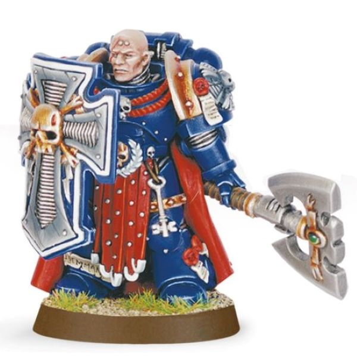

# 0270 守望大师 Master of the Watch

精校状态：中文行文已逐段精校，部分术语仍为暂定

分类：通用概念 / 帝国 Imperium / 中央政务部 Adeptus Terra / 阿斯塔特修会 Adeptus Astartes

原文来源：https://www.bilibili.com/opus/1030340221701455879

原作者：帝国神选罐头

原文时间：2025年02月05日 13:26

[返回分类目录](目录.md) · [全书目录](../../目录.md)

<!-- A0270-B0001 -->
**英文原文**

Master of the Watch is a class of Space Marine Master used by Codex Chapters given to Captains of a Chapter's 2nd Company.

<!-- /A0270-B0001 -->

<!-- A0270-B0002 -->

原译文

守望之主是一种星际战士大师，由圣典战团授予战团第二连的连长。

**校订译文**

守望大师是遵循《阿斯塔特圣典》的星际战士战团高层职衔之一，授予第二连连长。

<!-- /A0270-B0002 -->

<!-- A0270-B0003 图片 -->

<!-- A0270-B0004 -->

原译文

Master of the Watch 守望之主

**校订译文**

Master of the Watch 守望大师

<!-- /A0270-B0004 -->

<!-- A0270-B0005 -->
**英文原文**

The Master of the Watch is heavily involved in system-wide defence and intelligence assessment of threats to their Chapter's homeworld. Regardless of how much a Chapter involves itself in the affairs of its home population, the Master of the Watch takes a keen interest in them.

<!-- /A0270-B0005 -->

<!-- A0270-B0006 -->

原译文

守望之主积极参与全系统防御和情报评估对其战团家园世界的威胁。无论一个战团在多大程度上涉及其家园人口的事务，守望大师都对它们非常感兴趣。

**校订译文**

守望大师深度参与母星所在星系的整体防御，并评估情报，判断母星面临的威胁。无论战团平时多大程度地介入母星居民的事务，守望大师始终密切关注当地社会。

<!-- /A0270-B0006 -->

<!-- A0270-B0007 -->
## Notable Masters of the Watch 著名守望大师

<!-- /A0270-B0007 -->

<!-- A0270-B0008 -->
**英文原文**

Captain Cato Sicarius of the Ultramarines

<!-- /A0270-B0008 -->

<!-- A0270-B0009 -->

原译文

极限战士的卡托·西卡留斯连长

**校订译文**

极限战士的卡托·西卡留斯连长

<!-- /A0270-B0009 -->

<!-- A0270-B0010 -->
**英文原文**

Captain Donatos Aphael of the Blood Angels

<!-- /A0270-B0010 -->

<!-- A0270-B0011 -->

原译文

圣血天使的多纳托斯·阿斐尔连长

**校订译文**

圣血天使的多纳托斯·阿斐尔连长

<!-- /A0270-B0011 -->

<!-- A0270-B0012 -->
**英文原文**

Captain Pellas Mir'san of the Salamanders

<!-- /A0270-B0012 -->

<!-- A0270-B0013 -->

原译文

火蜥蜴的佩拉斯·米瑞桑连长

**校订译文**

火蜥蜴的佩拉斯·米尔’杉连长

**校注：** 已核同一人物、组织、型号或事件，与全书核心术语及后续专篇统一；原译保留对照。

<!-- /A0270-B0013 -->

<!-- A0270-B0014 -->
**英文原文**

Captain Olbyn Kadena of the Crimson Fists

<!-- /A0270-B0014 -->

<!-- A0270-B0015 -->

原译文

绯红之拳的奥比恩·卡德纳连长

**校订译文**

绯红之拳的奥比恩·卡德纳连长

<!-- /A0270-B0015 -->

<!-- A0270-B0016 -->
**英文原文**

Dorghai Khan of the White Scars

<!-- /A0270-B0016 -->

<!-- A0270-B0017 -->

原译文

白色疤痕的多尔盖可汗

**校订译文**

白疤的多尔盖可汗

<!-- /A0270-B0017 -->

<!-- A0270-B0018 -->
**英文原文**

Master Ezekiah of the Dark Angels

<!-- /A0270-B0018 -->

<!-- A0270-B0019 -->

原译文

黑暗天使的伊泽基亚大师

**校订译文**

黑暗天使的伊泽基亚大师

<!-- /A0270-B0019 -->

本篇核心术语与暂定项

以下列出本篇出现的英文原形及核心术语表用词。同形词可能指不同对象，具体词义以本篇正文和校注为准；单复数、别名和仅见于图注的名称可能尚未列入。完整候选见[术语表](../../术语表/双语术语候选.csv)。

| 英文 | 采用中文 | 状态 |
| --- | --- | --- |
| Blood Angels | 圣血天使 | 官方已核对 |
| Dark Angels | 黑暗天使 | 官方已核对 |
| Ultramarines | 极限战士 | 官方已核对 |
| Salamanders | 火蜥蜴 | 暂定·官方待核 |
| Master | 导师（审判庭职衔）／舰务官（舰员职务） | 语境定译·官方待核 |
| Master of the Watch | 守望大师 | 暂定·官方待核 |
| White Scars | 白疤 | 官方已核 |
| Scars | 伤疤 | 暂定·官方待核 |
| Crimson Fists | 绯红之拳 | 暂定·官方待核 |
| Space Marine | 星际战士 | 暂定·官方待核 |
| Chapter | 战团 | 暂定·官方待核 |
| Captain | 连长 | 暂定·官方待核 |
| Cato Sicarius | 卡托·西卡留斯 | 暂定·官方待核 |
| Pellas Mir'san | 佩拉斯·米尔’杉 | 暂定·官方待核 |
| The Dark | 《黑暗》 | 暂定·官方待核 |
| The Blood | 鲜血 | 暂定·官方待核 |
| System | 星系（恒星系统） | 暂定·官方待核 |
| Aphael | 阿菲尔 | 暂定·官方待核 |

