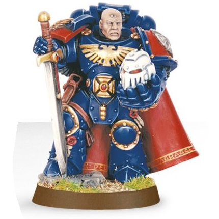

# 0271 军械大师 Master of the Arsenal

精校状态：中文行文已逐段精校，部分术语仍为暂定

分类：通用概念 / 帝国 Imperium / 中央政务部 Adeptus Terra / 阿斯塔特修会 Adeptus Astartes

原文来源：https://www.bilibili.com/opus/1028221570209808385

原作者：帝国神选罐头

原文时间：编辑于 2025年07月15日 13:08

[返回分类目录](目录.md) · [全书目录](../../目录.md)

<!-- A0271-B0001 -->
**英文原文**

Master of the Arsenal is a class of Space Marine Master used by Codex Chapters given to Captains of the 3rd Company. Presumably, they help oversee the arsenal and munitions of their Chapter.

<!-- /A0271-B0001 -->

<!-- A0271-B0002 -->

原译文

军械之主是第三连长所使用的圣典战团中使用的一个星际战士大师级别。据推测，他们帮助监督其战团的军械库和弹药。

**校订译文**

军械大师是遵循《阿斯塔特圣典》的星际战士战团高层职衔之一，授予第三连连长。据推测，他们协助管理战团的军械与弹药。

<!-- /A0271-B0002 -->

<!-- A0271-B0003 图片 -->

<!-- A0271-B0004 -->

原译文

Master of the Arsenal 军械之主

**校订译文**

Master of the Arsenal 军械大师

<!-- /A0271-B0004 -->

<!-- A0271-B0005 -->
## Notable Masters of the Arsenal 著名军械大师

原题：Notable Masters of the Arsenal 著名军械之主

<!-- /A0271-B0005 -->

<!-- A0271-B0006 -->
**英文原文**

Captain Mikael Fabian of the Ultramarines.

<!-- /A0271-B0006 -->

<!-- A0271-B0007 -->

原译文

极限战士的米凯尔·法比安连长

**校订译文**

极限战士的米凯尔·法比安连长

<!-- /A0271-B0007 -->

<!-- A0271-B0008 -->
**英文原文**

Captain Ardias of the Ultramarines (deceased).

<!-- /A0271-B0008 -->

<!-- A0271-B0009 -->

原译文

极限战士的阿迪亚斯连长（已牺牲）

**校订译文**

极限战士的阿迪亚斯连长（已牺牲）

<!-- /A0271-B0009 -->

<!-- A0271-B0010 -->
**英文原文**

Captain Agatone of the Salamanders.

<!-- /A0271-B0010 -->

<!-- A0271-B0011 -->

原译文

火蜥蜴的阿加顿连长

**校订译文**

火蜥蜴的阿加顿连长

<!-- /A0271-B0011 -->

<!-- A0271-B0012 -->
**英文原文**

Captain Sendini of the Blood Angels.

<!-- /A0271-B0012 -->

<!-- A0271-B0013 -->

原译文

圣血天使的森迪尼连长

**校订译文**

圣血天使的森迪尼连长

<!-- /A0271-B0013 -->

<!-- A0271-B0014 -->
**英文原文**

Master Astoran of the Dark Angels

<!-- /A0271-B0014 -->

<!-- A0271-B0015 -->

原译文

黑暗天使的阿斯托兰连长

**校订译文**

黑暗天使的阿斯托兰连长

<!-- /A0271-B0015 -->

本篇核心术语与暂定项

以下列出本篇出现的英文原形及核心术语表用词。同形词可能指不同对象，具体词义以本篇正文和校注为准；单复数、别名和仅见于图注的名称可能尚未列入。完整候选见[术语表](../../术语表/双语术语候选.csv)。

| 英文 | 采用中文 | 状态 |
| --- | --- | --- |
| Blood Angels | 圣血天使 | 官方已核对 |
| Dark Angels | 黑暗天使 | 官方已核对 |
| Ultramarines | 极限战士 | 官方已核对 |
| Salamanders | 火蜥蜴 | 暂定·官方待核 |
| Master | 导师（审判庭职衔）／舰务官（舰员职务） | 语境定译·官方待核 |
| Master of the Arsenal | 军械大师 | 暂定·官方待核 |
| Space Marine | 星际战士 | 暂定·官方待核 |
| Chapter | 战团 | 暂定·官方待核 |
| Captain | 连长 | 暂定·官方待核 |
| Mikael Fabian | 米凯尔·法比安 | 暂定·官方待核 |
| The Dark | 《黑暗》 | 暂定·官方待核 |
| The Blood | 鲜血 | 暂定·官方待核 |
| Sendini | 森迪尼 | 暂定·官方待核 |

