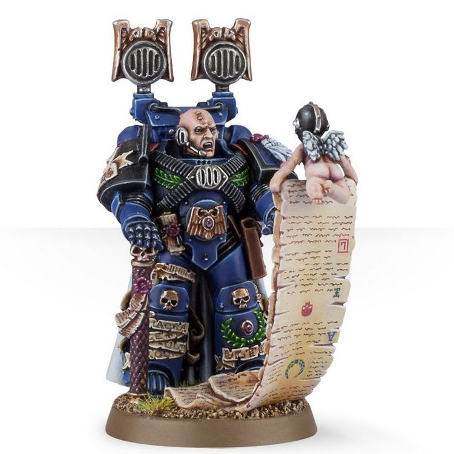

# 0273 行军大师 Master of the Marches

精校状态：中文行文已逐段精校，部分术语仍为暂定

分类：通用概念 / 帝国 Imperium / 中央政务部 Adeptus Terra / 阿斯塔特修会 Adeptus Astartes

原文来源：https://www.bilibili.com/opus/1028220840067465237

原作者：帝国神选罐头

原文时间：编辑于 2025年01月30日 20:24

[返回分类目录](目录.md) · [全书目录](../../目录.md)

<!-- A0273-B0001 -->
**英文原文**

Master of the Marches is a class of Space Marine Master used by Codex Chapters given to Captains of the 5th Company.

<!-- /A0273-B0001 -->

<!-- A0273-B0002 -->

原译文

行军大师是第五连长所使用的圣典战团中的一种星际战士大师级别。

**校订译文**

行军大师是遵循《阿斯塔特圣典》的星际战士战团高层职衔之一，授予第五连连长。

<!-- /A0273-B0002 -->

<!-- A0273-B0003 图片 -->

<!-- A0273-B0004 -->

原译文

Master of the Marches 行军大师

**校订译文**

Master of the Marches 行军大师

<!-- /A0273-B0004 -->

<!-- A0273-B0005 -->
**英文原文**

These Masters oversee the deployment of the Chapter's fighting strength and it is to his knowledge that the Chapter turns when readying for war. Masters of the Marches are wholly devoted to their logistical duties and oversee immense amounts of data.

<!-- /A0273-B0005 -->

<!-- A0273-B0006 -->

原译文

这些大师负责监督战团战斗力量的部署，据他所知，在备战时，形势会发生转变。行军大师完全致力于他们的后勤职责，并监督大量的数据。

**校订译文**

行军大师负责统筹战团兵力的部署；战团备战时，往往要依靠他的专业知识。他全身心投入后勤事务，掌管并处理海量数据。

**校注：** it is to his knowledge that the Chapter turns 指战团备战时求助于其知识，原译形势发生转变误解 turns。

<!-- /A0273-B0006 -->

<!-- A0273-B0007 -->
## Notable Masters of the Marches 著名行军大师

<!-- /A0273-B0007 -->

<!-- A0273-B0008 -->
**英文原文**

Captain Galenus of the Ultramarines.

<!-- /A0273-B0008 -->

<!-- A0273-B0009 -->

原译文

极限战士盖伦连长

**校订译文**

极限战士盖伦连长

<!-- /A0273-B0009 -->

<!-- A0273-B0010 -->
**英文原文**

Shadow Captain Solaq of the Raven Guard

<!-- /A0273-B0010 -->

<!-- A0273-B0011 -->

原译文

暗鸦守卫暗影连长索拉克

**校订译文**

暗鸦守卫暗影连长索拉克

<!-- /A0273-B0011 -->

本篇核心术语与暂定项

以下列出本篇出现的英文原形及核心术语表用词。同形词可能指不同对象，具体词义以本篇正文和校注为准；单复数、别名和仅见于图注的名称可能尚未列入。完整候选见[术语表](../../术语表/双语术语候选.csv)。

| 英文 | 采用中文 | 状态 |
| --- | --- | --- |
| Ultramarines | 极限战士 | 官方已核对 |
| Master | 导师（审判庭职衔）／舰务官（舰员职务） | 语境定译·官方待核 |
| Master of the Marches | 行军大师 | 暂定·官方待核 |
| Raven Guard | 暗鸦守卫 | 官方已核 |
| Space Marine | 星际战士 | 暂定·官方待核 |
| Chapter | 战团 | 暂定·官方待核 |
| Captain | 连长 | 暂定·官方待核 |
| Shadow Captain | 暗影连长 | 暂定·官方待核 |
| Galenus | 盖兰努斯 | 暂定·官方待核 |

