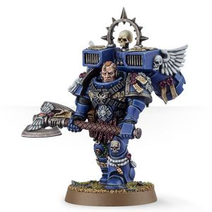

# 0275 处刑者领主 Lord Executioner

精校状态：中文行文已逐段精校，部分术语仍为暂定

分类：通用概念 / 帝国 Imperium / 中央政务部 Adeptus Terra / 阿斯塔特修会 Adeptus Astartes

原文来源：https://www.bilibili.com/opus/1026954799639166983

原作者：帝国神选罐头

原文时间：2025年01月27日 10:29

[返回分类目录](目录.md) · [全书目录](../../目录.md)

<!-- A0275-B0001 -->
**英文原文**

Lord Executioner is a title traditionally held by the Captain of a Space Marine Chapter's 8th Company. Lord Executioners are brutal and direct individuals, known to be bloody and efficient in close combat, rather than heroic or flamboyant. As is typical of Assault Squads they are equipped with Jump Packs.

<!-- /A0275-B0001 -->

<!-- A0275-B0002 -->

原译文

处刑者领主是一个传统上由星际战士第八连队队长拥有的头衔。领主处刑者是残忍而直接的人，众所周知，他们在近战中血腥而高效，而不是英勇或浮夸。与突击小队的典型特征一样，他们配备了跳跃背包。

**校订译文**

处刑者领主是传统上授予星际战士战团第八连连长的头衔。这些人物残酷而直接，以近战中血腥、高效的杀戮闻名，而非英雄气概或张扬作风。如突击小队的常规配置一样，他们也装备跳跃背包。

<!-- /A0275-B0002 -->

<!-- A0275-B0003 图片 -->

<!-- A0275-B0004 -->

原译文

Lord Executioner 处刑者领主

**校订译文**

Lord Executioner 处刑者领主

<!-- /A0275-B0004 -->

<!-- A0275-B0005 -->
## Notable Lord Executioners 著名处刑者领主

<!-- /A0275-B0005 -->

<!-- A0275-B0006 -->
**英文原文**

Jorus Numitor - Ultramarines.

<!-- /A0275-B0006 -->

<!-- A0275-B0007 -->

原译文

乔鲁斯·努米托 - 极限战士

**校订译文**

乔鲁斯·努米托 - 极限战士

<!-- /A0275-B0007 -->

<!-- A0275-B0008 -->
**英文原文**

Molochi - Dark Angels.

<!-- /A0275-B0008 -->

<!-- A0275-B0009 -->

原译文

莫洛奇 - 黑暗天使

**校订译文**

莫洛奇 - 黑暗天使

<!-- /A0275-B0009 -->

<!-- A0275-B0010 -->
**英文原文**

Reszasz Krevaan - Raven Guard.

<!-- /A0275-B0010 -->

<!-- A0275-B0011 -->

原译文

雷斯扎·克雷瓦恩 - 暗鸦守卫

**校订译文**

雷斯扎·克雷万 - 暗鸦守卫

**校注：** 已核同一人物、组织、型号或事件，与全书核心术语及后续专篇统一；原译保留对照。

<!-- /A0275-B0011 -->

本篇核心术语与暂定项

以下列出本篇出现的英文原形及核心术语表用词。同形词可能指不同对象，具体词义以本篇正文和校注为准；单复数、别名和仅见于图注的名称可能尚未列入。完整候选见[术语表](../../术语表/双语术语候选.csv)。

| 英文 | 采用中文 | 状态 |
| --- | --- | --- |
| Dark Angels | 黑暗天使 | 官方已核对 |
| Ultramarines | 极限战士 | 官方已核对 |
| Lord Executioner | 处刑者领主 | 暂定·官方待核 |
| Raven Guard | 暗鸦守卫 | 官方已核 |
| Space Marine | 星际战士 | 暂定·官方待核 |
| Chapter | 战团 | 暂定·官方待核 |
| Captain | 连长 | 暂定·官方待核 |
| Executioners | 处刑者 | 语境定译·官方待核 |
| Assault Squads | 突击小队 | 暂定·官方待核 |
| Reszasz Krevaan | 雷斯扎·克雷万 | 暂定·官方待核 |
| Numitor | 努米托 | 暂定·官方待核 |

