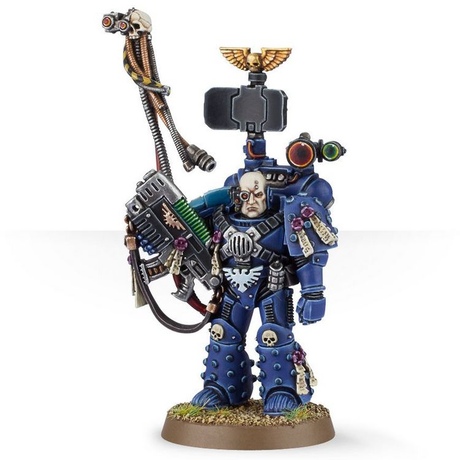

# 0276 遗物大师 Master of Relics

精校状态：中文行文已逐段精校，部分术语仍为暂定

分类：通用概念 / 帝国 Imperium / 中央政务部 Adeptus Terra / 阿斯塔特修会 Adeptus Astartes

原文来源：https://www.bilibili.com/opus/1027352474958168064

原作者：帝国神选罐头

原文时间：2025年01月28日 12:12

[返回分类目录](目录.md) · [全书目录](../../目录.md)

<!-- A0276-B0001 -->
**英文原文**

Master of Relics are a class of Space Marine Master. The commander of the 9th Company, the Master of Relics is an unmatched expert in the tactics of long-range warfare. He is also the guardian of the Chapter's many technological masterpieces and relics, bringing them to the battlefield in times of need.

<!-- /A0276-B0001 -->

<!-- A0276-B0002 -->

原译文

遗物大师是一类星际战士大师。作为第九连的指挥官，遗物大师是远程作战战术方面无与伦比的专家。他也是该战团许多技术杰作和遗物的守护者，在需要时将它们带到战场上。

**校订译文**

遗物大师是星际战士战团高层职衔之一，由第九连指挥官担任。他精通远程作战战术，也是战团众多技术杰作与遗物的守护者，会在需要时将它们带上战场。

<!-- /A0276-B0002 -->

<!-- A0276-B0003 图片 -->

<!-- A0276-B0004 -->

原译文

Master of Relics 遗物大师

**校订译文**

Master of Relics 遗物大师

<!-- /A0276-B0004 -->

<!-- A0276-B0005 -->
## Notable Master of Relics 著名遗物大师

<!-- /A0276-B0005 -->

<!-- A0276-B0006 -->
**英文原文**

Xerophus of the Dark Angels

<!-- /A0276-B0006 -->

<!-- A0276-B0007 -->

原译文

黑暗天使的泽拉普斯

**校订译文**

黑暗天使的泽拉普斯

<!-- /A0276-B0007 -->

<!-- A0276-B0008 -->
**英文原文**

Nehr Ur'Venn of the Salamanders

<!-- /A0276-B0008 -->

<!-- A0276-B0009 -->

原译文

火蜥蜴的奈尔·乌尔文

**校订译文**

火蜥蜴的奈尔·乌尔文

<!-- /A0276-B0009 -->

<!-- A0276-B0010 -->
**英文原文**

Sinon of the Ultramarines

<!-- /A0276-B0010 -->

<!-- A0276-B0011 -->

原译文

极限战士的希诺

**校订译文**

极限战士的希诺

<!-- /A0276-B0011 -->

<!-- A0276-B0012 -->
**英文原文**

Vordin Krayn of the Raven Guard

<!-- /A0276-B0012 -->

<!-- A0276-B0013 -->

原译文

暗鸦守卫的沃丁·克莱恩

**校订译文**

暗鸦守卫的沃丁·科莱恩

**校注：** 已核同一人物、组织、型号或事件，与全书核心术语及后续专篇统一；原译保留对照。

<!-- /A0276-B0013 -->

本篇核心术语与暂定项

以下列出本篇出现的英文原形及核心术语表用词。同形词可能指不同对象，具体词义以本篇正文和校注为准；单复数、别名和仅见于图注的名称可能尚未列入。完整候选见[术语表](../../术语表/双语术语候选.csv)。

| 英文 | 采用中文 | 状态 |
| --- | --- | --- |
| Dark Angels | 黑暗天使 | 官方已核对 |
| Ultramarines | 极限战士 | 官方已核对 |
| Salamanders | 火蜥蜴 | 暂定·官方待核 |
| Master | 导师（审判庭职衔）／舰务官（舰员职务） | 语境定译·官方待核 |
| Master of Relics | 遗物大师 | 暂定·官方待核 |
| Raven Guard | 暗鸦守卫 | 官方已核 |
| Space Marine | 星际战士 | 暂定·官方待核 |
| Chapter | 战团 | 暂定·官方待核 |
| Sinon | 西农 | 暂定·官方待核 |
| Vordin Krayn | 沃丁·科莱恩 | 暂定·官方待核 |
| The Dark | 《黑暗》 | 暂定·官方待核 |

