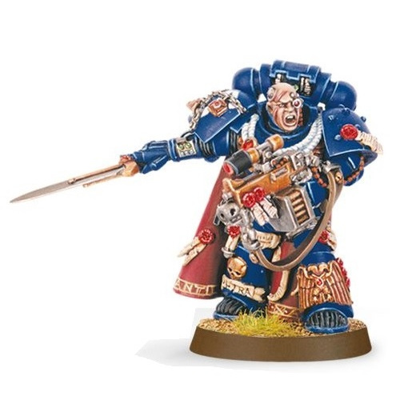

# 0277 新兵大师 Master of the Recruits

精校状态：中文行文已逐段精校，部分术语仍为暂定

分类：通用概念 / 帝国 Imperium / 中央政务部 Adeptus Terra / 阿斯塔特修会 Adeptus Astartes

原文来源：https://www.bilibili.com/opus/1027353029043552280

原作者：帝国神选罐头

原文时间：2025年01月28日 12:14

[返回分类目录](目录.md) · [全书目录](../../目录.md)

<!-- A0277-B0001 -->
**英文原文**

Master of the Recruits is a class of Space Marine Master used by Codex Chapters given to Captains of the 10th Company. They oversee the newly recruited Neophytes and Scouts of the Chapter.

<!-- /A0277-B0001 -->

<!-- A0277-B0002 -->

原译文

新兵之主是第十连长所使用的圣典战团中的一种星际战士大师。他们负责监督新招募的战团新成员和侦察兵。

**校订译文**

新兵大师是遵循《阿斯塔特圣典》的星际战士战团高层职衔之一，授予第十连连长，负责管理战团新招募的受训者与侦察兵。

<!-- /A0277-B0002 -->

<!-- A0277-B0003 图片 -->

<!-- A0277-B0004 -->

原译文

Master of the Recruits 新兵之主

**校订译文**

Master of the Recruits 新兵大师

<!-- /A0277-B0004 -->

<!-- A0277-B0005 -->
## Notable Masters of the Recruits

**补译**

著名新兵大师

<!-- /A0277-B0005 -->

<!-- A0277-B0006 -->
**英文原文**

Captain Antilochus of the Ultramarines

<!-- /A0277-B0006 -->

<!-- A0277-B0007 -->

原译文

极限战士的安提罗科斯连长

**校订译文**

极限战士的安提罗科斯连长

<!-- /A0277-B0007 -->

<!-- A0277-B0008 -->
**英文原文**

Captain Borgio of the Blood Angels

<!-- /A0277-B0008 -->

<!-- A0277-B0009 -->

原译文

血鸦的波吉奥连长

**校订译文**

圣血天使的波吉奥连长

**校注：** 英文 Blood Angels 为圣血天使，不是血鸦。

<!-- /A0277-B0009 -->

<!-- A0277-B0010 -->
**英文原文**

Captain Ba'ken of the Salamanders

<!-- /A0277-B0010 -->

<!-- A0277-B0011 -->

原译文

火蜥蜴的巴肯连长

**校订译文**

火蜥蜴的巴肯连长

<!-- /A0277-B0011 -->

<!-- A0277-B0012 -->
**英文原文**

Master Ranaeus of the Dark Angels

<!-- /A0277-B0012 -->

<!-- A0277-B0013 -->

原译文

黑暗天使的拉内乌斯大师

**校订译文**

黑暗天使的拉内乌斯大师

<!-- /A0277-B0013 -->

<!-- A0277-B0014 -->
**英文原文**

Captain Messinius of the White Consuls

<!-- /A0277-B0014 -->

<!-- A0277-B0015 -->

原译文

白色执政官的梅西尼乌斯连长

**校订译文**

白色执政官的梅西尼乌斯连长

<!-- /A0277-B0015 -->

本篇核心术语与暂定项

以下列出本篇出现的英文原形及核心术语表用词。同形词可能指不同对象，具体词义以本篇正文和校注为准；单复数、别名和仅见于图注的名称可能尚未列入。完整候选见[术语表](../../术语表/双语术语候选.csv)。

| 英文 | 采用中文 | 状态 |
| --- | --- | --- |
| Blood Angels | 圣血天使 | 官方已核对 |
| Dark Angels | 黑暗天使 | 官方已核对 |
| Ultramarines | 极限战士 | 官方已核对 |
| Salamanders | 火蜥蜴 | 暂定·官方待核 |
| Master | 导师（审判庭职衔）／舰务官（舰员职务） | 语境定译·官方待核 |
| Master of the Recruits | 新兵大师 | 暂定·官方待核 |
| Space Marine | 星际战士 | 暂定·官方待核 |
| Chapter | 战团 | 暂定·官方待核 |
| Captain | 连长 | 暂定·官方待核 |
| White Consuls | 白色执政官 | 暂定·官方待核 |
| Antilochus | 安提罗科斯 | 暂定·官方待核 |
| The Dark | 《黑暗》 | 暂定·官方待核 |
| The Blood | 鲜血 | 暂定·官方待核 |

