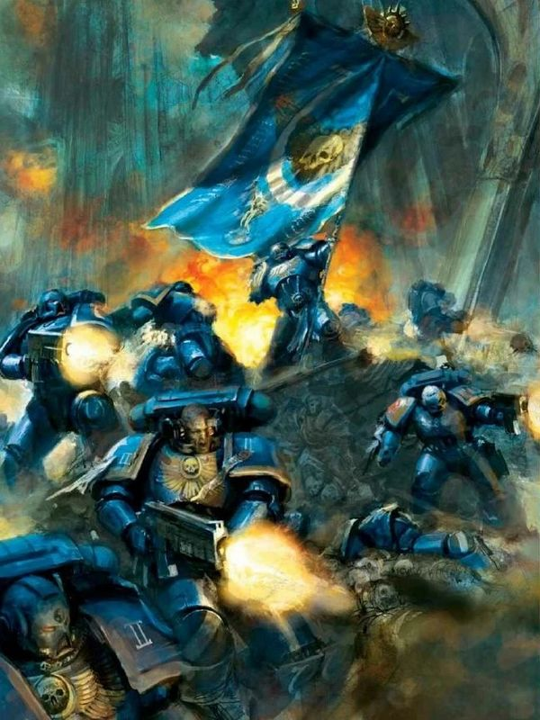
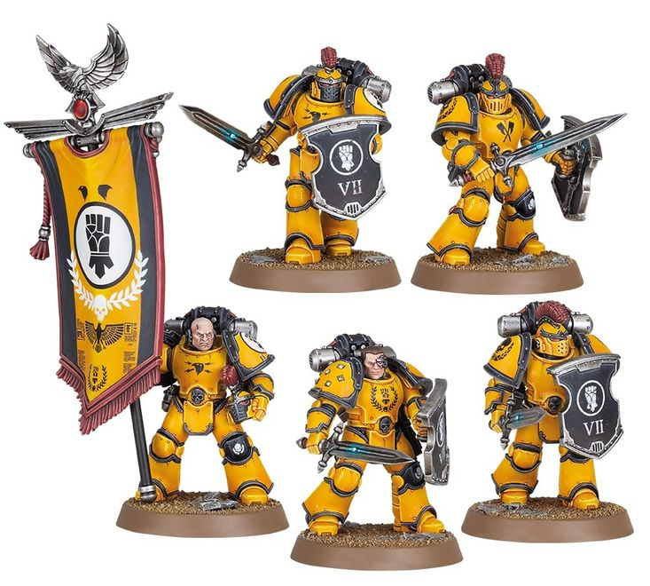
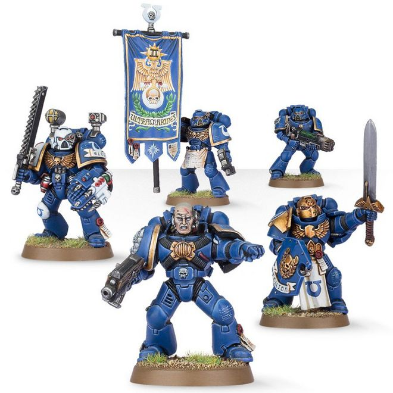
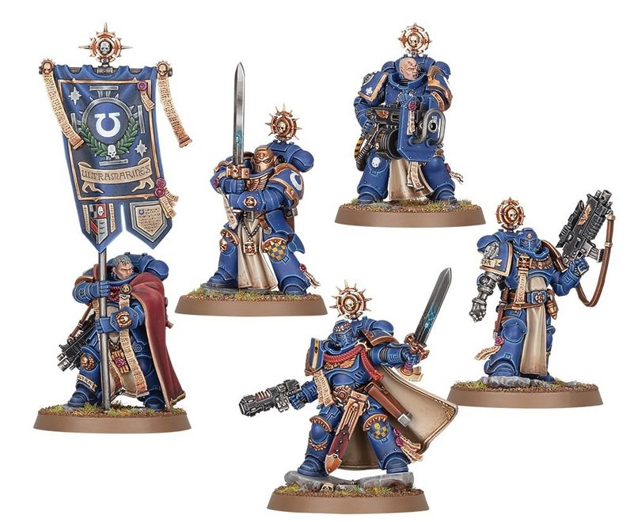

# 0280 指挥小队 Command Squad

精校状态：中文行文已逐段精校，部分术语仍为暂定

分类：通用概念 / 帝国 Imperium / 中央政务部 Adeptus Terra / 阿斯塔特修会 Adeptus Astartes

原文来源：https://www.bilibili.com/opus/1020228189391159297

原作者：帝国神选罐头

原文时间：编辑于 2025年07月26日 11:47

[返回分类目录](目录.md) · [全书目录](../../目录.md)

原篇名：指挥组 Command Squad

<!-- A0280-B0001 -->
**英文原文**

A Command Squad is a specialized unit formed around the Commander of a Space Marine Company.

<!-- /A0280-B0001 -->

<!-- A0280-B0002 -->

原译文

指挥组是围绕星际战士连长组建的一个专门单位。

**校订译文**

指挥小队是以星际战士连长为核心组建的专门单位。

<!-- /A0280-B0002 -->

<!-- A0280-B0003 图片 -->

<!-- A0280-B0004 -->

原译文

Ultramarines Command Squad 极限战士指挥组

**校订译文**

Ultramarines Command Squad 极限战士指挥小队

<!-- /A0280-B0004 -->

<!-- A0280-B0005 -->
## Description 描述

<!-- /A0280-B0005 -->

<!-- A0280-B0006 -->
**英文原文**

A command Squad is a cadre of highly disciplined Veterans carrying special or heavy weapons, serving as bodyguard unit for the Force Commander

<!-- /A0280-B0006 -->

<!-- A0280-B0007 -->

原译文

指挥组是一支纪律严明的老兵队伍，携带特殊或重型武器，为部队指挥官担任护卫

**校订译文**

指挥小队由纪律严明的老兵组成，携带特种或重型武器，担任部队指挥官的贴身护卫。

<!-- /A0280-B0007 -->

<!-- A0280-B0008 -->
**英文原文**

Marines selected for a Command Squad are chosen not only for their combat skills, but also an equal measure of tactical and strategic aptitude. A Captain and his Command Squad inevitably go where the fighting is thickest in any battle, so only the luckiest and most experienced warriors survive more than a few battles - and those that do have proven themselves beyond all doubt, and are often nominated to succeed their Captain in the event of his death.

<!-- /A0280-B0008 -->

<!-- A0280-B0009 -->

原译文

被选为指挥组的星际战士不仅因其战斗技能而被选中，还因其同等的战术和战略才能而被选中。在任何战斗中，连长和他的指挥组都不可避免地会去战斗最激烈的地方，所以只有最幸运、最有经验的战士才能在几场战斗中幸存下来，而那些幸存下来的战士已经毫无疑问地证明了自己，并且经常被提名在连长牺牲时接替他的位置。

**校订译文**

入选指挥小队的星际战士，不仅要武艺出众，也须具备相应的战术与战略才能。连长与指挥小队总会奔赴战斗最激烈之处，因此只有最幸运、经验最丰富的战士，才能接连熬过多场恶战。这些幸存者的能力已经毋庸置疑，常被列为连长阵亡后的继任人选。

<!-- /A0280-B0009 -->

<!-- A0280-B0010 -->
**英文原文**

These specialists provide vital support as honour guards and aides – Company Champions defend their Chapter's honour with martial excellence, Ancients guard its inspirational banners, and Company Veterans lay down hails of fire from relic bolt weapons.

<!-- /A0280-B0010 -->

<!-- A0280-B0011 -->

原译文

这些专家作为荣誉卫队和助手提供了至关重要的支持——连队冠军用卓越的武术捍卫他们战团的荣誉，旗手们守卫着其鼓舞人心的旗帜，连队老兵用圣物爆矢武器投射火力。

**校订译文**

这些专职战士作为荣誉卫士与助手，提供不可或缺的支援：连队冠军以精湛武艺捍卫战团荣誉，旗手守护鼓舞士气的军旗，连队老兵则用圣物爆矢武器倾泻密集火力。

<!-- /A0280-B0011 -->

<!-- A0280-B0012 -->
### Equipment 装备

<!-- /A0280-B0012 -->

<!-- A0280-B0013 -->
**英文原文**

It is not uncommon for Space Marine Command Squads to be mounted on Space Marine Bikes if the commander they are guarding is mounted on one. The command squad may be outfitted with specialist gear such as melta bombs or storm shields, and may take a dedicated transport such as a Rhino or Razorback.

<!-- /A0280-B0013 -->

<!-- A0280-B0014 -->

原译文

如果他们守卫的指挥官骑在星际战士摩托上，那么星际战士指挥组也会骑在星际战士摩托上。指挥组可能配备有专业装备，如热熔炸弹或风暴盾，并可能乘坐犀牛或豪猪等专用运输工具。

**校订译文**

如果受保护的指挥官骑乘星际战士摩托，指挥小队也常采用同样的坐骑。小队可以配备热熔炸弹、风暴盾等专门装备，也可搭乘犀牛战车或豪猪战车等专用运输载具。

<!-- /A0280-B0014 -->

<!-- A0280-B0015 -->
## Command Squads trough the Ages 不同时代的指挥小队

原题：Command Squads trough the Ages 穿越时代的指挥组

<!-- /A0280-B0015 -->

<!-- A0280-B0016 -->
**英文原文**

Command Squad composition has seen variations depending on the Era.

<!-- /A0280-B0016 -->

<!-- A0280-B0017 -->

原译文

指挥小队的组成因时代而异。

**校订译文**

指挥小队的组成随时代而变化。

<!-- /A0280-B0017 -->

<!-- A0280-B0018 -->
### Heresy era 荷鲁斯之乱时期

原题：Heresy era 叛乱时期

<!-- /A0280-B0018 -->

<!-- A0280-B0019 -->
**英文原文**

During the Horus Heresy a Legion Command Squad could be formed at the Chapter, Battalion or Company level.

<!-- /A0280-B0019 -->

<!-- A0280-B0020 -->

原译文

在荷鲁斯叛乱期间，可以在战团、营或连队级别组建军团指挥组。

**校订译文**

荷鲁斯之乱期间，军团可在战团、营或连等层级组建指挥小队。

<!-- /A0280-B0020 -->

<!-- A0280-B0021 图片 -->

<!-- A0280-B0022 -->

原译文

Legion Command Squad 军团指挥组

**校订译文**

Legion Command Squad 军团指挥小队

<!-- /A0280-B0022 -->

<!-- A0280-B0023 -->
**英文原文**

It was typical for Praetors to fight alongside a squad of exceptionally disciplined and skilled warriors. This squad acts as both the commander's personal guard and the bearers of one of the Legion Standard, serving as a focal point for rallying the Legion's troops on the battlefield. These selected Space Marines are equipped with the finest weaponry the Legion has to offer and epitomize the honor of the Legion in combat.

<!-- /A0280-B0023 -->

<!-- A0280-B0024 -->

原译文

执政官通常会与一群纪律严明、技术娴熟的战士并肩作战。该小队既是指挥官的私人卫队，也是军团旗帜之一的持有者，是在战场上集结军团部队的协调中心。这些被选中的星际战士配备了军团所能提供的最精良的武器，是军团在战斗中荣誉的缩影。

**校订译文**

执政官通常与一队纪律严明、技艺超群的战士并肩作战。这些人既是其私人卫队，也负责执掌一面军团军旗，成为战场上集结部队的中心。他们配备军团最精良的武器，以自己的表现彰显军团荣誉。

<!-- /A0280-B0024 -->

<!-- A0280-B0025 -->
### Composition 构成

<!-- /A0280-B0025 -->

<!-- A0280-B0026 -->
**英文原文**

2-4 Space Marine Chosen

<!-- /A0280-B0026 -->

<!-- A0280-B0027 -->

原译文

2-4名受选星际战士

**校订译文**

2-4名受选星际战士

<!-- /A0280-B0027 -->

<!-- A0280-B0028 -->
**英文原文**

1 Legion Standard Bearer

<!-- /A0280-B0028 -->

<!-- A0280-B0029 -->

原译文

1名军团持旗者

**校订译文**

1名军团旗手

<!-- /A0280-B0029 -->

<!-- A0280-B0030 -->
### Available Wargear 可用作战装备

<!-- /A0280-B0030 -->

<!-- A0280-B0031 -->
**英文原文**

Artificer Armour, Combat shield, Legion Standard, Terminator Armour, Nuncio-vox

<!-- /A0280-B0031 -->

<!-- A0280-B0032 -->

原译文

精工盔甲，战斗盾，军团旗帜，终结者盔甲，大使音阵

**校订译文**

精工护甲、战斗盾、军团军旗、终结者护甲、通讯引导阵列。

**校注：** Nuncio-vox 暂译通讯引导阵列；原译大使音阵把功能性装备名称按普通词拆译。

<!-- /A0280-B0032 -->

<!-- A0280-B0033 -->
**英文原文**

Bolter, Bolt pistol, Chainsword, Combat Blade, Frag and krak grenades, Heavy chainsword, Charnabal Sabre, Power Fist, Lightning Claw, Plasma Pistol, Volkite Charger

<!-- /A0280-B0033 -->

<!-- A0280-B0034 -->

原译文

爆矢枪，爆矢手枪，链锯剑，格斗刃，破片与穿甲手榴弹，重型链锯剑，查纳巴尔军刀，动力拳，闪电爪，等离子手枪，爆燃突击铳

**校订译文**

爆矢枪、爆矢手枪、链锯剑、战斗短刃、破片与穿甲手榴弹、重型链锯剑、查纳巴尔军刀、动力拳、闪电爪、等离子手枪、爆燃突击铳。

<!-- /A0280-B0034 -->

<!-- A0280-B0035 -->
**英文原文**

Warhawk Jump Pack, Spatha Combat Bike, Legion Scimitar Jetbike

<!-- /A0280-B0035 -->

<!-- A0280-B0036 -->

原译文

战鹰跳跃背包，长剑战斗摩托，军团弯刀悬浮摩托

**校订译文**

战鹰跳跃背包，长剑战斗摩托，军团弯刀悬浮摩托

<!-- /A0280-B0036 -->

<!-- A0280-B0037 -->
### Time of Ending 终结之时

<!-- /A0280-B0037 -->

<!-- A0280-B0038 -->
**英文原文**

During the Time of Ending era, the basic structure of a Command Squad was 1 Sergeant leading between 4 to 9 Space Marines.forming a bodyguard unit A bodyguard could also be joined by a specialist such as an Apothecary, a Techmarine or a Company Standard Bearer; a Veteran Sergeant can lead the squad instead of a simple Sergeant. They accompanied a Leader, Commander, Force Commander, Librarian or Chaplain.

<!-- /A0280-B0038 -->

<!-- A0280-B0039 -->

原译文

在终结之时，指挥组的基本结构是由1名军士领导4至9名星际战士。组建一个护卫部队。护卫也可以由药剂师、技术军士或连队持旗者等专家加入；一名老兵军士可以领导这个小队，而不是一名普通的军士。他们陪同一名领袖、指挥官、部队指挥官、智库或牧师。

**校订译文**

终结之刻，指挥小队的基本编制为一名军士率领四至九名星际战士，组成护卫队。药剂师、科技战士或连队旗手等专职人员也可加入；队长则可由老兵军士取代普通军士。他们随侍的对象包括领袖、指挥官、部队指挥官、智库员或教士。

**校注：** 原英文此段标点、句界有缺损；按完整语义重组中文，保留人数及人员类别。 已核同一人物、组织、型号或事件，与全书核心术语及后续专篇统一；原译保留对照。

<!-- /A0280-B0039 -->

<!-- A0280-B0040 图片 -->

<!-- A0280-B0041 -->

原译文

Command Squad 指挥组

**校订译文**

Command Squad 指挥小队

<!-- /A0280-B0041 -->

<!-- A0280-B0042 -->
**英文原文**

A Terminator Command Squad could also be formed, its basic structure was 1 Sergeant leading between 3 to 9 Terminators.

<!-- /A0280-B0042 -->

<!-- A0280-B0043 -->

原译文

也可以组建一个终结者指挥组，其基本结构是由1名军士领导3至9名终结者。

**校订译文**

也可组建终结者指挥小队，基本编制为一名军士率领三至九名终结者。

<!-- /A0280-B0043 -->

<!-- A0280-B0044 -->
### Age of the Dark Imperium 黑暗帝国时期

<!-- /A0280-B0044 -->

<!-- A0280-B0045 -->
**英文原文**

After the reforms to the Codex Astartes introduced by Roboute Guilliman, a Command Squad was formed from the Heroes of a Company, serving as Honour Guard to Captains and Chapter Masters and was composed of :

<!-- /A0280-B0045 -->

<!-- A0280-B0046 -->

原译文

在罗伯特·基里曼对阿斯塔特圣典进行改革后，由一个连队的英雄组成了一个指挥组，担任连长和战团长的荣誉卫队，由以下人员组成：

**校订译文**

罗保特·基里曼修订《阿斯塔特圣典》后，指挥小队由连队中的英雄组成，担任连长与战团长的荣誉卫队，成员包括：

<!-- /A0280-B0046 -->

<!-- A0280-B0047 图片 -->

<!-- A0280-B0048 -->

原译文

Company Heroes 连队英雄

**校订译文**

Company Heroes 连队英雄

<!-- /A0280-B0048 -->

<!-- A0280-B0049 -->
**英文原文**

1 Veteran Sergeant

<!-- /A0280-B0049 -->

<!-- A0280-B0050 -->

原译文

1名老兵军士

**校订译文**

1名老兵军士

<!-- /A0280-B0050 -->

<!-- A0280-B0051 -->
**英文原文**

1 to 3 Space Marine Veterans

<!-- /A0280-B0051 -->

<!-- A0280-B0052 -->

原译文

1到3名星际战士老兵

**校订译文**

1到3名星际战士老兵

<!-- /A0280-B0052 -->

<!-- A0280-B0053 -->
**英文原文**

1 Company Ancient

<!-- /A0280-B0053 -->

<!-- A0280-B0054 -->

原译文

1名连队旗手

**校订译文**

1名连队旗手

<!-- /A0280-B0054 -->

<!-- A0280-B0055 -->
**英文原文**

1 Company Champion

<!-- /A0280-B0055 -->

<!-- A0280-B0056 -->

原译文

1名连队冠军

**校订译文**

1名连队冠军

<!-- /A0280-B0056 -->

<!-- A0280-B0057 -->
## Chapter Variations 各战团的不同做法

原题：Chapter Variations 战团变体

<!-- /A0280-B0057 -->

<!-- A0280-B0058 -->
**英文原文**

The exact nature and title of a Command Squad varies between Chapters. Some examples include:

<!-- /A0280-B0058 -->

<!-- A0280-B0059 -->

原译文

指挥组的确切性质和名称因战团而异。一些例子包括：

**校订译文**

指挥小队的具体性质与名称因战团而异，例如：

<!-- /A0280-B0059 -->

<!-- A0280-B0060 -->
**英文原文**

The Terrorblades of the Death Spectres;

<!-- /A0280-B0060 -->

<!-- A0280-B0061 -->

原译文

死亡幽灵的恐惧之刃

**校订译文**

死亡幽灵的恐惧之刃

<!-- /A0280-B0061 -->

<!-- A0280-B0062 -->
**英文原文**

The Pyre Wardens of the Fire Lords;

<!-- /A0280-B0062 -->

<!-- A0280-B0063 -->

原译文

火焰领主的薪柴看守者

**校订译文**

火焰领主的火葬守卫；

**校注：** Pyre 指火葬柴堆，暂译火葬守卫；Foeseekers 暂译寻敌者。两者待官方中文证据。

<!-- /A0280-B0063 -->

<!-- A0280-B0064 -->
**英文原文**

The Foeseekers of the Omega Marines;

<!-- /A0280-B0064 -->

<!-- A0280-B0065 -->

原译文

欧米伽的寻衅者

**校订译文**

欧米伽战士的寻敌者；

<!-- /A0280-B0065 -->

<!-- A0280-B0066 -->
**英文原文**

The Prognosticars of the Silver Skulls;

<!-- /A0280-B0066 -->

<!-- A0280-B0067 -->

原译文

银色颅骨的预言者

**校订译文**

银色颅骨的预言者

<!-- /A0280-B0067 -->

<!-- A0280-B0068 -->
**英文原文**

The Wolf Guards of the Space Wolves;

<!-- /A0280-B0068 -->

<!-- A0280-B0069 -->

原译文

太空野狼的野狼守卫

**校订译文**

太空野狼的野狼守卫

<!-- /A0280-B0069 -->

<!-- A0280-B0070 -->
**英文原文**

The Ravenwing Command Squad and Deathwing Command Squad of the Dark Angels;

<!-- /A0280-B0070 -->

<!-- A0280-B0071 -->

原译文

黑暗天使的鸦翼指挥组和死翼指挥组

**校订译文**

黑暗天使的鸦翼指挥小队与死翼指挥小队。

<!-- /A0280-B0071 -->

<!-- A0280-B0072 -->
## Noteworthy Command Squads 著名指挥小队

原题：Noteworthy Command Squads 著名指挥组

<!-- /A0280-B0072 -->

<!-- A0280-B0073 -->
**英文原文**

The Inferno Guard — Salamanders Third Company, Captain Ko'tan Kadai.

<!-- /A0280-B0073 -->

<!-- A0280-B0074 -->

原译文

炼狱守卫 — 火蜥蜴第三连，科坦·卡代连长。

**校订译文**

炼狱守卫 — 火蜥蜴第三连，科坦·卡代连长。

<!-- /A0280-B0074 -->

<!-- A0280-B0075 -->
**英文原文**

"The Lions of Macragge" — Ultramarines Second Company, Captain Cato Sicarius

<!-- /A0280-B0075 -->

<!-- A0280-B0076 -->

原译文

“马库拉格的雄狮” — 极限战士第二连，卡托·西卡留斯连长

**校订译文**

“马库拉格之狮” — 极限战士第二连，卡托·西卡留斯连长

**校注：** 已核同一人物、组织、型号或事件，与全书核心术语及后续专篇统一；原译保留对照。

<!-- /A0280-B0076 -->

<!-- A0280-B0077 -->
**英文原文**

"The Swords of Calth" — Ultramarines Fourth Company, Captain Uriel Ventris

<!-- /A0280-B0077 -->

<!-- A0280-B0078 -->

原译文

“考斯之剑” — 极限战士第四连，乌瑞尔·文崔斯连长

**校订译文**

“考斯之剑” — 极限战士第四连，乌瑞尔·文崔斯连长

<!-- /A0280-B0078 -->

本篇核心术语与暂定项

以下列出本篇出现的英文原形及核心术语表用词。同形词可能指不同对象，具体词义以本篇正文和校注为准；单复数、别名和仅见于图注的名称可能尚未列入。完整候选见[术语表](../../术语表/双语术语候选.csv)。

| 英文 | 采用中文 | 状态 |
| --- | --- | --- |
| Space Marines | 星际战士 | 官方已核对 |
| Dark Angels | 黑暗天使 | 官方已核对 |
| Space Wolves | 太空野狼 | 官方已核对 |
| Librarian | 智库员 | 官方已核对 |
| Terminator | 终结者 | 官方已核对 |
| Bolt Pistol | 爆矢手枪 | 官方已核对 |
| Chainsword | 链锯剑 | 官方已核对 |
| Roboute Guilliman | 罗保特·基里曼 | 官方已核对 |
| Ultramarines | 极限战士 | 官方已核对 |
| Horus Heresy | 荷鲁斯之乱 | 官方已核对 |
| Techmarine | 科技战士 | 官方已核对 |
| Horus | 荷鲁斯 | 暂定·官方待核 |
| Salamanders | 火蜥蜴 | 暂定·官方待核 |
| Calth | 考斯 | 暂定·官方待核 |
| Macragge | 马库拉格 | 暂定·官方待核 |
| Company Champion | 连队冠军 | 暂定·官方待核 |
| Company Ancient | 连队旗手 | 暂定·官方待核 |
| Command Squad | 指挥小队 | 暂定·官方待核 |
| Nuncio-Vox | 通讯引导阵列 | 暂定·官方待核 |
| Pyre Wardens | 火葬守卫 | 暂定·官方待核 |
| Foeseekers | 寻敌者 | 暂定·官方待核 |
| Chaplain | 教士 | 官方已核对 |
| Apothecary | 药剂师 | 官方已核对 |
| Ancient | 旗手 | 官方已核对 |
| Ravenwing Command Squad | 鸦翼指挥小队 | 官方已核对 |
| Rhino | 犀牛战车 | 官方已核对 |
| Razorback | 豪猪战车 | 官方已核对 |
| Cadre | 骨干连（寂静修女）／核心队（钛族） | 语境定译·钛族词根参考 |
| Honour Guard | 荣誉卫队 | 暂定·官方待核 |
| Silver Skulls | 银色颅骨 | 暂定·官方待核 |
| Champion | 冠军 | 暂定·官方待核 |
| Krak Grenades | 穿甲手榴弹 | 暂定·官方待核 |
| Space Marine | 星际战士 | 暂定·官方待核 |
| Chapter | 战团 | 暂定·官方待核 |
| Captain | 连长 | 暂定·官方待核 |
| Veteran | 老兵 | 暂定·官方待核 |
| Terminators | 终结者 | 暂定·官方待核 |
| Sergeant | 军士 | 暂定·官方待核 |
| Cato Sicarius | 卡托·西卡留斯 | 暂定·官方待核 |
| Uriel Ventris | 乌瑞尔·文崔斯 | 官方已核 |
| Codex Astartes | 阿斯塔特圣典 | 暂定·官方待核 |
| Death Spectres | 死亡幽灵 | 暂定·官方待核 |
| Fire Lords | 火焰领主 | 暂定·官方待核 |
| Omega Marines | 欧米伽战士 | 暂定·官方待核 |
| Space Marine Company | 星际战士连队 | 暂定·官方待核 |
| Artificer | 技工 | 暂定·官方待核 |
| Warhawk Jump Pack | 战鹰跳跃背包 | 暂定·官方待核 |
| Standard Bearer | 军旗手 | 暂定·官方待核 |
| Deathwing Command Squad | 死翼指挥小队 | 暂定 |
| Prognosticars | 预言者 | 暂定·官方待核 |
| Bikes | 摩托 | 暂定·官方待核 |
| Ko | 科 | 暂定·官方待核 |
| The Dark | 《黑暗》 | 暂定·官方待核 |
| The Lions of Macragge | 马库拉格之狮 | 暂定·官方待核 |
| Time of Ending | 终结之刻 | 暂定·官方待核 |
| claw | 利爪分队 | 暂定·官方待核 |
| Bolt | 爆矢 | 暂定·官方待核 |
| Bolter | 爆矢枪 | 暂定·官方待核 |
| Plasma pistol | 等离子手枪 | 官方已核对 |
| Volkite Charger | 爆燃突击铳 | 暂定·官方待核 |
| Jump Pack | 跳跃背包 | 暂定·官方待核 |
| Power fist | 动力拳 | 官方已核对 |
| Combat Shield | 战斗盾 | 暂定·官方待核 |
| Terminator Armour | 终结者盔甲 | 暂定·官方待核 |
| Artificer Armour | 精工盔甲 | 暂定·官方待核 |
| Jetbike | 喷气摩托 | 暂定·官方待核 |

