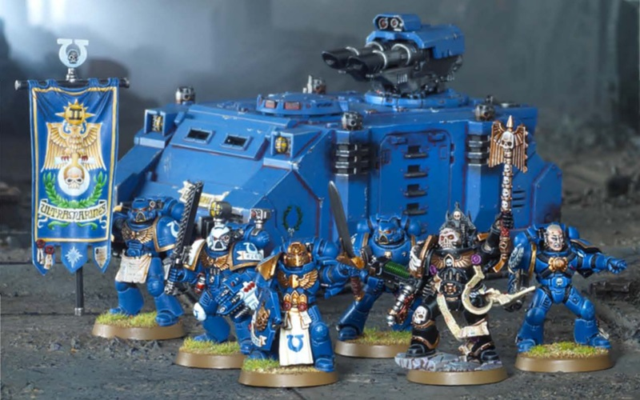

# 0281 隐修圣殿指挥小队 Reclusiam Command Squad

精校状态：中文行文已逐段精校，部分术语仍为暂定

分类：通用概念 / 帝国 Imperium / 中央政务部 Adeptus Terra / 阿斯塔特修会 Adeptus Astartes

原文来源：https://www.bilibili.com/opus/1032514072171511830

原作者：帝国神选罐头

原文时间：2025年02月11日 10:01

[返回分类目录](目录.md) · [全书目录](../../目录.md)

原篇名：隐修会指挥组 Reclusiam Command Squad

<!-- A0281-B0001 -->
**英文原文**

Reclusiam Command Squads are a type of Command Squad lead by a Chaplain.

<!-- /A0281-B0001 -->

<!-- A0281-B0002 -->

原译文

隐修会指挥组是一种由牧师领导的指挥组。

**校订译文**

隐修圣殿指挥小队是一种由教士率领的指挥小队。

<!-- /A0281-B0002 -->

<!-- A0281-B0003 -->
## Description 描述

<!-- /A0281-B0003 -->

<!-- A0281-B0004 -->
**英文原文**

The Reclusiam Command Squad is assembled when the most skilled warriors from a Space Marine company, known as the Command Squad, offer protection to a Chaplain. Within this specialized unit, the Chaplain's guardians, termed Reclusiaries, are seasoned veterans selected from the company's ranks. They encircle the Chaplain, shielding him from harm, and allowing him the freedom to inspire his comrades with fervor and ferocity.

<!-- /A0281-B0004 -->

<!-- A0281-B0005 -->

原译文

当来自星际战士连队的最熟练的战士，即指挥组，为牧师提供保护时，隐修会指挥组就组建了起来。在这个专业的单位里，牧师的守护者，被称为隐修者，是从连队队伍中挑选出来的经验丰富的老兵。他们包围了牧师，保护他免受伤害，并允许他自由地以热情和凶猛激励他的战友。

**校订译文**

星际战士连中最精锐的战士组成指挥小队；当他们奉命保护教士时，便组成隐修圣殿指挥小队。这些从连队中选出的资深老兵称为隐修卫士。他们护卫在教士周围，挡下威胁，让教士得以全力激励同袍，以炽烈的热忱投入战斗。

**校注：** Reclusiam 为隐修圣殿；Reclusiaries 指教士护卫，暂译隐修卫士，与 Reclusiarch 隐修长分开。

<!-- /A0281-B0005 -->

<!-- A0281-B0006 图片 -->

<!-- A0281-B0007 -->

原译文

Reclusiam Command Squad 隐修会指挥组

**校订译文**

Reclusiam Command Squad 隐修圣殿指挥小队

<!-- /A0281-B0007 -->

<!-- A0281-B0008 -->
**英文原文**

Reclusiaries exemplify their Chapter's essence in the way they conduct their mission, often presenting an obstacle as well as a boon. For instance, within the Raven Guard Chapter, known for their expertise in covert warfare, the Reclusiam Command Squads adopt elusive tactics to safeguard their Chaplain, sometimes keeping their strategies clandestine from their fellow battle-brothers, making it harder to coordinate tactics.

<!-- /A0281-B0008 -->

<!-- A0281-B0009 -->

原译文

隐修者在执行任务的方式上体现了他们战团的精髓，这往往既是一种障碍，也是一种益处。例如，在以秘密战争专业知识而闻名的暗鸦守卫战团内，隐修会指挥组采用难以捉摸的战术来保护他们的牧师，有时会对战友保密他们的战略，这使得战术协调变得更加困难。

**校订译文**

隐修卫士执行任务的方式，充分体现所属战团的特质；这种特质既可能带来助益，也可能造成障碍。例如，暗鸦守卫精通隐秘作战，其隐修圣殿指挥小队也以神出鬼没的战术保护教士，有时甚至对其他战斗兄弟隐瞒行动计划，反而增加了协同的难度。

<!-- /A0281-B0009 -->

<!-- A0281-B0010 -->
## Composition 构成

<!-- /A0281-B0010 -->

<!-- A0281-B0011 -->
**英文原文**

Reclusiam Command Squads consist of a Chaplain, Apothecary, Standard Bearer, Company Champion, and Veteran transported by a Razorback.

<!-- /A0281-B0011 -->

<!-- A0281-B0012 -->

原译文

隐修会指挥组由一名牧师、一名药剂师、一名旗手、一名连队冠军和一名老兵组成，由豪猪运兵车运送。

**校订译文**

隐修圣殿指挥小队由教士、药剂师、旗手、连队冠军与老兵各一人组成，搭乘豪猪战车行动。

<!-- /A0281-B0012 -->

<!-- A0281-B0013 -->
**英文原文**

The Apothecary tends to wounded battle-brothers amidst the chaos of combat, ensuring their swift return to the fight. The Standard Bearer carries the Company Standard, a symbol of honor and inspiration. A Chaplain may authorise the Standard Bearer to bring out one of the oldest and most glorious banners in order to inspire his battle-brothers against a potent enemy. Finally, the Company Champion stands ready to engage in duels on behalf of the Chaplain, embodying the Chapter's martial prowess.

<!-- /A0281-B0013 -->

<!-- A0281-B0014 -->

原译文

药剂师在混乱的战斗中照顾受伤的战友，确保他们迅速重返战场。旗手携带连队旗帜，这是荣誉和鼓舞的象征。牧师可以授权旗手拿出最古老、最光荣的旗帜之一，以激励他的战斗兄弟对抗强大的敌人。最后，连队冠军随时准备代表牧师进行决斗，体现了战团的战斗实力。

**校订译文**

药剂师在纷乱的战场上救治受伤同袍，使其尽快重返战斗。旗手执掌连旗，守护这面象征荣誉、激励士气的旗帜；面对强敌时，教士也可批准取出最古老、功勋最卓著的军旗之一，以振奋战斗兄弟。连队冠军则随时准备代教士出战单挑，彰显战团的武艺。

<!-- /A0281-B0014 -->

<!-- A0281-B0015 -->
**英文原文**

To swiftly deploy their wrath to the heart of battle, Reclusiam Command Squads utilize transports like the Razorback, chosen for its speed, armor, and firepower.

<!-- /A0281-B0015 -->

<!-- A0281-B0016 -->

原译文

为了迅速将他们的愤怒部署到战斗的核心，隐修会指挥组利用了像豪猪运兵车这样的运输工具，这些运输工具因其速度、装甲和火力而被选中。

**校订译文**

为迅速杀入战斗最激烈之处，隐修圣殿指挥小队采用豪猪战车等运输载具，看重其速度、装甲与火力的结合。

<!-- /A0281-B0016 -->

<!-- A0281-B0017 -->
## Notable Squads 著名小队

<!-- /A0281-B0017 -->

<!-- A0281-B0018 -->
**英文原文**

Squad Grimaldus - Led by Merek Grimaldus of the Black Templars

<!-- /A0281-B0018 -->

<!-- A0281-B0019 -->

原译文

格瑞马度斯小队 - 由黑色圣堂的莫瑞克·格瑞马度斯领导

**校订译文**

格里玛度斯小队——由黑色圣堂的梅瑞克·格里玛度斯率领。

**校注：** 已核同一人物、组织、型号或事件，与全书核心术语及后续专篇统一；原译保留对照。

<!-- /A0281-B0019 -->

<!-- A0281-B0020 -->
**英文原文**

The Lions of Macragge – Ultramarines 2nd Company

<!-- /A0281-B0020 -->

<!-- A0281-B0021 -->

原译文

马库拉格雄狮 - 极限战士第二连

**校订译文**

马库拉格之狮 - 极限战士第二连

**校注：** 已核同一人物、组织、型号或事件，与全书核心术语及后续专篇统一；原译保留对照。

<!-- /A0281-B0021 -->

<!-- A0281-B0022 -->
**英文原文**

High Hand of the Emperor – Black Templars Nightfire Crusade

<!-- /A0281-B0022 -->

<!-- A0281-B0023 -->

原译文

帝皇至高之手 - 黑色圣堂夜火远征

**校订译文**

帝皇至高之手 - 黑色圣堂夜火远征

<!-- /A0281-B0023 -->

<!-- A0281-B0024 -->
**英文原文**

Conclave of Midnight – Dark Hunters 4th Company

<!-- /A0281-B0024 -->

<!-- A0281-B0025 -->

原译文

午夜秘会 - 黑暗猎手第四连

**校订译文**

午夜秘会 - 黑暗猎手第四连

<!-- /A0281-B0025 -->

<!-- A0281-B0026 -->
**英文原文**

Unseen Spears – Knights of the Raven 2nd Company

<!-- /A0281-B0026 -->

<!-- A0281-B0027 -->

原译文

未视长矛 - 渡鸦骑士第二连

**校订译文**

无形长矛——渡鸦骑士第二连。

<!-- /A0281-B0027 -->

本篇核心术语与暂定项

以下列出本篇出现的英文原形及核心术语表用词。同形词可能指不同对象，具体词义以本篇正文和校注为准；单复数、别名和仅见于图注的名称可能尚未列入。完整候选见[术语表](../../术语表/双语术语候选.csv)。

| 英文 | 采用中文 | 状态 |
| --- | --- | --- |
| Black Templars | 黑色圣堂 | 官方已核对 |
| Ultramarines | 极限战士 | 官方已核对 |
| Emperor | 帝皇 | 官方已核对 |
| Macragge | 马库拉格 | 暂定·官方待核 |
| Mission | 教团／传教机构 | 暂定 |
| Reclusiam | 隐修圣殿 | 暂定·官方待核 |
| Company Champion | 连队冠军 | 暂定·官方待核 |
| Command Squad | 指挥小队 | 暂定·官方待核 |
| Reclusiam Command Squad | 隐修圣殿指挥小队 | 暂定·官方待核 |
| Reclusiaries | 隐修卫士 | 暂定·官方待核 |
| Chaplain | 教士 | 官方已核对 |
| Apothecary | 药剂师 | 官方已核对 |
| Razorback | 豪猪战车 | 官方已核对 |
| Raven Guard | 暗鸦守卫 | 官方已核 |
| Champion | 冠军 | 暂定·官方待核 |
| Space Marine | 星际战士 | 暂定·官方待核 |
| Chapter | 战团 | 暂定·官方待核 |
| Veteran | 老兵 | 暂定·官方待核 |
| Merek Grimaldus | 梅瑞克·格里玛度斯 | 暂定·官方待核 |
| The Black Templars | 黑色圣堂 | 暂定·官方待核 |
| Dark Hunters | 黑暗猎手 | 暂定·官方待核 |
| Knights of the Raven | 渡鸦骑士 | 暂定·官方待核 |
| Space Marine Company | 星际战士连队 | 暂定·官方待核 |
| Standard Bearer | 军旗手 | 暂定·官方待核 |
| Ferocity | 凶猛 | 暂定·官方待核 |
| The Lions of Macragge | 马库拉格之狮 | 暂定·官方待核 |

