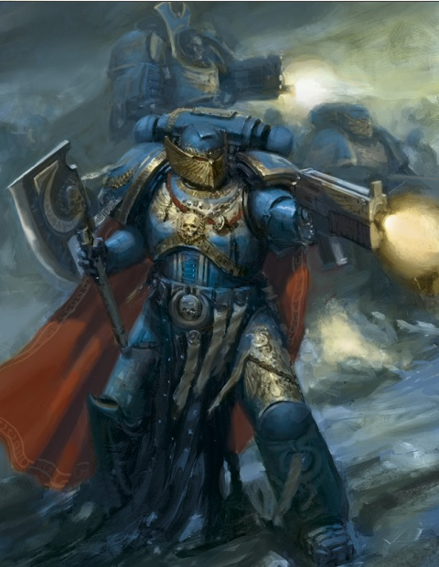

# 0282 荣誉卫队 Honour Guard

精校状态：中文行文已逐段精校，部分术语仍为暂定

分类：通用概念 / 帝国 Imperium / 中央政务部 Adeptus Terra / 阿斯塔特修会 Adeptus Astartes

原文来源：https://www.bilibili.com/opus/1034371027054886914

原作者：帝国神选罐头

原文时间：2025年02月16日 10:07

[返回分类目录](目录.md) · [全书目录](../../目录.md)

<!-- A0282-B0001 -->
**英文原文**

A Space Marine Honour Guard is a unit made of the best soldiers a Space Marine Chapter has to offer.

<!-- /A0282-B0001 -->

<!-- A0282-B0002 -->

原译文

星际战士荣誉卫队是由星际战士所能提供的最好的士兵组成的部队。

**校订译文**

星际战士荣誉卫队由战团中最优秀的战士组成。

<!-- /A0282-B0002 -->

<!-- A0282-B0003 -->
## Overview 概述

<!-- /A0282-B0003 -->

<!-- A0282-B0004 -->
**英文原文**

Honour guards are two extremes, solemn and taciturn at peace but ferocious and unyielding in combat. They have achieved all awards and honours that a marine can, which puts them in a position of unrivaled knowledge. Often their experience and knowledge of warfare outstrips the Captains of a chapter, but to offer unsolicited advice would be to undermine the position of these captains. To this end, any advice given by an honour guard carries much weight within the command circle as well as among the rank and file. Even Chapter Masters have been known to seek advice from honour guards.

<!-- /A0282-B0004 -->

<!-- A0282-B0005 -->

原译文

荣誉卫队是两个极端，在和平时期庄严而沉默，但在战斗中凶猛而不屈。他们获得了星际战士所能获得的所有奖项和荣誉，这使他们处于无与伦比的知识地位。他们的战争经验和知识往往超过了一个战团的连长，但主动提供建议会削弱这些连长的地位。为此，荣誉卫队给出的任何建议在指挥部和普通士兵中都有很大的影响力。就连战团长也会向荣誉卫队寻求建议。

**校订译文**

荣誉卫士平时庄重寡言，临阵却凶猛不屈。他们赢得了星际战士所能获得的一切勋赏与荣誉，阅历无人能及；其战争经验与知识，往往连战团连长都难以企及。不过，贸然进言可能削弱连长的权威，因此他们不会轻易主动献策。一旦提出建议，无论指挥层还是普通战斗兄弟，都极为重视；甚至战团长也会向他们求教。

<!-- /A0282-B0005 -->

<!-- A0282-B0006 图片 -->

<!-- A0282-B0007 -->

原译文

Honour Guard of the Ultramarines 极限战士荣誉卫队

**校订译文**

Honour Guard of the Ultramarines 极限战士荣誉卫队

<!-- /A0282-B0007 -->

<!-- A0282-B0008 -->
**英文原文**

Honour guard weapons and equipment are the oldest and greatest the chapter has to offer. Most often this includes ancient and ornate artificer armour and weapons which have had hundreds of previous users, all of whom were great heroes. Most chapters can muster only a handful of honour guards and only the largest chapters have over twenty guards. It is very rare however, that such a number would ever fight together.

<!-- /A0282-B0008 -->

<!-- A0282-B0009 -->

原译文

荣誉卫队的武器和装备是战团所提供的最古老、最伟大的武器和装备。最常见的包括古老而华丽的精工盔甲和武器，这些盔甲和武器以前有数百名使用者，他们都是伟大的英雄。大多数战团只能召集少数荣誉卫队，只有最大的战团有20多名荣誉卫队。然而，很少会以这样的规模一起战斗。

**校订译文**

荣誉卫士配备战团最古老、最精良的武器与装备，常有华丽的精工护甲，以及历经数百位英雄之手的古老兵器。大多数战团只有屈指可数的荣誉卫士，只有规模最大的战团，其人数才会超过二十人；即便如此，他们也极少全员一同出战。

<!-- /A0282-B0009 -->

<!-- A0282-B0010 -->
**英文原文**

Often the honour guard will form the retinue for the Chapter Master, keeping him safe in battle as well as carrying the Chapter Banner. They fight with a cold courage, their experience and abilities help them to calm the rage of combat whilst maintaining lightning reactions and instant analysis of battle conditions. This strength has turned the tide of many battles and saved the life of several chapter masters. When one of the honour guard dies in battle, his brothers fight all the harder to recover his body and return it to the chapter's Vault of Heroes.

<!-- /A0282-B0010 -->

<!-- A0282-B0011 -->

原译文

荣誉卫队通常会作为战团长的随行侍卫，在战斗中保护他的安全，并携带战团旗帜。他们以冷酷的勇气战斗，他们的经验和能力帮助他们平息战斗的愤怒，同时保持闪电般的反应和对战斗条件的即时分析。这种力量扭转了许多战斗的局面，挽救了几位战团长的生命。当一名荣誉卫队在战斗中牺牲时，他的兄弟们会努力地寻找他的尸体，并将其归还给该战团的英雄墓穴。

**校订译文**

荣誉卫队通常随侍战团长左右，既在战斗中保护他，也执掌战团军旗。他们以冷静的勇气迎敌，凭借丰富经验和过人能力，驾驭战斗中的狂怒，同时保持闪电般的反应，瞬间判断战局。这种本领曾多次扭转战势，救下战团长的性命。一旦荣誉卫士阵亡，兄弟们便会更加奋不顾身地夺回遗体，将其送返战团的英雄墓穴。

<!-- /A0282-B0011 -->

<!-- A0282-B0012 -->
## Chapter Variations 各战团的不同编制

原题：Chapter Variations 战团变体

<!-- /A0282-B0012 -->

<!-- A0282-B0013 -->
### Pre-Heresy 荷鲁斯之乱前

原题：Pre-Heresy 叛乱前

<!-- /A0282-B0013 -->

<!-- A0282-B0014 -->
**英文原文**

During the Great Crusade, it became traditional for the primarch of a Space Marine Legion to be accompanied by an elite bodyguard unit, frequently equipped with Terminator armour. Units of this kind included:

<!-- /A0282-B0014 -->

<!-- A0282-B0015 -->

原译文

在大远征期间，星际战士的原体通常会由一支精英护卫队陪同，这支护卫队经常配备终结者盔甲。此类单位包括：

**校订译文**

大远征期间，星际战士军团原体身边常伴随一支精锐亲卫，这逐渐成为传统；这些部队往往配备终结者护甲，例子如下：

<!-- /A0282-B0015 -->

<!-- A0282-B0016 -->
**英文原文**

Alpha Legion/Alpharius/Lernaean Alpharius often switched places with these warriors

<!-- /A0282-B0016 -->

<!-- A0282-B0017 -->

原译文

阿尔法军团/阿尔法瑞斯/勒尔纳/阿尔法瑞斯经常与这些战士交换

**校订译文**

阿尔法军团／阿尔法瑞斯／勒尔纳卫队。阿尔法瑞斯时常与这些战士互换身份。

<!-- /A0282-B0017 -->

<!-- A0282-B0018 -->
**英文原文**

Blood Angels/Sanguinius/Sanguinary Guard/Often equipped with Artificer armour instead.

<!-- /A0282-B0018 -->

<!-- A0282-B0019 -->

原译文

圣血天使/圣吉列斯/圣血卫队/经常装备精工盔甲。

**校订译文**

圣血天使／圣吉列斯／圣血守卫。通常以精工护甲代替终结者护甲。

<!-- /A0282-B0019 -->

<!-- A0282-B0020 -->
**英文原文**

Dark Angels/Lion El'Jonson/Paladins, Five Hundred Companions, Deathwing/Secta Mortis

<!-- /A0282-B0020 -->

<!-- A0282-B0021 -->

原译文

黑暗天使/莱昂·艾尔庄森/圣骑士，五百伙友，死翼/死亡教派

**校订译文**

黑暗天使／莱昂·艾尔’庄森／圣骑士、五百伙友、死翼／死亡教派。

**校注：** 已核同一人物、组织、型号或事件，与全书核心术语及后续专篇统一；原译保留对照。

<!-- /A0282-B0021 -->

<!-- A0282-B0022 -->
**英文原文**

Death Guard/Mortarion/Deathshroud/Names were deliberately expunged from the Legion's rolls, so they remained completely anonymous.

<!-- /A0282-B0022 -->

<!-- A0282-B0023 -->

原译文

死亡守卫/莫塔里安/死亡寿衣/名字被故意从军团的名单中删除，因此他们保持完全匿名。

**校订译文**

死亡守卫／莫塔里安／死亡寿衣。成员姓名刻意从军团名册中抹去，因而始终保持匿名。

<!-- /A0282-B0023 -->

<!-- A0282-B0024 -->
**英文原文**

Emperor's Children/Fulgrim/Phoenix Guard

<!-- /A0282-B0024 -->

<!-- A0282-B0025 -->

原译文

帝皇之子/福格瑞姆/凤凰卫队

**校订译文**

帝皇之子/福格瑞姆/凤凰卫队

<!-- /A0282-B0025 -->

<!-- A0282-B0026 -->
**英文原文**

Imperial Fists/Rogal Dorn/Huscarls, Templars

<!-- /A0282-B0026 -->

<!-- A0282-B0027 -->

原译文

帝国之拳/罗格·多恩/胡斯卡尔，圣殿骑士

**校订译文**

帝国之拳/罗格·多恩/胡斯卡尔，圣殿骑士

<!-- /A0282-B0027 -->

<!-- A0282-B0028 -->
**英文原文**

Iron Hands/Ferrus Manus/Morlocks

<!-- /A0282-B0028 -->

<!-- A0282-B0029 -->

原译文

钢铁之手/费鲁斯·马努斯/莫洛克

**校订译文**

钢铁之手/费鲁斯·马努斯/莫洛克

<!-- /A0282-B0029 -->

<!-- A0282-B0030 -->
**英文原文**

Iron Warriors/Perturabo/Tyranthikos/Iron Circle

<!-- /A0282-B0030 -->

<!-- A0282-B0031 -->

原译文

钢铁勇士/佩图拉博/三叉戟/铁环

**校订译文**

钢铁勇士／佩图拉博／提兰提科斯卫队／铁环。

**校注：** Tyranthikos 暂译提兰提科斯卫队；不是原译三叉戟所对应的 Trident。

<!-- /A0282-B0031 -->

<!-- A0282-B0032 -->
**英文原文**

Luna Wolves/Sons of Horus/Horus/Justaerin/Acted as an elite unit within the 1st Company, rather than a bodyguard unit. Captained by Falkus Kibre.

<!-- /A0282-B0032 -->

<!-- A0282-B0033 -->

原译文

影月苍狼/荷鲁斯之子/荷鲁斯/加斯塔林/作为第一连的精英部队，而不是护卫部队。由法库斯·凯博担任连长。

**校订译文**

影月苍狼／荷鲁斯之子／荷鲁斯／加斯塔林。作为第一连的精锐部队作战，并非专职亲卫，由法库斯·凯博率领。

<!-- /A0282-B0033 -->

<!-- A0282-B0034 -->
**英文原文**

Night Lords/Konrad Curze/Atramentar

<!-- /A0282-B0034 -->

<!-- A0282-B0035 -->

原译文

午夜领主/康拉德·科兹/黑甲卫

**校订译文**

午夜领主/康拉德·科兹/黑甲卫

<!-- /A0282-B0035 -->

<!-- A0282-B0036 -->
**英文原文**

Raven Guard/Corvus Corax/Shadow Wardens

<!-- /A0282-B0036 -->

<!-- A0282-B0037 -->

原译文

暗鸦守卫/科沃斯·科拉克斯/暗影守望

**校订译文**

暗鸦守卫／科沃斯·科拉克斯／暗影守望。

**校注：** 已核同一人物、组织、型号或事件，与全书核心术语及后续专篇统一；原译保留对照。

<!-- /A0282-B0037 -->

<!-- A0282-B0038 -->
**英文原文**

Salamanders/Vulkan/Pyre Guard

<!-- /A0282-B0038 -->

<!-- A0282-B0039 -->

原译文

火蜥蜴/沃坎/柴薪守卫

**校订译文**

火蜥蜴/沃坎/烈焰守卫

**校注：** 已核同一人物、组织、型号或事件，与全书核心术语及后续专篇统一；原译保留对照。

<!-- /A0282-B0039 -->

<!-- A0282-B0040 -->
**英文原文**

Space Wolves/Leman Russ/Varagyr Wolf Guard

<!-- /A0282-B0040 -->

<!-- A0282-B0041 -->

原译文

太空野狼/黎曼·鲁斯/瓦拉吉尔狼卫

**校订译文**

太空野狼/黎曼·鲁斯/瓦拉吉尔狼卫

<!-- /A0282-B0041 -->

<!-- A0282-B0042 -->
**英文原文**

Thousand Sons/Magnus/Scarab Occult

<!-- /A0282-B0042 -->

<!-- A0282-B0043 -->

原译文

千子/马格努斯/圣甲虫密会

**校订译文**

千子/马格努斯/圣甲虫密会

<!-- /A0282-B0043 -->

<!-- A0282-B0044 -->
**英文原文**

Ultramarines/Roboute Guilliman/Suzerain Invictarus

<!-- /A0282-B0044 -->

<!-- A0282-B0045 -->

原译文

极限战士/罗伯特·基里曼/宗主常胜军

**校订译文**

极限战士／罗保特·基里曼／宗主常胜军。

<!-- /A0282-B0045 -->

<!-- A0282-B0046 -->
**英文原文**

White Scars/Jaghatai Khan/Keshig

<!-- /A0282-B0046 -->

<!-- A0282-B0047 -->

原译文

白色疤痕/察合台可汗/怯薛

**校订译文**

白疤／察合台可汗／怯薛。

<!-- /A0282-B0047 -->

<!-- A0282-B0048 -->
**英文原文**

Word Bearers/Lorgar/Gal Vorbak,Harbingers of Death

<!-- /A0282-B0048 -->

<!-- A0282-B0049 -->

原译文

怀言者/洛珈/受祝之子，死亡先驱

**校订译文**

怀言者／珞珈／受祝之子、死亡先驱。

<!-- /A0282-B0049 -->

<!-- A0282-B0050 -->
**英文原文**

World Eaters/Angron/Devourers/Unlike most primarchs, Angron disdained his need for a bodyguard unit, and so the Devourers were not the Legion's most skilled warriors.

<!-- /A0282-B0050 -->

<!-- A0282-B0051 -->

原译文

吞世者/安格隆/吞噬者/与大多数原体不同，安格隆不屑于需要护卫部队，因此吞噬者并不是军团最熟练的战士。

**校订译文**

吞世者／安格隆／吞噬者。与多数原体不同，安格隆鄙视自己需要亲卫保护的观念，因此吞噬者并非军团中武艺最高强的战士。

<!-- /A0282-B0051 -->

<!-- A0282-B0052 -->
### Post-Heresy 荷鲁斯之乱后

原题：Post-Heresy 叛乱后

<!-- /A0282-B0052 -->

<!-- A0282-B0053 -->
**英文原文**

Black Legion/Bringers of Despair/Personal bodyguard of Abaddon the Despoiler

<!-- /A0282-B0053 -->

<!-- A0282-B0054 -->

原译文

黑色军团/绝望使徒/大掠夺者阿巴顿的个人护卫

**校订译文**

黑色军团／绝望使者／掠夺者阿巴顿的私人护卫。

<!-- /A0282-B0054 -->

<!-- A0282-B0055 -->
**英文原文**

Blood Angels/Sanguinary Guard

<!-- /A0282-B0055 -->

<!-- A0282-B0056 -->

原译文

圣血天使/圣血卫队

**校订译文**

圣血天使／圣血守卫。

<!-- /A0282-B0056 -->

<!-- A0282-B0057 -->
**英文原文**

Blood Ravens/Honour Guard

<!-- /A0282-B0057 -->

<!-- A0282-B0058 -->

原译文

血鸦/荣誉卫队

**校订译文**

血鸦/荣誉卫队

<!-- /A0282-B0058 -->

<!-- A0282-B0059 -->
**英文原文**

Dark Angels/Inner Circle Companions/Guardians of heroes of the Unforgiven

<!-- /A0282-B0059 -->

<!-- A0282-B0060 -->

原译文

黑暗天使/内环伴卫/不可饶恕者英雄的守护者

**校订译文**

黑暗天使／内环近卫／守护戴罪者中的英雄。

**校注：** Inner Circle Companions 官译内环近卫（GW-09/GW-10第17页）；Unforgiven 暂采用戴罪者，参考同页 Unforgiven Task Force／戴罪者特遣队，不把复合词证据冒充独立称谓核验。

<!-- /A0282-B0060 -->

<!-- A0282-B0061 -->
**英文原文**

Death Guard/Deathshroud/Personal bodyguard of Mortarion

<!-- /A0282-B0061 -->

<!-- A0282-B0062 -->

原译文

死亡守卫/死亡寿衣/莫塔里安的个人护卫

**校订译文**

死亡守卫/死亡寿衣/莫塔里安的个人护卫

<!-- /A0282-B0062 -->

<!-- A0282-B0063 -->
**英文原文**

Iron Hands/Helfathers/Guardians of the Iron Council

<!-- /A0282-B0063 -->

<!-- A0282-B0064 -->

原译文

钢铁之手/地狱之父/钢铁议会的守护者

**校订译文**

钢铁之手/地狱之父/钢铁议会的守护者

<!-- /A0282-B0064 -->

<!-- A0282-B0065 -->
**英文原文**

Iron Warriors/Rending Guard/Personal bodyguard of Warsmith Andraaz

<!-- /A0282-B0065 -->

<!-- A0282-B0066 -->

原译文

钢铁勇士/撕裂卫队/战争铁匠安德拉兹的个人护卫

**校订译文**

钢铁勇士/撕裂卫队/战争铁匠安德拉兹的个人护卫

<!-- /A0282-B0066 -->

<!-- A0282-B0067 -->
**英文原文**

Night Lords/Atramentar/Bodyguards for Night Lords Chaos Lords

<!-- /A0282-B0067 -->

<!-- A0282-B0068 -->

原译文

午夜领主/黑甲卫/午夜领主混沌领主的护卫

**校订译文**

午夜领主/黑甲卫/午夜领主混沌领主的护卫

<!-- /A0282-B0068 -->

<!-- A0282-B0069 -->
**英文原文**

Thousand Sons/Scarab Occult Bodyguards for Thousand Sons Chaos Lords

<!-- /A0282-B0069 -->

<!-- A0282-B0070 -->

原译文

千子/圣甲虫密会/千子混沌领主的护卫

**校订译文**

千子/圣甲虫密会/千子混沌领主的护卫

<!-- /A0282-B0070 -->

<!-- A0282-B0071 -->
**英文原文**

Salamanders/Firedrakes

<!-- /A0282-B0071 -->

<!-- A0282-B0072 -->

原译文

火蜥蜴/火龙

**校订译文**

火蜥蜴/火龙

<!-- /A0282-B0072 -->

<!-- A0282-B0073 -->
**英文原文**

Space Wolves/Wolf Guard/Retinue of a Wolf Lord

<!-- /A0282-B0073 -->

<!-- A0282-B0074 -->

原译文

太空野狼/野狼守卫/狼主的随从侍卫

**校订译文**

太空野狼/野狼守卫/狼主的随从侍卫

<!-- /A0282-B0074 -->

<!-- A0282-B0075 -->
**英文原文**

Ultramarines/Honour Guard,Victrix Guard,Chosen of the Tetrarchy

<!-- /A0282-B0075 -->

<!-- A0282-B0076 -->

原译文

极限战士/荣誉卫队，胜利守卫，受选英杰

**校订译文**

极限战士／荣誉卫队、常胜卫队、四方领主的受选者。

**校注：** Victrix Guard 官译常胜护卫见GW-09第33页；Chosen of the Tetrarchy 暂译四方领主的受选者，补回原译遗漏的 Tetrarchy 所属关系。 已核同一人物、组织、型号或事件，与全书核心术语及后续专篇统一；原译保留对照。

<!-- /A0282-B0076 -->

<!-- A0282-B0077 -->
**英文原文**

White Scars/Keshig/Report directly to the Great Khan

<!-- /A0282-B0077 -->

<!-- A0282-B0078 -->

原译文

白色疤痕/怯薛/直接对大汗汇报

**校订译文**

白疤／怯薛／直接向大汗负责。

<!-- /A0282-B0078 -->

本篇核心术语与暂定项

以下列出本篇出现的英文原形及核心术语表用词。同形词可能指不同对象，具体词义以本篇正文和校注为准；单复数、别名和仅见于图注的名称可能尚未列入。完整候选见[术语表](../../术语表/双语术语候选.csv)。

| 英文 | 采用中文 | 状态 |
| --- | --- | --- |
| Blood Angels | 圣血天使 | 官方已核对 |
| Dark Angels | 黑暗天使 | 官方已核对 |
| Space Wolves | 太空野狼 | 官方已核对 |
| Death Guard | 死亡守卫 | 官方已核对 |
| Thousand Sons | 千子 | 官方已核对 |
| World Eaters | 吞世者 | 官方已核对 |
| Terminator | 终结者 | 官方已核对 |
| Roboute Guilliman | 罗保特·基里曼 | 官方已核对 |
| Ultramarines | 极限战士 | 官方已核对 |
| Sanguinary | 圣血学派 | 暂定·学派语境 |
| Equipment | 装备 | 编辑用语已统一 |
| Imperial Fists | 帝国之拳 | 暂定 |
| Blood Ravens | 血鸦 | 暂定 |
| Emperor | 帝皇 | 官方已核对 |
| Primarch | 原体 | 官方已核对 |
| Word Bearers | 怀言者 | 暂定·官方待核 |
| Black Legion | 黑色军团 | 暂定·官方待核 |
| Emperor's Children | 帝皇之子 | 官方已核对 |
| Iron Warriors | 钢铁勇士 | 暂定·官方待核 |
| Night Lords | 午夜领主 | 暂定·官方待核 |
| Great Crusade | 大远征 | 暂定·官方待核 |
| Mortarion | 莫塔里安 | 官方已核对 |
| Ferrus Manus | 费鲁斯·马努斯 | 暂定·官方待核 |
| Luna Wolves | 影月苍狼 | 暂定·官方待核 |
| Horus | 荷鲁斯 | 暂定·官方待核 |
| Sons of Horus | 荷鲁斯之子 | 暂定·官方待核 |
| Lion El'Jonson | 莱昂·艾尔’庄森 | 官方已核对 |
| Iron Hands | 钢铁之手 | 暂定·官方待核 |
| Fulgrim | 福格瑞姆 | 官方已核对 |
| Vulkan | 沃坎 | 暂定·官方待核 |
| Salamanders | 火蜥蜴 | 暂定·官方待核 |
| Konrad Curze | 康拉德·科兹 | 暂定·官方待核 |
| Luna | 月球 | 暂定·官方待核 |
| Warsmith | 战争铁匠 | 暂定·官方待核 |
| Master | 导师（审判庭职衔）／舰务官（舰员职务） | 语境定译·官方待核 |
| Tyranthikos | 提兰提科斯卫队 | 暂定·官方待核 |
| Chosen of the Tetrarchy | 四方领主的受选者 | 暂定·官方待核 |
| Unforgiven | 戴罪者 | 暂定·官方待核 |
| Ancient | 旗手 | 官方已核对 |
| Sanguinary Guard | 圣血守卫 | 官方已核对 |
| Inner Circle Companions | 内环近卫 | 官方已核对 |
| Companions | 近侍 | 暂定·官方待核 |
| Justaerin | 加斯塔林 | 暂定·官方待核 |
| Falkus Kibre | 法库斯·凯博 | 暂定·官方待核 |
| Space Marine Legion | 星际战士军团 | 暂定·官方待核 |
| Honour Guard | 荣誉卫队 | 暂定·官方待核 |
| White Scars | 白疤 | 官方已核 |
| Alpha Legion | 阿尔法军团 | 暂定·官方待核 |
| Raven Guard | 暗鸦守卫 | 官方已核 |
| Scars | 伤疤 | 暂定·官方待核 |
| Gal | 加尔 | 暂定·官方待核 |
| Despoiler | 劫掠者 | 暂定·官方待核 |
| Space Marine | 星际战士 | 暂定·官方待核 |
| Chapter | 战团 | 暂定·官方待核 |
| Chapter Master | 战团长 | 暂定·官方待核 |
| Harbingers | 凶兆 | 暂定·官方待核 |
| Artificer | 技工 | 暂定·官方待核 |
| Bringers of Despair | 绝望使者 | 暂定·官方待核 |
| Lorgar | 珞珈 | 暂定·官方待核 |
| Gal Vorbak | 受祝之子 | 暂定·官方待核 |
| Harbingers of Death | 死亡先驱 | 暂定·官方待核 |
| Alpharius | 阿尔法瑞斯 | 暂定·官方待核 |
| Lernaean | 勒拿终结者 | 暂定·官方待核 |
| Five Hundred Companions | 五百伙友 | 暂定·官方待核 |
| Abaddon the Despoiler | 掠夺者阿巴顿 | 官方已核对 |
| Jaghatai Khan | 察合台可汗 | 暂定·官方待核 |
| Victrix Guard | 常胜卫队 | 暂定·官方待核 |
| Suzerain Invictarus | 宗主常胜军 | 暂定·官方待核 |
| Wolf Guard | 野狼守卫 | 官方词根参考·通称待核 |
| Varagyr | 瓦拉吉尔 | 暂定·官方待核 |
| Shadow Wardens | 暗影守望 | 暂定·官方待核 |
| Angron | 安格隆 | 官方已核对 |
| Helfathers | 冥父 | 暂定·官方待核 |
| Morlocks | 莫洛克 | 暂定·官方待核 |
| Firedrakes | 火龙 | 暂定·官方待核 |
| Pyre Guard | 烈焰守卫 | 暂定·官方待核 |
| Corvus Corax | 科沃斯·科拉克斯 | 暂定·官方待核 |
| Scarab Occult | 圣甲虫密会 | 暂定·官方待核 |
| The Great Khan | 大汗 | 暂定·官方待核 |
| Iron Circle | 铁环 | 暂定·官方待核 |
| Phoenix Guard | 凤凰卫队 | 暂定·官方待核 |
| Terminator Armour | 终结者盔甲 | 暂定·官方待核 |
| Artificer Armour | 精工盔甲 | 暂定·官方待核 |

